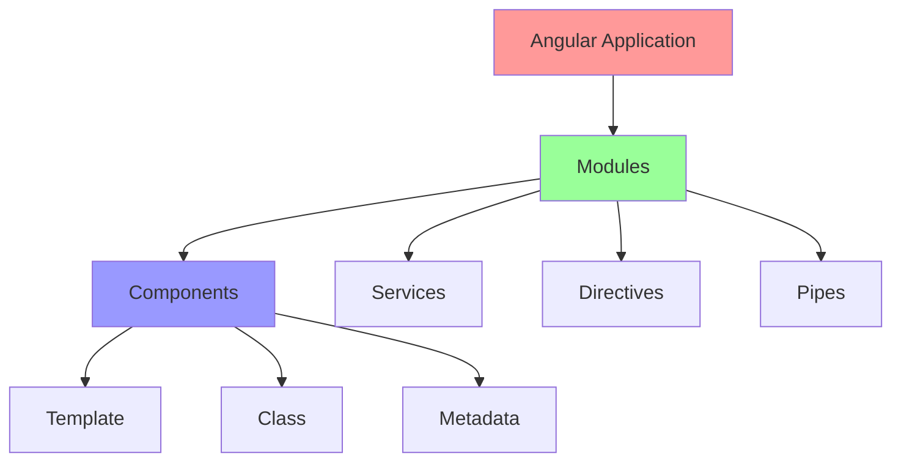
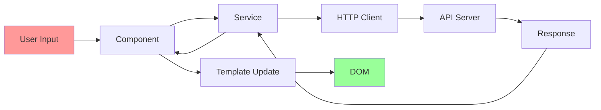

# บทที่ 1: Angular Introduction

## 🎯 จุดประสงค์การเรียนรู้

เมื่อเสร็จสิ้นบทเรียนนี้ คุณจะสามารถ:
- เข้าใจ Angular คืออะไร และทำไมถึงนิยม
- รู้ความแตกต่างระหว่าง AngularJS และ Angular
- เข้าใจ Architecture และ Core Concepts ของ Angular
- เปรียบเทียบ Angular กับ Frameworks อื่น
- เตรียมพร้อมสำหรับการเรียนรู้ Angular

## 📚 Angular คืออะไร?

Angular เป็น **open-source web application framework** ที่พัฒนาโดย Google สำหรับสร้าง **Single Page Applications (SPA)** และ **Progressive Web Apps (PWA)**

### 🌟 คุณสมบัติเด่นของ Angular

#### **1. TypeScript-Based Framework**
```typescript
// Angular ใช้ TypeScript เป็นภาษาหลัก
import { Component } from '@angular/core';

@Component({
  selector: 'app-hello',
  template: `<h1>Hello {{name}}!</h1>`
})
export class HelloComponent {
  name: string = 'Angular';
}
```

#### **2. Component-Based Architecture**
- **Modular Design**: แบ่งแอปพลิเคชันเป็น Components เล็กๆ
- **Reusable**: สามารถนำ Components กลับมาใช้ใหม่ได้
- **Maintainable**: ง่ายต่อการดูแลและแก้ไข

#### **3. Powerful CLI (Command Line Interface)**
```bash
# สร้างโปรเจกต์ใหม่
ng new my-app

# สร้าง Component
ng generate component user

# รันเซิร์ฟเวอร์สำหรับ Development
ng serve

# Build สำหรับ Production
ng build --prod
```

#### **4. Dependency Injection**
```typescript
// Service injection ทำให้จัดการ dependencies ง่าย
import { Injectable } from '@angular/core';

@Injectable({
  providedIn: 'root'
})
export class UserService {
  getUsers() {
    return ['John', 'Jane', 'Bob'];
  }
}
```

## 🔄 ประวัติและวิวัฒนาการ

### **AngularJS (2010-2018)**
- เวอร์ชันแรกที่ใช้ JavaScript
- Two-way data binding revolutionary
- MVC pattern
- ปัญหา: Performance และ Mobile support

### **Angular 2+ (2016-ปัจจุบัน)**
- **Complete Rewrite**: เขียนใหม่ทั้งหมด
- **TypeScript**: เปลี่ยนมาใช้ TypeScript
- **Mobile-First**: ออกแบบสำหรับ Mobile
- **Better Performance**: ระบบ Change Detection ใหม่

### **การตั้งชื่อ**
```
AngularJS = Angular 1.x (Legacy)
Angular   = Angular 2+ (Modern)
```

## 🏗️ Angular Architecture

### **Core Building Blocks**



#### **1. Components**
```typescript
// Component = Template + Class + Metadata
@Component({                    // Metadata (Decorator)
  selector: 'app-user-list',    // CSS Selector
  templateUrl: './user-list.component.html',  // Template
  styleUrls: ['./user-list.component.css']    // Styles
})
export class UserListComponent { // Class
  users: string[] = ['John', 'Jane'];
  
  addUser(name: string) {
    this.users.push(name);
  }
}
```

#### **2. Templates**
```html
<!-- user-list.component.html -->
<div class="user-container">
  <h2>Users List</h2>
  
  <!-- Data Binding -->
  <p>Total Users: {{users.length}}</p>
  
  <!-- Event Binding -->
  <button (click)="addUser('New User')">Add User</button>
  
  <!-- Structural Directive -->
  <ul>
    <li *ngFor="let user of users">{{user}}</li>
  </ul>
</div>
```

#### **3. Services และ Dependency Injection**
```typescript
// user.service.ts
@Injectable({
  providedIn: 'root'  // Single instance across app
})
export class UserService {
  private users: User[] = [];
  
  getUsers(): User[] {
    return this.users;
  }
  
  addUser(user: User): void {
    this.users.push(user);
  }
}

// component ที่ใช้ service
export class UserComponent {
  constructor(private userService: UserService) {} // DI
  
  loadUsers() {
    this.users = this.userService.getUsers();
  }
}
```

#### **4. Modules**
```typescript
// app.module.ts
@NgModule({
  declarations: [    // Components, Directives, Pipes
    AppComponent,
    UserListComponent,
    UserCardComponent
  ],
  imports: [         // Other modules
    BrowserModule,
    FormsModule,
    HttpClientModule
  ],
  providers: [       // Services
    UserService,
    { provide: API_URL, useValue: 'https://api.example.com' }
  ],
  bootstrap: [AppComponent]  // Root component
})
export class AppModule {}
```

## 🔧 Angular Framework Overview

### **Data Flow Architecture**



### **Key Concepts**

#### **1. Data Binding**
```typescript
// Component
export class DataBindingExample {
  message = 'Hello Angular';
  isVisible = true;
  inputValue = '';
  
  onClick() {
    console.log('Button clicked!');
  }
}
```

```html
<!-- Template -->
<!-- Interpolation -->
<h1>{{message}}</h1>

<!-- Property Binding -->


<!-- Event Binding -->
<button (click)="onClick()">Click Me</button>

<!-- Two-way Binding -->
<input [(ngModel)]="inputValue">
<p>You typed: {{inputValue}}</p>
```

#### **2. Directives**
```html
<!-- Structural Directives -->
<div *ngIf="isLoggedIn">Welcome User!</div>

<ul>
  <li *ngFor="let item of items; index as i">
    {{i + 1}}. {{item.name}}
  </li>
</ul>

<div [ngSwitch]="userRole">
  <p *ngSwitchCase="'admin'">Admin Panel</p>
  <p *ngSwitchCase="'user'">User Dashboard</p>
  <p *ngSwitchDefault>Guest Mode</p>
</div>

<!-- Attribute Directives -->
<p [ngClass]="{'active': isActive, 'disabled': !isEnabled}">
  Dynamic Classes
</p>

<div [ngStyle]="{'color': textColor, 'font-size': fontSize + 'px'}">
  Dynamic Styles
</div>
```

#### **3. Pipes**
```html
<!-- Built-in Pipes -->
<p>Today: {{today | date:'fullDate'}}</p>
<p>Price: {{product.price | currency:'THB'}}</p>
<p>Name: {{user.name | uppercase}}</p>
<p>Description: {{description | slice:0:100}}</p>

<!-- Custom Pipe -->
<p>Phone: {{phoneNumber | phoneFormat}}</p>
```

```typescript
// Custom Pipe
@Pipe({name: 'phoneFormat'})
export class PhoneFormatPipe implements PipeTransform {
  transform(value: string): string {
    return value.replace(/(\d{3})(\d{3})(\d{4})/, '($1) $2-$3');
  }
}
```

## 🆚 Angular vs Other Frameworks

### **Angular vs React**

| Feature | Angular | React |
|---------|---------|-------|
| **Type** | Full Framework | Library |
| **Language** | TypeScript (default) | JavaScript/JSX |
| **Learning Curve** | Steep | Moderate |
| **Architecture** | Opinionated | Flexible |
| **Data Binding** | Two-way | One-way |
| **Mobile** | Ionic/NativeScript | React Native |
| **CLI** | Powerful Built-in | Create React App |
| **State Management** | Built-in/NgRx | Redux/Context |

```typescript
// Angular Component
@Component({
  selector: 'app-counter',
  template: `
    <div>
      <p>Count: {{count}}</p>
      <button (click)="increment()">+</button>
      <button (click)="decrement()">-</button>
    </div>
  `
})
export class CounterComponent {
  count = 0;
  
  increment() { this.count++; }
  decrement() { this.count--; }
}
```

```jsx
// React Component
function Counter() {
  const [count, setCount] = useState(0);
  
  return (
    <div>
      <p>Count: {count}</p>
      <button onClick={() => setCount(count + 1)}>+</button>
      <button onClick={() => setCount(count - 1)}>-</button>
    </div>
  );
}
```

### **Angular vs Vue.js**

| Feature | Angular | Vue.js |
|---------|---------|--------|
| **Complexity** | Complex | Simple |
| **Bundle Size** | Large | Small |
| **Performance** | Good | Excellent |
| **TypeScript** | Native | Optional |
| **Templates** | HTML + Angular syntax | HTML-based |
| **Learning** | Hard | Easy |

## 🌍 Angular Ecosystem

### **Official Libraries**
```bash
# Angular Material - UI Components
ng add @angular/material

# Angular Universal - SSR
ng add @nguniversal/express-engine

# Angular PWA - Progressive Web App
ng add @angular/pwa

# Angular DevKit - Build tools
npm install @angular-devkit/build-angular
```

### **Popular Third-party Libraries**
```json
{
  "dependencies": {
    "@ngrx/store": "^15.0.0",           // State Management
    "@ngrx/effects": "^15.0.0",         // Side Effects
    "rxjs": "^7.5.0",                   // Reactive Programming
    "lodash": "^4.17.21",               // Utility Functions
    "moment": "^2.29.4",                // Date manipulation
    "chart.js": "^4.0.0",               // Charts
    "ng2-charts": "^4.0.0",             // Angular Charts wrapper
    "ngx-bootstrap": "^10.0.0",         // Bootstrap Components
    "primeng": "^15.0.0",               // UI Components
    "ag-grid-angular": "^28.0.0"        // Data Grid
  }
}
```

## 🎯 เมื่อไหร่ควรใช้ Angular?

### **✅ เหมาะสำหรับ:**

#### **1. Enterprise Applications**
```typescript
// Large-scale applications with complex requirements
@NgModule({
  imports: [
    FeatureModule1,
    FeatureModule2,
    FeatureModule3,
    // ... many modules
  ]
})
export class AppModule {}
```

#### **2. Long-term Projects**
- **Stability**: Google backing และ LTS versions
- **Consistency**: Opinionated structure
- **Team Development**: Clear patterns และ conventions

#### **3. TypeScript Projects**
```typescript
// Strong typing benefits
interface User {
  id: number;
  name: string;
  email: string;
  roles: Role[];
}

class UserService {
  getUser(id: number): Observable<User> {
    return this.http.get<User>(`/api/users/${id}`);
  }
}
```

#### **4. Progressive Web Apps**
```typescript
// Built-in PWA support
import { SwUpdate } from '@angular/service-worker';

@Component({...})
export class AppComponent {
  constructor(private swUpdate: SwUpdate) {
    if (swUpdate.isEnabled) {
      swUpdate.available.subscribe(() => {
        if (confirm('New version available. Load?')) {
          window.location.reload();
        }
      });
    }
  }
}
```

### **❌ อาจไม่เหมาะสำหรับ:**

1. **Simple Websites**: เว็บไซต์ง่ายๆ ที่ไม่ต้องการ SPA
2. **Quick Prototypes**: การสร้าง prototype เร็วๆ
3. **Small Teams**: ทีมเล็กที่ต้องการความยืดหยุ่น
4. **Performance-Critical**: แอปที่ต้องการ bundle size เล็กมาก

## 🚀 Angular Features Overview

### **Modern Web Development Features**

#### **1. Reactive Programming with RxJS**
```typescript
// Observable streams
this.searchTerm$
  .pipe(
    debounceTime(300),
    distinctUntilChanged(),
    switchMap(term => this.searchService.search(term)),
    takeUntil(this.destroy$)
  )
  .subscribe(results => {
    this.searchResults = results;
  });
```

#### **2. Powerful Forms**
```typescript
// Reactive Forms
this.userForm = this.fb.group({
  name: ['', [Validators.required, Validators.minLength(2)]],
  email: ['', [Validators.required, Validators.email]],
  age: ['', [Validators.required, Validators.min(18)]],
  address: this.fb.group({
    street: [''],
    city: [''],
    zipCode: ['', Validators.pattern(/^\d{5}$/)]
  })
});
```

#### **3. Advanced Routing**
```typescript
// Feature-rich routing
const routes: Routes = [
  {
    path: 'users',
    loadChildren: () => import('./users/users.module').then(m => m.UsersModule),
    canActivate: [AuthGuard],
    data: { title: 'Users Management' }
  },
  {
    path: 'profile/:id',
    component: ProfileComponent,
    resolve: { user: UserResolver },
    canDeactivate: [CanDeactivateGuard]
  }
];
```

#### **4. HTTP Interceptors**
```typescript
// Global HTTP handling
@Injectable()
export class AuthInterceptor implements HttpInterceptor {
  intercept(req: HttpRequest<any>, next: HttpHandler): Observable<HttpEvent<any>> {
    const authToken = this.auth.getToken();
    const authReq = req.clone({
      headers: req.headers.set('Authorization', `Bearer ${authToken}`)
    });
    
    return next.handle(authReq).pipe(
      catchError(error => {
        if (error.status === 401) {
          this.router.navigate(['/login']);
        }
        return throwError(error);
      })
    );
  }
}
```

## 📊 Performance Features

### **1. Change Detection Strategy**
```typescript
@Component({
  selector: 'app-user-card',
  changeDetection: ChangeDetectionStrategy.OnPush,
  template: `
    <div class="user-card">
      <h3>{{user.name}}</h3>
      <p>{{user.email}}</p>
    </div>
  `
})
export class UserCardComponent {
  @Input() user: User;
}
```

### **2. Lazy Loading**
```typescript
// Route-based code splitting
const routes: Routes = [
  {
    path: 'admin',
    loadChildren: () => import('./admin/admin.module').then(m => m.AdminModule)
  }
];
```

### **3. Tree Shaking**
```typescript
// Dead code elimination
import { Component } from '@angular/core';  // Only import what you need
// เมื่อ build, Angular จะเอาเฉพาะ code ที่ใช้งานจริง
```

## 🎓 แบบฝึกหัด

### **Exercise 1: Angular Concept Map**
สร้าง Mind Map ที่แสดงความสัมพันธ์ระหว่าง:
- Components
- Services
- Modules
- Templates
- Data Binding

### **Exercise 2: Framework Comparison**
เปรียบเทียบ Angular กับ Framework ที่คุณเคยใช้:
1. Architecture differences
2. Learning curve
3. Performance considerations
4. Use case scenarios

### **Exercise 3: Use Case Analysis**
วิเคราะห์ว่า Angular เหมาะกับโปรเจกต์ประเภทไหนบ้าง:
1. E-commerce website
2. Social media app
3. Dashboard/Admin panel
4. Mobile app
5. Corporate website

## 🧪 Quiz

### **Question 1**
Angular เป็น:
- a) Library
- b) Framework
- c) Programming Language
- d) Database

### **Question 2**
ข้อไหนคือความแตกต่างหลักระหว่าง AngularJS และ Angular?
- a) AngularJS ใช้ JavaScript, Angular ใช้ TypeScript
- b) AngularJS เป็น MVC, Angular เป็น Component-based
- c) AngularJS ไม่รองรับ Mobile, Angular รองรับ
- d) ทุกข้อถูก

### **Question 3**
Building Block หลักของ Angular ประกอบด้วย:
- a) Components เท่านั้น
- b) Components และ Services
- c) Components, Services, Modules, Directives, Pipes
- d) HTML และ CSS เท่านั้น

**คำตอบ: 1-b, 2-d, 3-c**

## 📝 สรุป

ในบทนี้เราได้เรียนรู้:

### **🎯 Key Takeaways**
1. **Angular คือ Framework** ที่สมบูรณ์สำหรับ web development
2. **TypeScript-based** ให้ type safety และ better tooling
3. **Component-based Architecture** ทำให้ code มี structure และ reusable
4. **Powerful CLI** ช่วยในการพัฒนาและ build
5. **Rich Ecosystem** มี libraries และ tools มากมาย

### **📚 ความรู้ที่ได้**
- ประวัติและวิวัฒนาการของ Angular
- Core concepts และ building blocks
- การเปรียบเทียบกับ frameworks อื่น
- Use cases ที่เหมาะสมกับ Angular
- Features และ capabilities ของ Angular

### **🚀 Next Steps**
ในบทต่อไป เราจะเรียนรู้การติดตั้งและ setup development environment สำหรับ Angular development

---

**🎉 ยินดีด้วย! คุณได้เข้าใจพื้นฐานของ Angular แล้ว**

ต่อไปเราจะมาเรียนรู้การ setup environment กันในบทที่ 2!

**[➡️ ไปบทที่ 2: Development Environment Setup](./02-development-environment-setup.md)**
