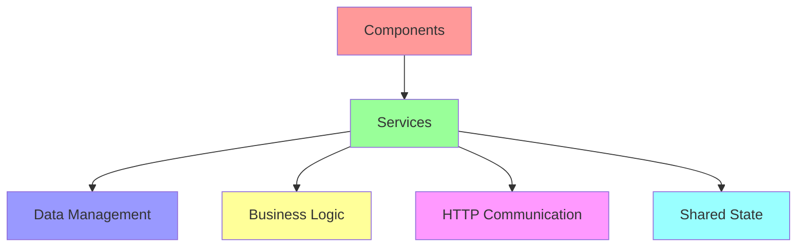

# บทที่ 7: Services and Dependency Injection

## 🎯 จุดประสงค์การเรียนรู้

เมื่อเสร็จสิ้นบทเรียนนี้ คุณจะสามารถ:
- เข้าใจ Services และ Dependency Injection ใน Angular
- สร้างและใช้งาน Services อย่างมีประสิทธิภาพ
- จัดการ Service Lifecycle และ Scoping
- ใช้ Services สำหรับ Data Sharing และ Communication
- ใช้ Injection Tokens และ Provider Configuration

## 🏗️ Services Overview

Services เป็น classes ที่ให้บริการข้อมูลและฟังก์ชันที่สามารถแบ่งปันได้ระหว่าง components

### **Why Use Services?**


## 🔧 Creating Basic Services

### **Simple Data Service**
```typescript
// user.service.ts
import { Injectable } from '@angular/core';
import { BehaviorSubject, Observable } from 'rxjs';

export interface User {
  id: number;
  name: string;
  email: string;
  role: string;
  isActive: boolean;
  avatar?: string;
}

@Injectable({
  providedIn: 'root'  // This makes it a singleton service
})
export class UserService {
  private users: User[] = [
    {
      id: 1,
      name: 'John Doe',
      email: 'john@example.com',
      role: 'Admin',
      isActive: true,
      avatar: 'https://ui-avatars.com/api/?name=John+Doe&background=007bff&color=fff'
    },
    {
      id: 2,
      name: 'Jane Smith',
      email: 'jane@example.com',
      role: 'User',
      isActive: true,
      avatar: 'https://ui-avatars.com/api/?name=Jane+Smith&background=28a745&color=fff'
    },
    {
      id: 3,
      name: 'Bob Johnson',
      email: 'bob@example.com',
      role: 'Manager',
      isActive: false,
      avatar: 'https://ui-avatars.com/api/?name=Bob+Johnson&background=dc3545&color=fff'
    }
  ];
  
  // BehaviorSubject to emit user changes
  private usersSubject = new BehaviorSubject<User[]>(this.users);
  public users$ = this.usersSubject.asObservable();
  
  // Current user subject
  private currentUserSubject = new BehaviorSubject<User | null>(null);
  public currentUser$ = this.currentUserSubject.asObservable();
  
  constructor() {
    console.log('UserService instantiated');
  }
  
  // CRUD Operations
  getAllUsers(): Observable<User[]> {
    return this.users$;
  }
  
  getUserById(id: number): User | undefined {
    return this.users.find(user => user.id === id);
  }
  
  addUser(user: Omit<User, 'id'>): User {
    const newUser: User = {
      ...user,
      id: this.generateId()
    };
    
    this.users.push(newUser);
    this.usersSubject.next([...this.users]);
    
    return newUser;
  }
  
  updateUser(id: number, updates: Partial<User>): User | null {
    const userIndex = this.users.findIndex(user => user.id === id);
    
    if (userIndex !== -1) {
      this.users[userIndex] = { ...this.users[userIndex], ...updates };
      this.usersSubject.next([...this.users]);
      
      // Update current user if it's the same user
      if (this.currentUserSubject.value?.id === id) {
        this.currentUserSubject.next(this.users[userIndex]);
      }
      
      return this.users[userIndex];
    }
    
    return null;
  }
  
  deleteUser(id: number): boolean {
    const initialLength = this.users.length;
    this.users = this.users.filter(user => user.id !== id);
    
    if (this.users.length < initialLength) {
      this.usersSubject.next([...this.users]);
      
      // Clear current user if deleted
      if (this.currentUserSubject.value?.id === id) {
        this.currentUserSubject.next(null);
      }
      
      return true;
    }
    
    return false;
  }
  
  // Authentication methods
  login(email: string, password: string): Observable<User | null> {
    // Simulate login logic
    const user = this.users.find(u => u.email === email && u.isActive);
    
    if (user) {
      this.currentUserSubject.next(user);
      return new BehaviorSubject(user).asObservable();
    }
    
    return new BehaviorSubject(null).asObservable();
  }
  
  logout(): void {
    this.currentUserSubject.next(null);
  }
  
  getCurrentUser(): User | null {
    return this.currentUserSubject.value;
  }
  
  isLoggedIn(): boolean {
    return this.currentUserSubject.value !== null;
  }
  
  // Utility methods
  private generateId(): number {
    return Math.max(...this.users.map(u => u.id), 0) + 1;
  }
  
  getUsersByRole(role: string): User[] {
    return this.users.filter(user => user.role === role);
  }
  
  getActiveUsers(): User[] {
    return this.users.filter(user => user.isActive);
  }
  
  searchUsers(query: string): User[] {
    const lowercaseQuery = query.toLowerCase();
    return this.users.filter(user =>
      user.name.toLowerCase().includes(lowercaseQuery) ||
      user.email.toLowerCase().includes(lowercaseQuery)
    );
  }
}
```

### **Using Service in Component**
```typescript
// user-list.component.ts
import { Component, OnInit, OnDestroy } from '@angular/core';
import { Subscription } from 'rxjs';
import { UserService, User } from '../services/user.service';

@Component({
  selector: 'app-user-list',
  template: `
    <div class="user-list-container">
      <div class="header">
        <h3>User Management</h3>
        <div class="stats">
          <span class="stat">Total: {{users.length}}</span>
          <span class="stat">Active: {{getActiveUsersCount()}}</span>
          <span class="stat">Roles: {{getRolesCount()}}</span>
        </div>
      </div>
      
      <div class="controls">
        <input [(ngModel)]="searchQuery" 
               (input)="onSearch()"
               placeholder="Search users..."
               class="search-input">
        
        <select [(ngModel)]="roleFilter" (change)="onRoleFilterChange()">
          <option value="">All Roles</option>
          <option value="Admin">Admin</option>
          <option value="Manager">Manager</option>
          <option value="User">User</option>
        </select>
        
        <button (click)="showAddUserForm = !showAddUserForm" class="btn-primary">
          {{showAddUserForm ? 'Cancel' : 'Add User'}}
        </button>
      </div>
      
      <!-- Add User Form -->
      <div class="add-user-form" *ngIf="showAddUserForm">
        <h4>Add New User</h4>
        <form (submit)="onAddUser($event)">
          <input [(ngModel)]="newUser.name" 
                 name="name" 
                 placeholder="Name" 
                 required>
          <input [(ngModel)]="newUser.email" 
                 name="email" 
                 type="email" 
                 placeholder="Email" 
                 required>
          <select [(ngModel)]="newUser.role" name="role" required>
            <option value="">Select Role</option>
            <option value="Admin">Admin</option>
            <option value="Manager">Manager</option>
            <option value="User">User</option>
          </select>
          <label>
            <input type="checkbox" [(ngModel)]="newUser.isActive" name="isActive">
            Active
          </label>
          <button type="submit" [disabled]="!isFormValid()">Add User</button>
        </form>
      </div>
      
      <!-- User List -->
      <div class="user-grid">
        <div *ngFor="let user of filteredUsers" class="user-card">
          <div class="user-avatar">
            
            <span class="status-indicator" [class.active]="user.isActive"></span>
          </div>
          
          <div class="user-info">
            <h4>{{user.name}}</h4>
            <p class="email">{{user.email}}</p>
            <span class="role" [class]="'role-' + user.role.toLowerCase()">
              {{user.role}}
            </span>
          </div>
          
          <div class="user-actions">
            <button (click)="onEditUser(user)" class="btn-edit">Edit</button>
            <button (click)="onToggleStatus(user)" 
                    [class]="user.isActive ? 'btn-warning' : 'btn-success'">
              {{user.isActive ? 'Deactivate' : 'Activate'}}
            </button>
            <button (click)="onDeleteUser(user)" class="btn-danger">Delete</button>
          </div>
        </div>
      </div>
      
      <!-- Empty State -->
      <div *ngIf="filteredUsers.length === 0" class="empty-state">
        <h4>No users found</h4>
        <p>{{searchQuery ? 'Try adjusting your search criteria' : 'Add some users to get started'}}</p>
      </div>
    </div>
  `,
  styles: [`
    .user-list-container {
      padding: 20px;
      max-width: 1200px;
      margin: 0 auto;
    }
    
    .header {
      display: flex;
      justify-content: space-between;
      align-items: center;
      margin-bottom: 20px;
      padding-bottom: 15px;
      border-bottom: 2px solid #e9ecef;
    }
    
    .stats {
      display: flex;
      gap: 20px;
    }
    
    .stat {
      background: #f8f9fa;
      padding: 8px 16px;
      border-radius: 20px;
      font-size: 14px;
      font-weight: 600;
      color: #495057;
    }
    
    .controls {
      display: flex;
      gap: 15px;
      margin-bottom: 20px;
      align-items: center;
      flex-wrap: wrap;
    }
    
    .search-input {
      flex: 1;
      min-width: 250px;
      padding: 10px 15px;
      border: 1px solid #ddd;
      border-radius: 6px;
      font-size: 14px;
    }
    
    .add-user-form {
      background: #f8f9fa;
      padding: 20px;
      border-radius: 8px;
      margin-bottom: 20px;
    }
    
    .add-user-form form {
      display: grid;
      grid-template-columns: repeat(auto-fit, minmax(200px, 1fr));
      gap: 15px;
      align-items: end;
    }
    
    .add-user-form input,
    .add-user-form select {
      padding: 8px 12px;
      border: 1px solid #ddd;
      border-radius: 4px;
    }
    
    .user-grid {
      display: grid;
      grid-template-columns: repeat(auto-fill, minmax(350px, 1fr));
      gap: 20px;
    }
    
    .user-card {
      background: white;
      border: 1px solid #ddd;
      border-radius: 8px;
      padding: 20px;
      transition: transform 0.2s, box-shadow 0.2s;
    }
    
    .user-card:hover {
      transform: translateY(-2px);
      box-shadow: 0 4px 12px rgba(0,0,0,0.1);
    }
    
    .user-avatar {
      position: relative;
      width: 60px;
      margin: 0 auto 15px;
    }
    
    .user-avatar img {
      width: 60px;
      height: 60px;
      border-radius: 50%;
      border: 3px solid #e9ecef;
    }
    
    .status-indicator {
      position: absolute;
      bottom: 0;
      right: 0;
      width: 16px;
      height: 16px;
      border-radius: 50%;
      background: #dc3545;
      border: 2px solid white;
    }
    
    .status-indicator.active {
      background: #28a745;
    }
    
    .user-info {
      text-align: center;
      margin-bottom: 15px;
    }
    
    .user-info h4 {
      margin: 0 0 5px 0;
      color: #333;
    }
    
    .email {
      margin: 0 0 10px 0;
      color: #666;
      font-size: 14px;
    }
    
    .role {
      display: inline-block;
      padding: 4px 12px;
      border-radius: 12px;
      font-size: 12px;
      font-weight: 600;
      text-transform: uppercase;
    }
    
    .role-admin {
      background: #dc3545;
      color: white;
    }
    
    .role-manager {
      background: #fd7e14;
      color: white;
    }
    
    .role-user {
      background: #28a745;
      color: white;
    }
    
    .user-actions {
      display: flex;
      gap: 8px;
      justify-content: center;
    }
    
    .user-actions button {
      padding: 6px 12px;
      border: none;
      border-radius: 4px;
      font-size: 12px;
      cursor: pointer;
      transition: background-color 0.2s;
    }
    
    .btn-edit {
      background: #007bff;
      color: white;
    }
    
    .btn-warning {
      background: #ffc107;
      color: #212529;
    }
    
    .btn-success {
      background: #28a745;
      color: white;
    }
    
    .btn-danger {
      background: #dc3545;
      color: white;
    }
    
    .btn-primary {
      background: #007bff;
      color: white;
      padding: 10px 20px;
      border: none;
      border-radius: 4px;
      cursor: pointer;
    }
    
    .empty-state {
      text-align: center;
      padding: 60px 20px;
      color: #666;
    }
    
    select {
      padding: 10px;
      border: 1px solid #ddd;
      border-radius: 4px;
      background: white;
    }
  `]
})
export class UserListComponent implements OnInit, OnDestroy {
  users: User[] = [];
  filteredUsers: User[] = [];
  searchQuery = '';
  roleFilter = '';
  showAddUserForm = false;
  
  newUser = {
    name: '',
    email: '',
    role: '',
    isActive: true
  };
  
  private subscription = new Subscription();
  
  constructor(private userService: UserService) {}
  
  ngOnInit(): void {
    // Subscribe to users observable
    this.subscription.add(
      this.userService.users$.subscribe(users => {
        this.users = users;
        this.applyFilters();
      })
    );
  }
  
  ngOnDestroy(): void {
    this.subscription.unsubscribe();
  }
  
  onSearch(): void {
    this.applyFilters();
  }
  
  onRoleFilterChange(): void {
    this.applyFilters();
  }
  
  applyFilters(): void {
    let filtered = this.users;
    
    // Apply search filter
    if (this.searchQuery.trim()) {
      filtered = this.userService.searchUsers(this.searchQuery);
    }
    
    // Apply role filter
    if (this.roleFilter) {
      filtered = filtered.filter(user => user.role === this.roleFilter);
    }
    
    this.filteredUsers = filtered;
  }
  
  onAddUser(event: Event): void {
    event.preventDefault();
    
    if (this.isFormValid()) {
      this.userService.addUser(this.newUser);
      this.resetForm();
      this.showAddUserForm = false;
    }
  }
  
  onEditUser(user: User): void {
    // Implement edit functionality
    const newName = prompt('Enter new name:', user.name);
    if (newName && newName.trim()) {
      this.userService.updateUser(user.id, { name: newName.trim() });
    }
  }
  
  onToggleStatus(user: User): void {
    this.userService.updateUser(user.id, { isActive: !user.isActive });
  }
  
  onDeleteUser(user: User): void {
    if (confirm(`Are you sure you want to delete ${user.name}?`)) {
      this.userService.deleteUser(user.id);
    }
  }
  
  getActiveUsersCount(): number {
    return this.users.filter(user => user.isActive).length;
  }
  
  getRolesCount(): number {
    const roles = new Set(this.users.map(user => user.role));
    return roles.size;
  }
  
  isFormValid(): boolean {
    return !!(this.newUser.name.trim() && 
              this.newUser.email.trim() && 
              this.newUser.role);
  }
  
  private resetForm(): void {
    this.newUser = {
      name: '',
      email: '',
      role: '',
      isActive: true
    };
  }
}
```

## 💉 Dependency Injection Deep Dive

### **Understanding DI Hierarchy**
```typescript
// App-level service (Singleton)
@Injectable({
  providedIn: 'root'
})
export class AppConfigService {
  private config = {
    apiUrl: 'https://api.example.com',
    version: '1.0.0',
    features: {
      enableNotifications: true,
      enableAnalytics: false
    }
  };
  
  getConfig() {
    return this.config;
  }
  
  updateConfig(updates: Partial<typeof this.config>): void {
    this.config = { ...this.config, ...updates };
  }
}

// Module-level service
@Injectable()
export class FeatureService {
  constructor(private appConfig: AppConfigService) {}
  
  isFeatureEnabled(feature: keyof typeof this.appConfig.getConfig().features): boolean {
    return this.appConfig.getConfig().features[feature];
  }
}

// Component-level service
@Injectable()
export class ComponentStateService {
  private state = new BehaviorSubject<any>({});
  
  updateState(newState: any): void {
    this.state.next(newState);
  }
  
  getState(): Observable<any> {
    return this.state.asObservable();
  }
}
```

### **Provider Configuration**
```typescript
// app.module.ts
@NgModule({
  declarations: [
    AppComponent,
    UserListComponent
  ],
  imports: [
    BrowserModule,
    FormsModule,
    HttpClientModule
  ],
  providers: [
    // Class provider (default)
    UserService,
    
    // Explicit class provider
    { provide: FeatureService, useClass: FeatureService },
    
    // Factory provider
    {
      provide: 'API_CONFIG',
      useFactory: (config: AppConfigService) => {
        return {
          baseUrl: config.getConfig().apiUrl,
          timeout: 5000
        };
      },
      deps: [AppConfigService]
    },
    
    // Value provider
    { provide: 'API_URL', useValue: 'https://api.example.com' },
    
    // Existing provider (alias)
    { provide: 'USER_SERVICE', useExisting: UserService },
    
    // Conditional provider
    {
      provide: LoggerService,
      useClass: environment.production ? ProductionLoggerService : DevLoggerService
    }
  ],
  bootstrap: [AppComponent]
})
export class AppModule {}
```

### **Injection Tokens**
```typescript
// Creating injection tokens
import { InjectionToken } from '@angular/core';

// Simple value token
export const API_URL = new InjectionToken<string>('api.url');

// Configuration object token
export interface ApiConfig {
  baseUrl: string;
  timeout: number;
  retries: number;
}

export const API_CONFIG = new InjectionToken<ApiConfig>('api.config');

// Function token
export const HTTP_INTERCEPTOR_FACTORY = new InjectionToken<() => HttpInterceptor>(
  'http.interceptor.factory'
);

// Using tokens in components
@Component({
  selector: 'app-api-demo',
  template: `
    <div>
      <h3>API Configuration</h3>
      <p>Base URL: {{apiUrl}}</p>
      <p>Timeout: {{apiConfig.timeout}}ms</p>
      <p>Retries: {{apiConfig.retries}}</p>
    </div>
  `
})
export class ApiDemoComponent {
  constructor(
    @Inject(API_URL) public apiUrl: string,
    @Inject(API_CONFIG) public apiConfig: ApiConfig
  ) {}
}

// Providing tokens
@NgModule({
  providers: [
    { provide: API_URL, useValue: 'https://api.production.com' },
    {
      provide: API_CONFIG,
      useValue: {
        baseUrl: 'https://api.production.com',
        timeout: 10000,
        retries: 3
      }
    }
  ]
})
export class AppModule {}
```

## 🔄 Advanced Service Patterns

### **Service Communication Hub**
```typescript
// notification.service.ts
export interface Notification {
  id: string;
  type: 'success' | 'error' | 'warning' | 'info';
  title: string;
  message: string;
  duration?: number;
  timestamp: Date;
}

@Injectable({
  providedIn: 'root'
})
export class NotificationService {
  private notifications$ = new BehaviorSubject<Notification[]>([]);
  private maxNotifications = 5;
  
  getNotifications(): Observable<Notification[]> {
    return this.notifications$.asObservable();
  }
  
  show(notification: Omit<Notification, 'id' | 'timestamp'>): string {
    const id = this.generateId();
    const newNotification: Notification = {
      ...notification,
      id,
      timestamp: new Date(),
      duration: notification.duration || 5000
    };
    
    const current = this.notifications$.value;
    const updated = [newNotification, ...current].slice(0, this.maxNotifications);
    this.notifications$.next(updated);
    
    // Auto-remove after duration
    if (newNotification.duration > 0) {
      setTimeout(() => {
        this.remove(id);
      }, newNotification.duration);
    }
    
    return id;
  }
  
  success(title: string, message: string, duration?: number): string {
    return this.show({ type: 'success', title, message, duration });
  }
  
  error(title: string, message: string, duration?: number): string {
    return this.show({ type: 'error', title, message, duration });
  }
  
  warning(title: string, message: string, duration?: number): string {
    return this.show({ type: 'warning', title, message, duration });
  }
  
  info(title: string, message: string, duration?: number): string {
    return this.show({ type: 'info', title, message, duration });
  }
  
  remove(id: string): void {
    const current = this.notifications$.value;
    const updated = current.filter(n => n.id !== id);
    this.notifications$.next(updated);
  }
  
  clear(): void {
    this.notifications$.next([]);
  }
  
  private generateId(): string {
    return Math.random().toString(36).substr(2, 9);
  }
}

// event-bus.service.ts
@Injectable({
  providedIn: 'root'
})
export class EventBusService {
  private eventSubject = new Subject<{ type: string; payload?: any }>();
  
  emit(type: string, payload?: any): void {
    this.eventSubject.next({ type, payload });
  }
  
  on(type: string): Observable<any> {
    return this.eventSubject.asObservable().pipe(
      filter(event => event.type === type),
      map(event => event.payload)
    );
  }
  
  // Specific event methods
  emitUserLoggedIn(user: User): void {
    this.emit('user:logged-in', user);
  }
  
  emitUserLoggedOut(): void {
    this.emit('user:logged-out');
  }
  
  emitDataUpdated(dataType: string, data: any): void {
    this.emit('data:updated', { dataType, data });
  }
  
  onUserLoggedIn(): Observable<User> {
    return this.on('user:logged-in');
  }
  
  onUserLoggedOut(): Observable<void> {
    return this.on('user:logged-out');
  }
  
  onDataUpdated(): Observable<{ dataType: string; data: any }> {
    return this.on('data:updated');
  }
}
```

### **State Management Service**
```typescript
// state-management.service.ts
export interface AppState {
  user: User | null;
  notifications: Notification[];
  loading: boolean;
  error: string | null;
  theme: 'light' | 'dark';
  language: string;
}

@Injectable({
  providedIn: 'root'
})
export class StateService {
  private initialState: AppState = {
    user: null,
    notifications: [],
    loading: false,
    error: null,
    theme: 'light',
    language: 'en'
  };
  
  private state$ = new BehaviorSubject<AppState>(this.initialState);
  
  // Selectors
  getState(): Observable<AppState> {
    return this.state$.asObservable();
  }
  
  getCurrentState(): AppState {
    return this.state$.value;
  }
  
  getUser(): Observable<User | null> {
    return this.state$.pipe(
      map(state => state.user),
      distinctUntilChanged()
    );
  }
  
  getLoading(): Observable<boolean> {
    return this.state$.pipe(
      map(state => state.loading),
      distinctUntilChanged()
    );
  }
  
  getTheme(): Observable<string> {
    return this.state$.pipe(
      map(state => state.theme),
      distinctUntilChanged()
    );
  }
  
  // Actions
  updateState(updates: Partial<AppState>): void {
    const currentState = this.state$.value;
    const newState = { ...currentState, ...updates };
    this.state$.next(newState);
  }
  
  setUser(user: User | null): void {
    this.updateState({ user });
  }
  
  setLoading(loading: boolean): void {
    this.updateState({ loading });
  }
  
  setError(error: string | null): void {
    this.updateState({ error });
  }
  
  setTheme(theme: 'light' | 'dark'): void {
    this.updateState({ theme });
    localStorage.setItem('app-theme', theme);
  }
  
  setLanguage(language: string): void {
    this.updateState({ language });
    localStorage.setItem('app-language', language);
  }
  
  // Complex actions
  loginUser(user: User): void {
    this.updateState({
      user,
      error: null
    });
  }
  
  logoutUser(): void {
    this.updateState({
      user: null,
      notifications: []
    });
  }
  
  // Persistence
  saveToLocalStorage(): void {
    const state = this.getCurrentState();
    localStorage.setItem('app-state', JSON.stringify({
      theme: state.theme,
      language: state.language
    }));
  }
  
  loadFromLocalStorage(): void {
    const saved = localStorage.getItem('app-state');
    if (saved) {
      try {
        const parsed = JSON.parse(saved);
        this.updateState(parsed);
      } catch (error) {
        console.error('Error loading state from localStorage:', error);
      }
    }
  }
  
  reset(): void {
    this.state$.next(this.initialState);
  }
}
```

### **HTTP Service with Interceptors**
```typescript
// http.service.ts
@Injectable({
  providedIn: 'root'
})
export class HttpService {
  private baseUrl = 'https://api.example.com';
  
  constructor(
    private http: HttpClient,
    private notificationService: NotificationService,
    private stateService: StateService
  ) {}
  
  get<T>(endpoint: string, options?: any): Observable<T> {
    return this.request<T>('GET', endpoint, null, options);
  }
  
  post<T>(endpoint: string, body: any, options?: any): Observable<T> {
    return this.request<T>('POST', endpoint, body, options);
  }
  
  put<T>(endpoint: string, body: any, options?: any): Observable<T> {
    return this.request<T>('PUT', endpoint, body, options);
  }
  
  delete<T>(endpoint: string, options?: any): Observable<T> {
    return this.request<T>('DELETE', endpoint, null, options);
  }
  
  private request<T>(
    method: string,
    endpoint: string,
    body?: any,
    options?: any
  ): Observable<T> {
    const url = `${this.baseUrl}${endpoint}`;
    
    this.stateService.setLoading(true);
    
    const request$ = this.http.request<T>(method, url, {
      body,
      ...options
    });
    
    return request$.pipe(
      tap(() => {
        this.stateService.setLoading(false);
        this.stateService.setError(null);
      }),
      catchError(error => {
        this.stateService.setLoading(false);
        
        const errorMessage = this.getErrorMessage(error);
        this.stateService.setError(errorMessage);
        this.notificationService.error('Request Failed', errorMessage);
        
        return throwError(error);
      })
    );
  }
  
  private getErrorMessage(error: any): string {
    if (error.error?.message) {
      return error.error.message;
    }
    
    if (error.message) {
      return error.message;
    }
    
    switch (error.status) {
      case 0: return 'Network error - please check your connection';
      case 401: return 'Unauthorized - please log in';
      case 403: return 'Forbidden - insufficient permissions';
      case 404: return 'Resource not found';
      case 500: return 'Server error - please try again later';
      default: return 'An unexpected error occurred';
    }
  }
}

// auth.interceptor.ts
@Injectable()
export class AuthInterceptor implements HttpInterceptor {
  constructor(private userService: UserService) {}
  
  intercept(req: HttpRequest<any>, next: HttpHandler): Observable<HttpEvent<any>> {
    const currentUser = this.userService.getCurrentUser();
    
    if (currentUser) {
      // Add authorization header
      const authReq = req.clone({
        headers: req.headers.set('Authorization', `Bearer ${currentUser.token}`)
      });
      
      return next.handle(authReq);
    }
    
    return next.handle(req);
  }
}

// Provide interceptor
@NgModule({
  providers: [
    {
      provide: HTTP_INTERCEPTORS,
      useClass: AuthInterceptor,
      multi: true
    }
  ]
})
export class AppModule {}
```

## 🔧 Service Testing

### **Unit Testing Services**
```typescript
// user.service.spec.ts
describe('UserService', () => {
  let service: UserService;
  
  beforeEach(() => {
    TestBed.configureTestingModule({});
    service = TestBed.inject(UserService);
  });
  
  it('should be created', () => {
    expect(service).toBeTruthy();
  });
  
  it('should add a new user', () => {
    const newUser = {
      name: 'Test User',
      email: 'test@example.com',
      role: 'User',
      isActive: true
    };
    
    const addedUser = service.addUser(newUser);
    
    expect(addedUser.id).toBeDefined();
    expect(addedUser.name).toBe(newUser.name);
    expect(addedUser.email).toBe(newUser.email);
  });
  
  it('should emit users when user is added', (done) => {
    const newUser = {
      name: 'Test User',
      email: 'test@example.com',
      role: 'User',
      isActive: true
    };
    
    service.users$.subscribe(users => {
      if (users.length > 3) { // Initial data has 3 users
        expect(users.length).toBe(4);
        expect(users[3].name).toBe(newUser.name);
        done();
      }
    });
    
    service.addUser(newUser);
  });
  
  it('should update user', () => {
    const userId = 1;
    const updates = { name: 'Updated Name' };
    
    const updatedUser = service.updateUser(userId, updates);
    
    expect(updatedUser).toBeTruthy();
    expect(updatedUser?.name).toBe(updates.name);
  });
  
  it('should delete user', () => {
    const userId = 1;
    
    const result = service.deleteUser(userId);
    const user = service.getUserById(userId);
    
    expect(result).toBe(true);
    expect(user).toBeUndefined();
  });
  
  it('should search users by name', () => {
    const results = service.searchUsers('John');
    
    expect(results.length).toBeGreaterThan(0);
    expect(results[0].name.toLowerCase()).toContain('john');
  });
});
```

### **Integration Testing with HTTP**
```typescript
// http.service.spec.ts
describe('HttpService', () => {
  let service: HttpService;
  let httpMock: HttpTestingController;
  let notificationService: jasmine.SpyObj<NotificationService>;
  let stateService: jasmine.SpyObj<StateService>;
  
  beforeEach(() => {
    const notificationSpy = jasmine.createSpyObj('NotificationService', ['error']);
    const stateSpy = jasmine.createSpyObj('StateService', ['setLoading', 'setError']);
    
    TestBed.configureTestingModule({
      imports: [HttpClientTestingModule],
      providers: [
        { provide: NotificationService, useValue: notificationSpy },
        { provide: StateService, useValue: stateSpy }
      ]
    });
    
    service = TestBed.inject(HttpService);
    httpMock = TestBed.inject(HttpTestingController);
    notificationService = TestBed.inject(NotificationService) as jasmine.SpyObj<NotificationService>;
    stateService = TestBed.inject(StateService) as jasmine.SpyObj<StateService>;
  });
  
  afterEach(() => {
    httpMock.verify();
  });
  
  it('should make GET request', () => {
    const testData = { id: 1, name: 'Test' };
    
    service.get('/test').subscribe(data => {
      expect(data).toEqual(testData);
    });
    
    const req = httpMock.expectOne('https://api.example.com/test');
    expect(req.request.method).toBe('GET');
    req.flush(testData);
    
    expect(stateService.setLoading).toHaveBeenCalledWith(true);
    expect(stateService.setLoading).toHaveBeenCalledWith(false);
  });
  
  it('should handle errors', () => {
    service.get('/error').subscribe(
      () => fail('should have failed'),
      error => {
        expect(error.status).toBe(500);
      }
    );
    
    const req = httpMock.expectOne('https://api.example.com/error');
    req.flush('Server Error', { status: 500, statusText: 'Internal Server Error' });
    
    expect(notificationService.error).toHaveBeenCalled();
    expect(stateService.setError).toHaveBeenCalled();
  });
});
```

## 🧪 แบบฝึกหัด

### **Exercise 1: Product Service**
สร้าง ProductService ที่มี:
1. CRUD operations สำหรับสินค้า
2. Category filtering
3. Search functionality
4. Shopping cart management

### **Exercise 2: Theme Service**
สร้าง ThemeService ที่:
1. จัดการ theme switching
2. บันทึก preference ใน localStorage
3. Emit theme changes ให้ components
4. Support multiple themes

### **Exercise 3: Cache Service**
สร้าง CacheService ที่:
1. Cache HTTP responses
2. Handle cache expiration
3. Clear cache strategies
4. Memory management

## 🧪 Quiz

### **Question 1**
`@Injectable({ providedIn: 'root' })` หมายความว่า:
- a) Service จะถูกสร้างใน root component
- b) Service จะเป็น singleton ในทั้งแอป
- c) Service สามารถใช้ได้เฉพาะใน root module
- d) Service จะถูก inject ใน root element

### **Question 2**
Dependency Injection ใน Angular ช่วย:
- a) เพิ่มความเร็วของแอป
- b) ลดขนาดของ bundle
- c) จัดการ dependencies และ testing
- d) เพิ่ม security

### **Question 3**
BehaviorSubject แตกต่างจาก Subject อย่างไร:
- a) BehaviorSubject เร็วกว่า
- b) BehaviorSubject เก็บค่าล่าสุดและส่งให้ subscriber ใหม่
- c) BehaviorSubject ใช้ memory น้อยกว่า
- d) ไม่มีความแตกต่าง

**คำตอบ: 1-b, 2-c, 3-b**

## 📝 สรุป

ในบทนี้เราได้เรียนรู้:

### **🏗️ Services Fundamentals**
1. **Service Creation** - @Injectable decorator และ basic service structure
2. **Data Management** - CRUD operations และ state management
3. **Observable Patterns** - BehaviorSubject และ data streaming
4. **Service Communication** - inter-component data sharing

### **💉 Dependency Injection**
1. **DI Hierarchy** - root, module, และ component level providers
2. **Provider Configuration** - useClass, useValue, useFactory
3. **Injection Tokens** - type-safe injection
4. **Testing** - mocking และ dependency injection ใน tests

### **🔄 Advanced Patterns**
1. **Service Hub** - centralized communication
2. **State Management** - reactive state patterns
3. **HTTP Services** - API communication และ error handling
4. **Event Bus** - loose coupling between components

### **🔧 Best Practices**
1. **Separation of Concerns** - business logic ใน services
2. **Reactive Programming** - Observable patterns
3. **Error Handling** - graceful error management
4. **Testing Strategy** - unit และ integration testing

### **🎯 Next Steps**
ในบทต่อไป เราจะเรียนรู้เกี่ยวกับ Routing และ Navigation:
- Route configuration
- Route parameters และ query strings
- Guards และ resolvers
- Lazy loading และ code splitting

---

**🎉 ยินดีด้วย! ตอนนี้คุณเข้าใจ Services และ Dependency Injection อย่างลึกซึ้งแล้ว**

**[⬅️ บทที่ 6: Data Binding and Directives](./06-data-binding-and-directives.md) | [➡️ บทที่ 8: Routing and Navigation](./08-routing-and-navigation.md)**
