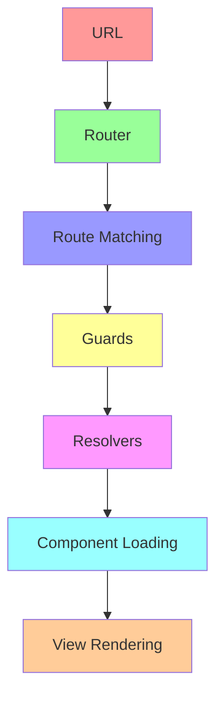

# บทที่ 8: Routing and Navigation

## 🎯 จุดประสงค์การเรียนรู้

เมื่อเสร็จสิ้นบทเรียนนี้ คุณจะสามารถ:
- เข้าใจ Angular Router และ Navigation system
- สร้างและจัดการ Routes อย่างมีประสิทธิภาพ
- ใช้ Route Parameters และ Query Parameters
- ใช้ Guards เพื่อป้องกัน Routes
- ใช้ Resolvers สำหรับ data loading
- ใช้ Lazy Loading สำหรับ performance optimization

## 🗺️ Routing Overview

Angular Router เป็นระบบการนำทางที่ช่วยจัดการ URL และแสดง Components ตาม Routes

### **Router Concepts**


## ⚙️ Basic Routing Setup

### **App Routing Module**
```typescript
// app-routing.module.ts
import { NgModule } from '@angular/core';
import { RouterModule, Routes } from '@angular/router';

// Import components
import { HomeComponent } from './pages/home/home.component';
import { AboutComponent } from './pages/about/about.component';
import { ContactComponent } from './pages/contact/contact.component';
import { UserListComponent } from './users/user-list/user-list.component';
import { UserDetailComponent } from './users/user-detail/user-detail.component';
import { ProductListComponent } from './products/product-list/product-list.component';
import { ProductDetailComponent } from './products/product-detail/product-detail.component';
import { NotFoundComponent } from './shared/not-found/not-found.component';

const routes: Routes = [
  // Default route
  { path: '', redirectTo: '/home', pathMatch: 'full' },
  
  // Basic routes
  { path: 'home', component: HomeComponent },
  { path: 'about', component: AboutComponent },
  { path: 'contact', component: ContactComponent },
  
  // Routes with parameters
  { 
    path: 'users', 
    component: UserListComponent,
    children: [
      { path: ':id', component: UserDetailComponent }
    ]
  },
  
  // Route with multiple parameters
  { path: 'products/:category/:id', component: ProductDetailComponent },
  
  // Route with optional parameters
  { path: 'products/:category', component: ProductListComponent },
  { path: 'products', component: ProductListComponent },
  
  // Wildcard route (must be last)
  { path: '**', component: NotFoundComponent }
];

@NgModule({
  imports: [RouterModule.forRoot(routes, {
    enableTracing: false, // Set to true for debugging
    scrollPositionRestoration: 'enabled',
    anchorScrolling: 'enabled',
    onSameUrlNavigation: 'reload'
  })],
  exports: [RouterModule]
})
export class AppRoutingModule { }
```

### **App Module Configuration**
```typescript
// app.module.ts
import { NgModule } from '@angular/core';
import { BrowserModule } from '@angular/platform-browser';
import { FormsModule, ReactiveFormsModule } from '@angular/forms';
import { HttpClientModule } from '@angular/common/http';

import { AppRoutingModule } from './app-routing.module';
import { AppComponent } from './app.component';

// Page components
import { HomeComponent } from './pages/home/home.component';
import { AboutComponent } from './pages/about/about.component';
import { ContactComponent } from './pages/contact/contact.component';
import { NotFoundComponent } from './shared/not-found/not-found.component';

// Feature components
import { UserListComponent } from './users/user-list/user-list.component';
import { UserDetailComponent } from './users/user-detail/user-detail.component';
import { ProductListComponent } from './products/product-list/product-list.component';
import { ProductDetailComponent } from './products/product-detail/product-detail.component';

// Shared components
import { NavigationComponent } from './shared/navigation/navigation.component';
import { LoadingComponent } from './shared/loading/loading.component';

@NgModule({
  declarations: [
    AppComponent,
    HomeComponent,
    AboutComponent,
    ContactComponent,
    NotFoundComponent,
    UserListComponent,
    UserDetailComponent,
    ProductListComponent,
    ProductDetailComponent,
    NavigationComponent,
    LoadingComponent
  ],
  imports: [
    BrowserModule,
    AppRoutingModule,
    FormsModule,
    ReactiveFormsModule,
    HttpClientModule
  ],
  providers: [],
  bootstrap: [AppComponent]
})
export class AppModule { }
```

### **App Component with Router Outlet**
```typescript
// app.component.ts
import { Component, OnInit } from '@angular/core';
import { Router, NavigationStart, NavigationEnd, NavigationCancel, NavigationError } from '@angular/router';
import { filter } from 'rxjs/operators';

@Component({
  selector: 'app-root',
  template: `
    <div class="app-container">
      <!-- Navigation -->
      <app-navigation></app-navigation>
      
      <!-- Loading indicator -->
      <app-loading *ngIf="loading"></app-loading>
      
      <!-- Main content -->
      <main class="main-content">
        <router-outlet></router-outlet>
      </main>
      
      <!-- Footer -->
      <footer class="app-footer">
        <p>&copy; 2024 Angular Learning System. All rights reserved.</p>
      </footer>
    </div>
  `,
  styles: [`
    .app-container {
      min-height: 100vh;
      display: flex;
      flex-direction: column;
    }
    
    .main-content {
      flex: 1;
      padding: 20px;
      background: #f8f9fa;
    }
    
    .app-footer {
      background: #343a40;
      color: white;
      text-align: center;
      padding: 20px;
      margin-top: auto;
    }
  `]
})
export class AppComponent implements OnInit {
  title = 'Angular Routing Demo';
  loading = false;
  
  constructor(private router: Router) {}
  
  ngOnInit(): void {
    // Listen to routing events
    this.router.events.pipe(
      filter(event => 
        event instanceof NavigationStart ||
        event instanceof NavigationEnd ||
        event instanceof NavigationCancel ||
        event instanceof NavigationError
      )
    ).subscribe(event => {
      if (event instanceof NavigationStart) {
        this.loading = true;
      } else {
        this.loading = false;
      }
      
      if (event instanceof NavigationError) {
        console.error('Navigation error:', event.error);
      }
    });
  }
}
```

### **Navigation Component**
```typescript
// shared/navigation/navigation.component.ts
import { Component, OnInit } from '@angular/core';
import { Router, NavigationEnd } from '@angular/router';
import { filter } from 'rxjs/operators';

@Component({
  selector: 'app-navigation',
  template: `
    <nav class="navbar">
      <div class="nav-container">
        <!-- Brand -->
        <a routerLink="/" class="navbar-brand">
          🅰️ Angular App
        </a>
        
        <!-- Mobile menu toggle -->
        <button class="mobile-toggle" (click)="toggleMobileMenu()">
          <span [class.active]="showMobileMenu">☰</span>
        </button>
        
        <!-- Navigation links -->
        <div class="nav-links" [class.show]="showMobileMenu">
          <a routerLink="/home" 
             routerLinkActive="active"
             class="nav-link"
             (click)="closeMobileMenu()">
            🏠 Home
          </a>
          
          <a routerLink="/users" 
             routerLinkActive="active"
             class="nav-link"
             (click)="closeMobileMenu()">
            👥 Users
          </a>
          
          <a routerLink="/products" 
             routerLinkActive="active"
             class="nav-link"
             (click)="closeMobileMenu()">
            📦 Products
          </a>
          
          <a routerLink="/about" 
             routerLinkActive="active"
             class="nav-link"
             (click)="closeMobileMenu()">
            ℹ️ About
          </a>
          
          <a routerLink="/contact" 
             routerLinkActive="active"
             class="nav-link"
             (click)="closeMobileMenu()">
            📞 Contact
          </a>
        </div>
        
        <!-- Current route info -->
        <div class="route-info">
          Current: {{currentRoute}}
        </div>
      </div>
    </nav>
  `,
  styles: [`
    .navbar {
      background: #007bff;
      color: white;
      padding: 0;
      box-shadow: 0 2px 4px rgba(0,0,0,0.1);
    }
    
    .nav-container {
      max-width: 1200px;
      margin: 0 auto;
      display: flex;
      align-items: center;
      justify-content: space-between;
      padding: 0 20px;
      position: relative;
    }
    
    .navbar-brand {
      font-size: 1.5rem;
      font-weight: bold;
      text-decoration: none;
      color: white;
      padding: 15px 0;
    }
    
    .mobile-toggle {
      display: none;
      background: none;
      border: none;
      color: white;
      font-size: 1.5rem;
      cursor: pointer;
    }
    
    .nav-links {
      display: flex;
      align-items: center;
      gap: 0;
    }
    
    .nav-link {
      color: white;
      text-decoration: none;
      padding: 15px 20px;
      transition: background-color 0.3s;
      display: block;
    }
    
    .nav-link:hover {
      background: rgba(255,255,255,0.1);
      color: white;
    }
    
    .nav-link.active {
      background: rgba(255,255,255,0.2);
      border-bottom: 3px solid #ffc107;
    }
    
    .route-info {
      font-size: 0.8rem;
      opacity: 0.8;
      padding: 15px 0;
    }
    
    /* Mobile styles */
    @media (max-width: 768px) {
      .mobile-toggle {
        display: block;
      }
      
      .nav-links {
        position: absolute;
        top: 100%;
        left: 0;
        right: 0;
        background: #007bff;
        flex-direction: column;
        display: none;
        box-shadow: 0 2px 5px rgba(0,0,0,0.1);
      }
      
      .nav-links.show {
        display: flex;
      }
      
      .nav-link {
        padding: 15px 20px;
        border-bottom: 1px solid rgba(255,255,255,0.1);
      }
      
      .route-info {
        display: none;
      }
    }
  `]
})
export class NavigationComponent implements OnInit {
  currentRoute = '';
  showMobileMenu = false;
  
  constructor(private router: Router) {}
  
  ngOnInit(): void {
    // Track current route
    this.router.events.pipe(
      filter(event => event instanceof NavigationEnd)
    ).subscribe((event: NavigationEnd) => {
      this.currentRoute = event.urlAfterRedirects;
    });
  }
  
  toggleMobileMenu(): void {
    this.showMobileMenu = !this.showMobileMenu;
  }
  
  closeMobileMenu(): void {
    this.showMobileMenu = false;
  }
}
```

## 🎯 Route Parameters

### **Product Detail Component with Parameters**
```typescript
// products/product-detail/product-detail.component.ts
import { Component, OnInit, OnDestroy } from '@angular/core';
import { ActivatedRoute, Router, ParamMap } from '@angular/router';
import { Subscription } from 'rxjs';
import { switchMap } from 'rxjs/operators';

export interface Product {
  id: number;
  name: string;
  category: string;
  price: number;
  description: string;
  image: string;
  inStock: boolean;
  rating: number;
  reviews: number;
}

@Component({
  selector: 'app-product-detail',
  template: `
    <div class="product-detail-container">
      <!-- Breadcrumb -->
      <nav class="breadcrumb">
        <a routerLink="/products">Products</a> /
        <a [routerLink]="['/products', product?.category]">{{product?.category}}</a> /
        <span>{{product?.name}}</span>
      </nav>
      
      <!-- Loading state -->
      <div *ngIf="loading" class="loading">
        <p>Loading product...</p>
      </div>
      
      <!-- Error state -->
      <div *ngIf="error" class="error">
        <h3>Product Not Found</h3>
        <p>{{error}}</p>
        <button (click)="goBack()" class="btn-primary">Go Back</button>
      </div>
      
      <!-- Product detail -->
      <div *ngIf="product && !loading" class="product-detail">
        <div class="product-image">
          
          <div class="stock-badge" [class.in-stock]="product.inStock">
            {{product.inStock ? 'In Stock' : 'Out of Stock'}}
          </div>
        </div>
        
        <div class="product-info">
          <h1>{{product.name}}</h1>
          
          <div class="product-meta">
            <span class="category">{{product.category}}</span>
            <div class="rating">
              <span class="stars">
                <span *ngFor="let star of getStars(product.rating)" 
                      [class]="star.class">★</span>
              </span>
              <span class="rating-text">
                {{product.rating}}/5 ({{product.reviews}} reviews)
              </span>
            </div>
          </div>
          
          <div class="price">
            ${{product.price | number:'1.2-2'}}
          </div>
          
          <div class="description">
            <h3>Description</h3>
            <p>{{product.description}}</p>
          </div>
          
          <div class="actions">
            <button (click)="addToCart()" 
                    [disabled]="!product.inStock"
                    class="btn-primary">
              {{product.inStock ? 'Add to Cart' : 'Out of Stock'}}
            </button>
            
            <button (click)="addToWishlist()" class="btn-secondary">
              Add to Wishlist
            </button>
            
            <button (click)="goBack()" class="btn-outline">
              Back to Products
            </button>
          </div>
        </div>
      </div>
      
      <!-- Related products -->
      <div *ngIf="relatedProducts.length > 0" class="related-products">
        <h3>Related Products</h3>
        <div class="product-grid">
          <div *ngFor="let related of relatedProducts" 
               class="product-card"
               (click)="navigateToProduct(related)">
            
            <h4>{{related.name}}</h4>
            <p class="price">${{related.price}}</p>
          </div>
        </div>
      </div>
      
      <!-- Query parameters demo -->
      <div class="query-params-demo">
        <h3>Query Parameters</h3>
        <div class="params-info">
          <p><strong>Current Query Params:</strong></p>
          <pre>{{queryParams | json}}</pre>
        </div>
        
        <div class="params-controls">
          <button (click)="addQueryParam('highlight', 'true')" class="btn-small">
            Add Highlight
          </button>
          <button (click)="addQueryParam('view', 'detailed')" class="btn-small">
            Detailed View
          </button>
          <button (click)="clearQueryParams()" class="btn-small">
            Clear Params
          </button>
        </div>
      </div>
    </div>
  `,
  styles: [`
    .product-detail-container {
      max-width: 1200px;
      margin: 0 auto;
      padding: 20px;
    }
    
    .breadcrumb {
      margin-bottom: 20px;
      color: #666;
    }
    
    .breadcrumb a {
      color: #007bff;
      text-decoration: none;
    }
    
    .breadcrumb a:hover {
      text-decoration: underline;
    }
    
    .loading, .error {
      text-align: center;
      padding: 60px 20px;
    }
    
    .error {
      color: #dc3545;
    }
    
    .product-detail {
      display: grid;
      grid-template-columns: 1fr 1fr;
      gap: 40px;
      margin-bottom: 40px;
    }
    
    .product-image {
      position: relative;
    }
    
    .product-image img {
      width: 100%;
      height: 400px;
      object-fit: cover;
      border-radius: 8px;
      box-shadow: 0 4px 12px rgba(0,0,0,0.1);
    }
    
    .stock-badge {
      position: absolute;
      top: 15px;
      right: 15px;
      padding: 8px 16px;
      border-radius: 20px;
      font-size: 12px;
      font-weight: 600;
      background: #dc3545;
      color: white;
    }
    
    .stock-badge.in-stock {
      background: #28a745;
    }
    
    .product-info h1 {
      margin-bottom: 15px;
      color: #333;
    }
    
    .product-meta {
      display: flex;
      align-items: center;
      gap: 20px;
      margin-bottom: 20px;
    }
    
    .category {
      background: #e9ecef;
      padding: 6px 12px;
      border-radius: 15px;
      font-size: 14px;
      color: #495057;
    }
    
    .rating {
      display: flex;
      align-items: center;
      gap: 10px;
    }
    
    .stars {
      color: #ffc107;
    }
    
    .stars .filled {
      color: #ffc107;
    }
    
    .stars .empty {
      color: #e9ecef;
    }
    
    .price {
      font-size: 2rem;
      font-weight: bold;
      color: #007bff;
      margin-bottom: 20px;
    }
    
    .description {
      margin-bottom: 30px;
    }
    
    .description h3 {
      margin-bottom: 10px;
      color: #333;
    }
    
    .actions {
      display: flex;
      gap: 15px;
      flex-wrap: wrap;
    }
    
    .btn-primary, .btn-secondary, .btn-outline, .btn-small {
      padding: 12px 24px;
      border: none;
      border-radius: 6px;
      font-size: 14px;
      cursor: pointer;
      transition: all 0.3s;
    }
    
    .btn-primary {
      background: #007bff;
      color: white;
    }
    
    .btn-primary:disabled {
      background: #6c757d;
      cursor: not-allowed;
    }
    
    .btn-secondary {
      background: #6c757d;
      color: white;
    }
    
    .btn-outline {
      background: transparent;
      border: 2px solid #007bff;
      color: #007bff;
    }
    
    .btn-small {
      padding: 6px 12px;
      font-size: 12px;
      background: #f8f9fa;
      border: 1px solid #ddd;
      color: #495057;
    }
    
    .related-products {
      margin-top: 60px;
    }
    
    .product-grid {
      display: grid;
      grid-template-columns: repeat(auto-fit, minmax(200px, 1fr));
      gap: 20px;
      margin-top: 20px;
    }
    
    .product-card {
      border: 1px solid #ddd;
      border-radius: 8px;
      padding: 15px;
      cursor: pointer;
      transition: transform 0.2s;
    }
    
    .product-card:hover {
      transform: translateY(-2px);
      box-shadow: 0 4px 12px rgba(0,0,0,0.1);
    }
    
    .product-card img {
      width: 100%;
      height: 150px;
      object-fit: cover;
      border-radius: 4px;
      margin-bottom: 10px;
    }
    
    .product-card h4 {
      margin: 0 0 5px 0;
      font-size: 14px;
    }
    
    .product-card .price {
      font-size: 1rem;
      font-weight: 600;
      color: #007bff;
      margin: 0;
    }
    
    .query-params-demo {
      margin-top: 40px;
      padding: 20px;
      background: #f8f9fa;
      border-radius: 8px;
    }
    
    .params-info pre {
      background: white;
      padding: 15px;
      border-radius: 4px;
      border: 1px solid #ddd;
      font-size: 12px;
    }
    
    .params-controls {
      display: flex;
      gap: 10px;
      margin-top: 15px;
      flex-wrap: wrap;
    }
    
    @media (max-width: 768px) {
      .product-detail {
        grid-template-columns: 1fr;
        gap: 20px;
      }
      
      .actions {
        flex-direction: column;
      }
      
      .actions button {
        width: 100%;
      }
    }
  `]
})
export class ProductDetailComponent implements OnInit, OnDestroy {
  product: Product | null = null;
  relatedProducts: Product[] = [];
  loading = true;
  error: string | null = null;
  queryParams: any = {};
  
  private subscription = new Subscription();
  
  // Mock product data
  private products: Product[] = [
    {
      id: 1,
      name: 'MacBook Pro 16"',
      category: 'electronics',
      price: 2499.99,
      description: 'Apple MacBook Pro with M2 Pro chip, 16-inch Liquid Retina XDR display, 512GB SSD, and 16GB unified memory.',
      image: 'https://images.unsplash.com/photo-1517336714731-489689fd1ca4?w=500',
      inStock: true,
      rating: 4.8,
      reviews: 127
    },
    {
      id: 2,
      name: 'iPhone 15 Pro',
      category: 'electronics',
      price: 999.99,
      description: 'iPhone 15 Pro with A17 Pro chip, 48MP Main camera, and titanium design.',
      image: 'https://images.unsplash.com/photo-1592750475338-74b7b21085ab?w=500',
      inStock: true,
      rating: 4.7,
      reviews: 89
    },
    {
      id: 3,
      name: 'Nike Air Max 270',
      category: 'shoes',
      price: 150.00,
      description: 'Nike Air Max 270 delivers incredible comfort with Max Air cushioning.',
      image: 'https://images.unsplash.com/photo-1542291026-7eec264c27ff?w=500',
      inStock: false,
      rating: 4.5,
      reviews: 234
    }
  ];
  
  constructor(
    private route: ActivatedRoute,
    private router: Router
  ) {}
  
  ngOnInit(): void {
    // Get route parameters and query parameters
    this.subscription.add(
      this.route.paramMap.pipe(
        switchMap((params: ParamMap) => {
          const category = params.get('category');
          const id = params.get('id');
          
          this.loading = true;
          this.error = null;
          
          // Simulate loading delay
          return new Promise<Product | null>((resolve) => {
            setTimeout(() => {
              if (id) {
                const product = this.products.find(p => p.id === +id);
                resolve(product || null);
              } else {
                resolve(null);
              }
            }, 1000);
          });
        })
      ).subscribe(
        product => {
          this.loading = false;
          
          if (product) {
            this.product = product;
            this.loadRelatedProducts(product.category);
          } else {
            this.error = 'Product not found';
          }
        },
        error => {
          this.loading = false;
          this.error = 'Error loading product';
          console.error('Error:', error);
        }
      )
    );
    
    // Get query parameters
    this.subscription.add(
      this.route.queryParams.subscribe(params => {
        this.queryParams = params;
      })
    );
  }
  
  ngOnDestroy(): void {
    this.subscription.unsubscribe();
  }
  
  loadRelatedProducts(category: string): void {
    this.relatedProducts = this.products.filter(p => 
      p.category === category && p.id !== this.product?.id
    );
  }
  
  getStars(rating: number): { class: string }[] {
    const stars = [];
    const fullStars = Math.floor(rating);
    const hasHalfStar = rating % 1 !== 0;
    
    for (let i = 0; i < fullStars; i++) {
      stars.push({ class: 'filled' });
    }
    
    if (hasHalfStar) {
      stars.push({ class: 'half' });
    }
    
    const emptyStars = 5 - Math.ceil(rating);
    for (let i = 0; i < emptyStars; i++) {
      stars.push({ class: 'empty' });
    }
    
    return stars;
  }
  
  addToCart(): void {
    if (this.product && this.product.inStock) {
      alert(`Added ${this.product.name} to cart!`);
    }
  }
  
  addToWishlist(): void {
    if (this.product) {
      alert(`Added ${this.product.name} to wishlist!`);
    }
  }
  
  navigateToProduct(product: Product): void {
    this.router.navigate(['/products', product.category, product.id]);
  }
  
  goBack(): void {
    this.router.navigate(['/products']);
  }
  
  addQueryParam(key: string, value: string): void {
    this.router.navigate([], {
      relativeTo: this.route,
      queryParams: { [key]: value },
      queryParamsHandling: 'merge'
    });
  }
  
  clearQueryParams(): void {
    this.router.navigate([], {
      relativeTo: this.route,
      queryParams: {},
      queryParamsHandling: 'replace'
    });
  }
}
```

### **Product List Component**
```typescript
// products/product-list/product-list.component.ts
import { Component, OnInit, OnDestroy } from '@angular/core';
import { ActivatedRoute, Router } from '@angular/router';
import { Subscription } from 'rxjs';

@Component({
  selector: 'app-product-list',
  template: `
    <div class="product-list-container">
      <div class="header">
        <h2>Products</h2>
        <div class="category-filter" *ngIf="selectedCategory">
          <span class="filter-label">Category: {{selectedCategory}}</span>
          <button (click)="clearCategoryFilter()" class="clear-filter">
            ✕ Clear
          </button>
        </div>
      </div>
      
      <div class="filters">
        <div class="filter-group">
          <label>Category:</label>
          <select [(ngModel)]="filterCategory" (change)="onCategoryChange()">
            <option value="">All Categories</option>
            <option value="electronics">Electronics</option>
            <option value="shoes">Shoes</option>
            <option value="clothing">Clothing</option>
          </select>
        </div>
        
        <div class="filter-group">
          <label>Sort by:</label>
          <select [(ngModel)]="sortBy" (change)="onSortChange()">
            <option value="name">Name</option>
            <option value="price-low">Price: Low to High</option>
            <option value="price-high">Price: High to Low</option>
            <option value="rating">Rating</option>
          </select>
        </div>
        
        <div class="filter-group">
          <label>In Stock Only:</label>
          <input type="checkbox" [(ngModel)]="showInStockOnly" (change)="applyFilters()">
        </div>
      </div>
      
      <div class="product-grid">
        <div *ngFor="let product of filteredProducts" 
             class="product-card"
             (click)="navigateToProduct(product)">
          
          <div class="product-image">
            
            <div class="stock-badge" [class.in-stock]="product.inStock">
              {{product.inStock ? 'In Stock' : 'Out of Stock'}}
            </div>
          </div>
          
          <div class="product-info">
            <h3>{{product.name}}</h3>
            <p class="category">{{product.category}}</p>
            
            <div class="rating">
              <span class="stars">★★★★☆</span>
              <span class="rating-text">{{product.rating}} ({{product.reviews}})</span>
            </div>
            
            <div class="price">
              ${{product.price | number:'1.2-2'}}
            </div>
            
            <div class="actions">
              <button (click)="viewProduct(product, $event)" class="btn-primary">
                View Details
              </button>
              <button (click)="addToCart(product, $event)" 
                      [disabled]="!product.inStock"
                      class="btn-secondary">
                Add to Cart
              </button>
            </div>
          </div>
        </div>
      </div>
      
      <div *ngIf="filteredProducts.length === 0" class="empty-state">
        <h3>No products found</h3>
        <p>Try adjusting your filters or browse all categories.</p>
        <button (click)="clearAllFilters()" class="btn-primary">
          Clear All Filters
        </button>
      </div>
    </div>
  `,
  styles: [`
    .product-list-container {
      max-width: 1200px;
      margin: 0 auto;
      padding: 20px;
    }
    
    .header {
      display: flex;
      justify-content: space-between;
      align-items: center;
      margin-bottom: 20px;
    }
    
    .category-filter {
      display: flex;
      align-items: center;
      gap: 10px;
      background: #e9ecef;
      padding: 8px 16px;
      border-radius: 20px;
    }
    
    .filter-label {
      font-size: 14px;
      color: #495057;
    }
    
    .clear-filter {
      background: #dc3545;
      color: white;
      border: none;
      border-radius: 50%;
      width: 20px;
      height: 20px;
      font-size: 12px;
      cursor: pointer;
    }
    
    .filters {
      display: flex;
      gap: 20px;
      margin-bottom: 30px;
      padding: 20px;
      background: #f8f9fa;
      border-radius: 8px;
      flex-wrap: wrap;
    }
    
    .filter-group {
      display: flex;
      flex-direction: column;
      gap: 5px;
    }
    
    .filter-group label {
      font-size: 14px;
      font-weight: 600;
      color: #495057;
    }
    
    .filter-group select {
      padding: 8px 12px;
      border: 1px solid #ddd;
      border-radius: 4px;
      background: white;
    }
    
    .product-grid {
      display: grid;
      grid-template-columns: repeat(auto-fill, minmax(300px, 1fr));
      gap: 20px;
    }
    
    .product-card {
      background: white;
      border: 1px solid #ddd;
      border-radius: 8px;
      overflow: hidden;
      cursor: pointer;
      transition: transform 0.2s, box-shadow 0.2s;
    }
    
    .product-card:hover {
      transform: translateY(-2px);
      box-shadow: 0 4px 12px rgba(0,0,0,0.1);
    }
    
    .product-image {
      position: relative;
      height: 200px;
      overflow: hidden;
    }
    
    .product-image img {
      width: 100%;
      height: 100%;
      object-fit: cover;
    }
    
    .stock-badge {
      position: absolute;
      top: 10px;
      right: 10px;
      padding: 4px 8px;
      border-radius: 12px;
      font-size: 12px;
      font-weight: 600;
      background: #dc3545;
      color: white;
    }
    
    .stock-badge.in-stock {
      background: #28a745;
    }
    
    .product-info {
      padding: 20px;
    }
    
    .product-info h3 {
      margin: 0 0 5px 0;
      font-size: 1.2rem;
      color: #333;
    }
    
    .category {
      margin: 0 0 10px 0;
      font-size: 14px;
      color: #666;
      text-transform: capitalize;
    }
    
    .rating {
      display: flex;
      align-items: center;
      gap: 8px;
      margin-bottom: 10px;
    }
    
    .stars {
      color: #ffc107;
    }
    
    .rating-text {
      font-size: 14px;
      color: #666;
    }
    
    .price {
      font-size: 1.5rem;
      font-weight: bold;
      color: #007bff;
      margin-bottom: 15px;
    }
    
    .actions {
      display: flex;
      gap: 10px;
    }
    
    .actions button {
      flex: 1;
      padding: 8px 16px;
      border: none;
      border-radius: 4px;
      font-size: 14px;
      cursor: pointer;
      transition: background-color 0.3s;
    }
    
    .btn-primary {
      background: #007bff;
      color: white;
    }
    
    .btn-secondary {
      background: #6c757d;
      color: white;
    }
    
    .btn-secondary:disabled {
      background: #e9ecef;
      color: #6c757d;
      cursor: not-allowed;
    }
    
    .empty-state {
      text-align: center;
      padding: 60px 20px;
      color: #666;
    }
    
    .empty-state .btn-primary {
      background: #007bff;
      color: white;
      border: none;
      padding: 12px 24px;
      border-radius: 6px;
      cursor: pointer;
    }
    
    @media (max-width: 768px) {
      .filters {
        flex-direction: column;
        gap: 15px;
      }
      
      .product-grid {
        grid-template-columns: 1fr;
      }
      
      .actions {
        flex-direction: column;
      }
    }
  `]
})
export class ProductListComponent implements OnInit, OnDestroy {
  selectedCategory: string | null = null;
  filterCategory = '';
  sortBy = 'name';
  showInStockOnly = false;
  
  products: Product[] = [
    {
      id: 1,
      name: 'MacBook Pro 16"',
      category: 'electronics',
      price: 2499.99,
      description: 'Apple MacBook Pro with M2 Pro chip.',
      image: 'https://images.unsplash.com/photo-1517336714731-489689fd1ca4?w=500',
      inStock: true,
      rating: 4.8,
      reviews: 127
    },
    {
      id: 2,
      name: 'iPhone 15 Pro',
      category: 'electronics',
      price: 999.99,
      description: 'iPhone 15 Pro with A17 Pro chip.',
      image: 'https://images.unsplash.com/photo-1592750475338-74b7b21085ab?w=500',
      inStock: true,
      rating: 4.7,
      reviews: 89
    },
    {
      id: 3,
      name: 'Nike Air Max 270',
      category: 'shoes',
      price: 150.00,
      description: 'Nike Air Max 270 delivers incredible comfort.',
      image: 'https://images.unsplash.com/photo-1542291026-7eec264c27ff?w=500',
      inStock: false,
      rating: 4.5,
      reviews: 234
    }
  ];
  
  filteredProducts: Product[] = [];
  
  private subscription = new Subscription();
  
  constructor(
    private route: ActivatedRoute,
    private router: Router
  ) {}
  
  ngOnInit(): void {
    // Get category from route parameters
    this.subscription.add(
      this.route.params.subscribe(params => {
        this.selectedCategory = params['category'] || null;
        this.filterCategory = this.selectedCategory || '';
        this.applyFilters();
      })
    );
  }
  
  ngOnDestroy(): void {
    this.subscription.unsubscribe();
  }
  
  applyFilters(): void {
    let filtered = [...this.products];
    
    // Category filter
    if (this.filterCategory) {
      filtered = filtered.filter(p => p.category === this.filterCategory);
    }
    
    // Stock filter
    if (this.showInStockOnly) {
      filtered = filtered.filter(p => p.inStock);
    }
    
    // Sort
    filtered.sort((a, b) => {
      switch (this.sortBy) {
        case 'price-low':
          return a.price - b.price;
        case 'price-high':
          return b.price - a.price;
        case 'rating':
          return b.rating - a.rating;
        case 'name':
        default:
          return a.name.localeCompare(b.name);
      }
    });
    
    this.filteredProducts = filtered;
  }
  
  onCategoryChange(): void {
    if (this.filterCategory) {
      this.router.navigate(['/products', this.filterCategory]);
    } else {
      this.router.navigate(['/products']);
    }
  }
  
  onSortChange(): void {
    this.applyFilters();
  }
  
  clearCategoryFilter(): void {
    this.router.navigate(['/products']);
  }
  
  clearAllFilters(): void {
    this.filterCategory = '';
    this.sortBy = 'name';
    this.showInStockOnly = false;
    this.router.navigate(['/products']);
  }
  
  navigateToProduct(product: Product): void {
    this.router.navigate(['/products', product.category, product.id]);
  }
  
  viewProduct(product: Product, event: Event): void {
    event.stopPropagation();
    this.navigateToProduct(product);
  }
  
  addToCart(product: Product, event: Event): void {
    event.stopPropagation();
    if (product.inStock) {
      alert(`Added ${product.name} to cart!`);
    }
  }
}
```

## 🧪 แบบฝึกหัด

### **Exercise 1: Child Routes**
สร้าง user management system ที่มี:
1. User list (/users)
2. User detail (/users/:id)
3. User edit (/users/:id/edit)
4. User create (/users/new)

### **Exercise 2: Query Parameters**
เพิ่ม search และ filter functionality:
1. Search query parameter
2. Sort parameter
3. Page parameter
4. Filter parameters

### **Exercise 3: Route Transitions**
เพิ่ม animations ระหว่าง route changes:
1. Fade in/out
2. Slide transitions
3. Loading states

## 🧪 Quiz

### **Question 1**
RouterModule.forRoot() ใช้สำหรับ:
- a) Child routes เท่านั้น
- b) Root-level routing configuration
- c) Lazy loading modules
- d) Route guards

### **Question 2**
ActivatedRoute.params คืออะไร:
- a) Observable ของ route parameters
- b) Static object ของ parameters
- c) Function สำหรับ get parameters
- d) Service สำหรับ route management

### **Question 3**
router-outlet ทำหน้าที่:
- a) แสดง navigation menu
- b) แสดง component ตาม route
- c) จัดการ route parameters
- d) Handle route errors

**คำตอบ: 1-b, 2-a, 3-b**

## 📝 สรุป

ในบทนี้เราได้เรียนรู้:

### **🗺️ Routing Fundamentals**
1. **Router Configuration** - Routes setup และ RouterModule
2. **Route Matching** - Path patterns และ parameters
3. **Navigation** - RouterLink และ programmatic navigation
4. **Route Parameters** - params และ queryParams

### **🎯 Advanced Features**
1. **Child Routes** - Nested routing structures
2. **Query Parameters** - URL query string handling
3. **Route Guards** - Access control และ navigation protection
4. **Resolvers** - Pre-loading data before route activation

### **🔧 Best Practices**
1. **Route Organization** - Logical route structure
2. **Parameter Handling** - Type-safe parameter access
3. **Error Handling** - 404 pages และ error states
4. **Performance** - Lazy loading และ optimization

### **🎯 Next Steps**
ในบทต่อไป เราจะเริ่ม Intermediate Phase ด้วย Forms และ Validation:
- Template-driven forms
- Reactive forms
- Form validation
- Custom validators

---

**🎉 ยินดีด้วย! คุณได้จบ Foundation Phase แล้ว และพร้อมสำหรับ Intermediate Phase!**

**[⬅️ บทที่ 7: Services and Dependency Injection](./07-services-and-dependency-injection.md) | [➡️ บทที่ 9: Forms and Validation](./09-forms-and-validation.md)**
