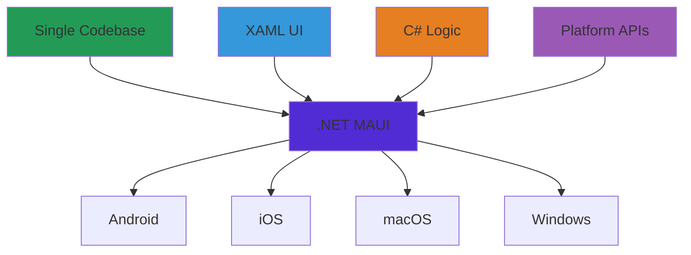
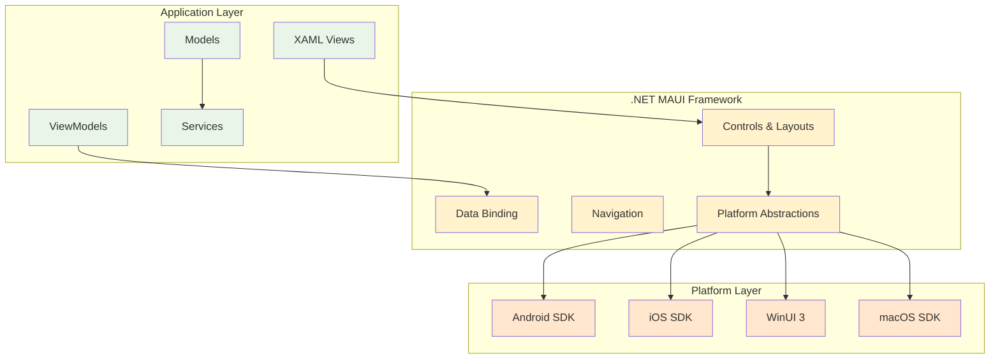
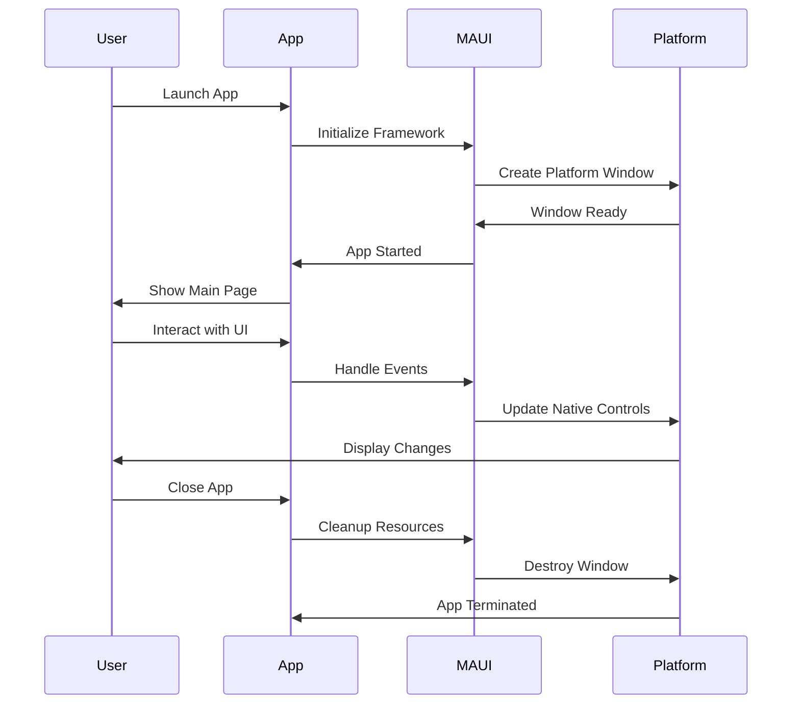

# บทที่ 1: MAUI & XAML Introduction

## 🎯 จุดประสงค์การเรียนรู้

เมื่อเสร็จสิ้นบทเรียนนี้ คุณจะสามารถ:
- เข้าใจ .NET MAUI และความสามารถของมันในการพัฒนา Cross-platform apps
- เข้าใจ XAML และบทบาทในการสร้าง User Interface
- เปรียบเทียบ .NET MAUI กับ framework อื่นๆ
- เข้าใจ Architecture และ lifecycle ของ MAUI applications
- เตรียมพร้อมสำหรับการพัฒนา MAUI apps

## 🚀 What is .NET MAUI?

**.NET Multi-platform App UI (MAUI)** เป็น cross-platform framework สำหรับการสร้าง desktop และ mobile applications โดยใช้ C# และ XAML

### **MAUI Overview**


### **Key Benefits**
- **📱 Single Codebase** - เขียนครั้งเดียว รันได้หลาย platform
- **🎨 Native Performance** - ประสิทธิภาพเทียบเท่า native apps
- **🔧 Platform Integration** - เข้าถึง platform-specific APIs ได้เต็มที่
- **🎯 Familiar Tools** - ใช้ Visual Studio และ tools ที่คุ้นเคย
- **💰 Cost Effective** - ลดต้นทุนการพัฒนาและ maintenance

## 🏗️ MAUI Architecture

### **Platform Architecture**


### **Application Lifecycle**


## 📋 XAML Fundamentals

**XAML (eXtensible Application Markup Language)** เป็นภาษา markup ที่ใช้สำหรับสร้าง User Interface

### **XAML Basic Structure**
```xml
<?xml version="1.0" encoding="utf-8" ?>
<ContentPage xmlns="http://schemas.microsoft.com/dotnet/2021/maui"
             xmlns:x="http://schemas.microsoft.com/winfx/2009/xaml"
             x:Class="MyApp.MainPage"
             Title="Main Page">
    
    <!-- Page Content -->
    <ScrollView>
        <VerticalStackLayout Spacing="25" Padding="30,0">
            
            <!-- Header -->
            <Label x:Name="WelcomeLabel"
                   Text="Welcome to .NET MAUI!"
                   FontSize="32"
                   HorizontalOptions="Center"
                   TextColor="{DynamicResource Primary}" />
            
            <!-- Image -->
            <Image Source="dotnet_bot.png"
                   HeightRequest="185"
                   Aspect="AspectFit" />
            
            <!-- Description -->
            <Label Text="MAUI is a cross-platform framework for creating native mobile and desktop apps with C# and XAML."
                   FontSize="18"
                   HorizontalOptions="Center"
                   TextColor="{DynamicResource Secondary}" />
            
            <!-- Button -->
            <Button x:Name="CounterBtn"
                    Text="Click me"
                    FontAttributes="Bold"
                    SemanticProperties.Hint="Counts the number of times you click"
                    Clicked="OnCounterClicked"
                    HorizontalOptions="Fill" />
            
        </VerticalStackLayout>
    </ScrollView>
    
</ContentPage>
```

### **XAML Key Concepts**

#### **1. Namespaces**
```xml
<!-- Default MAUI namespace -->
xmlns="http://schemas.microsoft.com/dotnet/2021/maui"

<!-- XAML language namespace -->
xmlns:x="http://schemas.microsoft.com/winfx/2009/xaml"

<!-- Custom namespace -->
xmlns:local="clr-namespace:MyApp.Views"
xmlns:controls="clr-namespace:MyApp.Controls"
```

#### **2. Elements and Attributes**
```xml
<!-- Element with attributes -->
<Label Text="Hello World"
       FontSize="24"
       TextColor="Blue"
       HorizontalOptions="Center" />

<!-- Element with property element syntax -->
<Label HorizontalOptions="Center">
    <Label.Text>Hello World</Label.Text>
    <Label.FontSize>24</Label.FontSize>
    <Label.TextColor>Blue</Label.TextColor>
</Label>
```

#### **3. Content Properties**
```xml
<!-- Content property (implicit) -->
<StackLayout>
    <Label Text="First Label" />
    <Label Text="Second Label" />
</StackLayout>

<!-- Content property (explicit) -->
<StackLayout>
    <StackLayout.Children>
        <Label Text="First Label" />
        <Label Text="Second Label" />
    </StackLayout.Children>
</StackLayout>
```

## 🎨 MAUI vs Other Frameworks

### **Comparison Matrix**

| Feature | .NET MAUI | Flutter | React Native | Xamarin.Forms |
|---------|-----------|---------|--------------|---------------|
| **Language** | C# + XAML | Dart | JavaScript/TypeScript | C# + XAML |
| **Performance** | Native | Near-Native | Bridge-based | Near-Native |
| **Platform Support** | 4 platforms | All platforms | Mobile + Web | Mobile + Desktop |
| **Development Model** | Native compilation | Compiled to native | Interpreted | Interpreted |
| **UI Approach** | Platform-specific | Custom rendering | Platform components | Abstracted controls |
| **Learning Curve** | Moderate | Moderate | Easy (JS devs) | Moderate |
| **Community** | Growing | Large | Huge | Established |
| **Microsoft Support** | Full | None | Limited | Deprecated |

### **When to Choose MAUI**

#### **✅ Choose MAUI When:**
- คุณมีทีม .NET developers
- ต้องการ native performance
- ต้องการ platform-specific features
- มี existing .NET codebase
- ต้องการ Microsoft ecosystem integration

#### **❌ Consider Alternatives When:**
- ทีมมี strong web development background
- ต้องการ rapid prototyping
- Budget constraints สำหรับ learning curve
- ต้องการ maximum cross-platform reach

## 🔧 Development Environment Overview

### **Required Tools**

```mermaid
graph LR
    A[Visual Studio 2022] --> B[.NET MAUI Workload]
    A --> C[Android SDK]
    A --> D[iOS SDK]
    A --> E[Windows SDK]
    
    F[.NET 8.0] --> A
    G[Git] --> A
    H[Emulators] --> A
    
    style A fill:#512bd4
    style B fill:#239b56
    style C fill:#3ddc84
    style D fill:#000000
    style E fill:#00bcf2
```


### **Platform Requirements**

#### **Windows Development**
- **Windows 11** (recommended) or Windows 10 version 1909+
- **Visual Studio 2022** version 17.8+
- **.NET 8.0 SDK**
- **Android SDK** (for Android development)
- **Xcode** (for iOS development - requires Mac)

#### **Mac Development**
- **macOS 12+** (Monterey or later)
- **Visual Studio 2022 for Mac** or **VS Code**
- **Xcode 14+**
- **.NET 8.0 SDK**

### **Project Structure Preview**
```
MyMauiApp/
├── Platforms/
│   ├── Android/
│   ├── iOS/
│   ├── MacCatalyst/
│   └── Windows/
├── Resources/
│   ├── Images/
│   ├── Fonts/
│   └── Styles/
├── Views/
├── ViewModels/
├── Models/
├── Services/
├── App.xaml
├── AppShell.xaml
├── MainPage.xaml
└── MauiProgram.cs
```

## 📱 MAUI App Lifecycle

### **Application Lifecycle Events**
```csharp
public partial class App : Application
{
    public App()
    {
        InitializeComponent();
        MainPage = new AppShell();
    }
    
    protected override Window CreateWindow(IActivationState activationState)
    {
        return new Window(new AppShell())
        {
            Title = "My MAUI App"
        };
    }
    
    protected override void OnStart()
    {
        // App started
        Debug.WriteLine("App Started");
    }
    
    protected override void OnSleep()
    {
        // App went to background
        Debug.WriteLine("App Sleeping");
    }
    
    protected override void OnResume()
    {
        // App returned from background
        Debug.WriteLine("App Resumed");
    }
}
```

### **Page Lifecycle Events**
```csharp
public partial class MainPage : ContentPage
{
    public MainPage()
    {
        InitializeComponent();
    }
    
    protected override void OnAppearing()
    {
        base.OnAppearing();
        // Page is about to appear
        Debug.WriteLine("Page Appearing");
    }
    
    protected override void OnDisappearing()
    {
        base.OnDisappearing();
        // Page is about to disappear
        Debug.WriteLine("Page Disappearing");
    }
    
    protected override bool OnBackButtonPressed()
    {
        // Handle back button press
        // Return true to prevent default behavior
        return base.OnBackButtonPressed();
    }
}
```

## 🎯 Your First MAUI Concept

### **Hello World Example**
```xml
<!-- MainPage.xaml -->
<?xml version="1.0" encoding="utf-8" ?>
<ContentPage xmlns="http://schemas.microsoft.com/dotnet/2021/maui"
             xmlns:x="http://schemas.microsoft.com/winfx/2009/xaml"
             x:Class="HelloMaui.MainPage"
             Title="Hello MAUI">

    <ScrollView>
        <Grid RowDefinitions="Auto,*,Auto" 
              Padding="20">
            
            <!-- Header -->
            <Border Grid.Row="0"
                    Background="{DynamicResource Primary}"
                    Stroke="{DynamicResource Primary}"
                    StrokeThickness="2"
                    Padding="20"
                    Margin="0,0,0,20">
                <Border.StrokeShape>
                    <RoundRectangle CornerRadius="10" />
                </Border.StrokeShape>
                
                <Label Text="🚀 Welcome to .NET MAUI!"
                       FontSize="24"
                       FontAttributes="Bold"
                       TextColor="White"
                       HorizontalOptions="Center" />
            </Border>
            
            <!-- Content -->
            <VerticalStackLayout Grid.Row="1" 
                                Spacing="20">
                
                <!-- Info Card -->
                <Frame BackgroundColor="{DynamicResource Secondary}"
                       Padding="15"
                       CornerRadius="8">
                    <VerticalStackLayout Spacing="10">
                        <Label Text="What is MAUI?"
                               FontSize="18"
                               FontAttributes="Bold"
                               TextColor="{DynamicResource OnSecondary}" />
                        
                        <Label Text="Multi-platform App UI framework that allows you to create native mobile and desktop apps with C# and XAML."
                               FontSize="14"
                               TextColor="{DynamicResource OnSecondary}" />
                    </VerticalStackLayout>
                </Frame>
                
                <!-- Feature List -->
                <CollectionView ItemsSource="{Binding Features}">
                    <CollectionView.ItemTemplate>
                        <DataTemplate>
                            <Grid ColumnDefinitions="Auto,*" 
                                  Padding="10"
                                  ColumnSpacing="15">
                                
                                <Label Grid.Column="0"
                                       Text="{Binding Icon}"
                                       FontSize="20"
                                       VerticalOptions="Center" />
                                
                                <VerticalStackLayout Grid.Column="1">
                                    <Label Text="{Binding Title}"
                                           FontAttributes="Bold"
                                           FontSize="16" />
                                    <Label Text="{Binding Description}"
                                           FontSize="14"
                                           TextColor="{DynamicResource Gray600}" />
                                </VerticalStackLayout>
                            </Grid>
                        </DataTemplate>
                    </CollectionView.ItemTemplate>
                </CollectionView>
                
            </VerticalStackLayout>
            
            <!-- Footer Button -->
            <Button Grid.Row="2"
                    Text="Get Started"
                    FontSize="18"
                    FontAttributes="Bold"
                    BackgroundColor="{DynamicResource Primary}"
                    TextColor="White"
                    CornerRadius="25"
                    HeightRequest="50"
                    Clicked="OnGetStartedClicked" />
            
        </Grid>
    </ScrollView>

</ContentPage>
```

```csharp
// MainPage.xaml.cs
using System.Collections.ObjectModel;

namespace HelloMaui;

public partial class MainPage : ContentPage
{
    public ObservableCollection<Feature> Features { get; }
    
    public MainPage()
    {
        InitializeComponent();
        
        Features = new ObservableCollection<Feature>
        {
            new Feature 
            { 
                Icon = "📱", 
                Title = "Cross-Platform", 
                Description = "Build for Android, iOS, macOS, and Windows" 
            },
            new Feature 
            { 
                Icon = "⚡", 
                Title = "Native Performance", 
                Description = "Compiled to native code for optimal performance" 
            },
            new Feature 
            { 
                Icon = "🎨", 
                Title = "Rich UI", 
                Description = "Beautiful, responsive user interfaces with XAML" 
            },
            new Feature 
            { 
                Icon = "🔧", 
                Title = "Platform APIs", 
                Description = "Access platform-specific features and APIs" 
            }
        };
        
        BindingContext = this;
    }
    
    private async void OnGetStartedClicked(object sender, EventArgs e)
    {
        await DisplayAlert("Welcome!", "Ready to start your MAUI journey?", "Yes!");
    }
}

public class Feature
{
    public string Icon { get; set; }
    public string Title { get; set; }
    public string Description { get; set; }
}
```

## 🎨 Modern Styling Preview

### **Tailwind-Inspired Utility Classes**
```xml
<!-- Resource Dictionary with Utility Styles -->
<ResourceDictionary>
    
    <!-- Spacing Utilities -->
    <Style x:Key="p-4" TargetType="Layout">
        <Setter Property="Padding" Value="16" />
    </Style>
    
    <Style x:Key="m-2" TargetType="View">
        <Setter Property="Margin" Value="8" />
    </Style>
    
    <!-- Text Utilities -->
    <Style x:Key="text-lg" TargetType="Label">
        <Setter Property="FontSize" Value="18" />
    </Style>
    
    <Style x:Key="font-bold" TargetType="Label">
        <Setter Property="FontAttributes" Value="Bold" />
    </Style>
    
    <!-- Color Utilities -->
    <Style x:Key="text-primary" TargetType="Label">
        <Setter Property="TextColor" Value="{DynamicResource Primary}" />
    </Style>
    
    <Style x:Key="bg-white" TargetType="VisualElement">
        <Setter Property="BackgroundColor" Value="White" />
    </Style>
    
    <!-- Layout Utilities -->
    <Style x:Key="flex-1" TargetType="View">
        <Setter Property="HorizontalOptions" Value="FillAndExpand" />
        <Setter Property="VerticalOptions" Value="FillAndExpand" />
    </Style>
    
    <Style x:Key="items-center" TargetType="StackLayout">
        <Setter Property="HorizontalOptions" Value="Center" />
    </Style>
    
</ResourceDictionary>

<!-- Usage Example -->
<VerticalStackLayout Style="{StaticResource p-4}">
    <Label Text="Welcome!"
           Style="{StaticResource text-lg}"
           class="font-bold text-primary" />
    
    <Frame Style="{StaticResource bg-white}">
        <Label Text="Content here" />
    </Frame>
</VerticalStackLayout>
```

## 🧪 แบบฝึกหัด

### **Exercise 1: Environment Check**
ตรวจสอบว่า development environment ของคุณพร้อมสำหรับ MAUI development:

1. เปิด Visual Studio และตรวจสอบ .NET MAUI workload
2. สร้าง new MAUI project
3. Build และ run บน Android emulator
4. Build และ run บน Windows (ถ้าใช้ Windows)

### **Exercise 2: XAML Structure Analysis**
วิเคราะห์ XAML structure ของ default MAUI template:

1. เปิด `MainPage.xaml` และศึกษา structure
2. ระบุ namespaces ที่ใช้
3. ระบุ layout containers และ controls
4. ทดลองเปลี่ยน properties และดูผลลัพธ์

### **Exercise 3: Simple Modification**
ปรับปรุง default MAUI template:

1. เปลี่ยน welcome message
2. เพิ่ม new Label หรือ Button
3. เปลี่ยน colors และ fonts
4. เพิ่ม Image control

## 🧪 Quiz

### **Question 1**
.NET MAUI ย่อมาจากอะไร?
- a) Multi-Application User Interface
- b) Multi-platform App UI
- c) Mobile Application UI
- d) Microsoft Application User Interface

### **Question 2**
XAML ใช้สำหรับอะไรใน MAUI?
- a) เขียน business logic
- b) จัดการ database
- c) สร้าง user interface
- d) handle network requests

### **Question 3**
MAUI สามารถ target platform ใดบ้าง?
- a) เฉพาะ mobile platforms
- b) Android, iOS, Windows, macOS
- c) เฉพาะ Microsoft platforms
- d) เฉพาะ desktop platforms

### **Question 4**
Namespace ที่ใช้สำหรับ MAUI controls คือ?
- a) `http://schemas.microsoft.com/winfx/2006/xaml`
- b) `http://xamarin.com/schemas/2014/forms`
- c) `http://schemas.microsoft.com/dotnet/2021/maui`
- d) `http://schemas.microsoft.com/expression/2010/interactivity`

**คำตอบ: 1-b, 2-c, 3-b, 4-c**

## 📝 สรุป

ในบทนี้เราได้เรียนรู้:

### **🚀 .NET MAUI Overview**
1. **Cross-Platform Framework** - สร้าง apps สำหรับ 4 platforms จาก single codebase
2. **Native Performance** - compiled เป็น native code
3. **Platform Integration** - เข้าถึง platform-specific APIs ได้เต็มที่
4. **Microsoft Ecosystem** - integration กับ .NET ecosystem

### **📋 XAML Fundamentals**
1. **Markup Language** - สำหรับสร้าง UI declaratively
2. **Element Structure** - namespaces, elements, attributes
3. **Property Syntax** - attribute และ property element syntax
4. **Content Properties** - implicit content model

### **🏗️ Architecture Understanding**
1. **Layered Architecture** - Application, Framework, Platform layers
2. **Lifecycle Management** - App และ Page lifecycle events
3. **Platform Abstraction** - unified API สำหรับ different platforms
4. **Development Model** - shared code กับ platform-specific customization

### **🎯 Next Steps**
ในบทต่อไป เราจะเรียนรู้เกี่ยวกับ:
- Visual Studio setup และ configuration
- Android/iOS development tools
- Emulator และ device testing
- Project templates และ structure

---

**🎉 ยินดีด้วย! คุณได้เรียนรู้พื้นฐานของ .NET MAUI และ XAML แล้ว**

**[⬅️ Back to Course Overview](./README.md) | [➡️ บทที่ 2: Development Environment →](./02-development-environment.md)**
