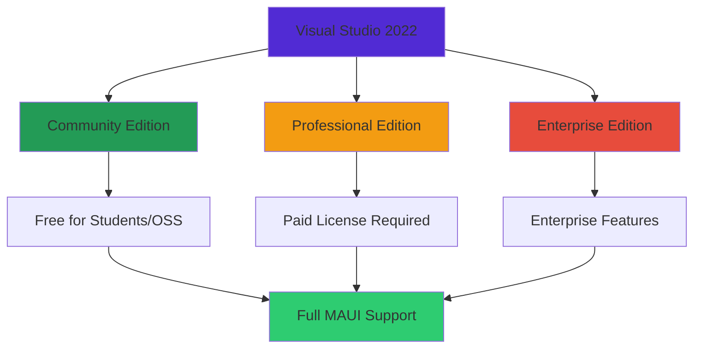

# บทที่ 2: Development Environment

## 🎯 จุดประสงค์การเรียนรู้

เมื่อเสร็จสิ้นบทเรียนนี้ คุณจะสามารถ:
- ติดตั้งและ configure Visual Studio สำหรับ MAUI development
- ตั้งค่า Android และ iOS development environments
- สร้างและ run MAUI project บน emulators และ devices
- เข้าใจ project structure และ build process
- ใช้ debugging tools และ hot reload features

## 🛠️ Visual Studio 2022 Setup

### **Installation Requirements**

#### **System Requirements**
- **Windows 11** version 21H2+ (recommended) หรือ **Windows 10** version 1909+
- **16 GB RAM** (minimum 8 GB)
- **SSD Storage** 50+ GB free space
- **.NET 8.0 SDK** or later

#### **Visual Studio 2022 Editions**


### **Installation Steps**

#### **Step 1: Download Visual Studio 2022**
```powershell
# Download from official Microsoft website
# https://visualstudio.microsoft.com/downloads/

# Or use Visual Studio Installer if already installed
# Search for "Visual Studio Installer" in Start Menu
```

#### **Step 2: Select Workloads**
```
Required Workloads:
✅ .NET Multi-platform App UI development
✅ Mobile development with .NET

Optional but Recommended:
✅ ASP.NET and web development
✅ Azure development
✅ .NET desktop development
```

#### **Step 3: Individual Components**
```
Additional Components:
✅ .NET 8.0 Runtime (Latest)
✅ .NET SDK (Latest)
✅ Android SDK setup (API 34+)
✅ Android SDK Build-Tools
✅ Android Emulator
✅ Intel Hardware Accelerated Execution Manager (HAXM)
```

### **Post-Installation Configuration**

#### **Android SDK Configuration**
```csharp
// Check Android SDK Path in Visual Studio
// Tools → Options → Xamarin → Android Settings

// Default Locations:
// Windows: C:\Program Files (x86)\Android\android-sdk
// Mac: ~/Library/Developer/Xamarin/android-sdk-macosx

// Required Android API Levels:
// - Android 14.0 (API 34) - Target
// - Android 13.0 (API 33) - Compatibility
// - Android 12.0 (API 31) - Minimum
```

#### **iOS Development Setup (Windows)**
```yaml
# For iOS Development on Windows, you need:
Remote Mac Connection:
  - Mac with Xcode installed
  - Network connectivity to Mac
  - Visual Studio for Mac (optional)
  - Enable Remote Login on Mac

Alternative Options:
  - Azure DevOps with macOS agents
  - MacStadium or similar cloud Mac services
  - Physical Mac for development team
```

## 📱 Android Development Setup

### **Android SDK Manager**

#### **SDK Platforms**
```bash
# Open Android SDK Manager in Visual Studio
# Tools → Android → Android SDK Manager

# Install Required Platforms:
Android 14.0 (API 34)    # Latest
Android 13.0 (API 33)    # Stable
Android 12.0 (API 31)    # Minimum Target
Android 11.0 (API 30)    # Compatibility
Android 10.0 (API 29)    # Legacy Support
```

#### **SDK Tools**
```
Required Tools:
✅ Android SDK Build-Tools (34.0.0+)
✅ Android SDK Command-line Tools
✅ Android SDK Platform-Tools
✅ Android Emulator
✅ Google Play Services
✅ Google Repository
✅ Intel x86 Emulator Accelerator (HAXM installer)
```

### **Android Emulator Setup**

#### **Creating Virtual Devices**
```csharp
// Open AVD Manager
// Tools → Android → Android Device Manager

// Recommended Emulator Configurations:

// Phone Emulator
Device: Pixel 7
API Level: 34 (Android 14.0)
ABI: x86_64
RAM: 4 GB
Internal Storage: 8 GB
SD Card: 512 MB

// Tablet Emulator  
Device: Pixel Tablet
API Level: 34 (Android 14.0)
ABI: x86_64
RAM: 6 GB
Internal Storage: 16 GB
```

#### **Emulator Performance Optimization**
```xml
<!-- config.ini settings for better performance -->
<EmulatorConfig>
    <Settings>
        <hw.ramSize>4096</hw.ramSize>
        <hw.accelerometer>yes</hw.accelerometer>
        <hw.battery>yes</hw.battery>
        <hw.camera.back>virtualscene</hw.camera.back>
        <hw.camera.front>emulated</hw.camera.front>
        <hw.gps>yes</hw.gps>
        <hw.gpu.enabled>yes</hw.gpu.enabled>
        <hw.gpu.mode>host</hw.gpu.mode>
        <hw.keyboard>yes</hw.keyboard>
        <hw.mainKeys>no</hw.mainKeys>
        <hw.sdCard>yes</hw.sdCard>
    </Settings>
</EmulatorConfig>
```

### **Physical Device Setup**

#### **Enable Developer Options**
```
Android Device Setup:
1. Settings → About Phone
2. Tap "Build Number" 7 times
3. Go back to Settings → Developer Options
4. Enable "USB Debugging"
5. Enable "Stay Awake"
6. Enable "Allow mock locations" (for testing)
```

#### **USB Driver Installation**
```powershell
# Windows - Install USB drivers
# Method 1: Automatic via Windows Update
# Method 2: Download from device manufacturer
# Method 3: Use Universal ADB Driver

# Verify device connection
adb devices
# Should show your device in the list
```

## 🍎 iOS Development Setup

### **Mac Requirements**

#### **macOS Setup**
```bash
# Minimum Requirements:
# macOS 12.0 (Monterey) or later
# Xcode 14.0 or later
# iOS 16.0 SDK or later

# Check macOS version
sw_vers

# Install Xcode from App Store
# Or download from Apple Developer Portal
```

#### **Xcode Configuration**
```bash
# Install Xcode Command Line Tools
xcode-select --install

# Accept Xcode license
sudo xcodebuild -license accept

# Install additional simulators
# Xcode → Preferences → Components
# Download iOS simulators for different versions
```

### **iOS Simulator Setup**

#### **Available Simulators**
```
Recommended iOS Simulators:
📱 iPhone 15 Pro (iOS 17.0+)
📱 iPhone 14 (iOS 16.0+)
📱 iPhone SE (3rd generation) (iOS 15.0+)
📱 iPad Pro (12.9-inch) (iPadOS 17.0+)
📱 iPad Air (5th generation) (iPadOS 16.0+)
```

#### **Simulator Management**
```bash
# List available simulators
xcrun simctl list devices

# Create new simulator
xcrun simctl create "iPhone 15 Custom" com.apple.CoreSimulator.DeviceType.iPhone-15-Pro com.apple.CoreSimulator.Runtime.iOS-17-0

# Boot simulator
xcrun simctl boot "iPhone 15 Custom"

# Install app on simulator
xcrun simctl install booted YourApp.app
```

### **Remote Mac Connection (Windows)**

#### **Mac Setup for Remote Connection**
```bash
# Enable Remote Login on Mac
sudo systemsetup -setremotelogin on

# Create user account for Windows development
sudo dscl . -create /Users/windeveloper
sudo dscl . -create /Users/windeveloper UserShell /bin/bash
sudo dscl . -create /Users/windeveloper RealName "Windows Developer"
sudo dscl . -create /Users/windeveloper UniqueID 1001
sudo dscl . -create /Users/windeveloper PrimaryGroupID 20
sudo dscl . -passwd /Users/windeveloper YourPassword

# Add to admin group
sudo dscl . -append /Groups/admin GroupMembership windeveloper
```

#### **Windows Connection Setup**
```csharp
// In Visual Studio on Windows:
// Tools → iOS → Pair to Mac

// Connection Details:
Host: [Mac IP Address or hostname]
Username: windeveloper
Password: YourPassword

// Verify connection status in Visual Studio
// Look for green checkmark in iOS toolbar
```

## 🚀 Creating Your First MAUI Project

### **Project Creation**

#### **Using Visual Studio**
```csharp
// File → New → Project
// Search for ".NET MAUI App"
// Select project template

ProjectSettings projectSettings = new()
{
    ProjectName = "MyFirstMauiApp",
    Location = @"C:\Projects\",
    SolutionName = "MyFirstMauiApp",
    TargetFramework = "net8.0",
    Platforms = new[] { "Android", "iOS", "Windows", "MacCatalyst" }
};
```

#### **Using .NET CLI**
```bash
# Install MAUI project templates
dotnet new install Microsoft.Maui.ProjectTemplates

# Create new MAUI project
dotnet new maui -n MyFirstMauiApp -o ./MyFirstMauiApp

# Navigate to project directory
cd MyFirstMauiApp

# Restore packages
dotnet restore

# Build project
dotnet build

# Run on specific platform
dotnet build -t:Run -f net8.0-android
dotnet build -t:Run -f net8.0-ios
dotnet build -t:Run -f net8.0-windows10.0.19041.0
```

### **Project Structure Analysis**

#### **Solution Structure**
```
MyFirstMauiApp/
├── Platforms/
│   ├── Android/
│   │   ├── AndroidManifest.xml
│   │   ├── MainActivity.cs
│   │   ├── MainApplication.cs
│   │   └── Resources/
│   ├── iOS/
│   │   ├── Info.plist
│   │   ├── AppDelegate.cs
│   │   └── Program.cs
│   ├── MacCatalyst/
│   │   ├── Info.plist
│   │   ├── AppDelegate.cs
│   │   └── Program.cs
│   └── Windows/
│       ├── Package.appxmanifest
│       ├── App.xaml
│       └── MainWindow.xaml
├── Resources/
│   ├── AppIcon/
│   ├── Fonts/
│   ├── Images/
│   └── Styles/
│       ├── Colors.xaml
│       └── Styles.xaml
├── App.xaml
├── App.xaml.cs
├── AppShell.xaml
├── AppShell.xaml.cs
├── MainPage.xaml
├── MainPage.xaml.cs
├── MauiProgram.cs
└── MyFirstMauiApp.csproj
```

#### **Key Files Explained**

**MauiProgram.cs**
```csharp
public static class MauiProgram
{
    public static MauiApp CreateMauiApp()
    {
        var builder = MauiApp.CreateBuilder();
        builder
            .UseMauiApp<App>()
            .ConfigureFonts(fonts =>
            {
                fonts.AddFont("OpenSans-Regular.ttf", "OpenSansRegular");
                fonts.AddFont("OpenSans-Semibold.ttf", "OpenSansSemibold");
            });

        // Add services
        builder.Services.AddSingleton<MainPage>();
        builder.Services.AddSingleton<MainPageViewModel>();

#if DEBUG
        builder.Logging.AddDebug();
#endif

        return builder.Build();
    }
}
```

**App.xaml & App.xaml.cs**
```xml
<!-- App.xaml -->
<?xml version="1.0" encoding="UTF-8" ?>
<Application xmlns="http://schemas.microsoft.com/dotnet/2021/maui"
             xmlns:x="http://schemas.microsoft.com/winfx/2009/xaml"
             xmlns:local="clr-namespace:MyFirstMauiApp"
             x:Class="MyFirstMauiApp.App">
    <Application.Resources>
        <ResourceDictionary>
            <ResourceDictionary.MergedDictionaries>
                <ResourceDictionary Source="Resources/Styles/Colors.xaml" />
                <ResourceDictionary Source="Resources/Styles/Styles.xaml" />
            </ResourceDictionary.MergedDictionaries>
        </ResourceDictionary>
    </Application.Resources>
</Application>
```

```csharp
// App.xaml.cs
namespace MyFirstMauiApp;

public partial class App : Application
{
    public App()
    {
        InitializeComponent();

        MainPage = new AppShell();
    }

    protected override Window CreateWindow(IActivationState activationState)
    {
        return new Window(new AppShell())
        {
            Title = "My First MAUI App",
            MinimumHeight = 600,
            MinimumWidth = 800
        };
    }
}
```

### **Project Configuration**

#### **Target Frameworks**
```xml
<!-- MyFirstMauiApp.csproj -->
<Project Sdk="Microsoft.NET.Sdk">

    <PropertyGroup>
        <TargetFrameworks>net8.0-android;net8.0-ios;net8.0-maccatalyst</TargetFrameworks>
        <TargetFrameworks Condition="$([MSBuild]::IsOSPlatform('windows'))">$(TargetFrameworks);net8.0-windows10.0.19041.0</TargetFrameworks>
        
        <!-- App Configuration -->
        <OutputType>Exe</OutputType>
        <RootNamespace>MyFirstMauiApp</RootNamespace>
        <UseMaui>true</UseMaui>
        <SingleProject>true</SingleProject>
        <ImplicitUsings>enable</ImplicitUsings>
        <Nullable>enable</Nullable>

        <!-- Display Version -->
        <ApplicationDisplayVersion>1.0</ApplicationDisplayVersion>
        <ApplicationVersion>1</ApplicationVersion>

        <!-- Platform Specific -->
        <SupportedOSPlatformVersion Condition="$([MSBuild]::GetTargetPlatformIdentifier('$(TargetFramework)')) == 'android'">21.0</SupportedOSPlatformVersion>
        <SupportedOSPlatformVersion Condition="$([MSBuild]::GetTargetPlatformIdentifier('$(TargetFramework)')) == 'ios'">11.0</SupportedOSPlatformVersion>
        <SupportedOSPlatformVersion Condition="$([MSBuild]::GetTargetPlatformIdentifier('$(TargetFramework)')) == 'maccatalyst'">13.1</SupportedOSPlatformVersion>
        <SupportedOSPlatformVersion Condition="$([MSBuild]::GetTargetPlatformIdentifier('$(TargetFramework)')) == 'windows'">10.0.17763.0</SupportedOSPlatformVersion>
        <TargetPlatformMinVersion Condition="$([MSBuild]::GetTargetPlatformIdentifier('$(TargetFramework)')) == 'windows'">10.0.17763.0</TargetPlatformMinVersion>
    </PropertyGroup>

    <ItemGroup>
        <!-- App Icon -->
        <MauiIcon Include="Resources\AppIcon\appicon.svg" ForegroundFile="Resources\AppIcon\appiconfg.svg" Color="#512BD4" />

        <!-- Splash Screen -->
        <MauiSplashScreen Include="Resources\Splash\splash.svg" Color="#512BD4" BaseSize="128,128" />

        <!-- Images -->
        <MauiImage Include="Resources\Images\*" />
        <MauiImage Update="Resources\Images\dotnet_bot.svg" BaseSize="168,208" />

        <!-- Custom Fonts -->
        <MauiFont Include="Resources\Fonts\*" />

        <!-- Raw Assets (also remove the "Resources\Raw" prefix) -->
        <MauiAsset Include="Resources\Raw\**" LogicalName="%(RecursiveDir)%(Filename)%(Extension)" />
    </ItemGroup>

    <ItemGroup>
        <PackageReference Include="Microsoft.Maui.Controls" Version="8.0.7" />
        <PackageReference Include="Microsoft.Maui.Controls.Compatibility" Version="8.0.7" />
        <PackageReference Include="Microsoft.Extensions.Logging.Debug" Version="8.0.0" />
    </ItemGroup>

</Project>
```

## 🔧 Development Tools & Features

### **Hot Reload**

#### **XAML Hot Reload**
```xml
<!-- Changes to XAML are reflected immediately -->
<ContentPage xmlns="http://schemas.microsoft.com/dotnet/2021/maui"
             xmlns:x="http://schemas.microsoft.com/winfx/2009/xaml"
             x:Class="MyFirstMauiApp.MainPage"
             Title="Hot Reload Demo">

    <StackLayout Padding="20">
        <!-- Try changing this text while app is running -->
        <Label Text="Hello, Hot Reload!" 
               FontSize="24"
               HorizontalOptions="Center"
               TextColor="Blue" />
        
        <!-- Try changing button text or color -->
        <Button Text="Click Me!"
                BackgroundColor="Green"
                TextColor="White"
                Clicked="OnButtonClicked" />
    </StackLayout>

</ContentPage>
```

#### **C# Hot Reload**
```csharp
// Changes to certain C# code can be hot reloaded
public partial class MainPage : ContentPage
{
    private int count = 0;

    public MainPage()
    {
        InitializeComponent();
    }

    private void OnButtonClicked(object sender, EventArgs e)
    {
        count++;
        
        // Try changing this message while debugging
        DisplayAlert("Info", $"Button clicked {count} times!", "OK");
        
        // Try changing button appearance
        if (sender is Button button)
        {
            button.BackgroundColor = count % 2 == 0 ? Colors.Blue : Colors.Red;
        }
    }
}
```

### **Debugging Tools**

#### **Visual Studio Debugger**
```csharp
public partial class MainPage : ContentPage
{
    public MainPage()
    {
        InitializeComponent();
        
        // Set breakpoint here
        Debug.WriteLine("MainPage constructor called");
    }

    private async void OnButtonClicked(object sender, EventArgs e)
    {
        try
        {
            // Set breakpoint here to inspect variables
            var currentTime = DateTime.Now;
            var message = $"Current time: {currentTime:HH:mm:ss}";
            
            // Watch window can monitor these variables
            await DisplayAlert("Debug Info", message, "OK");
        }
        catch (Exception ex)
        {
            // Exception will be caught by debugger
            Debug.WriteLine($"Error: {ex.Message}");
        }
    }
}
```

#### **Live Visual Tree**
```
Visual Studio Debugging Features:

1. Live Visual Tree
   - View XAML hierarchy in real-time
   - Select elements to inspect properties
   - Navigate through visual tree

2. Live Property Explorer
   - Modify properties at runtime
   - See changes immediately
   - Useful for UI adjustments

3. Diagnostic Tools
   - Memory usage monitoring
   - CPU usage tracking
   - Performance profiling
```

### **Emulator Management**

#### **Android Emulator Commands**
```bash
# List running emulators
adb devices

# Install APK to emulator
adb install -r path/to/your/app.apk

# Uninstall app from emulator
adb uninstall com.yourcompany.yourapp

# Clear app data
adb shell pm clear com.yourcompany.yourapp

# Take screenshot
adb shell screencap -p /sdcard/screenshot.png
adb pull /sdcard/screenshot.png

# Record screen
adb shell screenrecord /sdcard/demo.mp4
```

#### **iOS Simulator Commands**
```bash
# Boot simulator
xcrun simctl boot "iPhone 15 Pro"

# Install app
xcrun simctl install booted path/to/your/app.app

# Uninstall app
xcrun simctl uninstall booted com.yourcompany.yourapp

# Reset simulator
xcrun simctl erase "iPhone 15 Pro"

# Take screenshot
xcrun simctl io booted screenshot screenshot.png

# Record video
xcrun simctl io booted recordVideo demo.mov
```

## 🚨 Common Setup Issues & Solutions

### **Android Issues**

#### **SDK License Issues**
```bash
# Accept all SDK licenses
cd %ANDROID_HOME%\tools\bin
sdkmanager --licenses

# Or use Visual Studio
# Tools → Android → Android SDK Manager → Accept Licenses
```

#### **Emulator Performance Issues**
```
Solutions:
1. Enable Hyper-V (Windows 10/11 Pro)
2. Install Intel HAXM (Windows Home)
3. Increase emulator RAM allocation
4. Use x86_64 system images
5. Enable hardware acceleration in BIOS
```

#### **ADB Connection Issues**
```bash
# Restart ADB server
adb kill-server
adb start-server

# Check USB drivers
# Device Manager → Portable Devices → Update Driver

# Enable USB debugging again on device
```

### **iOS Issues**

#### **Xcode Version Compatibility**
```bash
# Check Xcode version
xcode-select --print-path
xcodebuild -version

# Update Xcode command line tools
xcode-select --install

# Switch Xcode versions (if multiple installed)
sudo xcode-select -s /Applications/Xcode.app/Contents/Developer
```

#### **Provisioning Profile Issues**
```
Solutions:
1. Ensure Apple Developer account is active
2. Create App IDs in Apple Developer Portal
3. Generate development certificates
4. Create development provisioning profiles
5. Refresh profiles in Xcode
```

### **Visual Studio Issues**

#### **Missing Workloads**
```powershell
# Check installed workloads
vs_installer.exe export --installPath "C:\Program Files\Microsoft Visual Studio\2022\Professional" --config workloads.vsconfig

# Install missing components
vs_installer.exe modify --installPath "C:\Program Files\Microsoft Visual Studio\2022\Professional" --config workloads.vsconfig
```

#### **NuGet Package Issues**
```bash
# Clear NuGet cache
dotnet nuget locals all --clear

# Restore packages
dotnet restore

# Update packages
dotnet add package Microsoft.Maui.Controls --version 8.0.7
```

## 🧪 แบบฝึกหัด

### **Exercise 1: Environment Verification**
ตรวจสอบว่า development environment ติดตั้งถูกต้อง:

```csharp
// Create a simple diagnostic app
public partial class DiagnosticPage : ContentPage
{
    public DiagnosticPage()
    {
        InitializeComponent();
        LoadDiagnosticInfo();
    }

    private void LoadDiagnosticInfo()
    {
        var diagnostics = new List<string>
        {
            $"Platform: {DeviceInfo.Platform}",
            $"Device Type: {DeviceInfo.DeviceType}",
            $"OS Version: {DeviceInfo.VersionString}",
            $"Model: {DeviceInfo.Model}",
            $"Manufacturer: {DeviceInfo.Manufacturer}",
            $"Screen Size: {DeviceDisplay.MainDisplayInfo.Width}x{DeviceDisplay.MainDisplayInfo.Height}",
            $"Density: {DeviceDisplay.MainDisplayInfo.Density}"
        };

        DiagnosticLabel.Text = string.Join("\n", diagnostics);
    }
}
```

### **Exercise 2: Multi-Platform Testing**
สร้าง app ที่แสดงข้อมูลที่แตกต่างกันบนแต่ละ platform:

```csharp
public partial class PlatformSpecificPage : ContentPage
{
    public PlatformSpecificPage()
    {
        InitializeComponent();
        SetPlatformSpecificContent();
    }

    private void SetPlatformSpecificContent()
    {
        if (DeviceInfo.Platform == DevicePlatform.Android)
        {
            Title = "Android App";
            BackgroundColor = Colors.LightGreen;
            WelcomeLabel.Text = "Welcome to Android!";
        }
        else if (DeviceInfo.Platform == DevicePlatform.iOS)
        {
            Title = "iOS App";
            BackgroundColor = Colors.LightBlue;
            WelcomeLabel.Text = "Welcome to iOS!";
        }
        else if (DeviceInfo.Platform == DevicePlatform.WinUI)
        {
            Title = "Windows App";
            BackgroundColor = Colors.LightCoral;
            WelcomeLabel.Text = "Welcome to Windows!";
        }
    }
}
```

### **Exercise 3: Hot Reload Testing**
ทดสอบ Hot Reload functionality:

1. สร้าง UI ด้วย XAML
2. Run app บน emulator
3. เปลี่ยน colors, text, layouts
4. สังเกตการเปลี่ยนแปลงแบบ real-time

## 🧪 Quiz

### **Question 1**
Visual Studio workload ที่จำเป็นสำหรับ MAUI development คือ?
- a) ASP.NET and web development
- b) .NET Multi-platform App UI development
- c) Game development with Unity
- d) Data science and analytical applications

### **Question 2**
Android API level ขั้นต่ำที่ MAUI support คือ?
- a) API 19 (Android 4.4)
- b) API 21 (Android 5.0)
- c) API 23 (Android 6.0)
- d) API 26 (Android 8.0)

### **Question 3**
สำหรับ iOS development บน Windows จำเป็นต้องมี?
- a) Physical iPhone device
- b) Mac computer with Xcode
- c) Windows Subsystem for Linux
- d) Android Studio

### **Question 4**
Hot Reload ใน MAUI ทำงานกับ?
- a) เฉพาะ XAML
- b) เฉพาะ C# code
- c) ทั้ง XAML และ C# code (บางส่วน)
- d) เฉพาะ resource files

**คำตอบ: 1-b, 2-b, 3-b, 4-c**

## 📝 สรุป

ในบทนี้เราได้เรียนรู้:

### **🛠️ Development Environment Setup**
1. **Visual Studio 2022** - Installation และ configuration สำหรับ MAUI
2. **Android SDK** - Setup และ emulator management
3. **iOS Development** - Xcode setup และ remote Mac connection
4. **Project Creation** - MAUI project templates และ structure

### **🔧 Development Tools**
1. **Hot Reload** - Real-time XAML และ C# code changes
2. **Debugging Tools** - Breakpoints, watch windows, live visual tree
3. **Emulator Management** - Android และ iOS simulator commands
4. **Performance Tools** - Memory และ CPU profiling

### **🚨 Troubleshooting**
1. **Common Issues** - SDK licenses, emulator performance, connection problems
2. **Platform-Specific Problems** - Android ADB, iOS provisioning, Windows dependencies
3. **Solution Strategies** - Systematic approach to problem resolution
4. **Best Practices** - Optimal development environment configuration

### **🎯 Next Steps**
ในบทต่อไป เราจะเรียนรู้เกี่ยวกับ:
- XAML syntax และ fundamentals
- Elements, attributes, และ namespaces
- Property syntax และ markup extensions
- Basic layout concepts

---

**🎉 ยินดีด้วย! Development environment ของคุณพร้อมสำหรับ MAUI development แล้ว**

**[⬅️ บทที่ 1: MAUI & XAML Introduction](./01-maui-xaml-introduction.md) | [➡️ บทที่ 3: XAML Fundamentals →](./03-xaml-fundamentals.md)**
