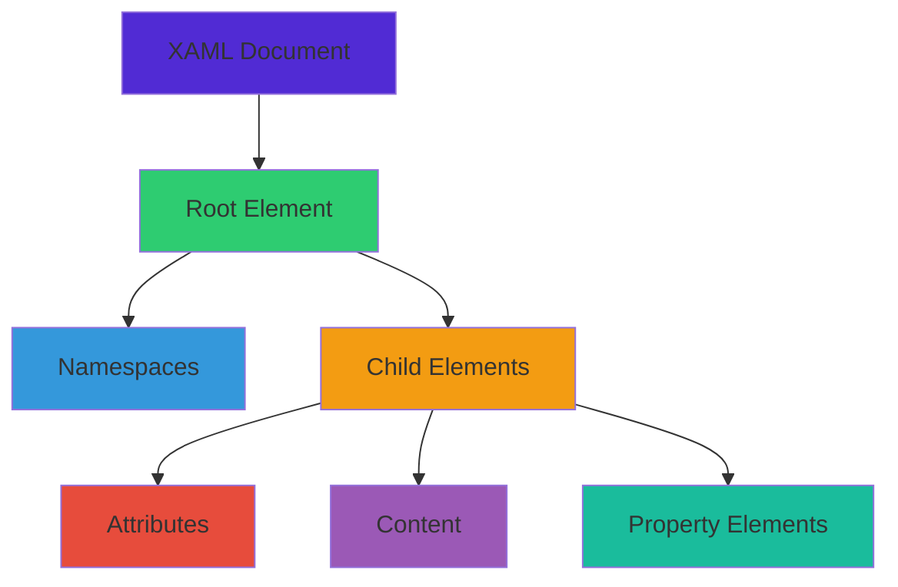

# บทที่ 3: XAML Fundamentals

## 🎯 จุดประสงค์การเรียนรู้

เมื่อเสร็จสิ้นบทเรียนนี้ คุณจะสามารถ:
- เข้าใจ XAML syntax และ structure อย่างครบถ้วน
- ใช้ Elements, Attributes, และ Namespaces ได้อย่างมีประสิทธิภาพ
- เข้าใจ Property syntax และ Markup Extensions
- สร้าง Resource Dictionaries และจัดการ Resources
- ใช้ Data Binding basics และ Binding expressions
- เขียน XAML code ที่ clean และ maintainable

## 📋 XAML Overview

**XAML (eXtensible Application Markup Language)** เป็นภาษา markup ที่ใช้สร้าง User Interface แบบ declarative

### **XAML Structure**


### **XAML vs C# Comparison**
```csharp
// C# Code
var stackLayout = new StackLayout
{
    Orientation = StackOrientation.Vertical,
    Spacing = 20,
    Padding = new Thickness(30, 0)
};

var label = new Label
{
    Text = "Welcome to MAUI!",
    FontSize = 32,
    HorizontalOptions = LayoutOptions.Center,
    TextColor = Colors.Blue
};

var button = new Button
{
    Text = "Click Me",
    BackgroundColor = Colors.Green,
    TextColor = Colors.White
};

stackLayout.Children.Add(label);
stackLayout.Children.Add(button);
```

```xml
<!-- Equivalent XAML -->
<StackLayout Orientation="Vertical" 
             Spacing="20" 
             Padding="30,0">
    
    <Label Text="Welcome to MAUI!"
           FontSize="32"
           HorizontalOptions="Center"
           TextColor="Blue" />
    
    <Button Text="Click Me"
            BackgroundColor="Green"
            TextColor="White" />
            
</StackLayout>
```

## 🏗️ XAML Syntax Fundamentals

### **Basic Document Structure**
```xml
<?xml version="1.0" encoding="utf-8" ?>
<ContentPage xmlns="http://schemas.microsoft.com/dotnet/2021/maui"
             xmlns:x="http://schemas.microsoft.com/winfx/2009/xaml"
             xmlns:local="clr-namespace:MyApp.Views"
             x:Class="MyApp.Views.MainPage"
             Title="XAML Fundamentals">

    <!-- Page content goes here -->
    
</ContentPage>
```

### **Namespaces Explained**

#### **Default Namespace**
```xml
<!-- MAUI Controls Namespace -->
xmlns="http://schemas.microsoft.com/dotnet/2021/maui"

<!-- This allows using MAUI controls without prefix -->
<Label Text="Hello" />
<Button Text="Click" />
<StackLayout />
```

#### **XAML Language Namespace**
```xml
<!-- XAML Language Features -->
xmlns:x="http://schemas.microsoft.com/winfx/2009/xaml"

<!-- Enables x: prefixed features -->
<Label x:Name="MyLabel" />
<Button x:Key="MyButton" />
<local:CustomControl x:Class="MyApp.CustomControl" />
```

#### **Custom Namespaces**
```xml
<!-- Local Application Namespace -->
xmlns:local="clr-namespace:MyApp"
xmlns:views="clr-namespace:MyApp.Views"
xmlns:controls="clr-namespace:MyApp.Controls"
xmlns:converters="clr-namespace:MyApp.Converters"

<!-- External Assembly Namespace -->
xmlns:toolkit="http://schemas.microsoft.com/dotnet/2022/maui/toolkit"
xmlns:syncfusion="clr-namespace:Syncfusion.Maui.Charts;assembly=Syncfusion.Maui.Charts"

<!-- Usage Examples -->
<local:CustomService />
<views:DetailView />
<controls:CustomButton />
<converters:BoolToColorConverter />
<toolkit:Expander />
<syncfusion:SfCartesianChart />
```

### **Elements and Attributes**

#### **Element Syntax**
```xml
<!-- Self-closing element -->
<Label Text="Simple Label" />

<!-- Element with content -->
<Label>
    Simple Label Content
</Label>

<!-- Element with child elements -->
<StackLayout>
    <Label Text="Child 1" />
    <Label Text="Child 2" />
</StackLayout>

<!-- Element with mixed content -->
<Label>
    <Label.Text>
        Formatted Text
    </Label.Text>
</Label>
```

#### **Attribute Syntax**
```xml
<!-- Simple attributes -->
<Label Text="Hello World"
       FontSize="18"
       TextColor="Blue"
       IsVisible="True" />

<!-- Complex attributes -->
<Label Padding="10,5,10,5"
       Margin="0,10,0,10"
       HorizontalOptions="CenterAndExpand"
       VerticalOptions="CenterAndExpand" />

<!-- Binding attributes -->
<Label Text="{Binding Title}"
       IsVisible="{Binding IsVisible}"
       TextColor="{Binding StatusColor}" />
```

### **Property Element Syntax**

#### **When to Use Property Elements**
```xml
<!-- Simple property (attribute syntax) -->
<Label Text="Simple text" />

<!-- Complex property (property element syntax) -->
<Label>
    <Label.Text>
        This is a longer text that might span
        multiple lines and is easier to read
        when using property element syntax.
    </Label.Text>
</Label>

<!-- Collection property -->
<StackLayout>
    <StackLayout.Children>
        <Label Text="Child 1" />
        <Label Text="Child 2" />
        <Button Text="Child 3" />
    </StackLayout.Children>
</StackLayout>

<!-- Resource property -->
<Button>
    <Button.Resources>
        <ResourceDictionary>
            <Style x:Key="ButtonStyle" TargetType="Button">
                <Setter Property="BackgroundColor" Value="Blue" />
            </Style>
        </ResourceDictionary>
    </Button.Resources>
</Button>
```

#### **Advanced Property Syntax**
```xml
<!-- Gradient Background -->
<ContentPage>
    <ContentPage.Background>
        <LinearGradientBrush StartPoint="0,0" EndPoint="1,1">
            <GradientStop Color="#FF6B6B" Offset="0.0" />
            <GradientStop Color="#4ECDC4" Offset="0.5" />
            <GradientStop Color="#45B7D1" Offset="1.0" />
        </LinearGradientBrush>
    </ContentPage.Background>
</ContentPage>

<!-- Complex Triggers -->
<Button Text="Interactive Button">
    <Button.Triggers>
        <DataTrigger TargetType="Button" 
                     Binding="{Binding IsEnabled}" 
                     Value="False">
            <Setter Property="BackgroundColor" Value="Gray" />
            <Setter Property="TextColor" Value="DarkGray" />
        </DataTrigger>
    </Button.Triggers>
</Button>

<!-- Complex Gestures -->
<Label Text="Gesture Enabled">
    <Label.GestureRecognizers>
        <TapGestureRecognizer Tapped="OnLabelTapped" NumberOfTapsRequired="2" />
        <PanGestureRecognizer PanUpdated="OnPanUpdated" />
        <PinchGestureRecognizer PinchUpdated="OnPinchUpdated" />
    </Label.GestureRecognizers>
</Label>
```

## 🎨 Markup Extensions

Markup Extensions ช่วยให้เราสามารถ set property values แบบ dynamic หรือ complex

### **Built-in Markup Extensions**

#### **Binding**
```xml
<!-- Simple binding -->
<Label Text="{Binding Title}" />

<!-- Binding with Path -->
<Label Text="{Binding User.Name}" />

<!-- Binding with Mode -->
<Entry Text="{Binding UserName, Mode=TwoWay}" />

<!-- Binding with Converter -->
<Label IsVisible="{Binding IsActive, Converter={StaticResource BoolToVisibilityConverter}}" />

<!-- Binding with StringFormat -->
<Label Text="{Binding Price, StringFormat='Price: {0:C}'}" />

<!-- Multi-binding -->
<Label>
    <Label.Text>
        <MultiBinding StringFormat="{}{0} {1}">
            <Binding Path="FirstName" />
            <Binding Path="LastName" />
        </MultiBinding>
    </Label.Text>
</Label>
```

#### **StaticResource**
```xml
<!-- Resource Dictionary -->
<ContentPage.Resources>
    <ResourceDictionary>
        <Color x:Key="PrimaryColor">#512BD4</Color>
        <Style x:Key="HeaderStyle" TargetType="Label">
            <Setter Property="FontSize" Value="24" />
            <Setter Property="FontAttributes" Value="Bold" />
        </Style>
        <local:BoolToColorConverter x:Key="BoolToColorConverter" />
    </ResourceDictionary>
</ContentPage.Resources>

<!-- Using StaticResource -->
<Label Text="Header" 
       Style="{StaticResource HeaderStyle}"
       TextColor="{StaticResource PrimaryColor}" />

<Label Text="{Binding IsActive}"
       TextColor="{Binding IsActive, Converter={StaticResource BoolToColorConverter}}" />
```

#### **DynamicResource**
```xml
<!-- Resources that can change at runtime -->
<Application.Resources>
    <ResourceDictionary>
        <!-- Light theme -->
        <Color x:Key="BackgroundColor">White</Color>
        <Color x:Key="TextColor">Black</Color>
        
        <!-- Can be changed to dark theme at runtime -->
    </ResourceDictionary>
</Application.Resources>

<!-- DynamicResource will update when resource changes -->
<ContentPage BackgroundColor="{DynamicResource BackgroundColor}">
    <Label Text="Theme-aware text"
           TextColor="{DynamicResource TextColor}" />
</ContentPage>
```

#### **x:Static**
```xml
<!-- Accessing static properties -->
<Label Text="{x:Static local:Constants.AppName}" />
<Label Text="{x:Static system:DateTime.Now}" />
<Label FontSize="{x:Static local:FontSizes.Large}" />

<!-- Constants class example -->
```

```csharp
public static class Constants
{
    public const string AppName = "My MAUI App";
    public static readonly string Version = "1.0.0";
}

public static class FontSizes
{
    public const double Small = 12;
    public const double Medium = 16;
    public const double Large = 20;
    public const double ExtraLarge = 24;
}
```

#### **OnPlatform**
```xml
<!-- Platform-specific values -->
<Label FontSize="{OnPlatform iOS=16, Android=14, WinUI=18}" />

<Button Margin="{OnPlatform iOS='10,20,10,20', 
                           Android='15,10,15,10',
                           WinUI='20,15,20,15'}" />

<!-- Complex platform-specific values -->
<Label>
    <Label.FontFamily>
        <OnPlatform x:TypeArguments="x:String">
            <On Platform="iOS" Value="Helvetica Neue" />
            <On Platform="Android" Value="Roboto" />
            <On Platform="WinUI" Value="Segoe UI" />
        </OnPlatform>
    </Label.FontFamily>
</Label>
```

#### **OnIdiom**
```xml
<!-- Device type specific values -->
<Label FontSize="{OnIdiom Phone=14, Tablet=18, Desktop=16}" />

<Grid ColumnDefinitions="{OnIdiom Phone='*', 
                                  Tablet='*,*', 
                                  Desktop='*,*,*'}" />

<!-- Complex idiom-specific values -->
<StackLayout>
    <StackLayout.Orientation>
        <OnIdiom x:TypeArguments="StackOrientation">
            <On Idiom="Phone" Value="Vertical" />
            <On Idiom="Tablet" Value="Horizontal" />
            <On Idiom="Desktop" Value="Horizontal" />
        </OnIdiom>
    </StackLayout.Orientation>
</StackLayout>
```

### **Custom Markup Extensions**

#### **Creating Custom Markup Extension**
```csharp
// Custom markup extension for app settings
public class AppSettingExtension : IMarkupExtension<string>
{
    public string Key { get; set; }
    public string DefaultValue { get; set; } = string.Empty;
    
    public string ProvideValue(IServiceProvider serviceProvider)
    {
        if (string.IsNullOrEmpty(Key))
            return DefaultValue;
            
        // Get setting from preferences or configuration
        return Preferences.Get(Key, DefaultValue);
    }
    
    object IMarkupExtension.ProvideValue(IServiceProvider serviceProvider)
    {
        return ProvideValue(serviceProvider);
    }
}

// Image resource markup extension
public class ImageResourceExtension : IMarkupExtension<ImageSource>
{
    public string Source { get; set; }
    
    public ImageSource ProvideValue(IServiceProvider serviceProvider)
    {
        if (string.IsNullOrEmpty(Source))
            return null;
            
        return ImageSource.FromResource(Source, typeof(ImageResourceExtension).Assembly);
    }
    
    object IMarkupExtension.ProvideValue(IServiceProvider serviceProvider)
    {
        return ProvideValue(serviceProvider);
    }
}

// Localization markup extension
public class TranslateExtension : IMarkupExtension<string>
{
    public string Key { get; set; }
    public string DefaultValue { get; set; }
    
    public string ProvideValue(IServiceProvider serviceProvider)
    {
        if (string.IsNullOrEmpty(Key))
            return DefaultValue ?? Key;
            
        // Get localized string from resources
        return AppResources.ResourceManager.GetString(Key) ?? DefaultValue ?? Key;
    }
    
    object IMarkupExtension.ProvideValue(IServiceProvider serviceProvider)
    {
        return ProvideValue(serviceProvider);
    }
}
```

#### **Using Custom Markup Extensions**
```xml
<!-- Register custom namespace -->
<ContentPage xmlns:local="clr-namespace:MyApp.MarkupExtensions">

    <!-- Using custom markup extensions -->
    <StackLayout>
        <!-- App setting extension -->
        <Label Text="{local:AppSetting Key='WelcomeMessage', 
                                       DefaultValue='Welcome!'}" />
        
        <!-- Image resource extension -->
        <Image Source="{local:ImageResource Source='MyApp.Resources.logo.png'}" />
        
        <!-- Localization extension -->
        <Label Text="{local:Translate Key='HelloWorld', 
                                     DefaultValue='Hello World'}" />
        
        <!-- Combined with other features -->
        <Button Text="{local:Translate Key='ClickMe'}"
                IsVisible="{local:AppSetting Key='ShowButton', DefaultValue='true'}" />
    </StackLayout>

</ContentPage>
```

## 📚 Resource Management

### **Resource Dictionaries**

#### **Application Level Resources**
```xml
<!-- App.xaml -->
<Application xmlns="http://schemas.microsoft.com/dotnet/2021/maui"
             xmlns:x="http://schemas.microsoft.com/winfx/2009/xaml"
             x:Class="MyApp.App">
    
    <Application.Resources>
        <ResourceDictionary>
            
            <!-- Colors -->
            <Color x:Key="Primary">#512BD4</Color>
            <Color x:Key="Secondary">#DFD8F7</Color>
            <Color x:Key="Tertiary">#2B0B98</Color>
            <Color x:Key="White">White</Color>
            <Color x:Key="Black">Black</Color>
            <Color x:Key="Gray100">#E1E1E1</Color>
            <Color x:Key="Gray200">#C8C8C8</Color>
            <Color x:Key="Gray300">#ACACAC</Color>
            <Color x:Key="Gray400">#919191</Color>
            <Color x:Key="Gray500">#6E6E6E</Color>
            <Color x:Key="Gray600">#404040</Color>
            <Color x:Key="Gray900">#212121</Color>
            <Color x:Key="Gray950">#141414</Color>
            
            <!-- Fonts -->
            <x:Double x:Key="FontSizeSmall">12</x:Double>
            <x:Double x:Key="FontSizeMedium">16</x:Double>
            <x:Double x:Key="FontSizeLarge">20</x:Double>
            <x:Double x:Key="FontSizeExtraLarge">24</x:Double>
            
            <!-- Spacing -->
            <x:Double x:Key="SpacingSmall">5</x:Double>
            <x:Double x:Key="SpacingMedium">10</x:Double>
            <x:Double x:Key="SpacingLarge">20</x:Double>
            <x:Double x:Key="SpacingExtraLarge">40</x:Double>
            
            <!-- Styles -->
            <Style TargetType="Label">
                <Setter Property="TextColor" Value="{DynamicResource Gray900}" />
                <Setter Property="FontSize" Value="{StaticResource FontSizeMedium}" />
            </Style>
            
            <Style x:Key="HeaderLabel" TargetType="Label">
                <Setter Property="TextColor" Value="{DynamicResource Primary}" />
                <Setter Property="FontSize" Value="{StaticResource FontSizeExtraLarge}" />
                <Setter Property="FontAttributes" Value="Bold" />
            </Style>
            
            <Style x:Key="PrimaryButton" TargetType="Button">
                <Setter Property="BackgroundColor" Value="{DynamicResource Primary}" />
                <Setter Property="TextColor" Value="{DynamicResource White}" />
                <Setter Property="CornerRadius" Value="8" />
                <Setter Property="Padding" Value="15,10" />
            </Style>
            
        </ResourceDictionary>
    </Application.Resources>
    
</Application>
```

#### **Page Level Resources**
```xml
<ContentPage xmlns="http://schemas.microsoft.com/dotnet/2021/maui"
             xmlns:x="http://schemas.microsoft.com/winfx/2009/xaml"
             x:Class="MyApp.Views.MainPage">

    <ContentPage.Resources>
        <ResourceDictionary>
            
            <!-- Page-specific colors -->
            <Color x:Key="PageBackground">#F8F9FA</Color>
            <Color x:Key="CardBackground">White</Color>
            
            <!-- Page-specific styles -->
            <Style x:Key="CardFrame" TargetType="Frame">
                <Setter Property="BackgroundColor" Value="{StaticResource CardBackground}" />
                <Setter Property="CornerRadius" Value="12" />
                <Setter Property="Padding" Value="20" />
                <Setter Property="Margin" Value="10" />
                <Setter Property="HasShadow" Value="True" />
            </Style>
            
            <!-- Converters -->
            <local:BoolToColorConverter x:Key="BoolToColorConverter" />
            <local:InverseBoolConverter x:Key="InverseBoolConverter" />
            <local:StringToColorConverter x:Key="StringToColorConverter" />
            
            <!-- Data Templates -->
            <DataTemplate x:Key="UserItemTemplate">
                <Grid ColumnDefinitions="Auto,*,Auto" Padding="15,10">
                    <Image Grid.Column="0" 
                           Source="{Binding Avatar}" 
                           WidthRequest="40" 
                           HeightRequest="40" />
                    <StackLayout Grid.Column="1" Margin="10,0">
                        <Label Text="{Binding Name}" FontAttributes="Bold" />
                        <Label Text="{Binding Email}" FontSize="12" TextColor="Gray" />
                    </StackLayout>
                    <Label Grid.Column="2" 
                           Text="{Binding Status}" 
                           TextColor="{Binding Status, Converter={StaticResource StringToColorConverter}}" />
                </Grid>
            </DataTemplate>
            
        </ResourceDictionary>
    </ContentPage.Resources>

    <ScrollView BackgroundColor="{StaticResource PageBackground}">
        <!-- Page content using resources -->
    </ScrollView>

</ContentPage>
```

#### **Merged Resource Dictionaries**
```xml
<!-- Themes/LightTheme.xaml -->
<ResourceDictionary xmlns="http://schemas.microsoft.com/dotnet/2021/maui"
                    xmlns:x="http://schemas.microsoft.com/winfx/2009/xaml">
    
    <Color x:Key="BackgroundColor">White</Color>
    <Color x:Key="TextColor">Black</Color>
    <Color x:Key="CardColor">#F8F9FA</Color>
    
</ResourceDictionary>

<!-- Themes/DarkTheme.xaml -->
<ResourceDictionary xmlns="http://schemas.microsoft.com/dotnet/2021/maui"
                    xmlns:x="http://schemas.microsoft.com/winfx/2009/xaml">
    
    <Color x:Key="BackgroundColor">#121212</Color>
    <Color x:Key="TextColor">White</Color>
    <Color x:Key="CardColor">#1E1E1E</Color>
    
</ResourceDictionary>

<!-- App.xaml - Merging resource dictionaries -->
<Application.Resources>
    <ResourceDictionary>
        <ResourceDictionary.MergedDictionaries>
            <!-- Theme -->
            <ResourceDictionary Source="Themes/LightTheme.xaml" />
            <!-- Styles -->
            <ResourceDictionary Source="Styles/ButtonStyles.xaml" />
            <ResourceDictionary Source="Styles/LabelStyles.xaml" />
            <!-- Converters -->
            <ResourceDictionary Source="Converters/ConverterResources.xaml" />
        </ResourceDictionary.MergedDictionaries>
        
        <!-- Additional resources -->
    </ResourceDictionary>
</Application.Resources>
```

## 🎨 CSS-like Styling Approach

### **Utility-First Styling (Tailwind-inspired)**

#### **Creating Utility Classes**
```xml
<!-- Styles/UtilityStyles.xaml -->
<ResourceDictionary xmlns="http://schemas.microsoft.com/dotnet/2021/maui"
                    xmlns:x="http://schemas.microsoft.com/winfx/2009/xaml">

    <!-- Margin Utilities -->
    <Style x:Key="m-0" TargetType="View">
        <Setter Property="Margin" Value="0" />
    </Style>
    <Style x:Key="m-1" TargetType="View">
        <Setter Property="Margin" Value="5" />
    </Style>
    <Style x:Key="m-2" TargetType="View">
        <Setter Property="Margin" Value="10" />
    </Style>
    <Style x:Key="m-3" TargetType="View">
        <Setter Property="Margin" Value="15" />
    </Style>
    <Style x:Key="m-4" TargetType="View">
        <Setter Property="Margin" Value="20" />
    </Style>
    
    <!-- Padding Utilities -->
    <Style x:Key="p-0" TargetType="Layout">
        <Setter Property="Padding" Value="0" />
    </Style>
    <Style x:Key="p-1" TargetType="Layout">
        <Setter Property="Padding" Value="5" />
    </Style>
    <Style x:Key="p-2" TargetType="Layout">
        <Setter Property="Padding" Value="10" />
    </Style>
    <Style x:Key="p-3" TargetType="Layout">
        <Setter Property="Padding" Value="15" />
    </Style>
    <Style x:Key="p-4" TargetType="Layout">
        <Setter Property="Padding" Value="20" />
    </Style>
    
    <!-- Text Utilities -->
    <Style x:Key="text-xs" TargetType="Label">
        <Setter Property="FontSize" Value="10" />
    </Style>
    <Style x:Key="text-sm" TargetType="Label">
        <Setter Property="FontSize" Value="12" />
    </Style>
    <Style x:Key="text-base" TargetType="Label">
        <Setter Property="FontSize" Value="16" />
    </Style>
    <Style x:Key="text-lg" TargetType="Label">
        <Setter Property="FontSize" Value="18" />
    </Style>
    <Style x:Key="text-xl" TargetType="Label">
        <Setter Property="FontSize" Value="20" />
    </Style>
    <Style x:Key="text-2xl" TargetType="Label">
        <Setter Property="FontSize" Value="24" />
    </Style>
    
    <!-- Font Weight -->
    <Style x:Key="font-normal" TargetType="Label">
        <Setter Property="FontAttributes" Value="None" />
    </Style>
    <Style x:Key="font-bold" TargetType="Label">
        <Setter Property="FontAttributes" Value="Bold" />
    </Style>
    <Style x:Key="font-italic" TargetType="Label">
        <Setter Property="FontAttributes" Value="Italic" />
    </Style>
    
    <!-- Text Colors -->
    <Style x:Key="text-primary" TargetType="Label">
        <Setter Property="TextColor" Value="{DynamicResource Primary}" />
    </Style>
    <Style x:Key="text-secondary" TargetType="Label">
        <Setter Property="TextColor" Value="{DynamicResource Secondary}" />
    </Style>
    <Style x:Key="text-gray-500" TargetType="Label">
        <Setter Property="TextColor" Value="{DynamicResource Gray500}" />
    </Style>
    <Style x:Key="text-white" TargetType="Label">
        <Setter Property="TextColor" Value="White" />
    </Style>
    
    <!-- Background Colors -->
    <Style x:Key="bg-primary" TargetType="VisualElement">
        <Setter Property="BackgroundColor" Value="{DynamicResource Primary}" />
    </Style>
    <Style x:Key="bg-white" TargetType="VisualElement">
        <Setter Property="BackgroundColor" Value="White" />
    </Style>
    <Style x:Key="bg-gray-100" TargetType="VisualElement">
        <Setter Property="BackgroundColor" Value="{DynamicResource Gray100}" />
    </Style>
    
    <!-- Layout Utilities -->
    <Style x:Key="flex-1" TargetType="View">
        <Setter Property="HorizontalOptions" Value="FillAndExpand" />
        <Setter Property="VerticalOptions" Value="FillAndExpand" />
    </Style>
    <Style x:Key="justify-center" TargetType="StackLayout">
        <Setter Property="HorizontalOptions" Value="Center" />
    </Style>
    <Style x:Key="items-center" TargetType="StackLayout">
        <Setter Property="VerticalOptions" Value="Center" />
    </Style>
    
    <!-- Border Radius -->
    <Style x:Key="rounded" TargetType="Frame">
        <Setter Property="CornerRadius" Value="8" />
    </Style>
    <Style x:Key="rounded-lg" TargetType="Frame">
        <Setter Property="CornerRadius" Value="12" />
    </Style>
    <Style x:Key="rounded-full" TargetType="Frame">
        <Setter Property="CornerRadius" Value="50" />
    </Style>
    
    <!-- Shadow -->
    <Style x:Key="shadow" TargetType="Frame">
        <Setter Property="HasShadow" Value="True" />
    </Style>
    <Style x:Key="shadow-none" TargetType="Frame">
        <Setter Property="HasShadow" Value="False" />
    </Style>

</ResourceDictionary>
```

#### **Using Utility Classes**
```xml
<ContentPage xmlns="http://schemas.microsoft.com/dotnet/2021/maui"
             xmlns:x="http://schemas.microsoft.com/winfx/2009/xaml">

    <!-- Card Component using utility classes -->
    <Frame Style="{StaticResource bg-white}"
           class="rounded-lg shadow p-4 m-2">
        
        <StackLayout Style="{StaticResource p-0}">
            <!-- Header -->
            <Label Text="User Profile"
                   Style="{StaticResource text-xl}"
                   class="font-bold text-primary m-2" />
            
            <!-- Content -->
            <Grid ColumnDefinitions="Auto,*" 
                  Style="{StaticResource p-2}">
                
                <Frame Grid.Column="0" 
                       Style="{StaticResource rounded-full}"
                       class="bg-gray-100 p-1"
                       WidthRequest="60" 
                       HeightRequest="60">
                    <Label Text="👤" 
                           Style="{StaticResource text-2xl}"
                           HorizontalOptions="Center"
                           VerticalOptions="Center" />
                </Frame>
                
                <StackLayout Grid.Column="1" 
                             Style="{StaticResource p-2}">
                    <Label Text="John Doe"
                           Style="{StaticResource text-lg}"
                           class="font-bold" />
                    <Label Text="john.doe@example.com"
                           Style="{StaticResource text-sm}"
                           class="text-gray-500" />
                </StackLayout>
                
            </Grid>
            
            <!-- Actions -->
            <StackLayout Orientation="Horizontal" 
                         Style="{StaticResource justify-center}"
                         class="p-2">
                <Button Text="Edit"
                        Style="{StaticResource bg-primary}"
                        class="text-white rounded m-1" />
                <Button Text="Delete"
                        Style="{StaticResource bg-gray-100}"
                        class="text-gray-500 rounded m-1" />
            </StackLayout>
            
        </StackLayout>
    </Frame>

</ContentPage>
```

### **Component-Based Styling**

#### **Creating Style Components**
```xml
<!-- Styles/ComponentStyles.xaml -->
<ResourceDictionary xmlns="http://schemas.microsoft.com/dotnet/2021/maui"
                    xmlns:x="http://schemas.microsoft.com/winfx/2009/xaml">

    <!-- Button Components -->
    <Style x:Key="btn-primary" TargetType="Button">
        <Setter Property="BackgroundColor" Value="{DynamicResource Primary}" />
        <Setter Property="TextColor" Value="White" />
        <Setter Property="CornerRadius" Value="8" />
        <Setter Property="Padding" Value="16,12" />
        <Setter Property="FontAttributes" Value="Bold" />
        <Setter Property="MinimumWidthRequest" Value="120" />
    </Style>
    
    <Style x:Key="btn-secondary" TargetType="Button">
        <Setter Property="BackgroundColor" Value="Transparent" />
        <Setter Property="TextColor" Value="{DynamicResource Primary}" />
        <Setter Property="BorderColor" Value="{DynamicResource Primary}" />
        <Setter Property="BorderWidth" Value="2" />
        <Setter Property="CornerRadius" Value="8" />
        <Setter Property="Padding" Value="16,12" />
        <Setter Property="FontAttributes" Value="Bold" />
    </Style>
    
    <Style x:Key="btn-danger" TargetType="Button">
        <Setter Property="BackgroundColor" Value="#E74C3C" />
        <Setter Property="TextColor" Value="White" />
        <Setter Property="CornerRadius" Value="8" />
        <Setter Property="Padding" Value="16,12" />
        <Setter Property="FontAttributes" Value="Bold" />
    </Style>
    
    <!-- Card Components -->
    <Style x:Key="card" TargetType="Frame">
        <Setter Property="BackgroundColor" Value="White" />
        <Setter Property="CornerRadius" Value="12" />
        <Setter Property="Padding" Value="20" />
        <Setter Property="Margin" Value="10" />
        <Setter Property="HasShadow" Value="True" />
        <Setter Property="BorderColor" Value="{DynamicResource Gray200}" />
    </Style>
    
    <Style x:Key="card-elevated" TargetType="Frame" BasedOn="{StaticResource card}">
        <Setter Property="HasShadow" Value="True" />
        <Setter Property="Margin" Value="15" />
    </Style>
    
    <!-- Input Components -->
    <Style x:Key="input" TargetType="Entry">
        <Setter Property="BackgroundColor" Value="{DynamicResource Gray100}" />
        <Setter Property="TextColor" Value="{DynamicResource Gray900}" />
        <Setter Property="PlaceholderColor" Value="{DynamicResource Gray500}" />
        <Setter Property="Padding" Value="15,10" />
        <Setter Property="FontSize" Value="16" />
    </Style>
    
    <Style x:Key="input-error" TargetType="Entry" BasedOn="{StaticResource input}">
        <Setter Property="BackgroundColor" Value="#FFEBEE" />
        <Setter Property="TextColor" Value="#C62828" />
    </Style>
    
    <!-- Text Components -->
    <Style x:Key="heading-1" TargetType="Label">
        <Setter Property="FontSize" Value="32" />
        <Setter Property="FontAttributes" Value="Bold" />
        <Setter Property="TextColor" Value="{DynamicResource Gray900}" />
        <Setter Property="Margin" Value="0,0,0,16" />
    </Style>
    
    <Style x:Key="heading-2" TargetType="Label">
        <Setter Property="FontSize" Value="24" />
        <Setter Property="FontAttributes" Value="Bold" />
        <Setter Property="TextColor" Value="{DynamicResource Gray900}" />
        <Setter Property="Margin" Value="0,0,0,12" />
    </Style>
    
    <Style x:Key="body-text" TargetType="Label">
        <Setter Property="FontSize" Value="16" />
        <Setter Property="TextColor" Value="{DynamicResource Gray700}" />
        <Setter Property="LineHeight" Value="1.5" />
    </Style>
    
    <Style x:Key="caption" TargetType="Label">
        <Setter Property="FontSize" Value="12" />
        <Setter Property="TextColor" Value="{DynamicResource Gray500}" />
        <Setter Property="FontAttributes" Value="Italic" />
    </Style>

</ResourceDictionary>
```

## 🧪 แบบฝึกหัด

### **Exercise 1: Resource Dictionary Creation**
สร้าง comprehensive resource dictionary:

```xml
<!-- Create Styles/AppStyles.xaml -->
<ResourceDictionary xmlns="http://schemas.microsoft.com/dotnet/2021/maui"
                    xmlns:x="http://schemas.microsoft.com/winfx/2009/xaml">

    <!-- TODO: Add color palette -->
    <!-- TODO: Add typography scale -->
    <!-- TODO: Add spacing system -->
    <!-- TODO: Add component styles -->
    
</ResourceDictionary>
```

### **Exercise 2: Custom Markup Extensions**
สร้าง useful markup extensions:

```csharp
// TODO: Create TranslateExtension for localization
// TODO: Create ConfigValueExtension for app settings
// TODO: Create ColorExtension for hex color parsing
```

### **Exercise 3: Utility Class System**
สร้าง complete utility class system:

```xml
<!-- TODO: Create spacing utilities (margin, padding) -->
<!-- TODO: Create typography utilities (size, weight, color) -->
<!-- TODO: Create layout utilities (flex, alignment) -->
<!-- TODO: Create background/border utilities -->
```

## 🧪 Quiz

### **Question 1**
Property Element Syntax ใช้เมื่อไหร่?
- a) เมื่อ property value เป็น simple string
- b) เมื่อ property value ซับซ้อนหรือเป็น object
- c) เมื่อต้องการ performance ที่ดีกว่า
- d) เมื่อใช้ data binding

### **Question 2**
StaticResource และ DynamicResource แตกต่างกันอย่างไร?
- a) StaticResource เร็วกว่า DynamicResource
- b) DynamicResource สามารถ update ได้ runtime
- c) StaticResource ใช้ memory น้อยกว่า
- d) ทั้งหมดข้างต้น

### **Question 3**
x:Key attribute ใช้สำหรับ?
- a) กำหนด unique identifier สำหรับ resource
- b) สร้าง data binding
- c) กำหนด namespace
- d) สร้าง event handler

### **Question 4**
OnPlatform markup extension ใช้สำหรับ?
- a) ตรวจสอบ platform version
- b) กำหนด platform-specific values
- c) สร้าง platform-specific views
- d) จัดการ platform permissions

**คำตอบ: 1-b, 2-d, 3-a, 4-b**

## 📝 สรุป

ในบทนี้เราได้เรียนรู้:

### **📋 XAML Syntax**
1. **Document Structure** - XML declaration, namespaces, root elements
2. **Element Syntax** - Self-closing, content, nested elements
3. **Attribute vs Property Element** - การเลือกใช้ syntax ที่เหมาะสม
4. **Namespaces** - Default, XAML language, custom namespaces

### **🎨 Markup Extensions**
1. **Built-in Extensions** - Binding, StaticResource, DynamicResource, x:Static
2. **Platform-Specific** - OnPlatform, OnIdiom
3. **Custom Extensions** - สร้าง markup extensions ตาม requirement
4. **Advanced Usage** - การใช้ markup extensions อย่างมีประสิทธิภาพ

### **📚 Resource Management**
1. **Resource Dictionaries** - Application, page, control level resources
2. **Merged Dictionaries** - การจัดการ resources แบบ modular
3. **Resource Lookup** - Static vs dynamic resource resolution
4. **Resource Organization** - Best practices สำหรับ large applications

### **🎯 Next Steps**
ในบทต่อไป เราจะเรียนรู้เกี่ยวกับ:
- การสร้าง MAUI project แรก
- Project structure และ organization
- Basic navigation และ page management
- Simple UI implementation

---

**🎉 ยินดีด้วย! คุณได้เชี่ยวชาญ XAML fundamentals แล้ว**

**[⬅️ บทที่ 2: Development Environment](./02-development-environment.md) | [➡️ บทที่ 4: First MAUI Application →](./04-first-maui-app.md)**
