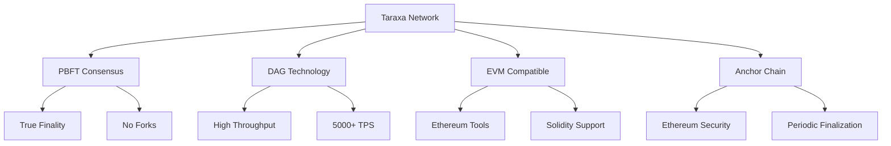

# บทที่ 1: Introduction to Taraxa

## 🎯 จุดประสงค์ของบทเรียน
- ทำความเข้าใจ Taraxa Network และ Architecture
- เรียนรู้ PBFT Consensus และ DAG Technology
- เปรียบเทียบกับ Blockchain platforms อื่น
- เข้าใจ Taraxa Ecosystem และ Use Cases

## 🌟 What is Taraxa?

**Taraxa** เป็น Layer-1 blockchain platform ที่ออกแบบมาเพื่อให้บริการ **scalability**, **speed**, และ **true finality** สำหรับ decentralized applications

### **🔥 Key Features**



## 🏗️ Taraxa Architecture

### **🔄 Dual-Layer Design**

```typescript
// Taraxa Architecture Overview
interface TaraxaArchitecture {
  layer1: {
    consensus: 'PBFT';
    structure: 'DAG';
    finality: 'Immediate';
    throughput: '5000+ TPS';
  };
  
  anchorChain: {
    platform: 'Ethereum';
    frequency: 'Periodic';
    purpose: 'Final Settlement';
    security: 'Ethereum Security Model';
  };
  
  compatibility: {
    vm: 'EVM';
    language: 'Solidity';
    tools: 'Ethereum Tools';
    wallets: 'MetaMask, etc.';
  };
}
```

### **⚡ PBFT Consensus Mechanism**

**Practical Byzantine Fault Tolerance (PBFT)** คือ consensus algorithm ที่ให้:

1. **True Finality** - ไม่มี Block reorganization
2. **Fast Confirmation** - Instant transaction finality
3. **Byzantine Fault Tolerance** - ทนต่อ malicious nodes ได้ 1/3
4. **Deterministic** - ไม่มี Probabilistic finality

```solidity
// PBFT Consensus Flow (Conceptual)
contract PBFTConsensus {
    enum Phase { PRE_PREPARE, PREPARE, COMMIT }
    
    struct ConsensusMessage {
        Phase phase;
        uint256 blockHeight;
        bytes32 blockHash;
        address validator;
        bytes signature;
    }
    
    mapping(uint256 => mapping(Phase => uint256)) public voteCount;
    uint256 public constant REQUIRED_VOTES = (TOTAL_VALIDATORS * 2) / 3 + 1;
    
    function processConsensus(ConsensusMessage memory message) external {
        require(isValidValidator(message.validator), "Invalid validator");
        require(verifySignature(message), "Invalid signature");
        
        voteCount[message.blockHeight][message.phase]++;
        
        if (voteCount[message.blockHeight][message.phase] >= REQUIRED_VOTES) {
            if (message.phase == Phase.COMMIT) {
                finalizeBlock(message.blockHeight, message.blockHash);
            }
        }
    }
    
    function finalizeBlock(uint256 height, bytes32 hash) internal {
        // Block is now finalized with true finality
        emit BlockFinalized(height, hash, block.timestamp);
    }
}
```

### **🌐 DAG (Directed Acyclic Graph) Structure**

Taraxa ใช้ DAG สำหรับเพิ่ม throughput:

```javascript
// DAG Block Structure
class DAGBlock {
  constructor(transactions, parentBlocks) {
    this.hash = this.calculateHash();
    this.transactions = transactions;
    this.parentBlocks = parentBlocks; // Multiple parents possible
    this.timestamp = Date.now();
    this.level = this.calculateLevel();
  }
  
  calculateLevel() {
    if (this.parentBlocks.length === 0) return 0;
    return Math.max(...this.parentBlocks.map(p => p.level)) + 1;
  }
  
  calculateHash() {
    return keccak256(
      this.transactions + 
      this.parentBlocks.map(p => p.hash).join('') + 
      this.timestamp
    );
  }
}

// DAG allows parallel block production
class DAGChain {
  constructor() {
    this.blocks = new Map();
    this.tips = new Set(); // Current DAG tips
  }
  
  addBlock(block) {
    this.blocks.set(block.hash, block);
    
    // Update tips
    block.parentBlocks.forEach(parent => {
      this.tips.delete(parent.hash);
    });
    this.tips.add(block.hash);
    
    console.log(`Block added at level ${block.level}`);
    console.log(`Current tips: ${this.tips.size}`);
  }
  
  getOrderedBlocks() {
    // Topological sort for transaction ordering
    return this.topologicalSort();
  }
}
```

## 🔗 Network Specifications

### **📊 Technical Specifications**

| Specification | Value |
|---------------|-------|
| **Consensus** | PBFT |
| **Structure** | DAG |
| **TPS** | 5,000+ |
| **Block Time** | ~1 second |
| **Finality** | Immediate |
| **VM** | EVM Compatible |
| **Language** | Solidity |
| **Gas Model** | Ethereum-like |

### **🌐 Network Information**

```typescript
// Taraxa Network Configuration
interface NetworkConfig {
  mainnet: {
    chainId: 841;
    name: 'Taraxa Mainnet';
    rpc: 'https://rpc.mainnet.taraxa.io';
    explorer: 'https://explorer.mainnet.taraxa.io';
    nativeCurrency: {
      name: 'TARA';
      symbol: 'TARA';
      decimals: 18;
    };
  };
  
  testnet: {
    chainId: 842;
    name: 'Taraxa Testnet';
    rpc: 'https://rpc.testnet.taraxa.io';
    explorer: 'https://explorer.testnet.taraxa.io';
    faucet: 'https://faucet.testnet.taraxa.io';
    nativeCurrency: {
      name: 'TARA';
      symbol: 'TARA';
      decimals: 18;
    };
  };
  
  devnet: {
    chainId: 843;
    name: 'Taraxa Devnet';
    rpc: 'https://rpc.devnet.taraxa.io';
    explorer: 'https://explorer.devnet.taraxa.io';
  };
}
```

## 💰 TARA Token Economics

### **🪙 TARA Token**

```solidity
// TARA Token Properties
contract TaraToken {
    string public constant name = "Taraxa";
    string public constant symbol = "TARA";
    uint8 public constant decimals = 18;
    uint256 public totalSupply = 10_000_000_000 * 10**18; // 10B TARA
    
    // Token Distribution
    mapping(string => uint256) public allocation;
    
    constructor() {
        allocation["ecosystem"] = totalSupply * 40 / 100;    // 40%
        allocation["team"] = totalSupply * 15 / 100;         // 15%
        allocation["advisors"] = totalSupply * 5 / 100;      // 5%
        allocation["foundation"] = totalSupply * 15 / 100;   // 15%
        allocation["public_sale"] = totalSupply * 25 / 100;  // 25%
    }
    
    // Gas fee mechanism
    function calculateGasFee(uint256 gasUsed, uint256 gasPrice) 
        external 
        pure 
        returns (uint256) 
    {
        return gasUsed * gasPrice;
    }
}
```

### **⛽ Gas Economics**

```javascript
// Gas Price Dynamics
class GasOracle {
  constructor() {
    this.baseGasPrice = 1e9; // 1 Gwei
    this.congestionMultiplier = 1.0;
  }
  
  getCurrentGasPrice() {
    const networkLoad = this.getNetworkCongestion();
    const dynamicPrice = this.baseGasPrice * this.calculateMultiplier(networkLoad);
    
    return {
      slow: Math.floor(dynamicPrice * 0.8),
      standard: Math.floor(dynamicPrice),
      fast: Math.floor(dynamicPrice * 1.2),
      rapid: Math.floor(dynamicPrice * 1.5)
    };
  }
  
  calculateMultiplier(congestionLevel) {
    // Dynamic gas pricing based on network congestion
    if (congestionLevel < 0.3) return 1.0;
    if (congestionLevel < 0.6) return 1.2;
    if (congestionLevel < 0.8) return 1.5;
    return 2.0;
  }
  
  getNetworkCongestion() {
    // Simplified congestion calculation
    const pendingTransactions = this.getPendingTxCount();
    const maxThroughput = 5000; // TPS
    
    return Math.min(pendingTransactions / maxThroughput, 1.0);
  }
}
```

## 🎯 Use Cases และ Applications

### **🔥 Primary Use Cases**

```typescript
// Taraxa Use Case Examples
interface UseCases {
  defi: {
    dex: 'Decentralized Exchanges';
    lending: 'Lending Protocols';
    staking: 'Staking Platforms';
    yield: 'Yield Farming';
  };
  
  nft: {
    marketplaces: 'NFT Trading';
    gaming: 'GameFi Applications';
    metaverse: 'Virtual Worlds';
    collectibles: 'Digital Collectibles';
  };
  
  enterprise: {
    supplyChain: 'Supply Chain Tracking';
    identity: 'Digital Identity';
    payments: 'Cross-border Payments';
    automation: 'Business Process Automation';
  };
  
  iot: {
    deviceManagement: 'IoT Device Management';
    micropayments: 'Machine-to-Machine Payments';
    dataMarkets: 'IoT Data Marketplaces';
    smartCities: 'Smart City Applications';
  };
}
```

### **🌟 Example: IoT Device Management**

```solidity
// IoT Device Registry on Taraxa
pragma solidity ^0.8.19;

contract IoTDeviceRegistry {
    struct Device {
        string deviceId;
        address owner;
        string deviceType;
        bool isActive;
        uint256 lastHeartbeat;
        mapping(string => string) metadata;
    }
    
    mapping(string => Device) public devices;
    mapping(address => string[]) public ownerDevices;
    
    event DeviceRegistered(string deviceId, address owner);
    event DeviceHeartbeat(string deviceId, uint256 timestamp);
    event DeviceStatusChanged(string deviceId, bool isActive);
    
    // Low-cost device registration due to Taraxa's low fees
    function registerDevice(
        string memory deviceId,
        string memory deviceType,
        string[] memory metadataKeys,
        string[] memory metadataValues
    ) external {
        require(bytes(devices[deviceId].deviceId).length == 0, "Device exists");
        
        devices[deviceId].deviceId = deviceId;
        devices[deviceId].owner = msg.sender;
        devices[deviceId].deviceType = deviceType;
        devices[deviceId].isActive = true;
        devices[deviceId].lastHeartbeat = block.timestamp;
        
        // Store metadata
        for (uint i = 0; i < metadataKeys.length; i++) {
            devices[deviceId].metadata[metadataKeys[i]] = metadataValues[i];
        }
        
        ownerDevices[msg.sender].push(deviceId);
        
        emit DeviceRegistered(deviceId, msg.sender);
    }
    
    // Frequent heartbeats with minimal gas cost
    function sendHeartbeat(string memory deviceId) external {
        require(devices[deviceId].owner == msg.sender, "Not device owner");
        
        devices[deviceId].lastHeartbeat = block.timestamp;
        devices[deviceId].isActive = true;
        
        emit DeviceHeartbeat(deviceId, block.timestamp);
    }
    
    // Instant finality for real-time applications
    function getDeviceStatus(string memory deviceId) 
        external 
        view 
        returns (bool isActive, uint256 lastSeen) 
    {
        Device storage device = devices[deviceId];
        
        // Consider device inactive if no heartbeat for 5 minutes
        bool currentlyActive = device.isActive && 
                              (block.timestamp - device.lastHeartbeat) < 300;
        
        return (currentlyActive, device.lastHeartbeat);
    }
}
```

## 🆚 Comparison with Other Platforms

### **📊 Platform Comparison**

| Feature | Taraxa | Ethereum | Polygon | BSC |
|---------|--------|----------|---------|-----|
| **Consensus** | PBFT | PoS | PoS | PoA |
| **TPS** | 5,000+ | 15 | 7,000 | 2,000 |
| **Finality** | Immediate | 2+ blocks | 128 blocks | 1 block |
| **Gas Fees** | Very Low | High | Low | Low |
| **EVM Compatible** | ✅ | ✅ | ✅ | ✅ |
| **Security Model** | PBFT + Ethereum | Ethereum | Polygon + Ethereum | BSC |

### **🎯 Taraxa Advantages**

```javascript
// Why Choose Taraxa?
const taraxaAdvantages = {
  trueFnality: {
    description: "Immediate transaction finality",
    benefit: "No waiting for multiple confirmations",
    useCase: "Real-time applications, IoT payments"
  },
  
  lowCost: {
    description: "Extremely low transaction fees",
    benefit: "Enables microtransactions and frequent interactions",
    useCase: "IoT applications, micropayments, gaming"
  },
  
  highThroughput: {
    description: "5,000+ TPS with DAG structure",
    benefit: "Handles high transaction volume",
    useCase: "DeFi protocols, NFT marketplaces"
  },
  
  evmCompatibility: {
    description: "Full Ethereum Virtual Machine compatibility",
    benefit: "Easy migration from Ethereum",
    useCase: "Existing dApps, developer tools"
  },
  
  anchorSecurity: {
    description: "Periodic anchoring to Ethereum",
    benefit: "Inherits Ethereum's security",
    useCase: "High-value applications, enterprise"
  }
};
```

## 🔮 Future Roadmap

### **🚀 Upcoming Features**

```typescript
// Taraxa Development Roadmap
interface RoadmapItems {
  q1_2025: {
    features: [
      'Enhanced Cross-chain Bridges',
      'Advanced Oracle Integration',
      'Mobile SDK Release'
    ];
    improvements: [
      'Gas Optimization',
      'Developer Tools Enhancement',
      'Network Performance Boost'
    ];
  };
  
  q2_2025: {
    features: [
      'Privacy-Preserving Transactions',
      'Advanced Governance Mechanisms',
      'Enterprise API Suite'
    ];
    partnerships: [
      'Major DeFi Protocol Integrations',
      'Enterprise Client Onboarding',
      'IoT Platform Partnerships'
    ];
  };
  
  longTerm: {
    research: [
      'Quantum-Resistant Cryptography',
      'Sharding Implementation',
      'AI-Powered Optimization'
    ];
    expansion: [
      'Multi-Chain Ecosystem',
      'Institutional Adoption',
      'Global IoT Integration'
    ];
  };
}
```

## 📚 Learning Resources

### **📖 Official Documentation**
- [Taraxa Whitepaper](https://docs.taraxa.io/whitepaper)
- [Technical Documentation](https://docs.taraxa.io/tech-docs)
- [Developer Guides](https://docs.taraxa.io/developers)

### **🛠️ Development Tools**
- [Taraxa Explorer](https://explorer.mainnet.taraxa.io)
- [Testnet Faucet](https://faucet.testnet.taraxa.io)
- [Web3 Integration Guide](https://docs.taraxa.io/web3)

### **🌐 Community**
- [Discord Community](https://discord.gg/taraxa)
- [Developer Forum](https://forum.taraxa.io)
- [GitHub Repository](https://github.com/Taraxa-project)

## 🎯 แบบฝึกหัด

### **📝 แบบฝึกหัดที่ 1: Research Exercise**
ศึกษาและเปรียบเทียบ:

1. **PBFT vs PoS**: วิเคราะห์ความแตกต่างของ consensus mechanisms
2. **DAG vs Blockchain**: เปรียบเทียบ structure และ performance
3. **Use Case Analysis**: หา 3 use cases ที่เหมาะกับ Taraxa มากกว่า platforms อื่น

### **🔍 แบบฝึกหัดที่ 2: Network Exploration**
สำรวจ Taraxa Network:

1. เยี่ยมชม [Taraxa Explorer](https://explorer.mainnet.taraxa.io)
2. วิเคราะห์ recent transactions และ blocks
3. ศึกษา network statistics และ validator information

### **💭 แบบฝึกหัดที่ 3: Concept Validation**
ตอบคำถาม:

1. ทำไม True Finality สำคัญสำหรับ IoT applications?
2. DAG structure ช่วยเพิ่ม throughput ได้อย่างไร?
3. การ anchor ไป Ethereum ให้ benefit อะไรบ้าง?

## 🔗 การเชื่อมต่อ

**บทถัดไป**: [บทที่ 2: Development Environment Setup](./02-development-environment.md)

**กลับไปหน้าหลัก**: [README](./README.md)

---

## 📚 เอกสารอ้างอิง

- [Taraxa Official Website](https://taraxa.io)
- [Taraxa Documentation](https://docs.taraxa.io)
- [PBFT Consensus Paper](https://pmg.csail.mit.edu/papers/osdi99.pdf)
- [DAG Technology Overview](https://docs.taraxa.io/tech-docs/dag)

---

ในบทถัดไป เราจะเรียนรู้การตั้งค่า Development Environment สำหรับพัฒนา Smart Contracts บน Taraxa! 🚀
