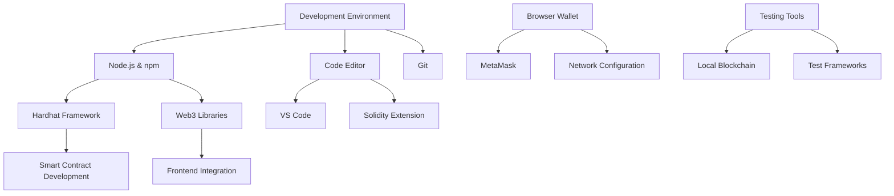

# บทที่ 2: Development Environment Setup

## 🎯 จุดประสงค์ของบทเรียน
- ติดตั้งและกำหนดค่า Development Environment
- เชื่อมต่อ MetaMask กับ Taraxa Network
- ตั้งค่า Hardhat และ Development Tools
- ทดสอบการเชื่อมต่อและรับ Test Tokens

## 🛠️ Required Tools Overview

### **📦 Essential Development Stack**



## 🏗️ Installation Guide

### **1️⃣ Node.js และ npm Installation**

```bash
# Download และ Install Node.js (LTS version)
# https://nodejs.org/

# ตรวจสอบ installation
node --version  # Should be 18.0.0 or higher
npm --version   # Should be 8.0.0 or higher

# ใช้ nvm สำหรับ version management (Optional)
# Windows: https://github.com/coreybutler/nvm-windows
# Mac/Linux: https://github.com/nvm-sh/nvm

nvm install 18.18.0
nvm use 18.18.0
```

### **2️⃣ Code Editor Setup**

```json
// VS Code Extensions (Recommended)
{
  "recommendations": [
    "JuanBlanco.solidity",
    "NomicFoundation.hardhat-solidity",
    "ms-vscode.vscode-json",
    "bradlc.vscode-tailwindcss",
    "esbenp.prettier-vscode",
    "ms-vscode.vscode-eslint"
  ]
}
```

**VS Code Settings for Solidity:**

```json
// settings.json
{
  "solidity.compileUsingRemoteVersion": "v0.8.19",
  "solidity.defaultCompiler": "remote",
  "solidity.packageDefaultDependenciesContractsDirectory": "contracts",
  "solidity.packageDefaultDependenciesDirectory": "node_modules",
  "solidity.formatter": "prettier",
  "[solidity]": {
    "editor.defaultFormatter": "JuanBlanco.solidity",
    "editor.tabSize": 4,
    "editor.insertSpaces": true
  }
}
```

### **3️⃣ Git Setup**

```bash
# Install Git
# https://git-scm.com/downloads

# Configure Git
git config --global user.name "Your Name"
git config --global user.email "your.email@example.com"

# Generate SSH Key (Optional but recommended)
ssh-keygen -t rsa -b 4096 -C "your.email@example.com"
```

## 🦊 MetaMask Configuration

### **📱 MetaMask Installation และ Setup**

```javascript
// MetaMask Installation Steps:
// 1. Visit https://metamask.io/
// 2. Install browser extension
// 3. Create new wallet or import existing
// 4. Secure your seed phrase!

// Taraxa Network Configuration
const taraxaNetworks = {
  mainnet: {
    chainId: '0x349', // 841 in decimal
    chainName: 'Taraxa Mainnet',
    nativeCurrency: {
      name: 'TARA',
      symbol: 'TARA',
      decimals: 18
    },
    rpcUrls: ['https://rpc.mainnet.taraxa.io'],
    blockExplorerUrls: ['https://explorer.mainnet.taraxa.io']
  },
  
  testnet: {
    chainId: '0x34A', // 842 in decimal
    chainName: 'Taraxa Testnet',
    nativeCurrency: {
      name: 'TARA',
      symbol: 'TARA',
      decimals: 18
    },
    rpcUrls: ['https://rpc.testnet.taraxa.io'],
    blockExplorerUrls: ['https://explorer.testnet.taraxa.io']
  }
};
```

### **⚙️ Manual Network Addition**

```javascript
// Add Taraxa Networks to MetaMask
async function addTaraxaNetworks() {
  try {
    // Add Testnet
    await window.ethereum.request({
      method: 'wallet_addEthereumChain',
      params: [{
        chainId: '0x34A',
        chainName: 'Taraxa Testnet',
        nativeCurrency: {
          name: 'TARA',
          symbol: 'TARA',
          decimals: 18
        },
        rpcUrls: ['https://rpc.testnet.taraxa.io'],
        blockExplorerUrls: ['https://explorer.testnet.taraxa.io']
      }]
    });
    
    // Add Mainnet
    await window.ethereum.request({
      method: 'wallet_addEthereumChain',
      params: [{
        chainId: '0x349',
        chainName: 'Taraxa Mainnet',
        nativeCurrency: {
          name: 'TARA',
          symbol: 'TARA',
          decimals: 18
        },
        rpcUrls: ['https://rpc.mainnet.taraxa.io'],
        blockExplorerUrls: ['https://explorer.mainnet.taraxa.io']
      }]
    });
    
    console.log('Taraxa networks added successfully!');
  } catch (error) {
    console.error('Failed to add networks:', error);
  }
}

// Call function after page load
addTaraxaNetworks();
```

## 🔧 Hardhat Development Environment

### **🚀 Project Setup**

```bash
# Create new project directory
mkdir taraxa-dapp-development
cd taraxa-dapp-development

# Initialize npm project
npm init -y

# Install Hardhat และ dependencies
npm install --save-dev hardhat
npm install --save-dev @nomiclabs/hardhat-ethers
npm install --save-dev @nomiclabs/hardhat-waffle
npm install --save-dev ethereum-waffle
npm install --save-dev chai
npm install --save-dev ethers
npm install --save-dev @openzeppelin/contracts
npm install --save-dev @typechain/hardhat
npm install --save-dev typechain

# Install additional tools
npm install --save-dev prettier
npm install --save-dev prettier-plugin-solidity
npm install --save-dev solhint
npm install --save-dev hardhat-gas-reporter
npm install --save-dev hardhat-contract-sizer

# Install runtime dependencies
npm install ethers
npm install @openzeppelin/contracts
```

### **⚙️ Hardhat Configuration**

```javascript
// hardhat.config.js
require("@nomiclabs/hardhat-waffle");
require("@nomiclabs/hardhat-ethers");
require("hardhat-gas-reporter");
require("hardhat-contract-sizer");

// Import environment variables
require('dotenv').config();

const PRIVATE_KEY = process.env.PRIVATE_KEY || "";
const TARAXA_TESTNET_RPC = "https://rpc.testnet.taraxa.io";
const TARAXA_MAINNET_RPC = "https://rpc.mainnet.taraxa.io";

module.exports = {
  solidity: {
    version: "0.8.19",
    settings: {
      optimizer: {
        enabled: true,
        runs: 200
      },
      viaIR: true
    }
  },
  
  networks: {
    // Local development
    hardhat: {
      chainId: 1337,
      accounts: {
        mnemonic: "test test test test test test test test test test test junk",
        count: 10,
        accountsBalance: "10000000000000000000000" // 10000 ETH
      }
    },
    
    // Taraxa Testnet
    taraxaTestnet: {
      url: TARAXA_TESTNET_RPC,
      chainId: 842,
      accounts: PRIVATE_KEY ? [PRIVATE_KEY] : [],
      gasPrice: 1000000000, // 1 Gwei
      gas: 8000000,
      timeout: 60000
    },
    
    // Taraxa Mainnet
    taraxaMainnet: {
      url: TARAXA_MAINNET_RPC,
      chainId: 841,
      accounts: PRIVATE_KEY ? [PRIVATE_KEY] : [],
      gasPrice: 1000000000, // 1 Gwei
      gas: 8000000,
      timeout: 60000
    }
  },
  
  gasReporter: {
    enabled: process.env.REPORT_GAS !== undefined,
    currency: "USD",
    gasPrice: 1,
    token: "TARA"
  },
  
  contractSizer: {
    alphaSort: true,
    runOnCompile: true,
    disambiguatePaths: false
  },
  
  paths: {
    sources: "./contracts",
    tests: "./test",
    cache: "./cache",
    artifacts: "./artifacts"
  },
  
  mocha: {
    timeout: 60000
  }
};
```

### **🔐 Environment Variables Setup**

```bash
# Create .env file
touch .env

# Add to .gitignore
echo ".env" >> .gitignore
echo "node_modules/" >> .gitignore
echo "cache/" >> .gitignore
echo "artifacts/" >> .gitignore
echo "coverage/" >> .gitignore
```

```bash
# .env file content
PRIVATE_KEY=your_private_key_here
TARAXA_TESTNET_RPC=https://rpc.testnet.taraxa.io
TARAXA_MAINNET_RPC=https://rpc.mainnet.taraxa.io

# Optional: API keys for services
ETHERSCAN_API_KEY=your_etherscan_api_key
COINMARKETCAP_API_KEY=your_cmc_api_key
```

### **📁 Project Structure**

```
taraxa-dapp-development/
├── contracts/           # Smart contracts
│   ├── Token.sol
│   └── DApp.sol
├── scripts/            # Deployment scripts
│   ├── deploy.js
│   └── verify.js
├── test/              # Test files
│   ├── Token.test.js
│   └── DApp.test.js
├── frontend/          # Frontend application
│   ├── src/
│   ├── public/
│   └── package.json
├── docs/             # Documentation
├── hardhat.config.js # Hardhat configuration
├── package.json      # NPM configuration
├── .env             # Environment variables
├── .gitignore       # Git ignore rules
└── README.md        # Project documentation
```

## 🧪 Testing the Setup

### **✅ Basic Test Contract**

```solidity
// contracts/TestContract.sol
// SPDX-License-Identifier: MIT
pragma solidity ^0.8.19;

contract TestContract {
    string public message;
    address public owner;
    uint256 public deploymentTimestamp;
    
    event MessageChanged(string newMessage, address changedBy);
    
    constructor(string memory _initialMessage) {
        message = _initialMessage;
        owner = msg.sender;
        deploymentTimestamp = block.timestamp;
    }
    
    function setMessage(string memory _newMessage) external {
        message = _newMessage;
        emit MessageChanged(_newMessage, msg.sender);
    }
    
    function getMessage() external view returns (string memory) {
        return message;
    }
    
    function getContractInfo() external view returns (
        string memory currentMessage,
        address contractOwner,
        uint256 deployedAt,
        uint256 currentTime
    ) {
        return (message, owner, deploymentTimestamp, block.timestamp);
    }
}
```

### **🧪 Test Script**

```javascript
// test/TestContract.test.js
const { expect } = require("chai");
const { ethers } = require("hardhat");

describe("TestContract", function () {
  let testContract;
  let owner;
  let addr1;
  let addr2;

  beforeEach(async function () {
    [owner, addr1, addr2] = await ethers.getSigners();
    
    const TestContract = await ethers.getContractFactory("TestContract");
    testContract = await TestContract.deploy("Hello Taraxa!");
    await testContract.deployed();
  });

  describe("Deployment", function () {
    it("Should set the right message", async function () {
      expect(await testContract.message()).to.equal("Hello Taraxa!");
    });

    it("Should set the right owner", async function () {
      expect(await testContract.owner()).to.equal(owner.address);
    });

    it("Should set deployment timestamp", async function () {
      const timestamp = await testContract.deploymentTimestamp();
      expect(timestamp).to.be.gt(0);
    });
  });

  describe("Message Management", function () {
    it("Should change message", async function () {
      await testContract.setMessage("New message");
      expect(await testContract.getMessage()).to.equal("New message");
    });

    it("Should emit MessageChanged event", async function () {
      await expect(testContract.setMessage("Event test"))
        .to.emit(testContract, "MessageChanged")
        .withArgs("Event test", owner.address);
    });

    it("Should allow anyone to change message", async function () {
      await testContract.connect(addr1).setMessage("From addr1");
      expect(await testContract.getMessage()).to.equal("From addr1");
    });
  });

  describe("Contract Info", function () {
    it("Should return complete contract info", async function () {
      const info = await testContract.getContractInfo();
      
      expect(info.currentMessage).to.equal("Hello Taraxa!");
      expect(info.contractOwner).to.equal(owner.address);
      expect(info.deployedAt).to.be.gt(0);
      expect(info.currentTime).to.be.gt(info.deployedAt);
    });
  });
});
```

### **🚀 Deployment Script**

```javascript
// scripts/deploy-test.js
const { ethers } = require("hardhat");

async function main() {
  console.log("🚀 Starting deployment to Taraxa...");
  
  // Get network information
  const network = await ethers.provider.getNetwork();
  console.log(`📡 Network: ${network.name} (Chain ID: ${network.chainId})`);
  
  // Get deployer account
  const [deployer] = await ethers.getSigners();
  console.log(`👤 Deploying with account: ${deployer.address}`);
  
  // Check balance
  const balance = await deployer.getBalance();
  console.log(`💰 Account balance: ${ethers.utils.formatEther(balance)} TARA`);
  
  // Deploy contract
  console.log("\n📦 Deploying TestContract...");
  
  const TestContract = await ethers.getContractFactory("TestContract");
  const testContract = await TestContract.deploy("Hello Taraxa Network!");
  
  // Wait for deployment
  await testContract.deployed();
  
  console.log(`✅ TestContract deployed to: ${testContract.address}`);
  console.log(`🔗 View on explorer: https://explorer.testnet.taraxa.io/address/${testContract.address}`);
  
  // Test contract functionality
  console.log("\n🧪 Testing contract functionality...");
  
  const message = await testContract.getMessage();
  console.log(`📝 Current message: ${message}`);
  
  const owner = await testContract.owner();
  console.log(`👤 Contract owner: ${owner}`);
  
  // Change message
  console.log("\n🔄 Changing message...");
  const tx = await testContract.setMessage("Deployment test successful!");
  await tx.wait();
  
  const newMessage = await testContract.getMessage();
  console.log(`📝 New message: ${newMessage}`);
  
  console.log("\n🎉 Deployment and testing completed successfully!");
}

main()
  .then(() => process.exit(0))
  .catch((error) => {
    console.error("❌ Deployment failed:", error);
    process.exit(1);
  });
```

## 🧰 Additional Development Tools

### **🔍 Web3 Connection Testing**

```javascript
// scripts/test-connection.js
const { ethers } = require("hardhat");

async function testConnection() {
  console.log("🔄 Testing Taraxa network connection...");
  
  try {
    // Test provider connection
    const provider = ethers.provider;
    const network = await provider.getNetwork();
    
    console.log(`✅ Connected to: ${network.name}`);
    console.log(`🆔 Chain ID: ${network.chainId}`);
    
    // Get latest block
    const blockNumber = await provider.getBlockNumber();
    console.log(`📦 Latest block: ${blockNumber}`);
    
    // Get block details
    const block = await provider.getBlock(blockNumber);
    console.log(`⏰ Block timestamp: ${new Date(block.timestamp * 1000)}`);
    console.log(`💰 Block gas limit: ${block.gasLimit.toString()}`);
    
    // Test account connection
    const [account] = await ethers.getSigners();
    console.log(`👤 Account address: ${account.address}`);
    
    const balance = await account.getBalance();
    console.log(`💰 Account balance: ${ethers.utils.formatEther(balance)} TARA`);
    
    // Test gas price
    const gasPrice = await provider.getGasPrice();
    console.log(`⛽ Current gas price: ${ethers.utils.formatUnits(gasPrice, "gwei")} Gwei`);
    
    console.log("\n🎉 All connection tests passed!");
    
  } catch (error) {
    console.error("❌ Connection test failed:", error.message);
    
    // Provide troubleshooting tips
    console.log("\n🔧 Troubleshooting tips:");
    console.log("1. Check your internet connection");
    console.log("2. Verify RPC URL in hardhat.config.js");
    console.log("3. Ensure private key is set in .env file");
    console.log("4. Check if Taraxa network is accessible");
  }
}

testConnection();
```

### **💧 Faucet Integration**

```javascript
// scripts/request-testnet-tokens.js
const axios = require('axios');

async function requestTestnetTokens(address) {
  console.log(`💧 Requesting testnet TARA for address: ${address}`);
  
  try {
    // Note: Replace with actual Taraxa faucet API
    const faucetUrl = 'https://faucet.testnet.taraxa.io/api/request';
    
    const response = await axios.post(faucetUrl, {
      address: address,
      amount: '10' // Request 10 TARA
    });
    
    if (response.data.success) {
      console.log(`✅ Tokens requested successfully!`);
      console.log(`🔗 Transaction hash: ${response.data.txHash}`);
      console.log(`⏰ Please wait a few moments for confirmation`);
    } else {
      console.log(`❌ Faucet request failed: ${response.data.message}`);
    }
    
  } catch (error) {
    console.error("❌ Faucet request error:", error.message);
    console.log("\n💡 Alternative methods:");
    console.log("1. Visit https://faucet.testnet.taraxa.io manually");
    console.log("2. Join Taraxa Discord for faucet access");
    console.log("3. Ask community members for testnet tokens");
  }
}

// Get address from command line or use default account
async function main() {
  const { ethers } = require("hardhat");
  const [account] = await ethers.getSigners();
  
  await requestTestnetTokens(account.address);
}

main();
```

### **📊 Network Monitoring**

```javascript
// scripts/monitor-network.js
const { ethers } = require("hardhat");

class NetworkMonitor {
  constructor() {
    this.provider = ethers.provider;
    this.isMonitoring = false;
  }
  
  async startMonitoring() {
    if (this.isMonitoring) return;
    
    this.isMonitoring = true;
    console.log("🔍 Starting network monitoring...");
    
    // Monitor new blocks
    this.provider.on("block", async (blockNumber) => {
      const block = await this.provider.getBlock(blockNumber);
      console.log(`📦 New block ${blockNumber}: ${block.transactions.length} transactions`);
    });
    
    // Monitor pending transactions (if supported)
    try {
      this.provider.on("pending", (txHash) => {
        console.log(`⏳ Pending transaction: ${txHash}`);
      });
    } catch (error) {
      console.log("ℹ️ Pending transaction monitoring not available");
    }
    
    // Periodic network statistics
    setInterval(async () => {
      await this.logNetworkStats();
    }, 30000); // Every 30 seconds
  }
  
  async logNetworkStats() {
    try {
      const blockNumber = await this.provider.getBlockNumber();
      const gasPrice = await this.provider.getGasPrice();
      const network = await this.provider.getNetwork();
      
      console.log(`\n📊 Network Stats (${new Date().toISOString()})`);
      console.log(`🆔 Chain ID: ${network.chainId}`);
      console.log(`📦 Latest block: ${blockNumber}`);
      console.log(`⛽ Gas price: ${ethers.utils.formatUnits(gasPrice, "gwei")} Gwei`);
      
    } catch (error) {
      console.error("❌ Failed to fetch network stats:", error.message);
    }
  }
  
  stopMonitoring() {
    this.isMonitoring = false;
    this.provider.removeAllListeners();
    console.log("⏹️ Monitoring stopped");
  }
}

// Start monitoring
const monitor = new NetworkMonitor();
monitor.startMonitoring();

// Stop monitoring on CTRL+C
process.on('SIGINT', () => {
  monitor.stopMonitoring();
  process.exit(0);
});
```

## 🧪 Running the Setup

### **📝 Package.json Scripts**

```json
{
  "scripts": {
    "compile": "hardhat compile",
    "test": "hardhat test",
    "test:coverage": "hardhat coverage",
    "deploy:local": "hardhat run scripts/deploy-test.js --network hardhat",
    "deploy:testnet": "hardhat run scripts/deploy-test.js --network taraxaTestnet",
    "deploy:mainnet": "hardhat run scripts/deploy-test.js --network taraxaMainnet",
    "verify:testnet": "hardhat verify --network taraxaTestnet",
    "test-connection": "hardhat run scripts/test-connection.js --network taraxaTestnet",
    "monitor": "hardhat run scripts/monitor-network.js --network taraxaTestnet",
    "faucet": "hardhat run scripts/request-testnet-tokens.js",
    "node": "hardhat node",
    "clean": "hardhat clean",
    "size": "hardhat size-contracts",
    "gas-report": "REPORT_GAS=true hardhat test"
  }
}
```

### **🚀 Testing Your Setup**

```bash
# 1. Compile contracts
npm run compile

# 2. Run local tests
npm run test

# 3. Test network connection
npm run test-connection

# 4. Request testnet tokens
npm run faucet

# 5. Deploy to testnet
npm run deploy:testnet

# 6. Monitor network (optional)
npm run monitor
```

## 🔧 Troubleshooting

### **❌ Common Issues และ Solutions**

```javascript
// Common Setup Issues และ Solutions
const troubleshootingGuide = {
  "Node version issues": {
    problem: "Hardhat requires Node.js 18+",
    solution: [
      "Install Node.js 18+ from nodejs.org",
      "Use nvm to manage Node versions",
      "Verify with: node --version"
    ]
  },
  
  "Network connection failed": {
    problem: "Cannot connect to Taraxa RPC",
    solution: [
      "Check internet connection",
      "Verify RPC URL in hardhat.config.js",
      "Try alternative RPC endpoints",
      "Check firewall settings"
    ]
  },
  
  "Private key issues": {
    problem: "Invalid private key or insufficient funds",
    solution: [
      "Export private key from MetaMask",
      "Add private key to .env file",
      "Request testnet tokens from faucet",
      "Verify account balance"
    ]
  },
  
  "Compilation errors": {
    problem: "Solidity compilation fails",
    solution: [
      "Check Solidity version in hardhat.config.js",
      "Verify contract syntax",
      "Install missing dependencies",
      "Clear cache: hardhat clean"
    ]
  },
  
  "Gas estimation failed": {
    problem: "Transaction gas estimation fails",
    solution: [
      "Check contract for infinite loops",
      "Verify function parameters",
      "Increase gas limit in config",
      "Test on local network first"
    ]
  }
};
```

### **🔍 Debug Helpers**

```javascript
// scripts/debug-setup.js
async function debugSetup() {
  console.log("🔍 Running setup diagnostics...\n");
  
  // Check Node.js version
  console.log(`📦 Node.js version: ${process.version}`);
  
  // Check npm packages
  try {
    const packageJson = require('../package.json');
    console.log(`📋 Project: ${packageJson.name}`);
    console.log(`🔖 Version: ${packageJson.version}`);
  } catch (error) {
    console.log("❌ package.json not found");
  }
  
  // Check Hardhat config
  try {
    const config = require('../hardhat.config.js');
    console.log("✅ Hardhat config loaded");
    console.log(`🌐 Networks configured: ${Object.keys(config.networks).join(', ')}`);
  } catch (error) {
    console.log("❌ Hardhat config error:", error.message);
  }
  
  // Check environment variables
  require('dotenv').config();
  console.log(`🔐 Private key set: ${process.env.PRIVATE_KEY ? 'Yes' : 'No'}`);
  
  // Test network connection
  try {
    const { ethers } = require("hardhat");
    const provider = ethers.provider;
    const network = await provider.getNetwork();
    console.log(`🌐 Network connection: ✅ ${network.name}`);
    
    const [account] = await ethers.getSigners();
    const balance = await account.getBalance();
    console.log(`💰 Account balance: ${ethers.utils.formatEther(balance)} TARA`);
    
  } catch (error) {
    console.log(`🌐 Network connection: ❌ ${error.message}`);
  }
  
  console.log("\n🎉 Diagnostics completed!");
}

debugSetup();
```

## 🎯 แบบฝึกหัด

### **🛠️ แบบฝึกหัดที่ 1: Environment Setup**
1. ติดตั้ง development tools ทั้งหมด
2. กำหนดค่า MetaMask สำหรับ Taraxa networks
3. สร้าง Hardhat project และรัน test

### **🔧 แบบฝึกหัดที่ 2: Network Testing**
1. Deploy TestContract ไป Taraxa testnet
2. ทดสอบการเรียก functions ผ่าน scripts
3. Monitor network activity

### **🎯 แบบฝึกหัดที่ 3: Troubleshooting**
1. ทำให้เกิด error แล้วแก้ไข
2. ทดสอบการ debug และ monitoring
3. เขียน custom deployment script

## 🔗 การเชื่อมต่อ

**บทก่อนหน้า**: [บทที่ 1: Introduction to Taraxa](./01-introduction-to-taraxa.md)  
**บทถัดไป**: [บทที่ 3: Solidity Fundamentals](./03-solidity-fundamentals.md)

**กลับไปหน้าหลัก**: [README](./README.md)

---

## 📚 เอกสารอ้างอิง

- [Hardhat Documentation](https://hardhat.org/docs)
- [MetaMask Documentation](https://docs.metamask.io/)
- [Taraxa Developer Docs](https://docs.taraxa.io/developers)
- [Ethers.js Documentation](https://docs.ethers.io/)

---

ตอนนี้คุณมี development environment ที่พร้อมสำหรับพัฒนา Smart Contracts บน Taraxa แล้ว! ในบทถัดไป เราจะเรียนรู้ Solidity fundamentals 🚀
