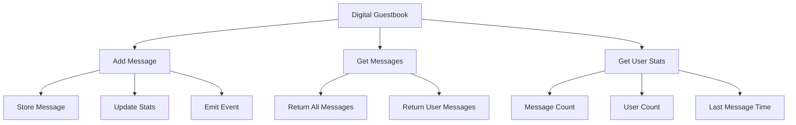

# บทที่ 4: First Smart Contract

## 🎯 จุดประสงค์ของบทเรียน
- สร้าง Smart Contract แรกบน Taraxa Network
- เรียนรู้การ compile, deploy และ interact กับ contract
- ทำความเข้าใจ gas costs และ transaction flow
- ฝึกใช้ Hardhat สำหรับ development workflow

## 🚀 Your First Contract: Digital Guestbook

เราจะสร้าง **Digital Guestbook** - contract ที่ให้ users เขียนข้อความและเก็บไว้บน blockchain

### **📝 Contract Design**



### **🏗️ Complete Contract Implementation**

```solidity
// SPDX-License-Identifier: MIT
pragma solidity ^0.8.19;

/**
 * @title DigitalGuestbook
 * @dev A simple guestbook contract for Taraxa Network
 * @author Your Name
 */
contract DigitalGuestbook {
    // ============= STRUCTS =============
    
    struct Message {
        address author;
        string content;
        uint256 timestamp;
        uint256 messageId;
        bool isActive;
    }
    
    struct UserStats {
        uint256 messageCount;
        uint256 firstMessageTime;
        uint256 lastMessageTime;
        bool hasMessaged;
    }
    
    // ============= STATE VARIABLES =============
    
    // Contract info
    string public name;
    address public owner;
    uint256 public creationTime;
    bool public isActive;
    
    // Message storage
    Message[] public messages;
    mapping(address => uint256[]) public userMessages;
    mapping(address => UserStats) public userStats;
    
    // Contract statistics
    uint256 public totalMessages;
    uint256 public totalUsers;
    uint256 public lastMessageTime;
    
    // Configuration
    uint256 public maxMessageLength;
    uint256 public minMessageLength;
    mapping(address => bool) public bannedUsers;
    
    // ============= EVENTS =============
    
    event MessageAdded(
        address indexed author,
        uint256 indexed messageId,
        string content,
        uint256 timestamp
    );
    
    event MessageRemoved(
        address indexed author,
        uint256 indexed messageId,
        uint256 timestamp
    );
    
    event UserBanned(address indexed user, uint256 timestamp);
    event UserUnbanned(address indexed user, uint256 timestamp);
    
    event ContractStateChanged(bool isActive, uint256 timestamp);
    
    event OwnershipTransferred(
        address indexed previousOwner,
        address indexed newOwner,
        uint256 timestamp
    );
    
    // ============= MODIFIERS =============
    
    modifier onlyOwner() {
        require(msg.sender == owner, "Only owner can call this function");
        _;
    }
    
    modifier contractActive() {
        require(isActive, "Contract is not active");
        _;
    }
    
    modifier notBanned() {
        require(!bannedUsers[msg.sender], "User is banned");
        _;
    }
    
    modifier validMessage(string memory _content) {
        bytes memory contentBytes = bytes(_content);
        require(
            contentBytes.length >= minMessageLength && 
            contentBytes.length <= maxMessageLength,
            "Message length is invalid"
        );
        _;
    }
    
    modifier messageExists(uint256 _messageId) {
        require(_messageId < messages.length, "Message does not exist");
        require(messages[_messageId].isActive, "Message is not active");
        _;
    }
    
    // ============= CONSTRUCTOR =============
    
    constructor(
        string memory _name,
        uint256 _maxMessageLength,
        uint256 _minMessageLength
    ) {
        require(bytes(_name).length > 0, "Name cannot be empty");
        require(_maxMessageLength > _minMessageLength, "Invalid length limits");
        require(_minMessageLength > 0, "Min length must be positive");
        
        name = _name;
        owner = msg.sender;
        creationTime = block.timestamp;
        isActive = true;
        
        maxMessageLength = _maxMessageLength;
        minMessageLength = _minMessageLength;
        
        totalMessages = 0;
        totalUsers = 0;
        lastMessageTime = 0;
    }
    
    // ============= MAIN FUNCTIONS =============
    
    /**
     * @dev Add a new message to the guestbook
     * @param _content The message content
     */
    function addMessage(string memory _content) 
        external 
        contractActive 
        notBanned 
        validMessage(_content) 
    {
        // Create new message
        Message memory newMessage = Message({
            author: msg.sender,
            content: _content,
            timestamp: block.timestamp,
            messageId: messages.length,
            isActive: true
        });
        
        // Store message
        messages.push(newMessage);
        userMessages[msg.sender].push(newMessage.messageId);
        
        // Update user stats
        if (!userStats[msg.sender].hasMessaged) {
            userStats[msg.sender].hasMessaged = true;
            userStats[msg.sender].firstMessageTime = block.timestamp;
            totalUsers++;
        }
        
        userStats[msg.sender].messageCount++;
        userStats[msg.sender].lastMessageTime = block.timestamp;
        
        // Update contract stats
        totalMessages++;
        lastMessageTime = block.timestamp;
        
        // Emit event
        emit MessageAdded(msg.sender, newMessage.messageId, _content, block.timestamp);
    }
    
    /**
     * @dev Remove a message (only by author or owner)
     * @param _messageId The ID of message to remove
     */
    function removeMessage(uint256 _messageId) 
        external 
        messageExists(_messageId) 
    {
        Message storage message = messages[_messageId];
        
        require(
            msg.sender == message.author || msg.sender == owner,
            "Only author or owner can remove message"
        );
        
        // Mark as inactive instead of deleting
        message.isActive = false;
        
        // Update stats
        if (userStats[message.author].messageCount > 0) {
            userStats[message.author].messageCount--;
        }
        
        if (totalMessages > 0) {
            totalMessages--;
        }
        
        emit MessageRemoved(message.author, _messageId, block.timestamp);
    }
    
    // ============= VIEW FUNCTIONS =============
    
    /**
     * @dev Get all active messages
     * @return Array of active messages
     */
    function getAllMessages() external view returns (Message[] memory) {
        // Count active messages
        uint256 activeCount = 0;
        for (uint256 i = 0; i < messages.length; i++) {
            if (messages[i].isActive) {
                activeCount++;
            }
        }
        
        // Create array with active messages only
        Message[] memory activeMessages = new Message[](activeCount);
        uint256 currentIndex = 0;
        
        for (uint256 i = 0; i < messages.length; i++) {
            if (messages[i].isActive) {
                activeMessages[currentIndex] = messages[i];
                currentIndex++;
            }
        }
        
        return activeMessages;
    }
    
    /**
     * @dev Get messages by specific user
     * @param _user The user address
     * @return Array of user's active messages
     */
    function getUserMessages(address _user) external view returns (Message[] memory) {
        uint256[] memory userMessageIds = userMessages[_user];
        
        // Count active messages
        uint256 activeCount = 0;
        for (uint256 i = 0; i < userMessageIds.length; i++) {
            if (messages[userMessageIds[i]].isActive) {
                activeCount++;
            }
        }
        
        // Create array with active messages
        Message[] memory activeUserMessages = new Message[](activeCount);
        uint256 currentIndex = 0;
        
        for (uint256 i = 0; i < userMessageIds.length; i++) {
            uint256 messageId = userMessageIds[i];
            if (messages[messageId].isActive) {
                activeUserMessages[currentIndex] = messages[messageId];
                currentIndex++;
            }
        }
        
        return activeUserMessages;
    }
    
    /**
     * @dev Get recent messages (last N messages)
     * @param _count Number of recent messages to return
     * @return Array of recent messages
     */
    function getRecentMessages(uint256 _count) external view returns (Message[] memory) {
        require(_count > 0, "Count must be positive");
        
        // Count active messages
        uint256 activeCount = 0;
        for (uint256 i = 0; i < messages.length; i++) {
            if (messages[i].isActive) {
                activeCount++;
            }
        }
        
        if (activeCount == 0) {
            return new Message[](0);
        }
        
        uint256 returnCount = _count > activeCount ? activeCount : _count;
        Message[] memory recentMessages = new Message[](returnCount);
        
        uint256 currentIndex = 0;
        // Start from end and work backwards
        for (uint256 i = messages.length; i > 0 && currentIndex < returnCount; i--) {
            if (messages[i-1].isActive) {
                recentMessages[currentIndex] = messages[i-1];
                currentIndex++;
            }
        }
        
        return recentMessages;
    }
    
    /**
     * @dev Get contract statistics
     * @return Various contract statistics
     */
    function getContractStats() external view returns (
        uint256 _totalMessages,
        uint256 _totalUsers,
        uint256 _lastMessageTime,
        uint256 _creationTime,
        bool _isActive,
        address _owner
    ) {
        return (
            totalMessages,
            totalUsers,
            lastMessageTime,
            creationTime,
            isActive,
            owner
        );
    }
    
    /**
     * @dev Get user statistics
     * @param _user The user address
     * @return User statistics
     */
    function getUserStats(address _user) external view returns (UserStats memory) {
        return userStats[_user];
    }
    
    /**
     * @dev Get message by ID
     * @param _messageId The message ID
     * @return The message struct
     */
    function getMessage(uint256 _messageId) 
        external 
        view 
        messageExists(_messageId) 
        returns (Message memory) 
    {
        return messages[_messageId];
    }
    
    /**
     * @dev Get total number of messages (including inactive)
     * @return Total message count
     */
    function getTotalMessageCount() external view returns (uint256) {
        return messages.length;
    }
    
    // ============= ADMIN FUNCTIONS =============
    
    /**
     * @dev Ban a user from posting messages
     * @param _user The user to ban
     */
    function banUser(address _user) external onlyOwner {
        require(_user != owner, "Cannot ban the owner");
        require(!bannedUsers[_user], "User is already banned");
        
        bannedUsers[_user] = true;
        emit UserBanned(_user, block.timestamp);
    }
    
    /**
     * @dev Unban a user
     * @param _user The user to unban
     */
    function unbanUser(address _user) external onlyOwner {
        require(bannedUsers[_user], "User is not banned");
        
        bannedUsers[_user] = false;
        emit UserUnbanned(_user, block.timestamp);
    }
    
    /**
     * @dev Set contract active state
     * @param _isActive The new active state
     */
    function setContractState(bool _isActive) external onlyOwner {
        require(isActive != _isActive, "State is already set");
        
        isActive = _isActive;
        emit ContractStateChanged(_isActive, block.timestamp);
    }
    
    /**
     * @dev Update message length limits
     * @param _maxLength New maximum message length
     * @param _minLength New minimum message length
     */
    function updateMessageLengthLimits(
        uint256 _maxLength, 
        uint256 _minLength
    ) external onlyOwner {
        require(_maxLength > _minLength, "Max must be greater than min");
        require(_minLength > 0, "Min length must be positive");
        
        maxMessageLength = _maxLength;
        minMessageLength = _minLength;
    }
    
    /**
     * @dev Transfer ownership of the contract
     * @param _newOwner The new owner address
     */
    function transferOwnership(address _newOwner) external onlyOwner {
        require(_newOwner != address(0), "New owner cannot be zero address");
        require(_newOwner != owner, "New owner is the same as current owner");
        
        address previousOwner = owner;
        owner = _newOwner;
        
        emit OwnershipTransferred(previousOwner, _newOwner, block.timestamp);
    }
    
    /**
     * @dev Emergency function to pause contract
     */
    function emergencyPause() external onlyOwner {
        isActive = false;
        emit ContractStateChanged(false, block.timestamp);
    }
    
    // ============= UTILITY FUNCTIONS =============
    
    /**
     * @dev Check if a user is banned
     * @param _user The user address to check
     * @return Whether the user is banned
     */
    function isUserBanned(address _user) external view returns (bool) {
        return bannedUsers[_user];
    }
    
    /**
     * @dev Check if contract can accept new messages
     * @return Whether new messages can be added
     */
    function canAddMessage() external view returns (bool) {
        return isActive && !bannedUsers[msg.sender];
    }
    
    /**
     * @dev Get contract configuration
     * @return Contract configuration parameters
     */
    function getConfig() external view returns (
        uint256 _maxMessageLength,
        uint256 _minMessageLength,
        bool _isActive,
        string memory _name
    ) {
        return (maxMessageLength, minMessageLength, isActive, name);
    }
    
    // ============= FALLBACK FUNCTIONS =============
    
    /**
     * @dev Fallback function to reject direct Ether transfers
     */
    receive() external payable {
        revert("This contract does not accept Ether");
    }
    
    /**
     * @dev Fallback function for unknown function calls
     */
    fallback() external {
        revert("Function does not exist");
    }
}
```

## 🧪 Testing Framework

### **📋 Comprehensive Test Suite**

```javascript
// test/DigitalGuestbook.test.js
const { expect } = require("chai");
const { ethers } = require("hardhat");

describe("DigitalGuestbook", function () {
  let guestbook;
  let owner;
  let user1;
  let user2;
  let user3;
  let bannedUser;
  
  const CONTRACT_NAME = "Test Guestbook";
  const MAX_MESSAGE_LENGTH = 500;
  const MIN_MESSAGE_LENGTH = 5;
  
  beforeEach(async function () {
    [owner, user1, user2, user3, bannedUser] = await ethers.getSigners();
    
    const DigitalGuestbook = await ethers.getContractFactory("DigitalGuestbook");
    guestbook = await DigitalGuestbook.deploy(
      CONTRACT_NAME,
      MAX_MESSAGE_LENGTH,
      MIN_MESSAGE_LENGTH
    );
    await guestbook.deployed();
  });

  describe("Deployment", function () {
    it("Should set the correct contract name", async function () {
      expect(await guestbook.name()).to.equal(CONTRACT_NAME);
    });

    it("Should set the deployer as owner", async function () {
      expect(await guestbook.owner()).to.equal(owner.address);
    });

    it("Should set correct message length limits", async function () {
      expect(await guestbook.maxMessageLength()).to.equal(MAX_MESSAGE_LENGTH);
      expect(await guestbook.minMessageLength()).to.equal(MIN_MESSAGE_LENGTH);
    });

    it("Should start in active state", async function () {
      expect(await guestbook.isActive()).to.be.true;
    });

    it("Should initialize with zero statistics", async function () {
      expect(await guestbook.totalMessages()).to.equal(0);
      expect(await guestbook.totalUsers()).to.equal(0);
    });
  });

  describe("Message Management", function () {
    const validMessage = "Hello from Taraxa Network!";
    const shortMessage = "Hi";
    const longMessage = "x".repeat(MAX_MESSAGE_LENGTH + 1);

    it("Should add a valid message", async function () {
      await expect(guestbook.connect(user1).addMessage(validMessage))
        .to.emit(guestbook, "MessageAdded")
        .withArgs(user1.address, 0, validMessage, await getCurrentTimestamp());
        
      expect(await guestbook.totalMessages()).to.equal(1);
      expect(await guestbook.totalUsers()).to.equal(1);
    });

    it("Should reject message that's too short", async function () {
      await expect(
        guestbook.connect(user1).addMessage(shortMessage)
      ).to.be.revertedWith("Message length is invalid");
    });

    it("Should reject message that's too long", async function () {
      await expect(
        guestbook.connect(user1).addMessage(longMessage)
      ).to.be.revertedWith("Message length is invalid");
    });

    it("Should update user statistics correctly", async function () {
      await guestbook.connect(user1).addMessage(validMessage);
      
      const userStats = await guestbook.getUserStats(user1.address);
      expect(userStats.messageCount).to.equal(1);
      expect(userStats.hasMessaged).to.be.true;
      expect(userStats.firstMessageTime).to.be.gt(0);
      expect(userStats.lastMessageTime).to.be.gt(0);
    });

    it("Should allow multiple messages from same user", async function () {
      await guestbook.connect(user1).addMessage(validMessage);
      await guestbook.connect(user1).addMessage("Second message");
      
      const userStats = await guestbook.getUserStats(user1.address);
      expect(userStats.messageCount).to.equal(2);
      expect(await guestbook.totalUsers()).to.equal(1); // Still one unique user
    });

    it("Should track multiple users correctly", async function () {
      await guestbook.connect(user1).addMessage(validMessage);
      await guestbook.connect(user2).addMessage("Message from user2");
      
      expect(await guestbook.totalMessages()).to.equal(2);
      expect(await guestbook.totalUsers()).to.equal(2);
    });
  });

  describe("Message Retrieval", function () {
    beforeEach(async function () {
      await guestbook.connect(user1).addMessage("Message 1 from user1");
      await guestbook.connect(user2).addMessage("Message 1 from user2");
      await guestbook.connect(user1).addMessage("Message 2 from user1");
    });

    it("Should retrieve all messages", async function () {
      const messages = await guestbook.getAllMessages();
      expect(messages.length).to.equal(3);
      expect(messages[0].content).to.equal("Message 1 from user1");
      expect(messages[1].content).to.equal("Message 1 from user2");
      expect(messages[2].content).to.equal("Message 2 from user1");
    });

    it("Should retrieve user-specific messages", async function () {
      const user1Messages = await guestbook.getUserMessages(user1.address);
      expect(user1Messages.length).to.equal(2);
      expect(user1Messages[0].content).to.equal("Message 1 from user1");
      expect(user1Messages[1].content).to.equal("Message 2 from user1");
      
      const user2Messages = await guestbook.getUserMessages(user2.address);
      expect(user2Messages.length).to.equal(1);
      expect(user2Messages[0].content).to.equal("Message 1 from user2");
    });

    it("Should retrieve recent messages correctly", async function () {
      const recentMessages = await guestbook.getRecentMessages(2);
      expect(recentMessages.length).to.equal(2);
      // Should return most recent first
      expect(recentMessages[0].content).to.equal("Message 2 from user1");
      expect(recentMessages[1].content).to.equal("Message 1 from user2");
    });

    it("Should get individual message by ID", async function () {
      const message = await guestbook.getMessage(0);
      expect(message.content).to.equal("Message 1 from user1");
      expect(message.author).to.equal(user1.address);
      expect(message.isActive).to.be.true;
    });
  });

  describe("Message Removal", function () {
    beforeEach(async function () {
      await guestbook.connect(user1).addMessage("Message to be removed");
      await guestbook.connect(user2).addMessage("Message to stay");
    });

    it("Should allow author to remove their message", async function () {
      await expect(guestbook.connect(user1).removeMessage(0))
        .to.emit(guestbook, "MessageRemoved")
        .withArgs(user1.address, 0, await getCurrentTimestamp());
        
      const message = await guestbook.getMessage(0);
      expect(message.isActive).to.be.false;
      
      expect(await guestbook.totalMessages()).to.equal(1);
    });

    it("Should allow owner to remove any message", async function () {
      await guestbook.connect(owner).removeMessage(0);
      
      const message = await guestbook.getMessage(0);
      expect(message.isActive).to.be.false;
    });

    it("Should not allow others to remove messages", async function () {
      await expect(
        guestbook.connect(user2).removeMessage(0)
      ).to.be.revertedWith("Only author or owner can remove message");
    });

    it("Should update statistics when message is removed", async function () {
      await guestbook.connect(user1).removeMessage(0);
      
      const userStats = await guestbook.getUserStats(user1.address);
      expect(userStats.messageCount).to.equal(0);
    });
  });

  describe("User Management", function () {
    it("Should ban user successfully", async function () {
      await expect(guestbook.connect(owner).banUser(bannedUser.address))
        .to.emit(guestbook, "UserBanned")
        .withArgs(bannedUser.address, await getCurrentTimestamp());
        
      expect(await guestbook.isUserBanned(bannedUser.address)).to.be.true;
    });

    it("Should prevent banned user from posting", async function () {
      await guestbook.connect(owner).banUser(bannedUser.address);
      
      await expect(
        guestbook.connect(bannedUser).addMessage("This should fail")
      ).to.be.revertedWith("User is banned");
    });

    it("Should unban user successfully", async function () {
      await guestbook.connect(owner).banUser(bannedUser.address);
      await guestbook.connect(owner).unbanUser(bannedUser.address);
      
      expect(await guestbook.isUserBanned(bannedUser.address)).to.be.false;
      
      // Should be able to post again
      await guestbook.connect(bannedUser).addMessage("Now I can post!");
    });

    it("Should not allow banning the owner", async function () {
      await expect(
        guestbook.connect(owner).banUser(owner.address)
      ).to.be.revertedWith("Cannot ban the owner");
    });
  });

  describe("Contract Administration", function () {
    it("Should pause and unpause contract", async function () {
      await guestbook.connect(owner).setContractState(false);
      expect(await guestbook.isActive()).to.be.false;
      
      await expect(
        guestbook.connect(user1).addMessage("Should fail")
      ).to.be.revertedWith("Contract is not active");
      
      await guestbook.connect(owner).setContractState(true);
      expect(await guestbook.isActive()).to.be.true;
      
      // Should work again
      await guestbook.connect(user1).addMessage("Should work now");
    });

    it("Should transfer ownership", async function () {
      await expect(guestbook.connect(owner).transferOwnership(user1.address))
        .to.emit(guestbook, "OwnershipTransferred")
        .withArgs(owner.address, user1.address, await getCurrentTimestamp());
        
      expect(await guestbook.owner()).to.equal(user1.address);
    });

    it("Should update message length limits", async function () {
      await guestbook.connect(owner).updateMessageLengthLimits(1000, 10);
      
      expect(await guestbook.maxMessageLength()).to.equal(1000);
      expect(await guestbook.minMessageLength()).to.equal(10);
    });

    it("Should reject direct Ether transfers", async function () {
      await expect(
        owner.sendTransaction({
          to: guestbook.address,
          value: ethers.utils.parseEther("1.0")
        })
      ).to.be.revertedWith("This contract does not accept Ether");
    });
  });

  describe("Access Control", function () {
    it("Should only allow owner to call admin functions", async function () {
      await expect(
        guestbook.connect(user1).banUser(user2.address)
      ).to.be.revertedWith("Only owner can call this function");
      
      await expect(
        guestbook.connect(user1).setContractState(false)
      ).to.be.revertedWith("Only owner can call this function");
      
      await expect(
        guestbook.connect(user1).transferOwnership(user2.address)
      ).to.be.revertedWith("Only owner can call this function");
    });
  });

  describe("Edge Cases", function () {
    it("Should handle empty message array", async function () {
      const messages = await guestbook.getAllMessages();
      expect(messages.length).to.equal(0);
      
      const recentMessages = await guestbook.getRecentMessages(5);
      expect(recentMessages.length).to.equal(0);
    });

    it("Should handle non-existent message ID", async function () {
      await expect(
        guestbook.getMessage(999)
      ).to.be.revertedWith("Message does not exist");
    });

    it("Should handle user with no messages", async function () {
      const userStats = await guestbook.getUserStats(user1.address);
      expect(userStats.hasMessaged).to.be.false;
      expect(userStats.messageCount).to.equal(0);
    });
  });

  // Helper function
  async function getCurrentTimestamp() {
    const block = await ethers.provider.getBlock("latest");
    return block.timestamp + 1; // Next block timestamp
  }
});
```

## 🚀 Deployment Scripts

### **📦 Deployment Script**

```javascript
// scripts/deploy-guestbook.js
const { ethers } = require("hardhat");

async function main() {
  console.log("🚀 Starting DigitalGuestbook deployment to Taraxa...\n");
  
  // Configuration
  const CONTRACT_NAME = "Taraxa Community Guestbook";
  const MAX_MESSAGE_LENGTH = 1000;
  const MIN_MESSAGE_LENGTH = 10;
  
  // Get deployment info
  const [deployer] = await ethers.getSigners();
  const network = await ethers.provider.getNetwork();
  
  console.log("📋 Deployment Configuration:");
  console.log(`👤 Deployer: ${deployer.address}`);
  console.log(`🌐 Network: ${network.name} (Chain ID: ${network.chainId})`);
  console.log(`📝 Contract Name: ${CONTRACT_NAME}`);
  console.log(`📏 Message Length: ${MIN_MESSAGE_LENGTH}-${MAX_MESSAGE_LENGTH} chars`);
  
  // Check balance
  const balance = await deployer.getBalance();
  console.log(`💰 Deployer Balance: ${ethers.utils.formatEther(balance)} TARA\n`);
  
  if (balance.lt(ethers.utils.parseEther("0.1"))) {
    console.warn("⚠️ Warning: Low balance! Consider getting more test TARA");
  }
  
  // Deploy contract
  console.log("📦 Deploying DigitalGuestbook contract...");
  
  const DigitalGuestbook = await ethers.getContractFactory("DigitalGuestbook");
  
  // Estimate gas
  const deploymentData = DigitalGuestbook.getDeployTransaction(
    CONTRACT_NAME,
    MAX_MESSAGE_LENGTH,
    MIN_MESSAGE_LENGTH
  );
  
  const gasEstimate = await ethers.provider.estimateGas(deploymentData);
  const gasPrice = await ethers.provider.getGasPrice();
  const estimatedCost = gasEstimate.mul(gasPrice);
  
  console.log(`⛽ Estimated Gas: ${gasEstimate.toString()}`);
  console.log(`💰 Estimated Cost: ${ethers.utils.formatEther(estimatedCost)} TARA`);
  
  // Deploy with explicit gas settings for Taraxa
  const guestbook = await DigitalGuestbook.deploy(
    CONTRACT_NAME,
    MAX_MESSAGE_LENGTH,
    MIN_MESSAGE_LENGTH,
    {
      gasLimit: gasEstimate.mul(120).div(100), // 20% buffer
      gasPrice: gasPrice
    }
  );
  
  console.log("⏳ Waiting for deployment confirmation...");
  await guestbook.deployed();
  
  console.log("✅ DigitalGuestbook deployed successfully!");
  console.log(`📍 Contract Address: ${guestbook.address}`);
  
  // Verify deployment
  console.log("\n🔍 Verifying deployment...");
  
  const deployedName = await guestbook.name();
  const deployedOwner = await guestbook.owner();
  const isActive = await guestbook.isActive();
  const maxLength = await guestbook.maxMessageLength();
  const minLength = await guestbook.minMessageLength();
  
  console.log(`✅ Contract Name: ${deployedName}`);
  console.log(`✅ Owner: ${deployedOwner}`);
  console.log(`✅ Active: ${isActive}`);
  console.log(`✅ Message Length: ${minLength}-${maxLength} chars`);
  
  // Get deployment transaction details
  const deployTx = guestbook.deployTransaction;
  const receipt = await deployTx.wait();
  
  console.log("\n📊 Deployment Details:");
  console.log(`🔗 Transaction Hash: ${deployTx.hash}`);
  console.log(`⛽ Gas Used: ${receipt.gasUsed.toString()}`);
  console.log(`💰 Transaction Fee: ${ethers.utils.formatEther(receipt.gasUsed.mul(receipt.effectiveGasPrice))} TARA`);
  console.log(`📦 Block Number: ${receipt.blockNumber}`);
  
  // Network-specific explorer links
  const explorerUrls = {
    841: "https://explorer.mainnet.taraxa.io", // Mainnet
    842: "https://explorer.testnet.taraxa.io", // Testnet
    1337: "Local Network" // Hardhat local
  };
  
  const explorerUrl = explorerUrls[network.chainId];
  if (explorerUrl && explorerUrl !== "Local Network") {
    console.log(`\n🔗 View on Explorer:`);
    console.log(`📄 Contract: ${explorerUrl}/address/${guestbook.address}`);
    console.log(`🔗 Transaction: ${explorerUrl}/tx/${deployTx.hash}`);
  }
  
  // Test basic functionality
  console.log("\n🧪 Testing basic functionality...");
  
  try {
    // Add a welcome message
    console.log("📝 Adding welcome message...");
    const welcomeTx = await guestbook.addMessage(
      "Welcome to Taraxa Community Guestbook! 🎉",
      { gasLimit: 100000 }
    );
    await welcomeTx.wait();
    
    // Get the message back
    const messages = await guestbook.getAllMessages();
    console.log(`✅ Message added: "${messages[0].content}"`);
    
    // Get contract stats
    const stats = await guestbook.getContractStats();
    console.log(`📊 Stats - Messages: ${stats._totalMessages}, Users: ${stats._totalUsers}`);
    
  } catch (error) {
    console.error("❌ Error testing functionality:", error.message);
  }
  
  // Save deployment info
  const deploymentInfo = {
    contractName: "DigitalGuestbook",
    address: guestbook.address,
    deployer: deployer.address,
    network: network.name,
    chainId: network.chainId,
    transactionHash: deployTx.hash,
    blockNumber: receipt.blockNumber,
    gasUsed: receipt.gasUsed.toString(),
    deploymentTime: new Date().toISOString(),
    constructorArgs: [CONTRACT_NAME, MAX_MESSAGE_LENGTH, MIN_MESSAGE_LENGTH]
  };
  
  // Write to file
  const fs = require('fs');
  const path = require('path');
  
  const deploymentsDir = path.join(__dirname, '..', 'deployments');
  if (!fs.existsSync(deploymentsDir)) {
    fs.mkdirSync(deploymentsDir);
  }
  
  const filename = `guestbook-${network.chainId}-${Date.now()}.json`;
  const filepath = path.join(deploymentsDir, filename);
  
  fs.writeFileSync(filepath, JSON.stringify(deploymentInfo, null, 2));
  console.log(`💾 Deployment info saved to: ${filepath}`);
  
  console.log("\n🎉 Deployment completed successfully!");
  console.log("\n🚀 Next steps:");
  console.log("1. Save the contract address for future interactions");
  console.log("2. Consider verifying the contract on the explorer");
  console.log("3. Test all functions using the provided interaction scripts");
  console.log("4. Monitor the contract using the monitoring tools");
  
  return guestbook;
}

// Handle errors
main()
  .then(() => process.exit(0))
  .catch((error) => {
    console.error("❌ Deployment failed:", error);
    process.exit(1);
  });
```

### **🔄 Interaction Script**

```javascript
// scripts/interact-guestbook.js
const { ethers } = require("hardhat");

// Replace with your deployed contract address
const CONTRACT_ADDRESS = "YOUR_CONTRACT_ADDRESS_HERE";

async function main() {
  console.log("🔄 Starting DigitalGuestbook interaction...\n");
  
  // Get contract instance
  const DigitalGuestbook = await ethers.getContractFactory("DigitalGuestbook");
  const guestbook = DigitalGuestbook.attach(CONTRACT_ADDRESS);
  
  // Get signers
  const [owner, user1, user2] = await ethers.getSigners();
  
  console.log("👥 Available accounts:");
  console.log(`👤 Owner: ${owner.address}`);
  console.log(`👤 User1: ${user1.address}`);
  console.log(`👤 User2: ${user2.address}\n`);
  
  // Check contract info
  console.log("📋 Contract Information:");
  const name = await guestbook.name();
  const isActive = await guestbook.isActive();
  const owner_address = await guestbook.owner();
  
  console.log(`📝 Name: ${name}`);
  console.log(`✅ Active: ${isActive}`);
  console.log(`👤 Owner: ${owner_address}\n`);
  
  // Add some messages
  console.log("📝 Adding messages...");
  
  const messages = [
    "Hello Taraxa community! 👋",
    "Building the future of blockchain! 🚀",
    "Low fees and instant finality! ⚡",
    "Great developer experience! 💻"
  ];
  
  // Add messages from different users
  try {
    const tx1 = await guestbook.connect(user1).addMessage(messages[0]);
    await tx1.wait();
    console.log(`✅ User1 added: "${messages[0]}"`);
    
    const tx2 = await guestbook.connect(user2).addMessage(messages[1]);
    await tx2.wait();
    console.log(`✅ User2 added: "${messages[1]}"`);
    
    const tx3 = await guestbook.connect(user1).addMessage(messages[2]);
    await tx3.wait();
    console.log(`✅ User1 added: "${messages[2]}"`);
    
    const tx4 = await guestbook.connect(user2).addMessage(messages[3]);
    await tx4.wait();
    console.log(`✅ User2 added: "${messages[3]}"`);
    
  } catch (error) {
    console.error("❌ Error adding messages:", error.message);
  }
  
  console.log("\n📊 Current Statistics:");
  const stats = await guestbook.getContractStats();
  console.log(`📝 Total Messages: ${stats._totalMessages}`);
  console.log(`👥 Total Users: ${stats._totalUsers}`);
  console.log(`⏰ Last Message: ${new Date(stats._lastMessageTime * 1000).toLocaleString()}`);
  
  // Get all messages
  console.log("\n📜 All Messages:");
  const allMessages = await guestbook.getAllMessages();
  
  allMessages.forEach((message, index) => {
    const date = new Date(message.timestamp * 1000).toLocaleString();
    console.log(`${index + 1}. "${message.content}"`);
    console.log(`   👤 Author: ${message.author}`);
    console.log(`   ⏰ Time: ${date}\n`);
  });
  
  // Get user-specific messages
  console.log("👤 User1's Messages:");
  const user1Messages = await guestbook.getUserMessages(user1.address);
  user1Messages.forEach((message, index) => {
    console.log(`${index + 1}. "${message.content}"`);
  });
  
  console.log("\n👤 User2's Messages:");
  const user2Messages = await guestbook.getUserMessages(user2.address);
  user2Messages.forEach((message, index) => {
    console.log(`${index + 1}. "${message.content}"`);
  });
  
  // Get recent messages
  console.log("\n🕒 Recent Messages (Last 2):");
  const recentMessages = await guestbook.getRecentMessages(2);
  recentMessages.forEach((message, index) => {
    console.log(`${index + 1}. "${message.content}" by ${message.author}`);
  });
  
  // Get user statistics
  console.log("\n📈 User Statistics:");
  const user1Stats = await guestbook.getUserStats(user1.address);
  const user2Stats = await guestbook.getUserStats(user2.address);
  
  console.log(`👤 User1 - Messages: ${user1Stats.messageCount}, First: ${new Date(user1Stats.firstMessageTime * 1000).toLocaleString()}`);
  console.log(`👤 User2 - Messages: ${user2Stats.messageCount}, First: ${new Date(user2Stats.firstMessageTime * 1000).toLocaleString()}`);
  
  // Test admin functions (only if you're the owner)
  if (owner.address === owner_address) {
    console.log("\n🔧 Testing admin functions...");
    
    // Test removing a message
    try {
      const removeTx = await guestbook.connect(owner).removeMessage(0);
      await removeTx.wait();
      console.log("✅ Removed first message as owner");
    } catch (error) {
      console.log("❌ Error removing message:", error.message);
    }
    
    // Check updated stats
    const newStats = await guestbook.getContractStats();
    console.log(`📊 Updated total messages: ${newStats._totalMessages}`);
  }
  
  console.log("\n🎉 Interaction completed successfully!");
}

main()
  .then(() => process.exit(0))
  .catch((error) => {
    console.error("❌ Interaction failed:", error);
    process.exit(1);
  });
```

## 🎯 แบบฝึกหัด

### **📝 แบบฝึกหัดที่ 1: Deploy และ Test**
1. Deploy DigitalGuestbook บน Taraxa testnet
2. ใช้ interaction script เพื่อทดสอบ functions
3. ตรวจสอบ transaction บน Taraxa explorer

### **🔧 แบบฝึกหัดที่ 2: Feature Enhancement**
เพิ่ม features ใหม่:
1. Message categories (e.g., General, Feedback, Question)
2. Like/Dislike system สำหรับ messages
3. Message search functionality

### **🎯 แบบฝึกหัดที่ 3: Gas Optimization**
1. วิเคราะห์ gas usage ของแต่ละ function
2. Optimize contract เพื่อลด gas costs
3. เปรียบเทียบ gas costs บน Taraxa vs Ethereum

## 🔗 การเชื่อมต่อ

**บทก่อนหน้า**: [บทที่ 3: Solidity Fundamentals](./03-solidity-fundamentals.md)  
**บทถัดไป**: [บทที่ 5: Contract Interaction](./05-contract-interaction.md)

**กลับไปหน้าหลัก**: [README](./README.md)

---

## 📚 เอกสารอ้างอิง

- [Solidity Documentation](https://docs.soliditylang.org/)
- [Hardhat Testing Guide](https://hardhat.org/tutorial/testing-contracts.html)
- [Taraxa Explorer](https://explorer.testnet.taraxa.io)
- [OpenZeppelin Test Helpers](https://docs.openzeppelin.com/test-helpers/)

---

ยินดีด้วย! คุณได้สร้าง Smart Contract แรกบน Taraxa แล้ว! ในบทถัดไป เราจะเรียนรู้การ interact กับ contract จาก frontend applications 🎉
