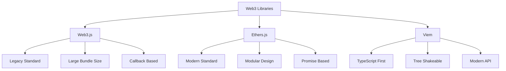

# บทที่ 5: Contract Interaction

## 🎯 จุดประสงค์ของบทเรียน
- เรียนรู้การเชื่อมต่อ Smart Contract กับ Frontend Applications
- ใช้ Web3.js และ Ethers.js สำหรับ blockchain interaction
- สร้าง React Application ที่เชื่อมต่อกับ Taraxa Network
- ทำความเข้าใจ Wallet integration และ Transaction signing

## 🌐 Web3 Library Overview

### **📚 เลือก Web3 Library**



### **⚡ Ethers.js Setup (Recommended)**

```javascript
// Frontend Web3 Setup
// src/utils/web3.js

import { ethers } from 'ethers';

// Taraxa Network Configuration
export const NETWORKS = {
  TARAXA_TESTNET: {
    chainId: 842,
    name: 'Taraxa Testnet',
    rpcUrl: 'https://rpc.testnet.taraxa.io',
    blockExplorer: 'https://explorer.testnet.taraxa.io',
    nativeCurrency: {
      name: 'TARA',
      symbol: 'TARA',
      decimals: 18
    }
  },
  TARAXA_MAINNET: {
    chainId: 841,
    name: 'Taraxa Mainnet',
    rpcUrl: 'https://rpc.mainnet.taraxa.io',
    blockExplorer: 'https://explorer.mainnet.taraxa.io',
    nativeCurrency: {
      name: 'TARA',
      symbol: 'TARA',
      decimals: 18
    }
  }
};

// Web3 Provider Management
class Web3Provider {
  constructor() {
    this.provider = null;
    this.signer = null;
    this.network = null;
    this.account = null;
    this.isConnected = false;
  }

  // Initialize provider
  async init() {
    try {
      if (typeof window.ethereum !== 'undefined') {
        // MetaMask or other injected wallet
        this.provider = new ethers.providers.Web3Provider(window.ethereum);
        console.log('✅ Web3 provider initialized');
        return true;
      } else {
        console.warn('⚠️ No Web3 provider found');
        return false;
      }
    } catch (error) {
      console.error('❌ Failed to initialize provider:', error);
      return false;
    }
  }

  // Connect wallet
  async connectWallet() {
    try {
      if (!this.provider) {
        await this.init();
      }

      // Request account access
      const accounts = await window.ethereum.request({
        method: 'eth_requestAccounts'
      });

      if (accounts.length === 0) {
        throw new Error('No accounts found');
      }

      this.account = accounts[0];
      this.signer = this.provider.getSigner();
      this.network = await this.provider.getNetwork();
      this.isConnected = true;

      console.log(`✅ Connected to account: ${this.account}`);
      console.log(`🌐 Network: ${this.network.name} (${this.network.chainId})`);

      // Listen for account changes
      window.ethereum.on('accountsChanged', this.handleAccountsChanged.bind(this));
      window.ethereum.on('chainChanged', this.handleChainChanged.bind(this));

      return {
        account: this.account,
        network: this.network
      };

    } catch (error) {
      console.error('❌ Failed to connect wallet:', error);
      throw error;
    }
  }

  // Disconnect wallet
  async disconnectWallet() {
    this.account = null;
    this.signer = null;
    this.isConnected = false;

    // Remove event listeners
    if (window.ethereum) {
      window.ethereum.removeAllListeners('accountsChanged');
      window.ethereum.removeAllListeners('chainChanged');
    }

    console.log('🔌 Wallet disconnected');
  }

  // Handle account changes
  handleAccountsChanged(accounts) {
    if (accounts.length === 0) {
      this.disconnectWallet();
    } else {
      this.account = accounts[0];
      console.log(`👤 Account changed to: ${this.account}`);
      window.location.reload(); // Reload to update UI
    }
  }

  // Handle network changes
  handleChainChanged(chainId) {
    console.log(`🔄 Network changed to: ${chainId}`);
    window.location.reload(); // Reload to update UI
  }

  // Switch to Taraxa Network
  async switchToTaraxa(networkKey = 'TARAXA_TESTNET') {
    const network = NETWORKS[networkKey];
    
    try {
      // Try to switch to the network
      await window.ethereum.request({
        method: 'wallet_switchEthereumChain',
        params: [{ chainId: `0x${network.chainId.toString(16)}` }],
      });
    } catch (switchError) {
      // Network doesn't exist, add it
      if (switchError.code === 4902) {
        try {
          await window.ethereum.request({
            method: 'wallet_addEthereumChain',
            params: [{
              chainId: `0x${network.chainId.toString(16)}`,
              chainName: network.name,
              nativeCurrency: network.nativeCurrency,
              rpcUrls: [network.rpcUrl],
              blockExplorerUrls: [network.blockExplorer]
            }],
          });
        } catch (addError) {
          throw new Error(`Failed to add network: ${addError.message}`);
        }
      } else {
        throw new Error(`Failed to switch network: ${switchError.message}`);
      }
    }
  }

  // Get account balance
  async getBalance(address = null) {
    try {
      const targetAddress = address || this.account;
      if (!targetAddress) {
        throw new Error('No address provided');
      }

      const balance = await this.provider.getBalance(targetAddress);
      return {
        wei: balance,
        ether: ethers.utils.formatEther(balance),
        formatted: `${parseFloat(ethers.utils.formatEther(balance)).toFixed(4)} TARA`
      };
    } catch (error) {
      console.error('❌ Failed to get balance:', error);
      throw error;
    }
  }

  // Get network information
  async getNetworkInfo() {
    try {
      const network = await this.provider.getNetwork();
      const blockNumber = await this.provider.getBlockNumber();
      const gasPrice = await this.provider.getGasPrice();

      return {
        chainId: network.chainId,
        name: network.name,
        blockNumber,
        gasPrice: {
          wei: gasPrice,
          gwei: ethers.utils.formatUnits(gasPrice, 'gwei'),
          formatted: `${parseFloat(ethers.utils.formatUnits(gasPrice, 'gwei')).toFixed(2)} Gwei`
        }
      };
    } catch (error) {
      console.error('❌ Failed to get network info:', error);
      throw error;
    }
  }

  // Send transaction
  async sendTransaction(transaction) {
    try {
      if (!this.signer) {
        throw new Error('No signer available');
      }

      const tx = await this.signer.sendTransaction(transaction);
      console.log(`📤 Transaction sent: ${tx.hash}`);

      const receipt = await tx.wait();
      console.log(`✅ Transaction confirmed: ${receipt.transactionHash}`);

      return {
        hash: tx.hash,
        receipt: receipt
      };
    } catch (error) {
      console.error('❌ Transaction failed:', error);
      throw error;
    }
  }

  // Get transaction receipt
  async getTransactionReceipt(txHash) {
    try {
      const receipt = await this.provider.getTransactionReceipt(txHash);
      return receipt;
    } catch (error) {
      console.error('❌ Failed to get transaction receipt:', error);
      throw error;
    }
  }

  // Wait for transaction confirmation
  async waitForTransaction(txHash, confirmations = 1) {
    try {
      const receipt = await this.provider.waitForTransaction(txHash, confirmations);
      return receipt;
    } catch (error) {
      console.error('❌ Failed to wait for transaction:', error);
      throw error;
    }
  }
}

// Create global instance
export const web3Provider = new Web3Provider();

// Utility functions
export const formatAddress = (address, length = 6) => {
  if (!address) return '';
  return `${address.slice(0, length)}...${address.slice(-4)}`;
};

export const formatBalance = (balance, decimals = 4) => {
  return parseFloat(balance).toFixed(decimals);
};

export const formatTransactionHash = (hash, length = 10) => {
  if (!hash) return '';
  return `${hash.slice(0, length)}...${hash.slice(-6)}`;
};

export const getExplorerUrl = (type, value, networkKey = 'TARAXA_TESTNET') => {
  const network = NETWORKS[networkKey];
  const baseUrl = network.blockExplorer;
  
  switch (type) {
    case 'address':
      return `${baseUrl}/address/${value}`;
    case 'tx':
      return `${baseUrl}/tx/${value}`;
    case 'block':
      return `${baseUrl}/block/${value}`;
    default:
      return baseUrl;
  }
};

// Contract interaction utilities
export const parseError = (error) => {
  if (error.reason) {
    return error.reason;
  }
  
  if (error.data && error.data.message) {
    return error.data.message;
  }
  
  if (error.message) {
    // Extract revert reason from error message
    const match = error.message.match(/revert (.+)/);
    if (match) {
      return match[1];
    }
    return error.message;
  }
  
  return 'Unknown error occurred';
};

export const estimateGas = async (contract, method, params = [], overrides = {}) => {
  try {
    const gasEstimate = await contract.estimateGas[method](...params, overrides);
    const gasPrice = await contract.provider.getGasPrice();
    
    return {
      gasLimit: gasEstimate,
      gasPrice: gasPrice,
      cost: gasEstimate.mul(gasPrice),
      formatted: {
        gasLimit: gasEstimate.toString(),
        gasPrice: ethers.utils.formatUnits(gasPrice, 'gwei') + ' Gwei',
        cost: ethers.utils.formatEther(gasEstimate.mul(gasPrice)) + ' TARA'
      }
    };
  } catch (error) {
    console.error('❌ Gas estimation failed:', error);
    throw error;
  }
};
```

## 📱 React Frontend Application

### **🏗️ Project Setup**

```bash
# Create React app
npx create-react-app taraxa-guestbook-frontend
cd taraxa-guestbook-frontend

# Install dependencies
npm install ethers react-router-dom
npm install @mui/material @emotion/react @emotion/styled
npm install @mui/icons-material
npm install react-toastify
npm install axios
npm install date-fns

# Install development dependencies
npm install --save-dev @types/react
```

### **⚙️ Contract Integration**

```javascript
// src/contracts/DigitalGuestbook.js
import { ethers } from 'ethers';
import { web3Provider } from '../utils/web3';

// Contract ABI (from compilation output)
const GUESTBOOK_ABI = [
  // Constructor
  "constructor(string memory _name, uint256 _maxMessageLength, uint256 _minMessageLength)",
  
  // Public variables
  "function name() view returns (string)",
  "function owner() view returns (address)",
  "function isActive() view returns (bool)",
  "function totalMessages() view returns (uint256)",
  "function totalUsers() view returns (uint256)",
  "function maxMessageLength() view returns (uint256)",
  "function minMessageLength() view returns (uint256)",
  
  // Main functions
  "function addMessage(string memory _content)",
  "function removeMessage(uint256 _messageId)",
  
  // View functions
  "function getAllMessages() view returns (tuple(address author, string content, uint256 timestamp, uint256 messageId, bool isActive)[])",
  "function getUserMessages(address _user) view returns (tuple(address author, string content, uint256 timestamp, uint256 messageId, bool isActive)[])",
  "function getRecentMessages(uint256 _count) view returns (tuple(address author, string content, uint256 timestamp, uint256 messageId, bool isActive)[])",
  "function getMessage(uint256 _messageId) view returns (tuple(address author, string content, uint256 timestamp, uint256 messageId, bool isActive))",
  "function getContractStats() view returns (uint256 _totalMessages, uint256 _totalUsers, uint256 _lastMessageTime, uint256 _creationTime, bool _isActive, address _owner)",
  "function getUserStats(address _user) view returns (tuple(uint256 messageCount, uint256 firstMessageTime, uint256 lastMessageTime, bool hasMessaged))",
  
  // Admin functions
  "function banUser(address _user)",
  "function unbanUser(address _user)",
  "function setContractState(bool _isActive)",
  "function transferOwnership(address _newOwner)",
  
  // Utility functions
  "function isUserBanned(address _user) view returns (bool)",
  "function canAddMessage() view returns (bool)",
  
  // Events
  "event MessageAdded(address indexed author, uint256 indexed messageId, string content, uint256 timestamp)",
  "event MessageRemoved(address indexed author, uint256 indexed messageId, uint256 timestamp)",
  "event UserBanned(address indexed user, uint256 timestamp)",
  "event UserUnbanned(address indexed user, uint256 timestamp)",
  "event ContractStateChanged(bool isActive, uint256 timestamp)",
  "event OwnershipTransferred(address indexed previousOwner, address indexed newOwner, uint256 timestamp)"
];

class DigitalGuestbookContract {
  constructor(contractAddress) {
    this.address = contractAddress;
    this.contract = null;
    this.readOnlyContract = null;
    this.eventListeners = new Map();
  }

  // Initialize contracts
  async init() {
    try {
      // Read-only contract (no signer needed)
      const provider = new ethers.providers.JsonRpcProvider('https://rpc.testnet.taraxa.io');
      this.readOnlyContract = new ethers.Contract(this.address, GUESTBOOK_ABI, provider);

      // Read-write contract (requires signer)
      if (web3Provider.isConnected && web3Provider.signer) {
        this.contract = new ethers.Contract(this.address, GUESTBOOK_ABI, web3Provider.signer);
      }

      console.log('✅ Contract initialized');
      return true;
    } catch (error) {
      console.error('❌ Failed to initialize contract:', error);
      return false;
    }
  }

  // Update signer when wallet connects
  updateSigner() {
    if (web3Provider.signer) {
      this.contract = new ethers.Contract(this.address, GUESTBOOK_ABI, web3Provider.signer);
      console.log('✅ Contract signer updated');
    }
  }

  // ============= READ FUNCTIONS =============

  async getContractInfo() {
    try {
      const contract = this.readOnlyContract;
      
      const [name, owner, isActive, stats] = await Promise.all([
        contract.name(),
        contract.owner(),
        contract.isActive(),
        contract.getContractStats()
      ]);

      return {
        name,
        owner,
        isActive,
        totalMessages: stats._totalMessages.toNumber(),
        totalUsers: stats._totalUsers.toNumber(),
        lastMessageTime: stats._lastMessageTime.toNumber(),
        creationTime: stats._creationTime.toNumber()
      };
    } catch (error) {
      console.error('❌ Failed to get contract info:', error);
      throw error;
    }
  }

  async getAllMessages() {
    try {
      const messages = await this.readOnlyContract.getAllMessages();
      
      return messages.map(msg => ({
        id: msg.messageId.toNumber(),
        author: msg.author,
        content: msg.content,
        timestamp: msg.timestamp.toNumber(),
        isActive: msg.isActive
      })).sort((a, b) => b.timestamp - a.timestamp); // Latest first
    } catch (error) {
      console.error('❌ Failed to get messages:', error);
      throw error;
    }
  }

  async getUserMessages(userAddress) {
    try {
      const messages = await this.readOnlyContract.getUserMessages(userAddress);
      
      return messages.map(msg => ({
        id: msg.messageId.toNumber(),
        author: msg.author,
        content: msg.content,
        timestamp: msg.timestamp.toNumber(),
        isActive: msg.isActive
      })).sort((a, b) => b.timestamp - a.timestamp);
    } catch (error) {
      console.error('❌ Failed to get user messages:', error);
      throw error;
    }
  }

  async getRecentMessages(count = 10) {
    try {
      const messages = await this.readOnlyContract.getRecentMessages(count);
      
      return messages.map(msg => ({
        id: msg.messageId.toNumber(),
        author: msg.author,
        content: msg.content,
        timestamp: msg.timestamp.toNumber(),
        isActive: msg.isActive
      }));
    } catch (error) {
      console.error('❌ Failed to get recent messages:', error);
      throw error;
    }
  }

  async getUserStats(userAddress) {
    try {
      const stats = await this.readOnlyContract.getUserStats(userAddress);
      
      return {
        messageCount: stats.messageCount.toNumber(),
        firstMessageTime: stats.firstMessageTime.toNumber(),
        lastMessageTime: stats.lastMessageTime.toNumber(),
        hasMessaged: stats.hasMessaged
      };
    } catch (error) {
      console.error('❌ Failed to get user stats:', error);
      throw error;
    }
  }

  async canUserAddMessage(userAddress) {
    try {
      // Check contract state and user ban status
      const [isActive, isBanned] = await Promise.all([
        this.readOnlyContract.isActive(),
        this.readOnlyContract.isUserBanned(userAddress)
      ]);

      return isActive && !isBanned;
    } catch (error) {
      console.error('❌ Failed to check user permissions:', error);
      return false;
    }
  }

  // ============= WRITE FUNCTIONS =============

  async addMessage(content, options = {}) {
    try {
      if (!this.contract) {
        throw new Error('No signer available. Please connect wallet.');
      }

      // Validate message length
      const config = await this.getContractConfig();
      if (content.length < config.minLength || content.length > config.maxLength) {
        throw new Error(`Message must be between ${config.minLength}-${config.maxLength} characters`);
      }

      // Estimate gas
      const gasEstimate = await this.contract.estimateGas.addMessage(content);
      const gasPrice = await this.contract.provider.getGasPrice();

      // Send transaction
      const tx = await this.contract.addMessage(content, {
        gasLimit: gasEstimate.mul(120).div(100), // 20% buffer
        gasPrice: gasPrice,
        ...options
      });

      console.log(`📤 Adding message transaction: ${tx.hash}`);

      // Wait for confirmation
      const receipt = await tx.wait();
      console.log(`✅ Message added successfully`);

      // Parse events
      const event = receipt.events?.find(e => e.event === 'MessageAdded');
      if (event) {
        return {
          messageId: event.args.messageId.toNumber(),
          author: event.args.author,
          content: event.args.content,
          timestamp: event.args.timestamp.toNumber(),
          transactionHash: receipt.transactionHash
        };
      }

      return { transactionHash: receipt.transactionHash };
    } catch (error) {
      console.error('❌ Failed to add message:', error);
      throw error;
    }
  }

  async removeMessage(messageId, options = {}) {
    try {
      if (!this.contract) {
        throw new Error('No signer available. Please connect wallet.');
      }

      // Estimate gas
      const gasEstimate = await this.contract.estimateGas.removeMessage(messageId);
      const gasPrice = await this.contract.provider.getGasPrice();

      // Send transaction
      const tx = await this.contract.removeMessage(messageId, {
        gasLimit: gasEstimate.mul(120).div(100),
        gasPrice: gasPrice,
        ...options
      });

      console.log(`📤 Removing message transaction: ${tx.hash}`);

      // Wait for confirmation
      const receipt = await tx.wait();
      console.log(`✅ Message removed successfully`);

      return { transactionHash: receipt.transactionHash };
    } catch (error) {
      console.error('❌ Failed to remove message:', error);
      throw error;
    }
  }

  // ============= ADMIN FUNCTIONS =============

  async banUser(userAddress, options = {}) {
    try {
      if (!this.contract) {
        throw new Error('No signer available. Please connect wallet.');
      }

      const tx = await this.contract.banUser(userAddress, options);
      const receipt = await tx.wait();
      
      return { transactionHash: receipt.transactionHash };
    } catch (error) {
      console.error('❌ Failed to ban user:', error);
      throw error;
    }
  }

  async unbanUser(userAddress, options = {}) {
    try {
      if (!this.contract) {
        throw new Error('No signer available. Please connect wallet.');
      }

      const tx = await this.contract.unbanUser(userAddress, options);
      const receipt = await tx.wait();
      
      return { transactionHash: receipt.transactionHash };
    } catch (error) {
      console.error('❌ Failed to unban user:', error);
      throw error;
    }
  }

  async setContractState(isActive, options = {}) {
    try {
      if (!this.contract) {
        throw new Error('No signer available. Please connect wallet.');
      }

      const tx = await this.contract.setContractState(isActive, options);
      const receipt = await tx.wait();
      
      return { transactionHash: receipt.transactionHash };
    } catch (error) {
      console.error('❌ Failed to set contract state:', error);
      throw error;
    }
  }

  // ============= EVENT HANDLING =============

  subscribeToEvents(eventName, callback) {
    try {
      if (!this.readOnlyContract) {
        throw new Error('Contract not initialized');
      }

      // Remove existing listener if any
      if (this.eventListeners.has(eventName)) {
        this.readOnlyContract.off(eventName, this.eventListeners.get(eventName));
      }

      // Add new listener
      const listener = (...args) => {
        console.log(`📡 Event received: ${eventName}`, args);
        callback(...args);
      };

      this.readOnlyContract.on(eventName, listener);
      this.eventListeners.set(eventName, listener);

      console.log(`✅ Subscribed to ${eventName} events`);
    } catch (error) {
      console.error(`❌ Failed to subscribe to ${eventName}:`, error);
    }
  }

  unsubscribeFromEvents(eventName) {
    try {
      if (this.eventListeners.has(eventName)) {
        this.readOnlyContract.off(eventName, this.eventListeners.get(eventName));
        this.eventListeners.delete(eventName);
        console.log(`✅ Unsubscribed from ${eventName} events`);
      }
    } catch (error) {
      console.error(`❌ Failed to unsubscribe from ${eventName}:`, error);
    }
  }

  unsubscribeFromAllEvents() {
    try {
      for (const [eventName, listener] of this.eventListeners) {
        this.readOnlyContract.off(eventName, listener);
      }
      this.eventListeners.clear();
      console.log('✅ Unsubscribed from all events');
    } catch (error) {
      console.error('❌ Failed to unsubscribe from events:', error);
    }
  }

  // ============= UTILITY FUNCTIONS =============

  async getContractConfig() {
    try {
      const [maxLength, minLength] = await Promise.all([
        this.readOnlyContract.maxMessageLength(),
        this.readOnlyContract.minMessageLength()
      ]);

      return {
        maxLength: maxLength.toNumber(),
        minLength: minLength.toNumber()
      };
    } catch (error) {
      console.error('❌ Failed to get contract config:', error);
      throw error;
    }
  }

  isOwner(userAddress) {
    return this.contractInfo?.owner?.toLowerCase() === userAddress?.toLowerCase();
  }

  // Get contract instance for direct use
  getContract(readOnly = false) {
    return readOnly ? this.readOnlyContract : this.contract;
  }

  // Get contract address
  getAddress() {
    return this.address;
  }
}

// Export contract instance
// Replace with your deployed contract address
const CONTRACT_ADDRESS = process.env.REACT_APP_CONTRACT_ADDRESS || "0x...";

export const guestbookContract = new DigitalGuestbookContract(CONTRACT_ADDRESS);

export default DigitalGuestbookContract;
```

### **🎨 React Components**

```jsx
// src/components/WalletConnection.jsx
import React, { useState, useEffect } from 'react';
import {
  Button,
  Card,
  CardContent,
  Typography,
  Box,
  Chip,
  Alert,
  CircularProgress,
  Dialog,
  DialogTitle,
  DialogContent,
  DialogActions
} from '@mui/material';
import {
  AccountBalanceWallet,
  ExitToApp,
  Warning,
  CheckCircle
} from '@mui/icons-material';
import { web3Provider, NETWORKS, formatAddress, formatBalance } from '../utils/web3';
import { toast } from 'react-toastify';

const WalletConnection = ({ onConnectionChange }) => {
  const [isConnected, setIsConnected] = useState(false);
  const [account, setAccount] = useState(null);
  const [balance, setBalance] = useState(null);
  const [network, setNetwork] = useState(null);
  const [isConnecting, setIsConnecting] = useState(false);
  const [showNetworkDialog, setShowNetworkDialog] = useState(false);

  useEffect(() => {
    checkConnection();
  }, []);

  const checkConnection = async () => {
    try {
      await web3Provider.init();
      
      if (web3Provider.isConnected) {
        setIsConnected(true);
        setAccount(web3Provider.account);
        
        // Get balance and network info
        const [balanceInfo, networkInfo] = await Promise.all([
          web3Provider.getBalance(),
          web3Provider.getNetworkInfo()
        ]);
        
        setBalance(balanceInfo);
        setNetwork(networkInfo);
        
        onConnectionChange?.(true, web3Provider.account);
      }
    } catch (error) {
      console.error('Failed to check connection:', error);
    }
  };

  const connectWallet = async () => {
    setIsConnecting(true);
    
    try {
      const connection = await web3Provider.connectWallet();
      
      setIsConnected(true);
      setAccount(connection.account);
      setNetwork(connection.network);
      
      // Get balance
      const balanceInfo = await web3Provider.getBalance();
      setBalance(balanceInfo);
      
      // Check if on correct network
      if (connection.network.chainId !== NETWORKS.TARAXA_TESTNET.chainId) {
        setShowNetworkDialog(true);
      }
      
      toast.success('Wallet connected successfully!');
      onConnectionChange?.(true, connection.account);
      
    } catch (error) {
      console.error('Failed to connect wallet:', error);
      toast.error(`Failed to connect: ${error.message}`);
    } finally {
      setIsConnecting(false);
    }
  };

  const disconnectWallet = async () => {
    try {
      await web3Provider.disconnectWallet();
      
      setIsConnected(false);
      setAccount(null);
      setBalance(null);
      setNetwork(null);
      
      toast.info('Wallet disconnected');
      onConnectionChange?.(false, null);
      
    } catch (error) {
      console.error('Failed to disconnect wallet:', error);
    }
  };

  const switchToTaraxa = async () => {
    try {
      await web3Provider.switchToTaraxa('TARAXA_TESTNET');
      setShowNetworkDialog(false);
      
      // Refresh connection info
      setTimeout(checkConnection, 1000);
      
      toast.success('Switched to Taraxa Testnet!');
    } catch (error) {
      console.error('Failed to switch network:', error);
      toast.error(`Failed to switch network: ${error.message}`);
    }
  };

  const isCorrectNetwork = network?.chainId === NETWORKS.TARAXA_TESTNET.chainId;

  if (!isConnected) {
    return (
      <Card>
        <CardContent>
          <Box display="flex" flexDirection="column" alignItems="center" gap={2}>
            <AccountBalanceWallet sx={{ fontSize: 48, color: 'primary.main' }} />
            <Typography variant="h6" textAlign="center">
              Connect Your Wallet
            </Typography>
            <Typography variant="body2" color="text.secondary" textAlign="center">
              Connect your wallet to interact with the Taraxa Guestbook
            </Typography>
            <Button
              variant="contained"
              onClick={connectWallet}
              disabled={isConnecting}
              startIcon={isConnecting ? <CircularProgress size={20} /> : <AccountBalanceWallet />}
              size="large"
            >
              {isConnecting ? 'Connecting...' : 'Connect Wallet'}
            </Button>
          </Box>
        </CardContent>
      </Card>
    );
  }

  return (
    <>
      <Card>
        <CardContent>
          <Box display="flex" justifyContent="space-between" alignItems="flex-start" mb={2}>
            <Box>
              <Typography variant="h6" gutterBottom>
                Wallet Connected
              </Typography>
              <Typography variant="body2" color="text.secondary">
                Account: {formatAddress(account)}
              </Typography>
              <Typography variant="body2" color="text.secondary">
                Balance: {balance ? formatBalance(balance.ether) : '...'} TARA
              </Typography>
            </Box>
            <Button
              variant="outlined"
              size="small"
              onClick={disconnectWallet}
              startIcon={<ExitToApp />}
            >
              Disconnect
            </Button>
          </Box>

          <Box display="flex" gap={1} flexWrap="wrap">
            <Chip
              icon={isCorrectNetwork ? <CheckCircle /> : <Warning />}
              label={network ? `${network.name} (${network.chainId})` : 'Unknown Network'}
              color={isCorrectNetwork ? 'success' : 'warning'}
              size="small"
            />
            {!isCorrectNetwork && (
              <Button
                size="small"
                variant="outlined"
                onClick={() => setShowNetworkDialog(true)}
              >
                Switch to Taraxa
              </Button>
            )}
          </Box>

          {!isCorrectNetwork && (
            <Alert severity="warning" sx={{ mt: 2 }}>
              You're not connected to Taraxa Testnet. Please switch networks to use the dApp.
            </Alert>
          )}
        </CardContent>
      </Card>

      {/* Network Switch Dialog */}
      <Dialog open={showNetworkDialog} onClose={() => setShowNetworkDialog(false)}>
        <DialogTitle>Switch to Taraxa Network</DialogTitle>
        <DialogContent>
          <Typography variant="body1" gutterBottom>
            You need to be connected to Taraxa Testnet to use this application.
          </Typography>
          <Typography variant="body2" color="text.secondary">
            Click "Switch Network" to automatically add and switch to Taraxa Testnet in your wallet.
          </Typography>
        </DialogContent>
        <DialogActions>
          <Button onClick={() => setShowNetworkDialog(false)}>
            Cancel
          </Button>
          <Button onClick={switchToTaraxa} variant="contained">
            Switch Network
          </Button>
        </DialogActions>
      </Dialog>
    </>
  );
};

export default WalletConnection;
```

```jsx
// src/components/MessageForm.jsx
import React, { useState, useEffect } from 'react';
import {
  Card,
  CardContent,
  TextField,
  Button,
  Typography,
  Box,
  LinearProgress,
  Alert,
  Chip
} from '@mui/material';
import { Send, Warning } from '@mui/icons-material';
import { guestbookContract } from '../contracts/DigitalGuestbook';
import { parseError } from '../utils/web3';
import { toast } from 'react-toastify';

const MessageForm = ({ onMessageAdded, userAddress, isConnected }) => {
  const [message, setMessage] = useState('');
  const [isSubmitting, setIsSubmitting] = useState(false);
  const [config, setConfig] = useState({ minLength: 5, maxLength: 500 });
  const [canAddMessage, setCanAddMessage] = useState(false);

  useEffect(() => {
    loadConfig();
  }, []);

  useEffect(() => {
    if (userAddress) {
      checkPermissions();
    }
  }, [userAddress]);

  const loadConfig = async () => {
    try {
      const contractConfig = await guestbookContract.getContractConfig();
      setConfig(contractConfig);
    } catch (error) {
      console.error('Failed to load config:', error);
    }
  };

  const checkPermissions = async () => {
    try {
      const canAdd = await guestbookContract.canUserAddMessage(userAddress);
      setCanAddMessage(canAdd);
    } catch (error) {
      console.error('Failed to check permissions:', error);
      setCanAddMessage(false);
    }
  };

  const handleSubmit = async (e) => {
    e.preventDefault();
    
    if (!isConnected) {
      toast.error('Please connect your wallet first');
      return;
    }

    if (!canAddMessage) {
      toast.error('You are not allowed to post messages');
      return;
    }

    if (message.length < config.minLength || message.length > config.maxLength) {
      toast.error(`Message must be between ${config.minLength}-${config.maxLength} characters`);
      return;
    }

    setIsSubmitting(true);

    try {
      const result = await guestbookContract.addMessage(message);
      
      toast.success('Message added successfully! 🎉');
      setMessage('');
      onMessageAdded?.(result);
      
    } catch (error) {
      console.error('Failed to add message:', error);
      const errorMessage = parseError(error);
      toast.error(`Failed to add message: ${errorMessage}`);
    } finally {
      setIsSubmitting(false);
    }
  };

  const isValid = message.length >= config.minLength && message.length <= config.maxLength;
  const remainingChars = config.maxLength - message.length;

  if (!isConnected) {
    return (
      <Card>
        <CardContent>
          <Alert severity="info">
            Connect your wallet to add messages to the guestbook
          </Alert>
        </CardContent>
      </Card>
    );
  }

  if (!canAddMessage) {
    return (
      <Card>
        <CardContent>
          <Alert severity="warning" icon={<Warning />}>
            You are not allowed to post messages. You may be banned or the contract may be paused.
          </Alert>
        </CardContent>
      </Card>
    );
  }

  return (
    <Card>
      <CardContent>
        <Typography variant="h6" gutterBottom>
          Add Your Message
        </Typography>
        
        <Box component="form" onSubmit={handleSubmit}>
          <TextField
            fullWidth
            multiline
            rows={4}
            variant="outlined"
            placeholder="Share your thoughts with the Taraxa community..."
            value={message}
            onChange={(e) => setMessage(e.target.value)}
            disabled={isSubmitting}
            sx={{ mb: 2 }}
          />
          
          <Box display="flex" justifyContent="space-between" alignItems="center" mb={2}>
            <Box display="flex" gap={1}>
              <Chip
                label={`${message.length}/${config.maxLength}`}
                color={remainingChars < 50 ? 'warning' : 'default'}
                size="small"
              />
              {message.length < config.minLength && (
                <Chip
                  label={`Min: ${config.minLength} chars`}
                  color="error"
                  size="small"
                />
              )}
            </Box>
            
            <Button
              type="submit"
              variant="contained"
              disabled={!isValid || isSubmitting}
              startIcon={<Send />}
            >
              {isSubmitting ? 'Adding...' : 'Add Message'}
            </Button>
          </Box>
          
          {isSubmitting && <LinearProgress />}
        </Box>
      </CardContent>
    </Card>
  );
};

export default MessageForm;
```

```jsx
// src/components/MessageList.jsx
import React, { useState, useEffect } from 'react';
import {
  Card,
  CardContent,
  Typography,
  Box,
  Avatar,
  IconButton,
  Menu,
  MenuItem,
  Chip,
  Dialog,
  DialogTitle,
  DialogContent,
  DialogActions,
  Button,
  Alert,
  Skeleton
} from '@mui/material';
import {
  MoreVert,
  Delete,
  Person,
  AccessTime,
  Launch
} from '@mui/icons-material';
import { formatDistance, format } from 'date-fns';
import { guestbookContract } from '../contracts/DigitalGuestbook';
import { formatAddress, getExplorerUrl, parseError } from '../utils/web3';
import { toast } from 'react-toastify';

const MessageCard = ({ message, userAddress, isOwner, onMessageRemoved }) => {
  const [anchorEl, setAnchorEl] = useState(null);
  const [showDeleteDialog, setShowDeleteDialog] = useState(false);
  const [isDeleting, setIsDeleting] = useState(false);

  const isAuthor = message.author.toLowerCase() === userAddress?.toLowerCase();
  const canDelete = isAuthor || isOwner;

  const handleMenuClick = (event) => {
    setAnchorEl(event.currentTarget);
  };

  const handleMenuClose = () => {
    setAnchorEl(null);
  };

  const handleDeleteClick = () => {
    setAnchorEl(null);
    setShowDeleteDialog(true);
  };

  const handleDeleteConfirm = async () => {
    setIsDeleting(true);
    
    try {
      await guestbookContract.removeMessage(message.id);
      
      toast.success('Message deleted successfully');
      setShowDeleteDialog(false);
      onMessageRemoved?.(message.id);
      
    } catch (error) {
      console.error('Failed to delete message:', error);
      const errorMessage = parseError(error);
      toast.error(`Failed to delete message: ${errorMessage}`);
    } finally {
      setIsDeleting(false);
    }
  };

  const openInExplorer = () => {
    const url = getExplorerUrl('address', message.author);
    window.open(url, '_blank');
  };

  return (
    <>
      <Card sx={{ mb: 2 }}>
        <CardContent>
          <Box display="flex" justifyContent="space-between" alignItems="flex-start" mb={2}>
            <Box display="flex" alignItems="center" gap={2}>
              <Avatar sx={{ width: 40, height: 40 }}>
                <Person />
              </Avatar>
              <Box>
                <Box display="flex" alignItems="center" gap={1}>
                  <Typography variant="subtitle2">
                    {formatAddress(message.author)}
                  </Typography>
                  {isAuthor && (
                    <Chip label="You" size="small" color="primary" />
                  )}
                  <IconButton size="small" onClick={openInExplorer}>
                    <Launch fontSize="small" />
                  </IconButton>
                </Box>
                <Box display="flex" alignItems="center" gap={1}>
                  <AccessTime fontSize="small" color="text.secondary" />
                  <Typography variant="caption" color="text.secondary">
                    {formatDistance(new Date(message.timestamp * 1000), new Date(), { addSuffix: true })}
                  </Typography>
                  <Typography variant="caption" color="text.secondary">
                    • {format(new Date(message.timestamp * 1000), 'MMM dd, yyyy HH:mm')}
                  </Typography>
                </Box>
              </Box>
            </Box>
            
            {canDelete && (
              <IconButton size="small" onClick={handleMenuClick}>
                <MoreVert />
              </IconButton>
            )}
          </Box>
          
          <Typography variant="body1" sx={{ whiteSpace: 'pre-wrap' }}>
            {message.content}
          </Typography>
        </CardContent>
      </Card>

      {/* Context Menu */}
      <Menu
        anchorEl={anchorEl}
        open={Boolean(anchorEl)}
        onClose={handleMenuClose}
      >
        <MenuItem onClick={handleDeleteClick} sx={{ color: 'error.main' }}>
          <Delete sx={{ mr: 1 }} />
          Delete Message
        </MenuItem>
      </Menu>

      {/* Delete Confirmation Dialog */}
      <Dialog open={showDeleteDialog} onClose={() => setShowDeleteDialog(false)}>
        <DialogTitle>Delete Message</DialogTitle>
        <DialogContent>
          <Typography>
            Are you sure you want to delete this message? This action cannot be undone.
          </Typography>
          <Box mt={2} p={2} bgcolor="grey.100" borderRadius={1}>
            <Typography variant="body2" sx={{ fontStyle: 'italic' }}>
              "{message.content}"
            </Typography>
          </Box>
        </DialogContent>
        <DialogActions>
          <Button onClick={() => setShowDeleteDialog(false)}>
            Cancel
          </Button>
          <Button
            onClick={handleDeleteConfirm}
            color="error"
            disabled={isDeleting}
          >
            {isDeleting ? 'Deleting...' : 'Delete'}
          </Button>
        </DialogActions>
      </Dialog>
    </>
  );
};

const MessageList = ({ userAddress, contractInfo, refreshTrigger }) => {
  const [messages, setMessages] = useState([]);
  const [loading, setLoading] = useState(true);
  const [error, setError] = useState(null);

  useEffect(() => {
    loadMessages();
  }, [refreshTrigger]);

  useEffect(() => {
    // Subscribe to new message events
    guestbookContract.subscribeToEvents('MessageAdded', handleNewMessage);
    guestbookContract.subscribeToEvents('MessageRemoved', handleMessageRemoved);

    return () => {
      guestbookContract.unsubscribeFromAllEvents();
    };
  }, []);

  const loadMessages = async () => {
    setLoading(true);
    setError(null);
    
    try {
      const fetchedMessages = await guestbookContract.getAllMessages();
      setMessages(fetchedMessages);
    } catch (error) {
      console.error('Failed to load messages:', error);
      setError('Failed to load messages. Please try again.');
    } finally {
      setLoading(false);
    }
  };

  const handleNewMessage = (author, messageId, content, timestamp) => {
    // Add new message to the list
    const newMessage = {
      id: messageId.toNumber(),
      author,
      content,
      timestamp: timestamp.toNumber(),
      isActive: true
    };
    
    setMessages(prev => [newMessage, ...prev]);
    toast.success('New message added! 🎉');
  };

  const handleMessageRemoved = (author, messageId) => {
    // Remove message from the list
    setMessages(prev => prev.filter(msg => msg.id !== messageId.toNumber()));
  };

  const handleMessageRemovedLocal = (messageId) => {
    // Remove message from local state
    setMessages(prev => prev.filter(msg => msg.id !== messageId));
  };

  if (loading) {
    return (
      <Box>
        {[...Array(3)].map((_, index) => (
          <Card key={index} sx={{ mb: 2 }}>
            <CardContent>
              <Box display="flex" alignItems="center" gap={2} mb={2}>
                <Skeleton variant="circular" width={40} height={40} />
                <Box>
                  <Skeleton variant="text" width={120} />
                  <Skeleton variant="text" width={200} />
                </Box>
              </Box>
              <Skeleton variant="text" width="100%" />
              <Skeleton variant="text" width="80%" />
            </CardContent>
          </Card>
        ))}
      </Box>
    );
  }

  if (error) {
    return (
      <Alert severity="error" action={
        <Button color="inherit" size="small" onClick={loadMessages}>
          Retry
        </Button>
      }>
        {error}
      </Alert>
    );
  }

  if (messages.length === 0) {
    return (
      <Card>
        <CardContent>
          <Box display="flex" flexDirection="column" alignItems="center" gap={2} py={4}>
            <Typography variant="h6" color="text.secondary">
              No messages yet
            </Typography>
            <Typography variant="body2" color="text.secondary" textAlign="center">
              Be the first to leave a message in the Taraxa Community Guestbook!
            </Typography>
          </Box>
        </CardContent>
      </Card>
    );
  }

  const isOwner = contractInfo?.owner?.toLowerCase() === userAddress?.toLowerCase();

  return (
    <Box>
      <Typography variant="h6" gutterBottom>
        Messages ({messages.length})
      </Typography>
      
      {messages.map((message) => (
        <MessageCard
          key={message.id}
          message={message}
          userAddress={userAddress}
          isOwner={isOwner}
          onMessageRemoved={handleMessageRemovedLocal}
        />
      ))}
    </Box>
  );
};

export default MessageList;
```

## 🎯 แบบฝึกหัด

### **📝 แบบฝึกหัดที่ 1: Frontend Integration**
1. สร้าง React app และติดตั้ง dependencies
2. Integrate DigitalGuestbook contract
3. ทดสอบ wallet connection และ transaction

### **🔧 แบบฝึกหัดที่ 2: Enhanced UI**
เพิ่มฟีเจอร์:
1. Message pagination
2. User profile display
3. Real-time notifications
4. Dark/Light theme

### **🎯 แบบฝึกหัดที่ 3: Advanced Features**
1. Message search และ filter
2. Export messages เป็น JSON/CSV
3. Share messages on social media
4. Mobile responsive design

## 🔗 การเชื่อมต่อ

**บทก่อนหน้า**: [บทที่ 4: First Smart Contract](./04-first-smart-contract.md)  
**บทถัดไป**: [บทที่ 6: Testing and Deployment](./06-testing-deployment.md)

**กลับไปหน้าหลัก**: [README](./README.md)

---

## 📚 เอกสารอ้างอิง

- [Ethers.js Documentation](https://docs.ethers.io/)
- [React Documentation](https://reactjs.org/docs/)
- [Material-UI Components](https://mui.com/components/)
- [MetaMask Documentation](https://docs.metamask.io/)

---

ตอนนี้คุณมีความรู้ในการเชื่อมต่อ Smart Contract กับ Frontend แล้ว! ในบทถัดไป เราจะเรียนรู้ Testing และ Deployment strategies 🚀
