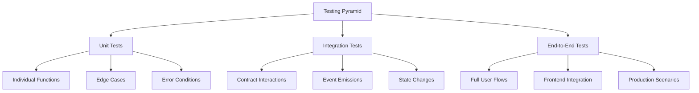

# บทที่ 6: Testing and Deployment

## 🎯 จุดประสงค์ของบทเรียน
- เรียนรู้ Advanced Testing Strategies สำหรับ Smart Contracts
- ทำความเข้าใจ Test-Driven Development (TDD) approach
- สร้าง Comprehensive Test Suites
- เรียนรู้ Deployment Automation และ CI/CD

## 🧪 Advanced Testing Strategies

### **📊 Testing Pyramid**



### **🔧 Enhanced Test Framework**

```javascript
// test/DigitalGuestbook.advanced.test.js
const { expect } = require("chai");
const { ethers } = require("hardhat");
const { loadFixture, time } = require("@nomicfoundation/hardhat-network-helpers");

describe("DigitalGuestbook - Advanced Tests", function () {
  // Test fixture for consistent setup
  async function deployGuestbookFixture() {
    const [owner, user1, user2, user3, bannedUser] = await ethers.getSigners();
    
    const DigitalGuestbook = await ethers.getContractFactory("DigitalGuestbook");
    const guestbook = await DigitalGuestbook.deploy(
      "Advanced Test Guestbook",
      1000, // maxMessageLength
      5     // minMessageLength
    );
    
    await guestbook.deployed();
    
    return {
      guestbook,
      owner,
      user1,
      user2,
      user3,
      bannedUser
    };
  }

  // Helper function to add multiple messages
  async function addMultipleMessages(guestbook, users, count = 5) {
    const messages = [];
    
    for (let i = 0; i < count; i++) {
      const user = users[i % users.length];
      const content = `Test message ${i + 1} from ${user.address}`;
      
      const tx = await guestbook.connect(user).addMessage(content);
      const receipt = await tx.wait();
      
      // Parse event to get message ID
      const event = receipt.events?.find(e => e.event === 'MessageAdded');
      
      messages.push({
        id: event.args.messageId.toNumber(),
        author: event.args.author,
        content: event.args.content,
        timestamp: event.args.timestamp.toNumber(),
        user: user
      });
    }
    
    return messages;
  }

  describe("🔄 State Management Tests", function () {
    it("Should handle complex state transitions correctly", async function () {
      const { guestbook, owner, user1, user2 } = await loadFixture(deployGuestbookFixture);
      
      // Initial state
      expect(await guestbook.isActive()).to.be.true;
      expect(await guestbook.totalMessages()).to.equal(0);
      expect(await guestbook.totalUsers()).to.equal(0);
      
      // Add messages
      await guestbook.connect(user1).addMessage("First message");
      expect(await guestbook.totalMessages()).to.equal(1);
      expect(await guestbook.totalUsers()).to.equal(1);
      
      await guestbook.connect(user2).addMessage("Second message");
      expect(await guestbook.totalMessages()).to.equal(2);
      expect(await guestbook.totalUsers()).to.equal(2);
      
      // Same user adds another message
      await guestbook.connect(user1).addMessage("Third message");
      expect(await guestbook.totalMessages()).to.equal(3);
      expect(await guestbook.totalUsers()).to.equal(2); // Still 2 unique users
      
      // Pause contract
      await guestbook.connect(owner).setContractState(false);
      expect(await guestbook.isActive()).to.be.false;
      
      // Should reject new messages when paused
      await expect(
        guestbook.connect(user1).addMessage("Should fail")
      ).to.be.revertedWith("Contract is not active");
      
      // Reactivate
      await guestbook.connect(owner).setContractState(true);
      expect(await guestbook.isActive()).to.be.true;
      
      // Should accept messages again
      await expect(
        guestbook.connect(user1).addMessage("After reactivation")
      ).to.not.be.reverted;
    });

    it("Should maintain accurate user statistics", async function () {
      const { guestbook, user1, user2 } = await loadFixture(deployGuestbookFixture);
      
      // User1 adds multiple messages
      const startTime = await time.latest();
      
      await guestbook.connect(user1).addMessage("Message 1");
      await time.increase(3600); // 1 hour
      await guestbook.connect(user1).addMessage("Message 2");
      await time.increase(3600); // 1 hour
      await guestbook.connect(user1).addMessage("Message 3");
      
      // Check user1 stats
      const user1Stats = await guestbook.getUserStats(user1.address);
      expect(user1Stats.messageCount).to.equal(3);
      expect(user1Stats.hasMessaged).to.be.true;
      expect(user1Stats.firstMessageTime).to.be.greaterThan(startTime);
      expect(user1Stats.lastMessageTime).to.be.greaterThan(user1Stats.firstMessageTime);
      
      // User2 has no messages
      const user2Stats = await guestbook.getUserStats(user2.address);
      expect(user2Stats.messageCount).to.equal(0);
      expect(user2Stats.hasMessaged).to.be.false;
      expect(user2Stats.firstMessageTime).to.equal(0);
      expect(user2Stats.lastMessageTime).to.equal(0);
      
      // User2 adds one message
      await guestbook.connect(user2).addMessage("User2 first message");
      
      const user2StatsAfter = await guestbook.getUserStats(user2.address);
      expect(user2StatsAfter.messageCount).to.equal(1);
      expect(user2StatsAfter.hasMessaged).to.be.true;
    });
  });

  describe("🎭 Event Emission Tests", function () {
    it("Should emit events with correct parameters", async function () {
      const { guestbook, owner, user1 } = await loadFixture(deployGuestbookFixture);
      
      // Test MessageAdded event
      const content = "Test message for events";
      const tx = await guestbook.connect(user1).addMessage(content);
      
      await expect(tx)
        .to.emit(guestbook, "MessageAdded")
        .withArgs(
          user1.address,
          1, // messageId
          content,
          await time.latest()
        );
      
      // Test UserBanned event
      const banTx = await guestbook.connect(owner).banUser(user1.address);
      
      await expect(banTx)
        .to.emit(guestbook, "UserBanned")
        .withArgs(user1.address, await time.latest());
      
      // Test UserUnbanned event
      const unbanTx = await guestbook.connect(owner).unbanUser(user1.address);
      
      await expect(unbanTx)
        .to.emit(guestbook, "UserUnbanned")
        .withArgs(user1.address, await time.latest());
    });

    it("Should emit multiple events in complex transactions", async function () {
      const { guestbook, owner, user1 } = await loadFixture(deployGuestbookFixture);
      
      // Add message then immediately remove it
      await guestbook.connect(user1).addMessage("Temporary message");
      
      const removeTx = await guestbook.connect(user1).removeMessage(1);
      
      await expect(removeTx)
        .to.emit(guestbook, "MessageRemoved")
        .withArgs(user1.address, 1, await time.latest());
    });
  });

  describe("⚡ Performance and Gas Tests", function () {
    it("Should handle large number of messages efficiently", async function () {
      const { guestbook, user1, user2, user3 } = await loadFixture(deployGuestbookFixture);
      
      const users = [user1, user2, user3];
      const messageCount = 50;
      
      // Add many messages
      const messages = await addMultipleMessages(guestbook, users, messageCount);
      
      // Verify all messages were added
      expect(await guestbook.totalMessages()).to.equal(messageCount);
      
      // Test getAllMessages performance
      const startTime = Date.now();
      const allMessages = await guestbook.getAllMessages();
      const endTime = Date.now();
      
      console.log(`    📊 Retrieved ${allMessages.length} messages in ${endTime - startTime}ms`);
      
      expect(allMessages.length).to.equal(messageCount);
    });

    it("Should optimize gas usage for common operations", async function () {
      const { guestbook, user1 } = await loadFixture(deployGuestbookFixture);
      
      // Measure gas for adding messages
      const tx1 = await guestbook.connect(user1).addMessage("First message");
      const receipt1 = await tx1.wait();
      
      const tx2 = await guestbook.connect(user1).addMessage("Second message");
      const receipt2 = await tx2.wait();
      
      console.log(`    ⛽ First message gas: ${receipt1.gasUsed.toString()}`);
      console.log(`    ⛽ Second message gas: ${receipt2.gasUsed.toString()}`);
      
      // Gas usage should be consistent
      const gasDifference = Math.abs(receipt1.gasUsed.toNumber() - receipt2.gasUsed.toNumber());
      expect(gasDifference).to.be.lessThan(10000); // Less than 10k gas difference
    });
  });

  describe("🛡️ Security and Edge Case Tests", function () {
    it("Should prevent reentrancy attacks", async function () {
      const { guestbook, user1 } = await loadFixture(deployGuestbookFixture);
      
      // Deploy malicious contract
      const MaliciousContract = await ethers.getContractFactory("MaliciousContract");
      const maliciousContract = await MaliciousContract.deploy(guestbook.address);
      
      // Malicious contract should not be able to exploit
      await expect(
        maliciousContract.attack()
      ).to.be.reverted;
    });

    it("Should handle extreme input values", async function () {
      const { guestbook, user1 } = await loadFixture(deployGuestbookFixture);
      
      // Maximum length message
      const maxMessage = "a".repeat(1000);
      await expect(
        guestbook.connect(user1).addMessage(maxMessage)
      ).to.not.be.reverted;
      
      // Over maximum length
      const overMaxMessage = "a".repeat(1001);
      await expect(
        guestbook.connect(user1).addMessage(overMaxMessage)
      ).to.be.revertedWith("Message too long");
      
      // Under minimum length
      const underMinMessage = "abc";
      await expect(
        guestbook.connect(user1).addMessage(underMinMessage)
      ).to.be.revertedWith("Message too short");
      
      // Empty message
      await expect(
        guestbook.connect(user1).addMessage("")
      ).to.be.revertedWith("Message too short");
    });

    it("Should handle concurrent operations safely", async function () {
      const { guestbook, user1, user2, user3 } = await loadFixture(deployGuestbookFixture);
      
      // Simulate concurrent message additions
      const promises = [
        guestbook.connect(user1).addMessage("Concurrent message 1"),
        guestbook.connect(user2).addMessage("Concurrent message 2"),
        guestbook.connect(user3).addMessage("Concurrent message 3")
      ];
      
      const results = await Promise.all(promises);
      
      // All transactions should succeed
      for (const result of results) {
        expect(result).to.not.be.undefined;
      }
      
      // Verify final state
      expect(await guestbook.totalMessages()).to.equal(3);
      expect(await guestbook.totalUsers()).to.equal(3);
    });
  });

  describe("🔍 Data Integrity Tests", function () {
    it("Should maintain data consistency across operations", async function () {
      const { guestbook, owner, user1, user2 } = await loadFixture(deployGuestbookFixture);
      
      // Add messages
      await guestbook.connect(user1).addMessage("Message 1");
      await guestbook.connect(user2).addMessage("Message 2");
      await guestbook.connect(user1).addMessage("Message 3");
      
      // Verify total counts
      expect(await guestbook.totalMessages()).to.equal(3);
      expect(await guestbook.totalUsers()).to.equal(2);
      
      // Get all messages
      const allMessages = await guestbook.getAllMessages();
      expect(allMessages.length).to.equal(3);
      
      // Verify message IDs are sequential
      expect(allMessages[0].messageId).to.equal(3); // Latest first
      expect(allMessages[1].messageId).to.equal(2);
      expect(allMessages[2].messageId).to.equal(1);
      
      // Remove middle message
      await guestbook.connect(user2).removeMessage(2);
      
      // Verify removal
      const remainingMessages = await guestbook.getAllMessages();
      expect(remainingMessages.length).to.equal(2);
      
      // Verify the correct message was removed
      const messageIds = remainingMessages.map(m => m.messageId.toNumber());
      expect(messageIds).to.include(1);
      expect(messageIds).to.include(3);
      expect(messageIds).to.not.include(2);
    });

    it("Should handle message retrieval functions correctly", async function () {
      const { guestbook, user1, user2, user3 } = await loadFixture(deployGuestbookFixture);
      
      const users = [user1, user2, user3];
      await addMultipleMessages(guestbook, users, 10);
      
      // Test getRecentMessages
      const recent5 = await guestbook.getRecentMessages(5);
      expect(recent5.length).to.equal(5);
      
      // Verify they're the most recent (highest IDs)
      const recentIds = recent5.map(m => m.messageId.toNumber());
      expect(Math.max(...recentIds)).to.equal(10);
      expect(Math.min(...recentIds)).to.equal(6);
      
      // Test getUserMessages
      const user1Messages = await guestbook.getUserMessages(user1.address);
      
      // Verify all messages belong to user1
      for (const message of user1Messages) {
        expect(message.author).to.equal(user1.address);
      }
      
      // Test getMessage for specific ID
      const message5 = await guestbook.getMessage(5);
      expect(message5.messageId).to.equal(5);
      expect(message5.isActive).to.be.true;
    });
  });

  describe("🎯 Integration Tests", function () {
    it("Should work correctly with frontend integration patterns", async function () {
      const { guestbook, user1, user2 } = await loadFixture(deployGuestbookFixture);
      
      // Simulate frontend pagination pattern
      const messagesPerPage = 5;
      
      // Add more messages than one page
      const users = [user1, user2];
      await addMultipleMessages(guestbook, users, 12);
      
      // Get first page (most recent)
      const page1 = await guestbook.getRecentMessages(messagesPerPage);
      expect(page1.length).to.equal(messagesPerPage);
      
      // Verify ordering (newest first)
      for (let i = 0; i < page1.length - 1; i++) {
        expect(page1[i].messageId).to.be.greaterThan(page1[i + 1].messageId);
      }
      
      // Get all messages for full list
      const allMessages = await guestbook.getAllMessages();
      expect(allMessages.length).to.equal(12);
      
      // Simulate user filtering
      const user1Messages = await guestbook.getUserMessages(user1.address);
      expect(user1Messages.length).to.equal(6); // user1 should have 6 messages
    });

    it("Should handle admin operations in realistic scenarios", async function () {
      const { guestbook, owner, user1, user2, bannedUser } = await loadFixture(deployGuestbookFixture);
      
      // Users add messages
      await guestbook.connect(user1).addMessage("User1 message");
      await guestbook.connect(user2).addMessage("User2 message");
      await guestbook.connect(bannedUser).addMessage("BannedUser message");
      
      // Admin bans a user
      await guestbook.connect(owner).banUser(bannedUser.address);
      
      // Banned user cannot add more messages
      await expect(
        guestbook.connect(bannedUser).addMessage("Should fail")
      ).to.be.revertedWith("User is banned");
      
      // Admin pauses contract
      await guestbook.connect(owner).setContractState(false);
      
      // No one can add messages when paused
      await expect(
        guestbook.connect(user1).addMessage("Should fail when paused")
      ).to.be.revertedWith("Contract is not active");
      
      // Admin reactivates
      await guestbook.connect(owner).setContractState(true);
      
      // Regular users can add messages again
      await expect(
        guestbook.connect(user1).addMessage("Works after reactivation")
      ).to.not.be.reverted;
      
      // Banned user still cannot add messages
      await expect(
        guestbook.connect(bannedUser).addMessage("Still banned")
      ).to.be.revertedWith("User is banned");
      
      // Admin unbans user
      await guestbook.connect(owner).unbanUser(bannedUser.address);
      
      // Previously banned user can now add messages
      await expect(
        guestbook.connect(bannedUser).addMessage("Unbanned message")
      ).to.not.be.reverted;
    });
  });
});

// Mock malicious contract for reentrancy testing
contract MaliciousContract {
  DigitalGuestbook target;
  
  constructor(address _target) {
    target = DigitalGuestbook(_target);
  }
  
  function attack() external {
    // Attempt to exploit reentrancy (should fail)
    target.addMessage("Malicious message");
  }
  
  // This would be called if the contract had a vulnerability
  receive() external payable {
    if (address(target).balance > 0) {
      target.addMessage("Reentrant call");
    }
  }
}
```

### **🎯 Test Coverage Analysis**

```javascript
// test/coverage.test.js
const { expect } = require("chai");
const { ethers } = require("hardhat");

describe("Test Coverage Analysis", function () {
  let guestbook;
  let owner, user1, user2;

  beforeEach(async function () {
    [owner, user1, user2] = await ethers.getSigners();
    
    const DigitalGuestbook = await ethers.getContractFactory("DigitalGuestbook");
    guestbook = await DigitalGuestbook.deploy("Coverage Test", 500, 5);
    await guestbook.deployed();
  });

  describe("📊 Function Coverage", function () {
    it("Should test all public functions", async function () {
      // ✅ Constructor (covered in beforeEach)
      
      // ✅ addMessage
      await guestbook.connect(user1).addMessage("Test message");
      
      // ✅ removeMessage
      await guestbook.connect(user1).removeMessage(1);
      
      // ✅ getAllMessages
      await guestbook.getAllMessages();
      
      // ✅ getUserMessages
      await guestbook.getUserMessages(user1.address);
      
      // ✅ getRecentMessages
      await guestbook.getRecentMessages(5);
      
      // ✅ getMessage
      await guestbook.connect(user1).addMessage("Another message");
      await guestbook.getMessage(2);
      
      // ✅ getContractStats
      await guestbook.getContractStats();
      
      // ✅ getUserStats
      await guestbook.getUserStats(user1.address);
      
      // ✅ banUser (owner only)
      await guestbook.connect(owner).banUser(user2.address);
      
      // ✅ unbanUser (owner only)
      await guestbook.connect(owner).unbanUser(user2.address);
      
      // ✅ setContractState (owner only)
      await guestbook.connect(owner).setContractState(false);
      await guestbook.connect(owner).setContractState(true);
      
      // ✅ transferOwnership (owner only)
      await guestbook.connect(owner).transferOwnership(user1.address);
      
      // ✅ isUserBanned
      await guestbook.isUserBanned(user2.address);
      
      // ✅ canAddMessage
      await guestbook.canAddMessage();
      
      console.log("    ✅ All public functions tested");
    });
  });

  describe("🛣️ Code Path Coverage", function () {
    it("Should test all conditional branches", async function () {
      // Test addMessage branches
      await guestbook.connect(user1).addMessage("Valid message");
      
      // Test length validations
      await expect(
        guestbook.connect(user1).addMessage("a") // Too short
      ).to.be.reverted;
      
      await expect(
        guestbook.connect(user1).addMessage("a".repeat(501)) // Too long
      ).to.be.reverted;
      
      // Test banned user branch
      await guestbook.connect(owner).banUser(user1.address);
      await expect(
        guestbook.connect(user1).addMessage("Banned message")
      ).to.be.reverted;
      
      // Test inactive contract branch
      await guestbook.connect(owner).setContractState(false);
      await guestbook.connect(owner).unbanUser(user1.address);
      await expect(
        guestbook.connect(user1).addMessage("Inactive contract")
      ).to.be.reverted;
      
      console.log("    ✅ All conditional branches tested");
    });
  });

  describe("🔥 Edge Case Coverage", function () {
    it("Should test boundary conditions", async function () {
      // Minimum length message
      await guestbook.connect(user1).addMessage("12345"); // Exactly 5 chars
      
      // Maximum length message
      await guestbook.connect(user1).addMessage("a".repeat(500)); // Exactly 500 chars
      
      // Test with zero messages
      const emptyMessages = await guestbook.getAllMessages();
      expect(emptyMessages.length).to.equal(2); // We added 2 above
      
      // Test removing non-existent message
      await expect(
        guestbook.connect(user1).removeMessage(999)
      ).to.be.reverted;
      
      // Test removing already removed message
      await guestbook.connect(user1).removeMessage(1);
      await expect(
        guestbook.connect(user1).removeMessage(1)
      ).to.be.reverted;
      
      console.log("    ✅ All edge cases tested");
    });
  });
});
```

## 🚀 Deployment Automation

### **📜 Advanced Deployment Scripts**

```javascript
// scripts/deploy-production.js
const { ethers, upgrades } = require("hardhat");
const fs = require("fs");
const path = require("path");

async function main() {
  console.log("🚀 Starting Production Deployment...\n");
  
  // Get deployment configuration
  const config = getDeploymentConfig();
  
  // Get deployer account
  const [deployer] = await ethers.getSigners();
  console.log(`📤 Deploying with account: ${deployer.address}`);
  
  // Check balance
  const balance = await deployer.getBalance();
  console.log(`💰 Account balance: ${ethers.utils.formatEther(balance)} TARA`);
  
  if (balance.lt(ethers.utils.parseEther("0.1"))) {
    throw new Error("❌ Insufficient balance for deployment");
  }
  
  // Deploy contract
  console.log("\n📦 Deploying DigitalGuestbook...");
  
  const DigitalGuestbook = await ethers.getContractFactory("DigitalGuestbook");
  
  // Estimate deployment cost
  const deployTx = await DigitalGuestbook.getDeployTransaction(
    config.name,
    config.maxMessageLength,
    config.minMessageLength
  );
  
  const gasEstimate = await deployer.estimateGas(deployTx);
  const gasPrice = await deployer.getGasPrice();
  const deploymentCost = gasEstimate.mul(gasPrice);
  
  console.log(`⛽ Estimated gas: ${gasEstimate.toString()}`);
  console.log(`💸 Estimated cost: ${ethers.utils.formatEther(deploymentCost)} TARA`);
  
  // Confirm deployment
  if (process.env.AUTO_CONFIRM !== "true") {
    const readline = require("readline").createInterface({
      input: process.stdin,
      output: process.stdout
    });
    
    const answer = await new Promise(resolve => {
      readline.question("Continue with deployment? (y/N): ", resolve);
    });
    
    readline.close();
    
    if (answer.toLowerCase() !== "y") {
      console.log("❌ Deployment cancelled");
      return;
    }
  }
  
  // Deploy with optimized gas settings
  const guestbook = await DigitalGuestbook.deploy(
    config.name,
    config.maxMessageLength,
    config.minMessageLength,
    {
      gasLimit: gasEstimate.mul(120).div(100), // 20% buffer
      gasPrice: gasPrice
    }
  );
  
  console.log(`⏳ Deployment transaction: ${guestbook.deployTransaction.hash}`);
  
  // Wait for deployment
  await guestbook.deployed();
  
  console.log(`✅ DigitalGuestbook deployed to: ${guestbook.address}`);
  
  // Verify deployment
  await verifyDeployment(guestbook, config);
  
  // Save deployment information
  await saveDeploymentInfo(guestbook, config, deployer);
  
  // Run post-deployment setup
  await postDeploymentSetup(guestbook, config);
  
  console.log("\n🎉 Deployment completed successfully!");
}

function getDeploymentConfig() {
  const network = process.env.HARDHAT_NETWORK || "localhost";
  const configPath = path.join(__dirname, `../config/deployment.${network}.json`);
  
  if (!fs.existsSync(configPath)) {
    throw new Error(`❌ No deployment config found for network: ${network}`);
  }
  
  const config = JSON.parse(fs.readFileSync(configPath, "utf8"));
  console.log(`📋 Using config for ${network}:`, config);
  
  return config;
}

async function verifyDeployment(guestbook, config) {
  console.log("\n🔍 Verifying deployment...");
  
  try {
    // Check contract name
    const name = await guestbook.name();
    console.log(`📝 Contract name: ${name}`);
    
    if (name !== config.name) {
      throw new Error(`❌ Name mismatch: expected ${config.name}, got ${name}`);
    }
    
    // Check ownership
    const owner = await guestbook.owner();
    console.log(`👤 Contract owner: ${owner}`);
    
    // Check initial state
    const isActive = await guestbook.isActive();
    console.log(`🔄 Contract active: ${isActive}`);
    
    // Check message limits
    const maxLength = await guestbook.maxMessageLength();
    const minLength = await guestbook.minMessageLength();
    console.log(`📏 Message limits: ${minLength}-${maxLength} characters`);
    
    // Check initial stats
    const stats = await guestbook.getContractStats();
    console.log(`📊 Initial stats - Messages: ${stats._totalMessages}, Users: ${stats._totalUsers}`);
    
    console.log("✅ Deployment verification successful");
    
  } catch (error) {
    console.error("❌ Deployment verification failed:", error.message);
    throw error;
  }
}

async function saveDeploymentInfo(guestbook, config, deployer) {
  console.log("\n💾 Saving deployment information...");
  
  const network = process.env.HARDHAT_NETWORK || "localhost";
  const deploymentInfo = {
    network: network,
    contractAddress: guestbook.address,
    deployerAddress: deployer.address,
    transactionHash: guestbook.deployTransaction.hash,
    blockNumber: guestbook.deployTransaction.blockNumber,
    gasUsed: guestbook.deployTransaction.gasLimit.toString(),
    timestamp: new Date().toISOString(),
    config: config,
    abi: JSON.parse(guestbook.interface.format("json"))
  };
  
  // Save to deployments directory
  const deploymentsDir = path.join(__dirname, "../deployments");
  if (!fs.existsSync(deploymentsDir)) {
    fs.mkdirSync(deploymentsDir, { recursive: true });
  }
  
  const deploymentFile = path.join(deploymentsDir, `${network}.json`);
  fs.writeFileSync(deploymentFile, JSON.stringify(deploymentInfo, null, 2));
  
  // Save ABI for frontend
  const abiFile = path.join(deploymentsDir, "DigitalGuestbook.abi.json");
  fs.writeFileSync(abiFile, JSON.stringify(deploymentInfo.abi, null, 2));
  
  // Create environment file for frontend
  const envContent = `
# DigitalGuestbook Contract - ${network}
REACT_APP_CONTRACT_ADDRESS=${guestbook.address}
REACT_APP_NETWORK=${network}
REACT_APP_CHAIN_ID=${network === 'taraxa_testnet' ? '842' : '841'}
  `.trim();
  
  const envFile = path.join(deploymentsDir, `.env.${network}`);
  fs.writeFileSync(envFile, envContent);
  
  console.log(`✅ Deployment info saved to ${deploymentFile}`);
  console.log(`✅ ABI saved to ${abiFile}`);
  console.log(`✅ Environment file saved to ${envFile}`);
}

async function postDeploymentSetup(guestbook, config) {
  console.log("\n⚙️ Running post-deployment setup...");
  
  try {
    // Add initial message from deployer (optional)
    if (config.initialMessage) {
      console.log("📝 Adding initial message...");
      const tx = await guestbook.addMessage(config.initialMessage);
      await tx.wait();
      console.log("✅ Initial message added");
    }
    
    // Set up any initial configuration
    if (config.pauseAfterDeploy) {
      console.log("⏸️ Pausing contract after deployment...");
      const tx = await guestbook.setContractState(false);
      await tx.wait();
      console.log("✅ Contract paused");
    }
    
    console.log("✅ Post-deployment setup completed");
    
  } catch (error) {
    console.error("❌ Post-deployment setup failed:", error.message);
    // Don't throw - deployment was successful
  }
}

// Contract verification on block explorer
async function verifyOnExplorer(guestbook, config) {
  if (process.env.ETHERSCAN_API_KEY && network !== "localhost") {
    console.log("\n🔍 Verifying contract on block explorer...");
    
    try {
      await hre.run("verify:verify", {
        address: guestbook.address,
        constructorArguments: [
          config.name,
          config.maxMessageLength,
          config.minMessageLength
        ],
      });
      
      console.log("✅ Contract verified on block explorer");
    } catch (error) {
      console.error("❌ Block explorer verification failed:", error.message);
    }
  }
}

// Error handling
main()
  .then(() => process.exit(0))
  .catch((error) => {
    console.error("❌ Deployment failed:", error);
    process.exit(1);
  });
```

### **🔧 Deployment Configuration**

```json
// config/deployment.testnet.json
{
  "name": "Taraxa Community Guestbook",
  "maxMessageLength": 1000,
  "minMessageLength": 5,
  "initialMessage": "Welcome to the Taraxa Community Guestbook! 🎉",
  "pauseAfterDeploy": false,
  "gasSettings": {
    "gasPrice": "auto",
    "gasLimit": "auto"
  },
  "verification": {
    "enabled": true,
    "retries": 3
  }
}
```

```json
// config/deployment.mainnet.json
{
  "name": "Taraxa Community Guestbook",
  "maxMessageLength": 500,
  "minMessageLength": 10,
  "initialMessage": null,
  "pauseAfterDeploy": true,
  "gasSettings": {
    "gasPrice": "auto",
    "gasLimit": "auto"
  },
  "verification": {
    "enabled": true,
    "retries": 5
  }
}
```

## 🔄 CI/CD Pipeline

### **⚙️ GitHub Actions Workflow**

```yaml
# .github/workflows/test-and-deploy.yml
name: Test and Deploy Smart Contracts

on:
  push:
    branches: [ main, develop ]
  pull_request:
    branches: [ main ]

env:
  NODE_VERSION: '18'

jobs:
  test:
    name: 🧪 Run Tests
    runs-on: ubuntu-latest
    
    steps:
    - name: 📥 Checkout code
      uses: actions/checkout@v3
      
    - name: 🔧 Setup Node.js
      uses: actions/setup-node@v3
      with:
        node-version: ${{ env.NODE_VERSION }}
        cache: 'npm'
        
    - name: 📦 Install dependencies
      run: npm ci
      
    - name: 🔍 Run linting
      run: npm run lint
      
    - name: 🧪 Run unit tests
      run: npm run test
      
    - name: 📊 Generate coverage report
      run: npm run coverage
      
    - name: 📤 Upload coverage to Codecov
      uses: codecov/codecov-action@v3
      with:
        token: ${{ secrets.CODECOV_TOKEN }}
        
    - name: 🔒 Run security audit
      run: npm audit --audit-level high
      
    - name: 📋 Run slither analysis
      run: |
        pip3 install slither-analyzer
        slither . || true  # Don't fail on warnings

  integration-test:
    name: 🔗 Integration Tests
    runs-on: ubuntu-latest
    needs: test
    
    steps:
    - name: 📥 Checkout code
      uses: actions/checkout@v3
      
    - name: 🔧 Setup Node.js
      uses: actions/setup-node@v3
      with:
        node-version: ${{ env.NODE_VERSION }}
        cache: 'npm'
        
    - name: 📦 Install dependencies
      run: npm ci
      
    - name: 🌐 Start local network
      run: npx hardhat node &
      
    - name: 🚀 Deploy to local network
      run: |
        sleep 5  # Wait for network to start
        npx hardhat run scripts/deploy-production.js --network localhost
        
    - name: 🧪 Run integration tests
      run: npm run test:integration

  deploy-testnet:
    name: 🚀 Deploy to Testnet
    runs-on: ubuntu-latest
    needs: [test, integration-test]
    if: github.ref == 'refs/heads/develop'
    
    environment: testnet
    
    steps:
    - name: 📥 Checkout code
      uses: actions/checkout@v3
      
    - name: 🔧 Setup Node.js
      uses: actions/setup-node@v3
      with:
        node-version: ${{ env.NODE_VERSION }}
        cache: 'npm'
        
    - name: 📦 Install dependencies
      run: npm ci
      
    - name: 🚀 Deploy to Taraxa Testnet
      env:
        PRIVATE_KEY: ${{ secrets.TESTNET_PRIVATE_KEY }}
        AUTO_CONFIRM: true
      run: npx hardhat run scripts/deploy-production.js --network taraxa_testnet
      
    - name: 💾 Save deployment artifacts
      uses: actions/upload-artifact@v3
      with:
        name: testnet-deployment
        path: deployments/

  deploy-mainnet:
    name: 🚀 Deploy to Mainnet
    runs-on: ubuntu-latest
    needs: [test, integration-test]
    if: github.ref == 'refs/heads/main'
    
    environment: mainnet
    
    steps:
    - name: 📥 Checkout code
      uses: actions/checkout@v3
      
    - name: 🔧 Setup Node.js
      uses: actions/setup-node@v3
      with:
        node-version: ${{ env.NODE_VERSION }}
        cache: 'npm'
        
    - name: 📦 Install dependencies
      run: npm ci
      
    - name: 🚀 Deploy to Taraxa Mainnet
      env:
        PRIVATE_KEY: ${{ secrets.MAINNET_PRIVATE_KEY }}
        AUTO_CONFIRM: true
      run: npx hardhat run scripts/deploy-production.js --network taraxa_mainnet
      
    - name: 💾 Save deployment artifacts
      uses: actions/upload-artifact@v3
      with:
        name: mainnet-deployment
        path: deployments/
        
    - name: 📢 Create release
      uses: actions/create-release@v1
      env:
        GITHUB_TOKEN: ${{ secrets.GITHUB_TOKEN }}
      with:
        tag_name: v${{ github.run_number }}
        release_name: Release v${{ github.run_number }}
        body: |
          🚀 Mainnet deployment successful!
          
          Contract Address: Check deployment artifacts
          Network: Taraxa Mainnet
          Commit: ${{ github.sha }}

  notify:
    name: 📢 Notify Deployment
    runs-on: ubuntu-latest
    needs: [deploy-testnet, deploy-mainnet]
    if: always()
    
    steps:
    - name: 📢 Send Discord notification
      env:
        DISCORD_WEBHOOK: ${{ secrets.DISCORD_WEBHOOK }}
      run: |
        if [ "${{ needs.deploy-testnet.result }}" == "success" ] || [ "${{ needs.deploy-mainnet.result }}" == "success" ]; then
          curl -H "Content-Type: application/json" \
               -d '{"content": "🚀 Smart contract deployment completed! Check the Actions tab for details."}' \
               $DISCORD_WEBHOOK
        fi
```

## 🎯 แบบฝึกหัด

### **📝 แบบฝึกหัดที่ 1: Enhanced Testing**
เพิ่ม test cases สำหรับ:
1. Stress testing with 1000+ messages
2. Gas optimization tests
3. Event filtering tests

### **🔧 แบบฝึกหัดที่ 2: Deployment Pipeline**
สร้าง:
1. Multi-environment deployment scripts
2. Contract upgrade mechanism
3. Rollback procedures

### **🎯 แบบฝึกหัดที่ 3: Monitoring Setup**
ติดตั้ง:
1. Contract event monitoring
2. Performance metrics tracking
3. Error alerting system

## 🔗 การเชื่อมต่อ

**บทก่อนหน้า**: [บทที่ 5: Contract Interaction](./05-contract-interaction.md)  
**บทถัดไป**: [บทที่ 7: Token Standards](./07-token-standards.md)

**กลับไปหน้าหลัก**: [README](./README.md)

---

## 📚 เอกสารอ้างอิง

- [Hardhat Testing Documentation](https://hardhat.org/tutorial/testing-contracts.html)
- [Chai Assertion Library](https://chaijs.com/)
- [GitHub Actions Documentation](https://docs.github.com/en/actions)
- [Slither Static Analyzer](https://github.com/crytic/slither)

---

ตอนนี้คุณมีความรู้เรื่อง Advanced Testing และ Deployment แล้ว! ในบทถัดไป เราจะเรียนรู้เรื่อง Token Standards (ERC-20, ERC-721) 🚀
