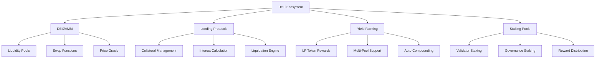

# บทที่ 8: DeFi Protocols

## 🎯 จุดประสงค์ของบทเรียน
- เรียนรู้การสร้าง DeFi Protocols บน Taraxa Network
- ทำความเข้าใจ Automated Market Makers (AMM)
- สร้าง Lending/Borrowing Protocols
- ผลิต Yield Farming และ Staking Mechanisms

## 💰 DeFi Architecture Overview

### **🏗️ DeFi Protocol Structure**



## 🔄 Automated Market Maker (AMM)

### **💧 Liquidity Pool Implementation**

```solidity
// contracts/TaraxaAMM.sol
// SPDX-License-Identifier: MIT
pragma solidity ^0.8.19;

import "@openzeppelin/contracts/token/ERC20/IERC20.sol";
import "@openzeppelin/contracts/token/ERC20/ERC20.sol";
import "@openzeppelin/contracts/security/ReentrancyGuard.sol";
import "@openzeppelin/contracts/access/Ownable.sol";
import "@openzeppelin/contracts/security/Pausable.sol";
import "@openzeppelin/contracts/utils/math/SafeMath.sol";

/**
 * @title TaraxaAMM
 * @dev Automated Market Maker with constant product formula (x * y = k)
 * 
 * Features:
 * - Multi-token pair support
 * - LP token minting/burning
 * - Fee collection and distribution
 * - Price impact calculation
 * - Slippage protection
 * - Flash swap support
 */
contract TaraxaAMM is ERC20, ReentrancyGuard, Ownable, Pausable {
    using SafeMath for uint256;

    // Constants
    uint256 public constant FEE_DENOMINATOR = 10000;
    uint256 public constant MINIMUM_LIQUIDITY = 1000;
    
    // Pool configuration
    IERC20 public immutable token0;
    IERC20 public immutable token1;
    uint256 public swapFee = 30; // 0.3% in basis points
    uint256 public protocolFee = 5; // 0.05% of swap fee goes to protocol
    
    // Pool state
    uint256 public reserve0;
    uint256 public reserve1;
    uint256 public kLast; // reserve0 * reserve1 after most recent liquidity event
    uint256 public price0CumulativeLast;
    uint256 public price1CumulativeLast;
    uint256 public blockTimestampLast;
    
    // Fee collection
    address public feeRecipient;
    uint256 public protocolFeeBalance0;
    uint256 public protocolFeeBalance1;
    
    // Flash swap
    mapping(address => bool) public authorizedFlashSwappers;
    uint256 public flashSwapFee = 9; // 0.09% for flash swaps
    
    // Events
    event Mint(address indexed sender, uint256 amount0, uint256 amount1);
    event Burn(address indexed sender, uint256 amount0, uint256 amount1, address indexed to);
    event Swap(
        address indexed sender,
        uint256 amount0In,
        uint256 amount1In,
        uint256 amount0Out,
        uint256 amount1Out,
        address indexed to
    );
    event Sync(uint256 reserve0, uint256 reserve1);
    event FlashSwap(address indexed sender, uint256 amount, address indexed token, uint256 fee);

    constructor(
        address _token0,
        address _token1,
        string memory _name,
        string memory _symbol
    ) ERC20(_name, _symbol) {
        require(_token0 != _token1, "AMM: Identical tokens");
        require(_token0 != address(0) && _token1 != address(0), "AMM: Zero address");
        
        token0 = IERC20(_token0);
        token1 = IERC20(_token1);
        feeRecipient = msg.sender;
    }

    // ============= LIQUIDITY FUNCTIONS =============

    function addLiquidity(
        uint256 amount0Desired,
        uint256 amount1Desired,
        uint256 amount0Min,
        uint256 amount1Min,
        address to,
        uint256 deadline
    ) external nonReentrant whenNotPaused returns (uint256 amount0, uint256 amount1, uint256 liquidity) {
        require(deadline >= block.timestamp, "AMM: Expired");
        
        (amount0, amount1) = _addLiquidity(amount0Desired, amount1Desired, amount0Min, amount1Min);
        
        address pair = address(this);
        token0.transferFrom(msg.sender, pair, amount0);
        token1.transferFrom(msg.sender, pair, amount1);
        
        liquidity = _mint(to);
        
        emit Mint(msg.sender, amount0, amount1);
    }

    function _addLiquidity(
        uint256 amount0Desired,
        uint256 amount1Desired,
        uint256 amount0Min,
        uint256 amount1Min
    ) internal view returns (uint256 amount0, uint256 amount1) {
        if (reserve0 == 0 && reserve1 == 0) {
            (amount0, amount1) = (amount0Desired, amount1Desired);
        } else {
            uint256 amount1Optimal = quote(amount0Desired, reserve0, reserve1);
            if (amount1Optimal <= amount1Desired) {
                require(amount1Optimal >= amount1Min, "AMM: Insufficient token1 amount");
                (amount0, amount1) = (amount0Desired, amount1Optimal);
            } else {
                uint256 amount0Optimal = quote(amount1Desired, reserve1, reserve0);
                assert(amount0Optimal <= amount0Desired);
                require(amount0Optimal >= amount0Min, "AMM: Insufficient token0 amount");
                (amount0, amount1) = (amount0Optimal, amount1Desired);
            }
        }
    }

    function removeLiquidity(
        uint256 liquidity,
        uint256 amount0Min,
        uint256 amount1Min,
        address to,
        uint256 deadline
    ) external nonReentrant returns (uint256 amount0, uint256 amount1) {
        require(deadline >= block.timestamp, "AMM: Expired");
        
        address pair = address(this);
        _transfer(msg.sender, pair, liquidity); // Send LP tokens to pair
        (amount0, amount1) = _burn(to);
        
        require(amount0 >= amount0Min, "AMM: Insufficient token0 amount");
        require(amount1 >= amount1Min, "AMM: Insufficient token1 amount");
        
        emit Burn(msg.sender, amount0, amount1, to);
    }

    function _mint(address to) internal returns (uint256 liquidity) {
        (uint256 _reserve0, uint256 _reserve1) = getReserves();
        uint256 balance0 = token0.balanceOf(address(this));
        uint256 balance1 = token1.balanceOf(address(this));
        uint256 amount0 = balance0.sub(_reserve0);
        uint256 amount1 = balance1.sub(_reserve1);

        bool feeOn = _mintFee(_reserve0, _reserve1);
        uint256 _totalSupply = totalSupply();
        
        if (_totalSupply == 0) {
            liquidity = _sqrt(amount0.mul(amount1)).sub(MINIMUM_LIQUIDITY);
            _mint(address(0x000000000000000000000000000000000000dEaD), MINIMUM_LIQUIDITY); // Permanently lock minimum liquidity
        } else {
            liquidity = _min(
                amount0.mul(_totalSupply).div(_reserve0),
                amount1.mul(_totalSupply).div(_reserve1)
            );
        }
        
        require(liquidity > 0, "AMM: Insufficient liquidity minted");
        _mint(to, liquidity);

        _update(balance0, balance1, _reserve0, _reserve1);
        if (feeOn) kLast = uint256(reserve0).mul(reserve1);
    }

    function _burn(address to) internal returns (uint256 amount0, uint256 amount1) {
        (uint256 _reserve0, uint256 _reserve1) = getReserves();
        address _token0 = address(token0);
        address _token1 = address(token1);
        uint256 balance0 = token0.balanceOf(address(this));
        uint256 balance1 = token1.balanceOf(address(this));
        uint256 liquidity = balanceOf(address(this));

        bool feeOn = _mintFee(_reserve0, _reserve1);
        uint256 _totalSupply = totalSupply();
        
        amount0 = liquidity.mul(balance0).div(_totalSupply);
        amount1 = liquidity.mul(balance1).div(_totalSupply);
        
        require(amount0 > 0 && amount1 > 0, "AMM: Insufficient liquidity burned");
        
        _burn(address(this), liquidity);
        token0.transfer(to, amount0);
        token1.transfer(to, amount1);
        
        balance0 = token0.balanceOf(address(this));
        balance1 = token1.balanceOf(address(this));

        _update(balance0, balance1, _reserve0, _reserve1);
        if (feeOn) kLast = uint256(reserve0).mul(reserve1);
    }

    // ============= SWAP FUNCTIONS =============

    function swap(
        uint256 amount0Out,
        uint256 amount1Out,
        address to,
        bytes calldata data
    ) external nonReentrant whenNotPaused {
        require(amount0Out > 0 || amount1Out > 0, "AMM: Insufficient output amount");
        (uint256 _reserve0, uint256 _reserve1) = getReserves();
        require(amount0Out < _reserve0 && amount1Out < _reserve1, "AMM: Insufficient liquidity");

        uint256 balance0;
        uint256 balance1;
        
        {
            address _token0 = address(token0);
            address _token1 = address(token1);
            require(to != _token0 && to != _token1, "AMM: Invalid to address");
            
            if (amount0Out > 0) token0.transfer(to, amount0Out);
            if (amount1Out > 0) token1.transfer(to, amount1Out);
            
            if (data.length > 0) {
                ITaraxaAMMCallee(to).taraxaAMMCall(msg.sender, amount0Out, amount1Out, data);
            }
            
            balance0 = token0.balanceOf(address(this));
            balance1 = token1.balanceOf(address(this));
        }
        
        uint256 amount0In = balance0 > _reserve0 - amount0Out ? balance0 - (_reserve0 - amount0Out) : 0;
        uint256 amount1In = balance1 > _reserve1 - amount1Out ? balance1 - (_reserve1 - amount1Out) : 0;
        
        require(amount0In > 0 || amount1In > 0, "AMM: Insufficient input amount");
        
        {
            uint256 balance0Adjusted = balance0.mul(FEE_DENOMINATOR).sub(amount0In.mul(swapFee));
            uint256 balance1Adjusted = balance1.mul(FEE_DENOMINATOR).sub(amount1In.mul(swapFee));
            require(
                balance0Adjusted.mul(balance1Adjusted) >= uint256(_reserve0).mul(_reserve1).mul(FEE_DENOMINATOR**2),
                "AMM: K"
            );
        }

        _update(balance0, balance1, _reserve0, _reserve1);
        emit Swap(msg.sender, amount0In, amount1In, amount0Out, amount1Out, to);
    }

    function swapExactTokensForTokens(
        uint256 amountIn,
        uint256 amountOutMin,
        address tokenIn,
        address to,
        uint256 deadline
    ) external nonReentrant whenNotPaused returns (uint256 amountOut) {
        require(deadline >= block.timestamp, "AMM: Expired");
        require(tokenIn == address(token0) || tokenIn == address(token1), "AMM: Invalid token");
        
        bool isToken0 = tokenIn == address(token0);
        amountOut = getAmountOut(amountIn, isToken0);
        require(amountOut >= amountOutMin, "AMM: Insufficient output amount");
        
        IERC20(tokenIn).transferFrom(msg.sender, address(this), amountIn);
        
        if (isToken0) {
            token1.transfer(to, amountOut);
        } else {
            token0.transfer(to, amountOut);
        }
        
        uint256 balance0 = token0.balanceOf(address(this));
        uint256 balance1 = token1.balanceOf(address(this));
        _update(balance0, balance1, reserve0, reserve1);
        
        emit Swap(
            msg.sender,
            isToken0 ? amountIn : 0,
            isToken0 ? 0 : amountIn,
            isToken0 ? 0 : amountOut,
            isToken0 ? amountOut : 0,
            to
        );
    }

    // ============= FLASH SWAP FUNCTIONS =============

    function flashSwap(
        uint256 amount,
        address token,
        bytes calldata data
    ) external nonReentrant whenNotPaused {
        require(authorizedFlashSwappers[msg.sender], "AMM: Unauthorized flash swapper");
        require(token == address(token0) || token == address(token1), "AMM: Invalid token");
        
        bool isToken0 = token == address(token0);
        uint256 reserve = isToken0 ? reserve0 : reserve1;
        require(amount < reserve, "AMM: Insufficient liquidity for flash swap");
        
        uint256 fee = amount.mul(flashSwapFee).div(FEE_DENOMINATOR);
        uint256 balanceBefore = IERC20(token).balanceOf(address(this));
        
        // Send tokens to borrower
        IERC20(token).transfer(msg.sender, amount);
        
        // Call borrower's callback
        ITaraxaFlashSwapCallee(msg.sender).taraxaFlashSwapCall(token, amount, fee, data);
        
        // Check repayment
        uint256 balanceAfter = IERC20(token).balanceOf(address(this));
        require(balanceAfter >= balanceBefore.add(fee), "AMM: Flash swap not repaid");
        
        // Update protocol fees
        if (isToken0) {
            protocolFeeBalance0 = protocolFeeBalance0.add(fee);
        } else {
            protocolFeeBalance1 = protocolFeeBalance1.add(fee);
        }
        
        // Update reserves
        uint256 balance0 = token0.balanceOf(address(this));
        uint256 balance1 = token1.balanceOf(address(this));
        _update(balance0, balance1, reserve0, reserve1);
        
        emit FlashSwap(msg.sender, amount, token, fee);
    }

    function setAuthorizedFlashSwapper(address swapper, bool authorized) external onlyOwner {
        authorizedFlashSwappers[swapper] = authorized;
    }

    // ============= UTILITY FUNCTIONS =============

    function getAmountOut(uint256 amountIn, bool isToken0Input) public view returns (uint256 amountOut) {
        require(amountIn > 0, "AMM: Insufficient input amount");
        (uint256 reserveIn, uint256 reserveOut) = isToken0Input ? (reserve0, reserve1) : (reserve1, reserve0);
        require(reserveIn > 0 && reserveOut > 0, "AMM: Insufficient liquidity");
        
        uint256 amountInWithFee = amountIn.mul(FEE_DENOMINATOR.sub(swapFee));
        uint256 numerator = amountInWithFee.mul(reserveOut);
        uint256 denominator = reserveIn.mul(FEE_DENOMINATOR).add(amountInWithFee);
        amountOut = numerator.div(denominator);
    }

    function getAmountIn(uint256 amountOut, bool isToken0Output) public view returns (uint256 amountIn) {
        require(amountOut > 0, "AMM: Insufficient output amount");
        (uint256 reserveIn, uint256 reserveOut) = isToken0Output ? (reserve1, reserve0) : (reserve0, reserve1);
        require(reserveIn > 0 && reserveOut > 0, "AMM: Insufficient liquidity");
        
        uint256 numerator = reserveIn.mul(amountOut).mul(FEE_DENOMINATOR);
        uint256 denominator = reserveOut.sub(amountOut).mul(FEE_DENOMINATOR.sub(swapFee));
        amountIn = numerator.div(denominator).add(1);
    }

    function quote(uint256 amountA, uint256 reserveA, uint256 reserveB) public pure returns (uint256 amountB) {
        require(amountA > 0, "AMM: Insufficient amount");
        require(reserveA > 0 && reserveB > 0, "AMM: Insufficient liquidity");
        amountB = amountA.mul(reserveB).div(reserveA);
    }

    function getPriceImpact(uint256 amountIn, bool isToken0Input) external view returns (uint256 impact) {
        uint256 amountOut = getAmountOut(amountIn, isToken0Input);
        (uint256 reserveIn, uint256 reserveOut) = isToken0Input ? (reserve0, reserve1) : (reserve1, reserve0);
        
        uint256 priceBeforeSwap = reserveOut.mul(1e18).div(reserveIn);
        uint256 priceAfterSwap = reserveOut.sub(amountOut).mul(1e18).div(reserveIn.add(amountIn));
        
        if (priceAfterSwap < priceBeforeSwap) {
            impact = priceBeforeSwap.sub(priceAfterSwap).mul(10000).div(priceBeforeSwap);
        }
    }

    // ============= ORACLE FUNCTIONS =============

    function _update(uint256 balance0, uint256 balance1, uint256 _reserve0, uint256 _reserve1) private {
        require(balance0 <= type(uint112).max && balance1 <= type(uint112).max, "AMM: Overflow");
        
        uint32 blockTimestamp = uint32(block.timestamp % 2**32);
        uint32 timeElapsed = blockTimestamp - blockTimestampLast;
        
        if (timeElapsed > 0 && _reserve0 != 0 && _reserve1 != 0) {
            price0CumulativeLast += uint256(_reserve1.mul(1e18).div(_reserve0)) * timeElapsed;
            price1CumulativeLast += uint256(_reserve0.mul(1e18).div(_reserve1)) * timeElapsed;
        }
        
        reserve0 = balance0;
        reserve1 = balance1;
        blockTimestampLast = blockTimestamp;
        emit Sync(reserve0, reserve1);
    }

    function getReserves() public view returns (uint256 _reserve0, uint256 _reserve1) {
        _reserve0 = reserve0;
        _reserve1 = reserve1;
    }

    // ============= FEE FUNCTIONS =============

    function _mintFee(uint256 _reserve0, uint256 _reserve1) private returns (bool feeOn) {
        address feeTo = feeRecipient;
        feeOn = feeTo != address(0);
        uint256 _kLast = kLast;
        
        if (feeOn) {
            if (_kLast != 0) {
                uint256 rootK = _sqrt(uint256(_reserve0).mul(_reserve1));
                uint256 rootKLast = _sqrt(_kLast);
                
                if (rootK > rootKLast) {
                    uint256 numerator = totalSupply().mul(rootK.sub(rootKLast));
                    uint256 denominator = rootK.mul(protocolFee).add(rootKLast);
                    uint256 liquidity = numerator.div(denominator);
                    
                    if (liquidity > 0) _mint(feeTo, liquidity);
                }
            }
        } else if (_kLast != 0) {
            kLast = 0;
        }
    }

    function setSwapFee(uint256 _fee) external onlyOwner {
        require(_fee <= 100, "AMM: Fee too high"); // Max 1%
        swapFee = _fee;
    }

    function setProtocolFee(uint256 _fee) external onlyOwner {
        require(_fee <= 20, "AMM: Protocol fee too high"); // Max 0.2%
        protocolFee = _fee;
    }

    function setFeeRecipient(address _feeRecipient) external onlyOwner {
        feeRecipient = _feeRecipient;
    }

    function collectProtocolFees() external {
        require(msg.sender == feeRecipient, "AMM: Not fee recipient");
        
        if (protocolFeeBalance0 > 0) {
            token0.transfer(feeRecipient, protocolFeeBalance0);
            protocolFeeBalance0 = 0;
        }
        
        if (protocolFeeBalance1 > 0) {
            token1.transfer(feeRecipient, protocolFeeBalance1);
            protocolFeeBalance1 = 0;
        }
    }

    // ============= ADMIN FUNCTIONS =============

    function pause() external onlyOwner {
        _pause();
    }

    function unpause() external onlyOwner {
        _unpause();
    }

    function emergencyWithdraw(address token, uint256 amount) external onlyOwner {
        IERC20(token).transfer(owner(), amount);
    }

    // ============= HELPER FUNCTIONS =============

    function _sqrt(uint256 y) internal pure returns (uint256 z) {
        if (y > 3) {
            z = y;
            uint256 x = y / 2 + 1;
            while (x < z) {
                z = x;
                x = (y / x + x) / 2;
            }
        } else if (y != 0) {
            z = 1;
        }
    }

    function _min(uint256 x, uint256 y) internal pure returns (uint256 z) {
        z = x < y ? x : y;
    }
}

// Interfaces for callbacks
interface ITaraxaAMMCallee {
    function taraxaAMMCall(address sender, uint256 amount0, uint256 amount1, bytes calldata data) external;
}

interface ITaraxaFlashSwapCallee {
    function taraxaFlashSwapCall(address token, uint256 amount, uint256 fee, bytes calldata data) external;
}
```

## 🏦 Lending Protocol

### **💸 Lending and Borrowing Implementation**

```solidity
// contracts/TaraxaLending.sol
// SPDX-License-Identifier: MIT
pragma solidity ^0.8.19;

import "@openzeppelin/contracts/token/ERC20/IERC20.sol";
import "@openzeppelin/contracts/token/ERC20/ERC20.sol";
import "@openzeppelin/contracts/security/ReentrancyGuard.sol";
import "@openzeppelin/contracts/access/Ownable.sol";
import "@openzeppelin/contracts/security/Pausable.sol";
import "@openzeppelin/contracts/utils/math/SafeMath.sol";

/**
 * @title TaraxaLending
 * @dev Decentralized lending and borrowing protocol
 * 
 * Features:
 * - Multi-asset support
 * - Collateralized lending
 * - Interest rate models
 * - Liquidation mechanisms
 * - Health factor monitoring
 * - Flash loans
 */
contract TaraxaLending is ReentrancyGuard, Ownable, Pausable {
    using SafeMath for uint256;

    // Constants
    uint256 public constant PRECISION = 1e18;
    uint256 public constant LIQUIDATION_THRESHOLD = 8000; // 80%
    uint256 public constant LIQUIDATION_BONUS = 500; // 5%
    uint256 public constant MAX_BORROW_RATE = 1000; // 10%
    uint256 public constant FLASH_LOAN_FEE = 9; // 0.09%

    struct AssetData {
        bool isActive;
        bool isBorrowEnabled;
        bool isCollateralEnabled;
        uint256 liquidationThreshold; // % in basis points
        uint256 liquidationBonus; // % in basis points
        uint256 reserveFactor; // % in basis points
        uint256 baseRate; // Annual rate in basis points
        uint256 multiplier; // Rate multiplier
        uint256 totalSupply;
        uint256 totalBorrow;
        uint256 lastUpdateTime;
        uint256 borrowIndex;
        uint256 supplyIndex;
    }

    struct UserData {
        uint256 collateralAmount;
        uint256 borrowAmount;
        uint256 lastUpdateTime;
        uint256 userBorrowIndex;
        uint256 userSupplyIndex;
    }

    // State variables
    mapping(address => AssetData) public assets;
    mapping(address => mapping(address => UserData)) public userData; // user => token => data
    mapping(address => address[]) public userCollaterals;
    mapping(address => address[]) public userBorrows;
    
    address[] public supportedAssets;
    address public treasury;
    
    // Oracle for price feeds
    IPriceOracle public priceOracle;
    
    // Events
    event AssetAdded(address indexed asset, uint256 liquidationThreshold, uint256 liquidationBonus);
    event AssetUpdated(address indexed asset, bool isActive, bool isBorrowEnabled, bool isCollateralEnabled);
    event Deposit(address indexed user, address indexed asset, uint256 amount);
    event Withdraw(address indexed user, address indexed asset, uint256 amount);
    event Borrow(address indexed user, address indexed asset, uint256 amount);
    event Repay(address indexed user, address indexed asset, uint256 amount);
    event Liquidation(
        address indexed liquidator,
        address indexed user,
        address indexed collateralAsset,
        address debtAsset,
        uint256 debtToCover,
        uint256 liquidatedCollateral
    );
    event FlashLoan(address indexed receiver, address indexed asset, uint256 amount, uint256 fee);

    constructor(address _priceOracle, address _treasury) {
        priceOracle = IPriceOracle(_priceOracle);
        treasury = _treasury;
    }

    // ============= ASSET MANAGEMENT =============

    function addAsset(
        address asset,
        uint256 liquidationThreshold,
        uint256 liquidationBonus,
        uint256 reserveFactor,
        uint256 baseRate,
        uint256 multiplier
    ) external onlyOwner {
        require(asset != address(0), "Invalid asset");
        require(!assets[asset].isActive, "Asset already added");
        require(liquidationThreshold <= 9500, "Invalid liquidation threshold");
        require(liquidationBonus <= 2000, "Invalid liquidation bonus");

        assets[asset] = AssetData({
            isActive: true,
            isBorrowEnabled: true,
            isCollateralEnabled: true,
            liquidationThreshold: liquidationThreshold,
            liquidationBonus: liquidationBonus,
            reserveFactor: reserveFactor,
            baseRate: baseRate,
            multiplier: multiplier,
            totalSupply: 0,
            totalBorrow: 0,
            lastUpdateTime: block.timestamp,
            borrowIndex: PRECISION,
            supplyIndex: PRECISION
        });

        supportedAssets.push(asset);
        emit AssetAdded(asset, liquidationThreshold, liquidationBonus);
    }

    function updateAsset(
        address asset,
        bool isActive,
        bool isBorrowEnabled,
        bool isCollateralEnabled
    ) external onlyOwner {
        require(assets[asset].isActive, "Asset not found");
        
        assets[asset].isActive = isActive;
        assets[asset].isBorrowEnabled = isBorrowEnabled;
        assets[asset].isCollateralEnabled = isCollateralEnabled;
        
        emit AssetUpdated(asset, isActive, isBorrowEnabled, isCollateralEnabled);
    }

    // ============= INTEREST RATE CALCULATION =============

    function updateInterestRates(address asset) public {
        AssetData storage assetData = assets[asset];
        require(assetData.isActive, "Asset not active");

        uint256 timeElapsed = block.timestamp.sub(assetData.lastUpdateTime);
        if (timeElapsed == 0) return;

        // Calculate utilization rate
        uint256 utilizationRate = assetData.totalSupply > 0 
            ? assetData.totalBorrow.mul(PRECISION).div(assetData.totalSupply)
            : 0;

        // Calculate borrow rate: baseRate + multiplier * utilizationRate
        uint256 borrowRate = assetData.baseRate.add(
            assetData.multiplier.mul(utilizationRate).div(PRECISION)
        );

        // Ensure borrow rate doesn't exceed maximum
        if (borrowRate > MAX_BORROW_RATE) {
            borrowRate = MAX_BORROW_RATE;
        }

        // Calculate supply rate: borrowRate * utilizationRate * (1 - reserveFactor)
        uint256 supplyRate = borrowRate
            .mul(utilizationRate)
            .mul(uint256(10000).sub(assetData.reserveFactor))
            .div(PRECISION)
            .div(10000);

        // Update indices
        uint256 borrowRatePerSecond = borrowRate.div(365 days);
        uint256 supplyRatePerSecond = supplyRate.div(365 days);

        assetData.borrowIndex = assetData.borrowIndex
            .mul(PRECISION.add(borrowRatePerSecond.mul(timeElapsed)))
            .div(PRECISION);

        assetData.supplyIndex = assetData.supplyIndex
            .mul(PRECISION.add(supplyRatePerSecond.mul(timeElapsed)))
            .div(PRECISION);

        assetData.lastUpdateTime = block.timestamp;
    }

    // ============= LENDING FUNCTIONS =============

    function deposit(address asset, uint256 amount) external nonReentrant whenNotPaused {
        require(assets[asset].isActive, "Asset not active");
        require(amount > 0, "Invalid amount");

        updateInterestRates(asset);
        
        UserData storage user = userData[msg.sender][asset];
        
        // Update user's supply index if they have existing deposits
        if (user.collateralAmount > 0) {
            uint256 interest = user.collateralAmount
                .mul(assets[asset].supplyIndex)
                .div(user.userSupplyIndex)
                .sub(user.collateralAmount);
            
            user.collateralAmount = user.collateralAmount.add(interest);
        }

        // Transfer tokens
        IERC20(asset).transferFrom(msg.sender, address(this), amount);
        
        // Update user data
        user.collateralAmount = user.collateralAmount.add(amount);
        user.userSupplyIndex = assets[asset].supplyIndex;
        user.lastUpdateTime = block.timestamp;
        
        // Update asset data
        assets[asset].totalSupply = assets[asset].totalSupply.add(amount);
        
        // Add to user's collateral list if not already present
        _addToUserCollaterals(msg.sender, asset);
        
        emit Deposit(msg.sender, asset, amount);
    }

    function withdraw(address asset, uint256 amount) external nonReentrant whenNotPaused {
        require(assets[asset].isActive, "Asset not active");
        require(amount > 0, "Invalid amount");

        updateInterestRates(asset);
        
        UserData storage user = userData[msg.sender][asset];
        
        // Calculate current balance with interest
        uint256 currentBalance = user.collateralAmount
            .mul(assets[asset].supplyIndex)
            .div(user.userSupplyIndex);
        
        require(currentBalance >= amount, "Insufficient balance");
        
        // Update user data
        user.collateralAmount = currentBalance.sub(amount);
        user.userSupplyIndex = assets[asset].supplyIndex;
        user.lastUpdateTime = block.timestamp;
        
        // Check health factor after withdrawal
        require(_checkHealthFactor(msg.sender), "Health factor too low");
        
        // Update asset data
        assets[asset].totalSupply = assets[asset].totalSupply.sub(amount);
        
        // Transfer tokens
        IERC20(asset).transfer(msg.sender, amount);
        
        emit Withdraw(msg.sender, asset, amount);
    }

    // ============= BORROWING FUNCTIONS =============

    function borrow(address asset, uint256 amount) external nonReentrant whenNotPaused {
        require(assets[asset].isActive, "Asset not active");
        require(assets[asset].isBorrowEnabled, "Borrowing disabled");
        require(amount > 0, "Invalid amount");

        updateInterestRates(asset);
        
        UserData storage user = userData[msg.sender][asset];
        
        // Update user's borrow index if they have existing borrows
        if (user.borrowAmount > 0) {
            uint256 interest = user.borrowAmount
                .mul(assets[asset].borrowIndex)
                .div(user.userBorrowIndex)
                .sub(user.borrowAmount);
            
            user.borrowAmount = user.borrowAmount.add(interest);
        }
        
        // Update user data
        user.borrowAmount = user.borrowAmount.add(amount);
        user.userBorrowIndex = assets[asset].borrowIndex;
        user.lastUpdateTime = block.timestamp;
        
        // Check if user has enough collateral
        require(_checkHealthFactor(msg.sender), "Insufficient collateral");
        
        // Check if protocol has enough liquidity
        require(IERC20(asset).balanceOf(address(this)) >= amount, "Insufficient liquidity");
        
        // Update asset data
        assets[asset].totalBorrow = assets[asset].totalBorrow.add(amount);
        
        // Add to user's borrow list if not already present
        _addToUserBorrows(msg.sender, asset);
        
        // Transfer tokens
        IERC20(asset).transfer(msg.sender, amount);
        
        emit Borrow(msg.sender, asset, amount);
    }

    function repay(address asset, uint256 amount) external nonReentrant whenNotPaused {
        require(assets[asset].isActive, "Asset not active");
        require(amount > 0, "Invalid amount");

        updateInterestRates(asset);
        
        UserData storage user = userData[msg.sender][asset];
        
        // Calculate current debt with interest
        uint256 currentDebt = user.borrowAmount
            .mul(assets[asset].borrowIndex)
            .div(user.userBorrowIndex);
        
        require(currentDebt > 0, "No debt to repay");
        
        // Cap repayment to current debt
        if (amount > currentDebt) {
            amount = currentDebt;
        }
        
        // Transfer tokens
        IERC20(asset).transferFrom(msg.sender, address(this), amount);
        
        // Update user data
        user.borrowAmount = currentDebt.sub(amount);
        user.userBorrowIndex = assets[asset].borrowIndex;
        user.lastUpdateTime = block.timestamp;
        
        // Update asset data
        assets[asset].totalBorrow = assets[asset].totalBorrow.sub(amount);
        
        emit Repay(msg.sender, asset, amount);
    }

    // ============= LIQUIDATION FUNCTIONS =============

    function liquidate(
        address user,
        address debtAsset,
        uint256 debtToCover,
        address collateralAsset
    ) external nonReentrant whenNotPaused {
        require(user != msg.sender, "Cannot liquidate self");
        require(!_checkHealthFactor(user), "User is healthy");

        updateInterestRates(debtAsset);
        updateInterestRates(collateralAsset);

        UserData storage userDebt = userData[user][debtAsset];
        UserData storage userCollateral = userData[user][collateralAsset];

        // Calculate current debt
        uint256 currentDebt = userDebt.borrowAmount
            .mul(assets[debtAsset].borrowIndex)
            .div(userDebt.userBorrowIndex);

        // Calculate current collateral
        uint256 currentCollateral = userCollateral.collateralAmount
            .mul(assets[collateralAsset].supplyIndex)
            .div(userCollateral.userSupplyIndex);

        require(currentDebt > 0, "No debt to liquidate");
        require(currentCollateral > 0, "No collateral to liquidate");

        // Cap debt to cover at 50% of total debt
        uint256 maxDebtToCover = currentDebt.div(2);
        if (debtToCover > maxDebtToCover) {
            debtToCover = maxDebtToCover;
        }

        // Calculate collateral amount to liquidate
        uint256 debtPrice = priceOracle.getPrice(debtAsset);
        uint256 collateralPrice = priceOracle.getPrice(collateralAsset);
        
        uint256 collateralAmount = debtToCover
            .mul(debtPrice)
            .div(collateralPrice)
            .mul(10000 + assets[collateralAsset].liquidationBonus)
            .div(10000);

        require(collateralAmount <= currentCollateral, "Insufficient collateral");

        // Transfer debt payment from liquidator
        IERC20(debtAsset).transferFrom(msg.sender, address(this), debtToCover);

        // Transfer collateral to liquidator
        IERC20(collateralAsset).transfer(msg.sender, collateralAmount);

        // Update user debt
        userDebt.borrowAmount = currentDebt.sub(debtToCover);
        userDebt.userBorrowIndex = assets[debtAsset].borrowIndex;

        // Update user collateral
        userCollateral.collateralAmount = currentCollateral.sub(collateralAmount);
        userCollateral.userSupplyIndex = assets[collateralAsset].supplyIndex;

        // Update asset totals
        assets[debtAsset].totalBorrow = assets[debtAsset].totalBorrow.sub(debtToCover);
        assets[collateralAsset].totalSupply = assets[collateralAsset].totalSupply.sub(collateralAmount);

        emit Liquidation(msg.sender, user, collateralAsset, debtAsset, debtToCover, collateralAmount);
    }

    // ============= FLASH LOAN FUNCTIONS =============

    function flashLoan(
        address receiver,
        address asset,
        uint256 amount,
        bytes calldata params
    ) external nonReentrant whenNotPaused {
        require(assets[asset].isActive, "Asset not active");
        require(amount > 0, "Invalid amount");

        uint256 fee = amount.mul(FLASH_LOAN_FEE).div(10000);
        uint256 balanceBefore = IERC20(asset).balanceOf(address(this));
        
        require(balanceBefore >= amount, "Insufficient liquidity");

        // Send tokens to receiver
        IERC20(asset).transfer(receiver, amount);

        // Call receiver's callback
        IFlashLoanReceiver(receiver).executeOperation(asset, amount, fee, params);

        // Check repayment
        uint256 balanceAfter = IERC20(asset).balanceOf(address(this));
        require(balanceAfter >= balanceBefore.add(fee), "Flash loan not repaid");

        // Send fee to treasury
        if (fee > 0) {
            IERC20(asset).transfer(treasury, fee);
        }

        emit FlashLoan(receiver, asset, amount, fee);
    }

    // ============= HELPER FUNCTIONS =============

    function _checkHealthFactor(address user) internal view returns (bool) {
        (uint256 totalCollateralValue, uint256 totalBorrowValue) = _getUserAccountData(user);
        
        if (totalBorrowValue == 0) return true;
        
        uint256 healthFactor = totalCollateralValue.mul(10000).div(totalBorrowValue);
        return healthFactor >= LIQUIDATION_THRESHOLD;
    }

    function _getUserAccountData(address user) internal view returns (uint256 totalCollateralValue, uint256 totalBorrowValue) {
        // Calculate total collateral value
        address[] memory collaterals = userCollaterals[user];
        for (uint256 i = 0; i < collaterals.length; i++) {
            address asset = collaterals[i];
            UserData memory userAsset = userData[user][asset];
            
            if (userAsset.collateralAmount > 0) {
                uint256 balance = userAsset.collateralAmount
                    .mul(assets[asset].supplyIndex)
                    .div(userAsset.userSupplyIndex);
                
                uint256 price = priceOracle.getPrice(asset);
                uint256 threshold = assets[asset].liquidationThreshold;
                
                totalCollateralValue = totalCollateralValue.add(
                    balance.mul(price).mul(threshold).div(PRECISION).div(10000)
                );
            }
        }
        
        // Calculate total borrow value
        address[] memory borrows = userBorrows[user];
        for (uint256 i = 0; i < borrows.length; i++) {
            address asset = borrows[i];
            UserData memory userAsset = userData[user][asset];
            
            if (userAsset.borrowAmount > 0) {
                uint256 debt = userAsset.borrowAmount
                    .mul(assets[asset].borrowIndex)
                    .div(userAsset.userBorrowIndex);
                
                uint256 price = priceOracle.getPrice(asset);
                totalBorrowValue = totalBorrowValue.add(debt.mul(price).div(PRECISION));
            }
        }
    }

    function _addToUserCollaterals(address user, address asset) internal {
        address[] storage collaterals = userCollaterals[user];
        for (uint256 i = 0; i < collaterals.length; i++) {
            if (collaterals[i] == asset) return;
        }
        collaterals.push(asset);
    }

    function _addToUserBorrows(address user, address asset) internal {
        address[] storage borrows = userBorrows[user];
        for (uint256 i = 0; i < borrows.length; i++) {
            if (borrows[i] == asset) return;
        }
        borrows.push(asset);
    }

    // ============= VIEW FUNCTIONS =============

    function getUserAccountData(address user) external view returns (
        uint256 totalCollateralValue,
        uint256 totalBorrowValue,
        uint256 healthFactor,
        uint256 maxBorrowValue
    ) {
        (totalCollateralValue, totalBorrowValue) = _getUserAccountData(user);
        
        if (totalBorrowValue > 0) {
            healthFactor = totalCollateralValue.mul(10000).div(totalBorrowValue);
        } else {
            healthFactor = type(uint256).max;
        }
        
        maxBorrowValue = totalCollateralValue.mul(LIQUIDATION_THRESHOLD).div(10000);
    }

    function getUserAssetData(address user, address asset) external view returns (
        uint256 collateralBalance,
        uint256 borrowBalance,
        uint256 supplyAPY,
        uint256 borrowAPY
    ) {
        UserData memory userAsset = userData[user][asset];
        
        if (userAsset.collateralAmount > 0) {
            collateralBalance = userAsset.collateralAmount
                .mul(assets[asset].supplyIndex)
                .div(userAsset.userSupplyIndex);
        }
        
        if (userAsset.borrowAmount > 0) {
            borrowBalance = userAsset.borrowAmount
                .mul(assets[asset].borrowIndex)
                .div(userAsset.userBorrowIndex);
        }
        
        // Calculate APYs (simplified)
        AssetData memory assetData = assets[asset];
        uint256 utilizationRate = assetData.totalSupply > 0 
            ? assetData.totalBorrow.mul(PRECISION).div(assetData.totalSupply)
            : 0;
        
        borrowAPY = assetData.baseRate.add(assetData.multiplier.mul(utilizationRate).div(PRECISION));
        supplyAPY = borrowAPY.mul(utilizationRate).mul(10000 - assetData.reserveFactor).div(PRECISION).div(10000);
    }

    function getAssetData(address asset) external view returns (
        bool isActive,
        bool isBorrowEnabled,
        bool isCollateralEnabled,
        uint256 totalSupply,
        uint256 totalBorrow,
        uint256 supplyAPY,
        uint256 borrowAPY,
        uint256 liquidationThreshold,
        uint256 liquidationBonus
    ) {
        AssetData memory assetData = assets[asset];
        
        uint256 utilizationRate = assetData.totalSupply > 0 
            ? assetData.totalBorrow.mul(PRECISION).div(assetData.totalSupply)
            : 0;
        
        borrowAPY = assetData.baseRate.add(assetData.multiplier.mul(utilizationRate).div(PRECISION));
        supplyAPY = borrowAPY.mul(utilizationRate).mul(10000 - assetData.reserveFactor).div(PRECISION).div(10000);
        
        return (
            assetData.isActive,
            assetData.isBorrowEnabled,
            assetData.isCollateralEnabled,
            assetData.totalSupply,
            assetData.totalBorrow,
            supplyAPY,
            borrowAPY,
            assetData.liquidationThreshold,
            assetData.liquidationBonus
        );
    }

    // ============= ADMIN FUNCTIONS =============

    function pause() external onlyOwner {
        _pause();
    }

    function unpause() external onlyOwner {
        _unpause();
    }

    function setPriceOracle(address _priceOracle) external onlyOwner {
        priceOracle = IPriceOracle(_priceOracle);
    }

    function setTreasury(address _treasury) external onlyOwner {
        treasury = _treasury;
    }

    function emergencyWithdraw(address asset, uint256 amount) external onlyOwner {
        IERC20(asset).transfer(owner(), amount);
    }
}

// Interfaces
interface IPriceOracle {
    function getPrice(address asset) external view returns (uint256);
}

interface IFlashLoanReceiver {
    function executeOperation(
        address asset,
        uint256 amount,
        uint256 fee,
        bytes calldata params
    ) external;
}
```

## 🎯 แบบฝึกหัด

### **📝 แบบฝึกหัดที่ 1: AMM Enhancement**
เพิ่มฟีเจอร์ใน AMM:
1. Multi-hop swaps (A→B→C)
2. Time-weighted average price (TWAP) oracle
3. Concentrated liquidity (like Uniswap V3)

### **🔧 แบบฝึกหัดที่ 2: Lending Features**
เพิ่มฟีเจอร์:
1. Variable interest rate models
2. Credit delegation
3. Governance token rewards

### **🎯 แบบฝึกหัดที่ 3: Yield Farming**
สร้าง:
1. Multi-pool yield farming contract
2. Auto-compounding strategies
3. Impermanent loss protection

## 🔗 การเชื่อมต่อ

**บทก่อนหน้า**: [บทที่ 7: Token Standards](./07-token-standards.md)  
**บทถัดไป**: [บทที่ 9: Multi-Contract Systems](./09-multi-contract-systems.md)

**กลับไปหน้าหลัก**: [README](./README.md)

---

## 📚 เอกสารอ้างอิง

- [Uniswap V2 Documentation](https://docs.uniswap.org/protocol/V2/introduction)
- [Compound Protocol](https://docs.compound.finance/)
- [Aave Protocol](https://docs.aave.com/developers/)
- [DeFi Pulse](https://defipulse.com/)

---

ตอนนี้คุณเข้าใจ DeFi Protocols แล้ว! ในบทถัดไป เราจะเรียนรู้เรื่อง Multi-Contract Systems 🚀
