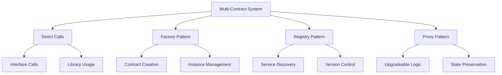

# บทที่ 9: Multi-Contract Systems

## 🎯 จุดประสงค์ของบทเรียน
- เรียนรู้การออกแบบ Multi-Contract Architecture
- ทำความเข้าใจ Contract Communication Patterns
- สร้าง Factory Patterns และ Registry Systems
- พัฒนา Modular และ Upgradeable Contract Systems

## 🏗️ Multi-Contract Architecture

### **🔗 Contract Communication Patterns**



### **🏛️ System Architecture Example**

```solidity
// contracts/interfaces/IContractRegistry.sol
// SPDX-License-Identifier: MIT
pragma solidity ^0.8.19;

interface IContractRegistry {
    function getContract(string memory name) external view returns (address);
    function setContract(string memory name, address contractAddress) external;
    function removeContract(string memory name) external;
    function isRegistered(string memory name) external view returns (bool);
}

// contracts/interfaces/IUserProfile.sol
interface IUserProfile {
    function createProfile(string memory username, string memory email) external;
    function updateProfile(string memory username, string memory email) external;
    function getProfile(address user) external view returns (string memory username, string memory email, uint256 createdAt);
    function profileExists(address user) external view returns (bool);
}

// contracts/interfaces/IReputationSystem.sol
interface IReputationSystem {
    function addReputation(address user, uint256 points, string memory reason) external;
    function removeReputation(address user, uint256 points, string memory reason) external;
    function getReputation(address user) external view returns (uint256 score, uint256 level);
    function canPerformAction(address user, string memory action) external view returns (bool);
}

// contracts/interfaces/INotificationSystem.sol
interface INotificationSystem {
    function sendNotification(address recipient, string memory title, string memory message) external;
    function getNotifications(address user) external view returns (uint256[] memory);
    function markAsRead(uint256 notificationId) external;
}

// contracts/interfaces/IContentManagement.sol
interface IContentManagement {
    function createContent(string memory title, string memory content, string[] memory tags) external returns (uint256);
    function updateContent(uint256 contentId, string memory title, string memory content) external;
    function deleteContent(uint256 contentId) external;
    function getContent(uint256 contentId) external view returns (string memory title, string memory content, address author, uint256 createdAt);
}
```

## 📋 Registry System Implementation

### **🗂️ Central Contract Registry**

```solidity
// contracts/core/ContractRegistry.sol
// SPDX-License-Identifier: MIT
pragma solidity ^0.8.19;

import "@openzeppelin/contracts/access/Ownable.sol";
import "@openzeppelin/contracts/security/Pausable.sol";
import "../interfaces/IContractRegistry.sol";

/**
 * @title ContractRegistry
 * @dev Central registry for managing contract addresses in the ecosystem
 */
contract ContractRegistry is IContractRegistry, Ownable, Pausable {
    // Contract mapping
    mapping(string => address) private contracts;
    mapping(string => uint256) private contractVersions;
    mapping(address => bool) private authorizedUpdaters;
    
    // History tracking
    struct ContractHistory {
        address contractAddress;
        uint256 version;
        uint256 timestamp;
        string reason;
    }
    
    mapping(string => ContractHistory[]) private contractHistory;
    
    // Constants
    uint256 public constant MAX_CONTRACTS = 100;
    
    // State variables
    string[] public contractNames;
    uint256 public totalContracts;
    bool public emergencyMode;
    
    // Events
    event ContractRegistered(string indexed name, address indexed contractAddress, uint256 version);
    event ContractUpdated(string indexed name, address indexed oldAddress, address indexed newAddress, uint256 version);
    event ContractRemoved(string indexed name, address indexed contractAddress);
    event AuthorizationChanged(address indexed updater, bool authorized);
    event EmergencyModeToggled(bool enabled);

    modifier onlyAuthorized() {
        require(authorizedUpdaters[msg.sender] || msg.sender == owner(), "Not authorized");
        _;
    }

    modifier notInEmergency() {
        require(!emergencyMode, "Emergency mode active");
        _;
    }

    modifier validContractName(string memory name) {
        require(bytes(name).length > 0 && bytes(name).length <= 32, "Invalid contract name");
        _;
    }

    constructor() {
        authorizedUpdaters[msg.sender] = true;
    }

    // ============= CORE FUNCTIONS =============

    function setContract(
        string memory name, 
        address contractAddress
    ) external override onlyAuthorized whenNotPaused notInEmergency validContractName(name) {
        require(contractAddress != address(0), "Invalid contract address");
        require(contractAddress.code.length > 0, "Not a contract");
        require(totalContracts < MAX_CONTRACTS, "Max contracts reached");
        
        address oldAddress = contracts[name];
        bool isUpdate = oldAddress != address(0);
        
        // Update contract mapping
        contracts[name] = contractAddress;
        contractVersions[name]++;
        
        // Add to names array if new contract
        if (!isUpdate) {
            contractNames.push(name);
            totalContracts++;
        }
        
        // Add to history
        contractHistory[name].push(ContractHistory({
            contractAddress: contractAddress,
            version: contractVersions[name],
            timestamp: block.timestamp,
            reason: isUpdate ? "Contract updated" : "Contract registered"
        }));
        
        if (isUpdate) {
            emit ContractUpdated(name, oldAddress, contractAddress, contractVersions[name]);
        } else {
            emit ContractRegistered(name, contractAddress, contractVersions[name]);
        }
    }

    function getContract(string memory name) external view override returns (address) {
        address contractAddress = contracts[name];
        require(contractAddress != address(0), "Contract not found");
        return contractAddress;
    }

    function removeContract(
        string memory name
    ) external override onlyAuthorized whenNotPaused {
        address contractAddress = contracts[name];
        require(contractAddress != address(0), "Contract not found");
        
        // Remove from mapping
        delete contracts[name];
        delete contractVersions[name];
        
        // Remove from names array
        for (uint256 i = 0; i < contractNames.length; i++) {
            if (keccak256(bytes(contractNames[i])) == keccak256(bytes(name))) {
                contractNames[i] = contractNames[contractNames.length - 1];
                contractNames.pop();
                break;
            }
        }
        
        totalContracts--;
        
        // Add to history
        contractHistory[name].push(ContractHistory({
            contractAddress: address(0),
            version: 0,
            timestamp: block.timestamp,
            reason: "Contract removed"
        }));
        
        emit ContractRemoved(name, contractAddress);
    }

    function isRegistered(string memory name) external view override returns (bool) {
        return contracts[name] != address(0);
    }

    // ============= AUTHORIZATION MANAGEMENT =============

    function setAuthorizedUpdater(address updater, bool authorized) external onlyOwner {
        require(updater != address(0), "Invalid address");
        authorizedUpdaters[updater] = authorized;
        emit AuthorizationChanged(updater, authorized);
    }

    function isAuthorizedUpdater(address updater) external view returns (bool) {
        return authorizedUpdaters[updater];
    }

    // ============= EMERGENCY FUNCTIONS =============

    function setEmergencyMode(bool enabled) external onlyOwner {
        emergencyMode = enabled;
        emit EmergencyModeToggled(enabled);
    }

    function emergencyUpdateContract(
        string memory name,
        address contractAddress
    ) external onlyOwner {
        require(emergencyMode, "Emergency mode not active");
        require(contractAddress != address(0), "Invalid contract address");
        
        address oldAddress = contracts[name];
        contracts[name] = contractAddress;
        contractVersions[name]++;
        
        // Add to history
        contractHistory[name].push(ContractHistory({
            contractAddress: contractAddress,
            version: contractVersions[name],
            timestamp: block.timestamp,
            reason: "Emergency update"
        }));
        
        emit ContractUpdated(name, oldAddress, contractAddress, contractVersions[name]);
    }

    // ============= VIEW FUNCTIONS =============

    function getAllContracts() external view returns (
        string[] memory names,
        address[] memory addresses,
        uint256[] memory versions
    ) {
        names = new string[](totalContracts);
        addresses = new address[](totalContracts);
        versions = new uint256[](totalContracts);
        
        for (uint256 i = 0; i < totalContracts; i++) {
            names[i] = contractNames[i];
            addresses[i] = contracts[contractNames[i]];
            versions[i] = contractVersions[contractNames[i]];
        }
    }

    function getContractInfo(string memory name) external view returns (
        address contractAddress,
        uint256 version,
        uint256 historyCount
    ) {
        contractAddress = contracts[name];
        version = contractVersions[name];
        historyCount = contractHistory[name].length;
    }

    function getContractHistory(
        string memory name,
        uint256 offset,
        uint256 limit
    ) external view returns (ContractHistory[] memory) {
        ContractHistory[] memory history = contractHistory[name];
        
        if (offset >= history.length) {
            return new ContractHistory[](0);
        }
        
        uint256 end = offset + limit;
        if (end > history.length) {
            end = history.length;
        }
        
        ContractHistory[] memory result = new ContractHistory[](end - offset);
        for (uint256 i = offset; i < end; i++) {
            result[i - offset] = history[i];
        }
        
        return result;
    }

    // ============= UTILITY FUNCTIONS =============

    function pause() external onlyOwner {
        _pause();
    }

    function unpause() external onlyOwner {
        _unpause();
    }

    function getContractNamesCount() external view returns (uint256) {
        return contractNames.length;
    }

    function getContractNameByIndex(uint256 index) external view returns (string memory) {
        require(index < contractNames.length, "Index out of bounds");
        return contractNames[index];
    }
}
```

## 🏭 Factory Pattern Implementation

### **⚚ User Profile Factory**

```solidity
// contracts/core/UserProfileFactory.sol
// SPDX-License-Identifier: MIT
pragma solidity ^0.8.19;

import "@openzeppelin/contracts/access/Ownable.sol";
import "@openzeppelin/contracts/security/ReentrancyGuard.sol";
import "../interfaces/IContractRegistry.sol";
import "./UserProfile.sol";

/**
 * @title UserProfileFactory
 * @dev Factory contract for creating and managing user profiles
 */
contract UserProfileFactory is Ownable, ReentrancyGuard {
    // Registry reference
    IContractRegistry public immutable registry;
    
    // Profile tracking
    mapping(address => address) public userProfiles;
    mapping(address => bool) public isProfileContract;
    address[] public allProfiles;
    
    // Configuration
    uint256 public profileCreationFee;
    uint256 public maxProfilesPerUser = 1;
    bool public profileCreationEnabled = true;
    
    // Template for profile contracts
    address public profileTemplate;
    uint256 public profileVersion = 1;
    
    // Statistics
    uint256 public totalProfilesCreated;
    uint256 public activeProfiles;
    
    // Events
    event ProfileCreated(
        address indexed user,
        address indexed profileContract,
        string username,
        uint256 version
    );
    event ProfileDeactivated(address indexed user, address indexed profileContract);
    event TemplateUpdated(address indexed oldTemplate, address indexed newTemplate, uint256 version);
    event FactoryConfigUpdated(uint256 fee, uint256 maxProfiles, bool enabled);

    modifier profileCreationAllowed() {
        require(profileCreationEnabled, "Profile creation disabled");
        _;
    }

    modifier onlyValidUser() {
        require(msg.sender != address(0), "Invalid user address");
        _;
    }

    constructor(
        address _registry,
        address _profileTemplate,
        uint256 _creationFee
    ) {
        require(_registry != address(0), "Invalid registry");
        require(_profileTemplate != address(0), "Invalid template");
        
        registry = IContractRegistry(_registry);
        profileTemplate = _profileTemplate;
        profileCreationFee = _creationFee;
    }

    // ============= PROFILE CREATION =============

    function createProfile(
        string memory username,
        string memory email,
        string memory bio
    ) external payable nonReentrant onlyValidUser profileCreationAllowed returns (address) {
        require(msg.value >= profileCreationFee, "Insufficient fee");
        require(userProfiles[msg.sender] == address(0), "Profile already exists");
        require(bytes(username).length > 0 && bytes(username).length <= 32, "Invalid username");
        
        // Create new profile contract
        UserProfile newProfile = new UserProfile{salt: keccak256(abi.encodePacked(msg.sender, block.timestamp))}(
            msg.sender,
            address(registry),
            username,
            email,
            bio,
            profileVersion
        );
        
        address profileAddress = address(newProfile);
        
        // Update mappings
        userProfiles[msg.sender] = profileAddress;
        isProfileContract[profileAddress] = true;
        allProfiles.push(profileAddress);
        
        // Update statistics
        totalProfilesCreated++;
        activeProfiles++;
        
        // Transfer excess ETH back to user
        if (msg.value > profileCreationFee) {
            payable(msg.sender).transfer(msg.value - profileCreationFee);
        }
        
        emit ProfileCreated(msg.sender, profileAddress, username, profileVersion);
        
        return profileAddress;
    }

    function createProfileBatch(
        address[] memory users,
        string[] memory usernames,
        string[] memory emails,
        string[] memory bios
    ) external onlyOwner nonReentrant {
        require(users.length == usernames.length, "Array length mismatch");
        require(users.length == emails.length, "Array length mismatch");
        require(users.length == bios.length, "Array length mismatch");
        require(users.length <= 50, "Batch size too large");
        
        for (uint256 i = 0; i < users.length; i++) {
            if (userProfiles[users[i]] == address(0)) {
                _createProfileForUser(users[i], usernames[i], emails[i], bios[i]);
            }
        }
    }

    function _createProfileForUser(
        address user,
        string memory username,
        string memory email,
        string memory bio
    ) internal {
        UserProfile newProfile = new UserProfile{salt: keccak256(abi.encodePacked(user, block.timestamp))}(
            user,
            address(registry),
            username,
            email,
            bio,
            profileVersion
        );
        
        address profileAddress = address(newProfile);
        
        userProfiles[user] = profileAddress;
        isProfileContract[profileAddress] = true;
        allProfiles.push(profileAddress);
        
        totalProfilesCreated++;
        activeProfiles++;
        
        emit ProfileCreated(user, profileAddress, username, profileVersion);
    }

    // ============= PROFILE MANAGEMENT =============

    function deactivateProfile(address user) external onlyOwner {
        address profileAddress = userProfiles[user];
        require(profileAddress != address(0), "Profile not found");
        
        // Call deactivate on the profile contract
        UserProfile(profileAddress).deactivate();
        
        // Update tracking
        delete userProfiles[user];
        isProfileContract[profileAddress] = false;
        activeProfiles--;
        
        emit ProfileDeactivated(user, profileAddress);
    }

    function upgradeProfile(address user) external onlyOwner {
        address profileAddress = userProfiles[user];
        require(profileAddress != address(0), "Profile not found");
        
        // This would typically involve deploying a new profile with upgraded logic
        // For simplicity, we'll just update the version
        UserProfile(profileAddress).upgradeVersion(profileVersion);
    }

    // ============= TEMPLATE MANAGEMENT =============

    function updateProfileTemplate(address newTemplate) external onlyOwner {
        require(newTemplate != address(0), "Invalid template");
        require(newTemplate.code.length > 0, "Not a contract");
        
        address oldTemplate = profileTemplate;
        profileTemplate = newTemplate;
        profileVersion++;
        
        emit TemplateUpdated(oldTemplate, newTemplate, profileVersion);
    }

    function setFactoryConfig(
        uint256 _creationFee,
        uint256 _maxProfiles,
        bool _enabled
    ) external onlyOwner {
        profileCreationFee = _creationFee;
        maxProfilesPerUser = _maxProfiles;
        profileCreationEnabled = _enabled;
        
        emit FactoryConfigUpdated(_creationFee, _maxProfiles, _enabled);
    }

    // ============= VIEW FUNCTIONS =============

    function getUserProfile(address user) external view returns (address) {
        return userProfiles[user];
    }

    function hasProfile(address user) external view returns (bool) {
        return userProfiles[user] != address(0);
    }

    function getProfileInfo(address user) external view returns (
        address profileAddress,
        bool isActive,
        uint256 version
    ) {
        profileAddress = userProfiles[user];
        if (profileAddress != address(0)) {
            isActive = isProfileContract[profileAddress];
            version = UserProfile(profileAddress).version();
        }
    }

    function getAllProfiles(
        uint256 offset,
        uint256 limit
    ) external view returns (address[] memory profiles) {
        uint256 totalProfiles = allProfiles.length;
        
        if (offset >= totalProfiles) {
            return new address[](0);
        }
        
        uint256 end = offset + limit;
        if (end > totalProfiles) {
            end = totalProfiles;
        }
        
        profiles = new address[](end - offset);
        for (uint256 i = offset; i < end; i++) {
            profiles[i - offset] = allProfiles[i];
        }
    }

    function getFactoryStats() external view returns (
        uint256 _totalCreated,
        uint256 _activeProfiles,
        uint256 _currentVersion,
        uint256 _creationFee,
        bool _creationEnabled
    ) {
        return (
            totalProfilesCreated,
            activeProfiles,
            profileVersion,
            profileCreationFee,
            profileCreationEnabled
        );
    }

    // ============= PREDICTABLE ADDRESSES =============

    function predictProfileAddress(address user) external view returns (address) {
        bytes32 salt = keccak256(abi.encodePacked(user, block.timestamp));
        bytes memory bytecode = abi.encodePacked(
            type(UserProfile).creationCode,
            abi.encode(user, address(registry), "", "", "", profileVersion)
        );
        
        bytes32 hash = keccak256(
            abi.encodePacked(
                bytes1(0xff),
                address(this),
                salt,
                keccak256(bytecode)
            )
        );
        
        return address(uint160(uint256(hash)));
    }

    // ============= ADMIN FUNCTIONS =============

    function withdrawFees() external onlyOwner {
        uint256 balance = address(this).balance;
        require(balance > 0, "No fees to withdraw");
        
        payable(owner()).transfer(balance);
    }

    function emergencyWithdraw() external onlyOwner {
        payable(owner()).transfer(address(this).balance);
    }

    function pause() external onlyOwner {
        profileCreationEnabled = false;
    }

    function unpause() external onlyOwner {
        profileCreationEnabled = true;
    }

    // ============= RECEIVE FUNCTION =============

    receive() external payable {
        // Accept direct payments as donations
    }
}
```

### **👤 User Profile Contract**

```solidity
// contracts/core/UserProfile.sol
// SPDX-License-Identifier: MIT
pragma solidity ^0.8.19;

import "@openzeppelin/contracts/security/ReentrancyGuard.sol";
import "../interfaces/IContractRegistry.sol";
import "../interfaces/IReputationSystem.sol";

/**
 * @title UserProfile
 * @dev Individual user profile contract with reputation integration
 */
contract UserProfile is ReentrancyGuard {
    // Core profile data
    struct ProfileData {
        string username;
        string email;
        string bio;
        string avatarUrl;
        uint256 createdAt;
        uint256 updatedAt;
        bool isActive;
        bool isVerified;
    }
    
    // Profile owner and factory
    address public immutable owner;
    address public immutable factory;
    IContractRegistry public immutable registry;
    
    // Profile data
    ProfileData public profile;
    uint256 public version;
    
    // Social connections
    mapping(address => bool) public followers;
    mapping(address => bool) public following;
    address[] public followersList;
    address[] public followingList;
    uint256 public followerCount;
    uint256 public followingCount;
    
    // Content and activity
    mapping(string => string) public customFields;
    string[] public customFieldKeys;
    
    // Privacy settings
    mapping(string => bool) public privacySettings;
    bool public isPublic = true;
    
    // Activity tracking
    uint256 public lastActivityTime;
    uint256 public totalInteractions;
    
    // Events
    event ProfileUpdated(string field, string oldValue, string newValue);
    event FollowAction(address indexed follower, address indexed following, bool isFollowing);
    event CustomFieldUpdated(string key, string value);
    event PrivacySettingChanged(string setting, bool value);
    event VerificationStatusChanged(bool verified);

    modifier onlyOwner() {
        require(msg.sender == owner, "Only profile owner");
        _;
    }

    modifier onlyFactory() {
        require(msg.sender == factory, "Only factory");
        _;
    }

    modifier onlyActive() {
        require(profile.isActive, "Profile not active");
        _;
    }

    modifier validString(string memory str) {
        require(bytes(str).length > 0, "Empty string not allowed");
        _;
    }

    constructor(
        address _owner,
        address _registry,
        string memory _username,
        string memory _email,
        string memory _bio,
        uint256 _version
    ) {
        require(_owner != address(0), "Invalid owner");
        require(_registry != address(0), "Invalid registry");
        
        owner = _owner;
        factory = msg.sender;
        registry = IContractRegistry(_registry);
        version = _version;
        
        profile = ProfileData({
            username: _username,
            email: _email,
            bio: _bio,
            avatarUrl: "",
            createdAt: block.timestamp,
            updatedAt: block.timestamp,
            isActive: true,
            isVerified: false
        });
        
        // Set default privacy settings
        privacySettings["email"] = false; // Email private by default
        privacySettings["followers"] = true; // Followers public by default
        privacySettings["following"] = true; // Following public by default
        
        lastActivityTime = block.timestamp;
    }

    // ============= PROFILE MANAGEMENT =============

    function updateProfile(
        string memory username,
        string memory email,
        string memory bio,
        string memory avatarUrl
    ) external onlyOwner onlyActive {
        require(bytes(username).length > 0 && bytes(username).length <= 32, "Invalid username");
        
        string memory oldUsername = profile.username;
        string memory oldEmail = profile.email;
        string memory oldBio = profile.bio;
        string memory oldAvatarUrl = profile.avatarUrl;
        
        profile.username = username;
        profile.email = email;
        profile.bio = bio;
        profile.avatarUrl = avatarUrl;
        profile.updatedAt = block.timestamp;
        
        if (!_stringsEqual(oldUsername, username)) {
            emit ProfileUpdated("username", oldUsername, username);
        }
        if (!_stringsEqual(oldEmail, email)) {
            emit ProfileUpdated("email", oldEmail, email);
        }
        if (!_stringsEqual(oldBio, bio)) {
            emit ProfileUpdated("bio", oldBio, bio);
        }
        if (!_stringsEqual(oldAvatarUrl, avatarUrl)) {
            emit ProfileUpdated("avatarUrl", oldAvatarUrl, avatarUrl);
        }
        
        _updateActivity();
    }

    function setCustomField(
        string memory key,
        string memory value
    ) external onlyOwner onlyActive validString(key) {
        require(bytes(key).length <= 32, "Key too long");
        require(bytes(value).length <= 256, "Value too long");
        
        bool isNewKey = bytes(customFields[key]).length == 0;
        customFields[key] = value;
        
        if (isNewKey) {
            customFieldKeys.push(key);
        }
        
        emit CustomFieldUpdated(key, value);
        _updateActivity();
    }

    function removeCustomField(string memory key) external onlyOwner onlyActive {
        require(bytes(customFields[key]).length > 0, "Field does not exist");
        
        delete customFields[key];
        
        // Remove from keys array
        for (uint256 i = 0; i < customFieldKeys.length; i++) {
            if (_stringsEqual(customFieldKeys[i], key)) {
                customFieldKeys[i] = customFieldKeys[customFieldKeys.length - 1];
                customFieldKeys.pop();
                break;
            }
        }
        
        emit CustomFieldUpdated(key, "");
        _updateActivity();
    }

    // ============= SOCIAL FUNCTIONS =============

    function follow(address userToFollow) external onlyActive {
        require(userToFollow != address(0), "Invalid address");
        require(userToFollow != owner, "Cannot follow yourself");
        require(!following[userToFollow], "Already following");
        
        following[userToFollow] = true;
        followingList.push(userToFollow);
        followingCount++;
        
        // Try to update the other user's followers if they have a profile
        try this.addFollower(userToFollow, owner) {
            // Success
        } catch {
            // Profile might not exist or might fail
        }
        
        emit FollowAction(owner, userToFollow, true);
        _updateActivity();
    }

    function unfollow(address userToUnfollow) external onlyOwner onlyActive {
        require(following[userToUnfollow], "Not following");
        
        following[userToUnfollow] = false;
        followingCount--;
        
        // Remove from following list
        for (uint256 i = 0; i < followingList.length; i++) {
            if (followingList[i] == userToUnfollow) {
                followingList[i] = followingList[followingList.length - 1];
                followingList.pop();
                break;
            }
        }
        
        // Try to update the other user's followers
        try this.removeFollower(userToUnfollow, owner) {
            // Success
        } catch {
            // Profile might not exist or might fail
        }
        
        emit FollowAction(owner, userToUnfollow, false);
        _updateActivity();
    }

    function addFollower(address userProfile, address follower) external {
        // This should only be called by other UserProfile contracts
        require(msg.sender != address(this), "Invalid caller");
        
        if (!followers[follower]) {
            followers[follower] = true;
            followersList.push(follower);
            followerCount++;
        }
    }

    function removeFollower(address userProfile, address follower) external {
        // This should only be called by other UserProfile contracts
        require(msg.sender != address(this), "Invalid caller");
        
        if (followers[follower]) {
            followers[follower] = false;
            followerCount--;
            
            // Remove from followers list
            for (uint256 i = 0; i < followersList.length; i++) {
                if (followersList[i] == follower) {
                    followersList[i] = followersList[followersList.length - 1];
                    followersList.pop();
                    break;
                }
            }
        }
    }

    // ============= PRIVACY SETTINGS =============

    function setPrivacySetting(
        string memory setting,
        bool value
    ) external onlyOwner validString(setting) {
        privacySettings[setting] = value;
        emit PrivacySettingChanged(setting, value);
    }

    function setProfileVisibility(bool _isPublic) external onlyOwner {
        isPublic = _isPublic;
        emit PrivacySettingChanged("isPublic", _isPublic);
    }

    // ============= REPUTATION INTEGRATION =============

    function getReputationScore() external view returns (uint256 score, uint256 level) {
        try IReputationSystem(registry.getContract("ReputationSystem")).getReputation(owner) 
            returns (uint256 _score, uint256 _level) {
            return (_score, _level);
        } catch {
            return (0, 0);
        }
    }

    function canPerformAction(string memory action) external view returns (bool) {
        try IReputationSystem(registry.getContract("ReputationSystem")).canPerformAction(owner, action)
            returns (bool can) {
            return can;
        } catch {
            return false;
        }
    }

    // ============= ADMIN FUNCTIONS =============

    function deactivate() external onlyFactory {
        profile.isActive = false;
    }

    function setVerificationStatus(bool verified) external {
        // This should only be called by an authorized verification contract
        require(
            msg.sender == owner || 
            msg.sender == factory ||
            msg.sender == registry.getContract("VerificationSystem"),
            "Not authorized to verify"
        );
        
        profile.isVerified = verified;
        emit VerificationStatusChanged(verified);
    }

    function upgradeVersion(uint256 newVersion) external onlyFactory {
        version = newVersion;
    }

    // ============= VIEW FUNCTIONS =============

    function getProfile() external view returns (
        string memory username,
        string memory email,
        string memory bio,
        string memory avatarUrl,
        uint256 createdAt,
        uint256 updatedAt,
        bool isActive,
        bool isVerified
    ) {
        ProfileData memory p = profile;
        
        // Check privacy settings
        string memory emailToReturn = privacySettings["email"] && msg.sender != owner ? "" : p.email;
        
        return (
            p.username,
            emailToReturn,
            p.bio,
            p.avatarUrl,
            p.createdAt,
            p.updatedAt,
            p.isActive,
            p.isVerified
        );
    }

    function getSocialStats() external view returns (
        uint256 _followerCount,
        uint256 _followingCount,
        uint256 _totalInteractions,
        uint256 _lastActivity
    ) {
        return (followerCount, followingCount, totalInteractions, lastActivityTime);
    }

    function getCustomFields() external view returns (
        string[] memory keys,
        string[] memory values
    ) {
        keys = customFieldKeys;
        values = new string[](keys.length);
        
        for (uint256 i = 0; i < keys.length; i++) {
            values[i] = customFields[keys[i]];
        }
    }

    function getFollowers(
        uint256 offset,
        uint256 limit
    ) external view returns (address[] memory) {
        if (!privacySettings["followers"] && msg.sender != owner) {
            return new address[](0);
        }
        
        return _getPaginatedArray(followersList, offset, limit);
    }

    function getFollowing(
        uint256 offset,
        uint256 limit
    ) external view returns (address[] memory) {
        if (!privacySettings["following"] && msg.sender != owner) {
            return new address[](0);
        }
        
        return _getPaginatedArray(followingList, offset, limit);
    }

    function isFollowing(address user) external view returns (bool) {
        return following[user];
    }

    function isFollowedBy(address user) external view returns (bool) {
        return followers[user];
    }

    // ============= INTERNAL FUNCTIONS =============

    function _updateActivity() internal {
        lastActivityTime = block.timestamp;
        totalInteractions++;
    }

    function _stringsEqual(string memory a, string memory b) internal pure returns (bool) {
        return keccak256(bytes(a)) == keccak256(bytes(b));
    }

    function _getPaginatedArray(
        address[] memory array,
        uint256 offset,
        uint256 limit
    ) internal pure returns (address[] memory) {
        if (offset >= array.length) {
            return new address[](0);
        }
        
        uint256 end = offset + limit;
        if (end > array.length) {
            end = array.length;
        }
        
        address[] memory result = new address[](end - offset);
        for (uint256 i = offset; i < end; i++) {
            result[i - offset] = array[i];
        }
        
        return result;
    }
}
```

## 🏅 Reputation System

### **⭐ Reputation Management Contract**

```solidity
// contracts/core/ReputationSystem.sol
// SPDX-License-Identifier: MIT
pragma solidity ^0.8.19;

import "@openzeppelin/contracts/access/AccessControl.sol";
import "@openzeppelin/contracts/security/ReentrancyGuard.sol";
import "../interfaces/IReputationSystem.sol";
import "../interfaces/IContractRegistry.sol";

/**
 * @title ReputationSystem
 * @dev Manages user reputation scores and levels across the ecosystem
 */
contract ReputationSystem is IReputationSystem, AccessControl, ReentrancyGuard {
    bytes32 public constant REPUTATION_MANAGER_ROLE = keccak256("REPUTATION_MANAGER_ROLE");
    bytes32 public constant SYSTEM_CONTRACT_ROLE = keccak256("SYSTEM_CONTRACT_ROLE");
    
    // Registry reference
    IContractRegistry public immutable registry;
    
    // Reputation data
    struct ReputationData {
        uint256 score;
        uint256 level;
        uint256 lastUpdate;
        mapping(string => uint256) categoryScores;
        string[] categories;
    }
    
    struct ReputationAction {
        address user;
        uint256 pointsChanged;
        bool isAddition;
        string reason;
        string category;
        uint256 timestamp;
        address executor;
    }
    
    // State variables
    mapping(address => ReputationData) private userReputation;
    mapping(address => ReputationAction[]) private userHistory;
    mapping(string => uint256) public actionRequirements;
    mapping(string => bool) public validCategories;
    
    // Global statistics
    uint256 public totalUsers;
    uint256 public totalReputationActions;
    address[] public allUsers;
    
    // Level thresholds
    uint256[] public levelThresholds;
    
    // Configuration
    uint256 public maxPointsPerAction = 1000;
    uint256 public minPointsPerAction = 1;
    uint256 public reputationDecayRate = 1; // Points lost per day of inactivity
    uint256 public maxLevel = 10;
    
    // Events
    event ReputationAdded(
        address indexed user,
        uint256 points,
        string reason,
        string category,
        address executor
    );
    event ReputationRemoved(
        address indexed user,
        uint256 points,
        string reason,
        string category,
        address executor
    );
    event LevelUp(address indexed user, uint256 oldLevel, uint256 newLevel);
    event CategoryAdded(string category);
    event ActionRequirementSet(string action, uint256 requirement);

    constructor(address _registry) {
        require(_registry != address(0), "Invalid registry");
        registry = IContractRegistry(_registry);
        
        _grantRole(DEFAULT_ADMIN_ROLE, msg.sender);
        _grantRole(REPUTATION_MANAGER_ROLE, msg.sender);
        
        // Initialize level thresholds
        _initializeLevelThresholds();
        
        // Initialize default categories
        _initializeCategories();
        
        // Initialize action requirements
        _initializeActionRequirements();
    }

    // ============= REPUTATION MANAGEMENT =============

    function addReputation(
        address user,
        uint256 points,
        string memory reason
    ) external override onlyRole(SYSTEM_CONTRACT_ROLE) {
        _addReputation(user, points, reason, "general");
    }

    function addReputationWithCategory(
        address user,
        uint256 points,
        string memory reason,
        string memory category
    ) external onlyRole(REPUTATION_MANAGER_ROLE) {
        require(validCategories[category], "Invalid category");
        _addReputation(user, points, reason, category);
    }

    function removeReputation(
        address user,
        uint256 points,
        string memory reason
    ) external override onlyRole(SYSTEM_CONTRACT_ROLE) {
        _removeReputation(user, points, reason, "general");
    }

    function removeReputationWithCategory(
        address user,
        uint256 points,
        string memory reason,
        string memory category
    ) external onlyRole(REPUTATION_MANAGER_ROLE) {
        require(validCategories[category], "Invalid category");
        _removeReputation(user, points, reason, category);
    }

    function _addReputation(
        address user,
        uint256 points,
        string memory reason,
        string memory category
    ) internal {
        require(user != address(0), "Invalid user");
        require(points >= minPointsPerAction && points <= maxPointsPerAction, "Invalid points");
        require(bytes(reason).length > 0, "Reason required");
        
        ReputationData storage userData = userReputation[user];
        
        // Initialize user if first time
        if (userData.lastUpdate == 0) {
            allUsers.push(user);
            totalUsers++;
        }
        
        // Apply decay if needed
        _applyDecay(user);
        
        // Add points
        uint256 oldLevel = userData.level;
        userData.score += points;
        userData.lastUpdate = block.timestamp;
        
        // Update category score
        if (userData.categoryScores[category] == 0 && bytes(category).length > 0) {
            userData.categories.push(category);
        }
        userData.categoryScores[category] += points;
        
        // Update level
        uint256 newLevel = _calculateLevel(userData.score);
        if (newLevel != oldLevel) {
            userData.level = newLevel;
            emit LevelUp(user, oldLevel, newLevel);
        }
        
        // Record action
        userHistory[user].push(ReputationAction({
            user: user,
            pointsChanged: points,
            isAddition: true,
            reason: reason,
            category: category,
            timestamp: block.timestamp,
            executor: msg.sender
        }));
        
        totalReputationActions++;
        
        emit ReputationAdded(user, points, reason, category, msg.sender);
    }

    function _removeReputation(
        address user,
        uint256 points,
        string memory reason,
        string memory category
    ) internal {
        require(user != address(0), "Invalid user");
        require(points >= minPointsPerAction && points <= maxPointsPerAction, "Invalid points");
        require(bytes(reason).length > 0, "Reason required");
        
        ReputationData storage userData = userReputation[user];
        require(userData.lastUpdate > 0, "User has no reputation");
        
        // Apply decay if needed
        _applyDecay(user);
        
        // Remove points (prevent underflow)
        uint256 oldLevel = userData.level;
        if (userData.score >= points) {
            userData.score -= points;
        } else {
            userData.score = 0;
        }
        userData.lastUpdate = block.timestamp;
        
        // Update category score
        if (userData.categoryScores[category] >= points) {
            userData.categoryScores[category] -= points;
        } else {
            userData.categoryScores[category] = 0;
        }
        
        // Update level
        uint256 newLevel = _calculateLevel(userData.score);
        if (newLevel != oldLevel) {
            userData.level = newLevel;
            emit LevelUp(user, oldLevel, newLevel);
        }
        
        // Record action
        userHistory[user].push(ReputationAction({
            user: user,
            pointsChanged: points,
            isAddition: false,
            reason: reason,
            category: category,
            timestamp: block.timestamp,
            executor: msg.sender
        }));
        
        totalReputationActions++;
        
        emit ReputationRemoved(user, points, reason, category, msg.sender);
    }

    // ============= DECAY SYSTEM =============

    function _applyDecay(address user) internal {
        ReputationData storage userData = userReputation[user];
        
        if (userData.lastUpdate == 0 || reputationDecayRate == 0) {
            return;
        }
        
        uint256 daysSinceUpdate = (block.timestamp - userData.lastUpdate) / 1 days;
        if (daysSinceUpdate > 0) {
            uint256 decayAmount = daysSinceUpdate * reputationDecayRate;
            
            if (userData.score >= decayAmount) {
                userData.score -= decayAmount;
                
                // Update level after decay
                uint256 oldLevel = userData.level;
                uint256 newLevel = _calculateLevel(userData.score);
                if (newLevel != oldLevel) {
                    userData.level = newLevel;
                    emit LevelUp(user, oldLevel, newLevel);
                }
            } else {
                userData.score = 0;
                userData.level = 0;
            }
        }
    }

    function applyDecayBatch(address[] memory users) external onlyRole(REPUTATION_MANAGER_ROLE) {
        for (uint256 i = 0; i < users.length; i++) {
            _applyDecay(users[i]);
            userReputation[users[i]].lastUpdate = block.timestamp;
        }
    }

    // ============= LEVEL CALCULATION =============

    function _calculateLevel(uint256 score) internal view returns (uint256) {
        for (uint256 i = levelThresholds.length; i > 0; i--) {
            if (score >= levelThresholds[i - 1]) {
                return i;
            }
        }
        return 0;
    }

    function _initializeLevelThresholds() internal {
        levelThresholds = [
            100,    // Level 1
            250,    // Level 2
            500,    // Level 3
            1000,   // Level 4
            2000,   // Level 5
            4000,   // Level 6
            8000,   // Level 7
            15000,  // Level 8
            25000,  // Level 9
            50000   // Level 10
        ];
    }

    // ============= CATEGORY MANAGEMENT =============

    function _initializeCategories() internal {
        string[] memory categories = new string[](5);
        categories[0] = "general";
        categories[1] = "content";
        categories[2] = "community";
        categories[3] = "technical";
        categories[4] = "moderation";
        
        for (uint256 i = 0; i < categories.length; i++) {
            validCategories[categories[i]] = true;
            emit CategoryAdded(categories[i]);
        }
    }

    function addCategory(string memory category) external onlyRole(REPUTATION_MANAGER_ROLE) {
        require(bytes(category).length > 0 && bytes(category).length <= 32, "Invalid category");
        require(!validCategories[category], "Category already exists");
        
        validCategories[category] = true;
        emit CategoryAdded(category);
    }

    // ============= ACTION REQUIREMENTS =============

    function _initializeActionRequirements() internal {
        actionRequirements["createContent"] = 0;
        actionRequirements["moderateContent"] = 1000;
        actionRequirements["banUser"] = 5000;
        actionRequirements["createPoll"] = 100;
        actionRequirements["verifyContent"] = 2500;
    }

    function setActionRequirement(
        string memory action,
        uint256 requirement
    ) external onlyRole(REPUTATION_MANAGER_ROLE) {
        actionRequirements[action] = requirement;
        emit ActionRequirementSet(action, requirement);
    }

    function canPerformAction(
        address user,
        string memory action
    ) external view override returns (bool) {
        uint256 requirement = actionRequirements[action];
        if (requirement == 0) return true;
        
        (uint256 score, ) = getReputation(user);
        return score >= requirement;
    }

    // ============= VIEW FUNCTIONS =============

    function getReputation(address user) external view override returns (uint256 score, uint256 level) {
        ReputationData storage userData = userReputation[user];
        return (userData.score, userData.level);
    }

    function getReputationWithDecay(address user) external view returns (uint256 score, uint256 level) {
        ReputationData storage userData = userReputation[user];
        
        if (userData.lastUpdate == 0 || reputationDecayRate == 0) {
            return (userData.score, userData.level);
        }
        
        uint256 daysSinceUpdate = (block.timestamp - userData.lastUpdate) / 1 days;
        uint256 decayAmount = daysSinceUpdate * reputationDecayRate;
        
        uint256 currentScore = userData.score >= decayAmount ? userData.score - decayAmount : 0;
        uint256 currentLevel = _calculateLevel(currentScore);
        
        return (currentScore, currentLevel);
    }

    function getCategoryScore(address user, string memory category) external view returns (uint256) {
        return userReputation[user].categoryScores[category];
    }

    function getUserCategories(address user) external view returns (string[] memory) {
        return userReputation[user].categories;
    }

    function getUserHistory(
        address user,
        uint256 offset,
        uint256 limit
    ) external view returns (ReputationAction[] memory) {
        ReputationAction[] memory history = userHistory[user];
        
        if (offset >= history.length) {
            return new ReputationAction[](0);
        }
        
        uint256 end = offset + limit;
        if (end > history.length) {
            end = history.length;
        }
        
        ReputationAction[] memory result = new ReputationAction[](end - offset);
        for (uint256 i = offset; i < end; i++) {
            result[i - offset] = history[history.length - 1 - i]; // Latest first
        }
        
        return result;
    }

    function getTopUsers(uint256 limit) external view returns (
        address[] memory users,
        uint256[] memory scores,
        uint256[] memory levels
    ) {
        require(limit > 0 && limit <= 100, "Invalid limit");
        
        // Create arrays for sorting
        address[] memory sortedUsers = new address[](allUsers.length);
        uint256[] memory sortedScores = new uint256[](allUsers.length);
        
        for (uint256 i = 0; i < allUsers.length; i++) {
            sortedUsers[i] = allUsers[i];
            sortedScores[i] = userReputation[allUsers[i]].score;
        }
        
        // Simple bubble sort (for small datasets)
        for (uint256 i = 0; i < sortedUsers.length; i++) {
            for (uint256 j = i + 1; j < sortedUsers.length; j++) {
                if (sortedScores[i] < sortedScores[j]) {
                    // Swap scores
                    uint256 tempScore = sortedScores[i];
                    sortedScores[i] = sortedScores[j];
                    sortedScores[j] = tempScore;
                    
                    // Swap users
                    address tempUser = sortedUsers[i];
                    sortedUsers[i] = sortedUsers[j];
                    sortedUsers[j] = tempUser;
                }
            }
        }
        
        // Return top users
        uint256 returnCount = limit > sortedUsers.length ? sortedUsers.length : limit;
        users = new address[](returnCount);
        scores = new uint256[](returnCount);
        levels = new uint256[](returnCount);
        
        for (uint256 i = 0; i < returnCount; i++) {
            users[i] = sortedUsers[i];
            scores[i] = sortedScores[i];
            levels[i] = userReputation[sortedUsers[i]].level;
        }
    }

    function getSystemStats() external view returns (
        uint256 _totalUsers,
        uint256 _totalActions,
        uint256 _averageScore,
        uint256 _maxLevel
    ) {
        uint256 totalScore = 0;
        
        for (uint256 i = 0; i < allUsers.length; i++) {
            totalScore += userReputation[allUsers[i]].score;
        }
        
        return (
            totalUsers,
            totalReputationActions,
            totalUsers > 0 ? totalScore / totalUsers : 0,
            maxLevel
        );
    }

    // ============= ADMIN FUNCTIONS =============

    function setConfiguration(
        uint256 _maxPointsPerAction,
        uint256 _minPointsPerAction,
        uint256 _reputationDecayRate,
        uint256 _maxLevel
    ) external onlyRole(REPUTATION_MANAGER_ROLE) {
        require(_maxPointsPerAction >= _minPointsPerAction, "Invalid point limits");
        require(_minPointsPerAction > 0, "Min points must be positive");
        
        maxPointsPerAction = _maxPointsPerAction;
        minPointsPerAction = _minPointsPerAction;
        reputationDecayRate = _reputationDecayRate;
        maxLevel = _maxLevel;
    }

    function updateLevelThresholds(uint256[] memory newThresholds) external onlyRole(REPUTATION_MANAGER_ROLE) {
        require(newThresholds.length > 0, "Empty thresholds");
        
        // Verify thresholds are in ascending order
        for (uint256 i = 1; i < newThresholds.length; i++) {
            require(newThresholds[i] > newThresholds[i-1], "Thresholds must be ascending");
        }
        
        levelThresholds = newThresholds;
        maxLevel = newThresholds.length;
    }

    function grantSystemRole(address contractAddr) external onlyRole(DEFAULT_ADMIN_ROLE) {
        _grantRole(SYSTEM_CONTRACT_ROLE, contractAddr);
    }

    function revokeSystemRole(address contractAddr) external onlyRole(DEFAULT_ADMIN_ROLE) {
        _revokeRole(SYSTEM_CONTRACT_ROLE, contractAddr);
    }
}
```

## 🎯 แบบฝึกหัด

### **📝 แบบฝึกหัดที่ 1: System Integration**
สร้าง multi-contract system ที่รวม:
1. User profiles with reputation integration
2. Content management with user verification
3. Notification system for cross-contract events

### **🔧 แบบฝึกหัดที่ 2: Advanced Factory**
พัฒนา factory pattern สำหรับ:
1. Dynamic contract templates
2. Versioning และ migration system
3. Bulk operations และ batch processing

### **🎯 แบบฝึกหัดที่ 3: Service Discovery**
สร้าง:
1. Enhanced registry with service discovery
2. Health monitoring system
3. Automatic failover mechanisms

## 🔗 การเชื่อมต่อ

**บทก่อนหน้า**: [บทที่ 8: DeFi Protocols](./08-defi-protocols.md)  
**บทถัดไป**: [บทที่ 10: Events and Monitoring](./10-events-monitoring.md)

**กลับไปหน้าหลัก**: [README](./README.md)

---

## 📚 เอกสารอ้างอิง

- [OpenZeppelin Access Control](https://docs.openzeppelin.com/contracts/access-control)
- [Ethereum Design Patterns](https://github.com/fravoll/solidity-patterns)
- [Smart Contract Architecture](https://consensys.github.io/smart-contract-best-practices/)
- [Factory Pattern in Solidity](https://blog.logrocket.com/cloning-solidity-smart-contracts-factory-pattern/)

---

ตอนนี้คุณเข้าใจ Multi-Contract Systems แล้ว! ในบทถัดไป เราจะเรียนรู้เรื่อง Events and Monitoring 🚀
