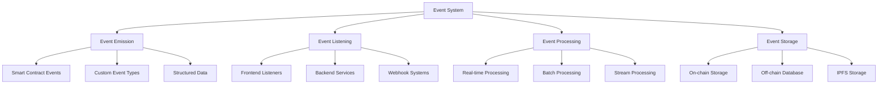

# บทที่ 10: Events and Monitoring

## 🎯 จุดประสงค์ของบทเรียน
- เรียนรู้การออกแบบ Event Systems ที่มีประสิทธิภาพ
- สร้าง Real-time Monitoring และ Analytics
- ทำความเข้าใจ Event Indexing และ Querying
- พัฒนา Notification และ Alert Systems

## 📡 Advanced Event Architecture

### **🔄 Event System Overview**



### **📊 Event Monitoring Contract**

```solidity
// contracts/monitoring/EventMonitor.sol
// SPDX-License-Identifier: MIT
pragma solidity ^0.8.19;

import "@openzeppelin/contracts/access/AccessControl.sol";
import "@openzeppelin/contracts/security/ReentrancyGuard.sol";
import "@openzeppelin/contracts/utils/Counters.sol";

/**
 * @title EventMonitor
 * @dev Comprehensive event monitoring and analytics system
 */
contract EventMonitor is AccessControl, ReentrancyGuard {
    using Counters for Counters.Counter;

    bytes32 public constant MONITOR_ADMIN_ROLE = keccak256("MONITOR_ADMIN_ROLE");
    bytes32 public constant EVENT_EMITTER_ROLE = keccak256("EVENT_EMITTER_ROLE");

    // Event categories
    enum EventCategory {
        USER_ACTION,
        SYSTEM_EVENT,
        SECURITY_EVENT,
        PERFORMANCE_EVENT,
        BUSINESS_EVENT,
        ERROR_EVENT
    }

    enum EventSeverity {
        LOW,
        MEDIUM,
        HIGH,
        CRITICAL
    }

    // Event structure
    struct MonitoredEvent {
        uint256 id;
        string eventType;
        EventCategory category;
        EventSeverity severity;
        address emitter;
        address target;
        bytes data;
        uint256 timestamp;
        uint256 blockNumber;
        string metadata;
        bool processed;
    }

    // Counters
    Counters.Counter private _eventIds;
    
    // Storage
    mapping(uint256 => MonitoredEvent) public events;
    mapping(string => uint256[]) public eventsByType;
    mapping(address => uint256[]) public eventsByEmitter;
    mapping(address => uint256[]) public eventsByTarget;
    mapping(EventCategory => uint256[]) public eventsByCategory;
    mapping(EventSeverity => uint256[]) public eventsBySeverity;
    
    // Time-based indexing
    mapping(uint256 => uint256[]) public eventsByDay; // timestamp => eventIds
    mapping(uint256 => uint256[]) public eventsByHour;
    
    // Statistics
    mapping(string => uint256) public eventTypeCount;
    mapping(EventCategory => uint256) public categoryCount;
    mapping(EventSeverity => uint256) public severityCount;
    mapping(address => uint256) public emitterCount;
    
    // Configuration
    mapping(string => bool) public monitoredEventTypes;
    mapping(address => bool) public monitoredAddresses;
    mapping(EventSeverity => bool) public alertEnabled;
    
    // Rate limiting
    mapping(address => mapping(uint256 => uint256)) public emitterRateLimit; // emitter => hour => count
    uint256 public maxEventsPerHour = 1000;
    
    // Event lifecycle
    uint256 public eventRetentionPeriod = 30 days;
    uint256 public lastCleanupTime;
    
    // Real-time alerts
    struct AlertRule {
        string eventType;
        EventSeverity minSeverity;
        uint256 threshold;
        uint256 timeWindow;
        bool enabled;
        address[] recipients;
    }
    
    mapping(uint256 => AlertRule) public alertRules;
    mapping(uint256 => uint256) public alertRuleCount; // timeWindow => count
    uint256 public totalAlertRules;
    
    // Events
    event EventRecorded(
        uint256 indexed eventId,
        string indexed eventType,
        EventCategory indexed category,
        address emitter,
        address target,
        EventSeverity severity
    );
    
    event AlertTriggered(
        uint256 indexed ruleId,
        string eventType,
        uint256 count,
        uint256 threshold,
        address[] recipients
    );
    
    event EventProcessed(uint256 indexed eventId, address processor);
    event AlertRuleCreated(uint256 indexed ruleId, string eventType, EventSeverity minSeverity);
    event EventTypeToggled(string eventType, bool monitored);
    event AddressMonitoringToggled(address addr, bool monitored);

    constructor() {
        _grantRole(DEFAULT_ADMIN_ROLE, msg.sender);
        _grantRole(MONITOR_ADMIN_ROLE, msg.sender);
        
        // Initialize default alert settings
        alertEnabled[EventSeverity.HIGH] = true;
        alertEnabled[EventSeverity.CRITICAL] = true;
        
        lastCleanupTime = block.timestamp;
    }

    // ============= EVENT RECORDING =============

    function recordEvent(
        string memory eventType,
        EventCategory category,
        EventSeverity severity,
        address target,
        bytes memory data,
        string memory metadata
    ) external onlyRole(EVENT_EMITTER_ROLE) nonReentrant {
        require(bytes(eventType).length > 0, "Event type required");
        require(monitoredEventTypes[eventType], "Event type not monitored");
        
        // Rate limiting check
        uint256 currentHour = block.timestamp / 1 hours;
        require(
            emitterRateLimit[msg.sender][currentHour] < maxEventsPerHour,
            "Rate limit exceeded"
        );
        
        _eventIds.increment();
        uint256 eventId = _eventIds.current();
        
        // Create event
        events[eventId] = MonitoredEvent({
            id: eventId,
            eventType: eventType,
            category: category,
            severity: severity,
            emitter: msg.sender,
            target: target,
            data: data,
            timestamp: block.timestamp,
            blockNumber: block.number,
            metadata: metadata,
            processed: false
        });
        
        // Update indices
        eventsByType[eventType].push(eventId);
        eventsByEmitter[msg.sender].push(eventId);
        if (target != address(0)) {
            eventsByTarget[target].push(eventId);
        }
        eventsByCategory[category].push(eventId);
        eventsBySeverity[severity].push(eventId);
        
        // Time-based indexing
        uint256 dayTimestamp = (block.timestamp / 1 days) * 1 days;
        uint256 hourTimestamp = (block.timestamp / 1 hours) * 1 hours;
        eventsByDay[dayTimestamp].push(eventId);
        eventsByHour[hourTimestamp].push(eventId);
        
        // Update statistics
        eventTypeCount[eventType]++;
        categoryCount[category]++;
        severityCount[severity]++;
        emitterCount[msg.sender]++;
        emitterRateLimit[msg.sender][currentHour]++;
        
        emit EventRecorded(eventId, eventType, category, msg.sender, target, severity);
        
        // Check alert rules
        _checkAlertRules(eventType, severity);
    }

    function recordEventBatch(
        string[] memory eventTypes,
        EventCategory[] memory categories,
        EventSeverity[] memory severities,
        address[] memory targets,
        bytes[] memory dataArray,
        string[] memory metadataArray
    ) external onlyRole(EVENT_EMITTER_ROLE) nonReentrant {
        require(eventTypes.length == categories.length, "Array length mismatch");
        require(eventTypes.length == severities.length, "Array length mismatch");
        require(eventTypes.length == targets.length, "Array length mismatch");
        require(eventTypes.length == dataArray.length, "Array length mismatch");
        require(eventTypes.length == metadataArray.length, "Array length mismatch");
        require(eventTypes.length <= 50, "Batch size too large");
        
        for (uint256 i = 0; i < eventTypes.length; i++) {
            if (monitoredEventTypes[eventTypes[i]]) {
                this.recordEvent(
                    eventTypes[i],
                    categories[i],
                    severities[i],
                    targets[i],
                    dataArray[i],
                    metadataArray[i]
                );
            }
        }
    }

    // ============= ALERT SYSTEM =============

    function createAlertRule(
        string memory eventType,
        EventSeverity minSeverity,
        uint256 threshold,
        uint256 timeWindow,
        address[] memory recipients
    ) external onlyRole(MONITOR_ADMIN_ROLE) returns (uint256) {
        require(bytes(eventType).length > 0, "Event type required");
        require(threshold > 0, "Threshold must be positive");
        require(timeWindow > 0, "Time window must be positive");
        require(recipients.length > 0, "Recipients required");
        
        uint256 ruleId = totalAlertRules++;
        
        alertRules[ruleId] = AlertRule({
            eventType: eventType,
            minSeverity: minSeverity,
            threshold: threshold,
            timeWindow: timeWindow,
            enabled: true,
            recipients: recipients
        });
        
        emit AlertRuleCreated(ruleId, eventType, minSeverity);
        return ruleId;
    }

    function _checkAlertRules(string memory eventType, EventSeverity severity) internal {
        for (uint256 i = 0; i < totalAlertRules; i++) {
            AlertRule storage rule = alertRules[i];
            
            if (!rule.enabled) continue;
            if (keccak256(bytes(rule.eventType)) != keccak256(bytes(eventType))) continue;
            if (severity < rule.minSeverity) continue;
            
            // Check if threshold is exceeded in time window
            uint256 windowStart = block.timestamp - rule.timeWindow;
            uint256 count = _countEventsInTimeWindow(eventType, windowStart, block.timestamp);
            
            if (count >= rule.threshold) {
                emit AlertTriggered(i, eventType, count, rule.threshold, rule.recipients);
                
                // Trigger external notifications if needed
                _triggerExternalAlerts(i, eventType, count);
            }
        }
    }

    function _countEventsInTimeWindow(
        string memory eventType,
        uint256 startTime,
        uint256 endTime
    ) internal view returns (uint256) {
        uint256[] memory typeEvents = eventsByType[eventType];
        uint256 count = 0;
        
        for (uint256 i = 0; i < typeEvents.length; i++) {
            uint256 eventTime = events[typeEvents[i]].timestamp;
            if (eventTime >= startTime && eventTime <= endTime) {
                count++;
            }
        }
        
        return count;
    }

    function _triggerExternalAlerts(
        uint256 ruleId,
        string memory eventType,
        uint256 count
    ) internal {
        // This would typically call external contracts or emit events
        // for external monitoring systems to pick up
        
        // For demonstration, we'll emit a special event
        emit AlertTriggered(ruleId, eventType, count, alertRules[ruleId].threshold, alertRules[ruleId].recipients);
    }

    // ============= EVENT PROCESSING =============

    function markEventProcessed(uint256 eventId) external onlyRole(MONITOR_ADMIN_ROLE) {
        require(eventId <= _eventIds.current(), "Event does not exist");
        require(!events[eventId].processed, "Event already processed");
        
        events[eventId].processed = true;
        emit EventProcessed(eventId, msg.sender);
    }

    function processEventsBatch(uint256[] memory eventIds) external onlyRole(MONITOR_ADMIN_ROLE) {
        require(eventIds.length <= 100, "Batch size too large");
        
        for (uint256 i = 0; i < eventIds.length; i++) {
            if (eventIds[i] <= _eventIds.current() && !events[eventIds[i]].processed) {
                events[eventIds[i]].processed = true;
                emit EventProcessed(eventIds[i], msg.sender);
            }
        }
    }

    // ============= CONFIGURATION =============

    function setEventTypeMonitoring(
        string memory eventType,
        bool monitored
    ) external onlyRole(MONITOR_ADMIN_ROLE) {
        monitoredEventTypes[eventType] = monitored;
        emit EventTypeToggled(eventType, monitored);
    }

    function setAddressMonitoring(
        address addr,
        bool monitored
    ) external onlyRole(MONITOR_ADMIN_ROLE) {
        monitoredAddresses[addr] = monitored;
        emit AddressMonitoringToggled(addr, monitored);
    }

    function setAlertEnabled(EventSeverity severity, bool enabled) external onlyRole(MONITOR_ADMIN_ROLE) {
        alertEnabled[severity] = enabled;
    }

    function setRateLimit(uint256 newLimit) external onlyRole(MONITOR_ADMIN_ROLE) {
        require(newLimit > 0, "Rate limit must be positive");
        maxEventsPerHour = newLimit;
    }

    function setRetentionPeriod(uint256 newPeriod) external onlyRole(MONITOR_ADMIN_ROLE) {
        require(newPeriod >= 1 days, "Retention period too short");
        eventRetentionPeriod = newPeriod;
    }

    // ============= DATA CLEANUP =============

    function cleanupOldEvents() external onlyRole(MONITOR_ADMIN_ROLE) {
        require(block.timestamp >= lastCleanupTime + 1 days, "Cleanup too frequent");
        
        uint256 cutoffTime = block.timestamp - eventRetentionPeriod;
        uint256 cleanedCount = 0;
        
        // This is a simplified cleanup - in production, you'd want more efficient methods
        for (uint256 i = 1; i <= _eventIds.current(); i++) {
            if (events[i].timestamp < cutoffTime && events[i].timestamp != 0) {
                delete events[i];
                cleanedCount++;
                
                if (cleanedCount >= 100) break; // Prevent gas limit issues
            }
        }
        
        lastCleanupTime = block.timestamp;
    }

    // ============= QUERY FUNCTIONS =============

    function getEvent(uint256 eventId) external view returns (MonitoredEvent memory) {
        require(eventId <= _eventIds.current(), "Event does not exist");
        return events[eventId];
    }

    function getEventsByType(
        string memory eventType,
        uint256 offset,
        uint256 limit
    ) external view returns (uint256[] memory) {
        return _paginateArray(eventsByType[eventType], offset, limit);
    }

    function getEventsByEmitter(
        address emitter,
        uint256 offset,
        uint256 limit
    ) external view returns (uint256[] memory) {
        return _paginateArray(eventsByEmitter[emitter], offset, limit);
    }

    function getEventsByCategory(
        EventCategory category,
        uint256 offset,
        uint256 limit
    ) external view returns (uint256[] memory) {
        return _paginateArray(eventsByCategory[category], offset, limit);
    }

    function getEventsBySeverity(
        EventSeverity severity,
        uint256 offset,
        uint256 limit
    ) external view returns (uint256[] memory) {
        return _paginateArray(eventsBySeverity[severity], offset, limit);
    }

    function getEventsByTimeRange(
        uint256 startTime,
        uint256 endTime,
        uint256 offset,
        uint256 limit
    ) external view returns (uint256[] memory) {
        require(startTime <= endTime, "Invalid time range");
        require(endTime <= block.timestamp, "End time in future");
        
        uint256[] memory result = new uint256[](limit);
        uint256 resultCount = 0;
        uint256 skipped = 0;
        
        // Search through time-indexed events
        for (uint256 day = (startTime / 1 days) * 1 days; day <= endTime && resultCount < limit; day += 1 days) {
            uint256[] memory dayEvents = eventsByDay[day];
            
            for (uint256 i = 0; i < dayEvents.length && resultCount < limit; i++) {
                uint256 eventId = dayEvents[i];
                MonitoredEvent memory evt = events[eventId];
                
                if (evt.timestamp >= startTime && evt.timestamp <= endTime) {
                    if (skipped >= offset) {
                        result[resultCount] = eventId;
                        resultCount++;
                    } else {
                        skipped++;
                    }
                }
            }
        }
        
        // Resize result array
        uint256[] memory finalResult = new uint256[](resultCount);
        for (uint256 i = 0; i < resultCount; i++) {
            finalResult[i] = result[i];
        }
        
        return finalResult;
    }

    function _paginateArray(
        uint256[] memory array,
        uint256 offset,
        uint256 limit
    ) internal pure returns (uint256[] memory) {
        if (offset >= array.length) {
            return new uint256[](0);
        }
        
        uint256 end = offset + limit;
        if (end > array.length) {
            end = array.length;
        }
        
        uint256[] memory result = new uint256[](end - offset);
        for (uint256 i = offset; i < end; i++) {
            result[i - offset] = array[array.length - 1 - i]; // Latest first
        }
        
        return result;
    }

    // ============= ANALYTICS =============

    function getEventStatistics() external view returns (
        uint256 totalEvents,
        uint256 processedEvents,
        uint256 pendingEvents,
        uint256 totalAlerts
    ) {
        totalEvents = _eventIds.current();
        
        // Count processed events
        for (uint256 i = 1; i <= totalEvents; i++) {
            if (events[i].processed) {
                processedEvents++;
            }
        }
        
        pendingEvents = totalEvents - processedEvents;
        totalAlerts = totalAlertRules;
    }

    function getCategoryStatistics() external view returns (
        uint256[] memory counts,
        EventCategory[] memory categories
    ) {
        categories = new EventCategory[](6);
        counts = new uint256[](6);
        
        categories[0] = EventCategory.USER_ACTION;
        categories[1] = EventCategory.SYSTEM_EVENT;
        categories[2] = EventCategory.SECURITY_EVENT;
        categories[3] = EventCategory.PERFORMANCE_EVENT;
        categories[4] = EventCategory.BUSINESS_EVENT;
        categories[5] = EventCategory.ERROR_EVENT;
        
        for (uint256 i = 0; i < 6; i++) {
            counts[i] = categoryCount[categories[i]];
        }
    }

    function getSeverityStatistics() external view returns (
        uint256[] memory counts,
        EventSeverity[] memory severities
    ) {
        severities = new EventSeverity[](4);
        counts = new uint256[](4);
        
        severities[0] = EventSeverity.LOW;
        severities[1] = EventSeverity.MEDIUM;
        severities[2] = EventSeverity.HIGH;
        severities[3] = EventSeverity.CRITICAL;
        
        for (uint256 i = 0; i < 4; i++) {
            counts[i] = severityCount[severities[i]];
        }
    }

    function getTopEmitters(uint256 limit) external view returns (
        address[] memory emitters,
        uint256[] memory counts
    ) {
        // This is a simplified implementation
        // In production, you'd want more efficient top-k algorithms
        
        emitters = new address[](limit);
        counts = new uint256[](limit);
        
        // This would require maintaining a sorted list of emitters
        // For now, we'll return empty arrays as a placeholder
        return (emitters, counts);
    }

    function getHourlyEventCounts(uint256 hours) external view returns (
        uint256[] memory timestamps,
        uint256[] memory counts
    ) {
        require(hours <= 168, "Max 7 days"); // Limit to 7 days
        
        timestamps = new uint256[](hours);
        counts = new uint256[](hours);
        
        uint256 currentHour = (block.timestamp / 1 hours) * 1 hours;
        
        for (uint256 i = 0; i < hours; i++) {
            uint256 hourTimestamp = currentHour - (i * 1 hours);
            timestamps[hours - 1 - i] = hourTimestamp;
            counts[hours - 1 - i] = eventsByHour[hourTimestamp].length;
        }
    }

    // ============= ADMIN FUNCTIONS =============

    function grantEmitterRole(address emitter) external onlyRole(MONITOR_ADMIN_ROLE) {
        _grantRole(EVENT_EMITTER_ROLE, emitter);
    }

    function revokeEmitterRole(address emitter) external onlyRole(MONITOR_ADMIN_ROLE) {
        _revokeRole(EVENT_EMITTER_ROLE, emitter);
    }

    function updateAlertRule(
        uint256 ruleId,
        uint256 threshold,
        uint256 timeWindow,
        bool enabled
    ) external onlyRole(MONITOR_ADMIN_ROLE) {
        require(ruleId < totalAlertRules, "Rule does not exist");
        
        AlertRule storage rule = alertRules[ruleId];
        rule.threshold = threshold;
        rule.timeWindow = timeWindow;
        rule.enabled = enabled;
    }

    function addAlertRecipient(uint256 ruleId, address recipient) external onlyRole(MONITOR_ADMIN_ROLE) {
        require(ruleId < totalAlertRules, "Rule does not exist");
        require(recipient != address(0), "Invalid recipient");
        
        alertRules[ruleId].recipients.push(recipient);
    }

    function emergencyStop() external onlyRole(DEFAULT_ADMIN_ROLE) {
        // Disable all monitoring temporarily
        maxEventsPerHour = 0;
    }

    function emergencyResume() external onlyRole(DEFAULT_ADMIN_ROLE) {
        // Resume normal operation
        maxEventsPerHour = 1000;
    }

    // ============= VIEW HELPERS =============

    function getCurrentEventId() external view returns (uint256) {
        return _eventIds.current();
    }

    function isEventTypeMonitored(string memory eventType) external view returns (bool) {
        return monitoredEventTypes[eventType];
    }

    function isAddressMonitored(address addr) external view returns (bool) {
        return monitoredAddresses[addr];
    }

    function getAlertRule(uint256 ruleId) external view returns (AlertRule memory) {
        require(ruleId < totalAlertRules, "Rule does not exist");
        return alertRules[ruleId];
    }
}
```

## 📊 Real-time Analytics Dashboard

### **📈 Analytics Contract**

```solidity
// contracts/monitoring/AnalyticsDashboard.sol
// SPDX-License-Identifier: MIT
pragma solidity ^0.8.19;

import "@openzeppelin/contracts/access/Ownable.sol";
import "./EventMonitor.sol";

/**
 * @title AnalyticsDashboard
 * @dev Real-time analytics and reporting system
 */
contract AnalyticsDashboard is Ownable {
    EventMonitor public immutable eventMonitor;
    
    // Analytics data structures
    struct MetricData {
        uint256 value;
        uint256 timestamp;
        uint256 blockNumber;
    }
    
    struct TrendData {
        uint256[] values;
        uint256[] timestamps;
        uint256 startTime;
        uint256 endTime;
        uint256 interval; // in seconds
    }
    
    // Metrics storage
    mapping(string => MetricData) public metrics;
    mapping(string => TrendData) public trends;
    mapping(string => bool) public trackedMetrics;
    
    // Performance metrics
    mapping(uint256 => uint256) public blockGasUsed; // blockNumber => gasUsed
    mapping(uint256 => uint256) public blockEventCount; // blockNumber => eventCount
    mapping(uint256 => uint256) public dailyActiveUsers; // day => userCount
    mapping(uint256 => uint256) public dailyTransactions; // day => txCount
    
    // Custom KPIs
    struct KPI {
        string name;
        string description;
        string formula; // Description of calculation
        uint256 value;
        uint256 target;
        uint256 lastUpdate;
        bool isActive;
    }
    
    mapping(uint256 => KPI) public kpis;
    uint256 public totalKPIs;
    
    // Events
    event MetricUpdated(string indexed metricName, uint256 value, uint256 timestamp);
    event TrendCalculated(string indexed trendName, uint256 dataPoints, uint256 startTime, uint256 endTime);
    event KPICreated(uint256 indexed kpiId, string name, uint256 target);
    event KPIUpdated(uint256 indexed kpiId, uint256 oldValue, uint256 newValue);
    event AlertThresholdExceeded(string metricName, uint256 value, uint256 threshold);

    constructor(address _eventMonitor) {
        require(_eventMonitor != address(0), "Invalid event monitor");
        eventMonitor = EventMonitor(_eventMonitor);
        
        // Initialize default metrics
        _initializeDefaultMetrics();
    }

    // ============= METRIC MANAGEMENT =============

    function updateMetric(
        string memory metricName,
        uint256 value
    ) external onlyOwner {
        require(bytes(metricName).length > 0, "Metric name required");
        
        metrics[metricName] = MetricData({
            value: value,
            timestamp: block.timestamp,
            blockNumber: block.number
        });
        
        trackedMetrics[metricName] = true;
        emit MetricUpdated(metricName, value, block.timestamp);
    }

    function updateMetricsBatch(
        string[] memory metricNames,
        uint256[] memory values
    ) external onlyOwner {
        require(metricNames.length == values.length, "Array length mismatch");
        require(metricNames.length <= 50, "Batch size too large");
        
        for (uint256 i = 0; i < metricNames.length; i++) {
            if (bytes(metricNames[i]).length > 0) {
                metrics[metricNames[i]] = MetricData({
                    value: values[i],
                    timestamp: block.timestamp,
                    blockNumber: block.number
                });
                
                trackedMetrics[metricNames[i]] = true;
                emit MetricUpdated(metricNames[i], values[i], block.timestamp);
            }
        }
    }

    function calculateTrend(
        string memory trendName,
        string memory metricName,
        uint256 startTime,
        uint256 endTime,
        uint256 interval
    ) external onlyOwner {
        require(bytes(trendName).length > 0, "Trend name required");
        require(trackedMetrics[metricName], "Metric not tracked");
        require(startTime < endTime, "Invalid time range");
        require(interval > 0, "Invalid interval");
        
        uint256 dataPoints = (endTime - startTime) / interval + 1;
        require(dataPoints <= 1000, "Too many data points");
        
        uint256[] memory values = new uint256[](dataPoints);
        uint256[] memory timestamps = new uint256[](dataPoints);
        
        // Calculate trend values (simplified - in practice you'd query historical data)
        for (uint256 i = 0; i < dataPoints; i++) {
            timestamps[i] = startTime + (i * interval);
            // This is a placeholder - you'd calculate actual historical values
            values[i] = _getHistoricalMetricValue(metricName, timestamps[i]);
        }
        
        trends[trendName] = TrendData({
            values: values,
            timestamps: timestamps,
            startTime: startTime,
            endTime: endTime,
            interval: interval
        });
        
        emit TrendCalculated(trendName, dataPoints, startTime, endTime);
    }

    function _getHistoricalMetricValue(
        string memory metricName,
        uint256 timestamp
    ) internal view returns (uint256) {
        // Placeholder implementation
        // In practice, you'd maintain historical data or query from events
        MetricData memory current = metrics[metricName];
        
        if (timestamp <= current.timestamp) {
            return current.value;
        }
        
        return 0;
    }

    // ============= KPI MANAGEMENT =============

    function createKPI(
        string memory name,
        string memory description,
        string memory formula,
        uint256 target
    ) external onlyOwner returns (uint256) {
        require(bytes(name).length > 0, "KPI name required");
        
        uint256 kpiId = totalKPIs++;
        
        kpis[kpiId] = KPI({
            name: name,
            description: description,
            formula: formula,
            value: 0,
            target: target,
            lastUpdate: block.timestamp,
            isActive: true
        });
        
        emit KPICreated(kpiId, name, target);
        return kpiId;
    }

    function updateKPI(uint256 kpiId, uint256 newValue) external onlyOwner {
        require(kpiId < totalKPIs, "KPI does not exist");
        require(kpis[kpiId].isActive, "KPI not active");
        
        uint256 oldValue = kpis[kpiId].value;
        kpis[kpiId].value = newValue;
        kpis[kpiId].lastUpdate = block.timestamp;
        
        emit KPIUpdated(kpiId, oldValue, newValue);
        
        // Check if target is met
        if (newValue >= kpis[kpiId].target) {
            // Emit success event or trigger rewards
        }
    }

    function setKPITarget(uint256 kpiId, uint256 newTarget) external onlyOwner {
        require(kpiId < totalKPIs, "KPI does not exist");
        kpis[kpiId].target = newTarget;
    }

    function toggleKPI(uint256 kpiId, bool active) external onlyOwner {
        require(kpiId < totalKPIs, "KPI does not exist");
        kpis[kpiId].isActive = active;
    }

    // ============= AUTOMATED CALCULATIONS =============

    function calculateUserEngagement() external view returns (uint256) {
        // Calculate based on events from EventMonitor
        try eventMonitor.getEventStatistics() returns (
            uint256 totalEvents,
            uint256 processedEvents,
            uint256 pendingEvents,
            uint256 totalAlerts
        ) {
            // Simple engagement score based on event activity
            return totalEvents > 0 ? (processedEvents * 100) / totalEvents : 0;
        } catch {
            return 0;
        }
    }

    function calculateSystemHealth() external view returns (uint256) {
        // Calculate system health score (0-100)
        uint256 healthScore = 100;
        
        // Check error rate
        try eventMonitor.getSeverityStatistics() returns (
            uint256[] memory counts,
            EventMonitor.EventSeverity[] memory severities
        ) {
            uint256 totalEvents = 0;
            uint256 errorEvents = 0;
            
            for (uint256 i = 0; i < counts.length; i++) {
                totalEvents += counts[i];
                if (severities[i] == EventMonitor.EventSeverity.HIGH || 
                    severities[i] == EventMonitor.EventSeverity.CRITICAL) {
                    errorEvents += counts[i];
                }
            }
            
            if (totalEvents > 0) {
                uint256 errorRate = (errorEvents * 100) / totalEvents;
                if (errorRate > 10) healthScore -= 30; // High error rate
                else if (errorRate > 5) healthScore -= 15; // Medium error rate
            }
        } catch {
            healthScore -= 20; // Penalty for monitoring system issues
        }
        
        return healthScore;
    }

    function calculatePerformanceScore() external view returns (uint256) {
        // Calculate performance based on gas usage and block times
        uint256 currentBlock = block.number;
        uint256 recentBlocks = 100;
        uint256 totalGas = 0;
        uint256 blockCount = 0;
        
        for (uint256 i = 0; i < recentBlocks && currentBlock > i; i++) {
            uint256 blockNum = currentBlock - i;
            uint256 gasUsed = blockGasUsed[blockNum];
            
            if (gasUsed > 0) {
                totalGas += gasUsed;
                blockCount++;
            }
        }
        
        if (blockCount == 0) return 50; // Neutral score if no data
        
        uint256 avgGasPerBlock = totalGas / blockCount;
        uint256 maxGasPerBlock = 30000000; // 30M gas limit assumption
        
        // Performance score: 100 - (avgGas / maxGas * 100)
        return avgGasPerBlock < maxGasPerBlock ? 
            100 - ((avgGasPerBlock * 100) / maxGasPerBlock) : 0;
    }

    // ============= REPORTING =============

    function generateDailyReport(uint256 targetDay) external view returns (
        uint256 totalEvents,
        uint256 activeUsers,
        uint256 transactions,
        uint256 avgResponseTime,
        uint256 errorRate,
        uint256 systemHealth
    ) {
        // Get events for the day
        uint256 dayStart = targetDay * 1 days;
        uint256 dayEnd = dayStart + 1 days;
        
        activeUsers = dailyActiveUsers[targetDay];
        transactions = dailyTransactions[targetDay];
        
        // Calculate other metrics based on events
        try eventMonitor.getEventsByTimeRange(dayStart, dayEnd, 0, 1000) returns (
            uint256[] memory eventIds
        ) {
            totalEvents = eventIds.length;
            
            // Calculate error rate and other metrics from events
            uint256 errors = 0;
            uint256 totalResponseTime = 0;
            uint256 responseTimeCount = 0;
            
            for (uint256 i = 0; i < eventIds.length && i < 100; i++) {
                try eventMonitor.getEvent(eventIds[i]) returns (
                    EventMonitor.MonitoredEvent memory evt
                ) {
                    if (evt.severity == EventMonitor.EventSeverity.HIGH || 
                        evt.severity == EventMonitor.EventSeverity.CRITICAL) {
                        errors++;
                    }
                    
                    // Extract response time from metadata if available
                    // This is a simplified approach
                    responseTimeCount++;
                } catch {}
            }
            
            errorRate = totalEvents > 0 ? (errors * 100) / totalEvents : 0;
            avgResponseTime = responseTimeCount > 0 ? totalResponseTime / responseTimeCount : 0;
        } catch {
            totalEvents = 0;
            errorRate = 0;
            avgResponseTime = 0;
        }
        
        systemHealth = this.calculateSystemHealth();
    }

    function generateWeeklyReport(uint256 weekStart) external view returns (
        uint256[] memory dailyEvents,
        uint256[] memory dailyUsers,
        uint256[] memory dailyTransactions,
        uint256 weeklyGrowth,
        uint256 avgSystemHealth
    ) {
        dailyEvents = new uint256[](7);
        dailyUsers = new uint256[](7);
        dailyTransactions = new uint256[](7);
        
        uint256 totalHealthScore = 0;
        uint256 firstWeekTotal = 0;
        uint256 secondWeekTotal = 0;
        
        for (uint256 i = 0; i < 7; i++) {
            uint256 day = weekStart + i;
            
            (dailyEvents[i], dailyUsers[i], dailyTransactions[i], , , uint256 health) = 
                this.generateDailyReport(day);
            
            totalHealthScore += health;
            
            if (i < 4) {
                firstWeekTotal += dailyEvents[i];
            } else {
                secondWeekTotal += dailyEvents[i];
            }
        }
        
        avgSystemHealth = totalHealthScore / 7;
        
        // Calculate weekly growth
        if (firstWeekTotal > 0) {
            weeklyGrowth = secondWeekTotal > firstWeekTotal ? 
                ((secondWeekTotal - firstWeekTotal) * 100) / firstWeekTotal : 0;
        }
    }

    // ============= REAL-TIME MONITORING =============

    function getRealtimeMetrics() external view returns (
        uint256 currentBlockNumber,
        uint256 currentTimestamp,
        uint256 recentEventCount,
        uint256 systemHealthScore,
        uint256 performanceScore,
        uint256 userEngagementScore
    ) {
        currentBlockNumber = block.number;
        currentTimestamp = block.timestamp;
        
        // Get events from last hour
        uint256 hourAgo = block.timestamp - 1 hours;
        try eventMonitor.getEventsByTimeRange(hourAgo, block.timestamp, 0, 1000) returns (
            uint256[] memory eventIds
        ) {
            recentEventCount = eventIds.length;
        } catch {
            recentEventCount = 0;
        }
        
        systemHealthScore = this.calculateSystemHealth();
        performanceScore = this.calculatePerformanceScore();
        userEngagementScore = this.calculateUserEngagement();
    }

    function getAlertSummary() external view returns (
        uint256 criticalAlerts,
        uint256 highAlerts,
        uint256 mediumAlerts,
        uint256 lowAlerts
    ) {
        try eventMonitor.getSeverityStatistics() returns (
            uint256[] memory counts,
            EventMonitor.EventSeverity[] memory severities
        ) {
            for (uint256 i = 0; i < counts.length; i++) {
                if (severities[i] == EventMonitor.EventSeverity.CRITICAL) {
                    criticalAlerts = counts[i];
                } else if (severities[i] == EventMonitor.EventSeverity.HIGH) {
                    highAlerts = counts[i];
                } else if (severities[i] == EventMonitor.EventSeverity.MEDIUM) {
                    mediumAlerts = counts[i];
                } else if (severities[i] == EventMonitor.EventSeverity.LOW) {
                    lowAlerts = counts[i];
                }
            }
        } catch {
            // Return zeros if event monitor is not accessible
        }
    }

    // ============= HELPER FUNCTIONS =============

    function _initializeDefaultMetrics() internal {
        // Initialize common metrics
        string[] memory defaultMetrics = new string[](10);
        defaultMetrics[0] = "total_users";
        defaultMetrics[1] = "daily_active_users";
        defaultMetrics[2] = "total_transactions";
        defaultMetrics[3] = "avg_response_time";
        defaultMetrics[4] = "error_rate";
        defaultMetrics[5] = "system_health";
        defaultMetrics[6] = "user_engagement";
        defaultMetrics[7] = "performance_score";
        defaultMetrics[8] = "total_volume";
        defaultMetrics[9] = "network_utilization";
        
        for (uint256 i = 0; i < defaultMetrics.length; i++) {
            trackedMetrics[defaultMetrics[i]] = true;
            metrics[defaultMetrics[i]] = MetricData({
                value: 0,
                timestamp: block.timestamp,
                blockNumber: block.number
            });
        }
    }

    function updateBlockMetrics(uint256 blockNumber, uint256 gasUsed, uint256 eventCount) external onlyOwner {
        blockGasUsed[blockNumber] = gasUsed;
        blockEventCount[blockNumber] = eventCount;
    }

    function updateDailyMetrics(uint256 day, uint256 activeUsers, uint256 transactions) external onlyOwner {
        dailyActiveUsers[day] = activeUsers;
        dailyTransactions[day] = transactions;
    }

    // ============= VIEW FUNCTIONS =============

    function getMetric(string memory metricName) external view returns (MetricData memory) {
        return metrics[metricName];
    }

    function getTrend(string memory trendName) external view returns (TrendData memory) {
        return trends[trendName];
    }

    function getKPI(uint256 kpiId) external view returns (KPI memory) {
        require(kpiId < totalKPIs, "KPI does not exist");
        return kpis[kpiId];
    }

    function getAllKPIs() external view returns (KPI[] memory) {
        KPI[] memory allKPIs = new KPI[](totalKPIs);
        
        for (uint256 i = 0; i < totalKPIs; i++) {
            allKPIs[i] = kpis[i];
        }
        
        return allKPIs;
    }

    function isMetricTracked(string memory metricName) external view returns (bool) {
        return trackedMetrics[metricName];
    }
}
```

## 🎯 แบบฝึกหัด

### **📝 แบบฝึกหัดที่ 1: Custom Event System**
สร้าง event monitoring system สำหรับ:
1. User behavior tracking
2. Performance monitoring
3. Security event detection

### **🔧 แบบฝึกหัดที่ 2: Real-time Dashboard**
พัฒนา:
1. WebSocket integration for real-time updates
2. Custom alert triggers
3. Data visualization components

### **🎯 แบบฝึกหัดที่ 3: Analytics Integration**
สร้าง:
1. External analytics API integration
2. Data export mechanisms
3. Historical data analysis

## 🔗 การเชื่อมต่อ

**บทก่อนหน้า**: [บทที่ 9: Multi-Contract Systems](./09-multi-contract-systems.md)  
**บทถัดไป**: [บทที่ 11: Gas Optimization](./11-gas-optimization.md)

**กลับไปหน้าหลัก**: [README](./README.md)

---

## 📚 เอกสารอ้างอิง

- [Ethereum Event Logs](https://ethereum.org/en/developers/docs/smart-contracts/anatomy/#events-and-logs)
- [Web3.js Event Handling](https://web3js.readthedocs.io/en/v1.8.0/web3-eth-contract.html#events)
- [The Graph Protocol](https://thegraph.com/docs/)
- [Monitoring Smart Contracts](https://consensys.github.io/smart-contract-best-practices/development-recommendations/solidity-specific/event-monitoring/)

---

ตอนนี้คุณเข้าใจ Events and Monitoring แล้ว! ในบทถัดไป เราจะเรียนรู้เรื่อง Gas Optimization 🚀
