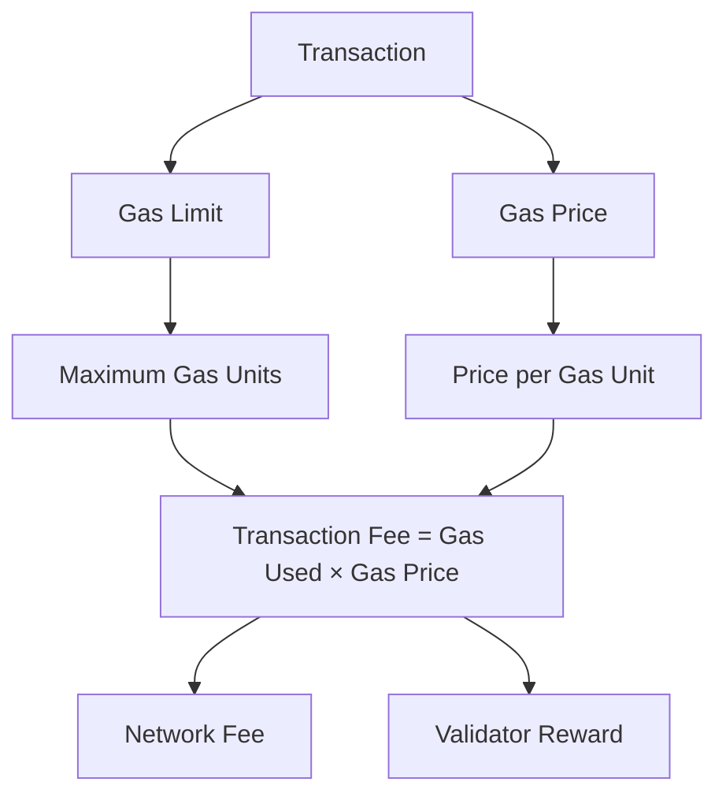

# บทที่ 11: Gas Optimization

## 🎯 จุดประสงค์ของบทเรียน
- เข้าใจกลไกการใช้ Gas ใน EVM และ Taraxa Network
- เรียนรู้เทคนิคการปรับปรุง Smart Contract เพื่อประหยัด Gas
- วิเคราะห์และ optimize การใช้ storage และ memory
- ใช้เครื่องมือวิเคราะห์ Gas อย่างมีประสิทธิภาพ

## ⚡ Gas Fundamentals

### **🔥 Gas ใน Taraxa Network**



**การทำงานของ Gas:**
- **Gas Limit**: จำนวน gas สูงสุดที่ธุรกรรมใช้ได้
- **Gas Price**: ราคาต่อหน่วย gas (ใน wei)
- **Gas Used**: จำนวน gas ที่ใช้จริง
- **Transaction Fee**: Gas Used × Gas Price

### **📊 Gas Cost ของคำสั่งต่างๆ**

| Operation | Gas Cost | คำอธิบาย |
|-----------|----------|----------|
| SSTORE (new) | 20,000 | เขียนข้อมูลใหม่ลง storage |
| SSTORE (update) | 5,000 | อัปเดตข้อมูลใน storage |
| SLOAD | 2,100 | อ่านข้อมูลจาก storage |
| MSTORE | 3 | เขียนข้อมูลลง memory |
| MLOAD | 3 | อ่านข้อมูลจาก memory |
| CALL | 2,300+ | เรียกใช้ contract อื่น |
| CREATE | 32,000 | สร้าง contract ใหม่ |

| CALL | 2,300+ | เรียกใช้ contract อื่น |
| CREATE | 32,000 | สร้าง contract ใหม่ |

## 🛠️ เทคนิคการ Optimize Gas

### **1. Storage Optimization**

```solidity
// ❌ ไม่ประหยัด Gas
contract BadStorage {
    uint256 public value1;
    uint256 public value2;
    uint256 public value3;
    
    function updateValues(uint256 _v1, uint256 _v2, uint256 _v3) external {
        value1 = _v1;  // 3 SSTORE operations
        value2 = _v2;
        value3 = _v3;
    }
}

// ✅ ประหยัด Gas
contract GoodStorage {
    struct Values {
        uint256 value1;
        uint256 value2;
        uint256 value3;
    }
    
    Values public values;
    
    function updateValues(uint256 _v1, uint256 _v2, uint256 _v3) external {
        Values memory temp = Values(_v1, _v2, _v3);
        values = temp;  // 1 SSTORE operation
    }
}
```

### **2. Variable Packing**

```solidity
// ❌ ใช้ 3 storage slots
contract BadPacking {
    uint256 value1;    // slot 0
    uint128 value2;    // slot 1  
    uint128 value3;    // slot 2
}

// ✅ ใช้ 2 storage slots
contract GoodPacking {
    uint256 value1;    // slot 0
    uint128 value2;    // slot 1 (first half)
    uint128 value3;    // slot 1 (second half)
}
```

### **3. Memory vs Storage**

```solidity
contract MemoryOptimization {
    struct User {
        string name;
        uint256 age;
        address wallet;
    }
    
    mapping(uint256 => User) public users;
    
    // ❌ ไม่ประหยัด - อ่าน storage หลายครั้ง
    function getUserInfoBad(uint256 userId) external view returns (string memory, uint256, address) {
        return (users[userId].name, users[userId].age, users[userId].wallet);
    }
    
    // ✅ ประหยัด - อ่าน storage ครั้งเดียว
    function getUserInfoGood(uint256 userId) external view returns (string memory, uint256, address) {
        User memory user = users[userId];
        return (user.name, user.age, user.wallet);
    }
}
```

### **4. Loop Optimization**

```solidity
contract LoopOptimization {
    uint256[] public numbers;
    
    // ❌ ไม่ประหยัด
    function sumBad() external view returns (uint256) {
        uint256 total = 0;
        for (uint256 i = 0; i < numbers.length; i++) {
            total += numbers[i];  // อ่าน length ทุกรอบ
        }
        return total;
    }
    
    // ✅ ประหยัด
    function sumGood() external view returns (uint256) {
        uint256 total = 0;
        uint256 length = numbers.length;  // cache length
        for (uint256 i = 0; i < length;) {
            total += numbers[i];
            unchecked { ++i; }  // ประหยัด overflow check
        }
        return total;
    }
}
```

### **5. Custom Errors**

```solidity
contract ErrorOptimization {
    uint256 public maxSupply = 1000;
    uint256 public totalSupply;
    
    // Custom errors
    error InsufficientAmount();
    error ExceedsMaxSupply();
    error ZeroAddress();
    
    // ❌ ไม่ประหยัด - string ใช้ gas เยอะ
    function mintBad(uint256 amount) external {
        require(amount > 0, "Amount must be greater than zero");
        require(totalSupply + amount <= maxSupply, "Exceeds maximum supply");
    }
    
    // ✅ ประหยัด - custom error
    function mintGood(uint256 amount) external {
        if (amount == 0) revert InsufficientAmount();
        if (totalSupply + amount > maxSupply) revert ExceedsMaxSupply();
        
        totalSupply += amount;
    }
}
```

### **6. Constants และ Immutable**

```solidity
contract ConstantOptimization {
    // ❌ ใช้ storage slot
    uint256 public fee = 100;
    address public owner = 0x123...;
    
    // ✅ ไม่ใช้ storage
    uint256 public constant FEE = 100;
    address public immutable OWNER;
    
    constructor() {
        OWNER = msg.sender;
    }
}
```

## 📊 Advanced Gas Optimization

### **🔄 Batch Operations**

```solidity
// contracts/optimization/BatchProcessor.sol
// SPDX-License-Identifier: MIT
pragma solidity ^0.8.19;

contract BatchProcessor {
    mapping(address => uint256) public balances;
    mapping(address => bool) public whitelist;
    
    event BatchTransfer(address indexed from, uint256 totalAmount, uint256 recipientCount);
    event BatchWhitelist(uint256 addressCount, bool status);
    
    // ✅ Batch transfer - ประหยัดกว่าเรียกทีละครั้ง
    function batchTransfer(
        address[] calldata recipients,
        uint256[] calldata amounts
    ) external {
        require(recipients.length == amounts.length, "Array length mismatch");
        require(recipients.length <= 200, "Too many recipients");
        
        uint256 totalAmount = 0;
        uint256 senderBalance = balances[msg.sender];
        
        // คำนวณ total ก่อนดำเนินการ
        for (uint256 i = 0; i < recipients.length;) {
            totalAmount += amounts[i];
            unchecked { ++i; }
        }
        
        require(senderBalance >= totalAmount, "Insufficient balance");
        
        // อัปเดตยอดเงินครั้งเดียว
        balances[msg.sender] = senderBalance - totalAmount;
        
        // Transfer ให้ recipients
        for (uint256 i = 0; i < recipients.length;) {
            balances[recipients[i]] += amounts[i];
            unchecked { ++i; }
        }
        
        emit BatchTransfer(msg.sender, totalAmount, recipients.length);
    }
    
    // ✅ Batch whitelist update
    function updateWhitelistBatch(
        address[] calldata addresses,
        bool status
    ) external {
        require(addresses.length <= 100, "Too many addresses");
        
        for (uint256 i = 0; i < addresses.length;) {
            whitelist[addresses[i]] = status;
            unchecked { ++i; }
        }
        
        emit BatchWhitelist(addresses.length, status);
    }
}
```

### **🎯 Efficient Data Structures**

```solidity
// contracts/optimization/EfficientStructures.sol
// SPDX-License-Identifier: MIT
pragma solidity ^0.8.19;

contract EfficientStructures {
    // ✅ Packed struct - ใช้ 2 slots แทน 4
    struct PackedUser {
        uint128 balance;      // slot 0 (first half)
        uint64 timestamp;     // slot 0 (second half, partial)
        uint32 score;         // slot 0 (second half, partial)
        uint32 level;         // slot 0 (second half, remaining)
        address wallet;       // slot 1
    }
    
    // ❌ Unpacked struct - ใช้ 4 slots
    struct UnpackedUser {
        uint256 balance;      // slot 0
        uint256 timestamp;    // slot 1
        uint256 score;        // slot 2
        address wallet;       // slot 3
    }
    
    mapping(uint256 => PackedUser) public users;
    
    // ✅ Efficient enum usage
    enum Status { PENDING, ACTIVE, SUSPENDED, BANNED }
    
    // ✅ Bit manipulation for flags
    uint256 private flags;
    
    function setFlag(uint256 position, bool value) external {
        if (value) {
            flags |= (1 << position);    // Set bit
        } else {
            flags &= ~(1 << position);   // Clear bit
        }
    }
    
    function getFlag(uint256 position) external view returns (bool) {
        return (flags >> position) & 1 == 1;
    }
}
```

### **⚡ Assembly Optimization**

```solidity
// contracts/optimization/AssemblyOptimized.sol
// SPDX-License-Identifier: MIT
pragma solidity ^0.8.19;

contract AssemblyOptimized {
    // ✅ Assembly สำหรับการคำนวณซับซ้อน
    function efficientHash(bytes memory data) external pure returns (bytes32) {
        bytes32 result;
        assembly {
            result := keccak256(add(data, 0x20), mload(data))
        }
        return result;
    }
    
    // ✅ Assembly สำหรับ memory operations
    function copyBytes(bytes memory source, uint256 start, uint256 length) 
        external 
        pure 
        returns (bytes memory) 
    {
        bytes memory result = new bytes(length);
        
        assembly {
            let src := add(add(source, 0x20), start)
            let dst := add(result, 0x20)
            
            // Copy data efficiently
            for { let i := 0 } lt(i, length) { i := add(i, 32) } {
                mstore(add(dst, i), mload(add(src, i)))
            }
        }
        
        return result;
    }
    
    // ✅ Efficient balance check
    function getBalance(address account) external view returns (uint256 balance) {
        assembly {
            balance := balance(account)
        }
    }
}
```

## 🧪 Gas Analysis Tools

### **📈 Hardhat Gas Reporter Setup**

```javascript
// hardhat.config.js
require("hardhat-gas-reporter");

module.exports = {
  solidity: "0.8.19",
  gasReporter: {
    enabled: true,
    currency: "USD",
    gasPrice: 20,
    coinmarketcap: "YOUR_CMC_API_KEY",
    outputFile: "gas-report.txt",
    noColors: true
  }
};
```

### **🔍 Gas Benchmark Test**

```javascript
// test/gas-optimization.test.js
const { expect } = require("chai");
const { ethers } = require("hardhat");

describe("Gas Optimization Tests", function() {
    let optimized, unoptimized;
    
    beforeEach(async function() {
        const OptimizedContract = await ethers.getContractFactory("GasOptimized");
        const UnoptimizedContract = await ethers.getContractFactory("GasUnoptimized");
        
        optimized = await OptimizedContract.deploy();
        unoptimized = await UnoptimizedContract.deploy();
    });
    
    it("Should use less gas for batch operations", async function() {
        const recipients = [
            "0x1234567890123456789012345678901234567890",
            "0x2345678901234567890123456789012345678901",
            "0x3456789012345678901234567890123456789012"
        ];
        const amounts = [100, 200, 300];
        
        // Test optimized version
        const tx1 = await optimized.batchTransfer(recipients, amounts);
        const receipt1 = await tx1.wait();
        
        // Test unoptimized version (individual transfers)
        const tx2 = await unoptimized.transfer(recipients[0], amounts[0]);
        const tx3 = await unoptimized.transfer(recipients[1], amounts[1]);
        const tx4 = await unoptimized.transfer(recipients[2], amounts[2]);
        
        const receipt2 = await tx2.wait();
        const receipt3 = await tx3.wait();
        const receipt4 = await tx4.wait();
        
        const batchGas = receipt1.gasUsed;
        const individualGas = receipt2.gasUsed.add(receipt3.gasUsed).add(receipt4.gasUsed);
        
        console.log(`Batch Gas: ${batchGas}`);
        console.log(`Individual Gas: ${individualGas}`);
        console.log(`Savings: ${individualGas.sub(batchGas)} gas`);
        
        expect(batchGas).to.be.lt(individualGas);
    });
});
```

### **📊 Gas Profiling Contract**

```solidity
// contracts/tools/GasProfiler.sol
// SPDX-License-Identifier: MIT
pragma solidity ^0.8.19;

contract GasProfiler {
    event GasUsed(string operation, uint256 gasUsed);
    
    modifier measureGas(string memory operation) {
        uint256 gasStart = gasleft();
        _;
        uint256 gasEnd = gasleft();
        emit GasUsed(operation, gasStart - gasEnd);
    }
    
    mapping(address => uint256) public balances;
    uint256[] public numbers;
    
    function testStorageWrite() external measureGas("storage_write") {
        balances[msg.sender] = 1000;
    }
    
    function testStorageRead() external view measureGas("storage_read") {
        uint256 balance = balances[msg.sender];
        // Prevent optimization
        require(balance >= 0, "");
    }
    
    function testArrayPush() external measureGas("array_push") {
        numbers.push(block.timestamp);
    }
    
    function testLoop(uint256 iterations) external measureGas("loop") {
        for (uint256 i = 0; i < iterations;) {
            unchecked { ++i; }
        }
    }
}
```

## 🎯 Taraxa-Specific Optimizations

### **🌟 Taraxa Network Features**

```solidity
// contracts/taraxa/TaraxaOptimized.sol
// SPDX-License-Identifier: MIT
pragma solidity ^0.8.19;

contract TaraxaOptimized {
    // ✅ ใช้ประโยชน์จาก Taraxa's low gas costs
    mapping(address => uint256[]) public userTransactions;
    mapping(address => mapping(uint256 => bool)) public transactionExists;
    
    event TransactionRecorded(
        address indexed user,
        uint256 indexed txId,
        uint256 amount,
        uint256 timestamp
    );
    
    // เก็บประวัติธุรกรรมแบบละเอียด (เหมาะกับ low gas cost)
    function recordTransaction(
        uint256 txId,
        uint256 amount,
        string calldata description,
        bytes calldata metadata
    ) external {
        require(!transactionExists[msg.sender][txId], "Transaction exists");
        
        userTransactions[msg.sender].push(txId);
        transactionExists[msg.sender][txId] = true;
        
        emit TransactionRecorded(msg.sender, txId, amount, block.timestamp);
        
        // เก็บข้อมูลเพิ่มเติมใน event log (ถูกกว่า storage)
        emit DetailedTransaction(msg.sender, txId, description, metadata);
    }
    
    event DetailedTransaction(
        address indexed user,
        uint256 indexed txId,
        string description,
        bytes metadata
    );
    
    // ✅ Batch verification เหมาะกับ PBFT consensus
    function batchVerifyTransactions(
        address[] calldata users,
        uint256[] calldata txIds
    ) external view returns (bool[] memory results) {
        require(users.length == txIds.length, "Array length mismatch");
        
        results = new bool[](users.length);
        
        for (uint256 i = 0; i < users.length;) {
            results[i] = transactionExists[users[i]][txIds[i]];
            unchecked { ++i; }
        }
        
        return results;
    }
}
```

        return results;
    }
}
```

## 💡 Best Practices สำหรับ Gas Optimization

### **🎯 การออกแบบ Smart Contract**

1. **วางแผน Storage Layout**
   ```solidity
   // ✅ จัดกลุม variables ตาม type และ access pattern
   contract WellDesigned {
       // Group 1: Configuration (rarely changed)
       address public immutable owner;
       uint256 public constant MAX_SUPPLY = 10000;
       
       // Group 2: State variables (frequently accessed together)
       uint256 public totalSupply;
       uint256 public currentPrice;
       
       // Group 3: User data
       mapping(address => uint256) public balances;
       mapping(address => mapping(address => uint256)) public allowances;
   }
   ```

2. **ใช้ Events อย่างชาญฉลาด**
   ```solidity
   contract EventOptimized {
       // ✅ ใช้ indexed parameters สำหรับ filtering
       event Transfer(
           address indexed from,
           address indexed to,
           uint256 value
       );
       
       // ✅ เก็บข้อมูลละเอียดใน event แทน storage
       event DetailedLog(
           address indexed user,
           string action,
           bytes data
       );
   }
   ```

### **⚡ การใช้ Modifiers อย่างมีประสิทธิภาพ**

```solidity
contract ModifierOptimization {
    address public owner;
    mapping(address => bool) public authorized;
    
    // ✅ Efficient modifier
    modifier onlyAuthorized() {
        require(authorized[msg.sender] || msg.sender == owner, "Unauthorized");
        _;
    }
    
    // ❌ Inefficient - multiple storage reads
    modifier inefficientAuth() {
        require(authorized[msg.sender], "Not authorized");
        require(msg.sender != address(0), "Zero address");
        require(owner != address(0), "No owner");
        _;
    }
}
```

## 🔧 Development Workflow

### **📋 Gas Optimization Checklist**

```markdown
## Pre-Development
- [ ] Plan storage layout
- [ ] Choose appropriate data types
- [ ] Design for batch operations

## During Development
- [ ] Use constants and immutable variables
- [ ] Implement custom errors
- [ ] Optimize loops and iterations
- [ ] Minimize external calls

## Testing Phase
- [ ] Run gas reporter
- [ ] Profile critical functions
- [ ] Compare optimization alternatives
- [ ] Test with realistic data sizes

## Pre-Deployment
- [ ] Final gas analysis
- [ ] Security audit with gas considerations
- [ ] Mainnet cost estimation
```

### **🛠️ Hardhat Gas Optimization Setup**

```javascript
// hardhat.config.js
require("@nomiclabs/hardhat-waffle");
require("hardhat-gas-reporter");
require("@nomiclabs/hardhat-etherscan");

module.exports = {
  solidity: {
    version: "0.8.19",
    settings: {
      optimizer: {
        enabled: true,
        runs: 200
      }
    }
  },
  gasReporter: {
    enabled: process.env.REPORT_GAS !== undefined,
    currency: "USD",
    gasPrice: 20,
    coinmarketcap: process.env.COINMARKETCAP_API_KEY,
    token: "ETH",
    gasPriceApi: "https://api.etherscan.io/api?module=proxy&action=eth_gasPrice",
    showTimeSpent: true,
    showMethodSig: true,
    maxMethodDiff: 10
  },
  networks: {
    taraxa_testnet: {
      url: "https://rpc.testnet.taraxa.io/",
      accounts: [process.env.PRIVATE_KEY],
      gasPrice: 1000000000 // 1 gwei
    },
    taraxa_mainnet: {
      url: "https://rpc.mainnet.taraxa.io/",
      accounts: [process.env.PRIVATE_KEY],
      gasPrice: 1000000000 // 1 gwei
    }
  }
};
```

### **📊 Gas Monitoring Script**

```javascript
// scripts/gas-monitor.js
const { ethers } = require("hardhat");

async function monitorGasUsage() {
    const [deployer] = await ethers.getSigners();
    
    console.log("=== Gas Usage Monitoring ===");
    console.log("Account:", deployer.address);
    console.log("Balance:", ethers.utils.formatEther(await deployer.getBalance()));
    
    // Deploy contracts and measure gas
    const contracts = [
        "GasOptimized",
        "BatchProcessor", 
        "EfficientStructures"
    ];
    
    for (const contractName of contracts) {
        console.log(`\n--- ${contractName} ---`);
        
        const Contract = await ethers.getContractFactory(contractName);
        const deployTx = await Contract.getDeployTransaction();
        
        const estimatedGas = await deployer.estimateGas(deployTx);
        console.log(`Estimated deployment gas: ${estimatedGas}`);
        
        const contract = await Contract.deploy();
        const receipt = await contract.deployTransaction.wait();
        
        console.log(`Actual deployment gas: ${receipt.gasUsed}`);
        console.log(`Gas efficiency: ${((estimatedGas - receipt.gasUsed) / estimatedGas * 100).toFixed(2)}%`);
    }
}

monitorGasUsage()
    .then(() => process.exit(0))
    .catch((error) => {
        console.error(error);
        process.exit(1);
    });
```

## 📋 แบบฝึกหัดและโปรเจกต์

### **🎯 แบบฝึกหัดที่ 1: Storage Optimization**
```solidity
// ปรับปรุงโค้ดนี้ให้ประหยัด gas
contract ToOptimize {
    uint256 public value1;
    uint256 public value2;
    uint256 public value3;
    address public owner;
    bool public isActive;
    
    function updateAll(
        uint256 _v1,
        uint256 _v2,
        uint256 _v3,
        bool _active
    ) external {
        value1 = _v1;
        value2 = _v2;
        value3 = _v3;
        isActive = _active;
    }
}
```

### **🔧 แบบฝึกหัดที่ 2: Loop Optimization**
สร้างฟังก์ชันที่ประหยัด gas สำหรับ:
1. หาค่าเฉลี่ยของ array
2. นับจำนวนเลขคู่ใน array
3. หาค่าสูงสุดและต่ำสุด

### **🎯 แบบฝึกหัดที่ 3: Complete Optimization**
ปรับปรุง ERC-20 token contract ให้ประหยัด gas:
- Batch transfers
- Efficient allowance management
- Optimized events
- Gas-efficient minting/burning

### **📊 โปรเจกต์: Gas Analytics Dashboard**
สร้าง dashboard สำหรับติดตาม:
1. Gas usage trends
2. Function-level gas consumption
3. Optimization recommendations
4. Cost comparison tools

## 🧪 Advanced Techniques

### **🔄 Assembly Optimizations**

```solidity
library AssemblyUtils {
    function efficientMemcpy(
        bytes memory dest,
        uint256 destOffset,
        bytes memory src,
        uint256 srcOffset,
        uint256 length
    ) internal pure {
        assembly {
            let destPtr := add(add(dest, 0x20), destOffset)
            let srcPtr := add(add(src, 0x20), srcOffset)
            
            for { let i := 0 } lt(i, length) { i := add(i, 32) } {
                mstore(add(destPtr, i), mload(add(srcPtr, i)))
            }
        }
    }
    
    function uncheckedIncrement(uint256 x) internal pure returns (uint256) {
        assembly {
            x := add(x, 1)
        }
        return x;
    }
}
```

### **🎯 Proxy Pattern Gas Considerations**

```solidity
// Minimal proxy ประหยัด gas มากที่สุด
contract MinimalProxyFactory {
    address public immutable implementation;
    
    constructor(address _implementation) {
        implementation = _implementation;
    }
    
    function createClone() external returns (address) {
        bytes memory bytecode = abi.encodePacked(
            hex"3d602d80600a3d3981f3363d3d373d3d3d363d73",
            implementation,
            hex"5af43d82803e903d91602b57fd5bf3"
        );
        
        address clone;
        assembly {
            clone := create2(0, add(bytecode, 0x20), mload(bytecode), salt)
        }
        
        return clone;
    }
}
```

## 📝 แบบฝึกหัด

### **🎯 แบบฝึกหัดที่ 1: Storage Layout Analysis**
วิเคราะห์และปรับปรุง storage layout ของ contract นี้:

```solidity
contract StorageAnalysis {
    bool public isActive;
    uint256 public totalSupply;
    address public owner;
    uint128 public price;
    mapping(address => uint256) public balances;
    uint64 public timestamp;
    string public name;
    uint32 public version;
}
```

### **🔧 แบบฝึกหัดที่ 2: Gas Profiling**
1. สร้าง test suite ที่วัด gas usage
2. เปรียบเทียบ different implementations
3. สร้าง gas benchmark report

### **🎯 แบบฝึกหัดที่ 3: Real-world Optimization**
เลือก DeFi protocol และปรับปรุงให้ประหยัด gas:
1. Uniswap V2 pair contract
2. Compound lending protocol
3. Aave flash loan feature

## 🔗 การเชื่อมต่อ

**บทก่อนหน้า**: [บทที่ 10: Events and Monitoring](./10-events-monitoring.md)  
**บทถัดไป**: [บทที่ 12: Security Fundamentals](./12-security-fundamentals.md)

**กลับไปหน้าหลัก**: [README](./README.md)

---

## 📚 เอกสารอ้างอิง

- [Ethereum Gas and Fees](https://ethereum.org/en/developers/docs/gas/)
- [Solidity Optimizer](https://docs.soliditylang.org/en/latest/internals/optimizer.html)
- [Hardhat Gas Reporter](https://github.com/cgewecke/hardhat-gas-reporter)
- [OpenZeppelin Gas Station](https://docs.openzeppelin.com/defender/gas-station)
- [Taraxa Network Documentation](https://docs.taraxa.io/)

---

ตอนนี้คุณได้เรียนรู้เทคนิคการ optimize gas อย่างครบถ้วน! พร้อมสำหรับการสร้าง Smart Contract ที่มีประสิทธิภาพสูงบน Taraxa Network 🚀
