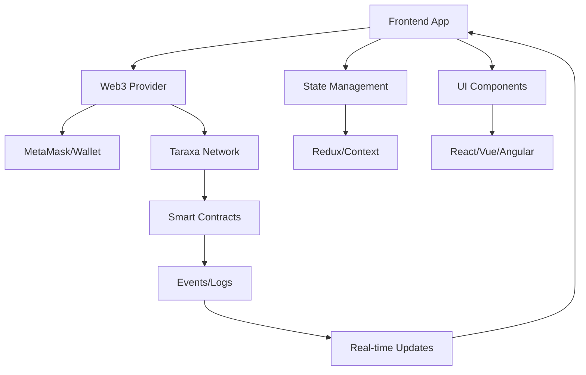

# บทที่ 13: Frontend Integration

## 🎯 จุดประสงค์ของบทเรียน
- เชื่อมต่อ Smart Contract กับ Frontend Applications
- ใช้ Web3.js และ Ethers.js อย่างมีประสิทธิภาพ
- สร้าง User Interface ที่ responsive และ user-friendly
- จัดการ Wallet connections และ Transaction signing

## 🌐 Web3 Frontend Architecture

### **📱 Modern DApp Architecture**



## ⚛️ React + Web3 Integration

### **🔧 Project Setup**

```bash
npx create-react-app taraxa-dapp
cd taraxa-dapp
npm install web3 ethers @metamask/detect-provider
```

### **🌟 Web3 Provider Setup**

```javascript
// src/hooks/useWeb3.js
import { useState, useEffect, createContext, useContext } from 'react';
import Web3 from 'web3';
import detectEthereumProvider from '@metamask/detect-provider';

const Web3Context = createContext();

export const useWeb3 = () => {
    const context = useContext(Web3Context);
    if (!context) {
        throw new Error('useWeb3 must be used within Web3Provider');
    }
    return context;
};

export const Web3Provider = ({ children }) => {
    const [web3, setWeb3] = useState(null);
    const [account, setAccount] = useState(null);
    const [chainId, setChainId] = useState(null);
    const [loading, setLoading] = useState(true);
    const [error, setError] = useState(null);

    // Taraxa Network configurations
    const TARAXA_TESTNET = {
        chainId: '0x' + (842).toString(16), // 842 in hex
        chainName: 'Taraxa Testnet',
        nativeCurrency: {
            name: 'TARA',
            symbol: 'TARA',
            decimals: 18
        },
        rpcUrls: ['https://rpc.testnet.taraxa.io/'],
        blockExplorerUrls: ['https://explorer.testnet.taraxa.io/']
    };

    const TARAXA_MAINNET = {
        chainId: '0x' + (841).toString(16), // 841 in hex
        chainName: 'Taraxa Mainnet',
        nativeCurrency: {
            name: 'TARA',
            symbol: 'TARA',
            decimals: 18
        },
        rpcUrls: ['https://rpc.mainnet.taraxa.io/'],
        blockExplorerUrls: ['https://explorer.mainnet.taraxa.io/']
    };

    const connectWallet = async () => {
        try {
            setLoading(true);
            setError(null);

            const provider = await detectEthereumProvider();
            if (!provider) {
                throw new Error('MetaMask not detected. Please install MetaMask.');
            }

            const web3Instance = new Web3(provider);
            setWeb3(web3Instance);

            // Request account access
            const accounts = await provider.request({
                method: 'eth_requestAccounts'
            });

            if (accounts.length === 0) {
                throw new Error('No accounts found. Please connect your wallet.');
            }

            setAccount(accounts[0]);

            // Get chain ID
            const chainId = await provider.request({
                method: 'eth_chainId'
            });
            setChainId(chainId);

            // Setup event listeners
            provider.on('accountsChanged', handleAccountsChanged);
            provider.on('chainChanged', handleChainChanged);

        } catch (error) {
            setError(error.message);
            console.error('Error connecting wallet:', error);
        } finally {
            setLoading(false);
        }
    };

    const switchToTaraxa = async (isTestnet = true) => {
        const targetNetwork = isTestnet ? TARAXA_TESTNET : TARAXA_MAINNET;
        
        try {
            await window.ethereum.request({
                method: 'wallet_switchEthereumChain',
                params: [{ chainId: targetNetwork.chainId }]
            });
        } catch (error) {
            // Network not added to MetaMask
            if (error.code === 4902) {
                try {
                    await window.ethereum.request({
                        method: 'wallet_addEthereumChain',
                        params: [targetNetwork]
                    });
                } catch (addError) {
                    throw new Error('Failed to add Taraxa network to MetaMask');
                }
            } else {
                throw error;
            }
        }
    };

    const handleAccountsChanged = (accounts) => {
        if (accounts.length === 0) {
            setAccount(null);
        } else {
            setAccount(accounts[0]);
        }
    };

    const handleChainChanged = (chainId) => {
        setChainId(chainId);
        window.location.reload(); // Recommended by MetaMask
    };

    const disconnectWallet = () => {
        setWeb3(null);
        setAccount(null);
        setChainId(null);
    };

    const isConnected = () => {
        return web3 && account;
    };

    const isTaraxaNetwork = () => {
        return chainId === TARAXA_TESTNET.chainId || chainId === TARAXA_MAINNET.chainId;
    };

    useEffect(() => {
        const init = async () => {
            const provider = await detectEthereumProvider();
            if (provider && provider.selectedAddress) {
                await connectWallet();
            }
            setLoading(false);
        };
        
        init();
    }, []);

    const value = {
        web3,
        account,
        chainId,
        loading,
        error,
        connectWallet,
        disconnectWallet,
        switchToTaraxa,
        isConnected,
        isTaraxaNetwork,
        TARAXA_TESTNET,
        TARAXA_MAINNET
    };

    return (
        <Web3Context.Provider value={value}>
            {children}
        </Web3Context.Provider>
    );
};
```

### **📱 Smart Contract Integration Hook**

```javascript
// src/hooks/useContract.js
import { useState, useEffect, useCallback } from 'react';
import { useWeb3 } from './useWeb3';

export const useContract = (contractAddress, contractABI) => {
    const { web3, account } = useWeb3();
    const [contract, setContract] = useState(null);
    const [loading, setLoading] = useState(false);
    const [error, setError] = useState(null);

    useEffect(() => {
        if (web3 && contractAddress && contractABI) {
            try {
                const contractInstance = new web3.eth.Contract(contractABI, contractAddress);
                setContract(contractInstance);
                setError(null);
            } catch (err) {
                setError('Failed to initialize contract');
                console.error('Contract initialization error:', err);
            }
        }
    }, [web3, contractAddress, contractABI]);

    const callMethod = useCallback(async (methodName, ...args) => {
        if (!contract || !account) {
            throw new Error('Contract or account not available');
        }

        setLoading(true);
        setError(null);

        try {
            const result = await contract.methods[methodName](...args).call({
                from: account
            });
            return result;
        } catch (err) {
            setError(err.message);
            throw err;
        } finally {
            setLoading(false);
        }
    }, [contract, account]);

    const sendTransaction = useCallback(async (methodName, options = {}, ...args) => {
        if (!contract || !account) {
            throw new Error('Contract or account not available');
        }

        setLoading(true);
        setError(null);

        try {
            const gasEstimate = await contract.methods[methodName](...args).estimateGas({
                from: account,
                ...options
            });

            const tx = await contract.methods[methodName](...args).send({
                from: account,
                gas: Math.floor(gasEstimate * 1.2), // Add 20% buffer
                ...options
            });

            return tx;
        } catch (err) {
            setError(err.message);
            throw err;
        } finally {
            setLoading(false);
        }
    }, [contract, account]);

    const listenToEvents = useCallback((eventName, options = {}, callback) => {
        if (!contract) return null;

        const event = contract.events[eventName](options);
        event.on('data', callback);
        event.on('error', console.error);

        return () => {
            event.off('data', callback);
        };
    }, [contract]);

    return {
        contract,
        loading,
        error,
        callMethod,
        sendTransaction,
        listenToEvents
    };
};
```

## 🎨 UI Components

### **💳 Wallet Connection Component**

```jsx
// src/components/WalletConnection.jsx
import React from 'react';
import { useWeb3 } from '../hooks/useWeb3';
import './WalletConnection.css';

const WalletConnection = () => {
    const {
        account,
        loading,
        error,
        connectWallet,
        disconnectWallet,
        switchToTaraxa,
        isConnected,
        isTaraxaNetwork
    } = useWeb3();

    const formatAddress = (address) => {
        if (!address) return '';
        return `${address.slice(0, 6)}...${address.slice(-4)}`;
    };

    if (loading) {
        return (
            <div className="wallet-connection loading">
                <div className="spinner"></div>
                <span>Connecting...</span>
            </div>
        );
    }

    if (error) {
        return (
            <div className="wallet-connection error">
                <span>❌ {error}</span>
                <button onClick={connectWallet} className="btn-retry">
                    Retry
                </button>
            </div>
        );
    }

    if (!isConnected()) {
        return (
            <div className="wallet-connection disconnected">
                <button onClick={connectWallet} className="btn-connect">
                    Connect Wallet
                </button>
            </div>
        );
    }

    return (
        <div className="wallet-connection connected">
            <div className="wallet-info">
                <span className="address">{formatAddress(account)}</span>
                {!isTaraxaNetwork() && (
                    <button 
                        onClick={() => switchToTaraxa(true)} 
                        className="btn-switch-network"
                    >
                        Switch to Taraxa
                    </button>
                )}
            </div>
            <button onClick={disconnectWallet} className="btn-disconnect">
                Disconnect
            </button>
        </div>
    );
};

export default WalletConnection;
```

### **🪙 Token Balance Component**

```jsx
// src/components/TokenBalance.jsx
import React, { useState, useEffect } from 'react';
import { useWeb3 } from '../hooks/useWeb3';
import { useContract } from '../hooks/useContract';

const TokenBalance = ({ tokenAddress, tokenABI, tokenSymbol = 'TOKEN' }) => {
    const { account, web3 } = useWeb3();
    const { callMethod, listenToEvents } = useContract(tokenAddress, tokenABI);
    const [balance, setBalance] = useState('0');
    const [ethBalance, setEthBalance] = useState('0');
    const [loading, setLoading] = useState(false);

    const fetchBalances = async () => {
        if (!account) return;

        setLoading(true);
        try {
            // Get token balance
            const tokenBalance = await callMethod('balanceOf', account);
            const decimals = await callMethod('decimals');
            const formattedBalance = web3.utils.fromWei(tokenBalance, 'ether');
            setBalance(formattedBalance);

            // Get ETH/TARA balance
            const ethBal = await web3.eth.getBalance(account);
            const formattedEthBalance = web3.utils.fromWei(ethBal, 'ether');
            setEthBalance(formattedEthBalance);
        } catch (error) {
            console.error('Error fetching balances:', error);
        } finally {
            setLoading(false);
        }
    };

    useEffect(() => {
        fetchBalances();

        // Listen for transfer events to update balance
        const unsubscribe = listenToEvents('Transfer', {
            filter: {
                from: account
            }
        }, () => {
            fetchBalances();
        });

        const unsubscribeIn = listenToEvents('Transfer', {
            filter: {
                to: account
            }
        }, () => {
            fetchBalances();
        });

        return () => {
            if (unsubscribe) unsubscribe();
            if (unsubscribeIn) unsubscribeIn();
        };
    }, [account]);

    if (loading) {
        return <div className="token-balance loading">Loading balances...</div>;
    }

    return (
        <div className="token-balance">
            <div className="balance-item">
                <span className="balance-label">TARA:</span>
                <span className="balance-value">{parseFloat(ethBalance).toFixed(4)}</span>
            </div>
            <div className="balance-item">
                <span className="balance-label">{tokenSymbol}:</span>
                <span className="balance-value">{parseFloat(balance).toFixed(4)}</span>
            </div>
            <button onClick={fetchBalances} className="btn-refresh">
                Refresh
            </button>
        </div>
    );
};

export default TokenBalance;
```

### **💸 Transfer Component**

```jsx
// src/components/TransferForm.jsx
import React, { useState } from 'react';
import { useContract } from '../hooks/useContract';
import { useWeb3 } from '../hooks/useWeb3';

const TransferForm = ({ tokenAddress, tokenABI }) => {
    const { web3, account } = useWeb3();
    const { sendTransaction } = useContract(tokenAddress, tokenABI);
    const [formData, setFormData] = useState({
        recipient: '',
        amount: ''
    });
    const [loading, setLoading] = useState(false);
    const [txHash, setTxHash] = useState('');
    const [error, setError] = useState('');

    const handleInputChange = (e) => {
        const { name, value } = e.target;
        setFormData(prev => ({
            ...prev,
            [name]: value
        }));
        setError('');
    };

    const validateForm = () => {
        if (!web3.utils.isAddress(formData.recipient)) {
            setError('Invalid recipient address');
            return false;
        }

        if (!formData.amount || parseFloat(formData.amount) <= 0) {
            setError('Invalid amount');
            return false;
        }

        return true;
    };

    const handleSubmit = async (e) => {
        e.preventDefault();
        
        if (!validateForm()) return;

        setLoading(true);
        setError('');
        setTxHash('');

        try {
            const amountInWei = web3.utils.toWei(formData.amount, 'ether');
            
            const tx = await sendTransaction(
                'transfer',
                {},
                formData.recipient,
                amountInWei
            );

            setTxHash(tx.transactionHash);
            setFormData({ recipient: '', amount: '' });
            
        } catch (error) {
            setError(error.message);
        } finally {
            setLoading(false);
        }
    };

    return (
        <div className="transfer-form">
            <h3>Transfer Tokens</h3>
            
            <form onSubmit={handleSubmit}>
                <div className="form-group">
                    <label htmlFor="recipient">Recipient Address:</label>
                    <input
                        type="text"
                        id="recipient"
                        name="recipient"
                        value={formData.recipient}
                        onChange={handleInputChange}
                        placeholder="0x..."
                        required
                    />
                </div>

                <div className="form-group">
                    <label htmlFor="amount">Amount:</label>
                    <input
                        type="number"
                        id="amount"
                        name="amount"
                        value={formData.amount}
                        onChange={handleInputChange}
                        placeholder="0.0"
                        step="0.000001"
                        min="0"
                        required
                    />
                </div>

                <button type="submit" disabled={loading} className="btn-submit">
                    {loading ? 'Transferring...' : 'Transfer'}
                </button>
            </form>

            {error && (
                <div className="error-message">
                    ❌ {error}
                </div>
            )}

            {txHash && (
                <div className="success-message">
                    ✅ Transaction successful!
                    <a 
                        href={`https://explorer.testnet.taraxa.io/tx/${txHash}`}
                        target="_blank"
                        rel="noopener noreferrer"
                        className="tx-link"
                    >
                        View on Explorer
                    </a>
                </div>
            )}
        </div>
    );
};

export default TransferForm;
```

## 🔔 Real-time Event Handling

### **📡 Event Listener Hook**

```javascript
// src/hooks/useEventListener.js
import { useState, useEffect } from 'react';
import { useContract } from './useContract';

export const useEventListener = (contractAddress, contractABI, eventName, options = {}) => {
    const [events, setEvents] = useState([]);
    const [loading, setLoading] = useState(false);
    const { contract } = useContract(contractAddress, contractABI);

    useEffect(() => {
        if (!contract) return;

        setLoading(true);

        // Get historical events
        const getHistoricalEvents = async () => {
            try {
                const pastEvents = await contract.getPastEvents(eventName, {
                    fromBlock: options.fromBlock || 'latest',
                    toBlock: 'latest',
                    ...options
                });
                
                setEvents(pastEvents.reverse()); // Latest first
            } catch (error) {
                console.error('Error fetching historical events:', error);
            } finally {
                setLoading(false);
            }
        };

        getHistoricalEvents();

        // Listen for new events
        const subscription = contract.events[eventName](options)
            .on('data', (event) => {
                setEvents(prev => [event, ...prev]);
            })
            .on('error', console.error);

        return () => {
            subscription.unsubscribe();
        };
    }, [contract, eventName]);

    return { events, loading };
};
```

### **📊 Transaction History Component**

```jsx
// src/components/TransactionHistory.jsx
import React from 'react';
import { useEventListener } from '../hooks/useEventListener';
import { useWeb3 } from '../hooks/useWeb3';

const TransactionHistory = ({ tokenAddress, tokenABI }) => {
    const { account, web3 } = useWeb3();
    const { events: transferEvents, loading } = useEventListener(
        tokenAddress,
        tokenABI,
        'Transfer',
        {
            filter: {
                $or: [
                    { from: account },
                    { to: account }
                ]
            },
            fromBlock: 0
        }
    );

    const formatAmount = (amount) => {
        return web3.utils.fromWei(amount, 'ether');
    };

    const formatAddress = (address) => {
        return `${address.slice(0, 6)}...${address.slice(-4)}`;
    };

    const formatTimestamp = (blockNumber) => {
        // In a real app, you'd fetch the block to get timestamp
        return new Date().toLocaleString();
    };

    if (loading) {
        return <div className="transaction-history loading">Loading transactions...</div>;
    }

    return (
        <div className="transaction-history">
            <h3>Transaction History</h3>
            
            {transferEvents.length === 0 ? (
                <p>No transactions found</p>
            ) : (
                <div className="transaction-list">
                    {transferEvents.map((event, index) => {
                        const { from, to, value } = event.returnValues;
                        const isIncoming = to.toLowerCase() === account.toLowerCase();
                        
                        return (
                            <div key={index} className={`transaction-item ${isIncoming ? 'incoming' : 'outgoing'}`}>
                                <div className="transaction-direction">
                                    {isIncoming ? '📥' : '📤'}
                                </div>
                                
                                <div className="transaction-details">
                                    <div className="transaction-addresses">
                                        <span>From: {formatAddress(from)}</span>
                                        <span>To: {formatAddress(to)}</span>
                                    </div>
                                    
                                    <div className="transaction-amount">
                                        {formatAmount(value)} tokens
                                    </div>
                                    
                                    <div className="transaction-meta">
                                        <span>Block: {event.blockNumber}</span>
                                        <a 
                                            href={`https://explorer.testnet.taraxa.io/tx/${event.transactionHash}`}
                                            target="_blank"
                                            rel="noopener noreferrer"
                                        >
                                            View
                                        </a>
                                    </div>
                                </div>
                            </div>
                        );
                    })}
                </div>
            )}
        </div>
    );
};

export default TransactionHistory;
```

## 🎨 Styling (CSS)

### **💅 Main App Styles**

```css
/* src/App.css */
.App {
  max-width: 1200px;
  margin: 0 auto;
  padding: 20px;
  font-family: 'Inter', -apple-system, BlinkMacSystemFont, sans-serif;
}

.header {
  display: flex;
  justify-content: space-between;
  align-items: center;
  padding: 20px 0;
  border-bottom: 1px solid #e1e5e9;
  margin-bottom: 30px;
}

.logo {
  font-size: 24px;
  font-weight: 700;
  color: #1a1a1a;
}

/* Wallet Connection Styles */
.wallet-connection {
  display: flex;
  align-items: center;
  gap: 12px;
}

.wallet-connection.loading {
  color: #666;
}

.spinner {
  width: 16px;
  height: 16px;
  border: 2px solid #f3f3f3;
  border-top: 2px solid #3498db;
  border-radius: 50%;
  animation: spin 1s linear infinite;
}

@keyframes spin {
  0% { transform: rotate(0deg); }
  100% { transform: rotate(360deg); }
}

.btn-connect {
  background: linear-gradient(135deg, #667eea 0%, #764ba2 100%);
  color: white;
  border: none;
  padding: 12px 24px;
  border-radius: 8px;
  font-weight: 600;
  cursor: pointer;
  transition: transform 0.2s;
}

.btn-connect:hover {
  transform: translateY(-2px);
}

.wallet-info {
  display: flex;
  align-items: center;
  gap: 12px;
}

.address {
  background: #f8f9fa;
  padding: 8px 12px;
  border-radius: 6px;
  font-family: 'JetBrains Mono', monospace;
  font-size: 14px;
}

.btn-switch-network {
  background: #ff6b6b;
  color: white;
  border: none;
  padding: 6px 12px;
  border-radius: 4px;
  font-size: 12px;
  cursor: pointer;
}

.btn-disconnect {
  background: #6c757d;
  color: white;
  border: none;
  padding: 8px 16px;
  border-radius: 6px;
  cursor: pointer;
}

/* Token Balance Styles */
.token-balance {
  background: white;
  border: 1px solid #e1e5e9;
  border-radius: 12px;
  padding: 24px;
  margin-bottom: 24px;
}

.balance-item {
  display: flex;
  justify-content: space-between;
  margin-bottom: 12px;
}

.balance-label {
  font-weight: 600;
  color: #495057;
}

.balance-value {
  font-weight: 700;
  color: #28a745;
  font-family: 'JetBrains Mono', monospace;
}

.btn-refresh {
  background: #17a2b8;
  color: white;
  border: none;
  padding: 8px 16px;
  border-radius: 6px;
  cursor: pointer;
  margin-top: 12px;
}

/* Transfer Form Styles */
.transfer-form {
  background: white;
  border: 1px solid #e1e5e9;
  border-radius: 12px;
  padding: 24px;
  margin-bottom: 24px;
}

.form-group {
  margin-bottom: 20px;
}

.form-group label {
  display: block;
  margin-bottom: 8px;
  font-weight: 600;
  color: #495057;
}

.form-group input {
  width: 100%;
  padding: 12px 16px;
  border: 1px solid #ced4da;
  border-radius: 8px;
  font-size: 16px;
  transition: border-color 0.2s;
}

.form-group input:focus {
  outline: none;
  border-color: #667eea;
  box-shadow: 0 0 0 3px rgba(102, 126, 234, 0.1);
}

.btn-submit {
  background: linear-gradient(135deg, #28a745 0%, #20c997 100%);
  color: white;
  border: none;
  padding: 14px 28px;
  border-radius: 8px;
  font-weight: 600;
  cursor: pointer;
  transition: transform 0.2s;
  width: 100%;
}

.btn-submit:hover:not(:disabled) {
  transform: translateY(-2px);
}

.btn-submit:disabled {
  background: #6c757d;
  cursor: not-allowed;
  transform: none;
}

.error-message {
  background: #f8d7da;
  color: #721c24;
  padding: 12px 16px;
  border-radius: 6px;
  margin-top: 16px;
}

.success-message {
  background: #d4edda;
  color: #155724;
  padding: 12px 16px;
  border-radius: 6px;
  margin-top: 16px;
}

.tx-link {
  color: #007bff;
  text-decoration: none;
  margin-left: 8px;
}

/* Transaction History Styles */
.transaction-history {
  background: white;
  border: 1px solid #e1e5e9;
  border-radius: 12px;
  padding: 24px;
}

.transaction-list {
  max-height: 400px;
  overflow-y: auto;
}

.transaction-item {
  display: flex;
  align-items: center;
  padding: 16px;
  border-bottom: 1px solid #e9ecef;
  transition: background 0.2s;
}

.transaction-item:hover {
  background: #f8f9fa;
}

.transaction-item.incoming {
  border-left: 4px solid #28a745;
}

.transaction-item.outgoing {
  border-left: 4px solid #dc3545;
}

.transaction-direction {
  font-size: 24px;
  margin-right: 16px;
}

.transaction-details {
  flex: 1;
}

.transaction-addresses {
  display: flex;
  gap: 16px;
  margin-bottom: 8px;
  font-size: 14px;
  color: #6c757d;
}

.transaction-amount {
  font-weight: 700;
  color: #1a1a1a;
  margin-bottom: 4px;
}

.transaction-meta {
  display: flex;
  gap: 16px;
  font-size: 12px;
  color: #6c757d;
}

/* Responsive Design */
@media (max-width: 768px) {
  .App {
    padding: 16px;
  }
  
  .header {
    flex-direction: column;
    gap: 16px;
  }
  
  .wallet-connection {
    flex-direction: column;
  }
  
  .transaction-addresses {
    flex-direction: column;
    gap: 4px;
  }
}
```

## 📱 Main App Component

### **🚀 Complete App.jsx**

```jsx
// src/App.jsx
import React from 'react';
import { Web3Provider } from './hooks/useWeb3';
import WalletConnection from './components/WalletConnection';
import TokenBalance from './components/TokenBalance';
import TransferForm from './components/TransferForm';
import TransactionHistory from './components/TransactionHistory';
import './App.css';

// Replace with your deployed contract address and ABI
const TOKEN_ADDRESS = '0x...'; // Your ERC-20 token address
const TOKEN_ABI = [
  // Add your contract ABI here
  {
    "inputs": [{"name": "account", "type": "address"}],
    "name": "balanceOf",
    "outputs": [{"name": "", "type": "uint256"}],
    "type": "function"
  },
  // ... more ABI items
];

function App() {
  return (
    <Web3Provider>
      <div className="App">
        <header className="header">
          <div className="logo">
            🌟 Taraxa DApp
          </div>
          <WalletConnection />
        </header>

        <main className="main-content">
          <TokenBalance 
            tokenAddress={TOKEN_ADDRESS}
            tokenABI={TOKEN_ABI}
            tokenSymbol="TCC"
          />
          
          <TransferForm 
            tokenAddress={TOKEN_ADDRESS}
            tokenABI={TOKEN_ABI}
          />
          
          <TransactionHistory 
            tokenAddress={TOKEN_ADDRESS}
            tokenABI={TOKEN_ABI}
          />
        </main>
      </div>
    </Web3Provider>
  );
}

export default App;
```

## 📋 แบบฝึกหัด

### **🎯 แบบฝึกหัดที่ 1: NFT Gallery**
สร้าง Frontend สำหรับ NFT marketplace:
1. Display NFT collections
2. Mint new NFTs
3. Transfer NFTs
4. View ownership history

### **🔧 แบบฝึกหัดที่ 2: DeFi Dashboard**
พัฒนา dashboard สำหรับ DeFi protocol:
1. Staking interface
2. Yield farming metrics
3. Liquidity pool management
4. Reward claiming

### **📊 แบบฝึกหัดที่ 3: DAO Governance**
สร้าง interface สำหรับ DAO:
1. Proposal creation
2. Voting system
3. Execution interface
4. Member management

## 🔗 การเชื่อมต่อ

**บทก่อนหน้า**: [บทที่ 12: Security Fundamentals](./12-security-fundamentals.md)  
**บทถัดไป**: [บทที่ 14: Upgrade Patterns](./14-upgrade-patterns.md)

**กลับไปหน้าหลัก**: [README](./README.md)

---

## 📚 เอกสารอ้างอิง

- [Web3.js Documentation](https://web3js.readthedocs.io/)
- [Ethers.js Documentation](https://docs.ethers.io/)
- [MetaMask Developer Docs](https://docs.metamask.io/)
- [React Hooks](https://reactjs.org/docs/hooks-intro.html)
- [Taraxa Network Integration](https://docs.taraxa.io/)

---

ตอนนี้คุณสามารถสร้าง Frontend ที่สมบูรณ์สำหรับ Taraxa DApps! 🌐✨
