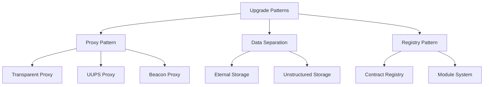

# บทที่ 14: Upgrade Patterns

## 🎯 จุดประสงค์ของบทเรียน
- เรียนรู้ Upgrade Patterns สำหรับ Smart Contracts
- ทำความเข้าใจ Proxy Patterns และการใช้งาน
- จัดการ Storage Layout และ Compatibility
- พัฒนา Governance ระบบสำหรับการ Upgrade

## 🔄 Smart Contract Upgradability

### **📈 Upgrade Patterns Overview**



## 🛠️ Proxy Patterns

### **⚡ Transparent Proxy Pattern**

```solidity
// contracts/upgrades/TransparentProxy.sol
// SPDX-License-Identifier: MIT
pragma solidity ^0.8.19;

import "@openzeppelin/contracts/proxy/transparent/TransparentUpgradeableProxy.sol";
import "@openzeppelin/contracts/proxy/transparent/ProxyAdmin.sol";

/**
 * @title TransparentProxy Implementation
 * @dev Uses OpenZeppelin's transparent proxy pattern
 */
contract TransparentProxyExample {
    ProxyAdmin public proxyAdmin;
    TransparentUpgradeableProxy public proxy;
    
    event ProxyDeployed(address indexed proxy, address indexed implementation);
    event ImplementationUpgraded(address indexed oldImplementation, address indexed newImplementation);
    
    constructor() {
        proxyAdmin = new ProxyAdmin();
    }
    
    function deployProxy(
        address implementation,
        bytes memory data
    ) external returns (address) {
        proxy = new TransparentUpgradeableProxy(
            implementation,
            address(proxyAdmin),
            data
        );
        
        emit ProxyDeployed(address(proxy), implementation);
        return address(proxy);
    }
    
    function upgrade(address newImplementation) external {
        address oldImplementation = proxyAdmin.getProxyImplementation(proxy);
        proxyAdmin.upgrade(proxy, newImplementation);
        
        emit ImplementationUpgraded(oldImplementation, newImplementation);
    }
    
    function upgradeAndCall(
        address newImplementation,
        bytes memory data
    ) external {
        address oldImplementation = proxyAdmin.getProxyImplementation(proxy);
        proxyAdmin.upgradeAndCall(proxy, newImplementation, data);
        
        emit ImplementationUpgraded(oldImplementation, newImplementation);
    }
}
```

### **🎯 UUPS (Universal Upgradeable Proxy Standard)**

```solidity
// contracts/upgrades/UUPSUpgradeable.sol
// SPDX-License-Identifier: MIT
pragma solidity ^0.8.19;

import "@openzeppelin/contracts-upgradeable/proxy/utils/Initializable.sol";
import "@openzeppelin/contracts-upgradeable/proxy/utils/UUPSUpgradeable.sol";
import "@openzeppelin/contracts-upgradeable/access/OwnableUpgradeable.sol";

/**
 * @title UUPS Upgradeable Contract Example
 * @dev Implementation contract that can be upgraded via UUPS pattern
 */
contract MyUpgradeableContract is Initializable, UUPSUpgradeable, OwnableUpgradeable {
    // Storage variables
    uint256 public value;
    mapping(address => uint256) public balances;
    string public name;
    
    // Events
    event ValueUpdated(uint256 oldValue, uint256 newValue);
    event BalanceUpdated(address indexed user, uint256 oldBalance, uint256 newBalance);
    
    /// @custom:oz-upgrades-unsafe-allow constructor
    constructor() {
        _disableInitializers();
    }
    
    function initialize(
        uint256 _initialValue,
        string memory _name,
        address _owner
    ) public initializer {
        __UUPSUpgradeable_init();
        __Ownable_init();
        
        value = _initialValue;
        name = _name;
        _transferOwnership(_owner);
    }
    
    function setValue(uint256 _newValue) external onlyOwner {
        uint256 oldValue = value;
        value = _newValue;
        emit ValueUpdated(oldValue, _newValue);
    }
    
    function updateBalance(address _user, uint256 _amount) external onlyOwner {
        uint256 oldBalance = balances[_user];
        balances[_user] = _amount;
        emit BalanceUpdated(_user, oldBalance, _amount);
    }
    
    function getVersion() external pure virtual returns (string memory) {
        return "1.0.0";
    }
    
    // Required override for UUPS
    function _authorizeUpgrade(address newImplementation) internal override onlyOwner {}
}

/**
 * @title Version 2 of the contract with new features
 */
contract MyUpgradeableContractV2 is MyUpgradeableContract {
    // New storage variables (append only!)
    uint256 public multiplier;
    mapping(address => bool) public authorizedUsers;
    
    event MultiplierUpdated(uint256 oldMultiplier, uint256 newMultiplier);
    event UserAuthorized(address indexed user, bool authorized);
    
    function initializeV2(uint256 _multiplier) public onlyOwner {
        multiplier = _multiplier;
    }
    
    function setMultiplier(uint256 _newMultiplier) external onlyOwner {
        uint256 oldMultiplier = multiplier;
        multiplier = _newMultiplier;
        emit MultiplierUpdated(oldMultiplier, _newMultiplier);
    }
    
    function authorizeUser(address _user, bool _authorized) external onlyOwner {
        authorizedUsers[_user] = _authorized;
        emit UserAuthorized(_user, _authorized);
    }
    
    function getMultipliedValue() external view returns (uint256) {
        return value * multiplier;
    }
    
    function getVersion() external pure override returns (string memory) {
        return "2.0.0";
    }
}
```

### **🏭 Beacon Proxy Pattern**

```solidity
// contracts/upgrades/BeaconProxy.sol
// SPDX-License-Identifier: MIT
pragma solidity ^0.8.19;

import "@openzeppelin/contracts/proxy/beacon/BeaconProxy.sol";
import "@openzeppelin/contracts/proxy/beacon/UpgradeableBeacon.sol";
import "@openzeppelin/contracts/access/Ownable.sol";

/**
 * @title Beacon Proxy Factory
 * @dev Creates multiple proxy instances pointing to the same beacon
 */
contract BeaconProxyFactory is Ownable {
    UpgradeableBeacon public immutable beacon;
    address[] public deployedProxies;
    
    mapping(address => bool) public isProxy;
    
    event ProxyDeployed(address indexed proxy, uint256 index);
    event BeaconUpgraded(address indexed oldImplementation, address indexed newImplementation);
    
    constructor(address _implementation) {
        beacon = new UpgradeableBeacon(_implementation);
        beacon.transferOwnership(owner());
    }
    
    function createProxy(bytes memory _data) external returns (address) {
        BeaconProxy proxy = new BeaconProxy(
            address(beacon),
            _data
        );
        
        address proxyAddress = address(proxy);
        deployedProxies.push(proxyAddress);
        isProxy[proxyAddress] = true;
        
        emit ProxyDeployed(proxyAddress, deployedProxies.length - 1);
        return proxyAddress;
    }
    
    function upgradeBeacon(address _newImplementation) external onlyOwner {
        address oldImplementation = beacon.implementation();
        beacon.upgradeTo(_newImplementation);
        
        emit BeaconUpgraded(oldImplementation, _newImplementation);
    }
    
    function getProxyCount() external view returns (uint256) {
        return deployedProxies.length;
    }
    
    function getImplementation() external view returns (address) {
        return beacon.implementation();
    }
}
```

## 📊 Storage Management

### **🗄️ Eternal Storage Pattern**

```solidity
// contracts/upgrades/EternalStorage.sol
// SPDX-License-Identifier: MIT
pragma solidity ^0.8.19;

/**
 * @title EternalStorage
 * @dev Separates data storage from business logic
 */
contract EternalStorage {
    mapping(bytes32 => uint256) internal uintStorage;
    mapping(bytes32 => string) internal stringStorage;
    mapping(bytes32 => address) internal addressStorage;
    mapping(bytes32 => bytes) internal bytesStorage;
    mapping(bytes32 => bool) internal boolStorage;
    mapping(bytes32 => int256) internal intStorage;
    
    // Access control
    address public owner;
    mapping(address => bool) public authorized;
    
    modifier onlyAuthorized() {
        require(authorized[msg.sender] || msg.sender == owner, "Not authorized");
        _;
    }
    
    constructor() {
        owner = msg.sender;
        authorized[msg.sender] = true;
    }
    
    function authorize(address _address) external {
        require(msg.sender == owner, "Only owner");
        authorized[_address] = true;
    }
    
    function deauthorize(address _address) external {
        require(msg.sender == owner, "Only owner");
        authorized[_address] = false;
    }
    
    // Uint storage
    function getUint(bytes32 _key) external view returns (uint256) {
        return uintStorage[_key];
    }
    
    function setUint(bytes32 _key, uint256 _value) external onlyAuthorized {
        uintStorage[_key] = _value;
    }
    
    // String storage
    function getString(bytes32 _key) external view returns (string memory) {
        return stringStorage[_key];
    }
    
    function setString(bytes32 _key, string memory _value) external onlyAuthorized {
        stringStorage[_key] = _value;
    }
    
    // Address storage
    function getAddress(bytes32 _key) external view returns (address) {
        return addressStorage[_key];
    }
    
    function setAddress(bytes32 _key, address _value) external onlyAuthorized {
        addressStorage[_key] = _value;
    }
    
    // Bool storage
    function getBool(bytes32 _key) external view returns (bool) {
        return boolStorage[_key];
    }
    
    function setBool(bytes32 _key, bool _value) external onlyAuthorized {
        boolStorage[_key] = _value;
    }
}

/**
 * @title Business Logic Contract using Eternal Storage
 */
contract BusinessLogic {
    EternalStorage public eternalStorage;
    
    event ValueUpdated(bytes32 indexed key, uint256 value);
    
    constructor(address _eternalStorage) {
        eternalStorage = EternalStorage(_eternalStorage);
    }
    
    function setValue(string memory _key, uint256 _value) external {
        bytes32 key = keccak256(abi.encodePacked(_key));
        eternalStorage.setUint(key, _value);
        emit ValueUpdated(key, _value);
    }
    
    function getValue(string memory _key) external view returns (uint256) {
        bytes32 key = keccak256(abi.encodePacked(_key));
        return eternalStorage.getUint(key);
    }
    
    function setUserBalance(address _user, uint256 _balance) external {
        bytes32 key = keccak256(abi.encodePacked("balance", _user));
        eternalStorage.setUint(key, _balance);
    }
    
    function getUserBalance(address _user) external view returns (uint256) {
        bytes32 key = keccak256(abi.encodePacked("balance", _user));
        return eternalStorage.getUint(key);
    }
}
```

### **📏 Storage Layout Management**

```solidity
// contracts/upgrades/StorageLayoutExample.sol
// SPDX-License-Identifier: MIT
pragma solidity ^0.8.19;

import "@openzeppelin/contracts-upgradeable/proxy/utils/Initializable.sol";

/**
 * @title Storage Layout V1
 * @dev Demonstrates proper storage layout for upgradeable contracts
 */
contract StorageV1 is Initializable {
    // Storage slot 0
    address public owner;
    
    // Storage slot 1
    uint256 public value;
    
    // Storage slot 2
    mapping(address => uint256) public balances;
    
    // Storage slot 3
    mapping(address => mapping(address => uint256)) public allowances;
    
    // Storage slot 4
    string public name;
    
    // Storage slot 5
    bool public paused;
    
    function initialize(
        address _owner,
        uint256 _value,
        string memory _name
    ) external initializer {
        owner = _owner;
        value = _value;
        name = _name;
        paused = false;
    }
}

/**
 * @title Storage Layout V2
 * @dev Shows how to safely add new storage variables
 */
contract StorageV2 is StorageV1 {
    // ✅ Safe: Adding new variables at the end
    // Storage slot 6
    uint256 public newFeature;
    
    // Storage slot 7
    mapping(address => bool) public authorized;
    
    // Storage slot 8
    address[] public users;
    
    // DO NOT: Reorder existing variables
    // DO NOT: Change types of existing variables
    // DO NOT: Remove variables
    
    function initializeV2(uint256 _newFeature) external {
        require(newFeature == 0, "Already initialized V2");
        newFeature = _newFeature;
    }
    
    function addAuthorizedUser(address _user) external {
        require(msg.sender == owner, "Only owner");
        if (!authorized[_user]) {
            authorized[_user] = true;
            users.push(_user);
        }
    }
}
```

## 🏛️ Governance System

### **🗳️ Upgrade Governance Contract**

```solidity
// contracts/governance/UpgradeGovernance.sol
// SPDX-License-Identifier: MIT
pragma solidity ^0.8.19;

import "@openzeppelin/contracts/access/AccessControl.sol";
import "@openzeppelin/contracts/security/ReentrancyGuard.sol";

/**
 * @title UpgradeGovernance
 * @dev Manages upgrades through voting mechanism
 */
contract UpgradeGovernance is AccessControl, ReentrancyGuard {
    bytes32 public constant PROPOSER_ROLE = keccak256("PROPOSER_ROLE");
    bytes32 public constant VOTER_ROLE = keccak256("VOTER_ROLE");
    bytes32 public constant EXECUTOR_ROLE = keccak256("EXECUTOR_ROLE");
    
    enum ProposalState {
        Pending,
        Active,
        Succeeded,
        Defeated,
        Executed,
        Cancelled
    }
    
    struct Proposal {
        uint256 id;
        address proposer;
        address target;
        address newImplementation;
        bytes data;
        uint256 startTime;
        uint256 endTime;
        uint256 votesFor;
        uint256 votesAgainst;
        string description;
        ProposalState state;
        mapping(address => bool) hasVoted;
        mapping(address => bool) vote; // true = for, false = against
    }
    
    uint256 public proposalCount;
    mapping(uint256 => Proposal) public proposals;
    
    uint256 public votingPeriod = 7 days;
    uint256 public votingDelay = 1 days;
    uint256 public quorum = 51; // 51% quorum required
    
    mapping(address => uint256) public votingPower;
    uint256 public totalVotingPower;
    
    event ProposalCreated(
        uint256 indexed proposalId,
        address indexed proposer,
        address target,
        address newImplementation,
        string description
    );
    
    event VoteCast(
        uint256 indexed proposalId,
        address indexed voter,
        bool support,
        uint256 votingPower
    );
    
    event ProposalExecuted(uint256 indexed proposalId);
    event ProposalCancelled(uint256 indexed proposalId);
    
    constructor() {
        _grantRole(DEFAULT_ADMIN_ROLE, msg.sender);
        _grantRole(PROPOSER_ROLE, msg.sender);
        _grantRole(VOTER_ROLE, msg.sender);
        _grantRole(EXECUTOR_ROLE, msg.sender);
        
        votingPower[msg.sender] = 100;
        totalVotingPower = 100;
    }
    
    function propose(
        address target,
        address newImplementation,
        bytes memory data,
        string memory description
    ) external onlyRole(PROPOSER_ROLE) returns (uint256) {
        uint256 proposalId = proposalCount++;
        
        Proposal storage proposal = proposals[proposalId];
        proposal.id = proposalId;
        proposal.proposer = msg.sender;
        proposal.target = target;
        proposal.newImplementation = newImplementation;
        proposal.data = data;
        proposal.startTime = block.timestamp + votingDelay;
        proposal.endTime = proposal.startTime + votingPeriod;
        proposal.description = description;
        proposal.state = ProposalState.Pending;
        
        emit ProposalCreated(
            proposalId,
            msg.sender,
            target,
            newImplementation,
            description
        );
        
        return proposalId;
    }
    
    function vote(uint256 proposalId, bool support) external onlyRole(VOTER_ROLE) {
        Proposal storage proposal = proposals[proposalId];
        
        require(proposal.state == ProposalState.Active || 
                (proposal.state == ProposalState.Pending && block.timestamp >= proposal.startTime),
                "Voting not active");
        require(block.timestamp <= proposal.endTime, "Voting period ended");
        require(!proposal.hasVoted[msg.sender], "Already voted");
        require(votingPower[msg.sender] > 0, "No voting power");
        
        if (proposal.state == ProposalState.Pending) {
            proposal.state = ProposalState.Active;
        }
        
        proposal.hasVoted[msg.sender] = true;
        proposal.vote[msg.sender] = support;
        
        uint256 voterPower = votingPower[msg.sender];
        
        if (support) {
            proposal.votesFor += voterPower;
        } else {
            proposal.votesAgainst += voterPower;
        }
        
        emit VoteCast(proposalId, msg.sender, support, voterPower);
        
        // Check if proposal can be finalized
        _checkProposalState(proposalId);
    }
    
    function execute(uint256 proposalId) external onlyRole(EXECUTOR_ROLE) nonReentrant {
        Proposal storage proposal = proposals[proposalId];
        
        require(proposal.state == ProposalState.Succeeded, "Proposal not succeeded");
        require(block.timestamp > proposal.endTime, "Voting still active");
        
        proposal.state = ProposalState.Executed;
        
        // Execute the upgrade
        (bool success, ) = proposal.target.call(proposal.data);
        require(success, "Execution failed");
        
        emit ProposalExecuted(proposalId);
    }
    
    function cancel(uint256 proposalId) external {
        Proposal storage proposal = proposals[proposalId];
        
        require(
            msg.sender == proposal.proposer || hasRole(DEFAULT_ADMIN_ROLE, msg.sender),
            "Only proposer or admin can cancel"
        );
        require(
            proposal.state == ProposalState.Pending || proposal.state == ProposalState.Active,
            "Cannot cancel this proposal"
        );
        
        proposal.state = ProposalState.Cancelled;
        emit ProposalCancelled(proposalId);
    }
    
    function _checkProposalState(uint256 proposalId) internal {
        Proposal storage proposal = proposals[proposalId];
        
        if (block.timestamp > proposal.endTime) {
            uint256 totalVotes = proposal.votesFor + proposal.votesAgainst;
            uint256 requiredQuorum = (totalVotingPower * quorum) / 100;
            
            if (totalVotes >= requiredQuorum && proposal.votesFor > proposal.votesAgainst) {
                proposal.state = ProposalState.Succeeded;
            } else {
                proposal.state = ProposalState.Defeated;
            }
        }
    }
    
    function getProposalState(uint256 proposalId) external view returns (ProposalState) {
        return proposals[proposalId].state;
    }
    
    function hasVoted(uint256 proposalId, address voter) external view returns (bool) {
        return proposals[proposalId].hasVoted[voter];
    }
    
    function getVote(uint256 proposalId, address voter) external view returns (bool) {
        require(proposals[proposalId].hasVoted[voter], "Voter has not voted");
        return proposals[proposalId].vote[voter];
    }
    
    // Admin functions
    function setVotingPower(address voter, uint256 power) external onlyRole(DEFAULT_ADMIN_ROLE) {
        uint256 oldPower = votingPower[voter];
        votingPower[voter] = power;
        totalVotingPower = totalVotingPower - oldPower + power;
    }
    
    function setVotingPeriod(uint256 newPeriod) external onlyRole(DEFAULT_ADMIN_ROLE) {
        require(newPeriod >= 1 days && newPeriod <= 30 days, "Invalid period");
        votingPeriod = newPeriod;
    }
    
    function setQuorum(uint256 newQuorum) external onlyRole(DEFAULT_ADMIN_ROLE) {
        require(newQuorum > 0 && newQuorum <= 100, "Invalid quorum");
        quorum = newQuorum;
    }
}
```

## 🧪 Testing Upgrades

### **🔬 Upgrade Testing Framework**

```javascript
// test/upgrade-tests.js
const { expect } = require("chai");
const { ethers, upgrades } = require("hardhat");

describe("Contract Upgrades", function() {
    let owner, addr1, addr2;
    let contractV1, contractV2, proxyAddress;
    
    beforeEach(async function() {
        [owner, addr1, addr2] = await ethers.getSigners();
        
        // Deploy V1
        const ContractV1 = await ethers.getContractFactory("MyUpgradeableContract");
        contractV1 = await upgrades.deployProxy(
            ContractV1,
            [100, "TestContract", owner.address],
            { initializer: 'initialize' }
        );
        
        proxyAddress = contractV1.address;
    });
    
    describe("Deployment", function() {
        it("Should initialize correctly", async function() {
            expect(await contractV1.value()).to.equal(100);
            expect(await contractV1.name()).to.equal("TestContract");
            expect(await contractV1.owner()).to.equal(owner.address);
            expect(await contractV1.getVersion()).to.equal("1.0.0");
        });
    });
    
    describe("Upgrade to V2", function() {
        beforeEach(async function() {
            const ContractV2 = await ethers.getContractFactory("MyUpgradeableContractV2");
            contractV2 = await upgrades.upgradeProxy(proxyAddress, ContractV2);
        });
        
        it("Should preserve existing state", async function() {
            expect(await contractV2.value()).to.equal(100);
            expect(await contractV2.name()).to.equal("TestContract");
            expect(await contractV2.owner()).to.equal(owner.address);
        });
        
        it("Should have new version", async function() {
            expect(await contractV2.getVersion()).to.equal("2.0.0");
        });
        
        it("Should initialize V2 features", async function() {
            await contractV2.initializeV2(5);
            expect(await contractV2.multiplier()).to.equal(5);
        });
        
        it("Should have new functionality", async function() {
            await contractV2.initializeV2(3);
            await contractV2.setValue(10);
            
            expect(await contractV2.getMultipliedValue()).to.equal(30);
        });
        
        it("Should maintain proxy address", async function() {
            expect(contractV2.address).to.equal(proxyAddress);
        });
    });
    
    describe("Storage Layout Validation", function() {
        it("Should maintain storage layout compatibility", async function() {
            // Set some values in V1
            await contractV1.setValue(200);
            await contractV1.updateBalance(addr1.address, 1000);
            
            // Upgrade to V2
            const ContractV2 = await ethers.getContractFactory("MyUpgradeableContractV2");
            contractV2 = await upgrades.upgradeProxy(proxyAddress, ContractV2);
            
            // Check that old values are preserved
            expect(await contractV2.value()).to.equal(200);
            expect(await contractV2.balances(addr1.address)).to.equal(1000);
        });
    });
});
```

### **📊 Gas Analysis for Upgrades**

```javascript
// scripts/upgrade-gas-analysis.js
const { ethers, upgrades } = require("hardhat");

async function analyzeUpgradeGas() {
    console.log("=== Upgrade Gas Analysis ===");
    
    const [deployer] = await ethers.getSigners();
    
    // Deploy V1
    console.log("\n1. Deploying V1...");
    const ContractV1 = await ethers.getContractFactory("MyUpgradeableContract");
    const startTime = Date.now();
    
    const contractV1 = await upgrades.deployProxy(
        ContractV1,
        [100, "TestContract", deployer.address],
        { initializer: 'initialize' }
    );
    
    const deployTime = Date.now() - startTime;
    console.log(`V1 Deployment time: ${deployTime}ms`);
    console.log(`V1 Proxy address: ${contractV1.address}`);
    
    // Upgrade to V2
    console.log("\n2. Upgrading to V2...");
    const ContractV2 = await ethers.getContractFactory("MyUpgradeableContractV2");
    
    const upgradeStartTime = Date.now();
    const contractV2 = await upgrades.upgradeProxy(contractV1.address, ContractV2);
    const upgradeTime = Date.now() - upgradeStartTime;
    
    console.log(`V2 Upgrade time: ${upgradeTime}ms`);
    console.log(`V2 address (same): ${contractV2.address}`);
    
    // Test function gas costs
    console.log("\n3. Function Gas Costs:");
    
    const functions = [
        { name: "setValue", args: [500] },
        { name: "initializeV2", args: [10] },
        { name: "setMultiplier", args: [7] },
        { name: "getMultipliedValue", args: [] }
    ];
    
    for (const func of functions) {
        try {
            const tx = await contractV2[func.name](...func.args);
            const receipt = await tx.wait();
            console.log(`${func.name}: ${receipt.gasUsed} gas`);
        } catch (error) {
            console.log(`${func.name}: ${error.message}`);
        }
    }
}

analyzeUpgradeGas()
    .then(() => process.exit(0))
    .catch((error) => {
        console.error(error);
        process.exit(1);
    });
```

## 📋 แบบฝึกหัด

### **🎯 แบบฝึกหัดที่ 1: Implement UUPS Upgrade**
สร้าง upgradeable ERC-20 token:
1. Version 1: Basic ERC-20 functionality
2. Version 2: Add staking features
3. Version 3: Add governance features

### **🔧 แบบฝึกหัดที่ 2: Governance-Controlled Upgrades**
พัฒนา:
1. Governance contract for upgrade proposals
2. Time-locked execution
3. Emergency upgrade mechanisms

### **📊 แบบฝึกหัดที่ 3: Multi-Contract Upgrade System**
สร้างระบบที่ upgrade ได้หลาย contracts:
1. Factory pattern with upgradeable instances
2. Coordinated multi-contract upgrades
3. Rollback mechanisms

## 🔗 การเชื่อมต่อ

**บทก่อนหน้า**: [บทที่ 13: Frontend Integration](./13-frontend-integration.md)  
**บทถัดไป**: [บทที่ 15: Advanced DeFi](./15-advanced-defi.md)

**กลับไปหน้าหลัก**: [README](./README.md)

---

## 📚 เอกสารอ้างอิง

- [OpenZeppelin Upgrades](https://docs.openzeppelin.com/upgrades-plugins/1.x/)
- [Proxy Patterns](https://blog.openzeppelin.com/proxy-patterns/)
- [UUPS vs Transparent](https://docs.openzeppelin.com/contracts/4.x/api/proxy)
- [Upgrade Safety](https://docs.openzeppelin.com/upgrades-plugins/1.x/writing-upgradeable)

---

ตอนนี้คุณสามารถสร้าง Smart Contract ที่ upgrade ได้อย่างปลอดภัยและมีประสิทธิภาพ! 🔄✨
