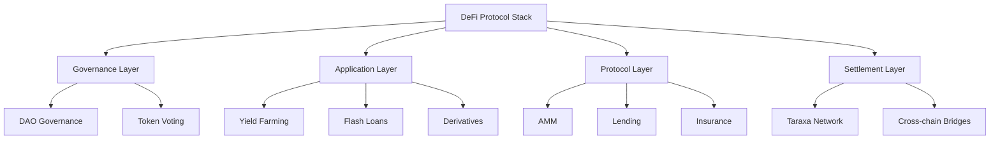

# บทที่ 15: Advanced DeFi

## 🎯 จุดประสงค์ของบทเรียน
- พัฒนา Advanced DeFi Protocols อย่างครบถ้วน
- สร้าง Yield Farming และ Liquidity Mining Systems
- ทำความเข้าใจ Flash Loans และ Arbitrage
- ออกแบบ Cross-chain DeFi Solutions

## 🌟 Advanced DeFi Architecture

### **🏗️ DeFi Protocol Stack**



## 💰 Advanced Yield Farming

### **🌾 Masterchef-style Yield Farm**

```solidity
// contracts/defi/YieldFarmV2.sol
// SPDX-License-Identifier: MIT
pragma solidity ^0.8.19;

import "@openzeppelin/contracts/token/ERC20/IERC20.sol";
import "@openzeppelin/contracts/token/ERC20/utils/SafeERC20.sol";
import "@openzeppelin/contracts/access/Ownable.sol";
import "@openzeppelin/contracts/security/ReentrancyGuard.sol";

/**
 * @title Advanced Yield Farming Contract
 * @dev Multi-pool yield farming with dynamic rewards and boost mechanisms
 */
contract YieldFarmV2 is Ownable, ReentrancyGuard {
    using SafeERC20 for IERC20;
    
    struct UserInfo {
        uint256 amount;          // LP tokens staked
        uint256 rewardDebt;      // Reward debt
        uint256 pendingRewards;  // Pending rewards
        uint256 lastDepositTime; // Last deposit timestamp
        uint256 boostMultiplier; // Boost multiplier (1000 = 1x)
    }
    
    struct PoolInfo {
        IERC20 lpToken;           // LP token contract
        uint256 allocPoint;       // Allocation points
        uint256 lastRewardBlock;  // Last reward block
        uint256 accRewardPerShare; // Accumulated rewards per share
        uint256 totalStaked;      // Total staked amount
        uint256 minStakingTime;   // Minimum staking time
        uint256 depositFee;       // Deposit fee (1000 = 10%)
        uint256 withdrawFee;      // Withdraw fee (1000 = 10%)
        bool emergencyWithdrawEnabled; // Emergency withdraw
    }
    
    IERC20 public rewardToken;
    uint256 public rewardPerBlock;
    uint256 public startBlock;
    uint256 public bonusEndBlock;
    uint256 public bonusMultiplier = 10; // 10x bonus during bonus period
    
    PoolInfo[] public poolInfo;
    mapping(uint256 => mapping(address => UserInfo)) public userInfo;
    mapping(address => bool) public authorizedBoostProviders;
    
    uint256 public totalAllocPoint = 0;
    uint256 public constant BONUS_MULTIPLIER = 1000;
    uint256 public constant MAX_DEPOSIT_FEE = 1000; // 10%
    uint256 public constant MAX_WITHDRAW_FEE = 500;  // 5%
    
    // Treasury and fee recipients
    address public treasury;
    address public devAddress;
    uint256 public treasuryFee = 100; // 1%
    uint256 public devFee = 100;      // 1%
    
    event Deposit(address indexed user, uint256 indexed pid, uint256 amount);
    event Withdraw(address indexed user, uint256 indexed pid, uint256 amount);
    event EmergencyWithdraw(address indexed user, uint256 indexed pid, uint256 amount);
    event RewardPaid(address indexed user, uint256 amount);
    event BoostActivated(address indexed user, uint256 indexed pid, uint256 multiplier);
    
    constructor(
        IERC20 _rewardToken,
        uint256 _rewardPerBlock,
        uint256 _startBlock,
        uint256 _bonusEndBlock,
        address _treasury,
        address _devAddress
    ) {
        rewardToken = _rewardToken;
        rewardPerBlock = _rewardPerBlock;
        startBlock = _startBlock;
        bonusEndBlock = _bonusEndBlock;
        treasury = _treasury;
        devAddress = _devAddress;
    }
    
    // Pool management
    function addPool(
        uint256 _allocPoint,
        IERC20 _lpToken,
        uint256 _minStakingTime,
        uint256 _depositFee,
        uint256 _withdrawFee,
        bool _withUpdate
    ) external onlyOwner {
        require(_depositFee <= MAX_DEPOSIT_FEE, "Deposit fee too high");
        require(_withdrawFee <= MAX_WITHDRAW_FEE, "Withdraw fee too high");
        
        if (_withUpdate) {
            massUpdatePools();
        }
        
        uint256 lastRewardBlock = block.number > startBlock ? block.number : startBlock;
        totalAllocPoint += _allocPoint;
        
        poolInfo.push(PoolInfo({
            lpToken: _lpToken,
            allocPoint: _allocPoint,
            lastRewardBlock: lastRewardBlock,
            accRewardPerShare: 0,
            totalStaked: 0,
            minStakingTime: _minStakingTime,
            depositFee: _depositFee,
            withdrawFee: _withdrawFee,
            emergencyWithdrawEnabled: false
        }));
    }
    
    function updatePool(uint256 _pid) public {
        PoolInfo storage pool = poolInfo[_pid];
        if (block.number <= pool.lastRewardBlock) {
            return;
        }
        
        uint256 lpSupply = pool.totalStaked;
        if (lpSupply == 0) {
            pool.lastRewardBlock = block.number;
            return;
        }
        
        uint256 multiplier = getMultiplier(pool.lastRewardBlock, block.number);
        uint256 reward = (multiplier * rewardPerBlock * pool.allocPoint) / totalAllocPoint;
        
        // Mint rewards for treasury and dev
        uint256 treasuryReward = (reward * treasuryFee) / 10000;
        uint256 devReward = (reward * devFee) / 10000;
        
        pool.accRewardPerShare += (reward * 1e12) / lpSupply;
        pool.lastRewardBlock = block.number;
        
        // Transfer treasury and dev fees if needed
        if (treasuryReward > 0) {
            rewardToken.safeTransfer(treasury, treasuryReward);
        }
        if (devReward > 0) {
            rewardToken.safeTransfer(devAddress, devReward);
        }
    }
    
    function massUpdatePools() public {
        uint256 length = poolInfo.length;
        for (uint256 pid = 0; pid < length; ++pid) {
            updatePool(pid);
        }
    }
    
    function deposit(uint256 _pid, uint256 _amount) external nonReentrant {
        PoolInfo storage pool = poolInfo[_pid];
        UserInfo storage user = userInfo[_pid][msg.sender];
        
        updatePool(_pid);
        
        if (user.amount > 0) {
            uint256 pending = ((user.amount * pool.accRewardPerShare) / 1e12) - user.rewardDebt;
            pending = (pending * user.boostMultiplier) / 1000;
            user.pendingRewards += pending;
        }
        
        if (_amount > 0) {
            uint256 balanceBefore = pool.lpToken.balanceOf(address(this));
            pool.lpToken.safeTransferFrom(msg.sender, address(this), _amount);
            uint256 balanceAfter = pool.lpToken.balanceOf(address(this));
            uint256 actualAmount = balanceAfter - balanceBefore;
            
            // Apply deposit fee
            if (pool.depositFee > 0) {
                uint256 depositFeeAmount = (actualAmount * pool.depositFee) / 10000;
                pool.lpToken.safeTransfer(treasury, depositFeeAmount);
                actualAmount -= depositFeeAmount;
            }
            
            user.amount += actualAmount;
            pool.totalStaked += actualAmount;
            user.lastDepositTime = block.timestamp;
            
            // Initialize boost multiplier if first deposit
            if (user.boostMultiplier == 0) {
                user.boostMultiplier = 1000; // 1x
            }
        }
        
        user.rewardDebt = (user.amount * pool.accRewardPerShare) / 1e12;
        emit Deposit(msg.sender, _pid, _amount);
    }
    
    function withdraw(uint256 _pid, uint256 _amount) external nonReentrant {
        PoolInfo storage pool = poolInfo[_pid];
        UserInfo storage user = userInfo[_pid][msg.sender];
        
        require(user.amount >= _amount, "Insufficient balance");
        require(
            block.timestamp >= user.lastDepositTime + pool.minStakingTime,
            "Min staking time not met"
        );
        
        updatePool(_pid);
        
        uint256 pending = ((user.amount * pool.accRewardPerShare) / 1e12) - user.rewardDebt;
        pending = (pending * user.boostMultiplier) / 1000;
        user.pendingRewards += pending;
        
        if (_amount > 0) {
            user.amount -= _amount;
            pool.totalStaked -= _amount;
            
            // Apply withdraw fee
            uint256 withdrawAmount = _amount;
            if (pool.withdrawFee > 0) {
                uint256 withdrawFeeAmount = (_amount * pool.withdrawFee) / 10000;
                pool.lpToken.safeTransfer(treasury, withdrawFeeAmount);
                withdrawAmount -= withdrawFeeAmount;
            }
            
            pool.lpToken.safeTransfer(msg.sender, withdrawAmount);
        }
        
        user.rewardDebt = (user.amount * pool.accRewardPerShare) / 1e12;
        emit Withdraw(msg.sender, _pid, _amount);
    }
    
    function claimRewards(uint256 _pid) external nonReentrant {
        PoolInfo storage pool = poolInfo[_pid];
        UserInfo storage user = userInfo[_pid][msg.sender];
        
        updatePool(_pid);
        
        uint256 pending = ((user.amount * pool.accRewardPerShare) / 1e12) - user.rewardDebt;
        pending = (pending * user.boostMultiplier) / 1000;
        uint256 totalRewards = user.pendingRewards + pending;
        
        if (totalRewards > 0) {
            user.pendingRewards = 0;
            rewardToken.safeTransfer(msg.sender, totalRewards);
            emit RewardPaid(msg.sender, totalRewards);
        }
        
        user.rewardDebt = (user.amount * pool.accRewardPerShare) / 1e12;
    }
    
    // Boost mechanism
    function activateBoost(
        address _user,
        uint256 _pid,
        uint256 _multiplier
    ) external {
        require(authorizedBoostProviders[msg.sender], "Not authorized");
        require(_multiplier >= 1000 && _multiplier <= 3000, "Invalid multiplier"); // 1x to 3x
        
        UserInfo storage user = userInfo[_pid][_user];
        user.boostMultiplier = _multiplier;
        
        emit BoostActivated(_user, _pid, _multiplier);
    }
    
    function getMultiplier(uint256 _from, uint256 _to) public view returns (uint256) {
        if (_to <= bonusEndBlock) {
            return (_to - _from) * bonusMultiplier;
        } else if (_from >= bonusEndBlock) {
            return _to - _from;
        } else {
            return (bonusEndBlock - _from) * bonusMultiplier + (_to - bonusEndBlock);
        }
    }
    
    function pendingReward(uint256 _pid, address _user) external view returns (uint256) {
        PoolInfo storage pool = poolInfo[_pid];
        UserInfo storage user = userInfo[_pid][_user];
        uint256 accRewardPerShare = pool.accRewardPerShare;
        uint256 lpSupply = pool.totalStaked;
        
        if (block.number > pool.lastRewardBlock && lpSupply != 0) {
            uint256 multiplier = getMultiplier(pool.lastRewardBlock, block.number);
            uint256 reward = (multiplier * rewardPerBlock * pool.allocPoint) / totalAllocPoint;
            accRewardPerShare += (reward * 1e12) / lpSupply;
        }
        
        uint256 pending = ((user.amount * accRewardPerShare) / 1e12) - user.rewardDebt;
        pending = (pending * user.boostMultiplier) / 1000;
        return user.pendingRewards + pending;
    }
    
    // Admin functions
    function setRewardPerBlock(uint256 _rewardPerBlock) external onlyOwner {
        massUpdatePools();
        rewardPerBlock = _rewardPerBlock;
    }
    
    function setTreasury(address _treasury) external onlyOwner {
        treasury = _treasury;
    }
    
    function setBoostProvider(address _provider, bool _authorized) external onlyOwner {
        authorizedBoostProviders[_provider] = _authorized;
    }
    
    function emergencyWithdraw(uint256 _pid) external nonReentrant {
        PoolInfo storage pool = poolInfo[_pid];
        require(pool.emergencyWithdrawEnabled, "Emergency withdraw disabled");
        
        UserInfo storage user = userInfo[_pid][msg.sender];
        uint256 amount = user.amount;
        
        user.amount = 0;
        user.rewardDebt = 0;
        user.pendingRewards = 0;
        pool.totalStaked -= amount;
        
        pool.lpToken.safeTransfer(msg.sender, amount);
        emit EmergencyWithdraw(msg.sender, _pid, amount);
    }
}
```

## ⚡ Flash Loan Implementation

### **💸 Flash Loan Provider**

```solidity
// contracts/defi/FlashLoanProvider.sol
// SPDX-License-Identifier: MIT
pragma solidity ^0.8.19;

import "@openzeppelin/contracts/token/ERC20/IERC20.sol";
import "@openzeppelin/contracts/token/ERC20/utils/SafeERC20.sol";
import "@openzeppelin/contracts/security/ReentrancyGuard.sol";
import "@openzeppelin/contracts/access/Ownable.sol";

interface IFlashLoanReceiver {
    function executeOperation(
        address asset,
        uint256 amount,
        uint256 fee,
        bytes calldata params
    ) external returns (bool);
}

/**
 * @title FlashLoanProvider
 * @dev Provides flash loans with dynamic fees
 */
contract FlashLoanProvider is Ownable, ReentrancyGuard {
    using SafeERC20 for IERC20;
    
    struct LoanInfo {
        address asset;
        uint256 amount;
        uint256 fee;
        address receiver;
        bool active;
    }
    
    mapping(address => uint256) public assetBalances;
    mapping(address => uint256) public flashLoanFees; // Fee in basis points (100 = 1%)
    mapping(address => bool) public supportedAssets;
    mapping(bytes32 => LoanInfo) public activeLoans;
    
    uint256 public defaultFlashLoanFee = 30; // 0.3%
    uint256 public maxFlashLoanFee = 1000;   // 10%
    address public feeRecipient;
    
    event FlashLoan(
        address indexed receiver,
        address indexed asset,
        uint256 amount,
        uint256 fee
    );
    
    event AssetAdded(address indexed asset, uint256 fee);
    event AssetRemoved(address indexed asset);
    event FeeUpdated(address indexed asset, uint256 oldFee, uint256 newFee);
    
    modifier onlyActiveAsset(address asset) {
        require(supportedAssets[asset], "Asset not supported");
        _;
    }
    
    constructor(address _feeRecipient) {
        feeRecipient = _feeRecipient;
    }
    
    function addAsset(address asset, uint256 fee) external onlyOwner {
        require(asset != address(0), "Invalid asset");
        require(fee <= maxFlashLoanFee, "Fee too high");
        
        supportedAssets[asset] = true;
        flashLoanFees[asset] = fee;
        
        emit AssetAdded(asset, fee);
    }
    
    function removeAsset(address asset) external onlyOwner {
        supportedAssets[asset] = false;
        delete flashLoanFees[asset];
        
        emit AssetRemoved(asset);
    }
    
    function flashLoan(
        address receiver,
        address asset,
        uint256 amount,
        bytes calldata params
    ) external nonReentrant onlyActiveAsset(asset) {
        require(amount > 0, "Amount must be positive");
        require(receiver != address(0), "Invalid receiver");
        
        IERC20 token = IERC20(asset);
        uint256 availableBalance = token.balanceOf(address(this));
        require(availableBalance >= amount, "Insufficient liquidity");
        
        uint256 fee = calculateFee(asset, amount);
        bytes32 loanId = keccak256(abi.encodePacked(receiver, asset, amount, block.timestamp));
        
        // Store loan info
        activeLoans[loanId] = LoanInfo({
            asset: asset,
            amount: amount,
            fee: fee,
            receiver: receiver,
            active: true
        });
        
        // Transfer funds to receiver
        token.safeTransfer(receiver, amount);
        
        // Execute receiver callback
        require(
            IFlashLoanReceiver(receiver).executeOperation(asset, amount, fee, params),
            "Flash loan execution failed"
        );
        
        // Ensure repayment
        uint256 balanceAfter = token.balanceOf(address(this));
        require(
            balanceAfter >= availableBalance + fee,
            "Flash loan not repaid"
        );
        
        // Clean up
        delete activeLoans[loanId];
        
        // Transfer fee to recipient
        if (fee > 0) {
            token.safeTransfer(feeRecipient, fee);
        }
        
        emit FlashLoan(receiver, asset, amount, fee);
    }
    
    function calculateFee(address asset, uint256 amount) public view returns (uint256) {
        uint256 feeRate = flashLoanFees[asset];
        if (feeRate == 0) {
            feeRate = defaultFlashLoanFee;
        }
        return (amount * feeRate) / 10000;
    }
    
    function getAvailableLiquidity(address asset) external view returns (uint256) {
        if (!supportedAssets[asset]) return 0;
        return IERC20(asset).balanceOf(address(this));
    }
    
    function deposit(address asset, uint256 amount) external onlyActiveAsset(asset) {
        IERC20(asset).safeTransferFrom(msg.sender, address(this), amount);
        assetBalances[asset] += amount;
    }
    
    function withdraw(address asset, uint256 amount) external onlyOwner {
        require(assetBalances[asset] >= amount, "Insufficient balance");
        
        IERC20(asset).safeTransfer(msg.sender, amount);
        assetBalances[asset] -= amount;
    }
    
    // Admin functions
    function setFee(address asset, uint256 fee) external onlyOwner {
        require(fee <= maxFlashLoanFee, "Fee too high");
        
        uint256 oldFee = flashLoanFees[asset];
        flashLoanFees[asset] = fee;
        
        emit FeeUpdated(asset, oldFee, fee);
    }
    
    function setDefaultFee(uint256 fee) external onlyOwner {
        require(fee <= maxFlashLoanFee, "Fee too high");
        defaultFlashLoanFee = fee;
    }
    
    function setFeeRecipient(address _feeRecipient) external onlyOwner {
        require(_feeRecipient != address(0), "Invalid recipient");
        feeRecipient = _feeRecipient;
    }
}
```

### **🔄 Arbitrage Bot Example**

```solidity
// contracts/defi/ArbitrageBot.sol
// SPDX-License-Identifier: MIT
pragma solidity ^0.8.19;

import "@openzeppelin/contracts/token/ERC20/IERC20.sol";
import "@openzeppelin/contracts/token/ERC20/utils/SafeERC20.sol";
import "./FlashLoanProvider.sol";

interface IAMM {
    function swapExactTokensForTokens(
        uint256 amountIn,
        uint256 amountOutMin,
        address[] calldata path,
        address to,
        uint256 deadline
    ) external returns (uint256[] memory amounts);
    
    function getAmountOut(uint256 amountIn, uint256 reserveIn, uint256 reserveOut)
        external pure returns (uint256 amountOut);
}

/**
 * @title ArbitrageBot
 * @dev Automated arbitrage using flash loans
 */
contract ArbitrageBot is IFlashLoanReceiver {
    using SafeERC20 for IERC20;
    
    address public owner;
    FlashLoanProvider public flashLoanProvider;
    
    struct ArbitrageParams {
        address tokenA;
        address tokenB;
        address ammA;
        address ammB;
        uint256 minProfit;
        bool swapDirection; // true: A->B on ammA, B->A on ammB
    }
    
    event ArbitrageExecuted(
        address indexed tokenA,
        address indexed tokenB,
        uint256 profit,
        uint256 amount
    );
    
    modifier onlyOwner() {
        require(msg.sender == owner, "Not owner");
        _;
    }
    
    constructor(address _flashLoanProvider) {
        owner = msg.sender;
        flashLoanProvider = FlashLoanProvider(_flashLoanProvider);
    }
    
    function executeArbitrage(
        address asset,
        uint256 amount,
        ArbitrageParams memory params
    ) external onlyOwner {
        bytes memory data = abi.encode(params);
        flashLoanProvider.flashLoan(address(this), asset, amount, data);
    }
    
    function executeOperation(
        address asset,
        uint256 amount,
        uint256 fee,
        bytes calldata params
    ) external override returns (bool) {
        require(msg.sender == address(flashLoanProvider), "Invalid caller");
        
        ArbitrageParams memory arbParams = abi.decode(params, (ArbitrageParams));
        
        uint256 initialBalance = IERC20(asset).balanceOf(address(this));
        uint256 profit = _performArbitrage(asset, amount, arbParams);
        
        require(profit >= arbParams.minProfit, "Insufficient profit");
        
        // Repay flash loan
        uint256 repayAmount = amount + fee;
        IERC20(asset).safeTransfer(address(flashLoanProvider), repayAmount);
        
        emit ArbitrageExecuted(arbParams.tokenA, arbParams.tokenB, profit, amount);
        
        return true;
    }
    
    function _performArbitrage(
        address asset,
        uint256 amount,
        ArbitrageParams memory params
    ) internal returns (uint256 profit) {
        IERC20 tokenA = IERC20(params.tokenA);
        IERC20 tokenB = IERC20(params.tokenB);
        
        uint256 initialBalance = IERC20(asset).balanceOf(address(this));
        
        if (params.swapDirection) {
            // Swap A -> B on AMM A
            tokenA.safeApprove(params.ammA, amount);
            address[] memory path1 = new address[](2);
            path1[0] = params.tokenA;
            path1[1] = params.tokenB;
            
            uint256[] memory amounts1 = IAMM(params.ammA).swapExactTokensForTokens(
                amount,
                0,
                path1,
                address(this),
                block.timestamp + 300
            );
            
            // Swap B -> A on AMM B
            uint256 tokenBAmount = amounts1[1];
            tokenB.safeApprove(params.ammB, tokenBAmount);
            address[] memory path2 = new address[](2);
            path2[0] = params.tokenB;
            path2[1] = params.tokenA;
            
            IAMM(params.ammB).swapExactTokensForTokens(
                tokenBAmount,
                amount, // At least break even
                path2,
                address(this),
                block.timestamp + 300
            );
        } else {
            // Reverse direction
            tokenA.safeApprove(params.ammB, amount);
            address[] memory path1 = new address[](2);
            path1[0] = params.tokenA;
            path1[1] = params.tokenB;
            
            uint256[] memory amounts1 = IAMM(params.ammB).swapExactTokensForTokens(
                amount,
                0,
                path1,
                address(this),
                block.timestamp + 300
            );
            
            uint256 tokenBAmount = amounts1[1];
            tokenB.safeApprove(params.ammA, tokenBAmount);
            address[] memory path2 = new address[](2);
            path2[0] = params.tokenB;
            path2[1] = params.tokenA;
            
            IAMM(params.ammA).swapExactTokensForTokens(
                tokenBAmount,
                amount,
                path2,
                address(this),
                block.timestamp + 300
            );
        }
        
        uint256 finalBalance = IERC20(asset).balanceOf(address(this));
        profit = finalBalance > initialBalance ? finalBalance - initialBalance : 0;
    }
    
    function calculateArbitrageProfit(
        address tokenA,
        address tokenB,
        uint256 amount,
        address ammA,
        address ammB
    ) external view returns (uint256 profitA2B, uint256 profitB2A) {
        // Calculate profit for A->B->A arbitrage
        // This would require calling getAmountOut on both AMMs
        // Implementation details depend on specific AMM interfaces
        
        // Simplified calculation (actual implementation would be more complex)
        profitA2B = 0; // Placeholder
        profitB2A = 0; // Placeholder
    }
    
    function withdrawProfits(address token) external onlyOwner {
        uint256 balance = IERC20(token).balanceOf(address(this));
        IERC20(token).safeTransfer(owner, balance);
    }
    
    function emergencyWithdraw(address token) external onlyOwner {
        uint256 balance = IERC20(token).balanceOf(address(this));
        if (balance > 0) {
            IERC20(token).safeTransfer(owner, balance);
        }
    }
}
```

## 🌉 Cross-Chain DeFi

### **🔗 Cross-Chain Bridge**

```solidity
// contracts/defi/CrossChainBridge.sol
// SPDX-License-Identifier: MIT
pragma solidity ^0.8.19;

import "@openzeppelin/contracts/token/ERC20/IERC20.sol";
import "@openzeppelin/contracts/token/ERC20/utils/SafeERC20.sol";
import "@openzeppelin/contracts/access/AccessControl.sol";
import "@openzeppelin/contracts/security/ReentrancyGuard.sol";
import "@openzeppelin/contracts/security/Pausable.sol";

/**
 * @title CrossChainBridge
 * @dev Bridge for transferring tokens between chains
 */
contract CrossChainBridge is AccessControl, ReentrancyGuard, Pausable {
    using SafeERC20 for IERC20;
    
    bytes32 public constant BRIDGE_OPERATOR_ROLE = keccak256("BRIDGE_OPERATOR_ROLE");
    bytes32 public constant VALIDATOR_ROLE = keccak256("VALIDATOR_ROLE");
    
    struct BridgeTransaction {
        address token;
        address sender;
        address recipient;
        uint256 amount;
        uint256 targetChain;
        uint256 nonce;
        bool executed;
        uint256 validatorSignatures;
        mapping(address => bool) hasValidatorSigned;
    }
    
    mapping(bytes32 => BridgeTransaction) public bridgeTransactions;
    mapping(address => bool) public supportedTokens;
    mapping(uint256 => bool) public supportedChains;
    mapping(address => uint256) public nonces;
    
    uint256 public requiredValidators = 3;
    uint256 public totalValidators = 0;
    uint256 public bridgeFee = 100; // 1% in basis points
    address public feeRecipient;
    
    event TokenLocked(
        bytes32 indexed txId,
        address indexed token,
        address indexed sender,
        address recipient,
        uint256 amount,
        uint256 targetChain,
        uint256 nonce
    );
    
    event TokenUnlocked(
        bytes32 indexed txId,
        address indexed token,
        address indexed recipient,
        uint256 amount
    );
    
    event ValidatorSigned(bytes32 indexed txId, address indexed validator);
    
    constructor(address _feeRecipient) {
        _grantRole(DEFAULT_ADMIN_ROLE, msg.sender);
        _grantRole(BRIDGE_OPERATOR_ROLE, msg.sender);
        feeRecipient = _feeRecipient;
    }
    
    function lockTokens(
        address token,
        address recipient,
        uint256 amount,
        uint256 targetChain
    ) external nonReentrant whenNotPaused {
        require(supportedTokens[token], "Token not supported");
        require(supportedChains[targetChain], "Chain not supported");
        require(amount > 0, "Amount must be positive");
        require(recipient != address(0), "Invalid recipient");
        
        IERC20(token).safeTransferFrom(msg.sender, address(this), amount);
        
        // Calculate fee
        uint256 fee = (amount * bridgeFee) / 10000;
        uint256 bridgeAmount = amount - fee;
        
        if (fee > 0) {
            IERC20(token).safeTransfer(feeRecipient, fee);
        }
        
        uint256 nonce = nonces[msg.sender]++;
        bytes32 txId = keccak256(abi.encodePacked(
            token,
            msg.sender,
            recipient,
            bridgeAmount,
            targetChain,
            nonce,
            block.chainid
        ));
        
        BridgeTransaction storage bridgeTx = bridgeTransactions[txId];
        bridgeTx.token = token;
        bridgeTx.sender = msg.sender;
        bridgeTx.recipient = recipient;
        bridgeTx.amount = bridgeAmount;
        bridgeTx.targetChain = targetChain;
        bridgeTx.nonce = nonce;
        bridgeTx.executed = false;
        bridgeTx.validatorSignatures = 0;
        
        emit TokenLocked(txId, token, msg.sender, recipient, bridgeAmount, targetChain, nonce);
    }
    
    function validateTransaction(bytes32 txId) external onlyRole(VALIDATOR_ROLE) {
        BridgeTransaction storage bridgeTx = bridgeTransactions[txId];
        require(bridgeTx.amount > 0, "Transaction not found");
        require(!bridgeTx.executed, "Already executed");
        require(!bridgeTx.hasValidatorSigned[msg.sender], "Already signed");
        
        bridgeTx.hasValidatorSigned[msg.sender] = true;
        bridgeTx.validatorSignatures++;
        
        emit ValidatorSigned(txId, msg.sender);
        
        // Auto-execute if enough signatures
        if (bridgeTx.validatorSignatures >= requiredValidators) {
            _executeUnlock(txId);
        }
    }
    
    function unlockTokens(bytes32 txId) external onlyRole(BRIDGE_OPERATOR_ROLE) {
        BridgeTransaction storage bridgeTx = bridgeTransactions[txId];
        require(bridgeTx.validatorSignatures >= requiredValidators, "Insufficient signatures");
        _executeUnlock(txId);
    }
    
    function _executeUnlock(bytes32 txId) internal {
        BridgeTransaction storage bridgeTx = bridgeTransactions[txId];
        require(!bridgeTx.executed, "Already executed");
        
        bridgeTx.executed = true;
        
        IERC20(bridgeTx.token).safeTransfer(bridgeTx.recipient, bridgeTx.amount);
        
        emit TokenUnlocked(txId, bridgeTx.token, bridgeTx.recipient, bridgeTx.amount);
    }
    
    // Admin functions
    function addSupportedToken(address token) external onlyRole(BRIDGE_OPERATOR_ROLE) {
        supportedTokens[token] = true;
    }
    
    function removeSupportedToken(address token) external onlyRole(BRIDGE_OPERATOR_ROLE) {
        supportedTokens[token] = false;
    }
    
    function addSupportedChain(uint256 chainId) external onlyRole(BRIDGE_OPERATOR_ROLE) {
        supportedChains[chainId] = true;
    }
    
    function removeSupportedChain(uint256 chainId) external onlyRole(BRIDGE_OPERATOR_ROLE) {
        supportedChains[chainId] = false;
    }
    
    function addValidator(address validator) external onlyRole(DEFAULT_ADMIN_ROLE) {
        _grantRole(VALIDATOR_ROLE, validator);
        totalValidators++;
    }
    
    function removeValidator(address validator) external onlyRole(DEFAULT_ADMIN_ROLE) {
        _revokeRole(VALIDATOR_ROLE, validator);
        totalValidators--;
    }
    
    function setRequiredValidators(uint256 _required) external onlyRole(DEFAULT_ADMIN_ROLE) {
        require(_required <= totalValidators, "Too many required validators");
        require(_required > 0, "Must require at least 1 validator");
        requiredValidators = _required;
    }
    
    function setBridgeFee(uint256 _fee) external onlyRole(DEFAULT_ADMIN_ROLE) {
        require(_fee <= 1000, "Fee too high"); // Max 10%
        bridgeFee = _fee;
    }
    
    function pause() external onlyRole(BRIDGE_OPERATOR_ROLE) {
        _pause();
    }
    
    function unpause() external onlyRole(BRIDGE_OPERATOR_ROLE) {
        _unpause();
    }
    
    function emergencyWithdraw(address token, uint256 amount) external onlyRole(DEFAULT_ADMIN_ROLE) {
        IERC20(token).safeTransfer(msg.sender, amount);
    }
}
```

## 📋 แบบฝึกหัด

### **🎯 แบบฝึกหัดที่ 1: Advanced Yield Strategy**
สร้าง yield optimization vault:
1. Auto-compounding rewards
2. Strategy switching based on APY
3. Risk management features

### **⚡ แบบฝึกหัดที่ 2: Flash Loan Arbitrage**
พัฒนา arbitrage system:
1. Multi-DEX price monitoring
2. Automated profit calculation
3. Gas optimization for trades

### **🌉 แบบฝึกหัดที่ 3: Cross-Chain Liquidity**
สร้าง cross-chain liquidity solution:
1. Multi-chain asset management
2. Unified liquidity pools
3. Cross-chain yield farming

## 🔗 การเชื่อมต่อ

**บทก่อนหน้า**: [บทที่ 14: Upgrade Patterns](./14-upgrade-patterns.md)  
**บทถัดไป**: [บทที่ 16: Oracle Integration](./16-oracle-integration.md)

**กลับไปหน้าหลัก**: [README](./README.md)

---

## 📚 เอกสารอ้างอิง

- [DeFi Pulse](https://defipulse.com/)
- [Compound Protocol](https://compound.finance/docs)
- [Aave Flash Loans](https://docs.aave.com/developers/v/2.0/guides/flash-loans)
- [Uniswap V3](https://docs.uniswap.org/protocol/V3/introduction)

---

ตอนนี้คุณสามารถสร้าง Advanced DeFi Protocols ที่ซับซ้อนและมีประสิทธิภาพสูง! 💰🚀
