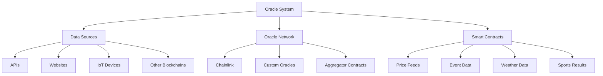

# บทที่ 16: Oracle Integration

## 🎯 จุดประสงค์ของบทเรียน
- ทำความเข้าใจ Oracle และความสำคัญใน DeFi
- เชื่อมต่อ Chainlink และ External Data Sources
- สร้าง Custom Oracle สำหรับ Taraxa Network
- จัดการ Price Feeds และ Data Validation

## 🔮 Oracle Fundamentals

### **📊 Oracle Architecture**



## ⛓️ Chainlink Integration

### **💰 Price Feed Consumer**

```solidity
// contracts/oracles/PriceFeedConsumer.sol
// SPDX-License-Identifier: MIT
pragma solidity ^0.8.19;

import "@chainlink/contracts/src/v0.8/interfaces/AggregatorV3Interface.sol";
import "@openzeppelin/contracts/access/Ownable.sol";

/**
 * @title PriceFeedConsumer
 * @dev Consumes Chainlink price feeds with validation and fallback mechanisms
 */
contract PriceFeedConsumer is Ownable {
    struct PriceFeed {
        AggregatorV3Interface priceFeed;
        uint256 heartbeat;      // Maximum time between updates
        uint256 decimals;       // Price feed decimals
        bool isActive;          // Whether the feed is active
        uint256 lastUpdate;     // Last successful update timestamp
        int256 lastPrice;       // Last valid price
    }
    
    mapping(string => PriceFeed) public priceFeeds;
    mapping(string => string) public feedAliases; // symbol -> feed key
    
    uint256 public constant PRICE_PRECISION = 1e18;
    uint256 public constant MAX_PRICE_AGE = 3600; // 1 hour default
    uint256 public constant PRICE_DEVIATION_THRESHOLD = 1000; // 10%
    
    event PriceFeedAdded(string indexed symbol, address indexed feedAddress);
    event PriceFeedUpdated(string indexed symbol, int256 price, uint256 timestamp);
    event PriceFeedDisabled(string indexed symbol, string reason);
    
    error PriceFeedNotFound(string symbol);
    error StalePrice(string symbol, uint256 lastUpdate);
    error InvalidPrice(string symbol, int256 price);
    error PriceDeviationTooHigh(string symbol, int256 oldPrice, int256 newPrice);
    
    constructor() {}
    
    /**
     * @dev Add a new price feed
     */
    function addPriceFeed(
        string memory symbol,
        address feedAddress,
        uint256 heartbeat
    ) external onlyOwner {
        require(feedAddress != address(0), "Invalid feed address");
        require(heartbeat > 0, "Invalid heartbeat");
        
        AggregatorV3Interface priceFeed = AggregatorV3Interface(feedAddress);
        uint256 decimals = priceFeed.decimals();
        
        priceFeeds[symbol] = PriceFeed({
            priceFeed: priceFeed,
            heartbeat: heartbeat,
            decimals: decimals,
            isActive: true,
            lastUpdate: 0,
            lastPrice: 0
        });
        
        feedAliases[symbol] = symbol;
        
        emit PriceFeedAdded(symbol, feedAddress);
    }
    
    /**
     * @dev Get the latest price for a symbol
     */
    function getLatestPrice(string memory symbol) 
        external 
        view 
        returns (int256 price, uint256 timestamp) 
    {
        PriceFeed memory feed = priceFeeds[symbol];
        if (address(feed.priceFeed) == address(0)) {
            revert PriceFeedNotFound(symbol);
        }
        
        if (!feed.isActive) {
            revert PriceFeedNotFound(symbol);
        }
        
        (
            uint80 roundId,
            int256 rawPrice,
            uint256 startedAt,
            uint256 updatedAt,
            uint80 answeredInRound
        ) = feed.priceFeed.latestRoundData();
        
        require(rawPrice > 0, "Invalid price from oracle");
        require(updatedAt > 0, "Round not complete");
        require(block.timestamp - updatedAt <= feed.heartbeat, "Price too stale");
        require(answeredInRound >= roundId, "Stale price");
        
        // Convert to standard 18 decimal format
        if (feed.decimals != 18) {
            if (feed.decimals < 18) {
                price = rawPrice * int256(10**(18 - feed.decimals));
            } else {
                price = rawPrice / int256(10**(feed.decimals - 18));
            }
        } else {
            price = rawPrice;
        }
        
        timestamp = updatedAt;
    }
    
    /**
     * @dev Get price with validation
     */
    function getValidatedPrice(string memory symbol) 
        external 
        view 
        returns (int256 price, uint256 timestamp) 
    {
        (price, timestamp) = this.getLatestPrice(symbol);
        
        PriceFeed memory feed = priceFeeds[symbol];
        
        // Additional validation against previous price
        if (feed.lastPrice > 0) {
            uint256 deviation = _calculateDeviation(feed.lastPrice, price);
            if (deviation > PRICE_DEVIATION_THRESHOLD) {
                revert PriceDeviationTooHigh(symbol, feed.lastPrice, price);
            }
        }
    }
    
    /**
     * @dev Get multiple prices at once
     */
    function getMultiplePrices(string[] memory symbols) 
        external 
        view 
        returns (int256[] memory prices, uint256[] memory timestamps) 
    {
        uint256 length = symbols.length;
        prices = new int256[](length);
        timestamps = new uint256[](length);
        
        for (uint256 i = 0; i < length; i++) {
            try this.getLatestPrice(symbols[i]) returns (int256 price, uint256 timestamp) {
                prices[i] = price;
                timestamps[i] = timestamp;
            } catch {
                prices[i] = 0;
                timestamps[i] = 0;
            }
        }
    }
    
    /**
     * @dev Calculate percentage deviation between two prices
     */
    function _calculateDeviation(int256 oldPrice, int256 newPrice) 
        internal 
        pure 
        returns (uint256) 
    {
        if (oldPrice == 0) return 0;
        
        int256 diff = newPrice > oldPrice ? newPrice - oldPrice : oldPrice - newPrice;
        return uint256((diff * 10000) / oldPrice); // Return in basis points
    }
    
    /**
     * @dev Update the last known price (called by trusted updater)
     */
    function updateLastPrice(string memory symbol) external {
        PriceFeed storage feed = priceFeeds[symbol];
        require(address(feed.priceFeed) != address(0), "Feed not found");
        
        try this.getLatestPrice(symbol) returns (int256 price, uint256 timestamp) {
            feed.lastPrice = price;
            feed.lastUpdate = timestamp;
            emit PriceFeedUpdated(symbol, price, timestamp);
        } catch {
            // Handle failed update
            feed.isActive = false;
            emit PriceFeedDisabled(symbol, "Price update failed");
        }
    }
    
    /**
     * @dev Disable a price feed
     */
    function disablePriceFeed(string memory symbol, string memory reason) 
        external 
        onlyOwner 
    {
        priceFeeds[symbol].isActive = false;
        emit PriceFeedDisabled(symbol, reason);
    }
    
    /**
     * @dev Enable a price feed
     */
    function enablePriceFeed(string memory symbol) external onlyOwner {
        require(address(priceFeeds[symbol].priceFeed) != address(0), "Feed not found");
        priceFeeds[symbol].isActive = true;
    }
    
    /**
     * @dev Check if a price feed exists and is active
     */
    function isPriceFeedActive(string memory symbol) external view returns (bool) {
        return address(priceFeeds[symbol].priceFeed) != address(0) && 
               priceFeeds[symbol].isActive;
    }
    
    /**
     * @dev Get price feed info
     */
    function getPriceFeedInfo(string memory symbol) 
        external 
        view 
        returns (
            address feedAddress,
            uint256 heartbeat,
            uint256 decimals,
            bool isActive,
            uint256 lastUpdate,
            int256 lastPrice
        ) 
    {
        PriceFeed memory feed = priceFeeds[symbol];
        return (
            address(feed.priceFeed),
            feed.heartbeat,
            feed.decimals,
            feed.isActive,
            feed.lastUpdate,
            feed.lastPrice
        );
    }
}
```

## 🏗️ Custom Oracle Implementation

### **🔮 Custom Oracle Network**

```solidity
// contracts/oracles/CustomOracle.sol
// SPDX-License-Identifier: MIT
pragma solidity ^0.8.19;

import "@openzeppelin/contracts/access/AccessControl.sol";
import "@openzeppelin/contracts/security/ReentrancyGuard.sol";

/**
 * @title CustomOracle
 * @dev Custom oracle implementation for Taraxa-specific data
 */
contract CustomOracle is AccessControl, ReentrancyGuard {
    bytes32 public constant ORACLE_ROLE = keccak256("ORACLE_ROLE");
    bytes32 public constant ADMIN_ROLE = keccak256("ADMIN_ROLE");
    
    struct DataPoint {
        int256 value;
        uint256 timestamp;
        address oracle;
        bool isValid;
    }
    
    struct AggregatedData {
        int256 value;
        uint256 timestamp;
        uint256 confidence; // 0-10000 (100%)
        uint256 sourceCount;
    }
    
    struct DataFeed {
        string name;
        string description;
        uint256 aggregationMethod; // 0: median, 1: mean, 2: weighted
        uint256 minSources;
        uint256 maxDeviation; // Max allowed deviation in basis points
        uint256 updateFrequency; // Minimum time between updates
        bool isActive;
        AggregatedData latest;
        mapping(address => DataPoint) submissions;
        address[] submitters;
    }
    
    mapping(bytes32 => DataFeed) public dataFeeds;
    mapping(address => uint256) public oracleWeights; // Weight for weighted aggregation
    mapping(address => mapping(bytes32 => uint256)) public lastSubmissionTime;
    
    bytes32[] public activeFeedIds;
    uint256 public totalOracleWeight;
    uint256 public submissionReward = 0.01 ether;
    
    event DataFeedCreated(bytes32 indexed feedId, string name, string description);
    event DataSubmitted(bytes32 indexed feedId, address indexed oracle, int256 value, uint256 timestamp);
    event DataAggregated(bytes32 indexed feedId, int256 value, uint256 confidence);
    event OracleAdded(address indexed oracle, uint256 weight);
    event OracleRemoved(address indexed oracle);
    
    error DataFeedNotFound(bytes32 feedId);
    error InsufficientSources(bytes32 feedId, uint256 required, uint256 provided);
    error SubmissionTooFrequent(bytes32 feedId, address oracle);
    error DeviationTooHigh(bytes32 feedId, int256 submitted, int256 expected);
    
    constructor() {
        _grantRole(DEFAULT_ADMIN_ROLE, msg.sender);
        _grantRole(ADMIN_ROLE, msg.sender);
        _grantRole(ORACLE_ROLE, msg.sender);
        
        oracleWeights[msg.sender] = 100;
        totalOracleWeight = 100;
    }
    
    /**
     * @dev Create a new data feed
     */
    function createDataFeed(
        bytes32 feedId,
        string memory name,
        string memory description,
        uint256 aggregationMethod,
        uint256 minSources,
        uint256 maxDeviation,
        uint256 updateFrequency
    ) external onlyRole(ADMIN_ROLE) {
        require(bytes(dataFeeds[feedId].name).length == 0, "Feed already exists");
        require(minSources > 0, "Min sources must be > 0");
        require(maxDeviation <= 10000, "Max deviation too high");
        
        DataFeed storage feed = dataFeeds[feedId];
        feed.name = name;
        feed.description = description;
        feed.aggregationMethod = aggregationMethod;
        feed.minSources = minSources;
        feed.maxDeviation = maxDeviation;
        feed.updateFrequency = updateFrequency;
        feed.isActive = true;
        
        activeFeedIds.push(feedId);
        
        emit DataFeedCreated(feedId, name, description);
    }
    
    /**
     * @dev Submit data to a feed
     */
    function submitData(
        bytes32 feedId,
        int256 value,
        bytes memory signature
    ) external onlyRole(ORACLE_ROLE) nonReentrant {
        DataFeed storage feed = dataFeeds[feedId];
        require(feed.isActive, "Feed not active");
        
        // Check submission frequency
        uint256 timeSinceLastSubmission = block.timestamp - lastSubmissionTime[msg.sender][feedId];
        if (timeSinceLastSubmission < feed.updateFrequency) {
            revert SubmissionTooFrequent(feedId, msg.sender);
        }
        
        // Validate data if there's a previous aggregated value
        if (feed.latest.timestamp > 0 && feed.maxDeviation > 0) {
            uint256 deviation = _calculateDeviation(feed.latest.value, value);
            if (deviation > feed.maxDeviation) {
                revert DeviationTooHigh(feedId, value, feed.latest.value);
            }
        }
        
        // Store submission
        DataPoint storage submission = feed.submissions[msg.sender];
        submission.value = value;
        submission.timestamp = block.timestamp;
        submission.oracle = msg.sender;
        submission.isValid = true;
        
        // Add to submitters if not already present
        bool isNewSubmitter = true;
        for (uint256 i = 0; i < feed.submitters.length; i++) {
            if (feed.submitters[i] == msg.sender) {
                isNewSubmitter = false;
                break;
            }
        }
        if (isNewSubmitter) {
            feed.submitters.push(msg.sender);
        }
        
        lastSubmissionTime[msg.sender][feedId] = block.timestamp;
        
        emit DataSubmitted(feedId, msg.sender, value, block.timestamp);
        
        // Try to aggregate
        _tryAggregate(feedId);
        
        // Reward oracle
        if (submissionReward > 0 && address(this).balance >= submissionReward) {
            payable(msg.sender).transfer(submissionReward);
        }
    }
    
    /**
     * @dev Try to aggregate data if conditions are met
     */
    function _tryAggregate(bytes32 feedId) internal {
        DataFeed storage feed = dataFeeds[feedId];
        
        // Count valid recent submissions
        uint256 validSubmissions = 0;
        uint256 cutoffTime = block.timestamp - feed.updateFrequency;
        
        for (uint256 i = 0; i < feed.submitters.length; i++) {
            address submitter = feed.submitters[i];
            DataPoint memory submission = feed.submissions[submitter];
            if (submission.isValid && submission.timestamp >= cutoffTime) {
                validSubmissions++;
            }
        }
        
        if (validSubmissions >= feed.minSources) {
            _aggregateData(feedId);
        }
    }
    
    /**
     * @dev Aggregate data using the specified method
     */
    function _aggregateData(bytes32 feedId) internal {
        DataFeed storage feed = dataFeeds[feedId];
        
        // Collect valid submissions
        int256[] memory values = new int256[](feed.submitters.length);
        uint256[] memory weights = new uint256[](feed.submitters.length);
        uint256 validCount = 0;
        uint256 cutoffTime = block.timestamp - feed.updateFrequency;
        
        for (uint256 i = 0; i < feed.submitters.length; i++) {
            address submitter = feed.submitters[i];
            DataPoint memory submission = feed.submissions[submitter];
            
            if (submission.isValid && submission.timestamp >= cutoffTime) {
                values[validCount] = submission.value;
                weights[validCount] = oracleWeights[submitter];
                validCount++;
            }
        }
        
        if (validCount == 0) return;
        
        int256 aggregatedValue;
        uint256 confidence;
        
        if (feed.aggregationMethod == 0) {
            // Median
            aggregatedValue = _calculateMedian(values, validCount);
            confidence = _calculateConfidence(values, validCount, aggregatedValue);
        } else if (feed.aggregationMethod == 1) {
            // Mean
            aggregatedValue = _calculateMean(values, validCount);
            confidence = _calculateConfidence(values, validCount, aggregatedValue);
        } else {
            // Weighted average
            aggregatedValue = _calculateWeightedAverage(values, weights, validCount);
            confidence = _calculateWeightedConfidence(values, weights, validCount, aggregatedValue);
        }
        
        // Update aggregated data
        feed.latest.value = aggregatedValue;
        feed.latest.timestamp = block.timestamp;
        feed.latest.confidence = confidence;
        feed.latest.sourceCount = validCount;
        
        emit DataAggregated(feedId, aggregatedValue, confidence);
    }
    
    /**
     * @dev Calculate median of array
     */
    function _calculateMedian(int256[] memory values, uint256 length) 
        internal 
        pure 
        returns (int256) 
    {
        // Simple bubble sort for small arrays
        for (uint256 i = 0; i < length - 1; i++) {
            for (uint256 j = 0; j < length - i - 1; j++) {
                if (values[j] > values[j + 1]) {
                    int256 temp = values[j];
                    values[j] = values[j + 1];
                    values[j + 1] = temp;
                }
            }
        }
        
        if (length % 2 == 0) {
            return (values[length / 2 - 1] + values[length / 2]) / 2;
        } else {
            return values[length / 2];
        }
    }
    
    /**
     * @dev Calculate mean of array
     */
    function _calculateMean(int256[] memory values, uint256 length) 
        internal 
        pure 
        returns (int256) 
    {
        int256 sum = 0;
        for (uint256 i = 0; i < length; i++) {
            sum += values[i];
        }
        return sum / int256(length);
    }
    
    /**
     * @dev Calculate weighted average
     */
    function _calculateWeightedAverage(
        int256[] memory values,
        uint256[] memory weights,
        uint256 length
    ) internal pure returns (int256) {
        int256 weightedSum = 0;
        uint256 totalWeight = 0;
        
        for (uint256 i = 0; i < length; i++) {
            weightedSum += values[i] * int256(weights[i]);
            totalWeight += weights[i];
        }
        
        return totalWeight > 0 ? weightedSum / int256(totalWeight) : 0;
    }
    
    /**
     * @dev Calculate confidence based on variance
     */
    function _calculateConfidence(
        int256[] memory values,
        uint256 length,
        int256 mean
    ) internal pure returns (uint256) {
        if (length <= 1) return 5000; // 50% confidence for single value
        
        int256 variance = 0;
        for (uint256 i = 0; i < length; i++) {
            int256 diff = values[i] - mean;
            variance += diff * diff;
        }
        variance = variance / int256(length);
        
        // Convert variance to confidence (inverse relationship)
        // Higher variance = lower confidence
        uint256 confidence = variance > 0 ? uint256(10000 / (1 + variance / 1000)) : 10000;
        return confidence > 10000 ? 10000 : confidence;
    }
    
    /**
     * @dev Calculate weighted confidence
     */
    function _calculateWeightedConfidence(
        int256[] memory values,
        uint256[] memory weights,
        uint256 length,
        int256 weightedMean
    ) internal pure returns (uint256) {
        if (length <= 1) return 5000;
        
        int256 weightedVariance = 0;
        uint256 totalWeight = 0;
        
        for (uint256 i = 0; i < length; i++) {
            int256 diff = values[i] - weightedMean;
            weightedVariance += int256(weights[i]) * diff * diff;
            totalWeight += weights[i];
        }
        
        if (totalWeight > 0) {
            weightedVariance = weightedVariance / int256(totalWeight);
        }
        
        uint256 confidence = weightedVariance > 0 ? 
            uint256(10000 / (1 + weightedVariance / 1000)) : 10000;
        return confidence > 10000 ? 10000 : confidence;
    }
    
    /**
     * @dev Calculate percentage deviation
     */
    function _calculateDeviation(int256 baseValue, int256 newValue) 
        internal 
        pure 
        returns (uint256) 
    {
        if (baseValue == 0) return 0;
        
        int256 diff = newValue > baseValue ? newValue - baseValue : baseValue - newValue;
        return uint256((diff * 10000) / (baseValue > 0 ? baseValue : -baseValue));
    }
    
    /**
     * @dev Get latest aggregated data
     */
    function getLatestData(bytes32 feedId) 
        external 
        view 
        returns (
            int256 value,
            uint256 timestamp,
            uint256 confidence,
            uint256 sourceCount
        ) 
    {
        DataFeed storage feed = dataFeeds[feedId];
        require(feed.isActive, "Feed not active");
        
        AggregatedData memory data = feed.latest;
        return (data.value, data.timestamp, data.confidence, data.sourceCount);
    }
    
    /**
     * @dev Add oracle with weight
     */
    function addOracle(address oracle, uint256 weight) external onlyRole(ADMIN_ROLE) {
        require(oracle != address(0), "Invalid oracle address");
        require(weight > 0, "Weight must be > 0");
        
        _grantRole(ORACLE_ROLE, oracle);
        
        totalOracleWeight = totalOracleWeight - oracleWeights[oracle] + weight;
        oracleWeights[oracle] = weight;
        
        emit OracleAdded(oracle, weight);
    }
    
    /**
     * @dev Remove oracle
     */
    function removeOracle(address oracle) external onlyRole(ADMIN_ROLE) {
        _revokeRole(ORACLE_ROLE, oracle);
        
        totalOracleWeight -= oracleWeights[oracle];
        oracleWeights[oracle] = 0;
        
        emit OracleRemoved(oracle);
    }
    
    /**
     * @dev Emergency functions
     */
    function emergencyPause(bytes32 feedId) external onlyRole(ADMIN_ROLE) {
        dataFeeds[feedId].isActive = false;
    }
    
    function emergencyResume(bytes32 feedId) external onlyRole(ADMIN_ROLE) {
        dataFeeds[feedId].isActive = true;
    }
    
    /**
     * @dev Funding functions
     */
    receive() external payable {}
    
    function setSubmissionReward(uint256 reward) external onlyRole(ADMIN_ROLE) {
        submissionReward = reward;
    }
    
    function withdrawFunds(uint256 amount) external onlyRole(DEFAULT_ADMIN_ROLE) {
        require(address(this).balance >= amount, "Insufficient balance");
        payable(msg.sender).transfer(amount);
    }
}
```

## 🌐 Multi-Source Price Aggregator

### **📈 Price Aggregation System**

```solidity
// contracts/oracles/PriceAggregator.sol
// SPDX-License-Identifier: MIT
pragma solidity ^0.8.19;

import "./PriceFeedConsumer.sol";
import "./CustomOracle.sol";
import "@openzeppelin/contracts/access/Ownable.sol";

/**
 * @title PriceAggregator
 * @dev Aggregates prices from multiple oracle sources
 */
contract PriceAggregator is Ownable {
    struct PriceSource {
        address sourceContract;
        uint256 sourceType; // 0: Chainlink, 1: Custom Oracle, 2: External API
        uint256 weight;
        bool isActive;
        string identifier; // Symbol for Chainlink, feedId for Custom Oracle
    }
    
    struct AggregatedPrice {
        int256 price;
        uint256 timestamp;
        uint256 confidence;
        uint256 sourceCount;
        uint256 lastUpdate;
    }
    
    mapping(string => PriceSource[]) public priceSources;
    mapping(string => AggregatedPrice) public aggregatedPrices;
    mapping(string => bool) public supportedAssets;
    
    uint256 public constant PRICE_PRECISION = 1e18;
    uint256 public constant MAX_PRICE_AGE = 3600; // 1 hour
    uint256 public constant CONFIDENCE_THRESHOLD = 7000; // 70%
    
    event PriceSourceAdded(string indexed asset, address indexed source, uint256 weight);
    event PriceSourceRemoved(string indexed asset, address indexed source);
    event PriceAggregated(string indexed asset, int256 price, uint256 confidence);
    
    /**
     * @dev Add a price source for an asset
     */
    function addPriceSource(
        string memory asset,
        address sourceContract,
        uint256 sourceType,
        uint256 weight,
        string memory identifier
    ) external onlyOwner {
        require(sourceContract != address(0), "Invalid source contract");
        require(weight > 0, "Weight must be positive");
        
        priceSources[asset].push(PriceSource({
            sourceContract: sourceContract,
            sourceType: sourceType,
            weight: weight,
            isActive: true,
            identifier: identifier
        }));
        
        supportedAssets[asset] = true;
        
        emit PriceSourceAdded(asset, sourceContract, weight);
    }
    
    /**
     * @dev Remove a price source
     */
    function removePriceSource(string memory asset, uint256 index) external onlyOwner {
        require(index < priceSources[asset].length, "Invalid index");
        
        address sourceContract = priceSources[asset][index].sourceContract;
        
        // Remove by swapping with last element
        priceSources[asset][index] = priceSources[asset][priceSources[asset].length - 1];
        priceSources[asset].pop();
        
        emit PriceSourceRemoved(asset, sourceContract);
    }
    
    /**
     * @dev Aggregate prices from all active sources
     */
    function aggregatePrice(string memory asset) external returns (int256, uint256) {
        require(supportedAssets[asset], "Asset not supported");
        
        PriceSource[] memory sources = priceSources[asset];
        require(sources.length > 0, "No price sources");
        
        int256[] memory prices = new int256[](sources.length);
        uint256[] memory weights = new uint256[](sources.length);
        uint256[] memory timestamps = new uint256[](sources.length);
        uint256 validPrices = 0;
        
        // Collect prices from all sources
        for (uint256 i = 0; i < sources.length; i++) {
            if (!sources[i].isActive) continue;
            
            try this.getPriceFromSource(sources[i]) returns (int256 price, uint256 timestamp) {
                if (price > 0 && block.timestamp - timestamp <= MAX_PRICE_AGE) {
                    prices[validPrices] = price;
                    weights[validPrices] = sources[i].weight;
                    timestamps[validPrices] = timestamp;
                    validPrices++;
                }
            } catch {
                // Source failed, skip
                continue;
            }
        }
        
        require(validPrices > 0, "No valid prices available");
        
        // Calculate weighted average
        int256 weightedSum = 0;
        uint256 totalWeight = 0;
        
        for (uint256 i = 0; i < validPrices; i++) {
            weightedSum += prices[i] * int256(weights[i]);
            totalWeight += weights[i];
        }
        
        int256 aggregatedPrice = weightedSum / int256(totalWeight);
        uint256 confidence = _calculateConfidence(prices, validPrices, aggregatedPrice);
        
        // Store aggregated price
        aggregatedPrices[asset] = AggregatedPrice({
            price: aggregatedPrice,
            timestamp: block.timestamp,
            confidence: confidence,
            sourceCount: validPrices,
            lastUpdate: block.timestamp
        });
        
        emit PriceAggregated(asset, aggregatedPrice, confidence);
        
        return (aggregatedPrice, confidence);
    }
    
    /**
     * @dev Get price from a specific source
     */
    function getPriceFromSource(PriceSource memory source) 
        external 
        view 
        returns (int256 price, uint256 timestamp) 
    {
        if (source.sourceType == 0) {
            // Chainlink source
            PriceFeedConsumer consumer = PriceFeedConsumer(source.sourceContract);
            return consumer.getLatestPrice(source.identifier);
        } else if (source.sourceType == 1) {
            // Custom Oracle source
            CustomOracle oracle = CustomOracle(source.sourceContract);
            bytes32 feedId = bytes32(bytes(source.identifier));
            (int256 value, uint256 ts, , ) = oracle.getLatestData(feedId);
            return (value, ts);
        } else {
            // External API source (would need additional implementation)
            revert("External API not implemented");
        }
    }
    
    /**
     * @dev Get latest aggregated price
     */
    function getAggregatedPrice(string memory asset) 
        external 
        view 
        returns (
            int256 price,
            uint256 timestamp,
            uint256 confidence,
            uint256 sourceCount
        ) 
    {
        AggregatedPrice memory aggPrice = aggregatedPrices[asset];
        require(aggPrice.timestamp > 0, "No aggregated price available");
        require(block.timestamp - aggPrice.timestamp <= MAX_PRICE_AGE, "Price too stale");
        
        return (aggPrice.price, aggPrice.timestamp, aggPrice.confidence, aggPrice.sourceCount);
    }
    
    /**
     * @dev Get price with confidence check
     */
    function getValidatedPrice(string memory asset) 
        external 
        view 
        returns (int256 price, uint256 timestamp) 
    {
        (price, timestamp, uint256 confidence, ) = this.getAggregatedPrice(asset);
        require(confidence >= CONFIDENCE_THRESHOLD, "Price confidence too low");
    }
    
    /**
     * @dev Calculate confidence based on price variance
     */
    function _calculateConfidence(
        int256[] memory prices,
        uint256 length,
        int256 mean
    ) internal pure returns (uint256) {
        if (length <= 1) return 5000; // 50% for single source
        
        // Calculate variance
        int256 variance = 0;
        for (uint256 i = 0; i < length; i++) {
            int256 diff = prices[i] - mean;
            variance += diff * diff;
        }
        variance = variance / int256(length);
        
        // Convert to confidence percentage (0-10000)
        // Lower variance = higher confidence
        if (variance == 0) return 10000; // 100% confidence
        
        uint256 confidence = uint256(10000 / (1 + variance / (mean * mean / 10000)));
        return confidence > 10000 ? 10000 : confidence;
    }
    
    /**
     * @dev Admin functions
     */
    function togglePriceSource(string memory asset, uint256 index, bool isActive) 
        external 
        onlyOwner 
    {
        require(index < priceSources[asset].length, "Invalid index");
        priceSources[asset][index].isActive = isActive;
    }
    
    function updateSourceWeight(string memory asset, uint256 index, uint256 newWeight) 
        external 
        onlyOwner 
    {
        require(index < priceSources[asset].length, "Invalid index");
        require(newWeight > 0, "Weight must be positive");
        priceSources[asset][index].weight = newWeight;
    }
    
    /**
     * @dev Batch price update
     */
    function batchUpdatePrices(string[] memory assets) external {
        for (uint256 i = 0; i < assets.length; i++) {
            try this.aggregatePrice(assets[i]) {
                // Price aggregated successfully
            } catch {
                // Skip failed aggregation
                continue;
            }
        }
    }
    
    /**
     * @dev Get all supported assets
     */
    function getSupportedAssets() external view returns (string[] memory) {
        // This would require maintaining an array of supported assets
        // For now, return empty array (implement as needed)
        return new string[](0);
    }
    
    /**
     * @dev Get source count for an asset
     */
    function getSourceCount(string memory asset) external view returns (uint256) {
        return priceSources[asset].length;
    }
}
```

## 📋 แบบฝึกหัด

### **🎯 แบบฝึกหัดที่ 1: Weather Oracle**
สร้าง Oracle สำหรับข้อมูลสภาพอากาศ:
1. Temperature data feeds
2. Rainfall measurements
3. Disaster prediction system

### **🔧 แบบฝึกหัดที่ 2: Sports Betting Oracle**
พัฒนา Oracle สำหรับการเดิมพันกีฬา:
1. Match result feeds
2. Score tracking
3. Player statistics

### **📊 แบบฝึกหัดที่ 3: DeFi Price Oracle**
สร้างระบบ Oracle ครบครัน:
1. Multi-source price aggregation
2. Deviation detection
3. Failover mechanisms

## 🔗 การเชื่อมต่อ

**บทก่อนหน้า**: [บทที่ 15: Advanced DeFi](./15-advanced-defi.md)  
**บทถัดไป**: [บทที่ 17: Cross-Chain Bridge](./17-cross-chain-bridge.md)

**กลับไปหน้าหลัก**: [README](./README.md)

---

## 📚 เอกสารอ้างอิง

- [Chainlink Documentation](https://docs.chain.link/)
- [Oracle Problem](https://en.wikipedia.org/wiki/Oracle_problem)
- [Decentralized Oracles](https://ethereum.org/en/developers/docs/oracles/)
- [Band Protocol](https://docs.bandprotocol.com/)

---

ตอนนี้คุณสามารถสร้าง Oracle Systems ที่เชื่อถือได้และปลอดภัยสำหรับ DApps! 🔮✨
