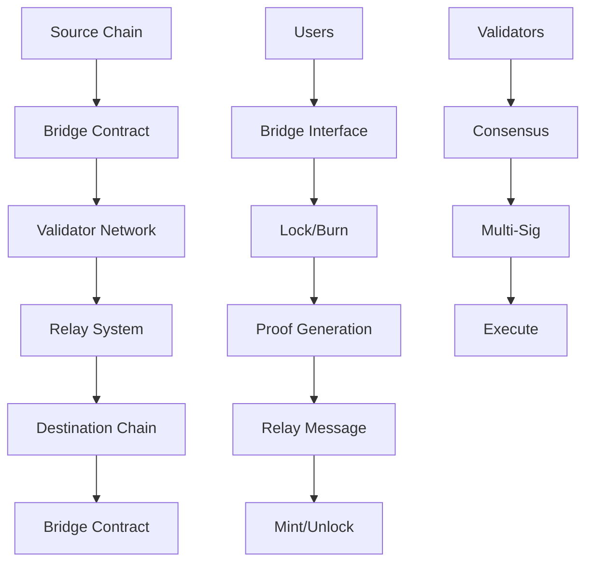

# บทที่ 17: Cross-Chain Bridge

## 🎯 จุดประสงค์ของบทเรียน
- ออกแบบและพัฒนา Cross-Chain Bridge
- เชื่อมต่อ Taraxa กับ Ethereum และ BSC
- จัดการ Asset Transfer และ State Synchronization
- สร้างระบบ Validator Network และ Security

## 🌉 Bridge Architecture

### **🏗️ System Overview**



## 🔐 Bridge Core Contracts

### **⚡ Bridge Hub Contract**

```solidity
// contracts/bridge/BridgeHub.sol
// SPDX-License-Identifier: MIT
pragma solidity ^0.8.19;

import "@openzeppelin/contracts/access/AccessControl.sol";
import "@openzeppelin/contracts/security/ReentrancyGuard.sol";
import "@openzeppelin/contracts/security/Pausable.sol";
import "@openzeppelin/contracts/token/ERC20/IERC20.sol";
import "@openzeppelin/contracts/token/ERC20/utils/SafeERC20.sol";
import "@openzeppelin/contracts/utils/cryptography/ECDSA.sol";

/**
 * @title BridgeHub
 * @dev Main bridge contract for cross-chain asset transfers
 */
contract BridgeHub is AccessControl, ReentrancyGuard, Pausable {
    using SafeERC20 for IERC20;
    using ECDSA for bytes32;
    
    bytes32 public constant VALIDATOR_ROLE = keccak256("VALIDATOR_ROLE");
    bytes32 public constant ADMIN_ROLE = keccak256("ADMIN_ROLE");
    bytes32 public constant RELAYER_ROLE = keccak256("RELAYER_ROLE");
    
    struct BridgeTransaction {
        bytes32 txHash;
        address user;
        address token;
        uint256 amount;
        uint256 sourceChainId;
        uint256 targetChainId;
        uint256 nonce;
        uint256 timestamp;
        BridgeStatus status;
        bytes32 proofHash;
    }
    
    struct TokenConfig {
        address tokenAddress;
        uint256 minTransfer;
        uint256 maxTransfer;
        uint256 dailyLimit;
        uint256 fee; // Basis points (100 = 1%)
        bool isActive;
        bool isMintable; // True for wrapped tokens
    }
    
    struct ChainConfig {
        uint256 chainId;
        string name;
        address bridgeContract;
        uint256 confirmationBlocks;
        bool isActive;
    }
    
    enum BridgeStatus {
        Pending,
        Confirmed,
        Executed,
        Failed,
        Cancelled
    }
    
    // State variables
    mapping(bytes32 => BridgeTransaction) public bridgeTransactions;
    mapping(address => TokenConfig) public tokenConfigs;
    mapping(uint256 => ChainConfig) public chainConfigs;
    mapping(address => mapping(uint256 => uint256)) public dailyTransferred; // token => day => amount
    mapping(uint256 => bool) public supportedChains;
    mapping(bytes32 => mapping(address => bool)) public validatorSignatures;
    mapping(bytes32 => uint256) public signatureCount;
    
    uint256 public currentChainId;
    uint256 public bridgeNonce;
    uint256 public requiredSignatures;
    uint256 public validatorCount;
    address public feeCollector;
    
    // Events
    event BridgeInitiated(
        bytes32 indexed txHash,
        address indexed user,
        address indexed token,
        uint256 amount,
        uint256 targetChainId,
        uint256 nonce
    );
    
    event BridgeCompleted(
        bytes32 indexed txHash,
        address indexed user,
        address indexed token,
        uint256 amount,
        uint256 sourceChainId
    );
    
    event TokenConfigured(address indexed token, uint256 minTransfer, uint256 maxTransfer, uint256 fee);
    event ChainConfigured(uint256 indexed chainId, string name, address bridgeContract);
    event ValidatorAdded(address indexed validator);
    event ValidatorRemoved(address indexed validator);
    
    error InsufficientSignatures(uint256 provided, uint256 required);
    error TransferAmountOutOfRange(uint256 amount, uint256 min, uint256 max);
    error DailyLimitExceeded(uint256 amount, uint256 limit);
    error UnsupportedChain(uint256 chainId);
    error TransactionAlreadyExecuted(bytes32 txHash);
    error InvalidProof(bytes32 txHash);
    
    constructor(
        uint256 _chainId,
        uint256 _requiredSignatures,
        address _feeCollector
    ) {
        currentChainId = _chainId;
        requiredSignatures = _requiredSignatures;
        feeCollector = _feeCollector;
        
        _grantRole(DEFAULT_ADMIN_ROLE, msg.sender);
        _grantRole(ADMIN_ROLE, msg.sender);
    }
    
    /**
     * @dev Initiate a bridge transfer (lock tokens)
     */
    function initiateBridge(
        address token,
        uint256 amount,
        uint256 targetChainId,
        bytes calldata data
    ) external nonReentrant whenNotPaused returns (bytes32) {
        require(supportedChains[targetChainId], "Target chain not supported");
        
        TokenConfig memory config = tokenConfigs[token];
        require(config.isActive, "Token not supported");
        require(amount >= config.minTransfer, "Amount below minimum");
        require(amount <= config.maxTransfer, "Amount above maximum");
        
        // Check daily limit
        uint256 today = block.timestamp / 86400;
        require(
            dailyTransferred[token][today] + amount <= config.dailyLimit,
            "Daily limit exceeded"
        );
        
        // Calculate fee
        uint256 fee = (amount * config.fee) / 10000;
        uint256 transferAmount = amount - fee;
        
        // Transfer tokens to bridge
        IERC20(token).safeTransferFrom(msg.sender, address(this), amount);
        
        // Transfer fee to collector
        if (fee > 0 && feeCollector != address(0)) {
            IERC20(token).safeTransfer(feeCollector, fee);
        }
        
        // Update daily transferred amount
        dailyTransferred[token][today] += amount;
        
        // Create bridge transaction
        bytes32 txHash = keccak256(abi.encodePacked(
            msg.sender,
            token,
            transferAmount,
            currentChainId,
            targetChainId,
            bridgeNonce,
            block.timestamp
        ));
        
        bridgeTransactions[txHash] = BridgeTransaction({
            txHash: txHash,
            user: msg.sender,
            token: token,
            amount: transferAmount,
            sourceChainId: currentChainId,
            targetChainId: targetChainId,
            nonce: bridgeNonce,
            timestamp: block.timestamp,
            status: BridgeStatus.Pending,
            proofHash: bytes32(0)
        });
        
        bridgeNonce++;
        
        emit BridgeInitiated(txHash, msg.sender, token, transferAmount, targetChainId, bridgeNonce - 1);
        
        return txHash;
    }
    
    /**
     * @dev Complete bridge transfer (mint/unlock tokens)
     */
    function completeBridge(
        bytes32 txHash,
        address user,
        address token,
        uint256 amount,
        uint256 sourceChainId,
        uint256 nonce,
        bytes[] calldata signatures
    ) external onlyRole(RELAYER_ROLE) nonReentrant whenNotPaused {
        require(signatures.length >= requiredSignatures, "Insufficient signatures");
        require(supportedChains[sourceChainId], "Source chain not supported");
        
        // Verify transaction doesn't exist or is not executed
        BridgeTransaction storage bridgeTx = bridgeTransactions[txHash];
        require(bridgeTx.status != BridgeStatus.Executed, "Transaction already executed");
        
        TokenConfig memory config = tokenConfigs[token];
        require(config.isActive, "Token not supported");
        
        // Verify signatures
        bytes32 messageHash = keccak256(abi.encodePacked(
            txHash,
            user,
            token,
            amount,
            sourceChainId,
            currentChainId,
            nonce
        ));
        
        bytes32 ethSignedMessageHash = messageHash.toEthSignedMessageHash();
        
        address[] memory signers = new address[](signatures.length);
        uint256 validSignatures = 0;
        
        for (uint256 i = 0; i < signatures.length; i++) {
            address signer = ethSignedMessageHash.recover(signatures[i]);
            
            if (hasRole(VALIDATOR_ROLE, signer)) {
                bool alreadySigned = false;
                for (uint256 j = 0; j < validSignatures; j++) {
                    if (signers[j] == signer) {
                        alreadySigned = true;
                        break;
                    }
                }
                
                if (!alreadySigned) {
                    signers[validSignatures] = signer;
                    validSignatures++;
                }
            }
        }
        
        if (validSignatures < requiredSignatures) {
            revert InsufficientSignatures(validSignatures, requiredSignatures);
        }
        
        // Update or create bridge transaction
        if (bridgeTx.txHash == bytes32(0)) {
            bridgeTransactions[txHash] = BridgeTransaction({
                txHash: txHash,
                user: user,
                token: token,
                amount: amount,
                sourceChainId: sourceChainId,
                targetChainId: currentChainId,
                nonce: nonce,
                timestamp: block.timestamp,
                status: BridgeStatus.Executed,
                proofHash: ethSignedMessageHash
            });
        } else {
            bridgeTx.status = BridgeStatus.Executed;
            bridgeTx.proofHash = ethSignedMessageHash;
        }
        
        // Transfer tokens to user
        if (config.isMintable) {
            // Mint wrapped tokens
            IMintable(token).mint(user, amount);
        } else {
            // Unlock native tokens
            IERC20(token).safeTransfer(user, amount);
        }
        
        emit BridgeCompleted(txHash, user, token, amount, sourceChainId);
    }
    
    /**
     * @dev Emergency cancel bridge transaction
     */
    function cancelBridge(bytes32 txHash) external nonReentrant {
        BridgeTransaction storage bridgeTx = bridgeTransactions[txHash];
        require(bridgeTx.user == msg.sender, "Not transaction owner");
        require(bridgeTx.status == BridgeStatus.Pending, "Cannot cancel transaction");
        require(block.timestamp - bridgeTx.timestamp > 24 hours, "Too early to cancel");
        
        bridgeTx.status = BridgeStatus.Cancelled;
        
        TokenConfig memory config = tokenConfigs[bridgeTx.token];
        
        // Refund tokens
        if (config.isMintable) {
            IMintable(bridgeTx.token).mint(bridgeTx.user, bridgeTx.amount);
        } else {
            IERC20(bridgeTx.token).safeTransfer(bridgeTx.user, bridgeTx.amount);
        }
    }
    
    /**
     * @dev Add supported token
     */
    function addToken(
        address token,
        uint256 minTransfer,
        uint256 maxTransfer,
        uint256 dailyLimit,
        uint256 fee,
        bool isMintable
    ) external onlyRole(ADMIN_ROLE) {
        require(token != address(0), "Invalid token address");
        require(minTransfer <= maxTransfer, "Invalid transfer limits");
        require(fee <= 1000, "Fee too high"); // Max 10%
        
        tokenConfigs[token] = TokenConfig({
            tokenAddress: token,
            minTransfer: minTransfer,
            maxTransfer: maxTransfer,
            dailyLimit: dailyLimit,
            fee: fee,
            isActive: true,
            isMintable: isMintable
        });
        
        emit TokenConfigured(token, minTransfer, maxTransfer, fee);
    }
    
    /**
     * @dev Add supported chain
     */
    function addChain(
        uint256 chainId,
        string memory name,
        address bridgeContract,
        uint256 confirmationBlocks
    ) external onlyRole(ADMIN_ROLE) {
        require(chainId != currentChainId, "Cannot add current chain");
        require(bridgeContract != address(0), "Invalid bridge contract");
        
        chainConfigs[chainId] = ChainConfig({
            chainId: chainId,
            name: name,
            bridgeContract: bridgeContract,
            confirmationBlocks: confirmationBlocks,
            isActive: true
        });
        
        supportedChains[chainId] = true;
        
        emit ChainConfigured(chainId, name, bridgeContract);
    }
    
    /**
     * @dev Add validator
     */
    function addValidator(address validator) external onlyRole(ADMIN_ROLE) {
        require(validator != address(0), "Invalid validator address");
        
        _grantRole(VALIDATOR_ROLE, validator);
        validatorCount++;
        
        emit ValidatorAdded(validator);
    }
    
    /**
     * @dev Remove validator
     */
    function removeValidator(address validator) external onlyRole(ADMIN_ROLE) {
        require(hasRole(VALIDATOR_ROLE, validator), "Not a validator");
        require(validatorCount > requiredSignatures, "Would break consensus");
        
        _revokeRole(VALIDATOR_ROLE, validator);
        validatorCount--;
        
        emit ValidatorRemoved(validator);
    }
    
    /**
     * @dev Update required signatures
     */
    function updateRequiredSignatures(uint256 newRequired) external onlyRole(ADMIN_ROLE) {
        require(newRequired > 0, "Required signatures must be > 0");
        require(newRequired <= validatorCount, "Required > validator count");
        
        requiredSignatures = newRequired;
    }
    
    /**
     * @dev Emergency functions
     */
    function pause() external onlyRole(ADMIN_ROLE) {
        _pause();
    }
    
    function unpause() external onlyRole(ADMIN_ROLE) {
        _unpause();
    }
    
    function emergencyWithdraw(
        address token,
        address to,
        uint256 amount
    ) external onlyRole(DEFAULT_ADMIN_ROLE) {
        IERC20(token).safeTransfer(to, amount);
    }
    
    /**
     * @dev View functions
     */
    function getBridgeTransaction(bytes32 txHash) 
        external 
        view 
        returns (BridgeTransaction memory) 
    {
        return bridgeTransactions[txHash];
    }
    
    function getTokenConfig(address token) 
        external 
        view 
        returns (TokenConfig memory) 
    {
        return tokenConfigs[token];
    }
    
    function getChainConfig(uint256 chainId) 
        external 
        view 
        returns (ChainConfig memory) 
    {
        return chainConfigs[chainId];
    }
    
    function getDailyTransferred(address token) 
        external 
        view 
        returns (uint256) 
    {
        uint256 today = block.timestamp / 86400;
        return dailyTransferred[token][today];
    }
}

/**
 * @interface IMintable
 * @dev Interface for mintable tokens
 */
interface IMintable {
    function mint(address to, uint256 amount) external;
    function burn(uint256 amount) external;
    function burnFrom(address account, uint256 amount) external;
}
```

## 🔄 Validator Network

### **👥 Validator Management System**

```solidity
// contracts/bridge/ValidatorNetwork.sol
// SPDX-License-Identifier: MIT
pragma solidity ^0.8.19;

import "@openzeppelin/contracts/access/Ownable.sol";
import "@openzeppelin/contracts/security/ReentrancyGuard.sol";
import "@openzeppelin/contracts/token/ERC20/IERC20.sol";

/**
 * @title ValidatorNetwork
 * @dev Manages validator network for cross-chain bridge
 */
contract ValidatorNetwork is Ownable, ReentrancyGuard {
    struct Validator {
        address validator;
        uint256 stake;
        uint256 reputationScore;
        uint256 lastActivity;
        bool isActive;
        bool isSlashed;
        uint256 slashCount;
        uint256 totalRewards;
    }
    
    struct ValidationRequest {
        bytes32 requestId;
        bytes32 dataHash;
        uint256 chainId;
        address requester;
        uint256 timestamp;
        uint256 requiredValidations;
        mapping(address => bool) hasValidated;
        mapping(address => bool) validatorVotes;
        uint256 yesVotes;
        uint256 noVotes;
        bool isFinalized;
        bool result;
    }
    
    mapping(address => Validator) public validators;
    mapping(bytes32 => ValidationRequest) public validationRequests;
    mapping(address => uint256) public pendingRewards;
    
    address[] public validatorList;
    address public stakeToken;
    uint256 public minStake;
    uint256 public maxValidators;
    uint256 public reputationThreshold;
    uint256 public validationTimeout;
    uint256 public slashAmount;
    uint256 public rewardPerValidation;
    
    event ValidatorAdded(address indexed validator, uint256 stake);
    event ValidatorRemoved(address indexed validator, string reason);
    event ValidatorSlashed(address indexed validator, uint256 amount, string reason);
    event ValidationRequested(bytes32 indexed requestId, bytes32 dataHash, uint256 chainId);
    event ValidationSubmitted(bytes32 indexed requestId, address indexed validator, bool vote);
    event ValidationFinalized(bytes32 indexed requestId, bool result);
    event RewardDistributed(address indexed validator, uint256 amount);
    
    constructor(
        address _stakeToken,
        uint256 _minStake,
        uint256 _maxValidators,
        uint256 _reputationThreshold
    ) {
        stakeToken = _stakeToken;
        minStake = _minStake;
        maxValidators = _maxValidators;
        reputationThreshold = _reputationThreshold;
        validationTimeout = 1 hours;
        slashAmount = _minStake / 10; // 10% of minimum stake
        rewardPerValidation = 0.1 ether;
    }
    
    /**
     * @dev Add validator with stake
     */
    function addValidator() external nonReentrant {
        require(validatorList.length < maxValidators, "Max validators reached");
        require(validators[msg.sender].validator == address(0), "Already a validator");
        
        // Transfer stake
        IERC20(stakeToken).transferFrom(msg.sender, address(this), minStake);
        
        validators[msg.sender] = Validator({
            validator: msg.sender,
            stake: minStake,
            reputationScore: 100, // Starting reputation
            lastActivity: block.timestamp,
            isActive: true,
            isSlashed: false,
            slashCount: 0,
            totalRewards: 0
        });
        
        validatorList.push(msg.sender);
        
        emit ValidatorAdded(msg.sender, minStake);
    }
    
    /**
     * @dev Remove validator and return stake
     */
    function removeValidator() external nonReentrant {
        Validator storage validator = validators[msg.sender];
        require(validator.validator == msg.sender, "Not a validator");
        require(validator.isActive, "Validator not active");
        
        // Remove from validator list
        for (uint256 i = 0; i < validatorList.length; i++) {
            if (validatorList[i] == msg.sender) {
                validatorList[i] = validatorList[validatorList.length - 1];
                validatorList.pop();
                break;
            }
        }
        
        uint256 stakeToReturn = validator.stake;
        if (validator.isSlashed) {
            stakeToReturn -= slashAmount * validator.slashCount;
        }
        
        // Return stake
        if (stakeToReturn > 0) {
            IERC20(stakeToken).transfer(msg.sender, stakeToReturn);
        }
        
        delete validators[msg.sender];
        
        emit ValidatorRemoved(msg.sender, "Voluntary exit");
    }
    
    /**
     * @dev Request validation for cross-chain data
     */
    function requestValidation(
        bytes32 dataHash,
        uint256 chainId,
        uint256 requiredValidations
    ) external returns (bytes32) {
        require(requiredValidations > 0, "Required validations must be > 0");
        require(requiredValidations <= validatorList.length, "Not enough validators");
        
        bytes32 requestId = keccak256(abi.encodePacked(
            dataHash,
            chainId,
            msg.sender,
            block.timestamp,
            block.difficulty
        ));
        
        ValidationRequest storage request = validationRequests[requestId];
        request.requestId = requestId;
        request.dataHash = dataHash;
        request.chainId = chainId;
        request.requester = msg.sender;
        request.timestamp = block.timestamp;
        request.requiredValidations = requiredValidations;
        request.isFinalized = false;
        
        emit ValidationRequested(requestId, dataHash, chainId);
        
        return requestId;
    }
    
    /**
     * @dev Submit validation vote
     */
    function submitValidation(
        bytes32 requestId,
        bool vote,
        bytes calldata proof
    ) external {
        ValidationRequest storage request = validationRequests[requestId];
        require(request.requestId == requestId, "Request not found");
        require(!request.isFinalized, "Request already finalized");
        require(block.timestamp <= request.timestamp + validationTimeout, "Validation timeout");
        require(!request.hasValidated[msg.sender], "Already validated");
        
        Validator storage validator = validators[msg.sender];
        require(validator.isActive, "Validator not active");
        require(!validator.isSlashed, "Validator is slashed");
        require(validator.reputationScore >= reputationThreshold, "Reputation too low");
        
        // Verify proof (implementation depends on specific use case)
        require(_verifyProof(request.dataHash, proof), "Invalid proof");
        
        request.hasValidated[msg.sender] = true;
        request.validatorVotes[msg.sender] = vote;
        
        if (vote) {
            request.yesVotes++;
        } else {
            request.noVotes++;
        }
        
        validator.lastActivity = block.timestamp;
        
        emit ValidationSubmitted(requestId, msg.sender, vote);
        
        // Check if we can finalize
        if (request.yesVotes + request.noVotes >= request.requiredValidations) {
            _finalizeValidation(requestId);
        }
    }
    
    /**
     * @dev Finalize validation request
     */
    function _finalizeValidation(bytes32 requestId) internal {
        ValidationRequest storage request = validationRequests[requestId];
        
        bool result = request.yesVotes > request.noVotes;
        request.result = result;
        request.isFinalized = true;
        
        // Distribute rewards to validators who voted with majority
        uint256 totalParticipants = request.yesVotes + request.noVotes;
        uint256 rewardPerValidator = rewardPerValidation;
        
        for (uint256 i = 0; i < validatorList.length; i++) {
            address validatorAddr = validatorList[i];
            if (request.hasValidated[validatorAddr]) {
                bool validatorVote = request.validatorVotes[validatorAddr];
                Validator storage validator = validators[validatorAddr];
                
                if (validatorVote == result) {
                    // Reward correct vote
                    pendingRewards[validatorAddr] += rewardPerValidator;
                    validator.totalRewards += rewardPerValidator;
                    validator.reputationScore = _min(validator.reputationScore + 1, 1000);
                } else {
                    // Penalize incorrect vote
                    validator.reputationScore = validator.reputationScore > 1 ? 
                        validator.reputationScore - 1 : 0;
                }
            }
        }
        
        emit ValidationFinalized(requestId, result);
    }
    
    /**
     * @dev Slash validator for malicious behavior
     */
    function slashValidator(
        address validatorAddr,
        string memory reason
    ) external onlyOwner {
        Validator storage validator = validators[validatorAddr];
        require(validator.validator == validatorAddr, "Not a validator");
        
        validator.isSlashed = true;
        validator.slashCount++;
        validator.reputationScore = validator.reputationScore > 50 ? 
            validator.reputationScore - 50 : 0;
        
        // If slashed too many times, remove validator
        if (validator.slashCount >= 3) {
            validator.isActive = false;
        }
        
        emit ValidatorSlashed(validatorAddr, slashAmount, reason);
    }
    
    /**
     * @dev Claim pending rewards
     */
    function claimRewards() external nonReentrant {
        uint256 reward = pendingRewards[msg.sender];
        require(reward > 0, "No rewards to claim");
        
        pendingRewards[msg.sender] = 0;
        
        // Transfer rewards (assuming ETH rewards for simplicity)
        payable(msg.sender).transfer(reward);
        
        emit RewardDistributed(msg.sender, reward);
    }
    
    /**
     * @dev Force finalize timed out validation
     */
    function forceFinalize(bytes32 requestId) external {
        ValidationRequest storage request = validationRequests[requestId];
        require(request.requestId == requestId, "Request not found");
        require(!request.isFinalized, "Already finalized");
        require(block.timestamp > request.timestamp + validationTimeout, "Not timed out");
        
        // If timed out, result is false
        request.result = false;
        request.isFinalized = true;
        
        emit ValidationFinalized(requestId, false);
    }
    
    /**
     * @dev Verify proof (placeholder implementation)
     */
    function _verifyProof(bytes32 dataHash, bytes memory proof) 
        internal 
        pure 
        returns (bool) 
    {
        // Implementation depends on specific proof system
        // For now, return true (should implement actual verification)
        return true;
    }
    
    /**
     * @dev Helper function for minimum
     */
    function _min(uint256 a, uint256 b) internal pure returns (uint256) {
        return a < b ? a : b;
    }
    
    /**
     * @dev View functions
     */
    function getActiveValidators() external view returns (address[] memory) {
        address[] memory activeValidators = new address[](validatorList.length);
        uint256 count = 0;
        
        for (uint256 i = 0; i < validatorList.length; i++) {
            if (validators[validatorList[i]].isActive) {
                activeValidators[count] = validatorList[i];
                count++;
            }
        }
        
        // Resize array
        assembly {
            mstore(activeValidators, count)
        }
        
        return activeValidators;
    }
    
    function getValidationResult(bytes32 requestId) 
        external 
        view 
        returns (bool isFinalized, bool result) 
    {
        ValidationRequest storage request = validationRequests[requestId];
        return (request.isFinalized, request.result);
    }
    
    function getValidatorInfo(address validatorAddr) 
        external 
        view 
        returns (
            uint256 stake,
            uint256 reputationScore,
            bool isActive,
            uint256 totalRewards
        ) 
    {
        Validator memory validator = validators[validatorAddr];
        return (
            validator.stake,
            validator.reputationScore,
            validator.isActive,
            validator.totalRewards
        );
    }
    
    /**
     * @dev Emergency functions
     */
    function emergencyStop() external onlyOwner {
        // Implement emergency stop logic
    }
    
    function updateParameters(
        uint256 _minStake,
        uint256 _reputationThreshold,
        uint256 _validationTimeout,
        uint256 _rewardPerValidation
    ) external onlyOwner {
        minStake = _minStake;
        reputationThreshold = _reputationThreshold;
        validationTimeout = _validationTimeout;
        rewardPerValidation = _rewardPerValidation;
    }
    
    // Fund contract for rewards
    receive() external payable {}
}
```

## 🔐 Security & Monitoring

### **🛡️ Bridge Security System**

```solidity
// contracts/bridge/BridgeSecurity.sol
// SPDX-License-Identifier: MIT
pragma solidity ^0.8.19;

import "@openzeppelin/contracts/access/Ownable.sol";
import "@openzeppelin/contracts/security/Pausable.sol";

/**
 * @title BridgeSecurity
 * @dev Security monitoring and circuit breaker for bridge operations
 */
contract BridgeSecurity is Ownable, Pausable {
    struct SecurityAlert {
        uint256 alertType; // 0: Volume, 1: Frequency, 2: Validator, 3: Custom
        uint256 severity; // 1-5 (5 being most severe)
        uint256 timestamp;
        string description;
        bool isActive;
        address triggeredBy;
    }
    
    struct VolumeLimit {
        address token;
        uint256 hourlyLimit;
        uint256 dailyLimit;
        uint256 weeklyLimit;
        uint256 currentHourVolume;
        uint256 currentDayVolume;
        uint256 currentWeekVolume;
        uint256 lastHourReset;
        uint256 lastDayReset;
        uint256 lastWeekReset;
    }
    
    struct FrequencyLimit {
        address user;
        uint256 maxTransactionsPerHour;
        uint256 currentHourTransactions;
        uint256 lastHourReset;
        bool isBlacklisted;
    }
    
    mapping(bytes32 => SecurityAlert) public securityAlerts;
    mapping(address => VolumeLimit) public volumeLimits;
    mapping(address => FrequencyLimit) public frequencyLimits;
    mapping(address => bool) public trustedAddresses;
    mapping(address => uint256) public suspiciousActivity;
    
    bytes32[] public activeAlerts;
    address public bridgeContract;
    uint256 public alertCount;
    uint256 public maxAlertsBeforePause;
    uint256 public alertTimeout;
    
    event SecurityAlertTriggered(
        bytes32 indexed alertId,
        uint256 alertType,
        uint256 severity,
        string description
    );
    
    event SecurityAlertResolved(bytes32 indexed alertId);
    event VolumeExceeded(address indexed token, uint256 amount, uint256 limit);
    event FrequencyExceeded(address indexed user, uint256 transactions, uint256 limit);
    event SuspiciousActivityDetected(address indexed user, uint256 score);
    
    modifier onlyBridge() {
        require(msg.sender == bridgeContract, "Only bridge contract");
        _;
    }
    
    constructor(address _bridgeContract) {
        bridgeContract = _bridgeContract;
        maxAlertsBeforePause = 5;
        alertTimeout = 24 hours;
    }
    
    /**
     * @dev Check transaction before execution
     */
    function checkTransaction(
        address user,
        address token,
        uint256 amount,
        uint256 chainId
    ) external onlyBridge returns (bool) {
        // Check if paused
        if (paused()) {
            return false;
        }
        
        // Check volume limits
        if (!_checkVolumeLimit(token, amount)) {
            _triggerAlert(
                0, // Volume alert
                3, // Medium severity
                string(abi.encodePacked("Volume limit exceeded for token: ", _addressToString(token))),
                user
            );
            return false;
        }
        
        // Check frequency limits
        if (!_checkFrequencyLimit(user)) {
            _triggerAlert(
                1, // Frequency alert
                2, // Low-medium severity
                string(abi.encodePacked("Frequency limit exceeded for user: ", _addressToString(user))),
                user
            );
            return false;
        }
        
        // Check for suspicious patterns
        uint256 suspicionScore = _calculateSuspicionScore(user, token, amount, chainId);
        if (suspicionScore > 80) {
            _triggerAlert(
                3, // Custom alert
                4, // High severity
                "Suspicious transaction pattern detected",
                user
            );
            return false;
        }
        
        // Update tracking
        _updateVolumeTracking(token, amount);
        _updateFrequencyTracking(user);
        
        return true;
    }
    
    /**
     * @dev Check volume limits
     */
    function _checkVolumeLimit(address token, uint256 amount) 
        internal 
        returns (bool) 
    {
        VolumeLimit storage limit = volumeLimits[token];
        
        // Update time windows
        uint256 currentTime = block.timestamp;
        
        if (currentTime >= limit.lastHourReset + 1 hours) {
            limit.currentHourVolume = 0;
            limit.lastHourReset = currentTime;
        }
        
        if (currentTime >= limit.lastDayReset + 1 days) {
            limit.currentDayVolume = 0;
            limit.lastDayReset = currentTime;
        }
        
        if (currentTime >= limit.lastWeekReset + 1 weeks) {
            limit.currentWeekVolume = 0;
            limit.lastWeekReset = currentTime;
        }
        
        // Check limits
        if (limit.hourlyLimit > 0 && 
            limit.currentHourVolume + amount > limit.hourlyLimit) {
            emit VolumeExceeded(token, amount, limit.hourlyLimit);
            return false;
        }
        
        if (limit.dailyLimit > 0 && 
            limit.currentDayVolume + amount > limit.dailyLimit) {
            emit VolumeExceeded(token, amount, limit.dailyLimit);
            return false;
        }
        
        if (limit.weeklyLimit > 0 && 
            limit.currentWeekVolume + amount > limit.weeklyLimit) {
            emit VolumeExceeded(token, amount, limit.weeklyLimit);
            return false;
        }
        
        return true;
    }
    
    /**
     * @dev Check frequency limits
     */
    function _checkFrequencyLimit(address user) internal returns (bool) {
        FrequencyLimit storage limit = frequencyLimits[user];
        
        if (limit.isBlacklisted) {
            return false;
        }
        
        uint256 currentTime = block.timestamp;
        
        if (currentTime >= limit.lastHourReset + 1 hours) {
            limit.currentHourTransactions = 0;
            limit.lastHourReset = currentTime;
        }
        
        if (limit.maxTransactionsPerHour > 0 && 
            limit.currentHourTransactions >= limit.maxTransactionsPerHour) {
            emit FrequencyExceeded(user, limit.currentHourTransactions, limit.maxTransactionsPerHour);
            return false;
        }
        
        return true;
    }
    
    /**
     * @dev Calculate suspicion score based on various factors
     */
    function _calculateSuspicionScore(
        address user,
        address token,
        uint256 amount,
        uint256 chainId
    ) internal view returns (uint256) {
        uint256 score = 0;
        
        // Check if user is in trusted list
        if (trustedAddresses[user]) {
            return 0;
        }
        
        // Large amount score
        VolumeLimit memory limit = volumeLimits[token];
        if (limit.dailyLimit > 0) {
            uint256 percentOfLimit = (amount * 100) / limit.dailyLimit;
            if (percentOfLimit > 50) score += 30;
            else if (percentOfLimit > 25) score += 15;
        }
        
        // Frequency score
        FrequencyLimit memory freqLimit = frequencyLimits[user];
        if (freqLimit.maxTransactionsPerHour > 0) {
            uint256 freqPercent = (freqLimit.currentHourTransactions * 100) / freqLimit.maxTransactionsPerHour;
            if (freqPercent > 80) score += 25;
            else if (freqPercent > 60) score += 15;
        }
        
        // Previous suspicious activity
        score += suspiciousActivity[user];
        
        // Round number amounts (often suspicious)
        if (amount % (10**18) == 0 && amount >= 1000 * 10**18) {
            score += 10;
        }
        
        return score;
    }
    
    /**
     * @dev Update volume tracking
     */
    function _updateVolumeTracking(address token, uint256 amount) internal {
        VolumeLimit storage limit = volumeLimits[token];
        limit.currentHourVolume += amount;
        limit.currentDayVolume += amount;
        limit.currentWeekVolume += amount;
    }
    
    /**
     * @dev Update frequency tracking
     */
    function _updateFrequencyTracking(address user) internal {
        FrequencyLimit storage limit = frequencyLimits[user];
        limit.currentHourTransactions++;
    }
    
    /**
     * @dev Trigger security alert
     */
    function _triggerAlert(
        uint256 alertType,
        uint256 severity,
        string memory description,
        address triggeredBy
    ) internal {
        bytes32 alertId = keccak256(abi.encodePacked(
            alertType,
            severity,
            description,
            triggeredBy,
            block.timestamp
        ));
        
        securityAlerts[alertId] = SecurityAlert({
            alertType: alertType,
            severity: severity,
            timestamp: block.timestamp,
            description: description,
            isActive: true,
            triggeredBy: triggeredBy
        });
        
        activeAlerts.push(alertId);
        alertCount++;
        
        emit SecurityAlertTriggered(alertId, alertType, severity, description);
        
        // Auto-pause if too many alerts
        if (activeAlerts.length >= maxAlertsBeforePause) {
            _pause();
        }
        
        // Increase suspicion score
        if (triggeredBy != address(0)) {
            suspiciousActivity[triggeredBy] = _min(suspiciousActivity[triggeredBy] + 10, 100);
            emit SuspiciousActivityDetected(triggeredBy, suspiciousActivity[triggeredBy]);
        }
    }
    
    /**
     * @dev Resolve security alert
     */
    function resolveAlert(bytes32 alertId) external onlyOwner {
        SecurityAlert storage alert = securityAlerts[alertId];
        require(alert.isActive, "Alert not active");
        
        alert.isActive = false;
        
        // Remove from active alerts
        for (uint256 i = 0; i < activeAlerts.length; i++) {
            if (activeAlerts[i] == alertId) {
                activeAlerts[i] = activeAlerts[activeAlerts.length - 1];
                activeAlerts.pop();
                break;
            }
        }
        
        emit SecurityAlertResolved(alertId);
    }
    
    /**
     * @dev Admin functions
     */
    function setVolumeLimit(
        address token,
        uint256 hourlyLimit,
        uint256 dailyLimit,
        uint256 weeklyLimit
    ) external onlyOwner {
        volumeLimits[token] = VolumeLimit({
            token: token,
            hourlyLimit: hourlyLimit,
            dailyLimit: dailyLimit,
            weeklyLimit: weeklyLimit,
            currentHourVolume: 0,
            currentDayVolume: 0,
            currentWeekVolume: 0,
            lastHourReset: block.timestamp,
            lastDayReset: block.timestamp,
            lastWeekReset: block.timestamp
        });
    }
    
    function setFrequencyLimit(
        address user,
        uint256 maxTransactionsPerHour
    ) external onlyOwner {
        frequencyLimits[user] = FrequencyLimit({
            user: user,
            maxTransactionsPerHour: maxTransactionsPerHour,
            currentHourTransactions: 0,
            lastHourReset: block.timestamp,
            isBlacklisted: false
        });
    }
    
    function addTrustedAddress(address addr) external onlyOwner {
        trustedAddresses[addr] = true;
    }
    
    function removeTrustedAddress(address addr) external onlyOwner {
        trustedAddresses[addr] = false;
    }
    
    function blacklistUser(address user, bool isBlacklisted) external onlyOwner {
        frequencyLimits[user].isBlacklisted = isBlacklisted;
    }
    
    function resetSuspiciousActivity(address user) external onlyOwner {
        suspiciousActivity[user] = 0;
    }
    
    /**
     * @dev Emergency functions
     */
    function emergencyPause() external onlyOwner {
        _pause();
    }
    
    function emergencyUnpause() external onlyOwner {
        _unpause();
    }
    
    function clearAllAlerts() external onlyOwner {
        for (uint256 i = 0; i < activeAlerts.length; i++) {
            securityAlerts[activeAlerts[i]].isActive = false;
        }
        delete activeAlerts;
    }
    
    /**
     * @dev Helper functions
     */
    function _min(uint256 a, uint256 b) internal pure returns (uint256) {
        return a < b ? a : b;
    }
    
    function _addressToString(address addr) internal pure returns (string memory) {
        bytes32 value = bytes32(uint256(uint160(addr)));
        bytes memory alphabet = "0123456789abcdef";
        
        bytes memory str = new bytes(42);
        str[0] = '0';
        str[1] = 'x';
        for (uint256 i = 0; i < 20; i++) {
            str[2+i*2] = alphabet[uint8(value[i + 12] >> 4)];
            str[3+i*2] = alphabet[uint8(value[i + 12] & 0x0f)];
        }
        return string(str);
    }
    
    /**
     * @dev View functions
     */
    function getActiveAlerts() external view returns (bytes32[] memory) {
        return activeAlerts;
    }
    
    function getVolumeInfo(address token) 
        external 
        view 
        returns (
            uint256 hourlyLimit,
            uint256 dailyLimit,
            uint256 currentHourVolume,
            uint256 currentDayVolume
        ) 
    {
        VolumeLimit memory limit = volumeLimits[token];
        return (
            limit.hourlyLimit,
            limit.dailyLimit,
            limit.currentHourVolume,
            limit.currentDayVolume
        );
    }
    
    function getUserInfo(address user) 
        external 
        view 
        returns (
            uint256 suspicionScore,
            bool isTrusted,
            bool isBlacklisted,
            uint256 currentHourTransactions
        ) 
    {
        return (
            suspiciousActivity[user],
            trustedAddresses[user],
            frequencyLimits[user].isBlacklisted,
            frequencyLimits[user].currentHourTransactions
        );
    }
}
```

## 📋 แบบฝึกหัด

### **🎯 แบบฝึกหัดที่ 1: NFT Bridge**
สร้าง Bridge สำหรับ NFT:
1. Cross-chain NFT transfers
2. Metadata preservation
3. Ownership verification

### **🔧 แบบฝึกหัดที่ 2: DeFi Protocol Bridge**
พัฒนา Bridge สำหรับ DeFi:
1. Liquidity pool bridging
2. Yield farming rewards
3. Governance token migration

### **📊 แบบฝึกหัดที่ 3: Enterprise Bridge**
สร้างระบบ Bridge ระดับองค์กร:
1. Multi-tenant architecture
2. Advanced monitoring
3. Compliance features

## 🔗 การเชื่อมต่อ

**บทก่อนหน้า**: [บทที่ 16: Oracle Integration](./16-oracle-integration.md)  
**บทถัดไป**: [บทที่ 18: Governance Systems](./18-governance-systems.md)

**กลับไปหน้าหลัก**: [README](./README.md)

---

## 📚 เอกสารอ้างอิง

- [Cross-Chain Bridges](https://ethereum.org/en/bridges/)
- [Bridge Security Best Practices](https://blog.chainalysis.com/reports/cross-chain-bridge-hacks-2022/)
- [LayerZero Protocol](https://layerzero.gitbook.io/)
- [Wormhole Bridge](https://docs.wormhole.com/)

---

ตอนนี้คุณสามารถสร้าง Cross-Chain Bridges ที่ปลอดภัยและเชื่อถือได้! 🌉⚡
