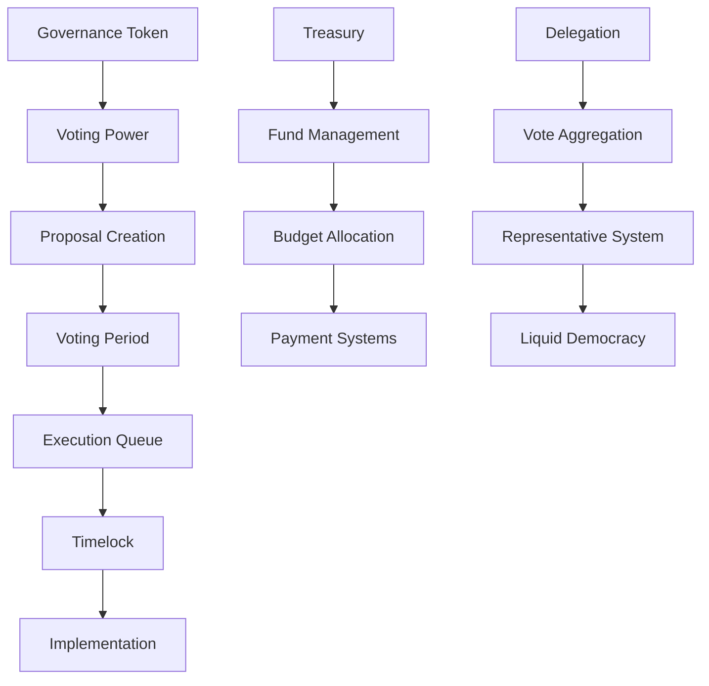

# บทที่ 18: Governance Systems

## 🎯 จุดประสงค์ของบทเรียน
- ออกแบบและพัฒนา DAO (Decentralized Autonomous Organization)
- สร้างระบบ Voting และ Proposal Management
- จัดการ Treasury และ Token Distribution
- พัฒนา Governance Token และ Delegation System

## 🏛️ DAO Architecture

### **📊 Governance Overview**



## 🗳️ Core Governance Contract

### **🏛️ DAO Governance System**

```solidity
// contracts/governance/DAOGovernance.sol
// SPDX-License-Identifier: MIT
pragma solidity ^0.8.19;

import "@openzeppelin/contracts/governance/Governor.sol";
import "@openzeppelin/contracts/governance/extensions/GovernorSettings.sol";
import "@openzeppelin/contracts/governance/extensions/GovernorCountingSimple.sol";
import "@openzeppelin/contracts/governance/extensions/GovernorVotes.sol";
import "@openzeppelin/contracts/governance/extensions/GovernorVotesQuorumFraction.sol";
import "@openzeppelin/contracts/governance/extensions/GovernorTimelockControl.sol";
import "@openzeppelin/contracts/access/Ownable.sol";

/**
 * @title DAOGovernance
 * @dev Advanced DAO governance system with comprehensive features
 */
contract DAOGovernance is 
    Governor,
    GovernorSettings,
    GovernorCountingSimple,
    GovernorVotes,
    GovernorVotesQuorumFraction,
    GovernorTimelockControl,
    Ownable
{
    struct ProposalDetails {
        uint256 proposalId;
        address proposer;
        string title;
        string description;
        string category;
        uint256 fundingRequested;
        address beneficiary;
        uint256 deadline;
        bool isExecuted;
        bool isCancelled;
        mapping(address => string) comments;
        address[] commenters;
    }
    
    struct VotingStats {
        uint256 totalProposals;
        uint256 totalVotes;
        uint256 successfulProposals;
        uint256 totalFundsAllocated;
    }
    
    struct DelegationInfo {
        address delegate;
        uint256 votingPower;
        uint256 delegationTime;
        bool isActive;
    }
    
    mapping(uint256 => ProposalDetails) public proposalDetails;
    mapping(address => VotingStats) public userStats;
    mapping(address => DelegationInfo) public delegations;
    mapping(string => uint256[]) public proposalsByCategory;
    mapping(address => bool) public proposalCreators;
    
    uint256[] public allProposals;
    string[] public categories;
    
    uint256 public minimumTokensForProposal;
    uint256 public maximumFundingPerProposal;
    uint256 public proposalFee;
    address public treasuryAddress;
    
    event ProposalCreatedWithDetails(
        uint256 proposalId,
        address proposer,
        string title,
        string category,
        uint256 fundingRequested
    );
    
    event CommentAdded(uint256 indexed proposalId, address indexed commenter, string comment);
    event DelegationChanged(address indexed delegator, address indexed oldDelegate, address indexed newDelegate);
    event CategoryAdded(string category);
    event ProposalFeeChanged(uint256 oldFee, uint256 newFee);
    
    constructor(
        IVotes _token,
        TimelockController _timelock,
        uint256 _votingDelay,
        uint256 _votingPeriod,
        uint256 _proposalThreshold,
        uint256 _quorumFraction
    )
        Governor("DAO Governance")
        GovernorSettings(_votingDelay, _votingPeriod, _proposalThreshold)
        GovernorVotes(_token)
        GovernorVotesQuorumFraction(_quorumFraction)
        GovernorTimelockControl(_timelock)
    {
        minimumTokensForProposal = 1000 * 10**18; // 1000 tokens
        maximumFundingPerProposal = 100000 * 10**18; // 100k tokens
        proposalFee = 10 * 10**18; // 10 tokens
        
        // Add default categories
        categories.push("Development");
        categories.push("Marketing");
        categories.push("Community");
        categories.push("Infrastructure");
        categories.push("Research");
    }
    
    /**
     * @dev Create a detailed proposal
     */
    function createDetailedProposal(
        address[] memory targets,
        uint256[] memory values,
        bytes[] memory calldatas,
        string memory description,
        string memory title,
        string memory category,
        uint256 fundingRequested,
        address beneficiary,
        uint256 deadline
    ) public returns (uint256) {
        require(getVotes(msg.sender, block.number - 1) >= minimumTokensForProposal, "Insufficient voting power");
        require(fundingRequested <= maximumFundingPerProposal, "Funding request too high");
        require(deadline > block.timestamp + votingPeriod(), "Deadline too soon");
        require(_isValidCategory(category), "Invalid category");
        
        // Charge proposal fee
        if (proposalFee > 0) {
            IERC20(address(token)).transferFrom(msg.sender, treasuryAddress, proposalFee);
        }
        
        // Create the proposal
        uint256 proposalId = propose(targets, values, calldatas, description);
        
        // Store detailed information
        ProposalDetails storage details = proposalDetails[proposalId];
        details.proposalId = proposalId;
        details.proposer = msg.sender;
        details.title = title;
        details.description = description;
        details.category = category;
        details.fundingRequested = fundingRequested;
        details.beneficiary = beneficiary;
        details.deadline = deadline;
        details.isExecuted = false;
        details.isCancelled = false;
        
        // Update tracking
        allProposals.push(proposalId);
        proposalsByCategory[category].push(proposalId);
        proposalCreators[msg.sender] = true;
        
        // Update stats
        userStats[msg.sender].totalProposals++;
        
        emit ProposalCreatedWithDetails(proposalId, msg.sender, title, category, fundingRequested);
        
        return proposalId;
    }
    
    /**
     * @dev Cast vote with reason
     */
    function castVoteWithReasonAndParams(
        uint256 proposalId,
        uint8 support,
        string calldata reason,
        bytes memory params
    ) public override returns (uint256) {
        uint256 weight = super.castVoteWithReasonAndParams(proposalId, support, reason, params);
        
        // Update user stats
        userStats[msg.sender].totalVotes++;
        
        return weight;
    }
    
    /**
     * @dev Add comment to proposal
     */
    function addComment(uint256 proposalId, string memory comment) external {
        require(state(proposalId) == ProposalState.Active, "Proposal not active");
        require(bytes(comment).length > 0, "Empty comment");
        require(bytes(comment).length <= 500, "Comment too long");
        
        ProposalDetails storage details = proposalDetails[proposalId];
        
        // Check if user already commented
        bool hasCommented = false;
        for (uint256 i = 0; i < details.commenters.length; i++) {
            if (details.commenters[i] == msg.sender) {
                hasCommented = true;
                break;
            }
        }
        
        if (!hasCommented) {
            details.commenters.push(msg.sender);
        }
        
        details.comments[msg.sender] = comment;
        
        emit CommentAdded(proposalId, msg.sender, comment);
    }
    
    /**
     * @dev Delegate voting power
     */
    function delegateVotingPower(address delegate) external {
        require(delegate != address(0), "Cannot delegate to zero address");
        require(delegate != msg.sender, "Cannot delegate to self");
        
        address oldDelegate = delegations[msg.sender].delegate;
        
        // Update delegation info
        delegations[msg.sender] = DelegationInfo({
            delegate: delegate,
            votingPower: getVotes(msg.sender, block.number - 1),
            delegationTime: block.timestamp,
            isActive: true
        });
        
        // Delegate tokens
        token.delegate(delegate);
        
        emit DelegationChanged(msg.sender, oldDelegate, delegate);
    }
    
    /**
     * @dev Remove delegation
     */
    function removeDelegation() external {
        address oldDelegate = delegations[msg.sender].delegate;
        
        // Remove delegation info
        delegations[msg.sender].isActive = false;
        
        // Delegate back to self
        token.delegate(msg.sender);
        
        emit DelegationChanged(msg.sender, oldDelegate, msg.sender);
    }
    
    /**
     * @dev Execute proposal (override to add custom logic)
     */
    function _execute(
        uint256 proposalId,
        address[] memory targets,
        uint256[] memory values,
        bytes[] memory calldatas,
        bytes32 descriptionHash
    ) internal override(Governor, GovernorTimelockControl) {
        super._execute(proposalId, targets, values, calldatas, descriptionHash);
        
        // Update proposal details
        ProposalDetails storage details = proposalDetails[proposalId];
        details.isExecuted = true;
        
        // Update stats
        userStats[details.proposer].successfulProposals++;
        userStats[details.proposer].totalFundsAllocated += details.fundingRequested;
    }
    
    /**
     * @dev Cancel proposal
     */
    function cancel(
        address[] memory targets,
        uint256[] memory values,
        bytes[] memory calldatas,
        bytes32 descriptionHash
    ) public override returns (uint256) {
        uint256 proposalId = super.cancel(targets, values, calldatas, descriptionHash);
        
        ProposalDetails storage details = proposalDetails[proposalId];
        details.isCancelled = true;
        
        return proposalId;
    }
    
    /**
     * @dev Add new category
     */
    function addCategory(string memory category) external onlyOwner {
        require(bytes(category).length > 0, "Empty category");
        require(!_isValidCategory(category), "Category already exists");
        
        categories.push(category);
        emit CategoryAdded(category);
    }
    
    /**
     * @dev Update proposal settings
     */
    function updateProposalSettings(
        uint256 _minimumTokens,
        uint256 _maximumFunding,
        uint256 _proposalFee,
        address _treasuryAddress
    ) external onlyOwner {
        minimumTokensForProposal = _minimumTokens;
        maximumFundingPerProposal = _maximumFunding;
        
        emit ProposalFeeChanged(proposalFee, _proposalFee);
        proposalFee = _proposalFee;
        treasuryAddress = _treasuryAddress;
    }
    
    /**
     * @dev Emergency proposal for urgent matters
     */
    function createEmergencyProposal(
        address[] memory targets,
        uint256[] memory values,
        bytes[] memory calldatas,
        string memory description,
        string memory justification
    ) external onlyOwner returns (uint256) {
        require(bytes(justification).length > 0, "Justification required");
        
        // Create proposal with shortened voting period
        uint256 proposalId = propose(targets, values, calldatas, description);
        
        // Store as emergency proposal
        ProposalDetails storage details = proposalDetails[proposalId];
        details.proposalId = proposalId;
        details.proposer = msg.sender;
        details.title = "EMERGENCY PROPOSAL";
        details.description = justification;
        details.category = "Emergency";
        details.deadline = block.timestamp + 24 hours; // 24 hour deadline
        
        return proposalId;
    }
    
    /**
     * @dev Get proposal details
     */
    function getProposalDetails(uint256 proposalId) 
        external 
        view 
        returns (
            address proposer,
            string memory title,
            string memory description,
            string memory category,
            uint256 fundingRequested,
            address beneficiary,
            uint256 deadline,
            bool isExecuted,
            bool isCancelled
        ) 
    {
        ProposalDetails storage details = proposalDetails[proposalId];
        return (
            details.proposer,
            details.title,
            details.description,
            details.category,
            details.fundingRequested,
            details.beneficiary,
            details.deadline,
            details.isExecuted,
            details.isCancelled
        );
    }
    
    /**
     * @dev Get proposal comments
     */
    function getProposalComments(uint256 proposalId) 
        external 
        view 
        returns (address[] memory commenters, string[] memory comments) 
    {
        ProposalDetails storage details = proposalDetails[proposalId];
        commenters = details.commenters;
        comments = new string[](commenters.length);
        
        for (uint256 i = 0; i < commenters.length; i++) {
            comments[i] = details.comments[commenters[i]];
        }
    }
    
    /**
     * @dev Get proposals by category
     */
    function getProposalsByCategory(string memory category) 
        external 
        view 
        returns (uint256[] memory) 
    {
        return proposalsByCategory[category];
    }
    
    /**
     * @dev Get all categories
     */
    function getCategories() external view returns (string[] memory) {
        return categories;
    }
    
    /**
     * @dev Get user voting statistics
     */
    function getUserStats(address user) 
        external 
        view 
        returns (VotingStats memory) 
    {
        return userStats[user];
    }
    
    /**
     * @dev Get delegation info
     */
    function getDelegationInfo(address user) 
        external 
        view 
        returns (DelegationInfo memory) 
    {
        return delegations[user];
    }
    
    /**
     * @dev Check if category is valid
     */
    function _isValidCategory(string memory category) internal view returns (bool) {
        for (uint256 i = 0; i < categories.length; i++) {
            if (keccak256(bytes(categories[i])) == keccak256(bytes(category))) {
                return true;
            }
        }
        return false;
    }
    
    // Required overrides
    function votingDelay() public view override(IGovernor, GovernorSettings) returns (uint256) {
        return super.votingDelay();
    }
    
    function votingPeriod() public view override(IGovernor, GovernorSettings) returns (uint256) {
        return super.votingPeriod();
    }
    
    function quorum(uint256 blockNumber) 
        public 
        view 
        override(IGovernor, GovernorVotesQuorumFraction) 
        returns (uint256) 
    {
        return super.quorum(blockNumber);
    }
    
    function state(uint256 proposalId) 
        public 
        view 
        override(Governor, GovernorTimelockControl) 
        returns (ProposalState) 
    {
        return super.state(proposalId);
    }
    
    function propose(
        address[] memory targets,
        uint256[] memory values,
        bytes[] memory calldatas,
        string memory description
    ) public override(Governor, IGovernor) returns (uint256) {
        return super.propose(targets, values, calldatas, description);
    }
    
    function proposalThreshold() 
        public 
        view 
        override(Governor, GovernorSettings) 
        returns (uint256) 
    {
        return super.proposalThreshold();
    }
    
    function _cancel(
        address[] memory targets,
        uint256[] memory values,
        bytes[] memory calldatas,
        bytes32 descriptionHash
    ) internal override(Governor, GovernorTimelockControl) returns (uint256) {
        return super._cancel(targets, values, calldatas, descriptionHash);
    }
    
    function _executor() 
        internal 
        view 
        override(Governor, GovernorTimelockControl) 
        returns (address) 
    {
        return super._executor();
    }
    
    function supportsInterface(bytes4 interfaceId) 
        public 
        view 
        override(Governor, GovernorTimelockControl) 
        returns (bool) 
    {
        return super.supportsInterface(interfaceId);
    }
}
```

## 💰 Treasury Management

### **🏦 DAO Treasury System**

```solidity
// contracts/governance/DAOTreasury.sol
// SPDX-License-Identifier: MIT
pragma solidity ^0.8.19;

import "@openzeppelin/contracts/access/AccessControl.sol";
import "@openzeppelin/contracts/security/ReentrancyGuard.sol";
import "@openzeppelin/contracts/token/ERC20/IERC20.sol";
import "@openzeppelin/contracts/token/ERC20/utils/SafeERC20.sol";

/**
 * @title DAOTreasury
 * @dev Advanced treasury management system for DAO
 */
contract DAOTreasury is AccessControl, ReentrancyGuard {
    using SafeERC20 for IERC20;
    
    bytes32 public constant EXECUTOR_ROLE = keccak256("EXECUTOR_ROLE");
    bytes32 public constant TREASURER_ROLE = keccak256("TREASURER_ROLE");
    bytes32 public constant AUDITOR_ROLE = keccak256("AUDITOR_ROLE");
    
    struct Budget {
        string category;
        uint256 totalBudget;
        uint256 spentAmount;
        uint256 remainingAmount;
        uint256 startTime;
        uint256 endTime;
        bool isActive;
        address[] approvedSpenders;
        mapping(address => uint256) spenderLimits;
    }
    
    struct Transaction {
        uint256 transactionId;
        address token;
        address recipient;
        uint256 amount;
        string purpose;
        string category;
        address initiator;
        uint256 timestamp;
        bool isExecuted;
        bool isApproved;
        uint256 approvalCount;
        mapping(address => bool) approvals;
    }
    
    struct Asset {
        address token;
        uint256 balance;
        uint256 reservedAmount;
        uint256 availableAmount;
        bool isManaged;
        uint256 lastUpdate;
    }
    
    struct VestingSchedule {
        address beneficiary;
        uint256 totalAmount;
        uint256 releasedAmount;
        uint256 startTime;
        uint256 duration;
        uint256 cliffDuration;
        bool isRevocable;
        bool isRevoked;
    }
    
    mapping(string => Budget) public budgets;
    mapping(uint256 => Transaction) public transactions;
    mapping(address => Asset) public assets;
    mapping(bytes32 => VestingSchedule) public vestingSchedules;
    mapping(address => uint256[]) public userTransactions;
    
    string[] public budgetCategories;
    uint256 public transactionCounter;
    uint256 public requiredApprovals;
    uint256 public dailyWithdrawalLimit;
    uint256 public totalDailyWithdrawn;
    uint256 public lastDayReset;
    
    event BudgetCreated(string indexed category, uint256 totalBudget, uint256 duration);
    event BudgetUpdated(string indexed category, uint256 newBudget);
    event TransactionProposed(uint256 indexed transactionId, address indexed recipient, uint256 amount, string purpose);
    event TransactionApproved(uint256 indexed transactionId, address indexed approver);
    event TransactionExecuted(uint256 indexed transactionId, address indexed recipient, uint256 amount);
    event AssetAdded(address indexed token, uint256 amount);
    event VestingCreated(bytes32 indexed scheduleId, address indexed beneficiary, uint256 amount);
    event VestingReleased(bytes32 indexed scheduleId, address indexed beneficiary, uint256 amount);
    
    error InsufficientBudget(string category, uint256 requested, uint256 available);
    error InsufficientApprovals(uint256 current, uint256 required);
    error DailyLimitExceeded(uint256 amount, uint256 limit);
    error BudgetNotFound(string category);
    error TransactionNotFound(uint256 transactionId);
    error VestingNotFound(bytes32 scheduleId);
    
    constructor(uint256 _requiredApprovals, uint256 _dailyLimit) {
        _grantRole(DEFAULT_ADMIN_ROLE, msg.sender);
        _grantRole(TREASURER_ROLE, msg.sender);
        _grantRole(AUDITOR_ROLE, msg.sender);
        
        requiredApprovals = _requiredApprovals;
        dailyWithdrawalLimit = _dailyLimit;
        lastDayReset = block.timestamp;
    }
    
    /**
     * @dev Create budget for a category
     */
    function createBudget(
        string memory category,
        uint256 totalBudget,
        uint256 duration,
        address[] memory approvedSpenders,
        uint256[] memory spenderLimits
    ) external onlyRole(TREASURER_ROLE) {
        require(bytes(category).length > 0, "Empty category");
        require(totalBudget > 0, "Budget must be positive");
        require(approvedSpenders.length == spenderLimits.length, "Array length mismatch");
        
        Budget storage budget = budgets[category];
        require(!budget.isActive, "Budget already exists");
        
        budget.category = category;
        budget.totalBudget = totalBudget;
        budget.spentAmount = 0;
        budget.remainingAmount = totalBudget;
        budget.startTime = block.timestamp;
        budget.endTime = block.timestamp + duration;
        budget.isActive = true;
        budget.approvedSpenders = approvedSpenders;
        
        for (uint256 i = 0; i < approvedSpenders.length; i++) {
            budget.spenderLimits[approvedSpenders[i]] = spenderLimits[i];
        }
        
        budgetCategories.push(category);
        
        emit BudgetCreated(category, totalBudget, duration);
    }
    
    /**
     * @dev Propose transaction
     */
    function proposeTransaction(
        address token,
        address recipient,
        uint256 amount,
        string memory purpose,
        string memory category
    ) external returns (uint256) {
        require(recipient != address(0), "Invalid recipient");
        require(amount > 0, "Amount must be positive");
        require(bytes(purpose).length > 0, "Purpose required");
        
        // Check budget if category specified
        if (bytes(category).length > 0) {
            Budget storage budget = budgets[category];
            if (!budget.isActive) {
                revert BudgetNotFound(category);
            }
            if (budget.remainingAmount < amount) {
                revert InsufficientBudget(category, amount, budget.remainingAmount);
            }
            if (block.timestamp > budget.endTime) {
                revert BudgetNotFound(category); // Budget expired
            }
        }
        
        // Check asset availability
        Asset storage asset = assets[token];
        require(asset.availableAmount >= amount, "Insufficient available funds");
        
        uint256 transactionId = transactionCounter++;
        
        Transaction storage transaction = transactions[transactionId];
        transaction.transactionId = transactionId;
        transaction.token = token;
        transaction.recipient = recipient;
        transaction.amount = amount;
        transaction.purpose = purpose;
        transaction.category = category;
        transaction.initiator = msg.sender;
        transaction.timestamp = block.timestamp;
        transaction.isExecuted = false;
        transaction.isApproved = false;
        transaction.approvalCount = 0;
        
        userTransactions[msg.sender].push(transactionId);
        
        // Reserve funds
        asset.availableAmount -= amount;
        asset.reservedAmount += amount;
        
        emit TransactionProposed(transactionId, recipient, amount, purpose);
        
        return transactionId;
    }
    
    /**
     * @dev Approve transaction
     */
    function approveTransaction(uint256 transactionId) 
        external 
        onlyRole(TREASURER_ROLE) 
    {
        Transaction storage transaction = transactions[transactionId];
        if (transaction.transactionId != transactionId) {
            revert TransactionNotFound(transactionId);
        }
        require(!transaction.isExecuted, "Transaction already executed");
        require(!transaction.approvals[msg.sender], "Already approved");
        
        transaction.approvals[msg.sender] = true;
        transaction.approvalCount++;
        
        emit TransactionApproved(transactionId, msg.sender);
        
        // Auto-execute if enough approvals
        if (transaction.approvalCount >= requiredApprovals) {
            _executeTransaction(transactionId);
        }
    }
    
    /**
     * @dev Execute approved transaction
     */
    function _executeTransaction(uint256 transactionId) internal {
        Transaction storage transaction = transactions[transactionId];
        
        if (transaction.approvalCount < requiredApprovals) {
            revert InsufficientApprovals(transaction.approvalCount, requiredApprovals);
        }
        
        // Check daily limit
        _checkDailyLimit(transaction.amount);
        
        // Update budget if applicable
        if (bytes(transaction.category).length > 0) {
            Budget storage budget = budgets[transaction.category];
            budget.spentAmount += transaction.amount;
            budget.remainingAmount -= transaction.amount;
        }
        
        // Update asset balances
        Asset storage asset = assets[transaction.token];
        asset.balance -= transaction.amount;
        asset.reservedAmount -= transaction.amount;
        asset.lastUpdate = block.timestamp;
        
        // Execute transfer
        if (transaction.token == address(0)) {
            // ETH transfer
            payable(transaction.recipient).transfer(transaction.amount);
        } else {
            // Token transfer
            IERC20(transaction.token).safeTransfer(transaction.recipient, transaction.amount);
        }
        
        transaction.isExecuted = true;
        totalDailyWithdrawn += transaction.amount;
        
        emit TransactionExecuted(transactionId, transaction.recipient, transaction.amount);
    }
    
    /**
     * @dev Create vesting schedule
     */
    function createVestingSchedule(
        address beneficiary,
        uint256 amount,
        uint256 duration,
        uint256 cliffDuration,
        bool isRevocable,
        address token
    ) external onlyRole(TREASURER_ROLE) returns (bytes32) {
        require(beneficiary != address(0), "Invalid beneficiary");
        require(amount > 0, "Amount must be positive");
        require(duration > 0, "Duration must be positive");
        require(cliffDuration <= duration, "Cliff longer than duration");
        
        bytes32 scheduleId = keccak256(abi.encodePacked(
            beneficiary,
            amount,
            block.timestamp,
            duration
        ));
        
        VestingSchedule storage schedule = vestingSchedules[scheduleId];
        schedule.beneficiary = beneficiary;
        schedule.totalAmount = amount;
        schedule.releasedAmount = 0;
        schedule.startTime = block.timestamp;
        schedule.duration = duration;
        schedule.cliffDuration = cliffDuration;
        schedule.isRevocable = isRevocable;
        schedule.isRevoked = false;
        
        // Reserve tokens for vesting
        Asset storage asset = assets[token];
        require(asset.availableAmount >= amount, "Insufficient funds for vesting");
        asset.availableAmount -= amount;
        asset.reservedAmount += amount;
        
        emit VestingCreated(scheduleId, beneficiary, amount);
        
        return scheduleId;
    }
    
    /**
     * @dev Release vested tokens
     */
    function releaseVestedTokens(bytes32 scheduleId, address token) 
        external 
        nonReentrant 
    {
        VestingSchedule storage schedule = vestingSchedules[scheduleId];
        if (schedule.beneficiary == address(0)) {
            revert VestingNotFound(scheduleId);
        }
        require(msg.sender == schedule.beneficiary, "Not beneficiary");
        require(!schedule.isRevoked, "Vesting revoked");
        
        uint256 releasableAmount = _calculateReleasableAmount(scheduleId);
        require(releasableAmount > 0, "No tokens to release");
        
        schedule.releasedAmount += releasableAmount;
        
        // Update asset balances
        Asset storage asset = assets[token];
        asset.reservedAmount -= releasableAmount;
        asset.balance -= releasableAmount;
        
        // Transfer tokens
        if (token == address(0)) {
            payable(schedule.beneficiary).transfer(releasableAmount);
        } else {
            IERC20(token).safeTransfer(schedule.beneficiary, releasableAmount);
        }
        
        emit VestingReleased(scheduleId, schedule.beneficiary, releasableAmount);
    }
    
    /**
     * @dev Calculate releasable amount for vesting
     */
    function _calculateReleasableAmount(bytes32 scheduleId) 
        internal 
        view 
        returns (uint256) 
    {
        VestingSchedule storage schedule = vestingSchedules[scheduleId];
        
        if (block.timestamp < schedule.startTime + schedule.cliffDuration) {
            return 0;
        }
        
        uint256 timeElapsed = block.timestamp - schedule.startTime;
        if (timeElapsed >= schedule.duration) {
            return schedule.totalAmount - schedule.releasedAmount;
        }
        
        uint256 vestedAmount = (schedule.totalAmount * timeElapsed) / schedule.duration;
        return vestedAmount - schedule.releasedAmount;
    }
    
    /**
     * @dev Add asset to treasury
     */
    function addAsset(address token, uint256 amount) external {
        if (token == address(0)) {
            // ETH deposit
            require(msg.value == amount, "Incorrect ETH amount");
        } else {
            // Token deposit
            IERC20(token).safeTransferFrom(msg.sender, address(this), amount);
        }
        
        Asset storage asset = assets[token];
        asset.token = token;
        asset.balance += amount;
        asset.availableAmount += amount;
        asset.isManaged = true;
        asset.lastUpdate = block.timestamp;
        
        emit AssetAdded(token, amount);
    }
    
    /**
     * @dev Check daily withdrawal limit
     */
    function _checkDailyLimit(uint256 amount) internal {
        uint256 currentDay = block.timestamp / 86400;
        uint256 lastDay = lastDayReset / 86400;
        
        if (currentDay > lastDay) {
            totalDailyWithdrawn = 0;
            lastDayReset = block.timestamp;
        }
        
        if (totalDailyWithdrawn + amount > dailyWithdrawalLimit) {
            revert DailyLimitExceeded(amount, dailyWithdrawalLimit - totalDailyWithdrawn);
        }
    }
    
    /**
     * @dev Emergency functions
     */
    function emergencyWithdraw(
        address token,
        address recipient,
        uint256 amount
    ) external onlyRole(DEFAULT_ADMIN_ROLE) {
        if (token == address(0)) {
            payable(recipient).transfer(amount);
        } else {
            IERC20(token).safeTransfer(recipient, amount);
        }
    }
    
    function revokeVesting(bytes32 scheduleId) 
        external 
        onlyRole(DEFAULT_ADMIN_ROLE) 
    {
        VestingSchedule storage schedule = vestingSchedules[scheduleId];
        require(schedule.isRevocable, "Vesting not revocable");
        require(!schedule.isRevoked, "Already revoked");
        
        schedule.isRevoked = true;
        
        // Return unreleased tokens to available balance
        uint256 unreleasedAmount = schedule.totalAmount - schedule.releasedAmount;
        // Implementation depends on how tokens are stored
    }
    
    /**
     * @dev View functions
     */
    function getBudgetInfo(string memory category) 
        external 
        view 
        returns (
            uint256 totalBudget,
            uint256 spentAmount,
            uint256 remainingAmount,
            uint256 endTime,
            bool isActive
        ) 
    {
        Budget storage budget = budgets[category];
        return (
            budget.totalBudget,
            budget.spentAmount,
            budget.remainingAmount,
            budget.endTime,
            budget.isActive
        );
    }
    
    function getAssetInfo(address token) 
        external 
        view 
        returns (
            uint256 balance,
            uint256 reservedAmount,
            uint256 availableAmount,
            bool isManaged
        ) 
    {
        Asset storage asset = assets[token];
        return (
            asset.balance,
            asset.reservedAmount,
            asset.availableAmount,
            asset.isManaged
        );
    }
    
    function getVestingInfo(bytes32 scheduleId) 
        external 
        view 
        returns (
            address beneficiary,
            uint256 totalAmount,
            uint256 releasedAmount,
            uint256 releasableAmount,
            bool isRevoked
        ) 
    {
        VestingSchedule storage schedule = vestingSchedules[scheduleId];
        return (
            schedule.beneficiary,
            schedule.totalAmount,
            schedule.releasedAmount,
            _calculateReleasableAmount(scheduleId),
            schedule.isRevoked
        );
    }
    
    function getUserTransactions(address user) 
        external 
        view 
        returns (uint256[] memory) 
    {
        return userTransactions[user];
    }
    
    receive() external payable {
        // Allow ETH deposits
        addAsset(address(0), msg.value);
    }
}
```

## 🪙 Governance Token

### **⚡ Advanced Governance Token**

```solidity
// contracts/governance/GovernanceToken.sol
// SPDX-License-Identifier: MIT
pragma solidity ^0.8.19;

import "@openzeppelin/contracts/token/ERC20/ERC20.sol";
import "@openzeppelin/contracts/token/ERC20/extensions/ERC20Burnable.sol";
import "@openzeppelin/contracts/token/ERC20/extensions/ERC20Snapshot.sol";
import "@openzeppelin/contracts/token/ERC20/extensions/draft-ERC20Permit.sol";
import "@openzeppelin/contracts/token/ERC20/extensions/ERC20Votes.sol";
import "@openzeppelin/contracts/access/Ownable.sol";
import "@openzeppelin/contracts/security/Pausable.sol";

/**
 * @title GovernanceToken
 * @dev Advanced governance token with voting, delegation, and incentive features
 */
contract GovernanceToken is 
    ERC20,
    ERC20Burnable,
    ERC20Snapshot,
    ERC20Permit,
    ERC20Votes,
    Ownable,
    Pausable
{
    struct StakingInfo {
        uint256 stakedAmount;
        uint256 stakingTime;
        uint256 rewardDebt;
        uint256 lockEndTime;
        bool isLocked;
    }
    
    struct RewardPool {
        uint256 totalRewards;
        uint256 rewardPerToken;
        uint256 lastUpdateTime;
        uint256 rewardRate;
        uint256 periodFinish;
    }
    
    mapping(address => StakingInfo) public stakingInfo;
    mapping(address => uint256) public userRewardPerTokenPaid;
    mapping(address => uint256) public rewards;
    mapping(address => bool) public blacklisted;
    
    RewardPool public rewardPool;
    uint256 public totalStaked;
    uint256 public maxSupply;
    uint256 public mintingRate; // Tokens per second
    uint256 public lastMintTime;
    address public minter;
    
    uint256 public constant REWARD_DURATION = 7 days;
    uint256 public constant MIN_STAKE_PERIOD = 1 days;
    uint256 public constant MAX_STAKE_LOCK = 365 days;
    
    event Staked(address indexed user, uint256 amount, uint256 lockPeriod);
    event Unstaked(address indexed user, uint256 amount);
    event RewardPaid(address indexed user, uint256 reward);
    event RewardAdded(uint256 reward);
    event MinterChanged(address indexed oldMinter, address indexed newMinter);
    event BlacklistUpdated(address indexed user, bool isBlacklisted);
    
    modifier updateReward(address account) {
        rewardPool.rewardPerToken = rewardPerToken();
        rewardPool.lastUpdateTime = lastTimeRewardApplicable();
        
        if (account != address(0)) {
            rewards[account] = earned(account);
            userRewardPerTokenPaid[account] = rewardPool.rewardPerToken;
        }
        _;
    }
    
    modifier notBlacklisted(address account) {
        require(!blacklisted[account], "Address is blacklisted");
        _;
    }
    
    constructor(
        string memory name,
        string memory symbol,
        uint256 initialSupply,
        uint256 _maxSupply
    ) 
        ERC20(name, symbol)
        ERC20Permit(name)
    {
        maxSupply = _maxSupply;
        minter = msg.sender;
        lastMintTime = block.timestamp;
        
        _mint(msg.sender, initialSupply);
    }
    
    /**
     * @dev Stake tokens for governance participation and rewards
     */
    function stake(uint256 amount, uint256 lockPeriod) 
        external 
        nonReentrant 
        whenNotPaused 
        updateReward(msg.sender)
        notBlacklisted(msg.sender)
    {
        require(amount > 0, "Cannot stake 0");
        require(lockPeriod <= MAX_STAKE_LOCK, "Lock period too long");
        
        StakingInfo storage info = stakingInfo[msg.sender];
        
        // Transfer tokens to contract
        _transfer(msg.sender, address(this), amount);
        
        // Update staking info
        info.stakedAmount += amount;
        info.stakingTime = block.timestamp;
        
        if (lockPeriod > 0) {
            info.lockEndTime = block.timestamp + lockPeriod;
            info.isLocked = true;
        }
        
        totalStaked += amount;
        
        emit Staked(msg.sender, amount, lockPeriod);
    }
    
    /**
     * @dev Unstake tokens
     */
    function unstake(uint256 amount) 
        external 
        nonReentrant 
        updateReward(msg.sender) 
    {
        require(amount > 0, "Cannot unstake 0");
        
        StakingInfo storage info = stakingInfo[msg.sender];
        require(info.stakedAmount >= amount, "Insufficient staked amount");
        
        // Check lock period
        if (info.isLocked) {
            require(block.timestamp >= info.lockEndTime, "Tokens still locked");
        }
        
        // Check minimum stake period
        require(
            block.timestamp >= info.stakingTime + MIN_STAKE_PERIOD,
            "Minimum stake period not met"
        );
        
        // Update staking info
        info.stakedAmount -= amount;
        totalStaked -= amount;
        
        if (info.stakedAmount == 0) {
            info.isLocked = false;
            info.lockEndTime = 0;
        }
        
        // Transfer tokens back to user
        _transfer(address(this), msg.sender, amount);
        
        emit Unstaked(msg.sender, amount);
    }
    
    /**
     * @dev Claim earned rewards
     */
    function claimReward() 
        external 
        nonReentrant 
        updateReward(msg.sender) 
    {
        uint256 reward = rewards[msg.sender];
        if (reward > 0) {
            rewards[msg.sender] = 0;
            _mint(msg.sender, reward);
            emit RewardPaid(msg.sender, reward);
        }
    }
    
    /**
     * @dev Add rewards to the pool
     */
    function notifyRewardAmount(uint256 reward) 
        external 
        onlyOwner 
        updateReward(address(0)) 
    {
        if (block.timestamp >= rewardPool.periodFinish) {
            rewardPool.rewardRate = reward / REWARD_DURATION;
        } else {
            uint256 remaining = rewardPool.periodFinish - block.timestamp;
            uint256 leftover = remaining * rewardPool.rewardRate;
            rewardPool.rewardRate = (reward + leftover) / REWARD_DURATION;
        }
        
        rewardPool.lastUpdateTime = block.timestamp;
        rewardPool.periodFinish = block.timestamp + REWARD_DURATION;
        rewardPool.totalRewards += reward;
        
        emit RewardAdded(reward);
    }
    
    /**
     * @dev Controlled minting for ecosystem growth
     */
    function mint(address to, uint256 amount) external {
        require(msg.sender == minter, "Only minter can mint");
        require(totalSupply() + amount <= maxSupply, "Exceeds max supply");
        
        // Check minting rate limit
        uint256 timePassed = block.timestamp - lastMintTime;
        uint256 maxMintable = timePassed * mintingRate;
        require(amount <= maxMintable, "Exceeds minting rate");
        
        lastMintTime = block.timestamp;
        _mint(to, amount);
    }
    
    /**
     * @dev Reward calculation functions
     */
    function lastTimeRewardApplicable() public view returns (uint256) {
        return block.timestamp < rewardPool.periodFinish ? 
               block.timestamp : rewardPool.periodFinish;
    }
    
    function rewardPerToken() public view returns (uint256) {
        if (totalStaked == 0) {
            return rewardPool.rewardPerToken;
        }
        
        return rewardPool.rewardPerToken + (
            (lastTimeRewardApplicable() - rewardPool.lastUpdateTime) * 
            rewardPool.rewardRate * 1e18 / totalStaked
        );
    }
    
    function earned(address account) public view returns (uint256) {
        return (
            stakingInfo[account].stakedAmount * 
            (rewardPerToken() - userRewardPerTokenPaid[account]) / 1e18
        ) + rewards[account];
    }
    
    function getRewardForDuration() external view returns (uint256) {
        return rewardPool.rewardRate * REWARD_DURATION;
    }
    
    /**
     * @dev Voting power includes staked tokens with multiplier
     */
    function getVotes(address account) public view override returns (uint256) {
        uint256 regularVotes = super.getVotes(account);
        uint256 stakedAmount = stakingInfo[account].stakedAmount;
        
        // Locked tokens get 2x voting power
        if (stakingInfo[account].isLocked && 
            block.timestamp < stakingInfo[account].lockEndTime) {
            stakedAmount *= 2;
        }
        
        return regularVotes + stakedAmount;
    }
    
    /**
     * @dev Snapshot functionality for governance
     */
    function snapshot() external onlyOwner returns (uint256) {
        return _snapshot();
    }
    
    /**
     * @dev Admin functions
     */
    function setMinter(address newMinter) external onlyOwner {
        emit MinterChanged(minter, newMinter);
        minter = newMinter;
    }
    
    function setMintingRate(uint256 newRate) external onlyOwner {
        mintingRate = newRate;
    }
    
    function setBlacklist(address account, bool isBlacklisted) external onlyOwner {
        blacklisted[account] = isBlacklisted;
        emit BlacklistUpdated(account, isBlacklisted);
    }
    
    function pause() external onlyOwner {
        _pause();
    }
    
    function unpause() external onlyOwner {
        _unpause();
    }
    
    /**
     * @dev Emergency recovery
     */
    function emergencyRecoverERC20(
        address token,
        address to,
        uint256 amount
    ) external onlyOwner {
        require(token != address(this), "Cannot recover governance token");
        IERC20(token).transfer(to, amount);
    }
    
    /**
     * @dev Override required functions
     */
    function _beforeTokenTransfer(
        address from,
        address to,
        uint256 amount
    ) 
        internal 
        override(ERC20, ERC20Snapshot) 
        whenNotPaused
        notBlacklisted(from)
        notBlacklisted(to)
    {
        super._beforeTokenTransfer(from, to, amount);
    }
    
    function _afterTokenTransfer(
        address from,
        address to,
        uint256 amount
    ) internal override(ERC20, ERC20Votes) {
        super._afterTokenTransfer(from, to, amount);
    }
    
    function _mint(address to, uint256 amount) 
        internal 
        override(ERC20, ERC20Votes) 
    {
        super._mint(to, amount);
    }
    
    function _burn(address account, uint256 amount) 
        internal 
        override(ERC20, ERC20Votes) 
    {
        super._burn(account, amount);
    }
}
```

## 📋 แบบฝึกหัด

### **🎯 แบบฝึกหัดที่ 1: Quadratic Voting**
สร้างระบบ Quadratic Voting:
1. Vote cost calculation (x² formula)
2. Credit distribution system
3. Anti-collusion mechanisms

### **🔧 แบบฝึกหัดที่ 2: Multi-DAO Federation**
พัฒนาระบบ DAO แบบสหพันธ์:
1. Inter-DAO communication
2. Shared treasury management
3. Cross-DAO proposals

### **📊 แบบฝึกหัดที่ 3: Reputation-based Governance**
สร้างระบบ Governance แบบชื่อเสียง:
1. Reputation scoring algorithm
2. Weighted voting by reputation
3. Reputation decay mechanism

## 🔗 การเชื่อมต่อ

**บทก่อนหน้า**: [บทที่ 17: Cross-Chain Bridge](./17-cross-chain-bridge.md)  
**บทถัดไป**: [บทที่ 19: Security Auditing](./19-security-auditing.md)

**กลับไปหน้าหลัก**: [README](./README.md)

---

## 📚 เอกสารอ้างอิง

- [OpenZeppelin Governor](https://docs.openzeppelin.com/contracts/4.x/governance)
- [Compound Governance](https://compound.finance/docs/governance)
- [Aragon DAO Framework](https://aragon.org/developers)
- [MolochDAO](https://molochdao.gitbook.io/handbook/)

---

ตอนนี้คุณสามารถสร้างระบบ Governance ที่สมบูรณ์และใช้งานได้จริง! 🏛️⚡
