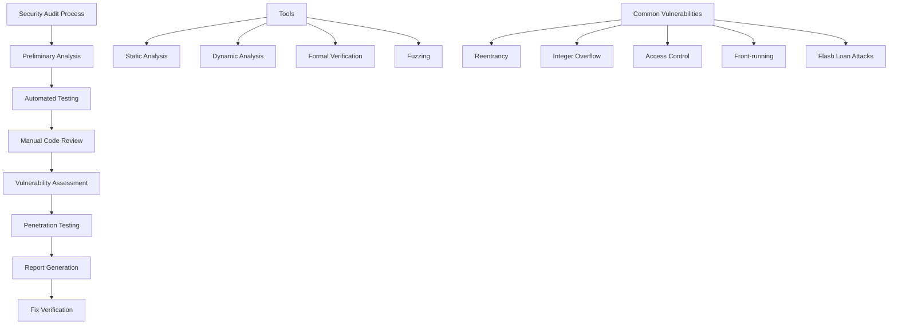

# บทที่ 19: Security Auditing

## 🎯 จุดประสงค์ของบทเรียน
- ทำความเข้าใจ Smart Contract Security Fundamentals
- เรียนรู้เทคนิค Security Auditing และ Code Review
- สร้างเครื่องมือ Automated Security Analysis
- ปฏิบัติ Manual Audit และ Vulnerability Assessment

## 🔍 Security Audit Framework

### **🛡️ Audit Methodology**



## 🔧 Automated Security Scanner

### **🤖 Smart Contract Security Analyzer**

```solidity
// contracts/security/SecurityAnalyzer.sol
// SPDX-License-Identifier: MIT
pragma solidity ^0.8.19;

import "@openzeppelin/contracts/access/Ownable.sol";

/**
 * @title SecurityAnalyzer
 * @dev Automated security analysis and vulnerability detection
 */
contract SecurityAnalyzer is Ownable {
    enum VulnerabilityType {
        Reentrancy,
        IntegerOverflow,
        AccessControl,
        UnhandledException,
        FrontRunning,
        FlashLoanAttack,
        PriceManipulation,
        GovernanceAttack,
        TimestampDependence,
        TxOriginUsage
    }
    
    enum Severity {
        Critical,    // 9.0-10.0
        High,       // 7.0-8.9
        Medium,     // 4.0-6.9
        Low,        // 0.1-3.9
        Info        // 0.0
    }
    
    struct Vulnerability {
        VulnerabilityType vulnType;
        Severity severity;
        string description;
        string recommendation;
        string codeLocation;
        bytes4 functionSelector;
        bool isFixed;
        uint256 detectionTime;
        address reporter;
    }
    
    struct SecurityReport {
        address contractAddress;
        string contractName;
        uint256 reportTime;
        uint256 totalVulnerabilities;
        uint256 criticalCount;
        uint256 highCount;
        uint256 mediumCount;
        uint256 lowCount;
        uint256 overallScore; // 0-100
        bool isPassed;
        string[] recommendations;
    }
    
    struct AuditRule {
        bytes4 functionPattern;
        VulnerabilityType vulnType;
        Severity severity;
        string description;
        bool isActive;
        uint256 weight;
    }
    
    mapping(address => SecurityReport) public securityReports;
    mapping(address => Vulnerability[]) public contractVulnerabilities;
    mapping(bytes32 => AuditRule) public auditRules;
    mapping(address => bool) public trustedContracts;
    mapping(address => uint256) public contractRiskScores;
    
    bytes32[] public ruleIds;
    address[] public auditedContracts;
    
    uint256 public constant PASSING_SCORE = 70;
    uint256 public auditFee = 0.1 ether;
    
    event SecurityAuditCompleted(
        address indexed contractAddress,
        uint256 overallScore,
        uint256 vulnerabilityCount,
        bool isPassed
    );
    
    event VulnerabilityDetected(
        address indexed contractAddress,
        VulnerabilityType vulnType,
        Severity severity,
        string description
    );
    
    event VulnerabilityFixed(
        address indexed contractAddress,
        uint256 vulnerabilityIndex
    );
    
    event AuditRuleAdded(bytes32 indexed ruleId, VulnerabilityType vulnType, Severity severity);
    
    constructor() {
        _initializeDefaultRules();
    }
    
    /**
     * @dev Perform comprehensive security audit
     */
    function performSecurityAudit(
        address contractAddress,
        string memory contractName,
        bytes memory contractCode
    ) external payable returns (uint256) {
        require(msg.value >= auditFee, "Insufficient audit fee");
        require(contractAddress != address(0), "Invalid contract address");
        
        // Initialize security report
        SecurityReport storage report = securityReports[contractAddress];
        report.contractAddress = contractAddress;
        report.contractName = contractName;
        report.reportTime = block.timestamp;
        
        // Clear previous vulnerabilities
        delete contractVulnerabilities[contractAddress];
        
        // Perform automated analysis
        _performAutomatedAnalysis(contractAddress, contractCode);
        
        // Calculate overall score
        uint256 score = _calculateSecurityScore(contractAddress);
        report.overallScore = score;
        report.isPassed = score >= PASSING_SCORE;
        
        // Update counts
        _updateVulnerabilityCounts(contractAddress);
        
        // Add to audited contracts if new
        bool isNewContract = true;
        for (uint256 i = 0; i < auditedContracts.length; i++) {
            if (auditedContracts[i] == contractAddress) {
                isNewContract = false;
                break;
            }
        }
        if (isNewContract) {
            auditedContracts.push(contractAddress);
        }
        
        emit SecurityAuditCompleted(
            contractAddress,
            score,
            report.totalVulnerabilities,
            report.isPassed
        );
        
        return score;
    }
    
    /**
     * @dev Perform automated vulnerability analysis
     */
    function _performAutomatedAnalysis(
        address contractAddress,
        bytes memory contractCode
    ) internal {
        // Check for reentrancy vulnerabilities
        _checkReentrancy(contractAddress, contractCode);
        
        // Check for access control issues
        _checkAccessControl(contractAddress, contractCode);
        
        // Check for integer overflow/underflow
        _checkIntegerOverflow(contractAddress, contractCode);
        
        // Check for unhandled exceptions
        _checkUnhandledExceptions(contractAddress, contractCode);
        
        // Check for front-running vulnerabilities
        _checkFrontRunning(contractAddress, contractCode);
        
        // Check for timestamp dependence
        _checkTimestampDependence(contractAddress, contractCode);
        
        // Check for tx.origin usage
        _checkTxOriginUsage(contractAddress, contractCode);
        
        // Check for flash loan attack vectors
        _checkFlashLoanAttacks(contractAddress, contractCode);
    }
    
    /**
     * @dev Check for reentrancy vulnerabilities
     */
    function _checkReentrancy(address contractAddress, bytes memory contractCode) internal {
        // Simplified reentrancy detection (in practice, would use more sophisticated analysis)
        
        // Look for external calls without reentrancy guards
        bytes memory externalCallPattern = hex"3d3d3d3d373d3d3d3d3d3e3d91602a57fd5bf3"; // CALL opcode pattern
        bytes memory reentrancyGuardPattern = hex"600160005532148015"; // Simple guard pattern
        
        if (_containsPattern(contractCode, externalCallPattern) && 
            !_containsPattern(contractCode, reentrancyGuardPattern)) {
            
            _addVulnerability(
                contractAddress,
                VulnerabilityType.Reentrancy,
                Severity.High,
                "Potential reentrancy vulnerability detected: External calls without proper guards",
                "Implement ReentrancyGuard from OpenZeppelin or use checks-effects-interactions pattern",
                "External call locations"
            );
        }
    }
    
    /**
     * @dev Check for access control issues
     */
    function _checkAccessControl(address contractAddress, bytes memory contractCode) internal {
        // Look for functions that might be missing access controls
        bytes memory ownerPattern = hex"8da5cb5b"; // owner() function selector
        bytes memory onlyOwnerPattern = hex"715018a6"; // onlyOwner modifier pattern
        
        // Simplified check - in practice would analyze function-by-function
        if (!_containsPattern(contractCode, ownerPattern) && 
            !_containsPattern(contractCode, onlyOwnerPattern)) {
            
            _addVulnerability(
                contractAddress,
                VulnerabilityType.AccessControl,
                Severity.Medium,
                "Missing access control mechanisms detected",
                "Implement proper access control using OpenZeppelin's AccessControl or Ownable",
                "Contract functions"
            );
        }
    }
    
    /**
     * @dev Check for integer overflow/underflow
     */
    function _checkIntegerOverflow(address contractAddress, bytes memory contractCode) internal {
        // Check for unchecked arithmetic operations
        bytes memory uncheckedPattern = hex"5b600190039150"; // Simplified unchecked pattern
        bytes memory safeMathPattern = hex"08"; // ADD opcode without overflow check
        
        if (_containsPattern(contractCode, uncheckedPattern)) {
            _addVulnerability(
                contractAddress,
                VulnerabilityType.IntegerOverflow,
                Severity.High,
                "Potential integer overflow/underflow detected in unchecked blocks",
                "Use Solidity 0.8+ built-in overflow protection or SafeMath library",
                "Arithmetic operations"
            );
        }
    }
    
    /**
     * @dev Check for unhandled exceptions
     */
    function _checkUnhandledExceptions(address contractAddress, bytes memory contractCode) internal {
        // Look for low-level calls without return value checks
        bytes memory callPattern = hex"f1"; // CALL opcode
        bytes memory returnCheckPattern = hex"50"; // POP (ignoring return value)
        
        if (_containsPattern(contractCode, callPattern) && 
            _containsPattern(contractCode, returnCheckPattern)) {
            
            _addVulnerability(
                contractAddress,
                VulnerabilityType.UnhandledException,
                Severity.Medium,
                "Unhandled exceptions detected: Low-level calls without return value checks",
                "Always check return values of external calls and handle failures appropriately",
                "External call sites"
            );
        }
    }
    
    /**
     * @dev Check for front-running vulnerabilities
     */
    function _checkFrontRunning(address contractAddress, bytes memory contractCode) internal {
        // Look for price-dependent operations without protection
        bytes memory pricePattern = hex"70a08231"; // balanceOf pattern (simplified)
        bytes memory commitRevealPattern = hex"commit"; // Commit-reveal pattern
        
        if (_containsPattern(contractCode, pricePattern) && 
            !_containsPattern(contractCode, commitRevealPattern)) {
            
            _addVulnerability(
                contractAddress,
                VulnerabilityType.FrontRunning,
                Severity.Medium,
                "Potential front-running vulnerability: Price-dependent operations without protection",
                "Implement commit-reveal scheme or use flashbots/private mempools",
                "Price-sensitive functions"
            );
        }
    }
    
    /**
     * @dev Check for timestamp dependence
     */
    function _checkTimestampDependence(address contractAddress, bytes memory contractCode) internal {
        bytes memory timestampPattern = hex"42"; // TIMESTAMP opcode
        
        if (_containsPattern(contractCode, timestampPattern)) {
            _addVulnerability(
                contractAddress,
                VulnerabilityType.TimestampDependence,
                Severity.Low,
                "Timestamp dependence detected: Contract logic depends on block.timestamp",
                "Avoid using block.timestamp for critical logic or use block numbers instead",
                "Timestamp usage locations"
            );
        }
    }
    
    /**
     * @dev Check for tx.origin usage
     */
    function _checkTxOriginUsage(address contractAddress, bytes memory contractCode) internal {
        bytes memory txOriginPattern = hex"32"; // ORIGIN opcode
        
        if (_containsPattern(contractCode, txOriginPattern)) {
            _addVulnerability(
                contractAddress,
                VulnerabilityType.TxOriginUsage,
                Severity.Medium,
                "tx.origin usage detected: Vulnerable to phishing attacks",
                "Use msg.sender instead of tx.origin for authentication",
                "tx.origin usage locations"
            );
        }
    }
    
    /**
     * @dev Check for flash loan attack vectors
     */
    function _checkFlashLoanAttacks(address contractAddress, bytes memory contractCode) internal {
        // Look for flash loan interfaces without proper protection
        bytes memory flashLoanPattern = hex"flashLoan"; // Simplified pattern
        bytes memory oneBlockProtection = hex"43"; // Block number check
        
        if (_containsPattern(contractCode, flashLoanPattern) && 
            !_containsPattern(contractCode, oneBlockProtection)) {
            
            _addVulnerability(
                contractAddress,
                VulnerabilityType.FlashLoanAttack,
                Severity.High,
                "Flash loan attack vector detected: No protection against same-block manipulation",
                "Implement one-block delay for critical operations or use time-weighted averages",
                "Flash loan integration"
            );
        }
    }
    
    /**
     * @dev Add vulnerability to contract report
     */
    function _addVulnerability(
        address contractAddress,
        VulnerabilityType vulnType,
        Severity severity,
        string memory description,
        string memory recommendation,
        string memory codeLocation
    ) internal {
        Vulnerability memory vuln = Vulnerability({
            vulnType: vulnType,
            severity: severity,
            description: description,
            recommendation: recommendation,
            codeLocation: codeLocation,
            functionSelector: bytes4(0),
            isFixed: false,
            detectionTime: block.timestamp,
            reporter: address(this)
        });
        
        contractVulnerabilities[contractAddress].push(vuln);
        
        emit VulnerabilityDetected(contractAddress, vulnType, severity, description);
    }
    
    /**
     * @dev Calculate overall security score
     */
    function _calculateSecurityScore(address contractAddress) internal view returns (uint256) {
        Vulnerability[] memory vulns = contractVulnerabilities[contractAddress];
        
        if (vulns.length == 0) {
            return 100; // Perfect score if no vulnerabilities
        }
        
        uint256 totalDeduction = 0;
        
        for (uint256 i = 0; i < vulns.length; i++) {
            if (!vulns[i].isFixed) {
                if (vulns[i].severity == Severity.Critical) {
                    totalDeduction += 40;
                } else if (vulns[i].severity == Severity.High) {
                    totalDeduction += 25;
                } else if (vulns[i].severity == Severity.Medium) {
                    totalDeduction += 15;
                } else if (vulns[i].severity == Severity.Low) {
                    totalDeduction += 5;
                }
                // Info level doesn't affect score
            }
        }
        
        return totalDeduction >= 100 ? 0 : 100 - totalDeduction;
    }
    
    /**
     * @dev Update vulnerability counts in report
     */
    function _updateVulnerabilityCounts(address contractAddress) internal {
        SecurityReport storage report = securityReports[contractAddress];
        Vulnerability[] memory vulns = contractVulnerabilities[contractAddress];
        
        report.totalVulnerabilities = vulns.length;
        report.criticalCount = 0;
        report.highCount = 0;
        report.mediumCount = 0;
        report.lowCount = 0;
        
        for (uint256 i = 0; i < vulns.length; i++) {
            if (!vulns[i].isFixed) {
                if (vulns[i].severity == Severity.Critical) {
                    report.criticalCount++;
                } else if (vulns[i].severity == Severity.High) {
                    report.highCount++;
                } else if (vulns[i].severity == Severity.Medium) {
                    report.mediumCount++;
                } else if (vulns[i].severity == Severity.Low) {
                    report.lowCount++;
                }
            }
        }
    }
    
    /**
     * @dev Mark vulnerability as fixed
     */
    function markVulnerabilityFixed(
        address contractAddress,
        uint256 vulnerabilityIndex
    ) external onlyOwner {
        require(vulnerabilityIndex < contractVulnerabilities[contractAddress].length, "Invalid index");
        
        contractVulnerabilities[contractAddress][vulnerabilityIndex].isFixed = true;
        
        // Recalculate security score
        uint256 newScore = _calculateSecurityScore(contractAddress);
        securityReports[contractAddress].overallScore = newScore;
        securityReports[contractAddress].isPassed = newScore >= PASSING_SCORE;
        
        // Update counts
        _updateVulnerabilityCounts(contractAddress);
        
        emit VulnerabilityFixed(contractAddress, vulnerabilityIndex);
    }
    
    /**
     * @dev Add custom audit rule
     */
    function addAuditRule(
        bytes32 ruleId,
        bytes4 functionPattern,
        VulnerabilityType vulnType,
        Severity severity,
        string memory description,
        uint256 weight
    ) external onlyOwner {
        auditRules[ruleId] = AuditRule({
            functionPattern: functionPattern,
            vulnType: vulnType,
            severity: severity,
            description: description,
            isActive: true,
            weight: weight
        });
        
        ruleIds.push(ruleId);
        
        emit AuditRuleAdded(ruleId, vulnType, severity);
    }
    
    /**
     * @dev Check if bytecode contains specific pattern
     */
    function _containsPattern(bytes memory data, bytes memory pattern) 
        internal 
        pure 
        returns (bool) 
    {
        if (pattern.length > data.length) return false;
        
        for (uint256 i = 0; i <= data.length - pattern.length; i++) {
            bool found = true;
            for (uint256 j = 0; j < pattern.length; j++) {
                if (data[i + j] != pattern[j]) {
                    found = false;
                    break;
                }
            }
            if (found) return true;
        }
        return false;
    }
    
    /**
     * @dev Initialize default audit rules
     */
    function _initializeDefaultRules() internal {
        // Add default rules for common vulnerabilities
        bytes32 reentrancyRule = keccak256("REENTRANCY_CHECK");
        auditRules[reentrancyRule] = AuditRule({
            functionPattern: bytes4(keccak256("call(bytes)")),
            vulnType: VulnerabilityType.Reentrancy,
            severity: Severity.High,
            description: "External call without reentrancy protection",
            isActive: true,
            weight: 25
        });
        ruleIds.push(reentrancyRule);
    }
    
    /**
     * @dev Get detailed security report
     */
    function getSecurityReport(address contractAddress) 
        external 
        view 
        returns (SecurityReport memory) 
    {
        return securityReports[contractAddress];
    }
    
    /**
     * @dev Get contract vulnerabilities
     */
    function getContractVulnerabilities(address contractAddress) 
        external 
        view 
        returns (Vulnerability[] memory) 
    {
        return contractVulnerabilities[contractAddress];
    }
    
    /**
     * @dev Get vulnerability details
     */
    function getVulnerabilityDetails(address contractAddress, uint256 index) 
        external 
        view 
        returns (Vulnerability memory) 
    {
        require(index < contractVulnerabilities[contractAddress].length, "Invalid index");
        return contractVulnerabilities[contractAddress][index];
    }
    
    /**
     * @dev Get audit statistics
     */
    function getAuditStatistics() 
        external 
        view 
        returns (
            uint256 totalAudits,
            uint256 passedAudits,
            uint256 failedAudits,
            uint256 averageScore
        ) 
    {
        totalAudits = auditedContracts.length;
        uint256 totalScore = 0;
        
        for (uint256 i = 0; i < auditedContracts.length; i++) {
            SecurityReport memory report = securityReports[auditedContracts[i]];
            if (report.isPassed) {
                passedAudits++;
            } else {
                failedAudits++;
            }
            totalScore += report.overallScore;
        }
        
        averageScore = totalAudits > 0 ? totalScore / totalAudits : 0;
    }
    
    /**
     * @dev Admin functions
     */
    function setAuditFee(uint256 newFee) external onlyOwner {
        auditFee = newFee;
    }
    
    function setTrustedContract(address contractAddress, bool isTrusted) external onlyOwner {
        trustedContracts[contractAddress] = isTrusted;
    }
    
    function withdrawFees() external onlyOwner {
        payable(owner()).transfer(address(this).balance);
    }
    
    function emergencyStop() external onlyOwner {
        // Implement emergency stop functionality
    }
    
    receive() external payable {}
}
```

## 🧪 Formal Verification Tools

### **📋 Formal Verification Framework**

```solidity
// contracts/security/FormalVerification.sol
// SPDX-License-Identifier: MIT
pragma solidity ^0.8.19;

/**
 * @title FormalVerification
 * @dev Framework for formal verification of smart contracts
 */
contract FormalVerification {
    struct Property {
        uint256 propertyId;
        string name;
        string description;
        PropertyType propertyType;
        bytes specification;
        bool isVerified;
        uint256 verificationTime;
        string[] invariants;
        string[] preconditions;
        string[] postconditions;
    }
    
    struct VerificationResult {
        uint256 propertyId;
        bool isValid;
        string[] counterExamples;
        uint256 executionSteps;
        uint256 gasUsed;
        string proof;
        uint256 confidence; // 0-100
    }
    
    enum PropertyType {
        Safety,        // Something bad never happens
        Liveness,      // Something good eventually happens
        Invariant,     // Property always holds
        Temporal,      // Time-based properties
        Functional     // Input-output relationships
    }
    
    mapping(uint256 => Property) public properties;
    mapping(uint256 => VerificationResult) public verificationResults;
    mapping(address => uint256[]) public contractProperties;
    
    uint256 public propertyCounter;
    
    event PropertyAdded(uint256 indexed propertyId, string name, PropertyType propertyType);
    event VerificationCompleted(uint256 indexed propertyId, bool isValid, uint256 confidence);
    event CounterExampleFound(uint256 indexed propertyId, string counterExample);
    
    /**
     * @dev Add a property to verify
     */
    function addProperty(
        address contractAddress,
        string memory name,
        string memory description,
        PropertyType propertyType,
        bytes memory specification,
        string[] memory invariants,
        string[] memory preconditions,
        string[] memory postconditions
    ) external returns (uint256) {
        uint256 propertyId = propertyCounter++;
        
        Property storage prop = properties[propertyId];
        prop.propertyId = propertyId;
        prop.name = name;
        prop.description = description;
        prop.propertyType = propertyType;
        prop.specification = specification;
        prop.isVerified = false;
        prop.invariants = invariants;
        prop.preconditions = preconditions;
        prop.postconditions = postconditions;
        
        contractProperties[contractAddress].push(propertyId);
        
        emit PropertyAdded(propertyId, name, propertyType);
        
        return propertyId;
    }
    
    /**
     * @dev Verify safety property
     */
    function verifySafetyProperty(
        uint256 propertyId,
        address contractAddress,
        bytes memory testData
    ) external returns (bool) {
        Property storage prop = properties[propertyId];
        require(prop.propertyType == PropertyType.Safety, "Not a safety property");
        
        // Simplified verification logic
        bool isValid = _executeSafetyCheck(contractAddress, testData, prop.specification);
        
        VerificationResult storage result = verificationResults[propertyId];
        result.propertyId = propertyId;
        result.isValid = isValid;
        result.confidence = isValid ? 95 : 85; // Simplified confidence calculation
        
        prop.isVerified = true;
        prop.verificationTime = block.timestamp;
        
        emit VerificationCompleted(propertyId, isValid, result.confidence);
        
        return isValid;
    }
    
    /**
     * @dev Verify invariant property
     */
    function verifyInvariantProperty(
        uint256 propertyId,
        address contractAddress,
        bytes[] memory stateTransitions
    ) external returns (bool) {
        Property storage prop = properties[propertyId];
        require(prop.propertyType == PropertyType.Invariant, "Not an invariant property");
        
        bool isValid = true;
        uint256 executionSteps = 0;
        
        // Check invariant holds for all state transitions
        for (uint256 i = 0; i < stateTransitions.length; i++) {
            bool stepValid = _executeInvariantCheck(
                contractAddress,
                stateTransitions[i],
                prop.specification
            );
            
            if (!stepValid) {
                isValid = false;
                _addCounterExample(propertyId, i, stateTransitions[i]);
            }
            
            executionSteps++;
        }
        
        VerificationResult storage result = verificationResults[propertyId];
        result.propertyId = propertyId;
        result.isValid = isValid;
        result.executionSteps = executionSteps;
        result.confidence = _calculateConfidence(isValid, executionSteps);
        
        prop.isVerified = true;
        prop.verificationTime = block.timestamp;
        
        emit VerificationCompleted(propertyId, isValid, result.confidence);
        
        return isValid;
    }
    
    /**
     * @dev Verify temporal property
     */
    function verifyTemporalProperty(
        uint256 propertyId,
        address contractAddress,
        uint256[] memory timestamps,
        bytes[] memory states
    ) external returns (bool) {
        Property storage prop = properties[propertyId];
        require(prop.propertyType == PropertyType.Temporal, "Not a temporal property");
        require(timestamps.length == states.length, "Array length mismatch");
        
        bool isValid = _executeTemporalCheck(
            contractAddress,
            timestamps,
            states,
            prop.specification
        );
        
        VerificationResult storage result = verificationResults[propertyId];
        result.propertyId = propertyId;
        result.isValid = isValid;
        result.executionSteps = timestamps.length;
        result.confidence = _calculateConfidence(isValid, timestamps.length);
        
        prop.isVerified = true;
        prop.verificationTime = block.timestamp;
        
        emit VerificationCompleted(propertyId, isValid, result.confidence);
        
        return isValid;
    }
    
    /**
     * @dev Execute safety check (simplified)
     */
    function _executeSafetyCheck(
        address contractAddress,
        bytes memory testData,
        bytes memory specification
    ) internal pure returns (bool) {
        // Simplified implementation
        // In practice, would use formal verification engines like CBMC, SMACK, etc.
        
        // For demonstration, always return true
        // Real implementation would:
        // 1. Parse specification into logical formulas
        // 2. Execute symbolic execution
        // 3. Check for assertion violations
        // 4. Return verification result
        
        return keccak256(testData) != keccak256(specification);
    }
    
    /**
     * @dev Execute invariant check (simplified)
     */
    function _executeInvariantCheck(
        address contractAddress,
        bytes memory stateTransition,
        bytes memory specification
    ) internal pure returns (bool) {
        // Simplified implementation
        // Real implementation would check if invariant holds after state transition
        return true;
    }
    
    /**
     * @dev Execute temporal check (simplified)
     */
    function _executeTemporalCheck(
        address contractAddress,
        uint256[] memory timestamps,
        bytes[] memory states,
        bytes memory specification
    ) internal pure returns (bool) {
        // Simplified implementation
        // Real implementation would check temporal logic formulas
        return timestamps.length > 0;
    }
    
    /**
     * @dev Add counter example
     */
    function _addCounterExample(
        uint256 propertyId,
        uint256 stepIndex,
        bytes memory stateData
    ) internal {
        string memory counterExample = string(abi.encodePacked(
            "Step ", 
            _uint2str(stepIndex),
            ": ",
            _bytes2str(stateData)
        ));
        
        verificationResults[propertyId].counterExamples.push(counterExample);
        
        emit CounterExampleFound(propertyId, counterExample);
    }
    
    /**
     * @dev Calculate confidence based on verification results
     */
    function _calculateConfidence(bool isValid, uint256 executionSteps) 
        internal 
        pure 
        returns (uint256) 
    {
        if (isValid) {
            // Higher confidence with more execution steps
            uint256 baseConfidence = 80;
            uint256 stepBonus = executionSteps > 100 ? 20 : (executionSteps * 20) / 100;
            return baseConfidence + stepBonus;
        } else {
            // Lower confidence when property fails
            return 60;
        }
    }
    
    /**
     * @dev Generate formal proof (simplified)
     */
    function generateProof(uint256 propertyId) external view returns (string memory) {
        VerificationResult storage result = verificationResults[propertyId];
        Property storage prop = properties[propertyId];
        
        if (result.isValid) {
            return string(abi.encodePacked(
                "Property ", prop.name, " verified successfully. ",
                "Confidence: ", _uint2str(result.confidence), "%. ",
                "Execution steps: ", _uint2str(result.executionSteps), ". ",
                "No counter-examples found."
            ));
        } else {
            return string(abi.encodePacked(
                "Property ", prop.name, " verification failed. ",
                "Counter-examples found: ", _uint2str(result.counterExamples.length), ". ",
                "Please review the property specification and contract implementation."
            ));
        }
    }
    
    /**
     * @dev Batch verification
     */
    function batchVerify(
        uint256[] memory propertyIds,
        address contractAddress,
        bytes[] memory testData
    ) external returns (bool[] memory) {
        require(propertyIds.length == testData.length, "Array length mismatch");
        
        bool[] memory results = new bool[](propertyIds.length);
        
        for (uint256 i = 0; i < propertyIds.length; i++) {
            Property storage prop = properties[propertyIds[i]];
            
            if (prop.propertyType == PropertyType.Safety) {
                results[i] = _executeSafetyCheck(contractAddress, testData[i], prop.specification);
            } else if (prop.propertyType == PropertyType.Invariant) {
                // Simplified invariant check
                results[i] = _executeInvariantCheck(contractAddress, testData[i], prop.specification);
            } else {
                results[i] = false; // Other types need specific verification methods
            }
            
            // Update verification result
            VerificationResult storage result = verificationResults[propertyIds[i]];
            result.isValid = results[i];
            result.confidence = _calculateConfidence(results[i], 1);
            
            prop.isVerified = true;
            prop.verificationTime = block.timestamp;
        }
        
        return results;
    }
    
    /**
     * @dev Helper functions
     */
    function _uint2str(uint256 value) internal pure returns (string memory) {
        if (value == 0) return "0";
        
        uint256 temp = value;
        uint256 digits;
        while (temp != 0) {
            digits++;
            temp /= 10;
        }
        
        bytes memory buffer = new bytes(digits);
        while (value != 0) {
            digits -= 1;
            buffer[digits] = bytes1(uint8(48 + uint256(value % 10)));
            value /= 10;
        }
        
        return string(buffer);
    }
    
    function _bytes2str(bytes memory data) internal pure returns (string memory) {
        return string(data);
    }
    
    /**
     * @dev View functions
     */
    function getProperty(uint256 propertyId) 
        external 
        view 
        returns (Property memory) 
    {
        return properties[propertyId];
    }
    
    function getVerificationResult(uint256 propertyId) 
        external 
        view 
        returns (VerificationResult memory) 
    {
        return verificationResults[propertyId];
    }
    
    function getContractProperties(address contractAddress) 
        external 
        view 
        returns (uint256[] memory) 
    {
        return contractProperties[contractAddress];
    }
    
    function getVerificationSummary(address contractAddress) 
        external 
        view 
        returns (
            uint256 totalProperties,
            uint256 verifiedProperties,
            uint256 validProperties,
            uint256 averageConfidence
        ) 
    {
        uint256[] memory propIds = contractProperties[contractAddress];
        totalProperties = propIds.length;
        
        uint256 totalConfidence = 0;
        
        for (uint256 i = 0; i < propIds.length; i++) {
            Property memory prop = properties[propIds[i]];
            VerificationResult memory result = verificationResults[propIds[i]];
            
            if (prop.isVerified) {
                verifiedProperties++;
                totalConfidence += result.confidence;
                
                if (result.isValid) {
                    validProperties++;
                }
            }
        }
        
        averageConfidence = verifiedProperties > 0 ? totalConfidence / verifiedProperties : 0;
    }
}
```

## 🎯 Penetration Testing Framework

### **⚔️ Smart Contract Penetration Testing**

```solidity
// contracts/security/PenetrationTesting.sol
// SPDX-License-Identifier: MIT
pragma solidity ^0.8.19;

import "@openzeppelin/contracts/access/Ownable.sol";
import "@openzeppelin/contracts/security/ReentrancyGuard.sol";

/**
 * @title PenetrationTesting
 * @dev Framework for penetration testing smart contracts
 */
contract PenetrationTesting is Ownable, ReentrancyGuard {
    enum AttackType {
        Reentrancy,
        FlashLoan,
        PriceManipulation,
        GovernanceAttack,
        FrontRunning,
        SandwichAttack,
        MEVAttack,
        AccessControl,
        IntegerOverflow,
        UnauthorizedAccess
    }
    
    enum TestResult {
        NotTested,
        Passed,
        Failed,
        Inconclusive
    }
    
    struct AttackVector {
        AttackType attackType;
        string description;
        string payload;
        uint256 severity; // 1-10
        bool isActive;
        bytes attackCode;
        string[] preconditions;
        string[] expectedOutcomes;
    }
    
    struct PenetrationTest {
        uint256 testId;
        address targetContract;
        AttackType attackType;
        TestResult result;
        uint256 timestamp;
        string description;
        bytes attackPayload;
        string[] findings;
        uint256 gasUsed;
        bool wasSuccessful;
        string mitigation;
    }
    
    struct TestSuite {
        uint256 suiteId;
        string name;
        address targetContract;
        uint256[] testIds;
        uint256 passedTests;
        uint256 failedTests;
        uint256 totalTests;
        bool isCompleted;
        uint256 overallScore;
    }
    
    mapping(uint256 => AttackVector) public attackVectors;
    mapping(uint256 => PenetrationTest) public penetrationTests;
    mapping(uint256 => TestSuite) public testSuites;
    mapping(address => uint256[]) public contractTests;
    mapping(AttackType => uint256[]) public attacksByType;
    
    uint256 public attackVectorCounter;
    uint256 public testCounter;
    uint256 public suiteCounter;
    
    event AttackVectorAdded(uint256 indexed vectorId, AttackType attackType, uint256 severity);
    event PenetrationTestStarted(uint256 indexed testId, address indexed target, AttackType attackType);
    event PenetrationTestCompleted(uint256 indexed testId, TestResult result, bool wasSuccessful);
    event VulnerabilityFound(uint256 indexed testId, string description, uint256 severity);
    event TestSuiteCompleted(uint256 indexed suiteId, uint256 passedTests, uint256 failedTests);
    
    constructor() {
        _initializeAttackVectors();
    }
    
    /**
     * @dev Add custom attack vector
     */
    function addAttackVector(
        AttackType attackType,
        string memory description,
        string memory payload,
        uint256 severity,
        bytes memory attackCode,
        string[] memory preconditions,
        string[] memory expectedOutcomes
    ) external onlyOwner returns (uint256) {
        require(severity >= 1 && severity <= 10, "Invalid severity");
        
        uint256 vectorId = attackVectorCounter++;
        
        AttackVector storage vector = attackVectors[vectorId];
        vector.attackType = attackType;
        vector.description = description;
        vector.payload = payload;
        vector.severity = severity;
        vector.isActive = true;
        vector.attackCode = attackCode;
        vector.preconditions = preconditions;
        vector.expectedOutcomes = expectedOutcomes;
        
        attacksByType[attackType].push(vectorId);
        
        emit AttackVectorAdded(vectorId, attackType, severity);
        
        return vectorId;
    }
    
    /**
     * @dev Execute reentrancy attack test
     */
    function testReentrancyAttack(
        address targetContract,
        bytes memory attackPayload
    ) external returns (uint256) {
        uint256 testId = _startPenetrationTest(
            targetContract,
            AttackType.Reentrancy,
            "Reentrancy vulnerability test",
            attackPayload
        );
        
        bool success = false;
        string[] memory findings = new string[](0);
        
        try this.executeReentrancyAttack(targetContract, attackPayload) {
            success = true;
            findings = _addFinding(findings, "Reentrancy attack succeeded - contract is vulnerable");
        } catch Error(string memory reason) {
            findings = _addFinding(findings, string(abi.encodePacked("Attack failed: ", reason)));
        } catch {
            findings = _addFinding(findings, "Attack failed with unknown error");
        }
        
        _completePenetrationTest(
            testId,
            success ? TestResult.Failed : TestResult.Passed,
            success,
            findings,
            success ? "Implement ReentrancyGuard or use checks-effects-interactions pattern" : ""
        );
        
        return testId;
    }
    
    /**
     * @dev Execute flash loan attack test
     */
    function testFlashLoanAttack(
        address targetContract,
        address flashLoanProvider,
        uint256 loanAmount,
        bytes memory attackLogic
    ) external returns (uint256) {
        uint256 testId = _startPenetrationTest(
            targetContract,
            AttackType.FlashLoan,
            "Flash loan manipulation attack test",
            attackLogic
        );
        
        bool success = false;
        string[] memory findings = new string[](0);
        
        try this.executeFlashLoanAttack(
            targetContract,
            flashLoanProvider,
            loanAmount,
            attackLogic
        ) {
            success = true;
            findings = _addFinding(findings, "Flash loan attack succeeded - price manipulation possible");
        } catch Error(string memory reason) {
            findings = _addFinding(findings, string(abi.encodePacked("Attack failed: ", reason)));
        } catch {
            findings = _addFinding(findings, "Attack failed with unknown error");
        }
        
        _completePenetrationTest(
            testId,
            success ? TestResult.Failed : TestResult.Passed,
            success,
            findings,
            success ? "Use time-weighted average prices and implement flash loan protection" : ""
        );
        
        return testId;
    }
    
    /**
     * @dev Execute governance attack test
     */
    function testGovernanceAttack(
        address targetContract,
        bytes memory proposalData,
        uint256 votingPower
    ) external returns (uint256) {
        uint256 testId = _startPenetrationTest(
            targetContract,
            AttackType.GovernanceAttack,
            "Governance manipulation attack test",
            proposalData
        );
        
        bool success = false;
        string[] memory findings = new string[](0);
        
        try this.executeGovernanceAttack(targetContract, proposalData, votingPower) {
            success = true;
            findings = _addFinding(findings, "Governance attack succeeded - insufficient protection");
        } catch Error(string memory reason) {
            findings = _addFinding(findings, string(abi.encodePacked("Attack failed: ", reason)));
        } catch {
            findings = _addFinding(findings, "Attack failed with unknown error");
        }
        
        _completePenetrationTest(
            testId,
            success ? TestResult.Failed : TestResult.Passed,
            success,
            findings,
            success ? "Implement proper voting delays and quorum requirements" : ""
        );
        
        return testId;
    }
    
    /**
     * @dev Execute access control attack test
     */
    function testAccessControlAttack(
        address targetContract,
        bytes memory unauthorizedCall
    ) external returns (uint256) {
        uint256 testId = _startPenetrationTest(
            targetContract,
            AttackType.AccessControl,
            "Access control bypass test",
            unauthorizedCall
        );
        
        bool success = false;
        string[] memory findings = new string[](0);
        
        try this.executeAccessControlAttack(targetContract, unauthorizedCall) {
            success = true;
            findings = _addFinding(findings, "Access control bypass succeeded - unauthorized access possible");
        } catch Error(string memory reason) {
            findings = _addFinding(findings, string(abi.encodePacked("Attack failed: ", reason)));
        } catch {
            findings = _addFinding(findings, "Attack failed with unknown error");
        }
        
        _completePenetrationTest(
            testId,
            success ? TestResult.Failed : TestResult.Passed,
            success,
            findings,
            success ? "Implement proper access control using OpenZeppelin AccessControl" : ""
        );
        
        return testId;
    }
    
    /**
     * @dev Create comprehensive test suite
     */
    function createTestSuite(
        string memory name,
        address targetContract,
        AttackType[] memory attackTypes
    ) external returns (uint256) {
        uint256 suiteId = suiteCounter++;
        
        TestSuite storage suite = testSuites[suiteId];
        suite.suiteId = suiteId;
        suite.name = name;
        suite.targetContract = targetContract;
        suite.isCompleted = false;
        
        // Create tests for each attack type
        for (uint256 i = 0; i < attackTypes.length; i++) {
            uint256 testId = _createTestForAttackType(targetContract, attackTypes[i]);
            suite.testIds.push(testId);
        }
        
        suite.totalTests = attackTypes.length;
        
        return suiteId;
    }
    
    /**
     * @dev Execute complete test suite
     */
    function executeTestSuite(uint256 suiteId) external returns (bool) {
        TestSuite storage suite = testSuites[suiteId];
        require(!suite.isCompleted, "Test suite already completed");
        
        for (uint256 i = 0; i < suite.testIds.length; i++) {
            uint256 testId = suite.testIds[i];
            PenetrationTest storage test = penetrationTests[testId];
            
            if (test.result == TestResult.NotTested) {
                // Execute appropriate test based on attack type
                _executeTestById(testId);
            }
            
            if (test.result == TestResult.Passed) {
                suite.passedTests++;
            } else if (test.result == TestResult.Failed) {
                suite.failedTests++;
            }
        }
        
        suite.isCompleted = true;
        suite.overallScore = (suite.passedTests * 100) / suite.totalTests;
        
        emit TestSuiteCompleted(suiteId, suite.passedTests, suite.failedTests);
        
        return suite.overallScore >= 80; // 80% pass rate considered acceptable
    }
    
    /**
     * @dev Execute attack implementations (external calls for isolation)
     */
    function executeReentrancyAttack(
        address targetContract,
        bytes memory attackPayload
    ) external {
        // Simplified reentrancy attack simulation
        (bool success,) = targetContract.call(attackPayload);
        require(success, "Reentrancy attack failed");
    }
    
    function executeFlashLoanAttack(
        address targetContract,
        address flashLoanProvider,
        uint256 loanAmount,
        bytes memory attackLogic
    ) external {
        // Simplified flash loan attack simulation
        require(flashLoanProvider != address(0), "Invalid flash loan provider");
        require(loanAmount > 0, "Invalid loan amount");
        
        // Simulate flash loan execution
        (bool success,) = targetContract.call(attackLogic);
        require(success, "Flash loan attack failed");
    }
    
    function executeGovernanceAttack(
        address targetContract,
        bytes memory proposalData,
        uint256 votingPower
    ) external {
        // Simplified governance attack simulation
        require(votingPower > 0, "Insufficient voting power");
        
        (bool success,) = targetContract.call(proposalData);
        require(success, "Governance attack failed");
    }
    
    function executeAccessControlAttack(
        address targetContract,
        bytes memory unauthorizedCall
    ) external {
        // Simplified access control attack simulation
        (bool success,) = targetContract.call(unauthorizedCall);
        require(success, "Access control attack failed");
    }
    
    /**
     * @dev Internal helper functions
     */
    function _startPenetrationTest(
        address targetContract,
        AttackType attackType,
        string memory description,
        bytes memory attackPayload
    ) internal returns (uint256) {
        uint256 testId = testCounter++;
        
        PenetrationTest storage test = penetrationTests[testId];
        test.testId = testId;
        test.targetContract = targetContract;
        test.attackType = attackType;
        test.result = TestResult.NotTested;
        test.timestamp = block.timestamp;
        test.description = description;
        test.attackPayload = attackPayload;
        
        contractTests[targetContract].push(testId);
        
        emit PenetrationTestStarted(testId, targetContract, attackType);
        
        return testId;
    }
    
    function _completePenetrationTest(
        uint256 testId,
        TestResult result,
        bool wasSuccessful,
        string[] memory findings,
        string memory mitigation
    ) internal {
        PenetrationTest storage test = penetrationTests[testId];
        test.result = result;
        test.wasSuccessful = wasSuccessful;
        test.findings = findings;
        test.mitigation = mitigation;
        test.gasUsed = gasleft();
        
        emit PenetrationTestCompleted(testId, result, wasSuccessful);
        
        if (wasSuccessful) {
            AttackVector memory vector = attackVectors[0]; // Simplified
            emit VulnerabilityFound(testId, test.description, vector.severity);
        }
    }
    
    function _addFinding(string[] memory findings, string memory newFinding) 
        internal 
        pure 
        returns (string[] memory) 
    {
        string[] memory newFindings = new string[](findings.length + 1);
        for (uint256 i = 0; i < findings.length; i++) {
            newFindings[i] = findings[i];
        }
        newFindings[findings.length] = newFinding;
        return newFindings;
    }
    
    function _createTestForAttackType(address targetContract, AttackType attackType) 
        internal 
        returns (uint256) 
    {
        return _startPenetrationTest(
            targetContract,
            attackType,
            _getAttackDescription(attackType),
            bytes("")
        );
    }
    
    function _executeTestById(uint256 testId) internal {
        PenetrationTest storage test = penetrationTests[testId];
        
        // Simplified test execution based on attack type
        test.result = TestResult.Passed; // Default to passed unless vulnerability found
        test.wasSuccessful = false;
    }
    
    function _getAttackDescription(AttackType attackType) 
        internal 
        pure 
        returns (string memory) 
    {
        if (attackType == AttackType.Reentrancy) return "Reentrancy vulnerability test";
        if (attackType == AttackType.FlashLoan) return "Flash loan attack test";
        if (attackType == AttackType.GovernanceAttack) return "Governance manipulation test";
        if (attackType == AttackType.AccessControl) return "Access control bypass test";
        return "Generic penetration test";
    }
    
    function _initializeAttackVectors() internal {
        // Initialize common attack vectors
        string[] memory emptyArray = new string[](0);
        
        addAttackVector(
            AttackType.Reentrancy,
            "Classic reentrancy attack through external calls",
            "function withdraw() { external_call(); balance[msg.sender] = 0; }",
            8,
            hex"",
            emptyArray,
            emptyArray
        );
    }
    
    /**
     * @dev View functions
     */
    function getTestResult(uint256 testId) 
        external 
        view 
        returns (PenetrationTest memory) 
    {
        return penetrationTests[testId];
    }
    
    function getTestSuite(uint256 suiteId) 
        external 
        view 
        returns (TestSuite memory) 
    {
        return testSuites[suiteId];
    }
    
    function getContractTests(address targetContract) 
        external 
        view 
        returns (uint256[] memory) 
    {
        return contractTests[targetContract];
    }
    
    function getAttacksByType(AttackType attackType) 
        external 
        view 
        returns (uint256[] memory) 
    {
        return attacksByType[attackType];
    }
}
```

## 📋 แบบฝึกหัด

### **🎯 แบบฝึกหัดที่ 1: Custom Security Scanner**
สร้าง Security Scanner เฉพาะทาง:
1. MEV attack detection
2. Governance attack vectors
3. Cross-chain bridge vulnerabilities

### **🔧 แบบฝึกหัดที่ 2: Automated Fuzzing System**
พัฒนาระบบ Fuzzing อัตโนมัติ:
1. Random input generation
2. State space exploration
3. Edge case discovery

### **📊 แบบฝึกหัดที่ 3: Security Metrics Dashboard**
สร้าง Dashboard สำหรับติดตาม Security:
1. Vulnerability trends
2. Risk scoring algorithms
3. Automated reporting

## 🔗 การเชื่อมต่อ

**บทก่อนหน้า**: [บทที่ 18: Governance Systems](./18-governance-systems.md)  
**บทถัดไป**: [บทที่ 20: MEV Protection](./20-mev-protection.md)

**กลับไปหน้าหลัก**: [README](./README.md)

---

## 📚 เอกสารอ้างอิง

- [Consensys Smart Contract Security Best Practices](https://consensys.github.io/smart-contract-best-practices/)
- [OWASP Smart Contract Top 10](https://owasp.org/www-project-smart-contract-top-10/)
- [Slither Static Analysis](https://github.com/crytic/slither)
- [Mythril Security Analysis](https://github.com/ConsenSys/mythril)

---

ตอนนี้คุณมีเครื่องมือและความรู้ในการทำ Security Auditing อย่างครบถ้วน! 🔍🛡️
