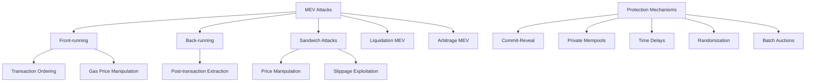

# บทที่ 20: MEV Protection

## 🎯 จุดประสงค์ของบทเรียน
- ทำความเข้าใจ MEV (Maximal Extractable Value) และผลกระทบ
- สร้างระบบป้องกัน Front-running และ Sandwich Attacks
- พัฒนา Private Mempool และ Commit-Reveal Schemes
- ออกแบบ MEV-resistant Protocol Architecture

## ⚡ MEV Landscape

### **📊 MEV Attack Vectors**



## 🛡️ MEV Protection Framework

### **🔐 Anti-MEV Core Contract**

```solidity
// contracts/mev/MEVProtection.sol
// SPDX-License-Identifier: MIT
pragma solidity ^0.8.19;

import "@openzeppelin/contracts/access/Ownable.sol";
import "@openzeppelin/contracts/security/ReentrancyGuard.sol";
import "@openzeppelin/contracts/utils/cryptography/ECDSA.sol";

/**
 * @title MEVProtection
 * @dev Comprehensive MEV protection framework
 */
contract MEVProtection is Ownable, ReentrancyGuard {
    using ECDSA for bytes32;
    
    struct CommitRevealOrder {
        bytes32 commitHash;
        address user;
        uint256 commitTime;
        uint256 revealDeadline;
        bool isRevealed;
        bool isExecuted;
        bytes32 orderHash;
        uint256 nonce;
    }
    
    struct PrivateOrder {
        address user;
        address tokenIn;
        address tokenOut;
        uint256 amountIn;
        uint256 minAmountOut;
        uint256 deadline;
        uint256 nonce;
        bytes signature;
        bool isExecuted;
    }
    
    struct BatchAuction {
        uint256 auctionId;
        uint256 startTime;
        uint256 duration;
        uint256 clearingPrice;
        bool isFinalized;
        address[] participants;
        mapping(address => uint256) bids;
        mapping(address => uint256) allocations;
        uint256 totalVolume;
    }
    
    struct MEVProtectionConfig {
        uint256 commitRevealDelay;
        uint256 maxSlippageProtection;
        uint256 timeDelaySeconds;
        uint256 randomnessThreshold;
        bool usePrivateMempool;
        bool enableBatchAuctions;
        bool enableTimeDelays;
    }
    
    mapping(bytes32 => CommitRevealOrder) public commitRevealOrders;
    mapping(address => uint256) public userNonces;
    mapping(uint256 => BatchAuction) public batchAuctions;
    mapping(address => bool) public authorizedExecutors;
    mapping(bytes32 => bool) public executedOrders;
    mapping(address => uint256) public lastExecutionTime;
    
    MEVProtectionConfig public config;
    uint256 public auctionCounter;
    uint256 public constant MIN_COMMIT_REVEAL_DELAY = 1 minutes;
    uint256 public constant MAX_COMMIT_REVEAL_DELAY = 1 hours;
    
    event OrderCommitted(bytes32 indexed commitHash, address indexed user, uint256 revealDeadline);
    event OrderRevealed(bytes32 indexed commitHash, bytes32 indexed orderHash);
    event OrderExecuted(bytes32 indexed orderHash, address indexed user, uint256 amountOut);
    event BatchAuctionCreated(uint256 indexed auctionId, uint256 startTime, uint256 duration);
    event BatchAuctionFinalized(uint256 indexed auctionId, uint256 clearingPrice);
    event MEVAttemptBlocked(address indexed attacker, string reason);
    
    error InvalidCommitHash();
    error RevealTooEarly();
    error RevealTooLate();
    error OrderAlreadyExecuted();
    error InsufficientDelay();
    error UnauthorizedExecutor();
    error InvalidSignature();
    error MEVDetected();
    
    constructor() {
        config = MEVProtectionConfig({
            commitRevealDelay: 5 minutes,
            maxSlippageProtection: 300, // 3%
            timeDelaySeconds: 60,
            randomnessThreshold: 100,
            usePrivateMempool: true,
            enableBatchAuctions: true,
            enableTimeDelays: true
        });
    }
    
    /**
     * @dev Commit to an order without revealing details
     */
    function commitOrder(bytes32 commitHash) external {
        require(commitHash != bytes32(0), "Invalid commit hash");
        
        CommitRevealOrder storage order = commitRevealOrders[commitHash];
        require(order.commitTime == 0, "Order already committed");
        
        order.commitHash = commitHash;
        order.user = msg.sender;
        order.commitTime = block.timestamp;
        order.revealDeadline = block.timestamp + config.commitRevealDelay;
        order.nonce = userNonces[msg.sender]++;
        
        emit OrderCommitted(commitHash, msg.sender, order.revealDeadline);
    }
    
    /**
     * @dev Reveal and execute order after commit delay
     */
    function revealAndExecuteOrder(
        address tokenIn,
        address tokenOut,
        uint256 amountIn,
        uint256 minAmountOut,
        uint256 deadline,
        uint256 nonce,
        uint256 salt
    ) external nonReentrant {
        // Generate commit hash to verify
        bytes32 commitHash = keccak256(abi.encodePacked(
            msg.sender,
            tokenIn,
            tokenOut,
            amountIn,
            minAmountOut,
            deadline,
            nonce,
            salt
        ));
        
        CommitRevealOrder storage order = commitRevealOrders[commitHash];
        
        if (order.commitTime == 0) {
            revert InvalidCommitHash();
        }
        if (block.timestamp < order.commitTime + config.commitRevealDelay) {
            revert RevealTooEarly();
        }
        if (block.timestamp > order.revealDeadline) {
            revert RevealTooLate();
        }
        if (order.isExecuted) {
            revert OrderAlreadyExecuted();
        }
        
        // Check for MEV attempts
        _checkMEVProtection(msg.sender, tokenIn, tokenOut, amountIn);
        
        // Generate order hash
        bytes32 orderHash = keccak256(abi.encodePacked(
            commitHash,
            block.timestamp
        ));
        
        order.isRevealed = true;
        order.orderHash = orderHash;
        
        emit OrderRevealed(commitHash, orderHash);
        
        // Execute the order
        _executeProtectedOrder(
            orderHash,
            tokenIn,
            tokenOut,
            amountIn,
            minAmountOut,
            deadline
        );
        
        order.isExecuted = true;
    }
    
    /**
     * @dev Submit order to private mempool
     */
    function submitPrivateOrder(
        address tokenIn,
        address tokenOut,
        uint256 amountIn,
        uint256 minAmountOut,
        uint256 deadline,
        bytes memory signature
    ) external returns (bytes32) {
        require(config.usePrivateMempool, "Private mempool disabled");
        
        bytes32 orderHash = keccak256(abi.encodePacked(
            msg.sender,
            tokenIn,
            tokenOut,
            amountIn,
            minAmountOut,
            deadline,
            userNonces[msg.sender]
        ));
        
        // Verify signature
        bytes32 signedHash = orderHash.toEthSignedMessageHash();
        address signer = signedHash.recover(signature);
        if (signer != msg.sender) {
            revert InvalidSignature();
        }
        
        // Store private order
        PrivateOrder storage privateOrder = privateOrders[orderHash];
        privateOrder.user = msg.sender;
        privateOrder.tokenIn = tokenIn;
        privateOrder.tokenOut = tokenOut;
        privateOrder.amountIn = amountIn;
        privateOrder.minAmountOut = minAmountOut;
        privateOrder.deadline = deadline;
        privateOrder.nonce = userNonces[msg.sender]++;
        privateOrder.signature = signature;
        
        return orderHash;
    }
    
    mapping(bytes32 => PrivateOrder) public privateOrders;
    
    /**
     * @dev Execute private order (only by authorized executors)
     */
    function executePrivateOrder(bytes32 orderHash) 
        external 
        onlyAuthorizedExecutor 
        nonReentrant 
    {
        PrivateOrder storage order = privateOrders[orderHash];
        require(order.user != address(0), "Order not found");
        require(!order.isExecuted, "Order already executed");
        require(block.timestamp <= order.deadline, "Order expired");
        
        // Additional MEV protection checks
        _checkMEVProtection(order.user, order.tokenIn, order.tokenOut, order.amountIn);
        
        // Execute the trade
        uint256 amountOut = _executeSwap(
            order.tokenIn,
            order.tokenOut,
            order.amountIn,
            order.minAmountOut
        );
        
        order.isExecuted = true;
        lastExecutionTime[order.user] = block.timestamp;
        
        emit OrderExecuted(orderHash, order.user, amountOut);
    }
    
    /**
     * @dev Create batch auction for MEV protection
     */
    function createBatchAuction(uint256 duration) external onlyOwner returns (uint256) {
        require(config.enableBatchAuctions, "Batch auctions disabled");
        require(duration >= 1 minutes && duration <= 1 hours, "Invalid duration");
        
        uint256 auctionId = auctionCounter++;
        
        BatchAuction storage auction = batchAuctions[auctionId];
        auction.auctionId = auctionId;
        auction.startTime = block.timestamp;
        auction.duration = duration;
        auction.isFinalized = false;
        
        emit BatchAuctionCreated(auctionId, block.timestamp, duration);
        
        return auctionId;
    }
    
    /**
     * @dev Submit bid to batch auction
     */
    function submitBid(uint256 auctionId, uint256 bidAmount) external {
        BatchAuction storage auction = batchAuctions[auctionId];
        require(auction.startTime > 0, "Auction not found");
        require(block.timestamp < auction.startTime + auction.duration, "Auction ended");
        require(!auction.isFinalized, "Auction finalized");
        require(bidAmount > 0, "Invalid bid amount");
        
        // Check if user already has a bid
        bool isNewParticipant = auction.bids[msg.sender] == 0;
        
        auction.bids[msg.sender] = bidAmount;
        auction.totalVolume += bidAmount;
        
        if (isNewParticipant) {
            auction.participants.push(msg.sender);
        }
    }
    
    /**
     * @dev Finalize batch auction and execute all orders
     */
    function finalizeBatchAuction(uint256 auctionId) external onlyOwner {
        BatchAuction storage auction = batchAuctions[auctionId];
        require(auction.startTime > 0, "Auction not found");
        require(block.timestamp >= auction.startTime + auction.duration, "Auction still active");
        require(!auction.isFinalized, "Already finalized");
        
        // Calculate clearing price (simplified uniform price auction)
        auction.clearingPrice = _calculateClearingPrice(auctionId);
        
        // Allocate to all participants at clearing price
        for (uint256 i = 0; i < auction.participants.length; i++) {
            address participant = auction.participants[i];
            uint256 bid = auction.bids[participant];
            
            if (bid >= auction.clearingPrice) {
                auction.allocations[participant] = bid / auction.clearingPrice;
            }
        }
        
        auction.isFinalized = true;
        
        emit BatchAuctionFinalized(auctionId, auction.clearingPrice);
    }
    
    /**
     * @dev MEV protection checks
     */
    function _checkMEVProtection(
        address user,
        address tokenIn,
        address tokenOut,
        uint256 amountIn
    ) internal {
        // Check time delay protection
        if (config.enableTimeDelays) {
            if (block.timestamp < lastExecutionTime[user] + config.timeDelaySeconds) {
                revert InsufficientDelay();
            }
        }
        
        // Check for suspicious patterns
        if (_detectMEVPattern(user, tokenIn, tokenOut, amountIn)) {
            emit MEVAttemptBlocked(user, "Suspicious transaction pattern detected");
            revert MEVDetected();
        }
        
        // Check for front-running attempts
        if (_detectFrontRunning(user, tokenIn, tokenOut)) {
            emit MEVAttemptBlocked(user, "Front-running attempt detected");
            revert MEVDetected();
        }
    }
    
    /**
     * @dev Detect MEV patterns
     */
    function _detectMEVPattern(
        address user,
        address tokenIn,
        address tokenOut,
        uint256 amountIn
    ) internal view returns (bool) {
        // Check for unusually large transactions
        if (amountIn > _getTokenBalance(tokenIn) / 10) { // More than 10% of total supply
            return true;
        }
        
        // Check for rapid successive transactions
        if (lastExecutionTime[user] > 0 && 
            block.timestamp < lastExecutionTime[user] + 60) { // Within 1 minute
            return true;
        }
        
        // Check for circular trading patterns
        if (_isCircularTrade(user, tokenIn, tokenOut)) {
            return true;
        }
        
        return false;
    }
    
    /**
     * @dev Detect front-running attempts
     */
    function _detectFrontRunning(
        address user,
        address tokenIn,
        address tokenOut
    ) internal view returns (bool) {
        // Check if transaction immediately follows a large pending transaction
        // This would require mempool monitoring in practice
        
        // Simplified check: high gas price relative to recent transactions
        if (tx.gasprice > block.basefee * 150 / 100) { // 50% above base fee
            return true;
        }
        
        return false;
    }
    
    /**
     * @dev Check for circular trading
     */
    function _isCircularTrade(
        address user,
        address tokenIn,
        address tokenOut
    ) internal pure returns (bool) {
        // Simplified circular trade detection
        // In practice, would check recent transaction history
        return tokenIn == tokenOut;
    }
    
    /**
     * @dev Execute protected order
     */
    function _executeProtectedOrder(
        bytes32 orderHash,
        address tokenIn,
        address tokenOut,
        uint256 amountIn,
        uint256 minAmountOut,
        uint256 deadline
    ) internal {
        require(block.timestamp <= deadline, "Order expired");
        require(!executedOrders[orderHash], "Order already executed");
        
        // Apply additional slippage protection
        uint256 protectedMinAmount = _applySlippageProtection(minAmountOut);
        
        uint256 amountOut = _executeSwap(tokenIn, tokenOut, amountIn, protectedMinAmount);
        
        executedOrders[orderHash] = true;
        
        emit OrderExecuted(orderHash, msg.sender, amountOut);
    }
    
    /**
     * @dev Apply slippage protection
     */
    function _applySlippageProtection(uint256 minAmountOut) 
        internal 
        view 
        returns (uint256) 
    {
        // Reduce minimum amount by protection percentage
        uint256 protection = config.maxSlippageProtection;
        return minAmountOut * (10000 - protection) / 10000;
    }
    
    /**
     * @dev Execute swap (placeholder implementation)
     */
    function _executeSwap(
        address tokenIn,
        address tokenOut,
        uint256 amountIn,
        uint256 minAmountOut
    ) internal returns (uint256) {
        // This would interface with actual DEX contracts
        // Simplified implementation for demonstration
        
        require(tokenIn != tokenOut, "Same token");
        require(amountIn > 0, "Invalid amount");
        
        // Simulate swap execution
        uint256 amountOut = amountIn * 99 / 100; // 1% fee simulation
        require(amountOut >= minAmountOut, "Insufficient output amount");
        
        return amountOut;
    }
    
    /**
     * @dev Calculate clearing price for batch auction
     */
    function _calculateClearingPrice(uint256 auctionId) 
        internal 
        view 
        returns (uint256) 
    {
        BatchAuction storage auction = batchAuctions[auctionId];
        
        if (auction.participants.length == 0) {
            return 0;
        }
        
        // Simplified clearing price calculation
        // In practice, would use more sophisticated price discovery
        return auction.totalVolume / auction.participants.length;
    }
    
    /**
     * @dev Get token balance (placeholder)
     */
    function _getTokenBalance(address token) internal pure returns (uint256) {
        // Placeholder implementation
        return 1000000 * 10**18; // 1M tokens
    }
    
    /**
     * @dev Admin functions
     */
    function updateConfig(MEVProtectionConfig memory newConfig) external onlyOwner {
        require(
            newConfig.commitRevealDelay >= MIN_COMMIT_REVEAL_DELAY &&
            newConfig.commitRevealDelay <= MAX_COMMIT_REVEAL_DELAY,
            "Invalid commit reveal delay"
        );
        require(newConfig.maxSlippageProtection <= 1000, "Max slippage too high"); // 10%
        
        config = newConfig;
    }
    
    function addAuthorizedExecutor(address executor) external onlyOwner {
        authorizedExecutors[executor] = true;
    }
    
    function removeAuthorizedExecutor(address executor) external onlyOwner {
        authorizedExecutors[executor] = false;
    }
    
    modifier onlyAuthorizedExecutor() {
        if (!authorizedExecutors[msg.sender] && msg.sender != owner()) {
            revert UnauthorizedExecutor();
        }
        _;
    }
    
    /**
     * @dev Emergency functions
     */
    function emergencyPause() external onlyOwner {
        config.usePrivateMempool = false;
        config.enableBatchAuctions = false;
        config.enableTimeDelays = true;
    }
    
    function emergencyResume() external onlyOwner {
        config.usePrivateMempool = true;
        config.enableBatchAuctions = true;
    }
    
    /**
     * @dev View functions
     */
    function getCommitRevealOrder(bytes32 commitHash) 
        external 
        view 
        returns (CommitRevealOrder memory) 
    {
        return commitRevealOrders[commitHash];
    }
    
    function getBatchAuctionInfo(uint256 auctionId) 
        external 
        view 
        returns (
            uint256 startTime,
            uint256 duration,
            uint256 clearingPrice,
            bool isFinalized,
            uint256 participantCount,
            uint256 totalVolume
        ) 
    {
        BatchAuction storage auction = batchAuctions[auctionId];
        return (
            auction.startTime,
            auction.duration,
            auction.clearingPrice,
            auction.isFinalized,
            auction.participants.length,
            auction.totalVolume
        );
    }
    
    function getUserBid(uint256 auctionId, address user) 
        external 
        view 
        returns (uint256) 
    {
        return batchAuctions[auctionId].bids[user];
    }
    
    function getUserAllocation(uint256 auctionId, address user) 
        external 
        view 
        returns (uint256) 
    {
        return batchAuctions[auctionId].allocations[user];
    }
    
    function isOrderExecuted(bytes32 orderHash) external view returns (bool) {
        return executedOrders[orderHash];
    }
    
    function getConfig() external view returns (MEVProtectionConfig memory) {
        return config;
    }
}
```

## 🔀 Flashbots Integration

### **⚡ Private Mempool Manager**

```solidity
// contracts/mev/PrivateMempool.sol
// SPDX-License-Identifier: MIT
pragma solidity ^0.8.19;

import "@openzeppelin/contracts/access/AccessControl.sol";
import "@openzeppelin/contracts/security/ReentrancyGuard.sol";

/**
 * @title PrivateMempool
 * @dev Private mempool implementation for MEV protection
 */
contract PrivateMempool is AccessControl, ReentrancyGuard {
    bytes32 public constant BUILDER_ROLE = keccak256("BUILDER_ROLE");
    bytes32 public constant VALIDATOR_ROLE = keccak256("VALIDATOR_ROLE");
    bytes32 public constant SEARCHER_ROLE = keccak256("SEARCHER_ROLE");
    
    struct Bundle {
        bytes32 bundleId;
        address builder;
        bytes[] transactions;
        uint256 blockNumber;
        uint256 timestamp;
        uint256 maxFeePerGas;
        uint256 maxPriorityFeePerGas;
        bool isExecuted;
        bool isReverted;
        uint256 totalGasUsed;
        uint256 builderPayment;
    }
    
    struct SearcherOrder {
        bytes32 orderId;
        address searcher;
        bytes targetTransaction;
        bytes backrunTransaction;
        uint256 maxBribe;
        uint256 blockNumber;
        bool isPrivate;
        bool isExecuted;
    }
    
    struct ValidatorConfig {
        address validator;
        uint256 minBribe;
        bool isActive;
        uint256 successRate;
        uint256 totalBundles;
        uint256 successfulBundles;
    }
    
    mapping(bytes32 => Bundle) public bundles;
    mapping(bytes32 => SearcherOrder) public searcherOrders;
    mapping(address => ValidatorConfig) public validators;
    mapping(uint256 => bytes32[]) public blockBundles;
    mapping(address => uint256) public builderStakes;
    mapping(address => uint256) public searcherCredits;
    
    bytes32[] public pendingBundles;
    address[] public activeValidators;
    
    uint256 public bundleCounter;
    uint256 public orderCounter;
    uint256 public minBuilderStake = 1 ether;
    uint256 public bundleFee = 0.001 ether;
    uint256 public maxBundleSize = 10;
    
    event BundleSubmitted(bytes32 indexed bundleId, address indexed builder, uint256 blockNumber);
    event BundleExecuted(bytes32 indexed bundleId, bool success, uint256 gasUsed);
    event SearcherOrderPlaced(bytes32 indexed orderId, address indexed searcher, uint256 maxBribe);
    event ValidatorRegistered(address indexed validator, uint256 minBribe);
    event BribePayment(address indexed validator, uint256 amount);
    
    constructor() {
        _grantRole(DEFAULT_ADMIN_ROLE, msg.sender);
    }
    
    /**
     * @dev Submit bundle to private mempool
     */
    function submitBundle(
        bytes[] memory transactions,
        uint256 targetBlockNumber,
        uint256 maxFeePerGas,
        uint256 maxPriorityFeePerGas
    ) external payable returns (bytes32) {
        require(hasRole(BUILDER_ROLE, msg.sender), "Not authorized builder");
        require(msg.value >= bundleFee, "Insufficient bundle fee");
        require(transactions.length > 0 && transactions.length <= maxBundleSize, "Invalid bundle size");
        require(targetBlockNumber > block.number, "Invalid target block");
        
        bytes32 bundleId = keccak256(abi.encodePacked(
            msg.sender,
            transactions,
            targetBlockNumber,
            block.timestamp,
            bundleCounter++
        ));
        
        Bundle storage bundle = bundles[bundleId];
        bundle.bundleId = bundleId;
        bundle.builder = msg.sender;
        bundle.transactions = transactions;
        bundle.blockNumber = targetBlockNumber;
        bundle.timestamp = block.timestamp;
        bundle.maxFeePerGas = maxFeePerGas;
        bundle.maxPriorityFeePerGas = maxPriorityFeePerGas;
        bundle.builderPayment = msg.value;
        
        blockBundles[targetBlockNumber].push(bundleId);
        pendingBundles.push(bundleId);
        
        emit BundleSubmitted(bundleId, msg.sender, targetBlockNumber);
        
        return bundleId;
    }
    
    /**
     * @dev Submit searcher order for private execution
     */
    function submitSearcherOrder(
        bytes memory targetTransaction,
        bytes memory backrunTransaction,
        uint256 maxBribe,
        uint256 targetBlockNumber,
        bool isPrivate
    ) external payable returns (bytes32) {
        require(hasRole(SEARCHER_ROLE, msg.sender), "Not authorized searcher");
        require(msg.value >= maxBribe, "Insufficient bribe amount");
        require(targetBlockNumber > block.number, "Invalid target block");
        
        bytes32 orderId = keccak256(abi.encodePacked(
            msg.sender,
            targetTransaction,
            backrunTransaction,
            block.timestamp,
            orderCounter++
        ));
        
        SearcherOrder storage order = searcherOrders[orderId];
        order.orderId = orderId;
        order.searcher = msg.sender;
        order.targetTransaction = targetTransaction;
        order.backrunTransaction = backrunTransaction;
        order.maxBribe = maxBribe;
        order.blockNumber = targetBlockNumber;
        order.isPrivate = isPrivate;
        
        // Add searcher credits
        searcherCredits[msg.sender] += msg.value;
        
        emit SearcherOrderPlaced(orderId, msg.sender, maxBribe);
        
        return orderId;
    }
    
    /**
     * @dev Execute bundle (validator only)
     */
    function executeBundle(bytes32 bundleId) 
        external 
        onlyRole(VALIDATOR_ROLE) 
        nonReentrant 
    {
        Bundle storage bundle = bundles[bundleId];
        require(bundle.bundleId == bundleId, "Bundle not found");
        require(!bundle.isExecuted, "Bundle already executed");
        require(bundle.blockNumber == block.number, "Wrong block number");
        
        ValidatorConfig storage validator = validators[msg.sender];
        require(validator.isActive, "Validator not active");
        
        bool success = true;
        uint256 totalGasUsed = 0;
        
        // Execute all transactions in bundle
        for (uint256 i = 0; i < bundle.transactions.length; i++) {
            (bool txSuccess, bytes memory result) = address(this).call{gas: gasleft() / 2}(
                bundle.transactions[i]
            );
            
            if (!txSuccess) {
                success = false;
                bundle.isReverted = true;
                break;
            }
            
            // Calculate gas used (simplified)
            totalGasUsed += 21000; // Base transaction gas
        }
        
        bundle.isExecuted = true;
        bundle.totalGasUsed = totalGasUsed;
        
        // Update validator statistics
        validator.totalBundles++;
        if (success) {
            validator.successfulBundles++;
        }
        validator.successRate = (validator.successfulBundles * 100) / validator.totalBundles;
        
        // Pay validator bribe
        if (success && bundle.builderPayment > 0) {
            uint256 validatorPayment = bundle.builderPayment * 80 / 100; // 80% to validator
            payable(msg.sender).transfer(validatorPayment);
            emit BribePayment(msg.sender, validatorPayment);
        }
        
        emit BundleExecuted(bundleId, success, totalGasUsed);
    }
    
    /**
     * @dev Simulate bundle execution
     */
    function simulateBundle(bytes32 bundleId) 
        external 
        view 
        returns (bool success, uint256 estimatedGas, bytes[] memory results) 
    {
        Bundle storage bundle = bundles[bundleId];
        require(bundle.bundleId == bundleId, "Bundle not found");
        
        results = new bytes[](bundle.transactions.length);
        estimatedGas = 0;
        success = true;
        
        // Simulate each transaction
        for (uint256 i = 0; i < bundle.transactions.length; i++) {
            // In practice, would use static calls for simulation
            estimatedGas += 21000 + (bundle.transactions[i].length * 16); // Simplified estimation
            results[i] = ""; // Placeholder result
        }
    }
    
    /**
     * @dev Register as validator
     */
    function registerValidator(uint256 minBribe) external payable {
        require(msg.value >= minBuilderStake, "Insufficient stake");
        require(minBribe > 0, "Invalid minimum bribe");
        
        _grantRole(VALIDATOR_ROLE, msg.sender);
        
        ValidatorConfig storage config = validators[msg.sender];
        config.validator = msg.sender;
        config.minBribe = minBribe;
        config.isActive = true;
        config.successRate = 100; // Start with 100% rate
        
        activeValidators.push(msg.sender);
        
        emit ValidatorRegistered(msg.sender, minBribe);
    }
    
    /**
     * @dev Register as builder
     */
    function registerBuilder() external payable {
        require(msg.value >= minBuilderStake, "Insufficient stake");
        
        _grantRole(BUILDER_ROLE, msg.sender);
        builderStakes[msg.sender] = msg.value;
    }
    
    /**
     * @dev Register as searcher
     */
    function registerSearcher() external {
        _grantRole(SEARCHER_ROLE, msg.sender);
    }
    
    /**
     * @dev Get optimal validator for bundle
     */
    function getOptimalValidator(bytes32 bundleId) 
        external 
        view 
        returns (address validator, uint256 estimatedCost) 
    {
        Bundle storage bundle = bundles[bundleId];
        require(bundle.bundleId == bundleId, "Bundle not found");
        
        address bestValidator = address(0);
        uint256 bestScore = 0;
        uint256 minCost = type(uint256).max;
        
        for (uint256 i = 0; i < activeValidators.length; i++) {
            address currentValidator = activeValidators[i];
            ValidatorConfig storage config = validators[currentValidator];
            
            if (!config.isActive) continue;
            
            // Calculate score based on success rate and cost
            uint256 score = config.successRate;
            uint256 cost = config.minBribe;
            
            if (score > bestScore || (score == bestScore && cost < minCost)) {
                bestValidator = currentValidator;
                bestScore = score;
                minCost = cost;
            }
        }
        
        return (bestValidator, minCost);
    }
    
    /**
     * @dev Get pending bundles for block
     */
    function getPendingBundles(uint256 blockNumber) 
        external 
        view 
        returns (bytes32[] memory) 
    {
        return blockBundles[blockNumber];
    }
    
    /**
     * @dev Bundle auction for block inclusion
     */
    function auctionBundles(uint256 blockNumber) 
        external 
        view 
        returns (bytes32[] memory winners, uint256[] memory bids) 
    {
        bytes32[] memory blockBundleIds = blockBundles[blockNumber];
        
        // Sort bundles by bid amount (simplified auction)
        winners = new bytes32[](blockBundleIds.length);
        bids = new uint256[](blockBundleIds.length);
        
        for (uint256 i = 0; i < blockBundleIds.length; i++) {
            winners[i] = blockBundleIds[i];
            bids[i] = bundles[blockBundleIds[i]].builderPayment;
        }
        
        // In practice, would implement sophisticated auction mechanism
        return (winners, bids);
    }
    
    /**
     * @dev Clean up expired bundles
     */
    function cleanupExpiredBundles() external {
        uint256 currentBlock = block.number;
        
        for (uint256 i = 0; i < pendingBundles.length; i++) {
            bytes32 bundleId = pendingBundles[i];
            Bundle storage bundle = bundles[bundleId];
            
            if (bundle.blockNumber < currentBlock && !bundle.isExecuted) {
                // Refund builder (minus fee)
                uint256 refund = bundle.builderPayment - bundleFee;
                if (refund > 0) {
                    payable(bundle.builder).transfer(refund);
                }
                
                // Remove from pending
                pendingBundles[i] = pendingBundles[pendingBundles.length - 1];
                pendingBundles.pop();
                i--; // Adjust index after removal
            }
        }
    }
    
    /**
     * @dev Admin functions
     */
    function setBundleFee(uint256 newFee) external onlyRole(DEFAULT_ADMIN_ROLE) {
        bundleFee = newFee;
    }
    
    function setMaxBundleSize(uint256 newSize) external onlyRole(DEFAULT_ADMIN_ROLE) {
        require(newSize > 0 && newSize <= 50, "Invalid bundle size");
        maxBundleSize = newSize;
    }
    
    function deactivateValidator(address validator) external onlyRole(DEFAULT_ADMIN_ROLE) {
        validators[validator].isActive = false;
    }
    
    function slashBuilder(address builder, uint256 amount) external onlyRole(DEFAULT_ADMIN_ROLE) {
        require(builderStakes[builder] >= amount, "Insufficient stake");
        builderStakes[builder] -= amount;
        // Transfer slashed amount to treasury
    }
    
    /**
     * @dev Emergency functions
     */
    function emergencyPause() external onlyRole(DEFAULT_ADMIN_ROLE) {
        // Pause all operations
        for (uint256 i = 0; i < activeValidators.length; i++) {
            validators[activeValidators[i]].isActive = false;
        }
    }
    
    function emergencyWithdraw() external onlyRole(DEFAULT_ADMIN_ROLE) {
        payable(msg.sender).transfer(address(this).balance);
    }
    
    /**
     * @dev View functions
     */
    function getBundleInfo(bytes32 bundleId) 
        external 
        view 
        returns (Bundle memory) 
    {
        return bundles[bundleId];
    }
    
    function getValidatorInfo(address validator) 
        external 
        view 
        returns (ValidatorConfig memory) 
    {
        return validators[validator];
    }
    
    function getSearcherOrderInfo(bytes32 orderId) 
        external 
        view 
        returns (SearcherOrder memory) 
    {
        return searcherOrders[orderId];
    }
    
    function getActiveValidators() external view returns (address[] memory) {
        return activeValidators;
    }
    
    function getPendingBundleCount() external view returns (uint256) {
        return pendingBundles.length;
    }
    
    receive() external payable {}
}
```

## 🎲 Randomization Mechanisms

### **🎯 Anti-MEV Randomization**

```solidity
// contracts/mev/RandomizationMEV.sol
// SPDX-License-Identifier: MIT
pragma solidity ^0.8.19;

import "@openzeppelin/contracts/access/Ownable.sol";
import "@openzeppelin/contracts/security/ReentrancyGuard.sol";

/**
 * @title RandomizationMEV
 * @dev Randomization mechanisms for MEV protection
 */
contract RandomizationMEV is Ownable, ReentrancyGuard {
    struct RandomizedOrder {
        bytes32 orderId;
        address user;
        bytes orderData;
        uint256 randomSeed;
        uint256 executionWindow;
        uint256 submissionTime;
        bool isExecuted;
        uint256 actualExecutionTime;
    }
    
    struct VRFRequest {
        bytes32 requestId;
        address requester;
        uint256 timestamp;
        uint256 randomness;
        bool isFulfilled;
    }
    
    mapping(bytes32 => RandomizedOrder) public randomizedOrders;
    mapping(bytes32 => VRFRequest) public vrfRequests;
    mapping(uint256 => bytes32[]) public executionQueues; // block => orders
    mapping(address => uint256) public userRandomSeeds;
    
    uint256 public orderCounter;
    uint256 public executionWindowSize = 10; // 10 blocks
    uint256 public minRandomDelay = 1;
    uint256 public maxRandomDelay = 20;
    
    // Simple PRNG state (in production, use Chainlink VRF)
    uint256 private nonce;
    uint256 private randomSeed;
    
    event OrderRandomized(bytes32 indexed orderId, address indexed user, uint256 executionBlock);
    event OrderExecuted(bytes32 indexed orderId, uint256 actualBlock, uint256 randomDelay);
    event RandomnessRequested(bytes32 indexed requestId, address indexed requester);
    event RandomnessFulfilled(bytes32 indexed requestId, uint256 randomness);
    
    constructor() {
        randomSeed = uint256(keccak256(abi.encodePacked(block.timestamp, block.difficulty, msg.sender)));
    }
    
    /**
     * @dev Submit order with randomized execution
     */
    function submitRandomizedOrder(bytes memory orderData) external returns (bytes32) {
        bytes32 orderId = keccak256(abi.encodePacked(
            msg.sender,
            orderData,
            block.timestamp,
            orderCounter++
        ));
        
        // Generate random execution time
        uint256 randomDelay = _generateRandomDelay();
        uint256 executionBlock = block.number + randomDelay;
        uint256 executionWindow = executionBlock + executionWindowSize;
        
        RandomizedOrder storage order = randomizedOrders[orderId];
        order.orderId = orderId;
        order.user = msg.sender;
        order.orderData = orderData;
        order.randomSeed = _generateRandomSeed();
        order.executionWindow = executionWindow;
        order.submissionTime = block.timestamp;
        
        // Add to execution queue
        executionQueues[executionBlock].push(orderId);
        
        emit OrderRandomized(orderId, msg.sender, executionBlock);
        
        return orderId;
    }
    
    /**
     * @dev Execute randomized orders for current block
     */
    function executeRandomizedOrders() external {
        bytes32[] memory ordersToExecute = executionQueues[block.number];
        
        for (uint256 i = 0; i < ordersToExecute.length; i++) {
            bytes32 orderId = ordersToExecute[i];
            RandomizedOrder storage order = randomizedOrders[orderId];
            
            if (!order.isExecuted && block.number <= order.executionWindow) {
                // Apply additional randomization at execution time
                uint256 finalRandomDelay = _generateExecutionRandomness(order.randomSeed);
                
                if (_shouldExecuteNow(finalRandomDelay)) {
                    _executeOrder(orderId);
                } else {
                    // Defer to later block within window
                    uint256 newBlock = block.number + (finalRandomDelay % executionWindowSize);
                    if (newBlock <= order.executionWindow) {
                        executionQueues[newBlock].push(orderId);
                    }
                }
            }
        }
        
        // Clear processed orders
        delete executionQueues[block.number];
    }
    
    /**
     * @dev Request verifiable randomness (simplified VRF)
     */
    function requestRandomness() external returns (bytes32) {
        bytes32 requestId = keccak256(abi.encodePacked(
            msg.sender,
            block.timestamp,
            nonce++
        ));
        
        VRFRequest storage request = vrfRequests[requestId];
        request.requestId = requestId;
        request.requester = msg.sender;
        request.timestamp = block.timestamp;
        
        emit RandomnessRequested(requestId, msg.sender);
        
        // In production, this would trigger Chainlink VRF
        _fulfillRandomness(requestId);
        
        return requestId;
    }
    
    /**
     * @dev Fulfill randomness request (internal/oracle)
     */
    function _fulfillRandomness(bytes32 requestId) internal {
        VRFRequest storage request = vrfRequests[requestId];
        require(!request.isFulfilled, "Already fulfilled");
        
        // Generate pseudo-random number (use Chainlink VRF in production)
        uint256 randomness = uint256(keccak256(abi.encodePacked(
            block.timestamp,
            block.difficulty,
            requestId,
            randomSeed
        )));
        
        request.randomness = randomness;
        request.isFulfilled = true;
        
        // Update global seed
        randomSeed = randomness;
        
        emit RandomnessFulfilled(requestId, randomness);
    }
    
    /**
     * @dev Generate random delay for order execution
     */
    function _generateRandomDelay() internal returns (uint256) {
        uint256 range = maxRandomDelay - minRandomDelay + 1;
        uint256 random = uint256(keccak256(abi.encodePacked(
            block.timestamp,
            block.difficulty,
            msg.sender,
            nonce++,
            randomSeed
        )));
        
        return minRandomDelay + (random % range);
    }
    
    /**
     * @dev Generate random seed for order
     */
    function _generateRandomSeed() internal returns (uint256) {
        userRandomSeeds[msg.sender] = uint256(keccak256(abi.encodePacked(
            userRandomSeeds[msg.sender],
            block.timestamp,
            nonce++
        )));
        
        return userRandomSeeds[msg.sender];
    }
    
    /**
     * @dev Generate execution-time randomness
     */
    function _generateExecutionRandomness(uint256 orderSeed) internal view returns (uint256) {
        return uint256(keccak256(abi.encodePacked(
            orderSeed,
            block.timestamp,
            block.difficulty,
            randomSeed
        )));
    }
    
    /**
     * @dev Determine if order should execute now
     */
    function _shouldExecuteNow(uint256 randomValue) internal pure returns (bool) {
        // 50% probability of execution (adjustable)
        return (randomValue % 100) < 50;
    }
    
    /**
     * @dev Execute order with MEV protection
     */
    function _executeOrder(bytes32 orderId) internal {
        RandomizedOrder storage order = randomizedOrders[orderId];
        require(!order.isExecuted, "Order already executed");
        
        // Apply jittered execution
        uint256 jitter = _generateJitter();
        
        // Simulate order execution (placeholder)
        _performOrderExecution(order.orderData);
        
        order.isExecuted = true;
        order.actualExecutionTime = block.timestamp;
        
        emit OrderExecuted(orderId, block.number, jitter);
    }
    
    /**
     * @dev Generate execution jitter
     */
    function _generateJitter() internal view returns (uint256) {
        return uint256(keccak256(abi.encodePacked(
            block.timestamp,
            gasleft()
        ))) % 5; // 0-4 block jitter
    }
    
    /**
     * @dev Perform actual order execution (placeholder)
     */
    function _performOrderExecution(bytes memory orderData) internal pure {
        // Placeholder for actual order execution logic
        require(orderData.length > 0, "Invalid order data");
        // Implementation would decode and execute the order
    }
    
    /**
     * @dev Batch randomized execution
     */
    function batchExecuteRandomized(bytes32[] memory orderIds) external onlyOwner {
        for (uint256 i = 0; i < orderIds.length; i++) {
            RandomizedOrder storage order = randomizedOrders[orderIds[i]];
            
            if (!order.isExecuted && block.number <= order.executionWindow) {
                uint256 randomDelay = _generateExecutionRandomness(order.randomSeed);
                
                if (_shouldExecuteNow(randomDelay)) {
                    _executeOrder(orderIds[i]);
                }
            }
        }
    }
    
    /**
     * @dev Set randomization parameters
     */
    function setRandomizationParams(
        uint256 _minDelay,
        uint256 _maxDelay,
        uint256 _windowSize
    ) external onlyOwner {
        require(_minDelay < _maxDelay, "Invalid delay range");
        require(_maxDelay <= 100, "Max delay too high");
        require(_windowSize > 0 && _windowSize <= 50, "Invalid window size");
        
        minRandomDelay = _minDelay;
        maxRandomDelay = _maxDelay;
        executionWindowSize = _windowSize;
    }
    
    /**
     * @dev Emergency override for stuck orders
     */
    function emergencyExecuteOrder(bytes32 orderId) external onlyOwner {
        RandomizedOrder storage order = randomizedOrders[orderId];
        require(!order.isExecuted, "Order already executed");
        require(block.number > order.executionWindow + 100, "Not emergency situation");
        
        _executeOrder(orderId);
    }
    
    /**
     * @dev View functions
     */
    function getOrderInfo(bytes32 orderId) 
        external 
        view 
        returns (RandomizedOrder memory) 
    {
        return randomizedOrders[orderId];
    }
    
    function getExecutionQueue(uint256 blockNumber) 
        external 
        view 
        returns (bytes32[] memory) 
    {
        return executionQueues[blockNumber];
    }
    
    function getVRFRequest(bytes32 requestId) 
        external 
        view 
        returns (VRFRequest memory) 
    {
        return vrfRequests[requestId];
    }
    
    function getRandomnessForBlock(uint256 blockNumber) 
        external 
        view 
        returns (uint256) 
    {
        return uint256(keccak256(abi.encodePacked(
            blockNumber,
            randomSeed,
            block.difficulty
        )));
    }
    
    function estimateExecutionTime(bytes32 orderId) 
        external 
        view 
        returns (uint256 earliestBlock, uint256 latestBlock) 
    {
        RandomizedOrder memory order = randomizedOrders[orderId];
        
        // Estimate based on current randomization parameters
        uint256 avgDelay = (minRandomDelay + maxRandomDelay) / 2;
        earliestBlock = order.submissionTime + minRandomDelay;
        latestBlock = order.executionWindow;
        
        return (earliestBlock, latestBlock);
    }
}
```

## 📋 แบบฝึกหัด

### **🎯 แบบฝึกหัดที่ 1: Sandwich Attack Protection**
สร้างระบบป้องกัน Sandwich Attack:
1. Price impact detection
2. Slippage protection mechanisms
3. Trade order randomization

### **🔧 แบบฝึกหัดที่ 2: MEV Dashboard**
พัฒนา Dashboard สำหรับติดตาม MEV:
1. MEV extraction metrics
2. Protection effectiveness
3. User impact analysis

### **📊 แบบฝึกหัดที่ 3: Advanced Auction Mechanism**
สร้างระบบ Auction ขั้นสูง:
1. Sealed-bid auctions
2. Vickrey auction implementation
3. Dynamic pricing mechanisms

## 🔗 การเชื่อมต่อ

**บทก่อนหน้า**: [บทที่ 19: Security Auditing](./19-security-auditing.md)  
**บทถัดไป**: [บทที่ 21: Layer 2 Solutions](./21-layer2-solutions.md)

**กลับไปหน้าหลัก**: [README](./README.md)

---

## 📚 เอกสารอ้างอิง

- [Flashbots Documentation](https://docs.flashbots.net/)
- [MEV Research](https://ethereum.org/en/developers/docs/mev/)
- [Eden Network](https://docs.edennetwork.io/)
- [KeeperDAO MEV Protection](https://docs.keeperdao.com/)

---

ตอนนี้คุณสามารถสร้างระบบป้องกัน MEV ที่ครบถ้วนและมีประสิทธิภาพ! ⚡🛡️
