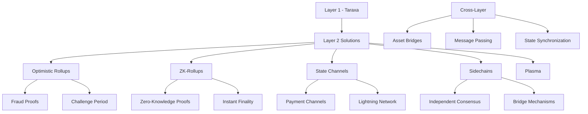

# บทที่ 21: Layer 2 Solutions

## 🎯 จุดประสงค์ของบทเรียน
- ทำความเข้าใจ Layer 2 Scaling Solutions
- พัฒนา Optimistic Rollup และ ZK-Rollup
- สร้างระบบ State Channels และ Sidechains
- ออกแบบ Cross-Layer Communication และ Bridge

## 🏗️ Layer 2 Architecture

### **📊 Layer 2 Ecosystem**



## ⚡ Optimistic Rollup Implementation

### **🔄 Optimistic Rollup Core**

```solidity
// contracts/layer2/OptimisticRollup.sol
// SPDX-License-Identifier: MIT
pragma solidity ^0.8.19;

import "@openzeppelin/contracts/access/Ownable.sol";
import "@openzeppelin/contracts/security/ReentrancyGuard.sol";
import "@openzeppelin/contracts/utils/cryptography/MerkleProof.sol";

/**
 * @title OptimisticRollup
 * @dev Optimistic rollup implementation for Taraxa
 */
contract OptimisticRollup is Ownable, ReentrancyGuard {
    struct RollupBlock {
        uint256 blockNumber;
        bytes32 stateRoot;
        bytes32 transactionRoot;
        address proposer;
        uint256 timestamp;
        uint256 challengePeriod;
        bool isFinalized;
        bool isChallenged;
        uint256 challengeEnd;
        bytes32 parentHash;
    }
    
    struct Transaction {
        address from;
        address to;
        uint256 value;
        bytes data;
        uint256 nonce;
        uint256 gasLimit;
        uint256 gasPrice;
        bytes signature;
    }
    
    struct Challenge {
        uint256 challengeId;
        uint256 blockNumber;
        address challenger;
        address proposer;
        uint256 challengeTime;
        uint256 bondAmount;
        bool isResolved;
        bool challengerWins;
        bytes fraudProof;
    }
    
    struct Account {
        uint256 balance;
        uint256 nonce;
        bytes32 codeHash;
        bytes32 storageRoot;
    }
    
    mapping(uint256 => RollupBlock) public rollupBlocks;
    mapping(uint256 => Challenge) public challenges;
    mapping(address => Account) public accounts;
    mapping(address => bool) public sequencers;
    mapping(uint256 => bytes32[]) public blockTransactions;
    mapping(bytes32 => bool) public processedDeposits;
    
    uint256 public currentBlockNumber;
    uint256 public challengePeriodBlocks;
    uint256 public bondAmount;
    uint256 public challengeCounter;
    uint256 public finalizedBlockNumber;
    
    address public verifierContract;
    
    event BlockProposed(uint256 indexed blockNumber, bytes32 stateRoot, address proposer);
    event BlockFinalized(uint256 indexed blockNumber, bytes32 stateRoot);
    event ChallengeSubmitted(uint256 indexed challengeId, uint256 blockNumber, address challenger);
    event ChallengeResolved(uint256 indexed challengeId, bool challengerWins);
    event DepositProcessed(address indexed user, uint256 amount);
    event WithdrawalInitiated(address indexed user, uint256 amount, uint256 blockNumber);
    
    error InvalidBlock();
    error ChallengePeriodActive();
    error InvalidChallenge();
    error InsufficientBond();
    error UnauthorizedSequencer();
    error BlockAlreadyFinalized();
    
    constructor(
        uint256 _challengePeriodBlocks,
        uint256 _bondAmount,
        address _verifierContract
    ) {
        challengePeriodBlocks = _challengePeriodBlocks;
        bondAmount = _bondAmount;
        verifierContract = _verifierContract;
        
        // Initialize genesis block
        RollupBlock storage genesis = rollupBlocks[0];
        genesis.blockNumber = 0;
        genesis.stateRoot = bytes32(0);
        genesis.proposer = msg.sender;
        genesis.timestamp = block.timestamp;
        genesis.isFinalized = true;
        genesis.parentHash = bytes32(0);
        
        finalizedBlockNumber = 0;
    }
    
    /**
     * @dev Propose new rollup block
     */
    function proposeBlock(
        bytes32 stateRoot,
        bytes32 transactionRoot,
        bytes32[] memory transactionHashes,
        bytes memory blockData
    ) external payable {
        require(sequencers[msg.sender] || msg.sender == owner(), "Unauthorized sequencer");
        require(msg.value >= bondAmount, "Insufficient bond");
        
        uint256 blockNumber = currentBlockNumber + 1;
        bytes32 parentHash = rollupBlocks[currentBlockNumber].stateRoot;
        
        RollupBlock storage newBlock = rollupBlocks[blockNumber];
        newBlock.blockNumber = blockNumber;
        newBlock.stateRoot = stateRoot;
        newBlock.transactionRoot = transactionRoot;
        newBlock.proposer = msg.sender;
        newBlock.timestamp = block.timestamp;
        newBlock.challengePeriod = block.number + challengePeriodBlocks;
        newBlock.parentHash = parentHash;
        
        // Store transaction hashes
        blockTransactions[blockNumber] = transactionHashes;
        
        currentBlockNumber = blockNumber;
        
        emit BlockProposed(blockNumber, stateRoot, msg.sender);
    }
    
    /**
     * @dev Challenge a proposed block
     */
    function challengeBlock(
        uint256 blockNumber,
        bytes memory fraudProof
    ) external payable {
        require(msg.value >= bondAmount, "Insufficient bond");
        
        RollupBlock storage block = rollupBlocks[blockNumber];
        require(block.blockNumber == blockNumber, "Block does not exist");
        require(!block.isFinalized, "Block already finalized");
        require(block.challengePeriod >= block.number, "Challenge period expired");
        require(!block.isChallenged, "Block already challenged");
        
        uint256 challengeId = challengeCounter++;
        
        Challenge storage challenge = challenges[challengeId];
        challenge.challengeId = challengeId;
        challenge.blockNumber = blockNumber;
        challenge.challenger = msg.sender;
        challenge.proposer = block.proposer;
        challenge.challengeTime = block.timestamp;
        challenge.bondAmount = msg.value;
        challenge.fraudProof = fraudProof;
        
        block.isChallenged = true;
        block.challengeEnd = block.timestamp + 7 days; // 7 day challenge resolution period
        
        emit ChallengeSubmitted(challengeId, blockNumber, msg.sender);
    }
    
    /**
     * @dev Resolve challenge through fraud proof verification
     */
    function resolveChallenge(uint256 challengeId) external {
        Challenge storage challenge = challenges[challengeId];
        require(!challenge.isResolved, "Challenge already resolved");
        require(block.timestamp >= challenge.challengeTime + 1 days, "Challenge period not over");
        
        RollupBlock storage challengedBlock = rollupBlocks[challenge.blockNumber];
        
        // Verify fraud proof
        bool isValidFraudProof = _verifyFraudProof(
            challenge.fraudProof,
            challengedBlock.stateRoot,
            challengedBlock.transactionRoot
        );
        
        challenge.isResolved = true;
        challenge.challengerWins = isValidFraudProof;
        
        if (isValidFraudProof) {
            // Challenger wins - slash proposer bond, reward challenger
            payable(challenge.challenger).transfer(bondAmount * 2);
            
            // Revert all blocks from challenged block onwards
            _revertBlocksFrom(challenge.blockNumber);
        } else {
            // Proposer wins - slash challenger bond, reward proposer
            payable(challenge.proposer).transfer(challenge.bondAmount + bondAmount);
        }
        
        emit ChallengeResolved(challengeId, challenge.challengerWins);
    }
    
    /**
     * @dev Finalize blocks after challenge period
     */
    function finalizeBlocks() external {
        uint256 blockToFinalize = finalizedBlockNumber + 1;
        
        while (blockToFinalize <= currentBlockNumber) {
            RollupBlock storage block = rollupBlocks[blockToFinalize];
            
            // Check if block can be finalized
            if (block.challengePeriod < block.number && !block.isChallenged) {
                block.isFinalized = true;
                finalizedBlockNumber = blockToFinalize;
                
                // Return bond to proposer
                payable(block.proposer).transfer(bondAmount);
                
                emit BlockFinalized(blockToFinalize, block.stateRoot);
                blockToFinalize++;
            } else {
                break; // Can't finalize this block yet
            }
        }
    }
    
    /**
     * @dev Process L1 deposit
     */
    function processDeposit(
        address user,
        uint256 amount,
        bytes32 depositHash
    ) external onlyOwner {
        require(!processedDeposits[depositHash], "Deposit already processed");
        
        processedDeposits[depositHash] = true;
        accounts[user].balance += amount;
        
        emit DepositProcessed(user, amount);
    }
    
    /**
     * @dev Initiate withdrawal to L1
     */
    function initiateWithdrawal(
        uint256 amount,
        bytes32[] memory proof,
        uint256 blockNumber
    ) external {
        require(rollupBlocks[blockNumber].isFinalized, "Block not finalized");
        require(accounts[msg.sender].balance >= amount, "Insufficient balance");
        
        // Verify inclusion proof
        bytes32 leaf = keccak256(abi.encodePacked(msg.sender, amount));
        require(
            MerkleProof.verify(proof, rollupBlocks[blockNumber].stateRoot, leaf),
            "Invalid proof"
        );
        
        accounts[msg.sender].balance -= amount;
        
        // In practice, would queue withdrawal for L1 execution
        emit WithdrawalInitiated(msg.sender, amount, blockNumber);
    }
    
    /**
     * @dev Execute rollup transaction
     */
    function executeTransaction(
        Transaction memory txn,
        bytes32[] memory proof
    ) external returns (bool) {
        // Verify transaction signature
        require(_verifyTransactionSignature(txn), "Invalid signature");
        
        // Check nonce
        require(accounts[txn.from].nonce == txn.nonce, "Invalid nonce");
        
        // Check balance
        require(accounts[txn.from].balance >= txn.value, "Insufficient balance");
        
        // Execute transaction
        accounts[txn.from].balance -= txn.value;
        accounts[txn.to].balance += txn.value;
        accounts[txn.from].nonce++;
        
        return true;
    }
    
    /**
     * @dev Batch execute transactions
     */
    function batchExecuteTransactions(
        Transaction[] memory transactions
    ) external returns (bool[] memory results) {
        results = new bool[](transactions.length);
        
        for (uint256 i = 0; i < transactions.length; i++) {
            try this.executeTransaction(transactions[i], new bytes32[](0)) returns (bool success) {
                results[i] = success;
            } catch {
                results[i] = false;
            }
        }
    }
    
    /**
     * @dev Verify fraud proof
     */
    function _verifyFraudProof(
        bytes memory fraudProof,
        bytes32 stateRoot,
        bytes32 transactionRoot
    ) internal view returns (bool) {
        // Simplified fraud proof verification
        // In practice, would use complex state transition verification
        
        if (verifierContract != address(0)) {
            (bool success, bytes memory result) = verifierContract.staticcall(
                abi.encodeWithSignature(
                    "verifyFraudProof(bytes,bytes32,bytes32)",
                    fraudProof,
                    stateRoot,
                    transactionRoot
                )
            );
            
            if (success) {
                return abi.decode(result, (bool));
            }
        }
        
        // Fallback verification
        return keccak256(fraudProof) != bytes32(0);
    }
    
    /**
     * @dev Verify transaction signature
     */
    function _verifyTransactionSignature(Transaction memory txn) 
        internal 
        pure 
        returns (bool) 
    {
        bytes32 hash = keccak256(abi.encodePacked(
            txn.from,
            txn.to,
            txn.value,
            txn.data,
            txn.nonce
        ));
        
        // Simplified signature verification
        // In practice, would use ECDSA recovery
        return txn.signature.length == 65;
    }
    
    /**
     * @dev Revert blocks from given block number
     */
    function _revertBlocksFrom(uint256 fromBlock) internal {
        for (uint256 i = fromBlock; i <= currentBlockNumber; i++) {
            delete rollupBlocks[i];
            delete blockTransactions[i];
        }
        
        currentBlockNumber = fromBlock - 1;
    }
    
    /**
     * @dev Add sequencer
     */
    function addSequencer(address sequencer) external onlyOwner {
        sequencers[sequencer] = true;
    }
    
    /**
     * @dev Remove sequencer
     */
    function removeSequencer(address sequencer) external onlyOwner {
        sequencers[sequencer] = false;
    }
    
    /**
     * @dev Update challenge parameters
     */
    function updateChallengeParameters(
        uint256 newChallengePeriod,
        uint256 newBondAmount
    ) external onlyOwner {
        challengePeriodBlocks = newChallengePeriod;
        bondAmount = newBondAmount;
    }
    
    /**
     * @dev Emergency functions
     */
    function emergencyPause() external onlyOwner {
        // Pause new block proposals
        challengePeriodBlocks = type(uint256).max;
    }
    
    function emergencyResume() external onlyOwner {
        challengePeriodBlocks = 7 days;
    }
    
    /**
     * @dev View functions
     */
    function getBlock(uint256 blockNumber) 
        external 
        view 
        returns (RollupBlock memory) 
    {
        return rollupBlocks[blockNumber];
    }
    
    function getChallenge(uint256 challengeId) 
        external 
        view 
        returns (Challenge memory) 
    {
        return challenges[challengeId];
    }
    
    function getAccount(address user) 
        external 
        view 
        returns (Account memory) 
    {
        return accounts[user];
    }
    
    function getBlockTransactions(uint256 blockNumber) 
        external 
        view 
        returns (bytes32[] memory) 
    {
        return blockTransactions[blockNumber];
    }
    
    function isBlockFinalized(uint256 blockNumber) 
        external 
        view 
        returns (bool) 
    {
        return rollupBlocks[blockNumber].isFinalized;
    }
    
    receive() external payable {}
}
```

## 🔐 ZK-Rollup Implementation

### **🛡️ Zero-Knowledge Rollup**

```solidity
// contracts/layer2/ZKRollup.sol
// SPDX-License-Identifier: MIT
pragma solidity ^0.8.19;

import "@openzeppelin/contracts/access/Ownable.sol";
import "@openzeppelin/contracts/security/ReentrancyGuard.sol";

/**
 * @title ZKRollup
 * @dev Zero-Knowledge rollup implementation
 */
contract ZKRollup is Ownable, ReentrancyGuard {
    struct ZKBlock {
        uint256 blockNumber;
        bytes32 stateRoot;
        bytes32 transactionRoot;
        address proposer;
        uint256 timestamp;
        bool isFinalized;
        bytes32 zkProof;
        uint256 gasUsed;
        uint256 transactionCount;
    }
    
    struct ZKProof {
        uint256[2] a;
        uint256[2][2] b;
        uint256[2] c;
        uint256[] inputs;
    }
    
    struct Account {
        uint256 balance;
        uint256 nonce;
        bytes32 tokenBalanceRoot; // For multiple tokens
        bool exists;
    }
    
    struct TokenTransfer {
        address from;
        address to;
        address token;
        uint256 amount;
        uint256 nonce;
        uint256 fee;
    }
    
    mapping(uint256 => ZKBlock) public zkBlocks;
    mapping(address => Account) public accounts;
    mapping(address => bool) public operators;
    mapping(bytes32 => bool) public nullifierHashes;
    mapping(address => mapping(address => uint256)) public tokenBalances; // user => token => balance
    
    uint256 public currentBlockNumber;
    uint256 public finalizedBlockNumber;
    address public verifierContract;
    uint256 public maxTransactionsPerBlock;
    uint256 public blockCreationFee;
    
    event ZKBlockProposed(
        uint256 indexed blockNumber,
        bytes32 stateRoot,
        bytes32 zkProof,
        uint256 transactionCount
    );
    
    event ZKBlockFinalized(uint256 indexed blockNumber, bytes32 stateRoot);
    event DepositProcessed(address indexed user, address indexed token, uint256 amount);
    event WithdrawalProcessed(address indexed user, address indexed token, uint256 amount);
    event OperatorAdded(address indexed operator);
    event OperatorRemoved(address indexed operator);
    
    error InvalidZKProof();
    error UnauthorizedOperator();
    error InvalidStateTransition();
    error NullifierAlreadyUsed();
    error InsufficientBalance();
    
    constructor(
        address _verifierContract,
        uint256 _maxTransactionsPerBlock,
        uint256 _blockCreationFee
    ) {
        verifierContract = _verifierContract;
        maxTransactionsPerBlock = _maxTransactionsPerBlock;
        blockCreationFee = _blockCreationFee;
        
        // Initialize genesis block
        ZKBlock storage genesis = zkBlocks[0];
        genesis.blockNumber = 0;
        genesis.stateRoot = bytes32(0);
        genesis.proposer = msg.sender;
        genesis.timestamp = block.timestamp;
        genesis.isFinalized = true;
        
        finalizedBlockNumber = 0;
    }
    
    /**
     * @dev Propose new ZK rollup block with proof
     */
    function proposeZKBlock(
        bytes32 newStateRoot,
        bytes32 transactionRoot,
        ZKProof memory proof,
        uint256 transactionCount,
        TokenTransfer[] memory transactions
    ) external payable {
        require(operators[msg.sender] || msg.sender == owner(), "Unauthorized operator");
        require(msg.value >= blockCreationFee, "Insufficient fee");
        require(transactionCount <= maxTransactionsPerBlock, "Too many transactions");
        require(transactions.length == transactionCount, "Transaction count mismatch");
        
        uint256 blockNumber = currentBlockNumber + 1;
        bytes32 previousStateRoot = zkBlocks[currentBlockNumber].stateRoot;
        
        // Verify ZK proof
        require(_verifyZKProof(proof, previousStateRoot, newStateRoot, transactionRoot), "Invalid ZK proof");
        
        // Verify state transition
        require(_verifyStateTransition(transactions, previousStateRoot, newStateRoot), "Invalid state transition");
        
        ZKBlock storage newBlock = zkBlocks[blockNumber];
        newBlock.blockNumber = blockNumber;
        newBlock.stateRoot = newStateRoot;
        newBlock.transactionRoot = transactionRoot;
        newBlock.proposer = msg.sender;
        newBlock.timestamp = block.timestamp;
        newBlock.zkProof = keccak256(abi.encode(proof));
        newBlock.transactionCount = transactionCount;
        newBlock.isFinalized = true; // ZK rollups have instant finality
        
        currentBlockNumber = blockNumber;
        finalizedBlockNumber = blockNumber;
        
        // Process transactions
        _processTransactions(transactions);
        
        emit ZKBlockProposed(blockNumber, newStateRoot, newBlock.zkProof, transactionCount);
        emit ZKBlockFinalized(blockNumber, newStateRoot);
    }
    
    /**
     * @dev Deposit tokens to L2
     */
    function deposit(address token, uint256 amount) external payable {
        require(amount > 0, "Invalid amount");
        
        if (token == address(0)) {
            // ETH deposit
            require(msg.value == amount, "Incorrect ETH amount");
        } else {
            // ERC20 deposit
            require(msg.value == 0, "No ETH expected for token deposit");
            // In practice, would transfer tokens from user
        }
        
        // Update L2 balance
        if (!accounts[msg.sender].exists) {
            accounts[msg.sender] = Account({
                balance: 0,
                nonce: 0,
                tokenBalanceRoot: bytes32(0),
                exists: true
            });
        }
        
        if (token == address(0)) {
            accounts[msg.sender].balance += amount;
        } else {
            tokenBalances[msg.sender][token] += amount;
        }
        
        emit DepositProcessed(msg.sender, token, amount);
    }
    
    /**
     * @dev Initiate withdrawal from L2
     */
    function withdraw(
        address token,
        uint256 amount,
        ZKProof memory proof,
        bytes32 nullifierHash
    ) external nonReentrant {
        require(!nullifierHashes[nullifierHash], "Nullifier already used");
        require(amount > 0, "Invalid amount");
        
        // Verify withdrawal proof
        require(_verifyWithdrawalProof(proof, msg.sender, token, amount, nullifierHash), "Invalid withdrawal proof");
        
        // Mark nullifier as used
        nullifierHashes[nullifierHash] = true;
        
        // Update L2 state
        if (token == address(0)) {
            require(accounts[msg.sender].balance >= amount, "Insufficient balance");
            accounts[msg.sender].balance -= amount;
            
            // Transfer ETH
            payable(msg.sender).transfer(amount);
        } else {
            require(tokenBalances[msg.sender][token] >= amount, "Insufficient token balance");
            tokenBalances[msg.sender][token] -= amount;
            
            // In practice, would transfer ERC20 tokens
        }
        
        emit WithdrawalProcessed(msg.sender, token, amount);
    }
    
    /**
     * @dev Process batch of transactions with ZK proof
     */
    function _processTransactions(TokenTransfer[] memory transactions) internal {
        for (uint256 i = 0; i < transactions.length; i++) {
            TokenTransfer memory txn = transactions[i];
            
            // Verify transaction validity
            require(accounts[txn.from].exists, "Sender account does not exist");
            require(accounts[txn.from].nonce == txn.nonce, "Invalid nonce");
            
            // Process transfer
            if (txn.token == address(0)) {
                // ETH transfer
                require(accounts[txn.from].balance >= txn.amount + txn.fee, "Insufficient balance");
                accounts[txn.from].balance -= txn.amount + txn.fee;
                accounts[txn.to].balance += txn.amount;
            } else {
                // Token transfer
                require(tokenBalances[txn.from][txn.token] >= txn.amount, "Insufficient token balance");
                require(accounts[txn.from].balance >= txn.fee, "Insufficient fee balance");
                
                tokenBalances[txn.from][txn.token] -= txn.amount;
                tokenBalances[txn.to][txn.token] += txn.amount;
                accounts[txn.from].balance -= txn.fee; // Fee in ETH
            }
            
            // Update nonce
            accounts[txn.from].nonce++;
            
            // Ensure recipient account exists
            if (!accounts[txn.to].exists) {
                accounts[txn.to] = Account({
                    balance: 0,
                    nonce: 0,
                    tokenBalanceRoot: bytes32(0),
                    exists: true
                });
            }
        }
    }
    
    /**
     * @dev Verify ZK proof using external verifier
     */
    function _verifyZKProof(
        ZKProof memory proof,
        bytes32 oldStateRoot,
        bytes32 newStateRoot,
        bytes32 transactionRoot
    ) internal view returns (bool) {
        if (verifierContract == address(0)) {
            return true; // Skip verification if no verifier set
        }
        
        // Prepare inputs for verifier
        uint256[] memory inputs = new uint256[](3);
        inputs[0] = uint256(oldStateRoot);
        inputs[1] = uint256(newStateRoot);
        inputs[2] = uint256(transactionRoot);
        
        // Call external verifier contract
        (bool success, bytes memory result) = verifierContract.staticcall(
            abi.encodeWithSignature(
                "verifyProof(uint256[2],uint256[2][2],uint256[2],uint256[])",
                proof.a,
                proof.b,
                proof.c,
                inputs
            )
        );
        
        if (success) {
            return abi.decode(result, (bool));
        }
        
        return false;
    }
    
    /**
     * @dev Verify state transition
     */
    function _verifyStateTransition(
        TokenTransfer[] memory transactions,
        bytes32 oldStateRoot,
        bytes32 newStateRoot
    ) internal pure returns (bool) {
        // Simplified state transition verification
        // In practice, would compute Merkle tree updates
        
        bytes32 computedNewRoot = oldStateRoot;
        
        for (uint256 i = 0; i < transactions.length; i++) {
            computedNewRoot = keccak256(abi.encodePacked(
                computedNewRoot,
                transactions[i].from,
                transactions[i].to,
                transactions[i].amount
            ));
        }
        
        return computedNewRoot == newStateRoot;
    }
    
    /**
     * @dev Verify withdrawal proof
     */
    function _verifyWithdrawalProof(
        ZKProof memory proof,
        address user,
        address token,
        uint256 amount,
        bytes32 nullifierHash
    ) internal view returns (bool) {
        if (verifierContract == address(0)) {
            return true; // Skip verification if no verifier set
        }
        
        // Prepare inputs for withdrawal proof verification
        uint256[] memory inputs = new uint256[](4);
        inputs[0] = uint256(uint160(user));
        inputs[1] = uint256(uint160(token));
        inputs[2] = amount;
        inputs[3] = uint256(nullifierHash);
        
        (bool success, bytes memory result) = verifierContract.staticcall(
            abi.encodeWithSignature(
                "verifyWithdrawalProof(uint256[2],uint256[2][2],uint256[2],uint256[])",
                proof.a,
                proof.b,
                proof.c,
                inputs
            )
        );
        
        if (success) {
            return abi.decode(result, (bool));
        }
        
        return false;
    }
    
    /**
     * @dev Generate commitment for private transaction
     */
    function generateCommitment(
        address user,
        uint256 amount,
        uint256 salt
    ) external pure returns (bytes32) {
        return keccak256(abi.encodePacked(user, amount, salt));
    }
    
    /**
     * @dev Batch process multiple blocks
     */
    function batchProcessBlocks(
        bytes32[] memory stateRoots,
        bytes32[] memory transactionRoots,
        ZKProof[] memory proofs,
        uint256[] memory transactionCounts
    ) external payable {
        require(operators[msg.sender] || msg.sender == owner(), "Unauthorized operator");
        require(stateRoots.length == proofs.length, "Array length mismatch");
        require(msg.value >= blockCreationFee * stateRoots.length, "Insufficient fee");
        
        for (uint256 i = 0; i < stateRoots.length; i++) {
            uint256 blockNumber = currentBlockNumber + 1;
            bytes32 previousStateRoot = zkBlocks[currentBlockNumber].stateRoot;
            
            // Verify ZK proof
            require(_verifyZKProof(proofs[i], previousStateRoot, stateRoots[i], transactionRoots[i]), "Invalid ZK proof");
            
            ZKBlock storage newBlock = zkBlocks[blockNumber];
            newBlock.blockNumber = blockNumber;
            newBlock.stateRoot = stateRoots[i];
            newBlock.transactionRoot = transactionRoots[i];
            newBlock.proposer = msg.sender;
            newBlock.timestamp = block.timestamp;
            newBlock.zkProof = keccak256(abi.encode(proofs[i]));
            newBlock.transactionCount = transactionCounts[i];
            newBlock.isFinalized = true;
            
            currentBlockNumber = blockNumber;
            finalizedBlockNumber = blockNumber;
            
            emit ZKBlockProposed(blockNumber, stateRoots[i], newBlock.zkProof, transactionCounts[i]);
            emit ZKBlockFinalized(blockNumber, stateRoots[i]);
        }
    }
    
    /**
     * @dev Add operator
     */
    function addOperator(address operator) external onlyOwner {
        operators[operator] = true;
        emit OperatorAdded(operator);
    }
    
    /**
     * @dev Remove operator
     */
    function removeOperator(address operator) external onlyOwner {
        operators[operator] = false;
        emit OperatorRemoved(operator);
    }
    
    /**
     * @dev Update verifier contract
     */
    function updateVerifier(address newVerifier) external onlyOwner {
        verifierContract = newVerifier;
    }
    
    /**
     * @dev Update block parameters
     */
    function updateBlockParameters(
        uint256 newMaxTransactions,
        uint256 newBlockFee
    ) external onlyOwner {
        maxTransactionsPerBlock = newMaxTransactions;
        blockCreationFee = newBlockFee;
    }
    
    /**
     * @dev Emergency functions
     */
    function emergencyPause() external onlyOwner {
        maxTransactionsPerBlock = 0; // Prevent new blocks
    }
    
    function emergencyResume(uint256 maxTransactions) external onlyOwner {
        maxTransactionsPerBlock = maxTransactions;
    }
    
    function emergencyWithdraw() external onlyOwner {
        payable(owner()).transfer(address(this).balance);
    }
    
    /**
     * @dev View functions
     */
    function getZKBlock(uint256 blockNumber) 
        external 
        view 
        returns (ZKBlock memory) 
    {
        return zkBlocks[blockNumber];
    }
    
    function getAccount(address user) 
        external 
        view 
        returns (Account memory) 
    {
        return accounts[user];
    }
    
    function getTokenBalance(address user, address token) 
        external 
        view 
        returns (uint256) 
    {
        return tokenBalances[user][token];
    }
    
    function isNullifierUsed(bytes32 nullifierHash) 
        external 
        view 
        returns (bool) 
    {
        return nullifierHashes[nullifierHash];
    }
    
    function getLatestBlock() 
        external 
        view 
        returns (ZKBlock memory) 
    {
        return zkBlocks[currentBlockNumber];
    }
    
    function computeStateRoot(
        address[] memory users,
        uint256[] memory balances
    ) external pure returns (bytes32) {
        require(users.length == balances.length, "Array length mismatch");
        
        bytes32 root = bytes32(0);
        for (uint256 i = 0; i < users.length; i++) {
            root = keccak256(abi.encodePacked(root, users[i], balances[i]));
        }
        
        return root;
    }
    
    receive() external payable {}
}
```

## 🌉 State Channels

### **⚡ Payment Channel Implementation**

```solidity
// contracts/layer2/StateChannel.sol
// SPDX-License-Identifier: MIT
pragma solidity ^0.8.19;

import "@openzeppelin/contracts/security/ReentrancyGuard.sol";
import "@openzeppelin/contracts/utils/cryptography/ECDSA.sol";

/**
 * @title StateChannel
 * @dev Payment and state channel implementation
 */
contract StateChannel is ReentrancyGuard {
    using ECDSA for bytes32;
    
    struct Channel {
        uint256 channelId;
        address[2] participants;
        uint256[2] deposits;
        uint256[2] balances;
        uint256 nonce;
        uint256 challengePeriod;
        uint256 closingTime;
        ChannelState state;
        bytes32 stateHash;
        bool isFinalized;
    }
    
    struct ChannelUpdate {
        uint256 channelId;
        uint256[2] newBalances;
        uint256 nonce;
        bytes32 stateHash;
        bytes[2] signatures;
    }
    
    struct Challenge {
        uint256 channelId;
        address challenger;
        uint256 challengeTime;
        ChannelUpdate update;
        bool isResolved;
    }
    
    enum ChannelState {
        Open,
        Challenged,
        Closed,
        Finalized
    }
    
    mapping(uint256 => Channel) public channels;
    mapping(uint256 => Challenge) public challenges;
    mapping(bytes32 => bool) public usedStateHashes;
    
    uint256 public channelCounter;
    uint256 public defaultChallengePeriod = 1 days;
    
    event ChannelOpened(
        uint256 indexed channelId,
        address indexed participant1,
        address indexed participant2,
        uint256 deposit1,
        uint256 deposit2
    );
    
    event ChannelUpdated(uint256 indexed channelId, uint256 nonce, bytes32 stateHash);
    event ChannelChallenged(uint256 indexed channelId, address indexed challenger);
    event ChannelClosed(uint256 indexed channelId, uint256[2] finalBalances);
    event ChannelFinalized(uint256 indexed channelId);
    
    error ChannelNotFound();
    error UnauthorizedParticipant();
    error InvalidSignature();
    error ChannelAlreadyClosed();
    error ChallengePeriodActive();
    error InvalidUpdate();
    
    /**
     * @dev Open new payment channel
     */
    function openChannel(
        address participant2,
        uint256 challengePeriod
    ) external payable returns (uint256) {
        require(participant2 != address(0), "Invalid participant");
        require(participant2 != msg.sender, "Cannot open channel with self");
        require(msg.value > 0, "Must deposit funds");
        
        uint256 channelId = channelCounter++;
        
        Channel storage channel = channels[channelId];
        channel.channelId = channelId;
        channel.participants[0] = msg.sender;
        channel.participants[1] = participant2;
        channel.deposits[0] = msg.value;
        channel.deposits[1] = 0; // Will be set when participant2 deposits
        channel.balances[0] = msg.value;
        channel.balances[1] = 0;
        channel.nonce = 0;
        channel.challengePeriod = challengePeriod > 0 ? challengePeriod : defaultChallengePeriod;
        channel.state = ChannelState.Open;
        
        emit ChannelOpened(channelId, msg.sender, participant2, msg.value, 0);
        
        return channelId;
    }
    
    /**
     * @dev Join existing channel with deposit
     */
    function joinChannel(uint256 channelId) external payable {
        Channel storage channel = channels[channelId];
        require(channel.participants[1] == msg.sender, "Not authorized participant");
        require(channel.deposits[1] == 0, "Already joined");
        require(msg.value > 0, "Must deposit funds");
        
        channel.deposits[1] = msg.value;
        channel.balances[1] = msg.value;
        
        emit ChannelOpened(
            channelId,
            channel.participants[0],
            channel.participants[1],
            channel.deposits[0],
            channel.deposits[1]
        );
    }
    
    /**
     * @dev Update channel state with mutual signatures
     */
    function updateChannel(ChannelUpdate memory update) external {
        Channel storage channel = channels[update.channelId];
        require(channel.channelId == update.channelId, "Channel not found");
        require(channel.state == ChannelState.Open, "Channel not open");
        require(update.nonce > channel.nonce, "Invalid nonce");
        
        // Verify signatures from both participants
        bytes32 messageHash = _getUpdateHash(update);
        address signer1 = messageHash.recover(update.signatures[0]);
        address signer2 = messageHash.recover(update.signatures[1]);
        
        require(
            (signer1 == channel.participants[0] && signer2 == channel.participants[1]) ||
            (signer1 == channel.participants[1] && signer2 == channel.participants[0]),
            "Invalid signatures"
        );
        
        // Verify balance conservation
        uint256 totalDeposits = channel.deposits[0] + channel.deposits[1];
        uint256 totalNewBalances = update.newBalances[0] + update.newBalances[1];
        require(totalNewBalances <= totalDeposits, "Invalid balance distribution");
        
        // Update channel state
        channel.balances[0] = update.newBalances[0];
        channel.balances[1] = update.newBalances[1];
        channel.nonce = update.nonce;
        channel.stateHash = update.stateHash;
        
        usedStateHashes[update.stateHash] = true;
        
        emit ChannelUpdated(update.channelId, update.nonce, update.stateHash);
    }
    
    /**
     * @dev Cooperatively close channel
     */
    function cooperativeClose(
        uint256 channelId,
        uint256[2] memory finalBalances,
        bytes[2] memory signatures
    ) external nonReentrant {
        Channel storage channel = channels[channelId];
        require(channel.state == ChannelState.Open, "Channel not open");
        
        // Verify signatures for cooperative close
        bytes32 messageHash = keccak256(abi.encodePacked(
            "CLOSE_CHANNEL",
            channelId,
            finalBalances[0],
            finalBalances[1]
        ));
        
        address signer1 = messageHash.toEthSignedMessageHash().recover(signatures[0]);
        address signer2 = messageHash.toEthSignedMessageHash().recover(signatures[1]);
        
        require(
            (signer1 == channel.participants[0] && signer2 == channel.participants[1]) ||
            (signer1 == channel.participants[1] && signer2 == channel.participants[0]),
            "Invalid signatures"
        );
        
        // Verify balance conservation
        uint256 totalDeposits = channel.deposits[0] + channel.deposits[1];
        require(finalBalances[0] + finalBalances[1] == totalDeposits, "Invalid final balances");
        
        // Close channel immediately
        channel.state = ChannelState.Closed;
        channel.balances[0] = finalBalances[0];
        channel.balances[1] = finalBalances[1];
        channel.isFinalized = true;
        
        // Transfer funds
        if (finalBalances[0] > 0) {
            payable(channel.participants[0]).transfer(finalBalances[0]);
        }
        if (finalBalances[1] > 0) {
            payable(channel.participants[1]).transfer(finalBalances[1]);
        }
        
        emit ChannelClosed(channelId, finalBalances);
        emit ChannelFinalized(channelId);
    }
    
    /**
     * @dev Unilaterally close channel (start challenge period)
     */
    function unilateralClose(uint256 channelId) external {
        Channel storage channel = channels[channelId];
        require(channel.state == ChannelState.Open, "Channel not open");
        require(_isParticipant(channel, msg.sender), "Not a participant");
        
        channel.state = ChannelState.Challenged;
        channel.closingTime = block.timestamp + channel.challengePeriod;
        
        emit ChannelChallenged(channelId, msg.sender);
    }
    
    /**
     * @dev Challenge channel closure with newer state
     */
    function challengeClose(
        uint256 channelId,
        ChannelUpdate memory update
    ) external {
        Channel storage channel = channels[channelId];
        require(channel.state == ChannelState.Challenged, "Channel not in challenge state");
        require(block.timestamp < channel.closingTime, "Challenge period expired");
        require(update.nonce > channel.nonce, "Not a newer state");
        
        // Verify the update is valid
        bytes32 messageHash = _getUpdateHash(update);
        address signer1 = messageHash.recover(update.signatures[0]);
        address signer2 = messageHash.recover(update.signatures[1]);
        
        require(
            (signer1 == channel.participants[0] && signer2 == channel.participants[1]) ||
            (signer1 == channel.participants[1] && signer2 == channel.participants[0]),
            "Invalid signatures"
        );
        
        // Update to newer state
        channel.balances[0] = update.newBalances[0];
        channel.balances[1] = update.newBalances[1];
        channel.nonce = update.nonce;
        channel.stateHash = update.stateHash;
        
        // Extend challenge period
        channel.closingTime = block.timestamp + channel.challengePeriod;
        
        emit ChannelUpdated(channelId, update.nonce, update.stateHash);
    }
    
    /**
     * @dev Finalize channel closure after challenge period
     */
    function finalizeClose(uint256 channelId) external nonReentrant {
        Channel storage channel = channels[channelId];
        require(channel.state == ChannelState.Challenged, "Channel not in challenge state");
        require(block.timestamp >= channel.closingTime, "Challenge period still active");
        
        channel.state = ChannelState.Finalized;
        channel.isFinalized = true;
        
        // Transfer final balances
        uint256[2] memory finalBalances = channel.balances;
        
        if (finalBalances[0] > 0) {
            payable(channel.participants[0]).transfer(finalBalances[0]);
        }
        if (finalBalances[1] > 0) {
            payable(channel.participants[1]).transfer(finalBalances[1]);
        }
        
        emit ChannelClosed(channelId, finalBalances);
        emit ChannelFinalized(channelId);
    }
    
    /**
     * @dev Emergency close (in case of dispute)
     */
    function emergencyClose(uint256 channelId) external {
        Channel storage channel = channels[channelId];
        require(_isParticipant(channel, msg.sender), "Not a participant");
        require(
            channel.state == ChannelState.Open || 
            channel.state == ChannelState.Challenged,
            "Cannot emergency close"
        );
        
        // Return deposits to original participants
        channel.state = ChannelState.Finalized;
        channel.isFinalized = true;
        
        payable(channel.participants[0]).transfer(channel.deposits[0]);
        payable(channel.participants[1]).transfer(channel.deposits[1]);
        
        emit ChannelFinalized(channelId);
    }
    
    /**
     * @dev Get hash for channel update
     */
    function _getUpdateHash(ChannelUpdate memory update) 
        internal 
        pure 
        returns (bytes32) 
    {
        return keccak256(abi.encodePacked(
            update.channelId,
            update.newBalances[0],
            update.newBalances[1],
            update.nonce,
            update.stateHash
        ));
    }
    
    /**
     * @dev Check if address is channel participant
     */
    function _isParticipant(Channel memory channel, address addr) 
        internal 
        pure 
        returns (bool) 
    {
        return channel.participants[0] == addr || channel.participants[1] == addr;
    }
    
    /**
     * @dev Create payment within channel (off-chain, for reference)
     */
    function createPayment(
        uint256 channelId,
        uint256 amount,
        uint256 newNonce
    ) external view returns (ChannelUpdate memory) {
        Channel memory channel = channels[channelId];
        require(_isParticipant(channel, msg.sender), "Not a participant");
        
        uint256 senderIndex = channel.participants[0] == msg.sender ? 0 : 1;
        uint256 receiverIndex = 1 - senderIndex;
        
        require(channel.balances[senderIndex] >= amount, "Insufficient balance");
        
        uint256[2] memory newBalances;
        newBalances[senderIndex] = channel.balances[senderIndex] - amount;
        newBalances[receiverIndex] = channel.balances[receiverIndex] + amount;
        
        return ChannelUpdate({
            channelId: channelId,
            newBalances: newBalances,
            nonce: newNonce,
            stateHash: keccak256(abi.encodePacked(newBalances[0], newBalances[1], newNonce)),
            signatures: [bytes(""), bytes("")] // To be filled off-chain
        });
    }
    
    /**
     * @dev View functions
     */
    function getChannel(uint256 channelId) 
        external 
        view 
        returns (Channel memory) 
    {
        return channels[channelId];
    }
    
    function getChannelBalance(uint256 channelId, address participant) 
        external 
        view 
        returns (uint256) 
    {
        Channel memory channel = channels[channelId];
        if (channel.participants[0] == participant) {
            return channel.balances[0];
        } else if (channel.participants[1] == participant) {
            return channel.balances[1];
        }
        return 0;
    }
    
    function isChannelOpen(uint256 channelId) 
        external 
        view 
        returns (bool) 
    {
        return channels[channelId].state == ChannelState.Open;
    }
    
    function getTimeToClose(uint256 channelId) 
        external 
        view 
        returns (uint256) 
    {
        Channel memory channel = channels[channelId];
        if (channel.state != ChannelState.Challenged) {
            return 0;
        }
        if (block.timestamp >= channel.closingTime) {
            return 0;
        }
        return channel.closingTime - block.timestamp;
    }
    
    receive() external payable {
        revert("Direct payments not accepted");
    }
}
```

## 📋 แบบฝึกหัด

### **🎯 แบบฝึกหัดที่ 1: Plasma Implementation**
สร้างระบบ Plasma:
1. Plasma chain implementation
2. Exit game mechanisms
3. Mass exit procedures

### **🔧 แบบฝึกหัดที่ 2: Layer 2 Bridge**
พัฒนา Bridge ระหว่าง Layer:
1. Asset bridging protocols
2. Message passing systems
3. Cross-layer governance

### **📊 แบบฝึกหัดที่ 3: Hybrid Scaling Solution**
สร้างระบบ Scaling แบบผสม:
1. Optimistic + ZK hybrid
2. State channel + Rollup
3. Multi-layer architecture

## 🔗 การเชื่อมต่อ

**บทก่อนหน้า**: [บทที่ 20: MEV Protection](./20-mev-protection.md)  
**บทถัดไป**: [บทที่ 22: Enterprise Architecture](./22-enterprise-architecture.md)

**กลับไปหน้าหลัก**: [README](./README.md)

---

## 📚 เอกสารอ้างอิง

- [Ethereum Layer 2](https://ethereum.org/en/layer-2/)
- [Optimism Documentation](https://docs.optimism.io/)
- [Arbitrum Documentation](https://docs.arbitrum.io/)
- [zkSync Documentation](https://docs.zksync.io/)
- [Polygon Documentation](https://docs.polygon.technology/)

---

ตอนนี้คุณมีความรู้ครบถ้วนเกี่ยวกับ Layer 2 Solutions! 🚀⚡
