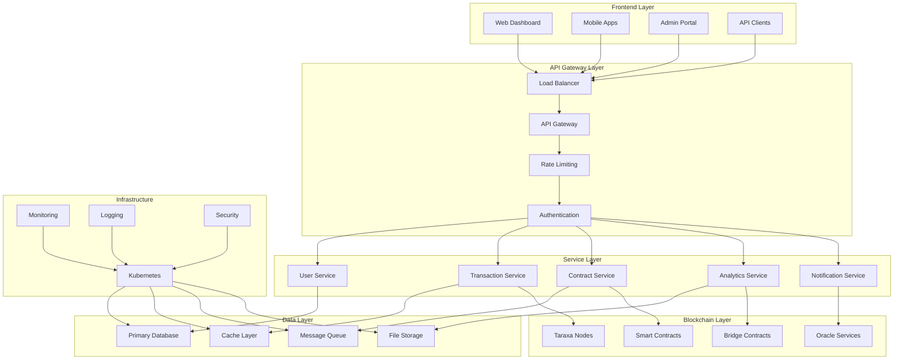

# บทที่ 22: Enterprise Architecture

## 🎯 จุดประสงค์ของบทเรียน
- ออกแบบ Enterprise Blockchain Architecture
- พัฒนาระบบ Microservices และ API Gateway
- สร้าง Identity และ Access Management
- ออกแบบ High Availability และ Disaster Recovery

## 🏗️ Enterprise Architecture Overview

### **📊 Enterprise Architecture Diagram**



## 🔐 Identity and Access Management

### **🛡️ Enterprise IAM System**

```solidity
// contracts/enterprise/EnterpriseIAM.sol
// SPDX-License-Identifier: MIT
pragma solidity ^0.8.19;

import "@openzeppelin/contracts/access/AccessControl.sol";
import "@openzeppelin/contracts/security/ReentrancyGuard.sol";
import "@openzeppelin/contracts/utils/cryptography/ECDSA.sol";

/**
 * @title EnterpriseIAM
 * @dev Enterprise Identity and Access Management system
 */
contract EnterpriseIAM is AccessControl, ReentrancyGuard {
    using ECDSA for bytes32;
    
    struct Organization {
        string name;
        address admin;
        bool isActive;
        uint256 createdAt;
        uint256 userCount;
        uint256 maxUsers;
        bytes32 configHash;
        mapping(address => bool) members;
        mapping(bytes32 => Role) roles;
        mapping(address => bytes32[]) userRoles;
    }
    
    struct Role {
        bytes32 roleId;
        string name;
        string description;
        bool isActive;
        uint256 createdAt;
        bytes32[] permissions;
        mapping(bytes32 => bool) hasPermission;
    }
    
    struct Permission {
        bytes32 permissionId;
        string name;
        string resource;
        string action;
        bool isActive;
        uint256 createdAt;
    }
    
    struct User {
        address userAddress;
        string name;
        string email;
        bool isActive;
        uint256 createdAt;
        uint256 lastLogin;
        bytes32 organizationId;
        bytes32[] roles;
        mapping(bytes32 => uint256) roleAssignedAt;
    }
    
    struct Session {
        bytes32 sessionId;
        address user;
        uint256 createdAt;
        uint256 expiresAt;
        bool isActive;
        string ipAddress;
        string userAgent;
    }
    
    struct AuditLog {
        uint256 logId;
        address user;
        string action;
        string resource;
        uint256 timestamp;
        bool success;
        bytes data;
    }
    
    mapping(bytes32 => Organization) public organizations;
    mapping(bytes32 => Permission) public permissions;
    mapping(address => User) public users;
    mapping(bytes32 => Session) public sessions;
    mapping(uint256 => AuditLog) public auditLogs;
    mapping(address => bytes32[]) public userOrganizations;
    mapping(address => bool) public systemAdmins;
    
    bytes32[] public organizationIds;
    bytes32[] public permissionIds;
    uint256 public auditLogCounter;
    uint256 public defaultSessionDuration = 8 hours;
    uint256 public maxSessionDuration = 24 hours;
    
    // Role definitions
    bytes32 public constant SUPER_ADMIN = keccak256("SUPER_ADMIN");
    bytes32 public constant ORG_ADMIN = keccak256("ORG_ADMIN");
    bytes32 public constant USER_MANAGER = keccak256("USER_MANAGER");
    bytes32 public constant AUDITOR = keccak256("AUDITOR");
    bytes32 public constant API_USER = keccak256("API_USER");
    
    event OrganizationCreated(bytes32 indexed orgId, string name, address admin);
    event OrganizationUpdated(bytes32 indexed orgId, string name);
    event UserRegistered(address indexed user, bytes32 indexed orgId, string name);
    event UserActivated(address indexed user);
    event UserDeactivated(address indexed user);
    event RoleCreated(bytes32 indexed orgId, bytes32 indexed roleId, string name);
    event RoleAssigned(address indexed user, bytes32 indexed roleId);
    event RoleRevoked(address indexed user, bytes32 indexed roleId);
    event PermissionCreated(bytes32 indexed permissionId, string name);
    event SessionCreated(bytes32 indexed sessionId, address indexed user);
    event SessionTerminated(bytes32 indexed sessionId);
    event AuditLogCreated(uint256 indexed logId, address indexed user, string action);
    
    error OrganizationNotFound();
    error UserNotFound();
    error RoleNotFound();
    error PermissionNotFound();
    error SessionNotFound();
    error UnauthorizedAccess();
    error OrganizationInactive();
    error UserInactive();
    error SessionExpired();
    error MaxUsersExceeded();
    
    modifier onlyOrgAdmin(bytes32 orgId) {
        require(
            hasRole(SUPER_ADMIN, msg.sender) || 
            organizations[orgId].admin == msg.sender,
            "Not organization admin"
        );
        _;
    }
    
    modifier onlyActiveUser() {
        require(users[msg.sender].isActive, "User not active");
        _;
    }
    
    modifier onlyActiveOrg(bytes32 orgId) {
        require(organizations[orgId].isActive, "Organization not active");
        _;
    }
    
    constructor() {
        _grantRole(DEFAULT_ADMIN_ROLE, msg.sender);
        _grantRole(SUPER_ADMIN, msg.sender);
        systemAdmins[msg.sender] = true;
        
        // Create default permissions
        _createDefaultPermissions();
    }
    
    /**
     * @dev Create new organization
     */
    function createOrganization(
        string memory name,
        address admin,
        uint256 maxUsers,
        bytes32 configHash
    ) external onlyRole(SUPER_ADMIN) returns (bytes32) {
        bytes32 orgId = keccak256(abi.encodePacked(name, admin, block.timestamp));
        
        Organization storage org = organizations[orgId];
        org.name = name;
        org.admin = admin;
        org.isActive = true;
        org.createdAt = block.timestamp;
        org.maxUsers = maxUsers;
        org.configHash = configHash;
        
        organizationIds.push(orgId);
        
        // Create default roles for organization
        _createDefaultRoles(orgId);
        
        // Assign admin role to admin
        _assignRole(admin, orgId, ORG_ADMIN);
        
        _logAction(msg.sender, "CREATE_ORGANIZATION", "Organization", true, abi.encode(orgId, name));
        
        emit OrganizationCreated(orgId, name, admin);
        return orgId;
    }
    
    /**
     * @dev Register new user in organization
     */
    function registerUser(
        address userAddress,
        string memory name,
        string memory email,
        bytes32 orgId
    ) external onlyOrgAdmin(orgId) onlyActiveOrg(orgId) {
        require(userAddress != address(0), "Invalid user address");
        require(!users[userAddress].isActive, "User already registered");
        require(organizations[orgId].userCount < organizations[orgId].maxUsers, "Max users exceeded");
        
        User storage user = users[userAddress];
        user.userAddress = userAddress;
        user.name = name;
        user.email = email;
        user.isActive = true;
        user.createdAt = block.timestamp;
        user.organizationId = orgId;
        
        organizations[orgId].userCount++;
        organizations[orgId].members[userAddress] = true;
        userOrganizations[userAddress].push(orgId);
        
        _logAction(msg.sender, "REGISTER_USER", "User", true, abi.encode(userAddress, orgId));
        
        emit UserRegistered(userAddress, orgId, name);
    }
    
    /**
     * @dev Create new role in organization
     */
    function createRole(
        bytes32 orgId,
        string memory name,
        string memory description,
        bytes32[] memory permissionIds_
    ) external onlyOrgAdmin(orgId) returns (bytes32) {
        bytes32 roleId = keccak256(abi.encodePacked(orgId, name, block.timestamp));
        
        Role storage role = organizations[orgId].roles[roleId];
        role.roleId = roleId;
        role.name = name;
        role.description = description;
        role.isActive = true;
        role.createdAt = block.timestamp;
        role.permissions = permissionIds_;
        
        // Set permission mappings
        for (uint256 i = 0; i < permissionIds_.length; i++) {
            role.hasPermission[permissionIds_[i]] = true;
        }
        
        _logAction(msg.sender, "CREATE_ROLE", "Role", true, abi.encode(orgId, roleId));
        
        emit RoleCreated(orgId, roleId, name);
        return roleId;
    }
    
    /**
     * @dev Assign role to user
     */
    function assignRole(
        address user,
        bytes32 orgId,
        bytes32 roleId
    ) external onlyOrgAdmin(orgId) {
        _assignRole(user, orgId, roleId);
    }
    
    /**
     * @dev Internal assign role function
     */
    function _assignRole(
        address user,
        bytes32 orgId,
        bytes32 roleId
    ) internal {
        require(users[user].isActive, "User not active");
        require(organizations[orgId].roles[roleId].isActive, "Role not active");
        require(users[user].organizationId == orgId, "User not in organization");
        
        // Check if user already has role
        bytes32[] memory userRoles = users[user].roles;
        for (uint256 i = 0; i < userRoles.length; i++) {
            if (userRoles[i] == roleId) {
                return; // Already has role
            }
        }
        
        users[user].roles.push(roleId);
        users[user].roleAssignedAt[roleId] = block.timestamp;
        organizations[orgId].userRoles[user].push(roleId);
        
        _logAction(msg.sender, "ASSIGN_ROLE", "UserRole", true, abi.encode(user, roleId));
        
        emit RoleAssigned(user, roleId);
    }
    
    /**
     * @dev Revoke role from user
     */
    function revokeRole(
        address user,
        bytes32 orgId,
        bytes32 roleId
    ) external onlyOrgAdmin(orgId) {
        require(users[user].isActive, "User not active");
        
        // Remove from user roles
        bytes32[] storage userRoles = users[user].roles;
        for (uint256 i = 0; i < userRoles.length; i++) {
            if (userRoles[i] == roleId) {
                userRoles[i] = userRoles[userRoles.length - 1];
                userRoles.pop();
                break;
            }
        }
        
        // Remove from organization user roles
        bytes32[] storage orgUserRoles = organizations[orgId].userRoles[user];
        for (uint256 i = 0; i < orgUserRoles.length; i++) {
            if (orgUserRoles[i] == roleId) {
                orgUserRoles[i] = orgUserRoles[orgUserRoles.length - 1];
                orgUserRoles.pop();
                break;
            }
        }
        
        delete users[user].roleAssignedAt[roleId];
        
        _logAction(msg.sender, "REVOKE_ROLE", "UserRole", true, abi.encode(user, roleId));
        
        emit RoleRevoked(user, roleId);
    }
    
    /**
     * @dev Create session for user
     */
    function createSession(
        address user,
        uint256 duration,
        string memory ipAddress,
        string memory userAgent
    ) external returns (bytes32) {
        require(users[user].isActive, "User not active");
        require(duration <= maxSessionDuration, "Duration too long");
        
        bytes32 sessionId = keccak256(abi.encodePacked(
            user,
            block.timestamp,
            ipAddress,
            userAgent
        ));
        
        uint256 sessionDuration = duration > 0 ? duration : defaultSessionDuration;
        
        Session storage session = sessions[sessionId];
        session.sessionId = sessionId;
        session.user = user;
        session.createdAt = block.timestamp;
        session.expiresAt = block.timestamp + sessionDuration;
        session.isActive = true;
        session.ipAddress = ipAddress;
        session.userAgent = userAgent;
        
        users[user].lastLogin = block.timestamp;
        
        _logAction(user, "CREATE_SESSION", "Session", true, abi.encode(sessionId));
        
        emit SessionCreated(sessionId, user);
        return sessionId;
    }
    
    /**
     * @dev Validate session
     */
    function validateSession(bytes32 sessionId) external view returns (bool) {
        Session memory session = sessions[sessionId];
        return session.isActive && 
               session.expiresAt > block.timestamp &&
               users[session.user].isActive;
    }
    
    /**
     * @dev Terminate session
     */
    function terminateSession(bytes32 sessionId) external {
        Session storage session = sessions[sessionId];
        require(
            session.user == msg.sender || 
            hasRole(SUPER_ADMIN, msg.sender) ||
            organizations[users[session.user].organizationId].admin == msg.sender,
            "Not authorized to terminate session"
        );
        
        session.isActive = false;
        
        _logAction(msg.sender, "TERMINATE_SESSION", "Session", true, abi.encode(sessionId));
        
        emit SessionTerminated(sessionId);
    }
    
    /**
     * @dev Check if user has permission
     */
    function hasPermission(
        address user,
        bytes32 permissionId
    ) external view returns (bool) {
        if (!users[user].isActive) {
            return false;
        }
        
        bytes32 orgId = users[user].organizationId;
        bytes32[] memory userRoles = users[user].roles;
        
        for (uint256 i = 0; i < userRoles.length; i++) {
            if (organizations[orgId].roles[userRoles[i]].hasPermission[permissionId]) {
                return true;
            }
        }
        
        return false;
    }
    
    /**
     * @dev Check if user has role
     */
    function hasUserRole(
        address user,
        bytes32 roleId
    ) external view returns (bool) {
        bytes32[] memory userRoles = users[user].roles;
        
        for (uint256 i = 0; i < userRoles.length; i++) {
            if (userRoles[i] == roleId) {
                return true;
            }
        }
        
        return false;
    }
    
    /**
     * @dev Bulk assign roles
     */
    function bulkAssignRoles(
        address[] memory users_,
        bytes32 orgId,
        bytes32[] memory roleIds
    ) external onlyOrgAdmin(orgId) {
        for (uint256 i = 0; i < users_.length; i++) {
            for (uint256 j = 0; j < roleIds.length; j++) {
                _assignRole(users_[i], orgId, roleIds[j]);
            }
        }
    }
    
    /**
     * @dev Create default permissions
     */
    function _createDefaultPermissions() internal {
        // User management permissions
        _createPermission("CREATE_USER", "User", "create");
        _createPermission("READ_USER", "User", "read");
        _createPermission("UPDATE_USER", "User", "update");
        _createPermission("DELETE_USER", "User", "delete");
        
        // Contract permissions
        _createPermission("DEPLOY_CONTRACT", "Contract", "deploy");
        _createPermission("EXECUTE_CONTRACT", "Contract", "execute");
        _createPermission("READ_CONTRACT", "Contract", "read");
        
        // Transaction permissions
        _createPermission("CREATE_TRANSACTION", "Transaction", "create");
        _createPermission("READ_TRANSACTION", "Transaction", "read");
        _createPermission("APPROVE_TRANSACTION", "Transaction", "approve");
        
        // Admin permissions
        _createPermission("MANAGE_ORGANIZATION", "Organization", "manage");
        _createPermission("VIEW_AUDIT_LOGS", "AuditLog", "read");
        _createPermission("MANAGE_ROLES", "Role", "manage");
    }
    
    /**
     * @dev Create permission
     */
    function _createPermission(
        string memory name,
        string memory resource,
        string memory action
    ) internal returns (bytes32) {
        bytes32 permissionId = keccak256(abi.encodePacked(name, resource, action));
        
        Permission storage permission = permissions[permissionId];
        permission.permissionId = permissionId;
        permission.name = name;
        permission.resource = resource;
        permission.action = action;
        permission.isActive = true;
        permission.createdAt = block.timestamp;
        
        permissionIds.push(permissionId);
        
        emit PermissionCreated(permissionId, name);
        return permissionId;
    }
    
    /**
     * @dev Create default roles for organization
     */
    function _createDefaultRoles(bytes32 orgId) internal {
        // Admin role
        bytes32[] memory adminPermissions = new bytes32[](10);
        adminPermissions[0] = keccak256(abi.encodePacked("CREATE_USER", "User", "create"));
        adminPermissions[1] = keccak256(abi.encodePacked("READ_USER", "User", "read"));
        adminPermissions[2] = keccak256(abi.encodePacked("UPDATE_USER", "User", "update"));
        adminPermissions[3] = keccak256(abi.encodePacked("DELETE_USER", "User", "delete"));
        adminPermissions[4] = keccak256(abi.encodePacked("DEPLOY_CONTRACT", "Contract", "deploy"));
        adminPermissions[5] = keccak256(abi.encodePacked("EXECUTE_CONTRACT", "Contract", "execute"));
        adminPermissions[6] = keccak256(abi.encodePacked("READ_CONTRACT", "Contract", "read"));
        adminPermissions[7] = keccak256(abi.encodePacked("MANAGE_ORGANIZATION", "Organization", "manage"));
        adminPermissions[8] = keccak256(abi.encodePacked("VIEW_AUDIT_LOGS", "AuditLog", "read"));
        adminPermissions[9] = keccak256(abi.encodePacked("MANAGE_ROLES", "Role", "manage"));
        
        bytes32 adminRoleId = keccak256(abi.encodePacked(orgId, "ADMIN", block.timestamp));
        Role storage adminRole = organizations[orgId].roles[adminRoleId];
        adminRole.roleId = adminRoleId;
        adminRole.name = "Administrator";
        adminRole.description = "Full administrative access";
        adminRole.isActive = true;
        adminRole.createdAt = block.timestamp;
        adminRole.permissions = adminPermissions;
        
        for (uint256 i = 0; i < adminPermissions.length; i++) {
            adminRole.hasPermission[adminPermissions[i]] = true;
        }
        
        // User role
        bytes32[] memory userPermissions = new bytes32[](3);
        userPermissions[0] = keccak256(abi.encodePacked("READ_USER", "User", "read"));
        userPermissions[1] = keccak256(abi.encodePacked("READ_CONTRACT", "Contract", "read"));
        userPermissions[2] = keccak256(abi.encodePacked("CREATE_TRANSACTION", "Transaction", "create"));
        
        bytes32 userRoleId = keccak256(abi.encodePacked(orgId, "USER", block.timestamp + 1));
        Role storage userRole = organizations[orgId].roles[userRoleId];
        userRole.roleId = userRoleId;
        userRole.name = "User";
        userRole.description = "Basic user access";
        userRole.isActive = true;
        userRole.createdAt = block.timestamp;
        userRole.permissions = userPermissions;
        
        for (uint256 i = 0; i < userPermissions.length; i++) {
            userRole.hasPermission[userPermissions[i]] = true;
        }
    }
    
    /**
     * @dev Log action for audit
     */
    function _logAction(
        address user,
        string memory action,
        string memory resource,
        bool success,
        bytes memory data
    ) internal {
        uint256 logId = auditLogCounter++;
        
        AuditLog storage log = auditLogs[logId];
        log.logId = logId;
        log.user = user;
        log.action = action;
        log.resource = resource;
        log.timestamp = block.timestamp;
        log.success = success;
        log.data = data;
        
        emit AuditLogCreated(logId, user, action);
    }
    
    /**
     * @dev Get user organizations
     */
    function getUserOrganizations(address user) 
        external 
        view 
        returns (bytes32[] memory) 
    {
        return userOrganizations[user];
    }
    
    /**
     * @dev Get user roles
     */
    function getUserRoles(address user) 
        external 
        view 
        returns (bytes32[] memory) 
    {
        return users[user].roles;
    }
    
    /**
     * @dev Get organization members count
     */
    function getOrganizationMembersCount(bytes32 orgId) 
        external 
        view 
        returns (uint256) 
    {
        return organizations[orgId].userCount;
    }
    
    /**
     * @dev Get all organizations
     */
    function getAllOrganizations() 
        external 
        view 
        returns (bytes32[] memory) 
    {
        return organizationIds;
    }
    
    /**
     * @dev Get all permissions
     */
    function getAllPermissions() 
        external 
        view 
        returns (bytes32[] memory) 
    {
        return permissionIds;
    }
    
    /**
     * @dev Emergency functions
     */
    function emergencyDeactivateUser(address user) external onlyRole(SUPER_ADMIN) {
        users[user].isActive = false;
        emit UserDeactivated(user);
    }
    
    function emergencyDeactivateOrganization(bytes32 orgId) external onlyRole(SUPER_ADMIN) {
        organizations[orgId].isActive = false;
        emit OrganizationUpdated(orgId, organizations[orgId].name);
    }
    
    function emergencyTerminateAllSessions(address user) external onlyRole(SUPER_ADMIN) {
        // In practice, would iterate through all sessions for user
        // This is simplified for demonstration
        users[user].lastLogin = 0;
    }
}
```

## 📊 Microservices Architecture

### **⚙️ Service Registry and Discovery**

```solidity
// contracts/enterprise/ServiceRegistry.sol
// SPDX-License-Identifier: MIT
pragma solidity ^0.8.19;

import "@openzeppelin/contracts/access/Ownable.sol";

/**
 * @title ServiceRegistry
 * @dev Decentralized service registry for microservices
 */
contract ServiceRegistry is Ownable {
    struct Service {
        string name;
        string version;
        address serviceAddress;
        string endpoint;
        uint256 port;
        ServiceStatus status;
        uint256 registeredAt;
        uint256 lastHeartbeat;
        uint256 heartbeatInterval;
        bytes32 configHash;
        address registrar;
        mapping(string => string) metadata;
        string[] metadataKeys;
    }
    
    struct ServiceHealth {
        bool isHealthy;
        uint256 responseTime;
        uint256 errorRate;
        uint256 requestCount;
        uint256 lastCheck;
        string healthCheckUrl;
    }
    
    struct LoadBalancer {
        string serviceName;
        address[] instances;
        LoadBalancingStrategy strategy;
        uint256 currentIndex; // For round-robin
        mapping(address => uint256) weights; // For weighted round-robin
    }
    
    enum ServiceStatus {
        Registered,
        Active,
        Inactive,
        Unhealthy,
        Deregistered
    }
    
    enum LoadBalancingStrategy {
        RoundRobin,
        WeightedRoundRobin,
        LeastConnections,
        Random
    }
    
    mapping(bytes32 => Service) public services;
    mapping(bytes32 => ServiceHealth) public serviceHealth;
    mapping(string => LoadBalancer) public loadBalancers;
    mapping(string => bytes32[]) public servicesByName;
    mapping(address => bytes32[]) public servicesByAddress;
    
    bytes32[] public allServices;
    string[] public serviceNames;
    
    uint256 public defaultHeartbeatInterval = 30 seconds;
    uint256 public maxHeartbeatInterval = 300 seconds;
    uint256 public serviceTimeout = 60 seconds;
    
    event ServiceRegistered(
        bytes32 indexed serviceId,
        string indexed name,
        address indexed serviceAddress,
        string endpoint
    );
    
    event ServiceDeregistered(bytes32 indexed serviceId, string indexed name);
    event ServiceStatusChanged(bytes32 indexed serviceId, ServiceStatus oldStatus, ServiceStatus newStatus);
    event HeartbeatReceived(bytes32 indexed serviceId, uint256 timestamp);
    event ServiceHealthUpdated(bytes32 indexed serviceId, bool isHealthy, uint256 responseTime);
    event LoadBalancerUpdated(string indexed serviceName, LoadBalancingStrategy strategy);
    
    error ServiceNotFound();
    error ServiceAlreadyRegistered();
    error UnauthorizedService();
    error InvalidHeartbeatInterval();
    error InvalidEndpoint();
    
    modifier onlyServiceRegistrar(bytes32 serviceId) {
        require(services[serviceId].registrar == msg.sender, "Not service registrar");
        _;
    }
    
    modifier validServiceId(bytes32 serviceId) {
        require(services[serviceId].registeredAt > 0, "Service not found");
        _;
    }
    
    /**
     * @dev Register new service
     */
    function registerService(
        string memory name,
        string memory version,
        address serviceAddress,
        string memory endpoint,
        uint256 port,
        uint256 heartbeatInterval,
        bytes32 configHash
    ) external returns (bytes32) {
        require(bytes(name).length > 0, "Invalid service name");
        require(serviceAddress != address(0), "Invalid service address");
        require(bytes(endpoint).length > 0, "Invalid endpoint");
        
        if (heartbeatInterval == 0) {
            heartbeatInterval = defaultHeartbeatInterval;
        }
        require(heartbeatInterval <= maxHeartbeatInterval, "Heartbeat interval too long");
        
        bytes32 serviceId = keccak256(abi.encodePacked(
            name,
            version,
            serviceAddress,
            endpoint,
            block.timestamp
        ));
        
        require(services[serviceId].registeredAt == 0, "Service already registered");
        
        Service storage service = services[serviceId];
        service.name = name;
        service.version = version;
        service.serviceAddress = serviceAddress;
        service.endpoint = endpoint;
        service.port = port;
        service.status = ServiceStatus.Registered;
        service.registeredAt = block.timestamp;
        service.lastHeartbeat = block.timestamp;
        service.heartbeatInterval = heartbeatInterval;
        service.configHash = configHash;
        service.registrar = msg.sender;
        
        // Add to indexes
        allServices.push(serviceId);
        servicesByName[name].push(serviceId);
        servicesByAddress[serviceAddress].push(serviceId);
        
        // Add service name to list if not exists
        bool nameExists = false;
        for (uint256 i = 0; i < serviceNames.length; i++) {
            if (keccak256(abi.encodePacked(serviceNames[i])) == keccak256(abi.encodePacked(name))) {
                nameExists = true;
                break;
            }
        }
        if (!nameExists) {
            serviceNames.push(name);
        }
        
        // Initialize health check
        ServiceHealth storage health = serviceHealth[serviceId];
        health.isHealthy = true;
        health.lastCheck = block.timestamp;
        health.healthCheckUrl = string(abi.encodePacked(endpoint, "/health"));
        
        // Update load balancer
        _updateLoadBalancer(name, serviceAddress);
        
        emit ServiceRegistered(serviceId, name, serviceAddress, endpoint);
        
        return serviceId;
    }
    
    /**
     * @dev Deregister service
     */
    function deregisterService(bytes32 serviceId) 
        external 
        onlyServiceRegistrar(serviceId) 
        validServiceId(serviceId) 
    {
        Service storage service = services[serviceId];
        service.status = ServiceStatus.Deregistered;
        
        // Remove from load balancer
        _removeFromLoadBalancer(service.name, service.serviceAddress);
        
        emit ServiceDeregistered(serviceId, service.name);
        emit ServiceStatusChanged(serviceId, ServiceStatus.Active, ServiceStatus.Deregistered);
    }
    
    /**
     * @dev Send heartbeat for service
     */
    function sendHeartbeat(bytes32 serviceId) 
        external 
        onlyServiceRegistrar(serviceId) 
        validServiceId(serviceId) 
    {
        Service storage service = services[serviceId];
        require(service.status != ServiceStatus.Deregistered, "Service deregistered");
        
        service.lastHeartbeat = block.timestamp;
        
        // Update status to active if not already
        if (service.status != ServiceStatus.Active) {
            ServiceStatus oldStatus = service.status;
            service.status = ServiceStatus.Active;
            emit ServiceStatusChanged(serviceId, oldStatus, ServiceStatus.Active);
        }
        
        emit HeartbeatReceived(serviceId, block.timestamp);
    }
    
    /**
     * @dev Update service health
     */
    function updateServiceHealth(
        bytes32 serviceId,
        bool isHealthy,
        uint256 responseTime,
        uint256 errorRate,
        uint256 requestCount
    ) external onlyServiceRegistrar(serviceId) validServiceId(serviceId) {
        ServiceHealth storage health = serviceHealth[serviceId];
        health.isHealthy = isHealthy;
        health.responseTime = responseTime;
        health.errorRate = errorRate;
        health.requestCount = requestCount;
        health.lastCheck = block.timestamp;
        
        // Update service status based on health
        Service storage service = services[serviceId];
        ServiceStatus oldStatus = service.status;
        
        if (isHealthy && service.status == ServiceStatus.Unhealthy) {
            service.status = ServiceStatus.Active;
        } else if (!isHealthy && service.status == ServiceStatus.Active) {
            service.status = ServiceStatus.Unhealthy;
        }
        
        if (oldStatus != service.status) {
            emit ServiceStatusChanged(serviceId, oldStatus, service.status);
        }
        
        emit ServiceHealthUpdated(serviceId, isHealthy, responseTime);
    }
    
    /**
     * @dev Set service metadata
     */
    function setServiceMetadata(
        bytes32 serviceId,
        string memory key,
        string memory value
    ) external onlyServiceRegistrar(serviceId) validServiceId(serviceId) {
        Service storage service = services[serviceId];
        
        // Check if key exists
        bool keyExists = false;
        for (uint256 i = 0; i < service.metadataKeys.length; i++) {
            if (keccak256(abi.encodePacked(service.metadataKeys[i])) == keccak256(abi.encodePacked(key))) {
                keyExists = true;
                break;
            }
        }
        
        if (!keyExists) {
            service.metadataKeys.push(key);
        }
        
        service.metadata[key] = value;
    }
    
    /**
     * @dev Get service by name and load balancing
     */
    function getServiceInstance(string memory serviceName) 
        external 
        returns (bytes32) 
    {
        LoadBalancer storage lb = loadBalancers[serviceName];
        require(lb.instances.length > 0, "No service instances available");
        
        bytes32 selectedServiceId;
        
        if (lb.strategy == LoadBalancingStrategy.RoundRobin) {
            address selectedAddress = lb.instances[lb.currentIndex];
            lb.currentIndex = (lb.currentIndex + 1) % lb.instances.length;
            selectedServiceId = _getServiceIdByAddress(serviceName, selectedAddress);
        } else if (lb.strategy == LoadBalancingStrategy.Random) {
            uint256 randomIndex = uint256(keccak256(abi.encodePacked(
                block.timestamp, 
                block.difficulty, 
                msg.sender
            ))) % lb.instances.length;
            address selectedAddress = lb.instances[randomIndex];
            selectedServiceId = _getServiceIdByAddress(serviceName, selectedAddress);
        } else {
            // Default to first available
            address selectedAddress = lb.instances[0];
            selectedServiceId = _getServiceIdByAddress(serviceName, selectedAddress);
        }
        
        return selectedServiceId;
    }
    
    /**
     * @dev Get healthy service instances
     */
    function getHealthyServices(string memory serviceName) 
        external 
        view 
        returns (bytes32[] memory) 
    {
        bytes32[] memory serviceIds = servicesByName[serviceName];
        bytes32[] memory healthyServices = new bytes32[](serviceIds.length);
        uint256 healthyCount = 0;
        
        for (uint256 i = 0; i < serviceIds.length; i++) {
            bytes32 serviceId = serviceIds[i];
            if (_isServiceHealthy(serviceId)) {
                healthyServices[healthyCount] = serviceId;
                healthyCount++;
            }
        }
        
        // Resize array
        bytes32[] memory result = new bytes32[](healthyCount);
        for (uint256 i = 0; i < healthyCount; i++) {
            result[i] = healthyServices[i];
        }
        
        return result;
    }
    
    /**
     * @dev Check if service is healthy
     */
    function _isServiceHealthy(bytes32 serviceId) internal view returns (bool) {
        Service storage service = services[serviceId];
        ServiceHealth storage health = serviceHealth[serviceId];
        
        // Check if service is active
        if (service.status != ServiceStatus.Active) {
            return false;
        }
        
        // Check heartbeat timeout
        if (block.timestamp - service.lastHeartbeat > serviceTimeout) {
            return false;
        }
        
        // Check health status
        return health.isHealthy;
    }
    
    /**
     * @dev Update load balancer configuration
     */
    function _updateLoadBalancer(string memory serviceName, address serviceAddress) internal {
        LoadBalancer storage lb = loadBalancers[serviceName];
        
        // Initialize if first service
        if (lb.instances.length == 0) {
            lb.serviceName = serviceName;
            lb.strategy = LoadBalancingStrategy.RoundRobin;
        }
        
        // Add instance if not exists
        bool exists = false;
        for (uint256 i = 0; i < lb.instances.length; i++) {
            if (lb.instances[i] == serviceAddress) {
                exists = true;
                break;
            }
        }
        
        if (!exists) {
            lb.instances.push(serviceAddress);
            lb.weights[serviceAddress] = 1; // Default weight
        }
    }
    
    /**
     * @dev Remove service from load balancer
     */
    function _removeFromLoadBalancer(string memory serviceName, address serviceAddress) internal {
        LoadBalancer storage lb = loadBalancers[serviceName];
        
        // Remove instance
        for (uint256 i = 0; i < lb.instances.length; i++) {
            if (lb.instances[i] == serviceAddress) {
                lb.instances[i] = lb.instances[lb.instances.length - 1];
                lb.instances.pop();
                delete lb.weights[serviceAddress];
                
                // Adjust current index if needed
                if (lb.currentIndex >= lb.instances.length && lb.instances.length > 0) {
                    lb.currentIndex = 0;
                }
                break;
            }
        }
    }
    
    /**
     * @dev Get service ID by address and name
     */
    function _getServiceIdByAddress(string memory serviceName, address serviceAddress) 
        internal 
        view 
        returns (bytes32) 
    {
        bytes32[] memory serviceIds = servicesByName[serviceName];
        
        for (uint256 i = 0; i < serviceIds.length; i++) {
            if (services[serviceIds[i]].serviceAddress == serviceAddress) {
                return serviceIds[i];
            }
        }
        
        revert ServiceNotFound();
    }
    
    /**
     * @dev Clean up inactive services
     */
    function cleanupInactiveServices() external onlyOwner {
        for (uint256 i = 0; i < allServices.length; i++) {
            bytes32 serviceId = allServices[i];
            Service storage service = services[serviceId];
            
            if (block.timestamp - service.lastHeartbeat > serviceTimeout) {
                ServiceStatus oldStatus = service.status;
                service.status = ServiceStatus.Inactive;
                
                if (oldStatus != ServiceStatus.Inactive) {
                    emit ServiceStatusChanged(serviceId, oldStatus, ServiceStatus.Inactive);
                }
                
                // Remove from load balancer
                _removeFromLoadBalancer(service.name, service.serviceAddress);
            }
        }
    }
    
    /**
     * @dev Set load balancing strategy
     */
    function setLoadBalancingStrategy(
        string memory serviceName,
        LoadBalancingStrategy strategy
    ) external onlyOwner {
        loadBalancers[serviceName].strategy = strategy;
        emit LoadBalancerUpdated(serviceName, strategy);
    }
    
    /**
     * @dev Set service weight for weighted round-robin
     */
    function setServiceWeight(
        string memory serviceName,
        address serviceAddress,
        uint256 weight
    ) external onlyOwner {
        loadBalancers[serviceName].weights[serviceAddress] = weight;
    }
    
    /**
     * @dev View functions
     */
    function getService(bytes32 serviceId) 
        external 
        view 
        returns (
            string memory name,
            string memory version,
            address serviceAddress,
            string memory endpoint,
            uint256 port,
            ServiceStatus status,
            uint256 registeredAt,
            uint256 lastHeartbeat
        ) 
    {
        Service storage service = services[serviceId];
        return (
            service.name,
            service.version,
            service.serviceAddress,
            service.endpoint,
            service.port,
            service.status,
            service.registeredAt,
            service.lastHeartbeat
        );
    }
    
    function getServiceHealth(bytes32 serviceId) 
        external 
        view 
        returns (ServiceHealth memory) 
    {
        return serviceHealth[serviceId];
    }
    
    function getServiceMetadata(bytes32 serviceId, string memory key) 
        external 
        view 
        returns (string memory) 
    {
        return services[serviceId].metadata[key];
    }
    
    function getServiceMetadataKeys(bytes32 serviceId) 
        external 
        view 
        returns (string[] memory) 
    {
        return services[serviceId].metadataKeys;
    }
    
    function getAllServiceNames() 
        external 
        view 
        returns (string[] memory) 
    {
        return serviceNames;
    }
    
    function getServicesByName(string memory serviceName) 
        external 
        view 
        returns (bytes32[] memory) 
    {
        return servicesByName[serviceName];
    }
    
    function getLoadBalancerInfo(string memory serviceName) 
        external 
        view 
        returns (
            address[] memory instances,
            LoadBalancingStrategy strategy,
            uint256 currentIndex
        ) 
    {
        LoadBalancer storage lb = loadBalancers[serviceName];
        return (lb.instances, lb.strategy, lb.currentIndex);
    }
    
    function getServiceWeight(string memory serviceName, address serviceAddress) 
        external 
        view 
        returns (uint256) 
    {
        return loadBalancers[serviceName].weights[serviceAddress];
    }
    
    /**
     * @dev Emergency functions
     */
    function emergencyStopService(bytes32 serviceId) external onlyOwner {
        Service storage service = services[serviceId];
        ServiceStatus oldStatus = service.status;
        service.status = ServiceStatus.Inactive;
        
        emit ServiceStatusChanged(serviceId, oldStatus, ServiceStatus.Inactive);
        _removeFromLoadBalancer(service.name, service.serviceAddress);
    }
    
    function emergencyUpdateTimeout(uint256 newTimeout) external onlyOwner {
        serviceTimeout = newTimeout;
    }
}
```

## 📋 แบบฝึกหัด

### **🎯 แบบฝึกหัดที่ 1: API Gateway Implementation**
สร้างระบบ API Gateway:
1. Rate limiting mechanisms
2. Authentication middleware
3. Request/response transformation

### **🔧 แบบฝึกหัดที่ 2: Monitoring and Alerting**
พัฒนาระบบ Monitoring:
1. Real-time metrics collection
2. Alert management system
3. Dashboard analytics

### **📊 แบบฝึกหัดที่ 3: Disaster Recovery**
สร้างระบบ Disaster Recovery:
1. Backup and restore mechanisms
2. Failover procedures
3. Data replication strategies

## 🔗 การเชื่อมต่อ

**บทก่อนหน้า**: [บทที่ 21: Layer 2 Solutions](./21-layer2-solutions.md)  
**บทถัดไป**: [บทที่ 23: Performance Optimization](./23-performance-optimization.md)

**กลับไปหน้าหลัก**: [README](./README.md)

---

## 📚 เอกสารอ้างอิง

- [Microservices Architecture](https://microservices.io/)
- [Kubernetes Documentation](https://kubernetes.io/docs/)
- [API Gateway Patterns](https://microservices.io/patterns/apigateway.html)
- [Enterprise Integration Patterns](https://www.enterpriseintegrationpatterns.com/)
- [OAuth 2.0 and OpenID Connect](https://oauth.net/2/)

---

ตอนนี้คุณมีความรู้ครบถ้วนเกี่ยวกับ Enterprise Architecture! 🏢🚀
