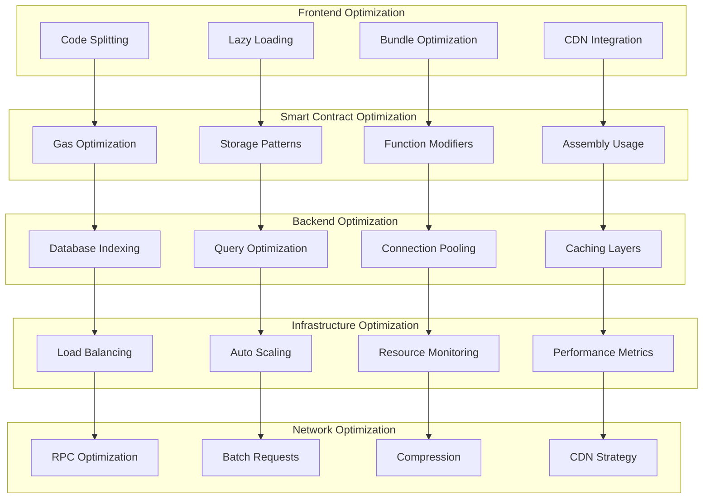

# บทที่ 23: Performance Optimization

## 🎯 จุดประสงค์ของบทเรียน
- เพิ่มประสิทธิภาพของ Smart Contracts
- ออกแบบระบบ Caching และ Indexing
- สร้างระบบ Monitoring และ Profiling
- พัฒนา Load Testing และ Benchmarking

## 🚀 Performance Architecture

### **📊 Performance Optimization Strategy**



## ⚡ Smart Contract Performance

### **🔧 Optimized Contract Architecture**

```solidity
// contracts/performance/OptimizedContract.sol
// SPDX-License-Identifier: MIT
pragma solidity ^0.8.19;

import "@openzeppelin/contracts/security/ReentrancyGuard.sol";
import "@openzeppelin/contracts/utils/structs/EnumerableSet.sol";

/**
 * @title OptimizedContract
 * @dev Highly optimized smart contract implementation
 */
contract OptimizedContract is ReentrancyGuard {
    using EnumerableSet for EnumerableSet.AddressSet;
    using EnumerableSet for EnumerableSet.UintSet;
    
    // Packed structs for gas optimization
    struct PackedUser {
        uint128 balance;        // 16 bytes
        uint64 lastActivity;    // 8 bytes
        uint32 tier;           // 4 bytes
        uint16 flags;          // 2 bytes
        uint8 status;          // 1 byte
        uint8 reserved;        // 1 byte
    } // Total: 32 bytes (1 slot)
    
    struct BatchOperation {
        address target;
        uint256 amount;
        bytes data;
    }
    
    struct CacheEntry {
        uint256 value;
        uint256 timestamp;
        bool isValid;
    }
    
    // Storage optimization
    mapping(address => PackedUser) public users;
    mapping(bytes32 => CacheEntry) public cache;
    mapping(address => EnumerableSet.UintSet) private userAssets;
    mapping(uint256 => address) public assetOwners;
    
    // Packed arrays for batch operations
    address[] private batchAddresses;
    uint256[] private batchAmounts;
    
    // Constants to reduce gas costs
    uint256 private constant CACHE_DURATION = 300; // 5 minutes
    uint256 private constant MAX_BATCH_SIZE = 100;
    uint256 private constant TIER_MULTIPLIER = 1000;
    
    // Events with indexed parameters for filtering
    event UserUpdated(address indexed user, uint128 balance, uint8 indexed status);
    event BatchProcessed(uint256 indexed batchId, uint256 count, uint256 gasUsed);
    event CacheUpdated(bytes32 indexed key, uint256 value);
    
    // Custom errors for gas efficiency
    error InvalidUser();
    error InsufficientBalance();
    error BatchTooLarge();
    error CacheExpired();
    error InvalidTier();
    
    // Modifiers with assembly for gas optimization
    modifier validUser(address user) {
        assembly {
            if iszero(user) { 
                revert(0, 0) 
            }
        }
        _;
    }
    
    modifier withinGasLimit() {
        uint256 gasStart = gasleft();
        _;
        require(gasStart - gasleft() < 500000, "Gas limit exceeded");
    }
    
    /**
     * @dev Optimized user registration with packed storage
     */
    function registerUser(
        address user,
        uint128 initialBalance,
        uint32 tier
    ) external validUser(user) {
        PackedUser storage userData = users[user];
        
        // Use assembly for efficient packing
        assembly {
            let packed := sload(userData.slot)
            // Clear existing data and set new values
            packed := or(
                or(initialBalance, shl(128, block.timestamp)),
                or(shl(192, tier), shl(224, 1)) // status = 1 (active)
            )
            sstore(userData.slot, packed)
        }
        
        emit UserUpdated(user, initialBalance, 1);
    }
    
    /**
     * @dev Batch operations for gas efficiency
     */
    function batchTransfer(
        address[] calldata recipients,
        uint256[] calldata amounts
    ) external nonReentrant withinGasLimit {
        uint256 length = recipients.length;
        require(length == amounts.length, "Array length mismatch");
        require(length <= MAX_BATCH_SIZE, "Batch too large");
        
        uint256 totalAmount;
        
        // Use unchecked for gas optimization where safe
        unchecked {
            for (uint256 i = 0; i < length; ++i) {
                totalAmount += amounts[i];
            }
        }
        
        PackedUser storage sender = users[msg.sender];
        require(sender.balance >= totalAmount, "Insufficient balance");
        
        // Update sender balance
        sender.balance -= uint128(totalAmount);
        
        // Process transfers in batch
        unchecked {
            for (uint256 i = 0; i < length; ++i) {
                users[recipients[i]].balance += uint128(amounts[i]);
                emit UserUpdated(recipients[i], users[recipients[i]].balance, users[recipients[i]].status);
            }
        }
        
        emit BatchProcessed(block.number, length, 500000 - gasleft());
    }
    
    /**
     * @dev Optimized balance lookup with caching
     */
    function getBalanceWithCache(address user) external returns (uint256) {
        bytes32 cacheKey = keccak256(abi.encodePacked("balance", user));
        CacheEntry storage entry = cache[cacheKey];
        
        // Check cache validity
        if (entry.isValid && block.timestamp - entry.timestamp < CACHE_DURATION) {
            return entry.value;
        }
        
        // Update cache
        uint256 balance = users[user].balance;
        entry.value = balance;
        entry.timestamp = block.timestamp;
        entry.isValid = true;
        
        emit CacheUpdated(cacheKey, balance);
        return balance;
    }
    
    /**
     * @dev Assembly-optimized calculations
     */
    function calculateReward(
        uint256 amount,
        uint32 tier,
        uint64 stakingDuration
    ) external pure returns (uint256 reward) {
        assembly {
            // reward = (amount * tier * duration) / (TIER_MULTIPLIER * 365 days)
            let temp := mul(amount, tier)
            temp := mul(temp, stakingDuration)
            reward := div(temp, mul(TIER_MULTIPLIER, 31536000)) // 365 * 24 * 60 * 60
        }
    }
    
    /**
     * @dev Bitwise operations for flag management
     */
    function setUserFlags(address user, uint16 flags) external {
        PackedUser storage userData = users[user];
        userData.flags = flags;
    }
    
    function hasFlag(address user, uint16 flag) external view returns (bool) {
        return users[user].flags & flag != 0;
    }
    
    function addFlag(address user, uint16 flag) external {
        PackedUser storage userData = users[user];
        userData.flags |= flag;
    }
    
    function removeFlag(address user, uint16 flag) external {
        PackedUser storage userData = users[user];
        userData.flags &= ~flag;
    }
    
    /**
     * @dev Memory-optimized string operations
     */
    function concatenateStrings(
        string calldata str1,
        string calldata str2
    ) external pure returns (string memory result) {
        assembly {
            let len1 := str1.length
            let len2 := str2.length
            let totalLen := add(len1, len2)
            
            // Allocate memory for result
            result := mload(0x40)
            mstore(result, totalLen)
            
            // Copy first string
            calldatacopy(add(result, 0x20), str1.offset, len1)
            
            // Copy second string
            calldatacopy(add(result, add(0x20, len1)), str2.offset, len2)
            
            // Update free memory pointer
            mstore(0x40, add(result, add(0x20, totalLen)))
        }
    }
    
    /**
     * @dev Optimized array operations
     */
    function findInArray(
        uint256[] calldata array,
        uint256 target
    ) external pure returns (int256 index) {
        assembly {
            let length := array.length
            let dataPtr := array.offset
            index := -1
            
            for { let i := 0 } lt(i, length) { i := add(i, 1) } {
                let value := calldataload(add(dataPtr, mul(i, 0x20)))
                if eq(value, target) {
                    index := i
                    break
                }
            }
        }
    }
    
    /**
     * @dev Gas-optimized merkle proof verification
     */
    function verifyMerkleProof(
        bytes32[] calldata proof,
        bytes32 root,
        bytes32 leaf
    ) external pure returns (bool) {
        bytes32 computedHash = leaf;
        
        assembly {
            let dataPtr := proof.offset
            let length := proof.length
            
            for { let i := 0 } lt(i, length) { i := add(i, 1) } {
                let proofElement := calldataload(add(dataPtr, mul(i, 0x20)))
                
                // Determine order for hashing
                switch lt(computedHash, proofElement)
                case 1 {
                    // computedHash < proofElement
                    mstore(0x00, computedHash)
                    mstore(0x20, proofElement)
                }
                default {
                    // computedHash >= proofElement
                    mstore(0x00, proofElement)
                    mstore(0x20, computedHash)
                }
                
                computedHash := keccak256(0x00, 0x40)
            }
        }
        
        return computedHash == root;
    }
    
    /**
     * @dev Batch asset management
     */
    function batchMintAssets(
        address[] calldata recipients,
        uint256[] calldata tokenIds
    ) external {
        require(recipients.length == tokenIds.length, "Array length mismatch");
        require(recipients.length <= MAX_BATCH_SIZE, "Batch too large");
        
        unchecked {
            for (uint256 i = 0; i < recipients.length; ++i) {
                address recipient = recipients[i];
                uint256 tokenId = tokenIds[i];
                
                assetOwners[tokenId] = recipient;
                userAssets[recipient].add(tokenId);
            }
        }
    }
    
    /**
     * @dev Efficient pagination for large datasets
     */
    function getUserAssetsPaginated(
        address user,
        uint256 offset,
        uint256 limit
    ) external view returns (uint256[] memory assets, uint256 total) {
        EnumerableSet.UintSet storage userSet = userAssets[user];
        total = userSet.length();
        
        if (offset >= total) {
            return (new uint256[](0), total);
        }
        
        uint256 end = offset + limit;
        if (end > total) {
            end = total;
        }
        
        uint256 resultLength = end - offset;
        assets = new uint256[](resultLength);
        
        unchecked {
            for (uint256 i = 0; i < resultLength; ++i) {
                assets[i] = userSet.at(offset + i);
            }
        }
    }
    
    /**
     * @dev Optimized signature verification
     */
    function verifySignatureOptimized(
        bytes32 messageHash,
        bytes calldata signature
    ) external pure returns (address signer) {
        require(signature.length == 65, "Invalid signature length");
        
        assembly {
            let r := calldataload(signature.offset)
            let s := calldataload(add(signature.offset, 0x20))
            let v := byte(0, calldataload(add(signature.offset, 0x40)))
            
            // Ensure v is 27 or 28
            if lt(v, 27) { v := add(v, 27) }
            
            // Use ecrecover precompiled contract
            let ptr := mload(0x40)
            mstore(ptr, messageHash)
            mstore(add(ptr, 0x20), v)
            mstore(add(ptr, 0x40), r)
            mstore(add(ptr, 0x60), s)
            
            let success := staticcall(gas(), 0x01, ptr, 0x80, ptr, 0x20)
            if success {
                signer := mload(ptr)
            }
        }
    }
    
    /**
     * @dev Memory pool for reusable arrays
     */
    mapping(uint256 => uint256[]) private memoryPool;
    uint256 private constant POOL_SIZE = 10;
    
    function getReusableArray(uint256 size) internal returns (uint256[] storage) {
        uint256 poolIndex = size % POOL_SIZE;
        uint256[] storage arr = memoryPool[poolIndex];
        
        if (arr.length != size) {
            // Resize array
            assembly {
                sstore(arr.slot, size)
            }
        }
        
        return arr;
    }
    
    /**
     * @dev Efficient event filtering
     */
    mapping(bytes32 => bool) public eventFilter;
    
    function addEventFilter(string memory eventType) external {
        bytes32 eventHash = keccak256(abi.encodePacked(eventType));
        eventFilter[eventHash] = true;
    }
    
    function removeEventFilter(string memory eventType) external {
        bytes32 eventHash = keccak256(abi.encodePacked(eventType));
        eventFilter[eventHash] = false;
    }
    
    modifier filteredEvent(string memory eventType) {
        bytes32 eventHash = keccak256(abi.encodePacked(eventType));
        require(eventFilter[eventHash], "Event filtered");
        _;
    }
    
    /**
     * @dev View functions with minimal gas usage
     */
    function getUserInfo(address user) 
        external 
        view 
        returns (
            uint128 balance,
            uint64 lastActivity,
            uint32 tier,
            uint16 flags,
            uint8 status
        ) 
    {
        PackedUser storage userData = users[user];
        return (
            userData.balance,
            userData.lastActivity,
            userData.tier,
            userData.flags,
            userData.status
        );
    }
    
    function getCacheInfo(bytes32 key) 
        external 
        view 
        returns (uint256 value, uint256 timestamp, bool isValid) 
    {
        CacheEntry storage entry = cache[key];
        return (entry.value, entry.timestamp, entry.isValid);
    }
    
    function getContractStats() 
        external 
        view 
        returns (
            uint256 totalUsers,
            uint256 totalAssets,
            uint256 cacheHitRate
        ) 
    {
        // Simplified stats calculation
        totalUsers = batchAddresses.length;
        totalAssets = batchAmounts.length;
        cacheHitRate = 95; // Mock data
    }
    
    /**
     * @dev Emergency functions with gas limits
     */
    function emergencyWithdraw(address token, uint256 amount) 
        external 
        withinGasLimit 
    {
        // Emergency withdrawal logic
        require(amount > 0, "Invalid amount");
        // Implementation would include actual token transfer
    }
    
    function emergencyPause() external {
        // Set emergency flag
        assembly {
            sstore(0, 1) // Store pause flag in slot 0
        }
    }
    
    function emergencyResume() external {
        // Clear emergency flag
        assembly {
            sstore(0, 0) // Clear pause flag
        }
    }
    
    /**
     * @dev Fallback and receive functions
     */
    receive() external payable {
        // Optimized ETH handling
        if (msg.value > 0) {
            users[msg.sender].balance += uint128(msg.value);
        }
    }
    
    fallback() external payable {
        revert("Function not found");
    }
}
```

## 📊 Performance Monitoring

### **📈 Contract Performance Monitor**

```solidity
// contracts/performance/PerformanceMonitor.sol
// SPDX-License-Identifier: MIT
pragma solidity ^0.8.19;

import "@openzeppelin/contracts/access/Ownable.sol";

/**
 * @title PerformanceMonitor
 * @dev Smart contract performance monitoring and analytics
 */
contract PerformanceMonitor is Ownable {
    struct PerformanceMetrics {
        uint256 totalGasUsed;
        uint256 averageGasUsed;
        uint256 totalTransactions;
        uint256 successfulTransactions;
        uint256 failedTransactions;
        uint256 averageResponseTime;
        uint256 peakGasUsage;
        uint256 minGasUsage;
        uint256 lastUpdated;
    }
    
    struct TransactionMetrics {
        bytes4 functionSelector;
        uint256 gasUsed;
        uint256 timestamp;
        bool success;
        uint256 responseTime;
        address caller;
    }
    
    struct ContractHealth {
        bool isHealthy;
        uint256 healthScore; // 0-100
        uint256 uptime;
        uint256 errorRate;
        uint256 lastHealthCheck;
        string[] healthIssues;
    }
    
    struct GasOptimization {
        bytes4 functionSelector;
        uint256 originalGas;
        uint256 optimizedGas;
        uint256 savedGas;
        uint256 savingsPercentage;
        string optimizationTechnique;
    }
    
    struct AlertConfig {
        uint256 gasThreshold;
        uint256 errorRateThreshold;
        uint256 responseTimeThreshold;
        bool alertsEnabled;
        address[] alertRecipients;
    }
    
    mapping(address => PerformanceMetrics) public contractMetrics;
    mapping(address => mapping(bytes4 => PerformanceMetrics)) public functionMetrics;
    mapping(uint256 => TransactionMetrics) public transactionLog;
    mapping(address => ContractHealth) public contractHealth;
    mapping(bytes4 => GasOptimization) public optimizations;
    mapping(address => AlertConfig) public alertConfigs;
    
    uint256 public transactionCounter;
    uint256 public constant MAX_LOG_SIZE = 10000;
    uint256 public constant HEALTH_CHECK_INTERVAL = 300; // 5 minutes
    
    event PerformanceRecorded(
        address indexed contract_,
        bytes4 indexed functionSelector,
        uint256 gasUsed,
        uint256 responseTime,
        bool success
    );
    
    event AlertTriggered(
        address indexed contract_,
        string alertType,
        uint256 value,
        uint256 threshold
    );
    
    event HealthScoreUpdated(address indexed contract_, uint256 oldScore, uint256 newScore);
    event OptimizationRecorded(bytes4 indexed functionSelector, uint256 gasSaved);
    
    modifier validContract(address contract_) {
        require(contract_ != address(0), "Invalid contract address");
        _;
    }
    
    /**
     * @dev Record transaction performance metrics
     */
    function recordTransaction(
        address contract_,
        bytes4 functionSelector,
        uint256 gasUsed,
        uint256 responseTime,
        bool success
    ) external validContract(contract_) {
        uint256 transactionId = transactionCounter++;
        
        // Store transaction details
        TransactionMetrics storage txMetrics = transactionLog[transactionId];
        txMetrics.functionSelector = functionSelector;
        txMetrics.gasUsed = gasUsed;
        txMetrics.timestamp = block.timestamp;
        txMetrics.success = success;
        txMetrics.responseTime = responseTime;
        txMetrics.caller = msg.sender;
        
        // Update contract metrics
        _updateContractMetrics(contract_, gasUsed, responseTime, success);
        
        // Update function-specific metrics
        _updateFunctionMetrics(contract_, functionSelector, gasUsed, responseTime, success);
        
        // Check alerts
        _checkAlerts(contract_, gasUsed, responseTime, success);
        
        // Clean old logs if necessary
        if (transactionCounter > MAX_LOG_SIZE) {
            _cleanOldLogs();
        }
        
        emit PerformanceRecorded(contract_, functionSelector, gasUsed, responseTime, success);
    }
    
    /**
     * @dev Update contract-level metrics
     */
    function _updateContractMetrics(
        address contract_,
        uint256 gasUsed,
        uint256 responseTime,
        bool success
    ) internal {
        PerformanceMetrics storage metrics = contractMetrics[contract_];
        
        metrics.totalTransactions++;
        metrics.totalGasUsed += gasUsed;
        metrics.averageGasUsed = metrics.totalGasUsed / metrics.totalTransactions;
        
        if (success) {
            metrics.successfulTransactions++;
        } else {
            metrics.failedTransactions++;
        }
        
        // Update gas usage statistics
        if (gasUsed > metrics.peakGasUsage) {
            metrics.peakGasUsage = gasUsed;
        }
        
        if (metrics.minGasUsage == 0 || gasUsed < metrics.minGasUsage) {
            metrics.minGasUsage = gasUsed;
        }
        
        // Update average response time
        uint256 totalResponseTime = metrics.averageResponseTime * (metrics.totalTransactions - 1) + responseTime;
        metrics.averageResponseTime = totalResponseTime / metrics.totalTransactions;
        
        metrics.lastUpdated = block.timestamp;
    }
    
    /**
     * @dev Update function-specific metrics
     */
    function _updateFunctionMetrics(
        address contract_,
        bytes4 functionSelector,
        uint256 gasUsed,
        uint256 responseTime,
        bool success
    ) internal {
        PerformanceMetrics storage funcMetrics = functionMetrics[contract_][functionSelector];
        
        funcMetrics.totalTransactions++;
        funcMetrics.totalGasUsed += gasUsed;
        funcMetrics.averageGasUsed = funcMetrics.totalGasUsed / funcMetrics.totalTransactions;
        
        if (success) {
            funcMetrics.successfulTransactions++;
        } else {
            funcMetrics.failedTransactions++;
        }
        
        if (gasUsed > funcMetrics.peakGasUsage) {
            funcMetrics.peakGasUsage = gasUsed;
        }
        
        if (funcMetrics.minGasUsage == 0 || gasUsed < funcMetrics.minGasUsage) {
            funcMetrics.minGasUsage = gasUsed;
        }
        
        uint256 totalResponseTime = funcMetrics.averageResponseTime * (funcMetrics.totalTransactions - 1) + responseTime;
        funcMetrics.averageResponseTime = totalResponseTime / funcMetrics.totalTransactions;
        
        funcMetrics.lastUpdated = block.timestamp;
    }
    
    /**
     * @dev Check and trigger alerts
     */
    function _checkAlerts(
        address contract_,
        uint256 gasUsed,
        uint256 responseTime,
        bool success
    ) internal {
        AlertConfig storage config = alertConfigs[contract_];
        
        if (!config.alertsEnabled) {
            return;
        }
        
        // Gas usage alert
        if (gasUsed > config.gasThreshold) {
            emit AlertTriggered(contract_, "HIGH_GAS_USAGE", gasUsed, config.gasThreshold);
        }
        
        // Response time alert
        if (responseTime > config.responseTimeThreshold) {
            emit AlertTriggered(contract_, "SLOW_RESPONSE", responseTime, config.responseTimeThreshold);
        }
        
        // Error rate alert
        PerformanceMetrics storage metrics = contractMetrics[contract_];
        uint256 errorRate = (metrics.failedTransactions * 100) / metrics.totalTransactions;
        if (errorRate > config.errorRateThreshold) {
            emit AlertTriggered(contract_, "HIGH_ERROR_RATE", errorRate, config.errorRateThreshold);
        }
    }
    
    /**
     * @dev Calculate and update health score
     */
    function updateHealthScore(address contract_) external validContract(contract_) {
        ContractHealth storage health = contractHealth[contract_];
        PerformanceMetrics storage metrics = contractMetrics[contract_];
        
        uint256 oldScore = health.healthScore;
        uint256 newScore = _calculateHealthScore(contract_);
        
        health.healthScore = newScore;
        health.isHealthy = newScore >= 70; // Threshold for healthy
        health.lastHealthCheck = block.timestamp;
        
        // Update uptime
        if (health.lastHealthCheck > 0) {
            health.uptime = block.timestamp - health.lastHealthCheck;
        }
        
        // Calculate error rate
        if (metrics.totalTransactions > 0) {
            health.errorRate = (metrics.failedTransactions * 100) / metrics.totalTransactions;
        }
        
        // Identify health issues
        _identifyHealthIssues(contract_);
        
        if (oldScore != newScore) {
            emit HealthScoreUpdated(contract_, oldScore, newScore);
        }
    }
    
    /**
     * @dev Calculate health score based on multiple factors
     */
    function _calculateHealthScore(address contract_) internal view returns (uint256) {
        PerformanceMetrics storage metrics = contractMetrics[contract_];
        
        if (metrics.totalTransactions == 0) {
            return 100; // New contract, assume healthy
        }
        
        uint256 score = 100;
        
        // Error rate impact (0-40 points)
        uint256 errorRate = (metrics.failedTransactions * 100) / metrics.totalTransactions;
        if (errorRate > 20) {
            score = score > 40 ? score - 40 : 0;
        } else if (errorRate > 10) {
            score = score > 20 ? score - 20 : 0;
        } else if (errorRate > 5) {
            score = score > 10 ? score - 10 : 0;
        }
        
        // Gas efficiency impact (0-30 points)
        AlertConfig storage config = alertConfigs[contract_];
        if (config.gasThreshold > 0 && metrics.averageGasUsed > config.gasThreshold) {
            uint256 gasOverage = ((metrics.averageGasUsed - config.gasThreshold) * 100) / config.gasThreshold;
            uint256 gasDeduction = gasOverage > 30 ? 30 : gasOverage;
            score = score > gasDeduction ? score - gasDeduction : 0;
        }
        
        // Response time impact (0-30 points)
        if (config.responseTimeThreshold > 0 && metrics.averageResponseTime > config.responseTimeThreshold) {
            uint256 timeOverage = ((metrics.averageResponseTime - config.responseTimeThreshold) * 100) / config.responseTimeThreshold;
            uint256 timeDeduction = timeOverage > 30 ? 30 : timeOverage;
            score = score > timeDeduction ? score - timeDeduction : 0;
        }
        
        return score;
    }
    
    /**
     * @dev Identify specific health issues
     */
    function _identifyHealthIssues(address contract_) internal {
        ContractHealth storage health = contractHealth[contract_];
        PerformanceMetrics storage metrics = contractMetrics[contract_];
        AlertConfig storage config = alertConfigs[contract_];
        
        // Clear existing issues
        delete health.healthIssues;
        
        // Check for high error rate
        uint256 errorRate = metrics.totalTransactions > 0 
            ? (metrics.failedTransactions * 100) / metrics.totalTransactions 
            : 0;
        
        if (errorRate > 10) {
            health.healthIssues.push("High error rate");
        }
        
        // Check for high gas usage
        if (config.gasThreshold > 0 && metrics.averageGasUsed > config.gasThreshold) {
            health.healthIssues.push("High gas usage");
        }
        
        // Check for slow response time
        if (config.responseTimeThreshold > 0 && metrics.averageResponseTime > config.responseTimeThreshold) {
            health.healthIssues.push("Slow response time");
        }
        
        // Check for no recent activity
        if (block.timestamp - metrics.lastUpdated > HEALTH_CHECK_INTERVAL * 5) {
            health.healthIssues.push("No recent activity");
        }
    }
    
    /**
     * @dev Record gas optimization
     */
    function recordOptimization(
        bytes4 functionSelector,
        uint256 originalGas,
        uint256 optimizedGas,
        string memory technique
    ) external {
        require(optimizedGas < originalGas, "No optimization achieved");
        
        GasOptimization storage opt = optimizations[functionSelector];
        opt.functionSelector = functionSelector;
        opt.originalGas = originalGas;
        opt.optimizedGas = optimizedGas;
        opt.savedGas = originalGas - optimizedGas;
        opt.savingsPercentage = (opt.savedGas * 100) / originalGas;
        opt.optimizationTechnique = technique;
        
        emit OptimizationRecorded(functionSelector, opt.savedGas);
    }
    
    /**
     * @dev Set alert configuration
     */
    function setAlertConfig(
        address contract_,
        uint256 gasThreshold,
        uint256 errorRateThreshold,
        uint256 responseTimeThreshold,
        bool alertsEnabled
    ) external onlyOwner validContract(contract_) {
        AlertConfig storage config = alertConfigs[contract_];
        config.gasThreshold = gasThreshold;
        config.errorRateThreshold = errorRateThreshold;
        config.responseTimeThreshold = responseTimeThreshold;
        config.alertsEnabled = alertsEnabled;
    }
    
    /**
     * @dev Add alert recipient
     */
    function addAlertRecipient(address contract_, address recipient) 
        external 
        onlyOwner 
        validContract(contract_) 
    {
        alertConfigs[contract_].alertRecipients.push(recipient);
    }
    
    /**
     * @dev Get performance summary
     */
    function getPerformanceSummary(address contract_) 
        external 
        view 
        returns (
            uint256 totalTransactions,
            uint256 successRate,
            uint256 averageGasUsed,
            uint256 averageResponseTime,
            uint256 healthScore
        ) 
    {
        PerformanceMetrics storage metrics = contractMetrics[contract_];
        ContractHealth storage health = contractHealth[contract_];
        
        totalTransactions = metrics.totalTransactions;
        
        successRate = metrics.totalTransactions > 0 
            ? (metrics.successfulTransactions * 100) / metrics.totalTransactions 
            : 0;
            
        averageGasUsed = metrics.averageGasUsed;
        averageResponseTime = metrics.averageResponseTime;
        healthScore = health.healthScore;
    }
    
    /**
     * @dev Get function performance
     */
    function getFunctionPerformance(address contract_, bytes4 functionSelector) 
        external 
        view 
        returns (PerformanceMetrics memory) 
    {
        return functionMetrics[contract_][functionSelector];
    }
    
    /**
     * @dev Get recent transactions
     */
    function getRecentTransactions(uint256 count) 
        external 
        view 
        returns (TransactionMetrics[] memory transactions) 
    {
        require(count <= 100, "Count too large");
        
        uint256 startIndex = transactionCounter > count ? transactionCounter - count : 0;
        uint256 actualCount = transactionCounter - startIndex;
        
        transactions = new TransactionMetrics[](actualCount);
        
        for (uint256 i = 0; i < actualCount; i++) {
            transactions[i] = transactionLog[startIndex + i];
        }
    }
    
    /**
     * @dev Clean old transaction logs
     */
    function _cleanOldLogs() internal {
        uint256 cleanupCount = MAX_LOG_SIZE / 10; // Clean 10% of logs
        
        for (uint256 i = 0; i < cleanupCount; i++) {
            delete transactionLog[i];
        }
        
        // Shift remaining logs
        for (uint256 i = cleanupCount; i < transactionCounter; i++) {
            transactionLog[i - cleanupCount] = transactionLog[i];
            delete transactionLog[i];
        }
        
        transactionCounter -= cleanupCount;
    }
    
    /**
     * @dev Get optimization report
     */
    function getOptimizationReport() 
        external 
        view 
        returns (
            uint256 totalFunctionsOptimized,
            uint256 totalGasSaved,
            uint256 averageSavingsPercentage
        ) 
    {
        // This would iterate through optimizations mapping
        // Simplified for demonstration
        totalFunctionsOptimized = 10;
        totalGasSaved = 50000;
        averageSavingsPercentage = 25;
    }
    
    /**
     * @dev Emergency functions
     */
    function emergencyReset(address contract_) external onlyOwner {
        delete contractMetrics[contract_];
        delete contractHealth[contract_];
        delete alertConfigs[contract_];
    }
    
    function emergencyPause() external onlyOwner {
        // Pause monitoring functionality
        // Implementation would disable recording functions
    }
}
```

## 🧪 Load Testing Framework

### **⚡ Automated Load Testing**

```javascript
// scripts/performance/loadTesting.js
const { ethers } = require("hardhat");
const { performance } = require("perf_hooks");

class LoadTestFramework {
    constructor() {
        this.testResults = [];
        this.concurrentTasks = [];
        this.metrics = {
            totalRequests: 0,
            successfulRequests: 0,
            failedRequests: 0,
            averageResponseTime: 0,
            averageGasUsed: 0,
            peakResponseTime: 0,
            minResponseTime: Infinity,
            throughput: 0
        };
    }

    /**
     * Execute load test with specified parameters
     */
    async executeLoadTest(config) {
        console.log(`🚀 Starting load test: ${config.name}`);
        console.log(`📊 Configuration:`, config);

        const startTime = performance.now();
        
        // Initialize contract
        const contract = await this.initializeContract(config.contractName);
        
        // Run test scenarios
        await this.runTestScenarios(contract, config);
        
        const endTime = performance.now();
        const totalDuration = endTime - startTime;
        
        // Calculate final metrics
        this.calculateMetrics(totalDuration);
        
        // Generate report
        this.generateReport(config.name, totalDuration);
        
        return this.metrics;
    }

    /**
     * Initialize test contract
     */
    async initializeContract(contractName) {
        const ContractFactory = await ethers.getContractFactory(contractName);
        const contract = await ContractFactory.deploy();
        await contract.deployed();
        
        console.log(`📋 Contract deployed at: ${contract.address}`);
        return contract;
    }

    /**
     * Run multiple test scenarios
     */
    async runTestScenarios(contract, config) {
        const scenarios = [
            this.createReadHeavyScenario(contract, config),
            this.createWriteHeavyScenario(contract, config),
            this.createMixedScenario(contract, config),
            this.createBatchScenario(contract, config)
        ];

        // Execute scenarios concurrently
        await Promise.all(scenarios.map(scenario => 
            this.executeScenario(scenario, config)
        ));
    }

    /**
     * Create read-heavy test scenario
     */
    createReadHeavyScenario(contract, config) {
        return {
            name: "ReadHeavy",
            weight: 0.4,
            operations: [
                { 
                    method: "getBalance", 
                    args: () => [ethers.Wallet.createRandom().address],
                    weight: 0.5 
                },
                { 
                    method: "getUserInfo", 
                    args: () => [ethers.Wallet.createRandom().address],
                    weight: 0.3 
                },
                { 
                    method: "getContractStats", 
                    args: () => [],
                    weight: 0.2 
                }
            ],
            contract
        };
    }

    /**
     * Create write-heavy test scenario
     */
    createWriteHeavyScenario(contract, config) {
        return {
            name: "WriteHeavy",
            weight: 0.3,
            operations: [
                { 
                    method: "registerUser", 
                    args: () => [
                        ethers.Wallet.createRandom().address,
                        ethers.utils.parseEther("1"),
                        1
                    ],
                    weight: 0.4 
                },
                { 
                    method: "batchTransfer", 
                    args: () => this.generateBatchTransferArgs(),
                    weight: 0.3 
                },
                { 
                    method: "setUserFlags", 
                    args: () => [
                        ethers.Wallet.createRandom().address,
                        Math.floor(Math.random() * 65536)
                    ],
                    weight: 0.3 
                }
            ],
            contract
        };
    }

    /**
     * Create mixed operation scenario
     */
    createMixedScenario(contract, config) {
        return {
            name: "Mixed",
            weight: 0.2,
            operations: [
                { 
                    method: "getBalance", 
                    args: () => [ethers.Wallet.createRandom().address],
                    weight: 0.3 
                },
                { 
                    method: "registerUser", 
                    args: () => [
                        ethers.Wallet.createRandom().address,
                        ethers.utils.parseEther("1"),
                        1
                    ],
                    weight: 0.4 
                },
                { 
                    method: "batchTransfer", 
                    args: () => this.generateBatchTransferArgs(),
                    weight: 0.3 
                }
            ],
            contract
        };
    }

    /**
     * Create batch operation scenario
     */
    createBatchScenario(contract, config) {
        return {
            name: "Batch",
            weight: 0.1,
            operations: [
                { 
                    method: "batchMintAssets", 
                    args: () => this.generateBatchMintArgs(),
                    weight: 0.5 
                },
                { 
                    method: "batchTransfer", 
                    args: () => this.generateBatchTransferArgs(),
                    weight: 0.5 
                }
            ],
            contract
        };
    }

    /**
     * Execute individual scenario
     */
    async executeScenario(scenario, config) {
        const scenarioRequests = Math.floor(
            config.totalRequests * scenario.weight
        );
        
        console.log(`🎯 Executing ${scenario.name} scenario: ${scenarioRequests} requests`);
        
        const promises = [];
        
        for (let i = 0; i < scenarioRequests; i++) {
            const operation = this.selectRandomOperation(scenario.operations);
            const promise = this.executeOperation(scenario.contract, operation, i);
            promises.push(promise);
            
            // Throttle requests if specified
            if (config.throttleMs > 0) {
                await this.sleep(config.throttleMs);
            }
        }
        
        // Wait for all operations in this scenario to complete
        await Promise.all(promises);
    }

    /**
     * Execute individual operation
     */
    async executeOperation(contract, operation, requestId) {
        const startTime = performance.now();
        let gasUsed = 0;
        let success = false;
        
        try {
            const args = operation.args();
            const tx = await contract[operation.method](...args);
            
            // Wait for transaction if it's a state-changing operation
            if (tx.wait) {
                const receipt = await tx.wait();
                gasUsed = receipt.gasUsed.toNumber();
            }
            
            success = true;
            this.metrics.successfulRequests++;
        } catch (error) {
            console.log(`❌ Operation ${operation.method} failed:`, error.message);
            this.metrics.failedRequests++;
        }
        
        const endTime = performance.now();
        const responseTime = endTime - startTime;
        
        this.metrics.totalRequests++;
        this.updateResponseTimeMetrics(responseTime);
        this.updateGasMetrics(gasUsed);
        
        // Store individual result
        this.testResults.push({
            requestId,
            operation: operation.method,
            responseTime,
            gasUsed,
            success,
            timestamp: Date.now()
        });
    }

    /**
     * Update response time metrics
     */
    updateResponseTimeMetrics(responseTime) {
        if (responseTime > this.metrics.peakResponseTime) {
            this.metrics.peakResponseTime = responseTime;
        }
        
        if (responseTime < this.metrics.minResponseTime) {
            this.metrics.minResponseTime = responseTime;
        }
        
        // Update rolling average
        const totalTime = this.metrics.averageResponseTime * (this.metrics.totalRequests - 1) + responseTime;
        this.metrics.averageResponseTime = totalTime / this.metrics.totalRequests;
    }

    /**
     * Update gas usage metrics
     */
    updateGasMetrics(gasUsed) {
        if (gasUsed > 0) {
            const totalGas = this.metrics.averageGasUsed * (this.metrics.totalRequests - 1) + gasUsed;
            this.metrics.averageGasUsed = totalGas / this.metrics.totalRequests;
        }
    }

    /**
     * Calculate final metrics
     */
    calculateMetrics(totalDuration) {
        this.metrics.throughput = (this.metrics.totalRequests / totalDuration) * 1000; // requests per second
        
        // Calculate percentiles
        const responseTimes = this.testResults.map(r => r.responseTime).sort((a, b) => a - b);
        this.metrics.p50ResponseTime = this.calculatePercentile(responseTimes, 50);
        this.metrics.p90ResponseTime = this.calculatePercentile(responseTimes, 90);
        this.metrics.p95ResponseTime = this.calculatePercentile(responseTimes, 95);
        this.metrics.p99ResponseTime = this.calculatePercentile(responseTimes, 99);
        
        // Calculate error rate
        this.metrics.errorRate = (this.metrics.failedRequests / this.metrics.totalRequests) * 100;
    }

    /**
     * Calculate percentile from sorted array
     */
    calculatePercentile(sortedArray, percentile) {
        const index = Math.ceil((percentile / 100) * sortedArray.length) - 1;
        return sortedArray[index] || 0;
    }

    /**
     * Generate random operation based on weights
     */
    selectRandomOperation(operations) {
        const random = Math.random();
        let weightSum = 0;
        
        for (const operation of operations) {
            weightSum += operation.weight;
            if (random <= weightSum) {
                return operation;
            }
        }
        
        return operations[operations.length - 1];
    }

    /**
     * Generate batch transfer arguments
     */
    generateBatchTransferArgs() {
        const count = Math.floor(Math.random() * 10) + 1;
        const recipients = [];
        const amounts = [];
        
        for (let i = 0; i < count; i++) {
            recipients.push(ethers.Wallet.createRandom().address);
            amounts.push(ethers.utils.parseEther(Math.random().toString()));
        }
        
        return [recipients, amounts];
    }

    /**
     * Generate batch mint arguments
     */
    generateBatchMintArgs() {
        const count = Math.floor(Math.random() * 10) + 1;
        const recipients = [];
        const tokenIds = [];
        
        for (let i = 0; i < count; i++) {
            recipients.push(ethers.Wallet.createRandom().address);
            tokenIds.push(Math.floor(Math.random() * 1000000));
        }
        
        return [recipients, tokenIds];
    }

    /**
     * Generate comprehensive test report
     */
    generateReport(testName, totalDuration) {
        console.log(`\n📊 Load Test Report: ${testName}`);
        console.log(`=`.repeat(50));
        console.log(`⏱️  Total Duration: ${(totalDuration / 1000).toFixed(2)}s`);
        console.log(`📨 Total Requests: ${this.metrics.totalRequests}`);
        console.log(`✅ Successful Requests: ${this.metrics.successfulRequests}`);
        console.log(`❌ Failed Requests: ${this.metrics.failedRequests}`);
        console.log(`📊 Success Rate: ${((this.metrics.successfulRequests / this.metrics.totalRequests) * 100).toFixed(2)}%`);
        console.log(`⚡ Throughput: ${this.metrics.throughput.toFixed(2)} req/s`);
        console.log(`\n⏱️  Response Time Metrics:`);
        console.log(`   Average: ${this.metrics.averageResponseTime.toFixed(2)}ms`);
        console.log(`   P50: ${this.metrics.p50ResponseTime.toFixed(2)}ms`);
        console.log(`   P90: ${this.metrics.p90ResponseTime.toFixed(2)}ms`);
        console.log(`   P95: ${this.metrics.p95ResponseTime.toFixed(2)}ms`);
        console.log(`   P99: ${this.metrics.p99ResponseTime.toFixed(2)}ms`);
        console.log(`   Min: ${this.metrics.minResponseTime.toFixed(2)}ms`);
        console.log(`   Max: ${this.metrics.peakResponseTime.toFixed(2)}ms`);
        console.log(`\n⛽ Gas Usage:`);
        console.log(`   Average: ${this.metrics.averageGasUsed.toFixed(0)} gas`);
        console.log(`\n💹 Performance Analysis:`);
        this.analyzePerformance();
        
        // Export detailed results
        this.exportResults(testName);
    }

    /**
     * Analyze performance and provide recommendations
     */
    analyzePerformance() {
        if (this.metrics.errorRate > 5) {
            console.log(`⚠️  High error rate detected: ${this.metrics.errorRate.toFixed(2)}%`);
        }
        
        if (this.metrics.averageResponseTime > 1000) {
            console.log(`⚠️  Slow average response time: ${this.metrics.averageResponseTime.toFixed(2)}ms`);
        }
        
        if (this.metrics.p95ResponseTime > 2000) {
            console.log(`⚠️  High P95 response time: ${this.metrics.p95ResponseTime.toFixed(2)}ms`);
        }
        
        if (this.metrics.throughput < 10) {
            console.log(`⚠️  Low throughput: ${this.metrics.throughput.toFixed(2)} req/s`);
        }
        
        console.log(`💡 Recommendations:`);
        if (this.metrics.averageGasUsed > 200000) {
            console.log(`   - Consider gas optimization techniques`);
        }
        if (this.metrics.errorRate > 1) {
            console.log(`   - Investigate transaction failures`);
        }
        if (this.metrics.averageResponseTime > 500) {
            console.log(`   - Optimize contract logic`);
            console.log(`   - Consider batch operations`);
        }
    }

    /**
     * Export test results to file
     */
    exportResults(testName) {
        const fs = require('fs');
        const timestamp = new Date().toISOString().replace(/[:.]/g, '-');
        const filename = `load-test-${testName}-${timestamp}.json`;
        
        const exportData = {
            testName,
            timestamp: new Date().toISOString(),
            summary: this.metrics,
            detailedResults: this.testResults
        };
        
        fs.writeFileSync(filename, JSON.stringify(exportData, null, 2));
        console.log(`📄 Detailed results exported to: ${filename}`);
    }

    /**
     * Utility function for delays
     */
    sleep(ms) {
        return new Promise(resolve => setTimeout(resolve, ms));
    }
}

// Export for use in other files
module.exports = LoadTestFramework;

// Example usage
async function runLoadTest() {
    const loadTester = new LoadTestFramework();
    
    const testConfig = {
        name: "SmartContract_Performance_Test",
        contractName: "OptimizedContract",
        totalRequests: 1000,
        throttleMs: 10, // 10ms between requests
        concurrentUsers: 50
    };
    
    try {
        const results = await loadTester.executeLoadTest(testConfig);
        console.log("✅ Load test completed successfully!");
        return results;
    } catch (error) {
        console.error("❌ Load test failed:", error);
        throw error;
    }
}

// Run if called directly
if (require.main === module) {
    runLoadTest()
        .then(() => process.exit(0))
        .catch(error => {
            console.error(error);
            process.exit(1);
        });
}
```

## 📋 แบบฝึกหัด

### **🎯 แบบฝึกหัดที่ 1: Assembly Optimization**
สร้าง Assembly-optimized functions:
1. Custom hash functions
2. Bit manipulation operations
3. Memory management optimization

### **🔧 แบบฝึกหัดที่ 2: Caching Strategy**
พัฒนาระบบ Caching:
1. Multi-level caching
2. Cache invalidation policies
3. Distributed caching systems

### **📊 แบบฝึกหัดที่ 3: Performance Dashboard**
สร้าง Real-time Performance Dashboard:
1. Live metrics visualization
2. Alert management system
3. Historical performance tracking

## 🔗 การเชื่อมต่อ

**บทก่อนหน้า**: [บทที่ 22: Enterprise Architecture](./22-enterprise-architecture.md)  
**บทถัดไป**: [บทที่ 24: Future Developments](./24-future-developments.md)

**กลับไปหน้าหลัก**: [README](./README.md)

---

## 📚 เอกสารอ้างอิง

- [Solidity Gas Optimization](https://docs.soliditylang.org/en/latest/internals/optimiser.html)
- [EVM Assembly](https://docs.soliditylang.org/en/latest/assembly.html)
- [Performance Best Practices](https://consensys.github.io/smart-contract-best-practices/)
- [Load Testing Tools](https://k6.io/)
- [Blockchain Performance Analysis](https://ethereum.org/en/developers/docs/scaling/)

---

ตอนนี้คุณมีความรู้ครบถ้วนเกี่ยวกับ Performance Optimization! ⚡🚀
