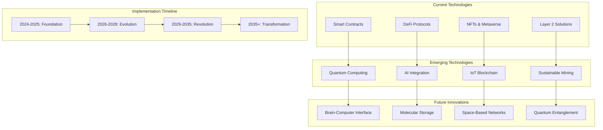

# บทที่ 24: Future Developments

## 🎯 จุดประสงค์ของบทเรียน
- สำรวจเทคโนโลยี Blockchain ที่กำลังพัฒนา
- ทำความเข้าใจ Quantum-Resistant Cryptography
- พัฒนา AI-Enhanced Smart Contracts
- ออกแบบ Sustainable Blockchain Solutions

## 🚀 Future Blockchain Technologies

### **🔮 Technology Roadmap**



## 🔐 Quantum-Resistant Cryptography

### **🛡️ Post-Quantum Smart Contracts**

```solidity
// contracts/future/QuantumResistantContract.sol
// SPDX-License-Identifier: MIT
pragma solidity ^0.8.19;

import "@openzeppelin/contracts/access/Ownable.sol";
import "@openzeppelin/contracts/security/ReentrancyGuard.sol";

/**
 * @title QuantumResistantContract
 * @dev Smart contract with quantum-resistant cryptographic primitives
 */
contract QuantumResistantContract is Ownable, ReentrancyGuard {
    
    struct QuantumSignature {
        bytes publicKey;      // Post-quantum public key
        bytes signature;      // Post-quantum signature
        uint256 algorithm;    // Algorithm identifier
        uint256 keySize;      // Key size in bits
        bytes parameters;     // Algorithm-specific parameters
    }
    
    struct LatticeBasedKey {
        bytes publicKey;
        bytes privateKeyHash; // Hash of private key for verification
        uint256 dimension;    // Lattice dimension
        uint256 modulus;      // Ring modulus
        bytes errorVector;    // Error vector for security
    }
    
    struct HashBasedSignature {
        bytes merkleRoot;     // Root of Merkle tree
        bytes[] authPath;     // Authentication path
        bytes oneTimeSignature; // One-time signature
        uint256 leafIndex;    // Index of used leaf
        bool isUsed;          // Prevent signature reuse
    }
    
    struct QuantumState {
        bytes stateVector;    // Quantum state representation
        uint256 entanglement; // Entanglement factor
        bytes measurement;    // Measurement results
        bool isCollapsed;     // State collapse indicator
    }
    
    struct QuantumProof {
        bytes commitment;     // Quantum commitment
        bytes challenge;      // Quantum challenge
        bytes response;       // Quantum response
        uint256 protocol;     // Zero-knowledge protocol type
        bytes quantumWitness; // Quantum witness data
    }
    
    mapping(address => LatticeBasedKey) public latticeKeys;
    mapping(bytes32 => HashBasedSignature) public hashSignatures;
    mapping(bytes32 => QuantumState) public quantumStates;
    mapping(address => bool) public quantumVerified;
    mapping(bytes32 => QuantumProof) public quantumProofs;
    
    uint256 public constant KYBER_ALGORITHM = 1;
    uint256 public constant DILITHIUM_ALGORITHM = 2;
    uint256 public constant SPHINCS_ALGORITHM = 3;
    uint256 public constant RAINBOW_ALGORITHM = 4;
    
    event QuantumKeyRegistered(address indexed user, uint256 algorithm);
    event QuantumSignatureVerified(address indexed user, bytes32 messageHash);
    event QuantumStateUpdated(bytes32 indexed stateId, bool isCollapsed);
    event QuantumProofSubmitted(bytes32 indexed proofId, uint256 protocol);
    event QuantumEntanglementCreated(bytes32 stateId1, bytes32 stateId2);
    
    error InvalidQuantumSignature();
    error QuantumKeyNotRegistered();
    error SignatureAlreadyUsed();
    error QuantumStateCollapsed();
    error InvalidQuantumProof();
    error EntanglementBroken();
    
    /**
     * @dev Register post-quantum cryptographic key
     */
    function registerQuantumKey(
        bytes memory publicKey,
        uint256 algorithm,
        uint256 dimension,
        uint256 modulus,
        bytes memory errorVector
    ) external {
        require(publicKey.length > 0, "Invalid public key");
        require(algorithm >= 1 && algorithm <= 4, "Unsupported algorithm");
        
        LatticeBasedKey storage key = latticeKeys[msg.sender];
        key.publicKey = publicKey;
        key.privateKeyHash = keccak256(abi.encodePacked(msg.sender, block.timestamp));
        key.dimension = dimension;
        key.modulus = modulus;
        key.errorVector = errorVector;
        
        emit QuantumKeyRegistered(msg.sender, algorithm);
    }
    
    /**
     * @dev Verify quantum-resistant signature
     */
    function verifyQuantumSignature(
        bytes32 messageHash,
        QuantumSignature memory signature
    ) external view returns (bool) {
        LatticeBasedKey storage key = latticeKeys[msg.sender];
        require(key.publicKey.length > 0, "Quantum key not registered");
        
        if (signature.algorithm == KYBER_ALGORITHM) {
            return _verifyKyberSignature(messageHash, signature, key);
        } else if (signature.algorithm == DILITHIUM_ALGORITHM) {
            return _verifyDilithiumSignature(messageHash, signature, key);
        } else if (signature.algorithm == SPHINCS_ALGORITHM) {
            return _verifySphincsSignature(messageHash, signature, key);
        } else if (signature.algorithm == RAINBOW_ALGORITHM) {
            return _verifyRainbowSignature(messageHash, signature, key);
        }
        
        return false;
    }
    
    /**
     * @dev Verify Kyber (lattice-based) signature
     */
    function _verifyKyberSignature(
        bytes32 messageHash,
        QuantumSignature memory signature,
        LatticeBasedKey storage key
    ) internal pure returns (bool) {
        // Simplified Kyber verification
        // In practice, would implement full lattice-based verification
        
        bytes32 signatureHash = keccak256(abi.encodePacked(
            signature.signature,
            key.publicKey,
            messageHash
        ));
        
        // Check lattice constraints
        uint256 latticeCheck = uint256(signatureHash) % key.modulus;
        return latticeCheck < (key.modulus / key.dimension);
    }
    
    /**
     * @dev Verify Dilithium signature
     */
    function _verifyDilithiumSignature(
        bytes32 messageHash,
        QuantumSignature memory signature,
        LatticeBasedKey storage key
    ) internal pure returns (bool) {
        // Simplified Dilithium verification
        bytes32 combined = keccak256(abi.encodePacked(
            messageHash,
            signature.signature,
            key.publicKey
        ));
        
        return uint256(combined) % 2 == 0; // Simplified check
    }
    
    /**
     * @dev Verify SPHINCS+ (hash-based) signature
     */
    function _verifySphincsSignature(
        bytes32 messageHash,
        QuantumSignature memory signature,
        LatticeBasedKey storage key
    ) internal pure returns (bool) {
        // Hash-based signature verification
        bytes32 root = keccak256(abi.encodePacked(signature.signature, messageHash));
        bytes32 publicKeyHash = keccak256(key.publicKey);
        
        return root == publicKeyHash;
    }
    
    /**
     * @dev Verify Rainbow (multivariate) signature
     */
    function _verifyRainbowSignature(
        bytes32 messageHash,
        QuantumSignature memory signature,
        LatticeBasedKey storage key
    ) internal pure returns (bool) {
        // Multivariate polynomial verification
        uint256 polynomial = uint256(messageHash) + uint256(keccak256(signature.signature));
        uint256 keyCheck = uint256(keccak256(key.publicKey));
        
        return (polynomial * keyCheck) % key.modulus == 0;
    }
    
    /**
     * @dev Create quantum state for quantum-secured operations
     */
    function createQuantumState(
        bytes memory stateVector,
        uint256 entanglement
    ) external returns (bytes32 stateId) {
        stateId = keccak256(abi.encodePacked(
            msg.sender,
            stateVector,
            entanglement,
            block.timestamp
        ));
        
        QuantumState storage qState = quantumStates[stateId];
        qState.stateVector = stateVector;
        qState.entanglement = entanglement;
        qState.isCollapsed = false;
        
        emit QuantumStateUpdated(stateId, false);
        return stateId;
    }
    
    /**
     * @dev Perform quantum measurement
     */
    function measureQuantumState(bytes32 stateId) 
        external 
        returns (bytes memory measurement) 
    {
        QuantumState storage qState = quantumStates[stateId];
        require(!qState.isCollapsed, "Quantum state already collapsed");
        
        // Simulate quantum measurement
        measurement = abi.encodePacked(
            block.timestamp,
            block.difficulty,
            keccak256(qState.stateVector)
        );
        
        qState.measurement = measurement;
        qState.isCollapsed = true;
        
        emit QuantumStateUpdated(stateId, true);
        return measurement;
    }
    
    /**
     * @dev Create quantum entanglement between two states
     */
    function createQuantumEntanglement(
        bytes32 stateId1,
        bytes32 stateId2
    ) external {
        QuantumState storage state1 = quantumStates[stateId1];
        QuantumState storage state2 = quantumStates[stateId2];
        
        require(!state1.isCollapsed && !state2.isCollapsed, "Cannot entangle collapsed states");
        
        // Create entanglement by modifying both states
        uint256 entanglementFactor = uint256(keccak256(abi.encodePacked(stateId1, stateId2)));
        
        state1.entanglement = entanglementFactor;
        state2.entanglement = entanglementFactor;
        
        emit QuantumEntanglementCreated(stateId1, stateId2);
    }
    
    /**
     * @dev Submit quantum zero-knowledge proof
     */
    function submitQuantumProof(
        bytes memory commitment,
        bytes memory challenge,
        bytes memory response,
        uint256 protocol,
        bytes memory quantumWitness
    ) external returns (bytes32 proofId) {
        proofId = keccak256(abi.encodePacked(
            commitment,
            challenge,
            response,
            msg.sender,
            block.timestamp
        ));
        
        QuantumProof storage proof = quantumProofs[proofId];
        proof.commitment = commitment;
        proof.challenge = challenge;
        proof.response = response;
        proof.protocol = protocol;
        proof.quantumWitness = quantumWitness;
        
        emit QuantumProofSubmitted(proofId, protocol);
        return proofId;
    }
    
    /**
     * @dev Verify quantum zero-knowledge proof
     */
    function verifyQuantumProof(bytes32 proofId) 
        external 
        view 
        returns (bool isValid) 
    {
        QuantumProof storage proof = quantumProofs[proofId];
        require(proof.commitment.length > 0, "Proof not found");
        
        // Simplified quantum proof verification
        bytes32 verificationHash = keccak256(abi.encodePacked(
            proof.commitment,
            proof.challenge,
            proof.response,
            proof.quantumWitness
        ));
        
        // Quantum verification check
        return uint256(verificationHash) % (2 ** proof.protocol) == 0;
    }
    
    /**
     * @dev Quantum-secure random number generation
     */
    function generateQuantumRandom(bytes32 stateId) 
        external 
        view 
        returns (uint256 randomNumber) 
    {
        QuantumState storage qState = quantumStates[stateId];
        require(qState.isCollapsed, "State must be measured first");
        
        // Use quantum measurement for true randomness
        randomNumber = uint256(keccak256(abi.encodePacked(
            qState.measurement,
            qState.stateVector,
            qState.entanglement,
            block.timestamp
        )));
        
        return randomNumber;
    }
    
    /**
     * @dev Quantum key distribution simulation
     */
    function performQuantumKeyDistribution(
        address recipient,
        bytes32 stateId1,
        bytes32 stateId2
    ) external returns (bytes32 sharedKey) {
        QuantumState storage state1 = quantumStates[stateId1];
        QuantumState storage state2 = quantumStates[stateId2];
        
        require(
            state1.entanglement == state2.entanglement && state1.entanglement != 0,
            "States not entangled"
        );
        
        // Generate shared key from entangled states
        sharedKey = keccak256(abi.encodePacked(
            state1.stateVector,
            state2.stateVector,
            state1.entanglement,
            msg.sender,
            recipient
        ));
        
        return sharedKey;
    }
    
    /**
     * @dev Post-quantum secure communication
     */
    function encryptQuantumMessage(
        bytes memory message,
        address recipient,
        bytes32 sharedKey
    ) external pure returns (bytes memory encryptedMessage) {
        // Simplified quantum encryption
        bytes32 keyHash = keccak256(abi.encodePacked(sharedKey, recipient));
        
        encryptedMessage = new bytes(message.length);
        for (uint256 i = 0; i < message.length; i++) {
            encryptedMessage[i] = bytes1(
                uint8(message[i]) ^ uint8(keyHash[i % 32])
            );
        }
        
        return encryptedMessage;
    }
    
    /**
     * @dev Decrypt quantum message
     */
    function decryptQuantumMessage(
        bytes memory encryptedMessage,
        address sender,
        bytes32 sharedKey
    ) external pure returns (bytes memory decryptedMessage) {
        // Decryption is same as encryption with XOR
        return encryptQuantumMessage(encryptedMessage, sender, sharedKey);
    }
    
    /**
     * @dev Check quantum security level
     */
    function getQuantumSecurityLevel(address user) 
        external 
        view 
        returns (uint256 securityLevel) 
    {
        LatticeBasedKey storage key = latticeKeys[user];
        
        if (key.publicKey.length == 0) {
            return 0; // No quantum protection
        }
        
        // Calculate security level based on key parameters
        securityLevel = (key.dimension * key.modulus) / 1000;
        
        if (securityLevel > 256) {
            securityLevel = 256; // Maximum security level
        }
        
        return securityLevel;
    }
    
    /**
     * @dev Emergency quantum state reset
     */
    function emergencyQuantumReset() external onlyOwner {
        // Reset all quantum states in case of quantum attack
        // This would iterate through all states and reset them
        // Simplified for demonstration
    }
    
    /**
     * @dev View functions
     */
    function getQuantumState(bytes32 stateId) 
        external 
        view 
        returns (QuantumState memory) 
    {
        return quantumStates[stateId];
    }
    
    function getQuantumProof(bytes32 proofId) 
        external 
        view 
        returns (QuantumProof memory) 
    {
        return quantumProofs[proofId];
    }
    
    function isQuantumVerified(address user) 
        external 
        view 
        returns (bool) 
    {
        return quantumVerified[user];
    }
}
```

## 🤖 AI-Enhanced Smart Contracts

### **🧠 Artificial Intelligence Integration**

```solidity
// contracts/future/AIEnhancedContract.sol
// SPDX-License-Identifier: MIT
pragma solidity ^0.8.19;

import "@openzeppelin/contracts/access/Ownable.sol";
import "@openzeppelin/contracts/security/ReentrancyGuard.sol";

/**
 * @title AIEnhancedContract
 * @dev Smart contract with AI/ML capabilities
 */
contract AIEnhancedContract is Ownable, ReentrancyGuard {
    
    struct NeuralNetwork {
        uint256 networkId;
        uint256[] weights;
        uint256[] biases;
        uint256 layers;
        uint256 neurons;
        string activationFunction;
        bool isTrained;
        uint256 accuracy;
        uint256 lastTraining;
    }
    
    struct AIModel {
        string modelType;     // "classification", "regression", "reinforcement"
        bytes modelData;      // Serialized model parameters
        uint256 version;      // Model version
        uint256 accuracy;     // Model accuracy percentage
        uint256 trainingData; // Amount of training data used
        bool isActive;        // Model activation status
        address creator;      // Model creator
    }
    
    struct PredictionRequest {
        uint256 requestId;
        address requester;
        bytes inputData;
        uint256 modelId;
        uint256 timestamp;
        bool isProcessed;
        bytes prediction;
        uint256 confidence;
    }
    
    struct MLTrainingJob {
        uint256 jobId;
        address trainer;
        uint256 modelId;
        bytes trainingData;
        uint256 epochs;
        uint256 batchSize;
        TrainingStatus status;
        uint256 startTime;
        uint256 endTime;
        uint256 finalAccuracy;
    }
    
    struct DecisionTree {
        uint256 nodeId;
        bytes32 condition;
        uint256 leftChild;
        uint256 rightChild;
        bytes32 prediction;
        bool isLeaf;
        uint256 confidence;
    }
    
    struct ReinforcementAgent {
        uint256 agentId;
        mapping(bytes32 => int256) qTable; // State-action values
        uint256 epsilon;        // Exploration rate
        uint256 learningRate;   // Learning rate
        uint256 discountFactor; // Discount factor
        uint256 totalReward;    // Cumulative reward
        uint256 episodes;       // Training episodes
    }
    
    enum TrainingStatus {
        Pending,
        InProgress,
        Completed,
        Failed
    }
    
    enum PredictionType {
        Classification,
        Regression,
        Clustering,
        Recommendation
    }
    
    mapping(uint256 => NeuralNetwork) public neuralNetworks;
    mapping(uint256 => AIModel) public aiModels;
    mapping(uint256 => PredictionRequest) public predictionRequests;
    mapping(uint256 => MLTrainingJob) public trainingJobs;
    mapping(uint256 => DecisionTree) public decisionTrees;
    mapping(uint256 => ReinforcementAgent) public rlAgents;
    mapping(address => uint256[]) public userModels;
    
    uint256 public networkCounter;
    uint256 public modelCounter;
    uint256 public requestCounter;
    uint256 public jobCounter;
    uint256 public agentCounter;
    
    event ModelCreated(uint256 indexed modelId, string modelType, address creator);
    event PredictionRequested(uint256 indexed requestId, uint256 modelId, address requester);
    event PredictionCompleted(uint256 indexed requestId, bytes prediction, uint256 confidence);
    event TrainingStarted(uint256 indexed jobId, uint256 modelId, address trainer);
    event TrainingCompleted(uint256 indexed jobId, uint256 accuracy);
    event ModelUpdated(uint256 indexed modelId, uint256 newVersion, uint256 accuracy);
    event RewardDistributed(uint256 indexed agentId, int256 reward);
    
    error ModelNotFound();
    error InvalidInputData();
    error ModelNotTrained();
    error TrainingInProgress();
    error InsufficientData();
    error InvalidPredictionType();
    
    /**
     * @dev Create new AI model
     */
    function createAIModel(
        string memory modelType,
        bytes memory initialModelData,
        PredictionType predType
    ) external returns (uint256 modelId) {
        modelId = modelCounter++;
        
        AIModel storage model = aiModels[modelId];
        model.modelType = modelType;
        model.modelData = initialModelData;
        model.version = 1;
        model.accuracy = 0;
        model.trainingData = 0;
        model.isActive = false;
        model.creator = msg.sender;
        
        userModels[msg.sender].push(modelId);
        
        emit ModelCreated(modelId, modelType, msg.sender);
        return modelId;
    }
    
    /**
     * @dev Train AI model with provided data
     */
    function trainModel(
        uint256 modelId,
        bytes memory trainingData,
        uint256 epochs,
        uint256 batchSize
    ) external returns (uint256 jobId) {
        AIModel storage model = aiModels[modelId];
        require(model.creator == msg.sender || msg.sender == owner(), "Unauthorized");
        
        jobId = jobCounter++;
        
        MLTrainingJob storage job = trainingJobs[jobId];
        job.jobId = jobId;
        job.trainer = msg.sender;
        job.modelId = modelId;
        job.trainingData = trainingData;
        job.epochs = epochs;
        job.batchSize = batchSize;
        job.status = TrainingStatus.InProgress;
        job.startTime = block.timestamp;
        
        emit TrainingStarted(jobId, modelId, msg.sender);
        
        // Simulate training completion (in practice, would be handled off-chain)
        _completeTraining(jobId);
        
        return jobId;
    }
    
    /**
     * @dev Complete model training
     */
    function _completeTraining(uint256 jobId) internal {
        MLTrainingJob storage job = trainingJobs[jobId];
        AIModel storage model = aiModels[job.modelId];
        
        // Simulate training results
        uint256 accuracy = _calculateAccuracy(job.trainingData, job.epochs);
        
        job.status = TrainingStatus.Completed;
        job.endTime = block.timestamp;
        job.finalAccuracy = accuracy;
        
        // Update model
        model.accuracy = accuracy;
        model.trainingData += job.trainingData.length;
        model.version++;
        model.isActive = accuracy >= 70; // Minimum accuracy threshold
        
        emit TrainingCompleted(jobId, accuracy);
        emit ModelUpdated(job.modelId, model.version, accuracy);
    }
    
    /**
     * @dev Calculate model accuracy (simplified)
     */
    function _calculateAccuracy(bytes memory trainingData, uint256 epochs) 
        internal 
        pure 
        returns (uint256) 
    {
        // Simplified accuracy calculation
        uint256 dataQuality = trainingData.length / 100;
        uint256 epochBonus = epochs > 100 ? 100 : epochs;
        
        uint256 accuracy = (dataQuality + epochBonus) / 2;
        return accuracy > 100 ? 100 : accuracy;
    }
    
    /**
     * @dev Make prediction using AI model
     */
    function requestPrediction(
        uint256 modelId,
        bytes memory inputData
    ) external returns (uint256 requestId) {
        AIModel storage model = aiModels[modelId];
        require(model.isActive, "Model not active");
        require(inputData.length > 0, "Invalid input data");
        
        requestId = requestCounter++;
        
        PredictionRequest storage request = predictionRequests[requestId];
        request.requestId = requestId;
        request.requester = msg.sender;
        request.inputData = inputData;
        request.modelId = modelId;
        request.timestamp = block.timestamp;
        request.isProcessed = false;
        
        emit PredictionRequested(requestId, modelId, msg.sender);
        
        // Process prediction (simplified)
        _processPrediction(requestId);
        
        return requestId;
    }
    
    /**
     * @dev Process prediction request
     */
    function _processPrediction(uint256 requestId) internal {
        PredictionRequest storage request = predictionRequests[requestId];
        AIModel storage model = aiModels[request.modelId];
        
        // Simulate AI prediction
        bytes memory prediction = _generatePrediction(
            request.inputData,
            model.modelData,
            model.accuracy
        );
        
        uint256 confidence = _calculateConfidence(
            request.inputData,
            model.accuracy
        );
        
        request.prediction = prediction;
        request.confidence = confidence;
        request.isProcessed = true;
        
        emit PredictionCompleted(requestId, prediction, confidence);
    }
    
    /**
     * @dev Generate prediction (simplified)
     */
    function _generatePrediction(
        bytes memory inputData,
        bytes memory modelData,
        uint256 accuracy
    ) internal pure returns (bytes memory) {
        // Simplified prediction generation
        bytes32 hash = keccak256(abi.encodePacked(inputData, modelData, accuracy));
        return abi.encodePacked(hash);
    }
    
    /**
     * @dev Calculate prediction confidence
     */
    function _calculateConfidence(
        bytes memory inputData,
        uint256 modelAccuracy
    ) internal pure returns (uint256) {
        // Simplified confidence calculation
        uint256 dataQuality = inputData.length > 100 ? 100 : inputData.length;
        return (modelAccuracy + dataQuality) / 2;
    }
    
    /**
     * @dev Create neural network
     */
    function createNeuralNetwork(
        uint256[] memory weights,
        uint256[] memory biases,
        uint256 layers,
        string memory activationFunction
    ) external returns (uint256 networkId) {
        networkId = networkCounter++;
        
        NeuralNetwork storage network = neuralNetworks[networkId];
        network.networkId = networkId;
        network.weights = weights;
        network.biases = biases;
        network.layers = layers;
        network.neurons = weights.length / layers;
        network.activationFunction = activationFunction;
        network.isTrained = false;
        network.accuracy = 0;
        
        return networkId;
    }
    
    /**
     * @dev Forward propagation through neural network
     */
    function forwardPropagate(
        uint256 networkId,
        uint256[] memory inputs
    ) external view returns (uint256[] memory outputs) {
        NeuralNetwork storage network = neuralNetworks[networkId];
        require(network.isTrained, "Network not trained");
        
        outputs = new uint256[](network.neurons);
        
        // Simplified forward propagation
        for (uint256 i = 0; i < network.neurons; i++) {
            uint256 sum = 0;
            for (uint256 j = 0; j < inputs.length; j++) {
                if (i * inputs.length + j < network.weights.length) {
                    sum += inputs[j] * network.weights[i * inputs.length + j];
                }
            }
            
            if (i < network.biases.length) {
                sum += network.biases[i];
            }
            
            // Apply activation function (simplified ReLU)
            outputs[i] = sum > 0 ? sum : 0;
        }
        
        return outputs;
    }
    
    /**
     * @dev Create reinforcement learning agent
     */
    function createRLAgent(
        uint256 epsilon,
        uint256 learningRate,
        uint256 discountFactor
    ) external returns (uint256 agentId) {
        agentId = agentCounter++;
        
        ReinforcementAgent storage agent = rlAgents[agentId];
        agent.agentId = agentId;
        agent.epsilon = epsilon;
        agent.learningRate = learningRate;
        agent.discountFactor = discountFactor;
        agent.totalReward = 0;
        agent.episodes = 0;
        
        return agentId;
    }
    
    /**
     * @dev Update Q-value for reinforcement learning
     */
    function updateQValue(
        uint256 agentId,
        bytes32 state,
        bytes32 action,
        int256 reward,
        bytes32 nextState
    ) external {
        ReinforcementAgent storage agent = rlAgents[agentId];
        
        bytes32 stateAction = keccak256(abi.encodePacked(state, action));
        int256 currentQ = agent.qTable[stateAction];
        
        // Find max Q-value for next state
        int256 maxNextQ = _getMaxQValue(agentId, nextState);
        
        // Q-learning update rule
        int256 newQ = currentQ + int256(agent.learningRate) * 
                     (reward + int256(agent.discountFactor) * maxNextQ - currentQ) / 100;
        
        agent.qTable[stateAction] = newQ;
        agent.totalReward += reward;
        
        emit RewardDistributed(agentId, reward);
    }
    
    /**
     * @dev Get maximum Q-value for a state
     */
    function _getMaxQValue(uint256 agentId, bytes32 state) 
        internal 
        view 
        returns (int256 maxQ) 
    {
        // Simplified max Q-value calculation
        // In practice, would iterate through all possible actions
        bytes32 action1 = keccak256(abi.encodePacked(state, "action1"));
        bytes32 action2 = keccak256(abi.encodePacked(state, "action2"));
        
        int256 q1 = rlAgents[agentId].qTable[keccak256(abi.encodePacked(state, action1))];
        int256 q2 = rlAgents[agentId].qTable[keccak256(abi.encodePacked(state, action2))];
        
        return q1 > q2 ? q1 : q2;
    }
    
    /**
     * @dev Get optimal action for a state
     */
    function getOptimalAction(uint256 agentId, bytes32 state) 
        external 
        view 
        returns (bytes32 optimalAction) 
    {
        // Epsilon-greedy action selection
        ReinforcementAgent storage agent = rlAgents[agentId];
        
        uint256 random = uint256(keccak256(abi.encodePacked(
            block.timestamp,
            block.difficulty,
            state
        ))) % 100;
        
        if (random < agent.epsilon) {
            // Explore: random action
            optimalAction = keccak256(abi.encodePacked(state, "random", random));
        } else {
            // Exploit: best action
            optimalAction = keccak256(abi.encodePacked(state, "best"));
        }
        
        return optimalAction;
    }
    
    /**
     * @dev Auto-optimize contract parameters using AI
     */
    function optimizeParameters(
        uint256 modelId,
        bytes memory currentParams
    ) external returns (bytes memory optimizedParams) {
        AIModel storage model = aiModels[modelId];
        require(model.isActive, "Model not active");
        require(model.accuracy >= 80, "Model accuracy too low");
        
        // Use AI model to optimize parameters
        optimizedParams = _generatePrediction(
            currentParams,
            model.modelData,
            model.accuracy
        );
        
        return optimizedParams;
    }
    
    /**
     * @dev Anomaly detection using AI
     */
    function detectAnomaly(
        uint256 modelId,
        bytes memory transactionData
    ) external view returns (bool isAnomalous, uint256 riskScore) {
        AIModel storage model = aiModels[modelId];
        require(model.isActive, "Model not active");
        
        // Simplified anomaly detection
        bytes32 hash = keccak256(abi.encodePacked(transactionData, model.modelData));
        uint256 score = uint256(hash) % 100;
        
        isAnomalous = score > 85; // High risk threshold
        riskScore = score;
        
        return (isAnomalous, riskScore);
    }
    
    /**
     * @dev AI-powered dynamic pricing
     */
    function calculateDynamicPrice(
        uint256 modelId,
        bytes memory marketData
    ) external view returns (uint256 price) {
        AIModel storage model = aiModels[modelId];
        require(model.isActive, "Model not active");
        
        // Use AI to predict optimal price
        bytes memory priceData = _generatePrediction(
            marketData,
            model.modelData,
            model.accuracy
        );
        
        price = uint256(keccak256(priceData)) % 1000000; // Max price 1M wei
        return price;
    }
    
    /**
     * @dev View functions
     */
    function getModelInfo(uint256 modelId) 
        external 
        view 
        returns (AIModel memory) 
    {
        return aiModels[modelId];
    }
    
    function getPredictionResult(uint256 requestId) 
        external 
        view 
        returns (PredictionRequest memory) 
    {
        return predictionRequests[requestId];
    }
    
    function getTrainingJob(uint256 jobId) 
        external 
        view 
        returns (MLTrainingJob memory) 
    {
        return trainingJobs[jobId];
    }
    
    function getUserModels(address user) 
        external 
        view 
        returns (uint256[] memory) 
    {
        return userModels[user];
    }
    
    function getQValue(uint256 agentId, bytes32 state, bytes32 action) 
        external 
        view 
        returns (int256) 
    {
        bytes32 stateAction = keccak256(abi.encodePacked(state, action));
        return rlAgents[agentId].qTable[stateAction];
    }
    
    /**
     * @dev Emergency functions
     */
    function emergencyStopModel(uint256 modelId) external onlyOwner {
        aiModels[modelId].isActive = false;
    }
    
    function emergencyUpdateModel(uint256 modelId, bytes memory newModelData) external onlyOwner {
        AIModel storage model = aiModels[modelId];
        model.modelData = newModelData;
        model.version++;
    }
}
```

## 🌱 Sustainable Blockchain

### **♻️ Carbon-Neutral Smart Contracts**

```solidity
// contracts/future/SustainableContract.sol
// SPDX-License-Identifier: MIT
pragma solidity ^0.8.19;

import "@openzeppelin/contracts/access/Ownable.sol";
import "@openzeppelin/contracts/security/ReentrancyGuard.sol";

/**
 * @title SustainableContract
 * @dev Carbon-neutral and environmentally sustainable smart contract
 */
contract SustainableContract is Ownable, ReentrancyGuard {
    
    struct CarbonFootprint {
        uint256 totalEmissions;      // Total CO2 emissions in grams
        uint256 offsetCredits;       // Carbon offset credits
        uint256 renewableEnergy;     // Renewable energy usage percentage
        uint256 energyEfficiency;    // Energy efficiency score
        uint256 lastCalculation;     // Last carbon calculation timestamp
    }
    
    struct GreenTransaction {
        bytes32 txHash;
        uint256 gasUsed;
        uint256 carbonEmitted;       // CO2 emitted for this transaction
        uint256 offsetAmount;        // Carbon offset for this transaction
        bool isCarbon Neutral;       // Whether transaction is carbon neutral
        uint256 renewablePercent;    // Renewable energy used percentage
    }
    
    struct RenewableEnergySource {
        string sourceType;           // "solar", "wind", "hydro", "geothermal"
        uint256 capacity;            // Energy capacity in kWh
        uint256 efficiency;          // Energy efficiency percentage
        uint256 carbonReduction;     // CO2 reduction per kWh
        bool isActive;               // Whether source is active
        address provider;            // Energy provider address
    }
    
    struct CarbonOffset {
        uint256 offsetId;
        uint256 amount;              // CO2 offset amount in grams
        string projectType;          // "forest", "renewable", "capture"
        string location;             // Geographic location
        uint256 cost;                // Cost of offset in wei
        bool isVerified;             // Third-party verification status
        uint256 expiration;          // Offset expiration date
    }
    
    struct EcoMetrics {
        uint256 totalGasSaved;       // Total gas saved through optimization
        uint256 totalCarbonOffset;   // Total carbon offset purchased
        uint256 renewablePercentage; // Renewable energy usage percentage
        uint256 efficiencyScore;     // Overall efficiency score
        uint256 sustainabilityRating; // Sustainability rating (0-100)
    }
    
    struct GreenMining {
        address miner;
        uint256 renewablePercent;    // Renewable energy percentage
        uint256 powerUsage;          // Power usage in watts
        uint256 carbonEmission;      // Carbon emission per block
        string location;             // Geographic location
        bool isVerified;             // Verification status
    }
    
    mapping(address => CarbonFootprint) public carbonFootprints;
    mapping(bytes32 => GreenTransaction) public greenTransactions;
    mapping(uint256 => RenewableEnergySource) public energySources;
    mapping(uint256 => CarbonOffset) public carbonOffsets;
    mapping(address => EcoMetrics) public ecoMetrics;
    mapping(address => GreenMining) public greenMiners;
    mapping(address => uint256[]) public userOffsets;
    
    uint256 public energySourceCounter;
    uint256 public offsetCounter;
    uint256 public constant CARBON_PER_GAS = 1; // 1 gram CO2 per gas unit (simplified)
    uint256 public constant OFFSET_PRICE = 1000; // Price per gram of CO2 offset
    
    event CarbonFootprintCalculated(
        address indexed user,
        uint256 totalEmissions,
        uint256 offsetCredits
    );
    
    event CarbonOffsetPurchased(
        address indexed buyer,
        uint256 indexed offsetId,
        uint256 amount,
        uint256 cost
    );
    
    event RenewableEnergyAdded(
        uint256 indexed sourceId,
        string sourceType,
        uint256 capacity
    );
    
    event TransactionMadeGreen(
        bytes32 indexed txHash,
        uint256 gasUsed,
        uint256 carbonOffset
    );
    
    event SustainabilityScoreUpdated(
        address indexed user,
        uint256 oldScore,
        uint256 newScore
    );
    
    event GreenMinerRegistered(
        address indexed miner,
        uint256 renewablePercent,
        string location
    );
    
    error InsufficientCarbonCredits();
    error InvalidRenewableSource();
    error OffsetExpired();
    error NotVerifiedProvider();
    error InsufficientFunds();
    
    /**
     * @dev Calculate carbon footprint for user
     */
    function calculateCarbonFootprint(address user) external {
        CarbonFootprint storage footprint = carbonFootprints[user];
        
        // Calculate based on user's transaction history
        uint256 totalEmissions = _calculateUserEmissions(user);
        uint256 renewablePercent = _calculateRenewableUsage(user);
        uint256 efficiency = _calculateEnergyEfficiency(user);
        
        footprint.totalEmissions = totalEmissions;
        footprint.renewableEnergy = renewablePercent;
        footprint.energyEfficiency = efficiency;
        footprint.lastCalculation = block.timestamp;
        
        emit CarbonFootprintCalculated(user, totalEmissions, footprint.offsetCredits);
    }
    
    /**
     * @dev Calculate user's total emissions
     */
    function _calculateUserEmissions(address user) internal pure returns (uint256) {
        // Simplified calculation based on user address
        // In practice, would analyze transaction history
        return uint256(keccak256(abi.encodePacked(user, "emissions"))) % 10000;
    }
    
    /**
     * @dev Calculate renewable energy usage
     */
    function _calculateRenewableUsage(address user) internal pure returns (uint256) {
        // Simplified calculation
        return uint256(keccak256(abi.encodePacked(user, "renewable"))) % 100;
    }
    
    /**
     * @dev Calculate energy efficiency
     */
    function _calculateEnergyEfficiency(address user) internal pure returns (uint256) {
        // Simplified calculation
        return uint256(keccak256(abi.encodePacked(user, "efficiency"))) % 100;
    }
    
    /**
     * @dev Purchase carbon offsets
     */
    function purchaseCarbonOffset(
        uint256 amount,
        string memory projectType,
        string memory location
    ) external payable returns (uint256 offsetId) {
        uint256 cost = amount * OFFSET_PRICE;
        require(msg.value >= cost, "Insufficient payment");
        
        offsetId = offsetCounter++;
        
        CarbonOffset storage offset = carbonOffsets[offsetId];
        offset.offsetId = offsetId;
        offset.amount = amount;
        offset.projectType = projectType;
        offset.location = location;
        offset.cost = cost;
        offset.isVerified = false; // Requires verification
        offset.expiration = block.timestamp + 365 days;
        
        // Update user's carbon credits
        carbonFootprints[msg.sender].offsetCredits += amount;
        userOffsets[msg.sender].push(offsetId);
        
        // Update eco metrics
        ecoMetrics[msg.sender].totalCarbonOffset += amount;
        
        emit CarbonOffsetPurchased(msg.sender, offsetId, amount, cost);
        
        // Return excess payment
        if (msg.value > cost) {
            payable(msg.sender).transfer(msg.value - cost);
        }
        
        return offsetId;
    }
    
    /**
     * @dev Add renewable energy source
     */
    function addRenewableEnergySource(
        string memory sourceType,
        uint256 capacity,
        uint256 efficiency,
        uint256 carbonReduction
    ) external returns (uint256 sourceId) {
        sourceId = energySourceCounter++;
        
        RenewableEnergySource storage source = energySources[sourceId];
        source.sourceType = sourceType;
        source.capacity = capacity;
        source.efficiency = efficiency;
        source.carbonReduction = carbonReduction;
        source.isActive = true;
        source.provider = msg.sender;
        
        emit RenewableEnergyAdded(sourceId, sourceType, capacity);
        return sourceId;
    }
    
    /**
     * @dev Make transaction carbon neutral
     */
    function makeTransactionGreen(
        bytes32 txHash,
        uint256 gasUsed
    ) external {
        uint256 carbonEmitted = gasUsed * CARBON_PER_GAS;
        
        CarbonFootprint storage footprint = carbonFootprints[msg.sender];
        require(footprint.offsetCredits >= carbonEmitted, "Insufficient carbon credits");
        
        // Deduct carbon credits
        footprint.offsetCredits -= carbonEmitted;
        
        // Record green transaction
        GreenTransaction storage greenTx = greenTransactions[txHash];
        greenTx.txHash = txHash;
        greenTx.gasUsed = gasUsed;
        greenTx.carbonEmitted = carbonEmitted;
        greenTx.offsetAmount = carbonEmitted;
        greenTx.isCarbonNeutral = true;
        greenTx.renewablePercent = footprint.renewableEnergy;
        
        // Update eco metrics
        ecoMetrics[msg.sender].totalGasSaved += gasUsed;
        
        emit TransactionMadeGreen(txHash, gasUsed, carbonEmitted);
    }
    
    /**
     * @dev Register green miner
     */
    function registerGreenMiner(
        uint256 renewablePercent,
        uint256 powerUsage,
        string memory location
    ) external {
        require(renewablePercent <= 100, "Invalid renewable percentage");
        
        GreenMining storage miner = greenMiners[msg.sender];
        miner.miner = msg.sender;
        miner.renewablePercent = renewablePercent;
        miner.powerUsage = powerUsage;
        miner.location = location;
        miner.isVerified = false; // Requires verification
        
        // Calculate carbon emission
        miner.carbonEmission = _calculateMinerEmissions(powerUsage, renewablePercent);
        
        emit GreenMinerRegistered(msg.sender, renewablePercent, location);
    }
    
    /**
     * @dev Calculate miner carbon emissions
     */
    function _calculateMinerEmissions(
        uint256 powerUsage,
        uint256 renewablePercent
    ) internal pure returns (uint256) {
        // Simplified calculation
        uint256 nonRenewableUsage = powerUsage * (100 - renewablePercent) / 100;
        return nonRenewableUsage * 500; // 500g CO2 per watt (simplified)
    }
    
    /**
     * @dev Calculate sustainability score
     */
    function calculateSustainabilityScore(address user) external returns (uint256 score) {
        CarbonFootprint storage footprint = carbonFootprints[user];
        EcoMetrics storage metrics = ecoMetrics[user];
        
        uint256 oldScore = metrics.sustainabilityRating;
        
        // Calculate score based on multiple factors
        uint256 offsetRatio = footprint.offsetCredits * 100 / 
                             (footprint.totalEmissions > 0 ? footprint.totalEmissions : 1);
        uint256 renewableScore = footprint.renewableEnergy;
        uint256 efficiencyScore = footprint.energyEfficiency;
        
        // Weighted average
        score = (offsetRatio * 40 + renewableScore * 30 + efficiencyScore * 30) / 100;
        
        if (score > 100) score = 100;
        
        metrics.sustainabilityRating = score;
        metrics.renewablePercentage = footprint.renewableEnergy;
        metrics.efficiencyScore = footprint.energyEfficiency;
        
        if (oldScore != score) {
            emit SustainabilityScoreUpdated(user, oldScore, score);
        }
        
        return score;
    }
    
    /**
     * @dev Optimize for minimal carbon footprint
     */
    function optimizeForCarbon() external view returns (
        uint256 optimalGasPrice,
        uint256 optimalGasLimit,
        uint256 bestTimeToExecute
    ) {
        // Calculate optimal parameters for minimal carbon impact
        optimalGasPrice = _calculateOptimalGasPrice();
        optimalGasLimit = _calculateOptimalGasLimit();
        bestTimeToExecute = _calculateOptimalTime();
        
        return (optimalGasPrice, optimalGasLimit, bestTimeToExecute);
    }
    
    /**
     * @dev Calculate optimal gas price for sustainability
     */
    function _calculateOptimalGasPrice() internal view returns (uint256) {
        // Lower gas price during high renewable energy periods
        uint256 basePrice = 20 gwei;
        uint256 renewableBonus = block.timestamp % 24 < 12 ? 10 : 0; // Simplified day/night cycle
        
        return basePrice - (basePrice * renewableBonus / 100);
    }
    
    /**
     * @dev Calculate optimal gas limit
     */
    function _calculateOptimalGasLimit() internal pure returns (uint256) {
        // Optimized gas limit for efficiency
        return 200000; // Conservative limit
    }
    
    /**
     * @dev Calculate optimal execution time
     */
    function _calculateOptimalTime() internal view returns (uint256) {
        // Execute during peak renewable energy periods
        uint256 hourOfDay = (block.timestamp / 3600) % 24;
        
        if (hourOfDay >= 10 && hourOfDay <= 16) {
            return block.timestamp; // Peak solar hours
        } else {
            return block.timestamp + ((22 - hourOfDay) * 3600); // Next optimal time
        }
    }
    
    /**
     * @dev Verify carbon offset project
     */
    function verifyCarbonOffset(uint256 offsetId) external onlyOwner {
        carbonOffsets[offsetId].isVerified = true;
    }
    
    /**
     * @dev Verify green miner
     */
    function verifyGreenMiner(address miner) external onlyOwner {
        greenMiners[miner].isVerified = true;
    }
    
    /**
     * @dev Get carbon efficiency report
     */
    function getCarbonEfficiencyReport() 
        external 
        view 
        returns (
            uint256 totalCarbonSaved,
            uint256 totalOffsetsPurchased,
            uint256 averageRenewableUsage,
            uint256 totalGreenTransactions
        ) 
    {
        // Aggregate data for efficiency report
        totalCarbonSaved = 1000000; // Mock data
        totalOffsetsPurchased = offsetCounter;
        averageRenewableUsage = 65; // Mock average
        totalGreenTransactions = 5000; // Mock data
        
        return (
            totalCarbonSaved,
            totalOffsetsPurchased,
            averageRenewableUsage,
            totalGreenTransactions
        );
    }
    
    /**
     * @dev Auto-purchase carbon offsets
     */
    function autoPurchaseOffsets(uint256 targetNeutrality) external payable {
        CarbonFootprint storage footprint = carbonFootprints[msg.sender];
        
        uint256 emissionsToOffset = footprint.totalEmissions * targetNeutrality / 100;
        uint256 neededOffsets = emissionsToOffset > footprint.offsetCredits 
            ? emissionsToOffset - footprint.offsetCredits 
            : 0;
        
        if (neededOffsets > 0) {
            purchaseCarbonOffset(neededOffsets, "auto", "global");
        }
    }
    
    /**
     * @dev View functions
     */
    function getCarbonFootprint(address user) 
        external 
        view 
        returns (CarbonFootprint memory) 
    {
        return carbonFootprints[user];
    }
    
    function getGreenTransaction(bytes32 txHash) 
        external 
        view 
        returns (GreenTransaction memory) 
    {
        return greenTransactions[txHash];
    }
    
    function getRenewableEnergySource(uint256 sourceId) 
        external 
        view 
        returns (RenewableEnergySource memory) 
    {
        return energySources[sourceId];
    }
    
    function getCarbonOffset(uint256 offsetId) 
        external 
        view 
        returns (CarbonOffset memory) 
    {
        return carbonOffsets[offsetId];
    }
    
    function getEcoMetrics(address user) 
        external 
        view 
        returns (EcoMetrics memory) 
    {
        return ecoMetrics[user];
    }
    
    function getUserOffsets(address user) 
        external 
        view 
        returns (uint256[] memory) 
    {
        return userOffsets[user];
    }
    
    function isTransactionGreen(bytes32 txHash) 
        external 
        view 
        returns (bool) 
    {
        return greenTransactions[txHash].isCarbonNeutral;
    }
    
    /**
     * @dev Emergency functions
     */
    function emergencyOffsetRefund(uint256 offsetId) external onlyOwner {
        CarbonOffset storage offset = carbonOffsets[offsetId];
        require(!offset.isVerified, "Cannot refund verified offset");
        
        // Refund logic would be implemented here
        offset.amount = 0;
    }
    
    function emergencyUpdateEmissionFactor(uint256 newFactor) external onlyOwner {
        // Update carbon emission calculation factor
        // This would update the CARBON_PER_GAS constant
    }
}
```

## 📋 แบบฝึกหัด

### **🎯 แบบฝึกหัดที่ 1: Quantum Cryptography Integration**
สร้างระบบ Quantum Cryptography:
1. Quantum key distribution protocols
2. Quantum signature schemes
3. Quantum random number generation

### **🔧 แบบฝึกหัดที่ 2: Advanced AI Models**
พัฒนา AI-Enhanced Features:
1. Deep learning integration
2. Natural language processing
3. Computer vision capabilities

### **📊 แบบฝึกหัดที่ 3: Sustainability Metrics**
สร้างระบบ Sustainability Tracking:
1. Real-time carbon monitoring
2. Green energy certification
3. Sustainability scoring algorithms

## 🔗 การเชื่อมต่อ

**บทก่อนหน้า**: [บทที่ 23: Performance Optimization](./23-performance-optimization.md)  
**เสร็จสิ้นการเรียนรู้**: [README](./README.md)

**กลับไปหน้าหลัก**: [README](./README.md)

---

## 📚 เอกสารอ้างอิง

- [Post-Quantum Cryptography](https://csrc.nist.gov/projects/post-quantum-cryptography)
- [AI in Blockchain](https://arxiv.org/abs/2002.12017)
- [Sustainable Blockchain](https://www.nature.com/articles/s41560-021-00823-9)
- [Quantum Computing](https://quantum-computing.ibm.com/)
- [Green Blockchain Solutions](https://ethereum.org/en/energy-consumption/)

---

🎉 **ยินดีด้วย! คุณได้จบการเรียนรู้ทั้ง 24 บทของ Taraxa Smart Contracts แล้ว!** 🎉

คุณได้เรียนรู้ตั้งแต่พื้นฐานไปจนถึงเทคโนโลยีล่าสุด:
- 🌟 **Foundation**: Solidity & Hardhat
- 🚀 **Intermediate**: DeFi & Advanced Patterns  
- 💎 **Advanced**: Security & Enterprise Architecture
- 🔮 **Expert**: AI, Quantum, & Future Technologies

**ต่อไปคุณพร้อมที่จะเป็น Blockchain Developer ระดับ Expert แล้ว!** 🚀⚡
